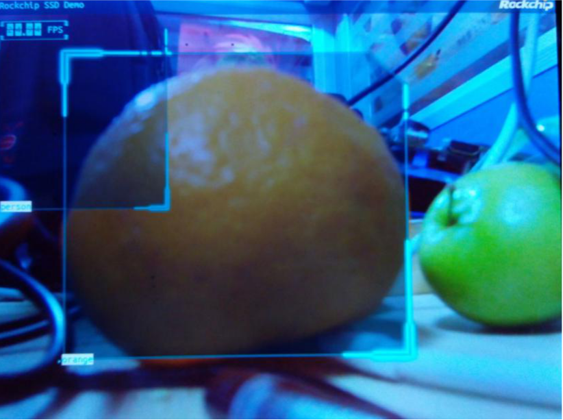

# Rockchip Linux RKNN Demo使用说明

文档标识：RK-SM-YF-344

发布版本：V1.0.0

作者邮箱：<wxt@rock-chips.com>

日期：2020-03-12

文件密级：□绝密   □秘密   □内部资料   ■公开

---

**免责声明**

本文档按“现状”提供，福州瑞芯微电子股份有限公司（“本公司”，下同）不对本文档的任何陈述、信息和内容的准确性、可靠性、完整性、适销性、特定目的性和非侵权性提供任何明示或暗示的声明或保证。本文档仅作为使用指导的参考。

由于产品版本升级或其他原因，本文档将可能在未经任何通知的情况下，不定期进行更新或修改。

**商标声明**

“Rockchip”、“瑞芯微”、“瑞芯”均为本公司的注册商标，归本公司所有。

本文档可能提及的其他所有注册商标或商标，由其各自拥有者所有。

**版权所有** **© 2019** **福州瑞芯微电子股份有限公司**

超越合理使用范畴，非经本公司书面许可，任何单位和个人不得擅自摘抄、复制本文档内容的部分或全部，并不得以任何形式传播。

福州瑞芯微电子股份有限公司

Fuzhou Rockchip Electronics Co., Ltd.

地址：     福建省福州市铜盘路软件园A区18号

网址：     www.rock-chips.com

客户服务电话： +86-4007-700-590

客户服务传真： +86-591-83951833

客户服务邮箱： fae@rock-chips.com

---

**前言**

**概述**

文档主要介绍 Rockchip Linux RKNN Demo使用说明，旨在帮助工程师更快上手RKNN Demo开发及相关调试方法。

**读者对象**

本文档（本指南）主要适用于以下工程师：

技术支持工程师

软件开发工程师

**各芯片系统支持状态**

| **芯片名称**    | **Buildroot** | **Debian** | **Yocto** |
| ----------- | :-------------- | :------------- | :---------- |
| RK1808  | Y               | Y              | N           |
| RK3399PRO      | Y               | Y              | N           |

## **修订记录**

| **日期**   | **版本** | **作者** | **修改说明** |
| ---------- | -------- | -------- | ------------ |
| 2018-12-08 | V0.0.1   | lhp   | 提交初始文档     |
| 2019-02-15 | V0.0.2   | lhp   | 同时支持1808和3399pro sdk     |
| 2019-06-05 | V0.0.2   | Caesar Wang   | 增加rknn_demo FAQ     |
| 2020-03-12 | V1.0.0   | Caesar Wang   | markdown初始版本     |

## **目录**

---
[TOC]
---

## RKNN Demo 运行

### 概述

RKNN Demo模块配置目录位于“<SDK>/buildroot/package/rockchip/rknn_demo”，代码位于“<SDK>/external/rknn_demo”。主要实现通过usb camera采集图像，送到NPU进行处理，并通过minigui显示相关结果。当前支持的模型为mobilenet_ssd。

### Buildroot中配置

SDK中默认已将需要配置使能，主要依赖的有rga和usbcamera。如果未开启，请到Buildroot中查看相关config的历史修改。因为rk1808和rk3399pro的rknn的接口和使用的模型不同，所以在配置文件中，会根据芯片型号进行配置，主要依据的为：BR2_PACKAGE_RK1808和BR2_PACKAGE_RK3399PRO。代码中会使用到宏“NEED_RKNNAPI”，如果是rk1808，则值为0，rk3399pro值为1。

### NPU相关

SDK中，相关模型文件已经默认编译到板子中。对应的文件宏和目录为：

```shell
#define MODEL_NAME           "/usr/share/rknn_demo/mobilenet_ssd.rknn"
#define BOX_PRIORS_TXT_PATH " /usr/share/rknn_demo/box_priors.txt"
#define LABEL_NALE_TXT_PATH " /usr/share/rknn_demo/coco_labels_list.txt"
```

模型运行起来前，请确保相关文件存在。

### 编译和运行

可以在SDK目录中，通过命令make rknn_demo进行模块编译，会生成rknn_demo执行文件。
拷贝到板子上，确保USB Camera已经插入，直接运行rknn_demo命令即可。
注意：请不要与其他的UI共存，在启动前，请把相关UI启动命令删除。板子默认有带QT，可以运行命令：/etc/init.d/S50launcher stop。
正常运行帧率在25~30fps左右，如果帧率不够，可能是usbcamera输入帧率不够，建议对着强光或者更换usbcamera。Usbcamera连接不稳定会导致运行异常，请保持稳定连接。
运行结果如下图：



## RKNN Demo开发

### 文件目录介绍

Config.in为配置文件，rknn_demo.mk为基本编译文件，资源的拷贝就是在这做的。具体命令可以查看RKNN_DEMO_INSTALL_TARGET_CMDS。
src/为代码目录，在src目录下，CMakeLists.txt为编译文件。可以在RKNN_DEMO_SRC中添加自己的文件进行编译。
rknn_camera.c为主文件，主要是用于启动minigui的主窗口和初始化模块。MiniGUIMain为主函数入口。rknn_ui_show为minigui创建主窗口。rknn_demo_init会进行启动两个线程：post和run。run主要进行图像的获取和npu的处理，并将结果发送到post线程中；post接收到npu的处理结果，进行后处理，并输出结果送给显示。
src/rknn/ssd为ssd相关处理文件。ssd.c中，ssd_run函数进行模型加载，通过cameraRun获取usbcamera的buf，并输出到注册函数ssd_camera_callback中。在ssd_camera_callback函数中，函数yuv_draw送视频数据到minigui层中，进行将视频数据和ui数据进行rga合成。YUV420toRGB24_RGA进行视频数据转换，将640*480的nv12格式转换成300*300的rgb888格式。
然后送到函数ssd_rknn_process进行处理。
src/ui/ssd为ssd的ui显示文件。函数caption_create绘制标题栏，并在caption_wnd_proc中进行显示；函数fps_create绘制帧率栏，并在fps_wnd_proc中进行显示；ssd_paint_object为物体框绘制栏，ssd的处理结果会送到这里进行显示。详细minigui的开发处理，可以参考相关开源资料。

## RKNN Demo FAQ

### 在HDMI的720p上Demo异常退出

```shell
[root@rk3399pro:/]# rknn_demo
librga:RGA_GET_VERSION:3.02,3.020000
ctx=0x2607c20,ctx->rgaFd=3
Rga built version:version:+2017-09-28 10:12:42
success build
set plane zpos = 3 (0~3)size = 3686476, g_bo.size = 4259840
size = 3686476, cur_bo->size = 2129920
size = 3686476, cur_bo->size = 2129920
size = 3686476, cur_bo->size = 2129920
NEWGAL: Video mode smaller than requested.
```

出现上面问题需要在Minigui那边加log定位下：

```diff
external/minigui$ git diff
diff --git a/src/newgal/video.c b/src/newgal/video.c
index f32197a..5641126 100644
--- a/src/newgal/video.c
+++ b/src/newgal/video.c
@@ -524,6 +524,8 @@ GAL_Surface * GAL_SetVideoMode (int width, int height, int bpp, Uint32 flags)

     GAL_VideoSurface = (mode != NULL) ? mode : prev_mode;

+    GAL_SetError("NEWGAL: mode->w=%d, mode->h=%d, width=%d, height=%d\n",mode->w, mode->h, width, height);
```

解决方法如下:

(1) 如何切换到不同类型显示屏
/external/minigui 现在默认取VOP0.(VOPB)来显示。需要保证显示设备(EDP/HDMI/MIPI..)是放在VOPB上。

(2) 如何切换到不同分辨率显示
现在RK3399PRO EVB上默认使用时2048x1536的分辨率.如果需要分辨率切换到1280x720，需要如下配置:
rknn_demo/minigui/MiniGUI-1280x720.cfg 和ui/ssd/ssd_ui.c 分辨率改为1280x720.

```diff
--- a/minigui/MiniGUI-1280x720.cfg
+++ b/minigui/MiniGUI-1280x720.cfg
@@ -48,7 +48,7 @@ defaultmode=800x600-32bpp
 #{{ifdef _MGGAL_SHADOW
 [shadow]
 real_engine=drmcon
-defaultmode=1280x720-16bpp
+defaultmode=720x1280-16bpp
 rotate_screen=ccw
 #}}

diff --git a/ui/ssd/ssd_ui.c b/ui/ssd/ssd_ui.c
index 8e9884d..310e682 100644
--- a/ui/ssd/ssd_ui.c
+++ b/ui/ssd/ssd_ui.c
@@ -15,8 +15,8 @@
 #define DST_W             300
 #define DST_H             300
 #if NEED_RKNNAPI
-#define DISP_W            2048
-#define DISP_H            1536
+#define DISP_W            720
+#define DISP_H            1280
```

然后在buildroot中package/rockchip/rknn_demo/rknn_demo.mk,做如下修改:

```diff
 ifeq ($(BR2_PACKAGE_RK3399PRO),y)
-RKNN_DEMO_MINIGUI_CFG=minigui/MiniGUI-2048x1536.cfg
+RKNN_DEMO_MINIGUI_CFG=minigui/MiniGUI-1280x720.cfg
 endif
```

最后external/rknn_demo和external/minigui两个仓库，需要重编或删除重新生成

```diff
rm buildroot/output/rockchip_rk3399pro_combine/build/rknn_demo-1.0.0/ -rf
rm buildroot/output/rockchip_rk3399pro_combine/build/rknn_demo-1.0.0/ -rf
./build.sh
```
