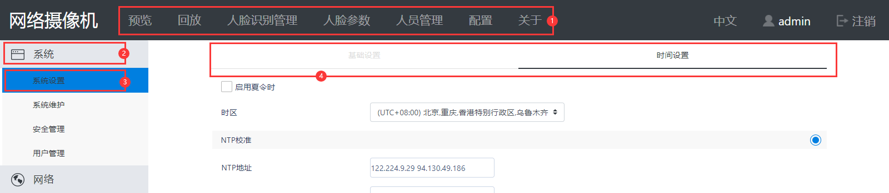

# Web开发指南

文件标识：RK-KF-YF-387

发布版本：V1.0.0

日期：2020-09-23

文件密级：□绝密   □秘密   □内部资料   ■公开

**免责声明**

本文档按“现状”提供，瑞芯微电子股份有限公司（“本公司”，下同）不对本文档的任何陈述、信息和内容的准确性、可靠性、完整性、适销性、特定目的性和非侵权性提供任何明示或暗示的声明或保证。本文档仅作为使用指导的参考。

由于产品版本升级或其他原因，本文档将可能在未经任何通知的情况下，不定期进行更新或修改。

**商标声明**

“Rockchip”、“瑞芯微”、“瑞芯”均为本公司的注册商标，归本公司所有。

本文档可能提及的其他所有注册商标或商标，由其各自拥有者所有。

**版权所有 © 2020 瑞芯微电子股份有限公司**

超越合理使用范畴，非经本公司书面许可，任何单位和个人不得擅自摘抄、复制本文档内容的部分或全部，并不得以任何形式传播。

瑞芯微电子股份有限公司

Rockchip Electronics Co., Ltd.

地址：     福建省福州市铜盘路软件园A区18号

网址：     [www.rock-chips.com](http://www.rock-chips.com)

客户服务电话： +86-4007-700-590

客户服务传真： +86-591-83951833

客户服务邮箱： [fae@rock-chips.com](mailto:fae@rock-chips.com)

---

**前言**

**概述**

本文提供Web前端以及部分Web常用功能的修改方法。

**产品版本**

| **芯片名称** | **内核版本** |
| ------------ | ------------ |
| RV1109，RV1126，RK1808，RK1806 | Linux 4.19 |

**读者对象**

本文档（本指南）主要适用于以下工程师：

技术支持工程师

软件开发工程师

**修订记录**

| **版本号** | **作者** | **修改日期** | **修改说明** |
| ---------- | --------| :--------- | ------------ |
| V1.0.0    | 陈茂森 | 2020-09-23 | 初始版本     |

---

**目录**

[TOC]

---

## 相关文档

以下为Web开发相关文档以及用途，以下文档所涉及内容本文将不重复说明，如有需要请直接查阅相关文档。

| **文档名** | **用途** |
| ---------- | --------|
| 《Rockchip_Developer_Guide_Linux_Application_Framework》 | Web以及相关应用的介绍，所需要的的环境<br>以及安装环境的问题解决 |
| 《Rockchip_Instructions_Linux_Web_Configuration》 | Web使用说明，包含**直连调试**的注意事项 |
| 《Rockchip_Instructions_Linux_CGI_API》 | Web前后端HTTP通讯的API以及参数介绍 |
| 《Rockchip_Instructions_Linux_DBTool》 | 数据库修改工具dbtool的使用，<br>以及web数据能力集与布局json的介绍 |

## 常见问题导航

| **修改** | **说明** |
| ---------- | --------|
| [导航栏修改](#nav) | 修改Web顶部导航栏                |
| [Web URL格式修改](#url) | 修改URL格式 |
| [基础信息修改](#修改系统基础设置信息) | 修改系统/系统设置/基础设置中信息 |
| [默认值修改](#modify-default) | 修改配置默认值                   |
| [关闭jwt验证](#关闭jwt验证) | 关闭web jwt验证，主要用于web 本地开发 |
| [数据库修改生效](#数据库修改生效) | 数据库修改后，需手动删除原有数据库 |

## Web布局修改

### Web布局图示



①头部导航栏

②一级侧边栏

③二级侧边栏

④选项卡

### WebPage定位说明

WebPage定位为json的嵌套结构，如header/preview，则为name为header的json对象的item中，name为preview的json对象，示例如下：

```shell
{
	name: header,
	item: [
		{
			name: preview,
			item: [],
			auth: 4,
		}
	],
	auth: 4
}
```

### <span id="nav">Web导航栏/选项卡删减</span>

Web导航栏/选项卡采用动态生成，对导航栏/选项卡的删减，需使用DBTool修改数据库中WebPage中对应项auth为-1即可。以下为各导航栏/选项卡在WebPage中的<span id="WebPage">映射关系</span>。

| **头部导航栏** | **一级侧边栏** | **二级侧边栏** | **选项卡** | WebPage定位 |
| ---------- | --------| ---------- | ---------- | ---------- |
| 预览 | \              | \ | \ | header/preview |
| 回放 | \              | \ | \ | header/download |
| 回放 | \ | \ | 录像 | header/download/videoRecord |
| 回放 | \ | \ | 截图 | header/download/pictureRecord |
| 人脸识别管理 | \          | \ | \ | header/face |
| 人脸识别管理 | 人员管理 | \ | \ | header/face/MemberList |
| 人脸识别管理 | 人员管理 | 人员清单 | \ | header/face/MemberList<br>/ListManagement |
| 人脸识别管理 | 人员管理 | 单人注册 | \ | header/face/MemberList<br>/AddOne |
| 人脸识别管理 | 人员管理 | 批量注册 | \ | header/face/MemberList<br>/BatchInput |
| 人脸识别管理 | 抓拍记录 | \ | \ | header/face/SnapShot |
| 人脸识别管理 | 抓拍记录 | 抓拍记录 | \ | header/face/SnapShot<br>/SnapShot |
| 人脸识别管理 | 控制记录 | \ | \ | header/face/Control |
| 人脸识别管理 | 控制记录 | 控制记录 | \ | header/face/Control<br>/Control |
| 人脸识别管理 | 配置信息 | \ | \ | header/face/Config |
| 人脸识别管理 | 配置信息 | 参数配置 | \ | header/face/Config<br>/ParaConfig|
| 人脸参数 | \              | \ | \ | header/face-para |
| 人脸参数 | 配置信息          | \ | \ | header/face-para/Config |
| 人脸参数 | 配置信息          | 参数配置 | \ | header/face-para/Config<br>/FacePara |
| 人脸参数 | 配置信息          | 人脸ROI | \ | header/face-para/Config<br>/ROI |
| 人员管理 | \              | \ | \ | header/face-manage |
| 人员管理 | 人员管理          | \ | \ | header/face-manage/Manage |
| 人员管理 | 人员管理          | 人员清单 | \ | header/face-manage/Manage<br>/MemberList |
| 人员管理 | 人员管理          | 单人注册 | \ | header/face-manage/Manage<br>/AddOne |
| 人员管理 | 人员管理          | 批量注册 | \ | header/face-manage/Manage<br>/BatchInput |
| 人员管理 | 人员管理          | 抓拍记录 | \ | header/face-manage/Manage<br>/SnapShot |
| 人员管理 | 人员管理          | 控制记录 | \ | header/face-manage/Manage<br>/Control |
| 配置 | \              | \ | \ | header/config |
| 配置 | 系统            | \ | \ | header/config/System |
| 配置 | 系统            | 系统设置 | \ | header/config/System<br>/Settings |
| 配置 | 系统            | 系统设置 | 基础设置 | header/config/System<br>/Settings/basic |
| 配置 | 系统            | 系统设置 | 时间设置 | header/config/System<br>/Settings/time |
| 配置 | 系统            | 系统维护 | \ | header/config/System<br>/Maintain |
| 配置 | 系统            | 系统维护 | 系统升级 | header/config/System<br>/Maintain/upgrade |
| 配置 | 系统            | 系统维护 | 日志 | header/config/System<br>/Maintain/log |
| 配置 | 系统            | 系统维护 | \ | header/config/System<br>/Maintain |
| 配置 | 系统            | 安全管理 | \ | header/config/System<br>/Security |
| 配置 | 系统            | 安全管理 | 认证 | header/config/System<br>/Security/authentication |
| 配置 | 系统            | 安全管理 | IP过滤 | header/config/System<br>/Security/ipAddrFilter |
| 配置 | 系统            | 安全管理 | 安全服务 | header/config/System<br>/Security/securityService |
| 配置 | 系统            | 用户管理 | \ | header/config/System<br>/User |
| 配置 | 网络            | \ | \ | header/config/Network |
| 配置 | 网络            | 基础设置 | \ | header/config/Network<br>/Basic |
| 配置 | 网络            | 基础设置 | TCPIP | header/config/Network<br>/Basic/TCPIP |
| 配置 | 网络            | 基础设置 | DDNS | header/config/Network<br>/Basic/DDNS |
| 配置 | 网络            | 基础设置 | PPPoE | header/config/Network<br>/Basic/PPPoE |
| 配置 | 网络            | 基础设置 | Port | header/config/Network<br>/Basic/Port |
| 配置 | 网络            | 基础设置 | uPnP | header/config/Network<br>/Basic/uPnP |
| 配置 | 网络            | 高级设置 | \ | header/config/Network<br>/Advanced |
| 配置 | 网络            | 高级设置 | Wi-Fi | header/config/Network<br>/Advanced/Wi-Fi |
| 配置 | 网络            | 高级设置 | SMTP | header/config/Network<br>/Advanced/SMTP |
| 配置 | 网络            | 高级设置 | FTP | header/config/Network<br>/Advanced/FTP |
| 配置 | 网络            | 高级设置 | eMail | header/config/Network<br>/Advanced/eMail |
| 配置 | 网络            | 高级设置 | Cloud | header/config/Network<br>/Advanced/Cloud |
| 配置 | 网络            | 高级设置 | Protocol | header/config/Network<br>/Advanced/Protocol |
| 配置 | 网络            | 高级设置 | QoS | header/config/Network<br>/Advanced/QoS |
| 配置 | 网络            | 高级设置 | Https | header/config/Network<br>/Advanced/Https |
| 配置 | 视频       | \ | \ | header/config/Video |
| 配置 | 视频       | 编码参数 | \ | header/config/Video<br>/Encoder |
| 配置 | 视频       | 高级编码 | \ | header/config/Video<br>/AdvancedEncoder |
| 配置 | 视频       | 兴趣区域 | \ | header/config/Video<br>/ROI |
| 配置 | 视频       | 区域裁剪 | \ | header/config/Video<br>/RegionCrop |
| 配置 | 音频       | \ | \ | header/config/Audio |
| 配置 | 音频     | 音频参数 | \ | header/config/Audio<br>/AudioParam |
| 配置 | 图像       | \ | \ | header/config/Image |
| 配置 | 图像       | 显示设置 | \ | header/config/Image<br>/DisplaySettings |
| 配置 | 图像       | OSD设置 | \ | header/config/Image<br>/OSDSettings |
| 配置 | 图像       | 隐私遮盖 | \ | header/config/Image<br>/PrivacyCover |
| 配置 | 图像       | 图片遮盖 | \ | header/config/Image<br>/PictureMask |
| 配置 | 事件       | \ | \ | header/config/Video/Event |
| 配置 | 事件       | 移动侦测 | \ | header/config/Event<br>/MotionDetect |
| 配置 | 事件       | 区域入侵 | \ | header/config/Event<br>/IntrusionDetection |
| 配置 | 事件       | 报警输入 | \ | header/config/Event<br>/AlarmInput |
| 配置 | 事件       | 报警输出 | \ | header/config/Event<br>/AlarmOutput |
| 配置 | 事件       | 异常 | \ | header/config/Event<br>/Abnormal |
| 配置 | 存储       | \ | \ | header/config/Storage |
| 配置 | 存储       | 计划配置 | \ | header/config/Storage<br>/PlanSettings |
| 配置 | 存储       | 计划配置 | 录像计划 | header/config/Storage<br>/PlanSettings/VideoPlan |
| 配置 | 存储       | 计划配置 | 抓图计划 | header/config/Storage<br>/PlanSettings/ScreenshotPlan |
| 配置 | 存储       | 计划配置 | 抓图参数 | header/config/Storage<br>/PlanSettings/ScreenshotPara |
| 配置 | 存储       | 存储管理 | \ | header/config/Storage<br>/StorageManage |
| 配置 | 存储       | 存储管理 | 硬盘管理 | header/config/Storage<br>/StorageManage/HardDiskManagement |
| 配置 | 存储       | 存储管理 | 网络硬盘 | header/config/Storage<br>/StorageManage/NAS |
| 配置 | 存储       | 存储管理 | 云存储 | header/config/Storage<br>/StorageManage/CloudStorage |
| 配置 | 智能分析       | \ | \ | header/config/Intel |
| 配置 | 智能分析       | 叠加与抓图 | \ | header/config/Intel<br>/MarkCover |
| 配置 | 智能分析       | 屏蔽区域 | \ | header/config/Intel<br>/MaskArea |
| 配置 | 智能分析       | 规则配置 | \ | header/config/Intel<br>/RuleSettings |
| 配置 | 智能分析       | 高级配置 | \ | header/config/Intel<br>/AdvancedCFG |
| 配置 | 外设       | \ | \ | header/config/Peripherals |
| 配置 | 外设       | 闸机 | \ | header/config/Peripherals<br>/GateConfig |
| 配置 | 外设       | 显示屏 | \ | header/config/Peripherals<br>/ScreenConfig |

**说明：未在上表列出内容，因绝大部分情况能力集固定，未使用动态生成，如需删减直接修改对应组件代码即可。**

### Web布局增加

新增导航，侧边栏选项，选项卡需要在响应组件注册的同时，使用dbtool在对应的[WebPage](#WebPage)添加。

## Web能力集修改

Web能力集通常是指Web Select中选项，以及输入数字的取值范围，这部分常修改的部分存储于数据库中，需使用DBTool修改对应能力集，修改方式，以及能力集规范见《Rockchip_Instructions_Linux_DBTool》。

**修改数据库能力集，步骤如下：**

1.使用[Web数据库对应关系](#WebDb)查找到的对应数据存储表名；

2.DBTool生成数据库对应的Json，并在该Json的SystemPara子项中检索表名；

3.若检索到对应表，则按DBTool文档规范修改能力集；

4.若未检索到对应表，则需在对应组件中修改ts以及html的能力集限制。

## <span id="modify-default">Web默认值修改</span>

### 检索条件默认值

Web检索条件默认值修改，需修改对应组件的检索条件group。

### 其他默认值

Web除检索条件外其他默认值均存储于数据库中，需根据如下对照关系修改对应数据库表格。

**以下采用类似json形式描述，嵌套关系按照[Web端布局](#Web布局图示)进行嵌套，即头部导航栏 -> 一级侧边栏->二级侧边栏->选项卡->实际功能**

<span id="WebDb">Web与数据库对应关系如下</span>：

```shell
"header": {
	"人脸识别管理": {
		"人员管理": {
			"人员清单": "FaceList"
		},
		"抓拍记录": {
			"抓拍记录": "FaceSnapshotRecord"
		},
		"控制记录": {
			"控制记录" "FaceControlRecord"
		},
		"配置信息": {
			"参数配置": "FaceConfig"
		}
	}
	"人脸参数": {
		"配置信息": {
			"参数配置": "FaceConfig",
			"人脸ROI": "FaceConfig"
		}
	},
	"人员管理": {
		"人员管理": {
			"人员清单": "FaceList",
			"抓拍记录"："FaceSnapshotRecord",
			"控制记录": "FaceControlRecord",
		}
	},
	"配置"：{
		"系统": {
			"系统设置": {
				"基础设置": "SystemDeviceInfo",
				"时间设置": {
					"ntp服务": "ntp",
					"时区/夏令时": "zone"
				}
			},
			"用户管理": "SystemUser"
		},
		"网络": {
			"基础设置": {
				"TCPIP": "NetworkIP",
				"Port": "port"
			},
			"高级设置": {
				"Wi-Fi": {
					"尝试连接过Wi-Fi的账号密码": "NetworkService",
					"Wi-Fi开关": "NetworkPower"
				},
				"FTP": "NetworkFTP"
			}
		},
		"视频": {
			"编码参数"："video",
			"高级编码": "video_advanced_enc",
			"兴趣区域": "roi",
			"区域裁剪": "video_region_clip"
		},
		"音频": "audio",
		"图像": {
			"显示设置": {
				"场景": "image_scenario",
				"图像调节": "image_adjustment",
				"曝光": "image_exposure",
				"日夜转换": "image_night_to_day",
				"背光": "image_blc",
				"白平衡": "image_white_blance",
				"图像增强": "image_enhancement",
				"视频调整": "image_video_adjustment"
			},
			"OSD设置": "osd",
			"隐私遮盖": "osd",
			"图片遮盖": "osd"
		},
		"事件": {
			"移动侦测": {
				"区域设置": "MoveDetection",
				"布防时间": "EventSchedules",
				"联动方式": "EventTriggers"
			}
			"区域入侵": {
				"区域设置": "RegionalInvasion",
				"布防时间": "EventSchedules",
				"联动方式": "EventTriggers"
			}
		},
		"存储": {
			"计划配置": {
				"录像计划": "EventSchedules",
				"抓图计划": "EventSchedules",
				"抓图参数": "StoragePlanSnap"
			},
			"存储管理": {
				"硬盘管理": {
					"默认分区/挂载": "StorageDiskPath"
				}
			}
		},
		"智能分析": {
			"叠加与抓图": "SmartCover"
		},
		"外设": {
			"闸机": {
				"继电器": "PeripheralsRelay",
				"韦根": "PeripheralsWeigen"
			}
			"显示屏": "PeripheralsFillLight"
		}
	}
}
```

## 常用实例

### <span id="url">请求URL修改</span>

默认Web请求URL格式为\<IP\>/cgi-bin/entry.cgi/\<request_path\>，如需修改cgi-bin/entry.cgi为\<NEED\>，可按以下方法操作：

1.nginx配置
方法①：修改SDK：nginx.conf文件，修改后 需重编固件烧入。

IPC产品路径：buildroot/board/rockchip/rv1126_rv1109/fs-overlay/etc/nginx/nginx.conf

闸机产品路径：buildroot/board/rockchip/rv1126_rv1109/fs-overlay-facial/etc/nginx/nginx.conf

方法②：修改板端 ：/etc/nginx/nginx.conf。
修改如下：

```shell
# 找到location设置，默认如下：
location /cgi-bin/ {
    gzip           off;
    root           /oem/www;
    fastcgi_pass   unix:/run/fcgiwrap.sock;
    fastcgi_index  entry.cgi;
    fastcgi_param  DOCUMENT_ROOT     /oem/www/cgi-bin;
    fastcgi_param  SCRIPT_NAME       /entry.cgi;
    include        fastcgi_params;
    set $path_info "";
    set $real_script_name $fastcgi_script_name;
    if ($fastcgi_script_name ~ "^(.+?\.cgi)(/.+)$") {
        set $real_script_name $1;
        set $path_info $2;
    }
    fastcgi_param PATH_INFO       $path_info;
    fastcgi_param SCRIPT_FILENAME $document_root$real_script_name;
    fastcgi_param SCRIPT_NAME     $real_script_name;
}
# 修改后如下，<NEED>为所需修改的字符串
location <NEED> { #修改标记
    gzip           off;
    root           /oem/www/cgi-bin; #此处为IPC产品模板，闸机产品需修改为对应cgi路径
    fastcgi_pass   unix:/run/fcgiwrap.sock;
    # fastcgi_index  entry.cgi; 此行删除
    fastcgi_param  DOCUMENT_ROOT     /oem/www/cgi-bin;
    fastcgi_param  SCRIPT_NAME       /<NEED>; #修改标记
    include        fastcgi_params;
    set $path_info "";
    set $real_script_name $fastcgi_script_name;
    if ($fastcgi_script_name ~ "^(.+?<NEED>)(/.+)$") { #修改标记
        set $real_script_name $1;
        set $path_info $2;
    }
    fastcgi_param PATH_INFO       $path_info;
    fastcgi_param SCRIPT_FILENAME $document_root$real_script_name;
    fastcgi_param SCRIPT_NAME     $real_script_name;
}
```

2.重命名entry.cgi
方法①修改SDK：buildroot/package/rockchip/ipcweb-backend/ipcweb-backend.mk，修改后make ipcweb-backend-dirclean && make ipcweb-backend重编后端，再重编oem烧写。
修改方法如下：

```shell
# 找到INSTALL指令进行修改
define IPCWEB_BACKEND_INSTALL_TARGET_CMDS
	rm -rf $(BASE_DIR)/oem/www
	cp -rfp $(@D)/www $(BASE_DIR)/oem
	mkdir -p $(BASE_DIR)/oem/www/cgi-bin/
	# 原：cp -rfp $(@D)/src/entry.cgi $(BASE_DIR)/oem/www/cgi-bin/
	cp -rfp $(@D)/src/entry.cgi $(BASE_DIR)/oem/www/cgi-bin/<NEED>
endef
else
define IPCWEB_BACKEND_INSTALL_TARGET_CMDS
	rm -rf $(TARGET_DIR)/usr/www
	cp -rfp $(@D)/www $(TARGET_DIR)/usr
	mkdir -p  $(TARGET_DIR)/usr/www/cgi-bin/
	# 原：cp -rfp $(@D)/src/entry.cgi $(TARGET_DIR)/usr/www/cgi-bin/
	cp -rfp $(@D)/src/entry.cgi $(TARGET_DIR)/usr/www/cgi-bin/<NEED>
endef
```

方法②重命名板端：/oem/www/cgi-bin/entry.cgi 为\<NEED\>。

### 修改系统基础设置信息

系统/系统设置/基础设置中的信息存储于SystemDeviceInfo数据库表中，需使用DBTool进行相应修改。

以下为个表项含义：

| **表项** | **含义**                      |
| -------- | ----------------------------- |
| id       | 数据库编号                    |
| name     | 信息名                        |
| value    | 信息内容                      |
| ro       | 只读，true为只读，false为可写 |

以下介绍该表各个信息与web系统基础设置信息的映射关系。

| **数据库信息名** | **Web信息名** |
| ---------------- | ------------- |
| deviceName       | 设备名称       |
| telecontrolID    | 设备编号       |
| model            | 设备型号       |
| serialNumber     | 设备序列号     |
| firmwareVersion  | 主控版本       |
| encoderVersion   | 编码版本       |
| webVersion       | Web版本       |
| pluginVersion    | Plugin版本    |
| channelsNumber   | 通道个数       |
| hardDisksNumber  | 硬盘个数       |
| alarmInputsNumber | 报警输入个数   |
| alarmOutputsNumber | 报警输出个数  |
| firmwareVersionInfo |主控版本属性  |
| manufacturer     | 制造商         |
| hardwareId       | 硬件编号       |

### 关闭jwt验证

jwt验证要求，除用户登录外的web操作均需要携带token，否则操作将被拒绝，关闭jwt操作如下：

```shell
# 在SDK根目录或buildroot目录下
make menuconfig
# 检索模式
/
# 检索jwt
jwt
# 输入对应编号，进入编译选项修改界面，并取消jwt编译选项，保存并退出
# 在SDK根目录下
make ipcweb-backend-dirclean; make ipcweb-backend
# 重编oem烧入
make rk_oem-dirclean && make rk_oem target-finalize
./mkfirmware.sh
```

### 数据库修改生效

使用DBTool修改数据库后，要使修改生效，需删除原有数据库，删除方法如下

```shell
# 方法一：
# 将修改后的db根据产品放于对应路径
/device/rockchip/oem/oem_ipc/sysconfig-2K.db # 2K分辨率IPC产品
/device/rockchip/oem/oem_ipc/sysconfig-4K.db # 4K分辨率IPC产品
/device/rockchip/oem/oem_ipc/sysconfig-1080P.db # 1080P分辨率IPC产品
/device/rockchip/oem/oem_facial_gate/sysconfig.db # 闸机产品
# 重编oem, 并重烧userdata
make rk_oem-dirclean && make rk_oem target-finalize
./mkfirmware.sh

# 方法二：
# 将修改好的数据命名为sysconfig.db，并推到设备端如下路径
/data/sysconfig.db
```