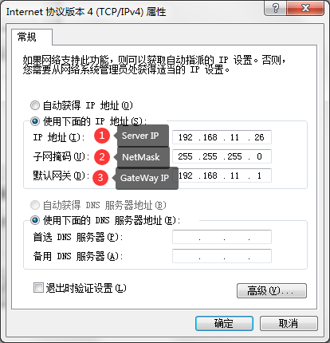
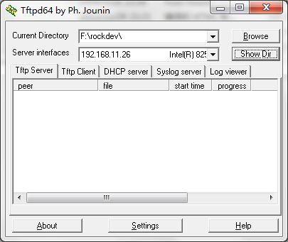
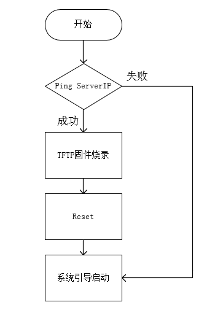
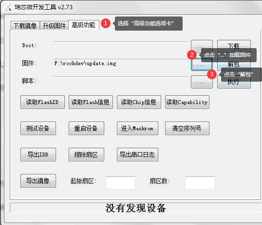

# Rockchip U-Boot TFTP升级开发指南

文件标识：RK-SM-YF-389

发布版本：V1.0.0

日期：2020-10-10

文件密级：□绝密   □秘密   □内部资料   ■公开

**免责声明**

本文档按“现状”提供，瑞芯微电子股份有限公司（“本公司”，下同）不对本文档的任何陈述、信息和内容的准确性、可靠性、完整性、适销性、特定目的性和非侵权性提供任何明示或暗示的声明或保证。本文档仅作为使用指导的参考。

由于产品版本升级或其他原因，本文档将可能在未经任何通知的情况下，不定期进行更新或修改。

**商标声明**

“Rockchip”、“瑞芯微”、“瑞芯”均为本公司的注册商标，归本公司所有。

本文档可能提及的其他所有注册商标或商标，由其各自拥有者所有。

**版权所有© 2020 瑞芯微电子股份有限公司**

超越合理使用范畴，非经本公司书面许可，任何单位和个人不得擅自摘抄、复制本文档内容的部分或全部，并不得以任何形式传播。

瑞芯微电子股份有限公司

Rockchip Electronics Co., Ltd.

地址：     福建省福州市铜盘路软件园A区18号

网址：     www.rock-chips.com

客户服务电话： +86-4007-700-590

客户服务传真： +86-591-83951833

客户服务邮箱： fae@rock-chips.com

---

**前言**

 **概述**

 本文主要描述了U-Boot中使用TFTP进行系统固件升级的方法和开发注意事项。

**产品版本**

| **芯片名称** | **U-Boot版本** |
| ------------ | -------------- |
| ALL          | next-dev分支   |

**读者对象**

本文档（本指南）主要适用于以下工程师：

​        技术支持工程师

​        软件开发工程师

 **修订记录**

| **日期**   | **版本** | **作者**  | **修改说明** |
| ---------- | -------- | :-------- | ------------ |
| 2020-10-12 | V1.0.0   | Hans Yang | 初始版本     |

---

**目录**

[TOC]

---

## 基本介绍

使用U-Boot下载固件或文件除了通过USB、SD卡等存储设备外，最快捷的方法是通过网络传输。为了这一目的，U-Boot实现了TFTP协议。以下我们将介绍U-Boot中如何启用TFTP，并完成固件升级的功能实现。

## U-Boot配置

### 以太网驱动

U-Boot defconfig配置，可参考RV1126配置：configs/rv1126_defconfig

```c
CONFIG_DM_ETH=y
CONFIG_DM_ETH_PHY=y
CONFIG_DWC_ETH_QOS=y
CONFIG_GMAC_ROCKCHIP=y
```

dwc_eth_qos 驱动需要配置 nocache memory，可参考 RV1126配置：

```diff
diff --git a/include/configs/rv1126_common.h b/include/configs/rv1126_common.h
index 933917f3f0..9d70795fb8 100644
--- a/include/configs/rv1126_common.h
+++ b/include/configs/rv1126_common.h
@@ -50,6 +50,7 @@
 #define CONFIG_SYS_SDRAM_BASE          0
 #define SDRAM_MAX_SIZE                 0xfd000000

+#define CONFIG_SYS_NONCACHED_MEMORY    (1 << 20)       /* 1 MiB */
 #ifndef CONFIG_SPL_BUILD
```

### cmd配置

可手动menuconfig选上如下配置：

```
-> Command line interface
-> Network commands
[*] bootp, tftpboot
[*] tftp put
[*] tftp download and bootm
[*] tftp download and flash
```

U-Boot defconfig配置，可参考RV1126配置：configs/rv1126_defconfig

```
CONFIG_CMD_TFTPPUT=y
CONFIG_CMD_TFTP_BOOTM=y
CONFIG_CMD_TFTP_FLASH=y
```

### DTS 配置

DTS 节点与 kernel 一样，需要关注的是以下板级相关的属性配置：

- phy 接口配置(phy-mode)
- phy 复位脚与复位时间(snps,reset-gpio) (snps,reset-delays-us)
- 针对主控的时钟输出方向(clock_in_out)
- 时钟源选择与频率设定(assigned-clock-parents) (assigned-clock-rates)
- RGMII Delayline， RGMII 接口需要(tx_delay) (rx_delay)

可参考RV1126配置：arch/arm/dts/rv1126-u-boot.dtsi

```c
&gmac {
	phy-mode = "rgmii";
	clock_in_out = "input";

	snps,reset-gpio = <&gpio3 RK_PA0 GPIO_ACTIVE_LOW>;
	snps,reset-active-low;
	/* Reset time is 20ms, 100ms for rtl8211f */
	snps,reset-delays-us = <0 20000 100000>;

	assigned-clocks = <&cru CLK_GMAC_SRC>, <&cru CLK_GMAC_TX_RX>, <&cru CLK_GMAC_ETHERNET_OUT>;
	assigned-clock-parents = <&cru CLK_GMAC_SRC_M1>, <&cru RGMII_MODE_CLK>;
	assigned-clock-rates = <125000000>, <0>, <25000000>;

	pinctrl-names = "default";
	pinctrl-0 = <&rgmiim1_pins &clk_out_ethernetm1_pins>;

	tx_delay = <0x2a>;
	rx_delay = <0x1a>;

	phy-handle = <&phy>;
	status = "okay";
};
```

### 网络信息配置

为了方便找到TFTP服务端，需要配置设备IP、服务端IP、默认网关IP，可在代码中添加申明定义，可参考RV1126配置：include/configs/rv1126_common.h。如需自动完成TFTP烧录，请在代码中配置好网络信息。

```diff
diff --git a/include/configs/rv1126_common.h b/include/configs/rv1126_common.h
index a6307ebcc7..f293c87286 100644
--- a/include/configs/rv1126_common.h
+++ b/include/configs/rv1126_common.h
@@ -25,6 +25,11 @@
 #define CONFIG_SYS_LOAD_ADDR           0x00C00800
 #define CONFIG_SYS_BOOTM_LEN           (64 << 20)

+#define CONFIG_IPADDR          192.168.11.254  //设备IP
+#define CONFIG_SERVERIP        192.168.11.26   //服务端IP
+#define CONFIG_GATEWAYIP       192.168.11.1    //网关IP
+#define CONFIG_NETMASK         255.255.255.0   //子网掩码
```

也可以通过命令行设置以上信息：

```shell
set ipaddr 192.168.11.254
set serverip 192.168.11.26
set gatewayip 192.168.11.1
set netmask 255.255.255.0
```

## TFTP固件升级

### 服务端配置

电脑的主机需要配置好对应的网络信息，以保证设备端可以与服务端进行通信（需与代码中配置一致）：

1. Server IP 服务端IP地址
2. NetMask 子网掩码
3. GateWay IP 网关IP地址



### 服务端TFTP工具配置

打开工具，选择Tftp Server选项卡， 确认服务端的IP和固件所在的目录配置正确。



### 设备端使用TFTP升级固件

#### 命令行测试

##### Step1 进入命令行

开机，键盘长按Ctrl+C，可进入U-Boot命令行模式

```shell
=> <INTERRUPT>
=> <INTERRUPT>
=> <INTERRUPT>
=>
```

##### Step2 检查网络配置

1. 查看设备端网络信息配置是否符合预期

   ```shell
   => printenv
   ...
   gatewayip=192.168.11.1
   ipaddr=192.168.11.254
   netmask=255.255.255.0
   serverip=192.168.11.26
   ...
   ```

2. 查看与服务端通信是否正常

   ```shell
   => ping 192.168.11.26
   ethernet@ffc40000 Waiting for PHY auto negotiation to complete. done
   Using ethernet@ffc40000 device
   host 192.168.11.26 is alive
   ```

   打印`is alive`表示设备与服务端网络通信正常

##### Step3 通过TFTP下载固件

```shell
=> tftpflash 0x20000000 uboot.img uboot
=> tftpflash 0x20000000 misc.img misc
=> tftpflash 0x20000000 rootfs.img rootfs
=> tftpflash 0x20000000 boot.img boot
=> tftpflash 0x20000000 recovery.img recovery
=> tftpflash 0x20000000 oem.img oem
=> tftpflash 0x20000000 userdata.img userdata
```

命令参数说明

```
Usage:
tftpflash [loadAddress] [[hostIPaddr:]bootfilename] [partition]
```

每个分区升级成功会打印如下信息

```shell
=> tftpflash 0x20000000 uboot.img uboot
ethernet@ffc40000 Waiting for PHY auto negotiation to complete. done
Using ethernet@ffc40000 device
TFTP from server 192.168.11.26; our IP address is 192.168.11.254
Filename 'uboot.img'.
Load address: 0x20000000
Loading: #################################################################
         #################################################################
         #################################################################
         #################################################################
         ##########################
         479.5 KiB/s
done
Bytes transferred = 4194304 (400000 hex)
## TFTP flash uboot.img to partititon 'uboot' size 0x400000 ... OK
```

##### Step4 重启设备

```shell
=> reset
```

#### 开机自动检查升级（分立固件）

##### Step1 U-Boot启动命令修改

U-Boot启动最终会调用到RKIMG_BOOTCOMMAND，我们添加TFTP_DOWNLOAD_COMMAND，用来做固件的烧录

```diff
diff --git a/include/configs/rv1126_common.h b/include/configs/rv1126_common.h
index a6307ebcc7..f308095159 100644
--- a/include/configs/rv1126_common.h
+++ b/include/configs/rv1126_common.h
@@ -62,6 +69,15 @@
 #define CONFIG_USB_FUNCTION_MASS_STORAGE
 #define CONFIG_ROCKUSB_G_DNL_PID       0x110b

+#define TFTP_DOWNLOAD_COMMAND          \
+       "tftpflash 0x20000000 uboot.img uboot;"                 \
+       "tftpflash 0x20000000 misc.img misc;"                   \
+       "tftpflash 0x20000000 rootfs.img rootfs;"               \
+       "tftpflash 0x20000000 boot.img boot;"                   \
+       "tftpflash 0x20000000 recovery.img recovery;"           \
+       "tftpflash 0x20000000 oem.img oem;"                     \
+       "tftpflash 0x20000000 userdata.img userdata;"
+
 #define ENV_MEM_LAYOUT_SETTINGS                \
        "scriptaddr=0x00000000\0"       \
        "pxefile_addr_r=0x00100000\0"   \
@@ -84,8 +100,12 @@
        "boot_fit;"
 #else
 #define RKIMG_BOOTCOMMAND              \
-       "boot_fit;"                     \
-       "boot_android ${devtype} ${devnum};"
+       "if ping ${serverip}; then ;"   \
+       TFTP_DOWNLOAD_COMMAND   \
+       "reset;"   \
+       "else;" \
+       "boot_fit;"             \
+       "boot_android ${devtype} ${devnum};"    \
+       "fi;"
```

> 注意：需要结合产品实际调整分区镜像及分区名

自动检测升级流程如下：



##### Step2 优化Ping接连失败的时间

由于自动升级是基于服务端联通且有升级包的基础上才能完成的流程，正常开机时，也需要判断服务端是否联通，需要优化ping操作的时间。

```diff
diff --git a/include/configs/rv1126_common.h b/include/configs/rv1126_common.h
index a6307ebcc7..f308095159 100644
--- a/include/configs/rv1126_common.h
+++ b/include/configs/rv1126_common.h
@@ -25,6 +25,13 @@
 #define CONFIG_SYS_LOAD_ADDR           0x00C00800
 #define CONFIG_SYS_BOOTM_LEN           (64 << 20)

+#define CONFIG_ARP_TIMEOUT  200UL
```

##### Step3 测试验证

1. 服务端连接失败，正常启动

```shell
ethernet@ffc40000 Waiting for PHY auto negotiation to complete. done
Using ethernet@ffc40000 device

ARP Retry count exceeded; starting again
ping failed; host 192.168.11.26 is not alive
## Booting FIT Image at 0x3b53a580 with size 0x005bc800
```

2. 服务端连接正常，升级固件后，正常启动

```shell
ethernet@ffc40000 Waiting for PHY auto negotiation to complete. done
Using ethernet@ffc40000 device
host 192.168.11.26 is alive
ethernet@ffc40000 Waiting for PHY auto negotiation to complete. done
Using ethernet@ffc40000 device
TFTP from server 192.168.11.26; our IP address is 192.168.11.254
Filename 'uboot.img'.
Load address: 0x20000000
Loading: #################################################################
         #################################################################
         #################################################################
         #################################################################
         ##########################
         1.1 MiB/s
done
Bytes transferred = 4194304 (400000 hex)
## TFTP flash uboot.img to partititon 'uboot' size 0x400000 ... OK
......
分区镜像升级
......
ethernet@ffc40000 Waiting for PHY auto negotiation to complete. done
Using ethernet@ffc40000 device
TFTP from server 192.168.11.26; our IP address is 192.168.11.254
Filename 'userdata.img'.
Load address: 0x20000000
Loading: #################################################################
         #################################################################
         #################################################################
         #################################################################
         #################################################################
         #################################
         1 MiB/s
done
Bytes transferred = 5242880 (500000 hex)
## TFTP flash userdata.img to partititon 'userdata' size 0x500000 ... OK
## Booting FIT Image at 0x3b53a580 with size 0x005bc800
```

##### Step4 升级成功

升级成功后，系统会自动重启，请断开TFTP服务端，以防设备重新升级。

## 常见问题说明

### 服务端网络无法连通

```shell
ethernet@ffc40000 Waiting for PHY auto negotiation to complete. done
Using ethernet@ffc40000 device

ARP Retry count exceeded; starting again
ping failed; host 192.168.11.26 is not alive
```

### 服务端TFTP服务未启动

```shell
ethernet@ffc40000 Waiting for PHY auto negotiation to complete. done
Using ethernet@ffc40000 device
host 192.168.11.26 is alive
ethernet@ffc40000 Waiting for PHY auto negotiation to complete. done
Using ethernet@ffc40000 device
TFTP from server 192.168.11.26; our IP address is 192.168.11.254
Filename 'uboot.img'.
Load address: 0x20000000
Loading: *
TFTP server died; starting again
```

### 服务端文件路径配置错误或文件不存在

```shell
ethernet@ffc40000 Waiting for PHY auto negotiation to complete. done
Using ethernet@ffc40000 device
host 192.168.11.26 is alive
ethernet@ffc40000 Waiting for PHY auto negotiation to complete. done
Using ethernet@ffc40000 device
TFTP from server 192.168.11.26; our IP address is 192.168.11.254
Filename 'uboot.img'.
Load address: 0x20000000
Loading: *
TFTP error: 'File not found' (1)
Not retrying...
```

### update.img如何转成分立的镜像文件

1. 可通过Linux环境下脚本工具解包update.img为分立的镜像文件

- 工具：tools/linux/Linux_Pack_Firmware/rockdev/unpack.sh

- 使用方法：将update.img放置于unpack.sh脚本同级目录，执行以下命令解包

```
./unpack.sh
```

2. 可使用Windows环境下瑞芯微开发工具解包update.img为分立的镜像文件

- 工具：tools/windows/RKDevTool/RKDevTool_Release/RKDevTool.exe
- 使用方法：选择`高级功能`选项卡，固件栏`...`选择对应update.img，点击`解包`按钮，即可解包固件

