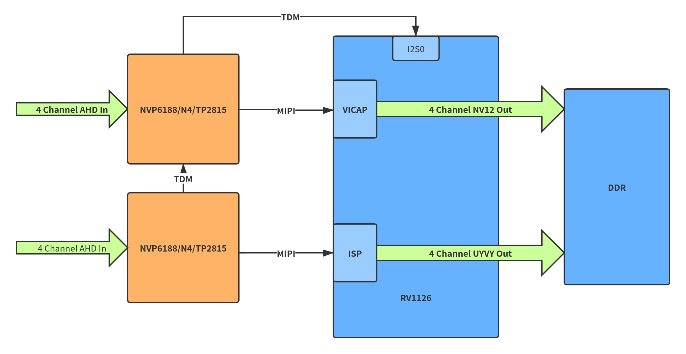
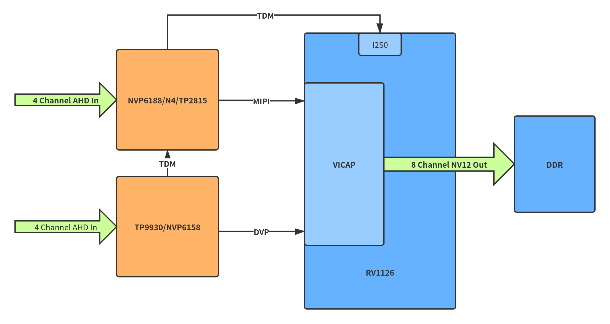
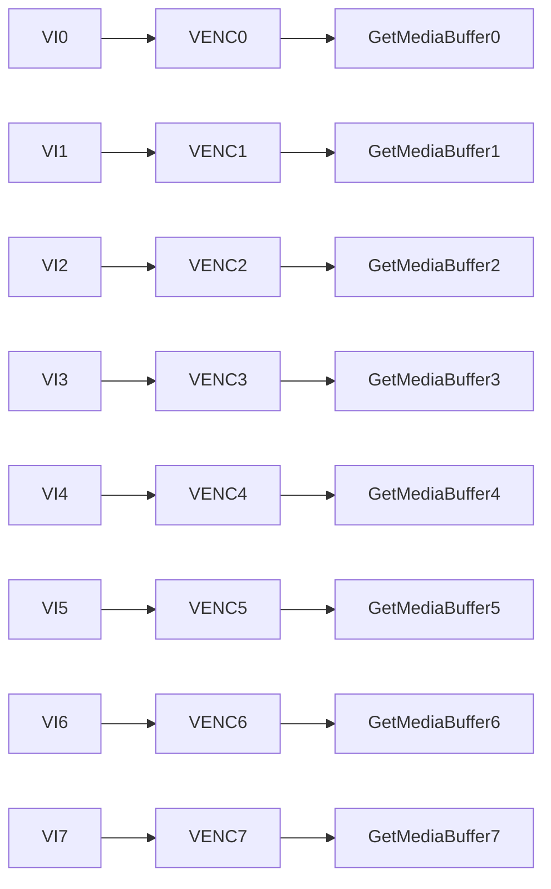
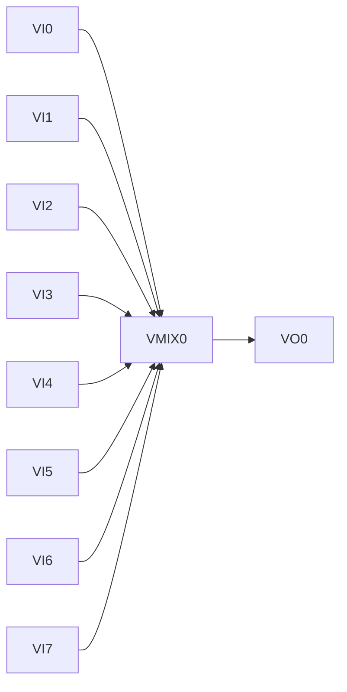
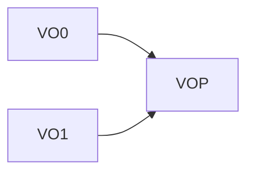

# Rockchip DVR&DMS 产品方案使用说明

文件标识：RK-SM-YF-398

发布版本：V1.0.1

日期：2021-03-01

文件密级：□绝密   □秘密   □内部资料   ■公开

**免责声明**

本文档按“现状”提供，瑞芯微电子股份有限公司（“本公司”，下同）不对本文档的任何陈述、信息和内容的准确性、可靠性、完整性、适销性、特定目的性和非侵权性提供任何明示或暗示的声明或保证。本文档仅作为使用指导的参考。

由于产品版本升级或其他原因，本文档将可能在未经任何通知的情况下，不定期进行更新或修改。

**商标声明**

“Rockchip”、“瑞芯微”、“瑞芯”均为本公司的注册商标，归本公司所有。

本文档可能提及的其他所有注册商标或商标，由其各自拥有者所有。

**版权所有** **© 2021 **瑞芯微电子股份有限公司**

超越合理使用范畴，非经本公司书面许可，任何单位和个人不得擅自摘抄、复制本文档内容的部分或全部，并不得以任何形式传播。

瑞芯微电子股份有限公司

Rockchip Electronics Co., Ltd.

地址：     福建省福州市铜盘路软件园A区18号

网址：     www.rock-chips.com

客户服务电话： +86-4007-700-590

客户服务传真： +86-591-83951833

客户服务邮箱： fae@rock-chips.com

---

**前言**

 **概述**

 DVR&DMS 产品方案使用说明。

**产品版本**

| **平台名称** | **内核版本** |
| ------------ | ------------ |
| Linux        | 4.4          |
| Linux        | 4.19         |

**读者对象**

本文档（本指南）主要适用于以下工程师：

​        技术支持工程师

​        软件开发工程师

 **修订记录**

| **日期**   | **版本** | **作者**                            | **修改说明** |
| ---------- | -------- | :---------------------------------- | ------------ |
| 2021-01-31 | V1.0.0   | Vicent Chi, Zhihua Wang, Zhichao Yu | 初始版本     |
| 2021-03-01 | V1.0.1   | Vicent Chi | 添加MIPI+DVP方案描述     |

---

**目录**

[TOC]

---

## 瑞芯微DVR/DMS产品方案说明

RV1126芯片有两路MIPI接口以及一路DVP接口，另外提供强大的编码性能最高支持8路1080@15fps同时编码，内置2T算力NPU，因此非常适合开发DVR/DMS产品。

### RV1126芯片平台开发DVR/DMS的产品优势

- 支持最高8路1080P模拟高清视频输入；
- 强大的AI处理能力，能够支持DMS+ADAS算法同时运行；
- 强大的编码能力，最高支持8路1080P@15fps同时编码；
- 支持8路视频OSD叠加；
- 支持8路视频分屏显示Demo；

### 模拟高清RX芯片选型列表

目前RV1126平台已经适配了比较多的模拟高清RX芯片，并已经在SDK中集成了这些芯片的驱动，可以通过下表选择：

| 型号     | 厂家      | 接口 | 通道数 | 最大支持分辨率 |
| -------- | --------- | ---- | ------ | -------------- |
| NVP6188  | Nextchip  | MIPI | 4      | 4K             |
| N4       | Nextchip  | MIPI | 4      | 1080P          |
| NVP6158C | Nextchip  | DVP  | 4      | 2K             |
| TP2815   | Techpoint | MIPI | 4      | 1080P          |
| TP2855   | Techpoint | MIPI | 4      | 1080P          |
| TP9930   | Techpoint | DVP  | 4      | 2K             |

### RV1126 DVR/DMS产品应用框图

由于RV1126芯片限制，如果选择两个MIPI接口RX芯片输入，其中4路的格式会被限制成UYVY格式，这会导致软件处理带宽增加。因此我们推荐客户选择MIPI+DVP的输入方案，这种方案有如下优势：

- 8路YUV视频可以统一为NV16格式，方便应用层处理；
- DVP RX芯片相比MIPI接口RX芯片价格更便宜，可以节省方案成本；

MIPI+MIPI输入的方案框图如下：



MIPI+DVP输入的方案框图如下：



## 模拟高清RX芯片驱动开发说明

### 内核config配置

根据需求打开RX芯片相关config配置：

```c

CONFIG_VIDEO_NVP6188=y

```

### 内核dts配置

以NVP6188 RX芯片为例：

```c

	nvp6188_0: nvp6188_0@30 {
		compatible = "nvp6188";
		reg = <0x30>;
		clocks = <&cru CLK_MIPICSI_OUT>;
		clock-names = "xvclk";
		power-domains = <&power RV1126_PD_VI>;
		pinctrl-names = "rockchip,camera_default";
		pinctrl-0 = <&mipicsi_clk0>;
		reset-gpios = <&gpio4 RK_PA0 GPIO_ACTIVE_HIGH>;
		power-gpios = <&gpio1 RK_PD4 GPIO_ACTIVE_HIGH>;
		vi-gpios = <&gpio3 RK_PC0 GPIO_ACTIVE_HIGH>;
		rockchip,camera-module-index = <0>;
		rockchip,camera-module-facing = "front";
		rockchip,camera-module-name = "nvp6188";
		rockchip,camera-module-lens-name = "nvp6188";
		port {
			ucam_out0: endpoint {
				remote-endpoint = <&mipi_in_ucam0>;
				data-lanes = <1 2 3 4>;
			};
		};
	};

	nvp6188_1: nvp6188_1@32 {
		compatible = "nvp6188";
		reg = <0x32>;
		clocks = <&cru CLK_MIPICSI_OUT>;
		clock-names = "xvclk";
		power-domains = <&power RV1126_PD_VI>;
		pinctrl-names = "rockchip,camera_default";
		pinctrl-0 = <&mipicsi_clk1>;
		reset-gpios = <&gpio4 RK_PA1 GPIO_ACTIVE_HIGH>;
		vi-gpios = <&gpio3 RK_PC1 GPIO_ACTIVE_HIGH>;
		rockchip,camera-module-index = <1>;
		rockchip,camera-module-facing = "back";
		rockchip,camera-module-name = "nvp6188";
		rockchip,camera-module-lens-name = "nvp6188";
		port {
			ucam_out1: endpoint {
				remote-endpoint = <&csi_dphy1_input>;
				data-lanes = <1 2 3 4>;
			};
		};
	};

```

## 数据流通路说明

### 双路方案通路

**双MIPI方案**

以双片NVP6188为例:

- VICAP通路0

```flow

nvp6188_0=>start: nvp6188_0
csi_dphy0=>operation: csi_dphy0
mipi_csi2=>operation: mipi_csi2
vicap=>end: vicap
nvp6188_0->csi_dphy0->mipi_csi2->vicap

```

- ISP通路1

```flow

nvp6188_1=>start: nvp6188_1
csi_dphy1=>operation: csi_dphy1
isp0=>end: isp0
nvp6188_1->csi_dphy1->isp0

```

**MIPI+DVP方案**

以TP9930+TP2855为例：

- VICAP通路0

```flow

tp2855=>start: tp2855
csi_dphy0=>operation: csi_dphy0
mipi_csi2=>operation: mipi_csi2
rkcif_mipi_lvds=>end: rkcif_mipi_lvds
tp2855->csi_dphy0->mipi_csi2->rkcif_mipi_lvds

```

- VICAP通路1

```flow

tp9930=>start: tp9930
rkcif_dvp_multi=>operation: rkcif_dvp_multi
tp9930->rkcif_dvp_multi

```

### 通道对应的video格式限制

#### VICAP通路

- 要统一使用NV16格式采集

#### ISP通路

- 要统一使用UYVY格式采集

### 通道对应的video节点枚举

#### VICAP通路

- media-ctl -p -d /dev/mediaX 获取 stream_cif_mipi_id0/1/2/3 的 device node name

```c

[root@RV1126_RV1109:/]# media-ctl -p -d /dev/media0
Media controller API version 4.19.111

Media device information
------------------------
driver          rkcif
model           rkcif_mipi_lvds
serial
bus info
hw revision     0x0
driver version  4.19.111

Device topology
- entity 1: stream_cif_mipi_id0 (1 pad, 4 links)
            type Node subtype V4L flags 0
            device node name /dev/video0
        pad0: Sink
                <- "rockchip-mipi-csi2":1 [ENABLED]
                <- "rockchip-mipi-csi2":2 []
                <- "rockchip-mipi-csi2":3 []
                <- "rockchip-mipi-csi2":4 []

- entity 5: stream_cif_mipi_id1 (1 pad, 4 links)
            type Node subtype V4L flags 0
            device node name /dev/video1
        pad0: Sink
                <- "rockchip-mipi-csi2":1 []
                <- "rockchip-mipi-csi2":2 [ENABLED]
                <- "rockchip-mipi-csi2":3 []
                <- "rockchip-mipi-csi2":4 []

- entity 9: stream_cif_mipi_id2 (1 pad, 4 links)
            type Node subtype V4L flags 0
            device node name /dev/video2
        pad0: Sink
                <- "rockchip-mipi-csi2":1 []
                <- "rockchip-mipi-csi2":2 []
                <- "rockchip-mipi-csi2":3 [ENABLED]
                <- "rockchip-mipi-csi2":4 []

- entity 13: stream_cif_mipi_id3 (1 pad, 4 links)
             type Node subtype V4L flags 0
             device node name /dev/video3
        pad0: Sink
                <- "rockchip-mipi-csi2":1 []
                <- "rockchip-mipi-csi2":2 []
                <- "rockchip-mipi-csi2":3 []
                <- "rockchip-mipi-csi2":4 [ENABLED]

```

#### ISP通路

- media-ctl -p -d /dev/mediaX 获取 rkisp_mainpath、rkisp_rawwr0/1/2 的 device node name

```c

media-ctl -p -d /dev/media1
Media controller API version 4.19.111

Media device information
------------------------
driver          rkisp
model           rkisp0
serial
bus info
hw revision     0x0
driver version  4.19.111

Device topology
- entity 17: rkisp_mainpath (1 pad, 1 link)
             type Node subtype V4L flags 0
             device node name /dev/video5
        pad0: Sink
                <- "rkisp-isp-subdev":2 [ENABLED]

- entity 29: rkisp_rawwr0 (1 pad, 1 link)
             type Node subtype V4L flags 0
             device node name /dev/video7
        pad0: Sink
                <- "rkisp-csi-subdev":2 [ENABLED]

- entity 35: rkisp_rawwr1 (1 pad, 1 link)
             type Node subtype V4L flags 0
             device node name /dev/video8
        pad0: Sink
                <- "rkisp-csi-subdev":3 [ENABLED]

- entity 41: rkisp_rawwr2 (1 pad, 1 link)
             type Node subtype V4L flags 0
             device node name /dev/video9
        pad0: Sink
                <- "rkisp-csi-subdev":4 [ENABLED]

```

### 通道对应的video采集限制

#### ISP通路

- pipeline 切换

```

	开机启动脚本需要添加  (/dev/media1根据实际isp注册情况决定)

	media-ctl -d /dev/media1 -l '"rkisp-isp-subdev":2->"rkisp-bridge-ispp":0[0]'
	media-ctl -d /dev/media1 -l '"rkisp-isp-subdev":2->"rkisp_mainpath":0[1]'

```

- stream on 开关

```

	因为rkisp_mainpath、rkisp_rawwr0/1/2 四个通道的stream on开关没有单独的开关，
	因此如果要采集rkisp_rawwr0/1/2 三路通道任一一路，都要需要保证rkisp_mainpath通道已经在stream on状态之后，该三路才会出流。

```

- rkisp_mainpath 格式切换

```

	默认输出1080p，如果要格式切换720p，需要先执行：

	media-ctl -d /dev/media1 --set-v4l2 '"m01_b_nvp6188 1-0032":0[fmt:UYVY8_2X8/1280x720]'
	media-ctl -d /dev/media1 --set-v4l2 '"rkisp-csi-subdev":1[fmt:UYVY8_2X8/1280x720]'
	media-ctl -d /dev/media1 --set-v4l2 '"rkisp-isp-subdev":0[fmt:YUYV8_2X8/1280x720]'
	media-ctl -d /dev/media1 --set-v4l2 '"rkisp-isp-subdev":0[crop:(0,0)/1280x720]'
	media-ctl -d /dev/media1 --set-v4l2 '"rkisp-isp-subdev":2[fmt:YUYV8_2X8/1280x720]'
	media-ctl -d /dev/media1 --set-v4l2 '"rkisp-isp-subdev":2[crop:(0,0)/1280x720]'

```

### 通道对应的分辨率查询、视频信号查询

- media-ctl -p -d /dev/mediaX 获取 sensor 的 subdev node name

```c

media-ctl -p -d /dev/media1
Media controller API version 4.19.111

Media device information
------------------------
driver          rkisp
model           rkisp0
serial
bus info
hw revision     0x0
driver version  4.19.111

Device topology

....

- entity 92: m01_b_nvp6188 1-0032 (1 pad, 1 link)
             type V4L2 subdev subtype Sensor flags 0
             device node name /dev/v4l-subdev6
        pad0: Source
                [fmt:UYVY8_2X8/1920x1080 field:none]
                -> "rockchip-mipi-dphy-rx":0 [ENABLED]


```

- open通道之前获取分辨率

```c

#include <stdio.h>
#include <unistd.h>
#include <fcntl.h>
#include <sys/stat.h>
#include <sys/types.h>
#include <sys/time.h>
#include <sys/mman.h>
#include <sys/ioctl.h>
#include <linux/videodev2.h>

#define RKMODULE_MAX_VC_CH		4

struct rkmodule_vc_fmt_info {
    __u32 width[RKMODULE_MAX_VC_CH];
    __u32 height[RKMODULE_MAX_VC_CH];
    __u32 fps[RKMODULE_MAX_VC_CH];
} __attribute__ ((packed));

struct rkmodule_vc_hotplug_info {
    __u8 detect_status;
} __attribute__ ((packed));

#define RKMODULE_GET_VC_FMT_INFO \
    _IOR('V', BASE_VIDIOC_PRIVATE + 12, struct rkmodule_vc_fmt_info)

#define RKMODULE_GET_VC_HOTPLUG_INFO \
    _IOR('V', BASE_VIDIOC_PRIVATE + 13, struct rkmodule_vc_hotplug_info)

int main(int argc, char *argv[]) {
	int ch = 0;
	struct rkmodule_vc_hotplug_info status;
	struct rkmodule_vc_fmt_info fmt;
	int fd = open("/dev/v4l-subdev2", O_RDWR, 0);
	ioctl(fd, RKMODULE_GET_VC_FMT_INFO, &fmt);
	ioctl(fd, RKMODULE_GET_VC_HOTPLUG_INFO, &status);
	for(ch = 0; ch < 4; ch++) {
		printf("# ch: %d\n", ch);
		printf("\t width: %d\n", fmt.width[ch]);
		printf("\t height: %d\n", fmt.height[ch]);
		printf("\t fps: %d\n", fmt.fps[ch]);
		printf("\t plug in: %d\n", (status.detect_status & (1 << ch)) ? 1 : 0);
	}
	close(fd);
	return 0;
}

```

### 实时查询热拔插接口

- 提供sysfs节点给用户层进行读查询。

``` c

/sys/devices/platform/ff510000.i2c/i2c-1/1-0032/hotplug_status
/sys/devices/platform/ff510000.i2c/i2c-1/1-0030/hotplug_status

```

## rkmedia_vmix_vo_dvr_test应用说明

rkmedia_vmix_vo_dvr_test主要实现8路视频采集、编码，8路视频合成显示。源代码位于SDK/external/rkmedia/examples。

### 支持8路视频采集、H264编码

8路视频采集节点、分辨率、格式通过数组配置，方便用户修改调试：

```c
stDvr dvr8[8] = {
    {0, "/dev/video30", 1920, 1080, IMAGE_TYPE_NV12, 0},
    {1, "/dev/video31", 1920, 1080, IMAGE_TYPE_NV12, 0},
    {2, "/dev/video32", 1920, 1080, IMAGE_TYPE_NV12, 0},
    {3, "/dev/video33", 1920, 1080, IMAGE_TYPE_NV12, 0},
    {4, "/dev/video37", 1920, 1080, IMAGE_TYPE_NV12, 0},
    {5, "/dev/video38", 1920, 1080, IMAGE_TYPE_NV12, 0},
    {6, "/dev/video39", 1920, 1080, IMAGE_TYPE_NV12, 0},
    {7, "/dev/video40", 1920, 1080, IMAGE_TYPE_NV12, 0},
};
```

根据双mipi方案的推荐，需要修改为：

```c
stDvr dvr8[8] = {
    {0, "/dev/video0", 1920, 1080, IMAGE_TYPE_NV16, 0},
    {1, "/dev/video1", 1920, 1080, IMAGE_TYPE_NV16, 0},
    {2, "/dev/video2", 1920, 1080, IMAGE_TYPE_NV16, 0},
    {3, "/dev/video3", 1920, 1080, IMAGE_TYPE_NV16, 0},
    {4, "/dev/video5", 1920, 1080, IMAGE_TYPE_UYVY422, 0},
    {5, "/dev/video7", 1920, 1080, IMAGE_TYPE_UYVY422, 0},
    {6, "/dev/video8", 1920, 1080, IMAGE_TYPE_UYVY422, 0},
    {7, "/dev/video9", 1920, 1080, IMAGE_TYPE_UYVY422, 0},
};
```

8路视频VI通过bind VENC实现8路H264编码，通过GetMediaBuffer线程可以获取到8路VENC编码后的数据，用户可以在这个基础上实现视频传输需求。



### 支持8路视频合成显示

8路视频通过数组指定屏幕显示矩形区域，方便用户修改调试：

```c
RECT_S area_2x4[8] = {
    {0, 0, WIDTH / 2, HEIGHT / 4},
    {WIDTH / 2, 0, WIDTH / 2, HEIGHT / 4},
    {0, HEIGHT / 4, WIDTH / 2, HEIGHT / 4},
    {WIDTH / 2, HEIGHT / 4, WIDTH / 2, HEIGHT / 4},
    {0, HEIGHT / 2, WIDTH / 2, HEIGHT / 4},
    {WIDTH / 2, HEIGHT / 2, WIDTH / 2, HEIGHT / 4},
    {0, HEIGHT * 3 / 4, WIDTH / 2, HEIGHT / 4},
    {WIDTH / 2, HEIGHT * 3 / 4, WIDTH / 2, HEIGHT / 4},
};
```

8路视频合成显示通过VMIX+VO模块实现：



### 支持8路视频切换为前4路、后4路显示

通过dvr_bind、dvr_unbind实现8路视频切换为前4路、后4路显示，用户只需要定义前4路和后4路的矩形显示区域即可。

### 支持区域画框

通过对整个屏幕画线实现区域画框，增加区域边界，通过数组指定画线区域，线宽最小为2，要求偶数：

```c
RECT_S line_2x4[4] = {
    {0, HEIGHT / 4, WIDTH, 2},
    {0, HEIGHT / 2, WIDTH, 2},
    {0, HEIGHT * 3 / 4, WIDTH, 2},
    {WIDTH / 2, 0, 2, HEIGHT},
};
```

通过RK_MPI_VMIX_SetLineInfo设置画线区域。

### 支持RGN Cover

支持对每个通道设置敏感区域，通过RK_MPI_VMIX_RGN_SetCover实现。

### 支持屏幕OSD

通过VO1实现屏幕OSD，用户可以把OSD绘制在buffer（格式为ABGR）里面，送VO1后通过Alpha即可以实现OSD叠加在VO0视频上面显示的效果。应用里面在osd_thread线程里面每隔500ms绘制一块两条色块的OSD切换显示。



### 支持通道显示、隐藏

通过RK_MPI_VMIX_ShowChn、RK_MPI_VMIX_HideChn实现通道显示、隐藏。

### 支持通道的区域亮度获取

通过RK_MPI_VMIX_GetChnRegionLuma实现通道的区域亮度获取，每次最多可以获取64个区域亮度，每个通道的区域的坐标都是相对通道的区域起始坐标，不是相对屏幕的起始坐标。可以通过区域亮度实现屏幕OSD反色效果。
