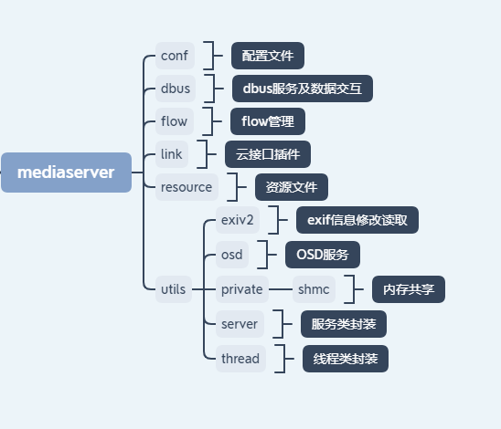
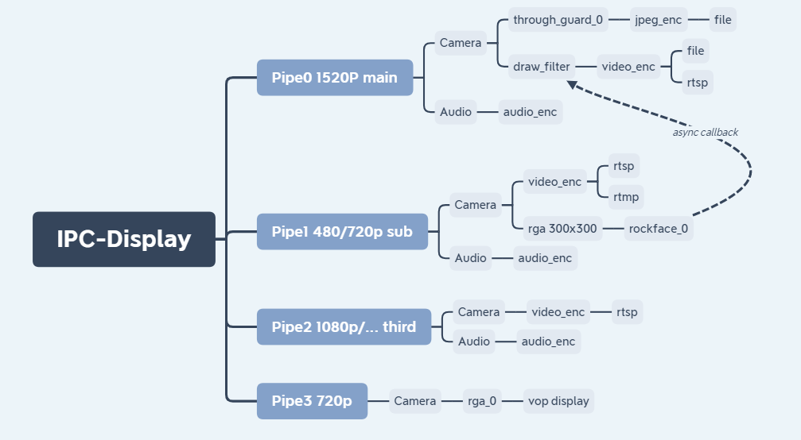

# Rockchip Linux Mediaserver 介绍

文件标识：RK-SM-YF-361

发布版本：V0.0.2

日期：2020-09-03

文件密级：□绝密   □秘密   □内部资料   ■公开

**免责声明**

本文档按“现状”提供，瑞芯微电子股份有限公司（“本公司”，下同）不对本文档的任何陈述、信息和内容的准确性、可靠性、完整性、适销性、特定目的性和非侵权性提供任何明示或暗示的声明或保证。本文档仅作为使用指导的参考。

由于产品版本升级或其他原因，本文档将可能在未经任何通知的情况下，不定期进行更新或修改。

**商标声明**

“Rockchip”、“瑞芯微”、“瑞芯”均为本公司的注册商标，归本公司所有。

本文档可能提及的其他所有注册商标或商标，由其各自拥有者所有。

**版权所有© 2020 瑞芯微电子股份有限公司**

超越合理使用范畴，非经本公司书面许可，任何单位和个人不得擅自摘抄、复制本文档内容的部分或全部，并不得以任何形式传播。

瑞芯微电子股份有限公司

Rockchip Electronics Co., Ltd.

地址：     福建省福州市铜盘路软件园A区18号

网址：     www.rock-chips.com

客户服务电话： +86-4007-700-590

客户服务传真： +86-591-83951833

客户服务邮箱： fae@rock-chips.com

---

**前言**

 **概述**

 本文主要描述了mediaserver应用各个模块的使用说明。

**产品版本**

| **芯片名称** | **内核版本** |
| ------------ | ------------ |
| RV1109       | Linux 4.19   |
| RV1126       | Linux 4.19   |
| RK1808       | Linux 4.4    |
| RK1806       | Linux 4.4    |

**读者对象**

本文档（本指南）主要适用于以下工程师：

​        技术支持工程师

​        软件开发工程师

 **修订记录**

| **日期**   | **版本** | **作者** | **修改说明**           |
| ---------- | -------- | :------- | ---------------------- |
| 2020-04-28 | V0.0.1   | vicent   | 初始版本               |
| 2020-09-03 | V0.0.2   | Ruby     | 更新公司名称和格式调整 |

---

**目录**

[TOC]

---

## 整体介绍

### 应用说明

mediaserver 建立pipe的概念，对单个或者多个通路的media stream进行配置重组，同时提供IPC通信接口，可与web等界面交互。
开发者可通过简单配置，实现下面这些功能的排列组合：

1. 文本流读取、摄像头设备采集、音频设备采集。
2. 音频/视频频编码。
3. rtsp/rtmp/阿里云推流、云对讲功能、图片上传。
4. 视频文件录制、拍照、音频播放。
5. 支持rockface、rockx、rga等filter插件。
6. 可与web交互

### 使用方法

mediaserver [-c config] [-d / -D] [-s / -S] [-h]

-c：指定通路配置文件路径

-d：表示不使用dbserver

-D：表示使用dbserver里面的默认配置

-s：表示dbus注册在system bus上

-S：表示dbus注册在session bus上

示例：

使用IPC产品，带屏显：mediaserver -c /oem/usr/shared/mediaserver/rv1109/ipc-display.conf

使用IPC产品，不带屏显：mediaserver -c /oem/usr/shared/mediaserver/rv1109/ipc.conf

## 代码模块说明

### 目录结构



### 配置说明

   配置文件使用json格式。

   Pipe表示一路独立的多媒体通道。

   Flow表示一路多媒体通道中的一个Source/IO/Sink单元。

   Stream表示FLow使用的处理方法。

#### ipc-display.conf



#### 记录Pipe间排列组合顺序的节点：

```
    Pipe_x: 多媒体通道的ID
```

#### 记录Flow间排列组合顺序的节点：

```
    Flow_x: 在当前多媒体通道中Source/IO/Sink单元的ID
    flow_index: 记录flow类型 stream类型、上下级flow名称
    flow_name: 记录flow名称
    flow_param: 记录flow参数
    stream_param: 记录stream参数
```

#### flow_index 参数

```
    fix_resolution: 是否固定分辨率，不被数据库更改
    flow_index_name: flow名称加ID，防止当前pipe有多个同类型flow
    flow_type: flow类型
    stream_id: 流ID： 0: mian stream; 1: sub stream; 2 third stream
    stream_type: 流类型
    upflow_index_name: 上一级flow名称
    ...
```

#### flow名称

```
    name: 当前flow名称
```

#### flow参数

```
    name: 当前flow使用的stream/filter/encoder名称
    input_data_type: 输入buffer类型
    output_data_type: 输出buffer类型
    ...
```

#### stream参数

```
    device: 设备节点
    frame_num: 缓存帧数
    height: 分辨率高
    use_libv4l2: 使用libv4l2
    v4l2_capture_type: 摄像头采集类型
    v4l2_mem_type: 分配内存类型
    virtual_height: 分辨率虚高
    virtual_width: 分辨率虚宽
    width: 分辨率宽
    ...
```