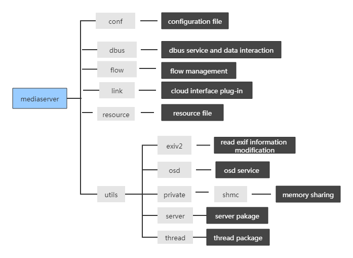

# Rockchip Mediaserver Introduction

ID: RK-SM-YF-361

Release Version: V0.0.2

Release Date: 2020-09-03

Security Level: □Top-Secret   □Secret   □Internal   ■Public

**DISCLAIMER**

THIS DOCUMENT IS PROVIDED “AS IS”. ROCKCHIP ELECTRONICS CO., LTD.(“ROCKCHIP”)DOES NOT PROVIDE ANY WARRANTY OF ANY KIND, EXPRESSED, IMPLIED OR OTHERWISE, WITH RESPECT TO THE ACCURACY, RELIABILITY, COMPLETENESS,MERCHANTABILITY, FITNESS FOR ANY PARTICULAR PURPOSE OR NON-INFRINGEMENT OF ANY REPRESENTATION, INFORMATION AND CONTENT IN THIS DOCUMENT. THIS DOCUMENT IS FOR REFERENCE ONLY. THIS DOCUMENT MAY BE UPDATED OR CHANGED WITHOUT ANY NOTICE AT ANY TIME DUE TO THE UPGRADES OF THE PRODUCT OR ANY OTHER REASONS.

**Trademark Statement**

"Rockchip", "瑞芯微", "瑞芯" shall be Rockchip’s registered trademarks and owned by Rockchip. All the other trademarks or registered trademarks mentioned in this document shall be owned by their respective owners.

**All rights reserved. ©2020. Rockchip Electronics Co., Ltd.**

Beyond the scope of fair use, neither any entity nor individual shall extract, copy, or distribute this document in any form in whole or in part without the written approval of Rockchip.

Rockchip Electronics Co., Ltd.

No.18 Building, A District, No.89, software Boulevard Fuzhou, Fujian,PRC

Website:     [www.rock-chips.com](http://www.rock-chips.com)

Customer service Tel:  +86-4007-700-590

Customer service Fax:  +86-591-83951833

Customer service e-Mail: fae@rock-chips.com

---

**Preface**

**Overview**

This document is intended to introduce each module of the mediaserver application.

**Product Version**

| **Chipset** | **Kernel Version** |
| ----------- | ------------------ |
| RV1109      | Linux 4.19         |
| RV1126      | Linux 4.19         |
| RK1808      | Linux 4.4          |
| RK1806      | Linux 4.4          |

**Intended Audience**

This document (this guide) is mainly intended for:

Technical support engineers

Software development engineers

**Revision History**

| **Date**   | **Version** | **Author** | **Change Description**                      |
| ---------- | ----------- | :--------- | ------------------------------------------- |
| 2020-04-28 | V0.0.1      | Vicent     | Initial version                             |
| 2020-09-03 | V0.0.2      | Ruby       | Update the company name and document format |

---

**Contents**

[TOC]

---

## Overview

### Application Introduction

Mediaserver comes with the concept of pipe, configures and reorganizes the media streams of single or multiple channels, and provides IPC communication interfaces, which can interact with web and other interfaces.
Developers can realize any arrangement and combination of the following functions through simple configurations:

1. Text stream reading, camera device collection, audio device collection.
2. Audio/video frequency encoding.
3. rtsp/rtmp/Alibaba Cloud streaming, cloud intercom function, picture upload.
4. Video file recording, taking photos, and audio playback.
5. Support filter plug-ins such as rockface, rockx, rga, etc.
6. Can interact with the web

### Usage

mediaserver [-c config] [-d / -D] [-s / -S] [-h]

-c: specify the path of the configuration file

-d: indicates that dbserver is not used

-D: means to use the default configuration in dbserver

-s: indicates that dbus is registered on the system bus

-S: indicates that dbus is registered on the session bus

Examples:

Use IPC products with screen: mediaserver -c /oem/usr/shared/mediaserver/rv1109/ipc-display.conf

Use IPC products without screen: mediaserver -c /oem/usr/shared/mediaserver/rv1109/ipc.conf

## Code Modules Introduction

### Directory Structure



### Configuration Introduction

The configuration file is in json format.

Pipe represents an independent multimedia channel.

Flow represents a Source/IO/Sink unit in a multimedia channel.

Stream represents the processing method used by Flow.

#### ipc-display.conf


#### Nodes that Record the Sequence of Arrangement and Combination Between Pipes

```
    Pipe_x:ID of the multimedia channel
```

#### Nodes that Record the Sequence of Arrangement and Combination Between Flows

```
    Flow_x: The ID of the Source/IO/Sink unit in the current multimedia channel
    flow_index: Record flow type, stream type, upper and lower flow name
    flow_name: record the flow name
    flow_param: record flow parameters
    stream_param: record stream parameters
```

#### flow_index Parameter

```
    fix_resolution: Whether to fix the resolution and not be changed by the database
    flow_index_name: flow name and ID, to prevent multiple flows of the same type in the current pipe
    flow_type: flow type
    stream_id: stream ID: 0: mian stream; 1: sub stream; 2 third stream
    stream_type: stream type
    upflow_index_name: previous flow name
    ...
```

#### Flow Name

```
    name: current flow name
```

#### Flow Parameter

```
    name: The name of the stream/filter/encoder used by the current flow
    input_data_type: input buffer type
    output_data_type: output buffer type
    ...
```

#### Stream Parameter

```
    device: device node
    frame_num: the number of buffered frames
    height: high resolution
    use_libv4l2: Use libv4l2
    v4l2_capture_type: camera capture type
    v4l2_mem_type: allocate memory type
    virtual_height: resolution virtual height
    virtual_width: resolution virtual width
    width: resolution width
    ...
```