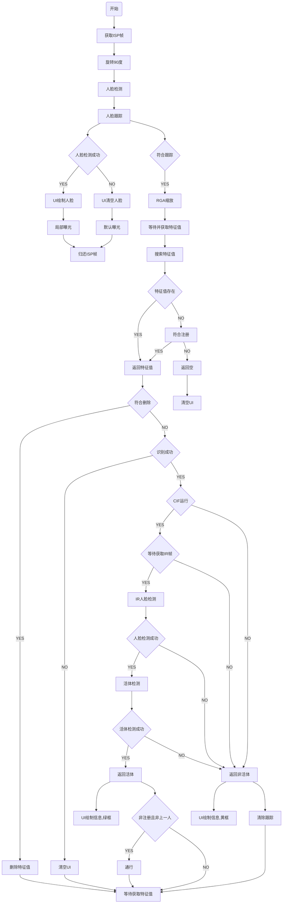

# Rockchip Rkfacial 使用说明

文件标识：RK-SM-YF-363

发布版本：V1.1.0

日期：2020-06-08

文件密级：□绝密   □秘密   □内部资料   ■公开

**免责声明**

本文档按“现状”提供，瑞芯微电子股份有限公司（“本公司”，下同）不对本文档的任何陈述、信息和内容的准确性、可靠性、完整性、适销性、特定目的性和非侵权性提供任何明示或暗示的声明或保证。本文档仅作为使用指导的参考。

由于产品版本升级或其他原因，本文档将可能在未经任何通知的情况下，不定期进行更新或修改。

**商标声明**

“Rockchip”、“瑞芯微”、“瑞芯”均为本公司的注册商标，归本公司所有。

本文档可能提及的其他所有注册商标或商标，由其各自拥有者所有。

**版权所有** **© 2020** **瑞芯微电子股份有限公司**

超越合理使用范畴，非经本公司书面许可，任何单位和个人不得擅自摘抄、复制本文档内容的部分或全部，并不得以任何形式传播。

瑞芯微电子股份有限公司

Rockchip Electronics Co., Ltd.

地址：     福建省福州市铜盘路软件园A区18号

网址：     www.rock-chips.com

客户服务电话： +86-4007-700-590

客户服务传真： +86-591-83951833

客户服务邮箱： fae@rock-chips.com

---

## **前言**

 **概述**

 本文描述rkfacil各个模块的接口说明。

**产品版本**

| **平台名称** | **内核版本** |
| ------------ | ------------ |
| Linux        | 4.4          |

**读者对象**

本文档（本指南）主要适用于以下工程师：

​        技术支持工程师

​        软件开发工程师

 **修订记录**

| **日期**   | **版本** | **作者**    | **修改说明**     |
| ---------- | -------- | :---------- | ---------------- |
| 2020-05-21 | V1.0.0   | Zhihua Wang | 初始版本         |
| 2020-06-08 | V1.1.0   | Zhihua Wang | 修改用户信息回调 |

---

## **目录**

[TOC]

---

## **1 代码模块说明**

### **1.1 rockface_control**

#### int rockface_control_init(int face_cnt)

**说明**

完成rockface各个算法的初始化，完成人脸数据库的初始化，并从指定目录的jpg文件提取人脸特征值到数库。

**参数**

face_cnt  人脸数据库最大支持的人脸数量

**返回**

int       0成功，-1失败

#### void rockface_control_exit(void)

**说明**

完成rockface各个算法的反初始化。

**参数**

void

**返回**

void

默认宏定义说明：

```c
#define DEFAULT_FACE_NUMBER 1000 表示默认人脸数据库最大支持人脸数量
#define DEFAULT_FACE_PATH "/userdata" 开机默认从这个目录加载jpg文件获取特征值
#define FACE_SCORE_RGB 0.55 RGB人脸检测的分数最小要求
#define FACE_SCORE_IR 0.7 IR人脸检测的分数最小要求
#define FACE_SCORE_LANDMARK 0.9 RGB人脸特征值的分数最小要求
#define FACE_SCORE_REGISTER 0.9999 人脸注册的人脸分数最小要求
#define FACE_REGISTER_CNT 5 人脸注册时连续读到的多少次人脸特征值均在数据库里面，提示已经注册
#define FACE_REAL_SCORE 0.7 活体检测分数最小要求
#define LICENCE_PATH "/oem/key.lic" rockface人脸授权key存放路径
#define FACE_DATA_PATH "/usr/lib" rockface data存放路径
#define MIN_FACE_WIDTH(w) ((w) / 5) 人脸检测、特征值提取人脸框宽度最小要求
#define CONVERT_RGB_WIDTH 640 用于算法的RGB图像宽度
#define CONVERT_IR_WIDTH 640 用于算法的IR图像宽度
#define FACE_TRACK_FRAME 0 人脸跟踪最大跟踪时间(帧)
#define FACE_RETRACK_TIME 1 人脸跟踪再次跟踪时间(秒)
```

**应用流程图**



### **1.2 datebase**

#### int database_init(void)

**说明**

完成数据库的初始化

**参数**

void

**返回**

int    0成功，-1失败

#### void database_exit(void)

**说明**

完成数据库的反初始化

**参数**

void

**返回**

void

#### int database_insert(void *data, size_t size, char *name, size_t n_size, bool sync_flag)

**说明**

完成插入一条数据到数据库

**参数**

data           特征值数据地址

size            特征值大小

name         用户名

n_size        用户名大小

sync_flag  为true时会实时sync保存数据库

**返回**

int             0成功，-1失败

#### int database_record_count(void)

**说明**

获取记录的人脸特征值数量

**参数**

void

**返回**

int     记录的人脸特征值数量

#### int database_get_data(void *dst, const int cnt, size_t d_size, size_t d_off, size_t n_size, size_t n_off)

**说明**

把数据库最多cnt个特征值提取出来保存到dst，dst提供给rockface做特征值数据库搜索匹配

**参数**

dst     存储数据的指针

cnt     最多可以提取特征值的数量

d_size 特征值大小

d_off   特征值在用户数据结构体的偏移

n_size 名字的大小

n_off   名字在用户数据结构体的偏移

**返回**

int     获取到的特征值的数量

#### bool database_is_name_exist(char *name)

**说明**

判断用户名是否已经存在于数据库

**参数**

name   用户名

**返回**

bool    true存在，false不存在

#### int database_get_user_name_id(void)

**说明**

用于用户实时注册时可以使用的id号，id号从0开始，找到未使用的即可以给用户注测。

**参数**

void

**返回**

int    可以使用的id号

#### void database_delete(char *name, bool sync_flag)

**说明**

通过用户名删除数据库里面的一个记录

**参数**

name         用户名

sync_flag  为true时会实时sync保存数据库

**返回**

void

### **1.3 rkisp_control**

#### int rkisp_control_init(void)

**说明**

实现了isp video的初始化，在process线程进行图像数据的读取、旋转、显示、送数据给rockface做人脸识别、检测、特征值提取、轨迹跟踪处理。

**参数**

void

**返回**

int    0成功，-1失败

#### void rkisp_control_exit(void)

**说明**

实现了isp video的反初始化。

**参数**

void

**返回**

void

#### void rkisp_control_expo_weights_270(int left, int top, int right, int bottom)

**说明**

用于实现ISP图像顺时针旋转270度局部曝光，可以实现人脸坐标在暗处局部曝光。

**参数**

left      人脸矩形框左边的坐标

top      人脸矩形框顶部的坐标

right    人脸矩形框右边的坐标

bottom 人脸矩形框底部的坐标

**返回**

void

#### void rkisp_control_expo_weights_90(int left, int top, int right, int bottom)

**说明**

用于实现ISP图像顺时针旋转90度局部曝光，可以实现人脸坐标在暗处局部曝光。

**参数**

left      人脸矩形框左边的坐标

top      人脸矩形框顶部的坐标

right    人脸矩形框右边的坐标

bottom 人脸矩形框底部的坐标

**返回**

void

#### void rkisp_control_expo_weights_default(void)

**说明**

用于配置还原默认的曝光设置。

**参数**

void

**返回**

void

### rkcif_control

#### int rkcif_control_init(void)

**说明**

实现了cif video的初始化，在process线程进行图像数据的读取、旋转、送数据给rockface做活体检测处理。

**参数**

void

**返回**

int    0成功，-1失败

#### void rkcif_control_exit(void)

**说明**

实现了cif video的反初始化。

**参数**

void

**返回**

void

### **1.5 shadow_display**

#### void shadow_display(void *src_ptr, int src_fd, int src_fmt, int src_w, int src_h)

**说明**

实现横屏显示摄像头图像的功能，会根据屏幕比例和摄像头图像比例裁剪出更合适的图像显示在横屏上面。

**参数**

src_ptr  图像的数据地址

src_fd   图像的数据fd

src_fmt 图像的数据格式

src_w    图像的宽

src_h     图像的高

**返回**

void

#### void shadow_display_vertical(void *src_ptr, int src_fd, int src_fmt, int src_w, int src_h)

**说明**

实现竖屏显示摄像头图像的功能，会根据屏幕比例和摄像头图像比例裁剪出更合适的图像显示在竖屏上面。

**参数**

src_ptr  图像的数据地址

src_fd   图像的数据fd

src_fmt 图像的数据格式

src_w    图像的宽

src_h     图像的高

**返回**

void

#### void shadow_paint_box(int left, int top, int right, int bottom)

**说明**

发送绘制人脸框消息给UI。

**参数**

left       人脸矩形框左边的坐标

top       人脸矩形框顶部的坐标

right     人脸矩形框右边的坐标

bottom  人脸矩形框底部的坐标

**返回**

void

#### void shadow_paint_info(struct user_info *info, bool real)

**说明**

发送用户信息消息给UI。

**参数**

info    用户信息

**返回**

void

#### void shadow_get_crop_screen(int *width, int *height)

**说明**

获取裁剪后屏幕尺寸范围。

**参数**

width   屏幕的宽

height  屏幕的高

**返回**

void

### **1.6 load_feature**

#### int count_file(const char *path, char *fmt)

**说明**

计算某个目录包括子目录下面所有对应图像格式的文件数量。

**参数**

path    目录路径

fmt      图像格式

**返回**

int     文件的数量

#### int load_feature(const char *path, char *fmt, void *data, unsigned int cnt)

**说明**

从某个目录包括子目录下面所有对应格式文件的特征值和文件名读取到data对应的数据结构体指针，最多读取cnt个。

**参数**

path	目录路径

fmt	  图像格式

data	存放读取的特征值和文件名的指针

cnt	  最多读取多少个

**返回**

void

### **1.7 play_wav**

#### int play_wav_thread_init(void)

**说明**

完成play_wav的初始化，并完成play_wav_thread线程的初始化，play_wav_thread线程等待接收signal播放指定wav文件。

**参数**

void

**返回**

int	0成功，-1失败

#### void play_wav_thread_exit(void)

**说明**

完成play_wav的反初始化，并完成播放线程的反初始化。

**参数**

void

**返回**

void

#### void play_wav_signal(char *name)

**说明**

通过指定名字播放wav音频。

**参数**

name	wav音频文件名

**返回**

void

音频格式要求16000采样率，双通道，16bit，可以修改以下3个宏指定其他音频格式。

```c
#define NUM_CHANNELS 2
#define SAMPLE_RATE 16000
#define BITS_PER_SAMPLE 16
```

添加wav音频：中文放到wav/cn即可，英文放到wav/en即可。

CMakeLists.txt里install(DIRECTORY wav/cn/ DESTINATION ../etc)指定使用中文或者英文音频文件安装到指定目录。

### **1.8 rga_control**

#### int rga_control_buffer_init(bo_t *bo, int *buf_fd, int width, int height, int bpp)

**说明**

申请drm内存

**参数**

bo          申请目标内存bo参数

buf_fd   申请目标内存buf_fd参数

width    申请目标内存的宽

height   申请目标内存的高

bpp       申请目标内存一个像素对应的比特

**返回**

void

#### void rga_control_buffer_deinit(bo_t *bo, int buf_fd)

**说明**

释放drm内存

**参数**

bo          申请目标内存bo参数

buf_fd   申请目标内存buf_fd参数

**返回**

void

### **1.9 rkfacial**

#### typedef void (*display_callback)(void *ptr, int fd, int fmt, int w, int h, int rotation)

**说明**

显示回调

**参数**

ptr          buffer的内存地址

fd           buffer的内存地址对应fd

fmt         buffer的格式

w            buffer的宽

h             buffer的高

rotation   buffer旋转参数（参考linux-rga定义）

**返回**

void

#### void set_isp_param(int width, int height, display_callback cb, bool expo)

**说明**

设置ISP摄像头的参数

**参数**

width          ISP摄像头初始化宽

height         ISP摄像头初始化高

cb               ISP摄像头显示回调，可以为NULL

expo           ISP摄像头局部曝光

**返回**

void

#### void set_cif_param(int width, int height, display_callback cb)

**说明**

设置CIF摄像头的参数

**参数**

width          CIF摄像头初始化宽

height         CIF摄像头初始化高

cb               CIF摄像头显示回调，可以为NULL

**返回**

void

#### void set_usb_param(int width, int height, display_callback cb)

**说明**

设置USB摄像头的参数

**参数**

width          USB摄像头初始化宽

height         USB摄像头初始化高

cb               USB摄像头显示回调，可以为NULL

**返回**

void

#### void set_face_param(int width, int height, int cnt)

**说明**

设置face初始化的参数

**参数**

width         face初始化宽

height        face初始化高

cnt             face最大数量

**返回**

void

#### int rkfacial_init(void)

**说明**

rkfacial初始化

**参数**

void

**返回**

int           0成功，-1失败

#### void rkfacial_exit(void)

**说明**

rkfacial退出

**参数**

void

**返回**

void

#### void rkfacial_register(void)

**说明**

rkfacial注册人脸

**参数**

void

**返回**

void

#### void rkfacial_delete(void)

**说明**

rkfacial删除人脸

**参数**

void

**返回**

void

#### void register_rkfacial_paint_box(rkfacial_paint_box_callback cb)

**说明**

注册UI绘制人脸框回调

**参数**

cb           UI绘制人脸框回调

**返回**

void

#### void register_rkfacial_paint_info(rkfacial_paint_info_callback cb)

**说明**

注册UI绘制用户信息回调

**参数**

cb           UI绘制用户信息回调

**返回**

void