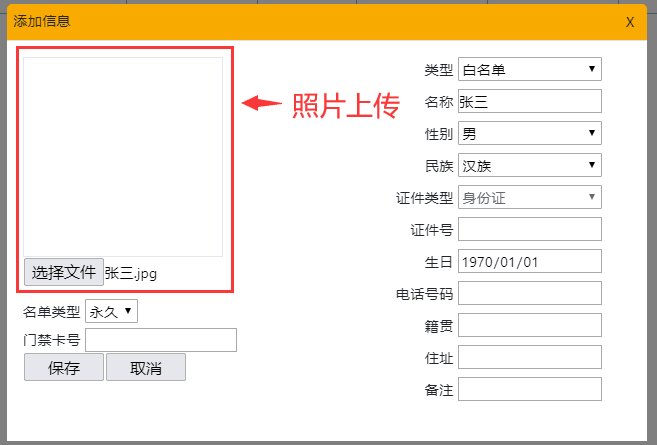
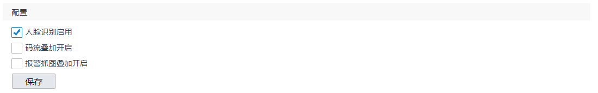

# Web配置使用说明

文件标识：RK-SM-YF-357

发布版本：V1.2.0

日期：2020-06-04

文件密级：□绝密   □秘密   □内部资料   ■公开

---

**免责声明**

本文档按“现状”提供，福州瑞芯微电子股份有限公司（“本公司”，下同）不对本文档的任何陈述、信息和内容的准确性、可靠性、完整性、适销性、特定目的性和非侵权性提供任何明示或暗示的声明或保证。本文档仅作为使用指导的参考。

由于产品版本升级或其他原因，本文档将可能在未经任何通知的情况下，不定期进行更新或修改。

**商标声明**

“Rockchip”、“瑞芯微”、“瑞芯”均为本公司的注册商标，归本公司所有。

本文档可能提及的其他所有注册商标或商标，由其各自拥有者所有。

**版权所有** **© 2020** **福州瑞芯微电子股份有限公司**

超越合理使用范畴，非经本公司书面许可，任何单位和个人不得擅自摘抄、复制本文档内容的部分或全部，并不得以任何形式传播。

福州瑞芯微电子股份有限公司

Fuzhou Rockchip Electronics Co., Ltd.

地址：     福建省福州市铜盘路软件园A区18号

网址：     [www.rock-chips.com](http://www.rock-chips.com)

客户服务电话： +86-4007-700-590

客户服务传真： +86-591-83951833

客户服务邮箱： [fae@rock-chips.com](mailto:fae@rock-chips.com)

---

**前言**

**概述**

本文介绍如何通过web网页对所支持网络摄像机进行配置。

**产品版本**

| **芯片名称** | **内核版本** |
| ------------ | ------------ |
| RV1109，RV1126，RK1808，RK1806 | Linux 4.19 |

**读者对象**

本文档（本指南）主要适用于以下工程师：

技术支持工程师
软件开发工程师

**修订记录**

| **版本号** | **作者** | **修改日期** | **修改说明** |
| ---------- | --------| :--------- | ------------ |
| V1.0.0 | 陈茂森 | 2020-04-29 | 初始版本     |
| V1.1.0 | 陈茂森 | 2020-05-19 | 添加功能说明，用户管理及人脸数据导出说明 |
| V1.2.0 | 陈茂森 | 2020-06-04 | 增加预览界面录像，智能分析人脸识别开关 |

---

**目录**

[TOC]

---

## 功能说明

| **功能\芯片名称**  | **RK1806** | **RV1109** |
| ------------------ | :--------- | ---------- |
| 1 用户登录         | √          | √          |
| 3 预览功能         | ×          | √          |
| 4 回放功能         | ×          | √          |
| 5 人脸识别管理功能 | √          | √          |
| 6.1 系统设置       | √          | √          |
| 6.2 网络设置       | √          | √          |
| 6.3 视频设置       | ×          | √          |
| 6.4 音频设置       | ×          | √          |
| 6.5 图像设置       | ×          | √          |
| 6.6 事件管理       | ×          | √          |
| 6.7.1 计划配置     | ×          | √          |
| 6.7.2 存储管理     | √          | √          |
| 6.8 智能分析       | ×          | √          |

---

## 用户登录

登录地址：相机IP地址 + /login。

①用户信息：初始用户名：admin，密码admin。

②自动登录：设置自动登录时限。

临时登录：1小时内免密登录。

一天内免密登录：24小时内免密登录。

一周免密登录：7天内免密登录。

一月免密登录：30天内免密登录。

浏览器要求：and_chr 81 / and_ff 68 / and_qq 1.2 / and_uc 12.12 / android 81 / baidu 7.12 / chrome 81 / chrome 80 / chrome 79 / edge 81 / edge 80 / edge 18 / firefox 75 / firefox 74 / firefox 73 / firefox 68 / ios_saf 13.3 / ios_saf 13.2 / ios_saf 12.2-12.4 / kaios 2.5 / op_mini all / op_mob 46 / opera 68 / opera 67 / safari 13 / safari 12.1 / samsung 11.1 / samsung 10.1

浏览器说明：使用非要求内浏览器，可能存在部分功能无法使用的情况，如播放器无法正常播放。推荐使用最新版chrome进行操作。

使用浏览器访问登录地址，可见如上图所示登录地址。

## 主界面功能

①预览：预览网络摄像机监控画面，并对部分摄像机参数进行设置，详见3 预览界面。

②回放：查看录像回放，以及抓图存档，详见4 回放。

③人脸识别管理：人脸识别的黑/白名单，抓拍和控制记录管理以及人脸识别参数配置，详见5 人脸识别管理。

④配置：进行网络摄像机的功能配置，详见6  配置。

⑤关于：查看版权信息。

⑥语言选项：双击切换界面语言，支持中英文切换。

⑦用户名：用户信息。

⑧注销：退出登录，回到登录界面。

## 预览界面

①播放器菜单：目前仅支持开始播放以及暂停播放功能。

②码流切换：设置预览界面码流，暂未实现。

③实时抓图：对网络摄像机画面进行实时截取，可在回放中查看记录。

④实时录像：开启实时录像功能，录像过程中按钮转为蓝色，再次点击可结束录像；可在回放中查看记录。

⑤云台：网络摄像机的云台，暂未实现。

## 回放

查看录像回放以及截图。

### 录像

①查询：对已有录像进行条件查询。

②预览：双击查询列表的文件，可在预览窗口中进行预览。

③下载：对选中的录像进行下载。

### 截图

查看所有的抓图记录。

①查询：按条件搜索所有截图。

②下载：对选中的截图进行下载。

## 人脸识别管理

### 人员清单

进入界面按默认条件自动查询。

①查询：条件查询已添加的人员信息。

②添加：单个添加人员信息，界面如下。

照片上传：双击预览区或点击选择文件上传照片。

照片规格要求：格式为jpg，大小小于1MB。

说明：证件类型暂时仅支持身份证，除生日与类型必填外，其他信息未填时，将使用系统默认信息。

③导出excel：将所有满足查询条件的数据整合excel导出（不含图片）。

④批量删除：批量删除选中信息。

⑤编辑：双击查询结果所在行，弹出菜单，可对选中行信息进修改/删除。

⑥特征值：含等待、成功、失败；

等待：设备处理图像中。

成功：设备处理图像成功。

失败：设备处理图像失败，此照片不可用于人脸识别。

### 批量导入

①批量导入：点击弹出导入菜单，进行批量导入

②导入菜单：可选择黑名单或白名单进行批量导入。

照片要求：单个照片大小不超过1MB，格式必须为jpg。

特殊说明：批量导入可能存在照片辨识度低，无法作为人脸识别照片的情况，具体情况见5.1人员清单 特征值。

### 其他功能

抓拍记录：查询网络摄像机抓拍的结果。

控制记录：查询已登记人员的识别记录。

参数配置：配置人脸识别特征参数。

## 配置

### 系统

#### 系统设置

##### 基础设置

查询设备信息，可对设备名称编号进行设置。

##### 时间设置

设置系统时间，界面如下。

①夏令时：根据时区设置，进行夏令时校准。

②时区：设置时区，在NTP校准下，设备时间随时区改动而变化，手动校准下，时区不影响设备时间。

③NTP：设置NTP地址，按设置的间隔，定时校准。

④NTP测试：测试NTP校准情况，暂未实现。

⑤手动校准：按手动设置的时间对设备时间进行校准。

---

#### 系统维护

##### 系统升级

①设备重启：重启设备，待弹窗提示重启完成后，需刷新界面。

②恢复出厂设置：恢复出厂设置，恢复过程中将自动重启设备，待弹窗提示后，需刷新页面。

③设备参数导出：导出含设备参数的db文件。

④设备日志导出：导出含设备日志信息的log文件。

⑤设备参数导入：导入含设备参数的db文件，导入后设备不会重启。

⑥升级：导入设备升级所需的img文件，文件传输完成后设备重启升级，待弹窗提示后，需刷新页面。

##### 日志

展示系统日志，该功能暂未实现。

#### 用户管理

系统用户管理。

①用户列表：展示当前所有注册用户。

②功能菜单：

刷新：刷新用户列表。

添加：添加新用户，仅可添加普通用户。仅默认用户为管理员。

修改：选中用户列表中的用户，点击修改，输入管理员密码验证通过后，可进行密码修改。

删除：选中用户列表中的用户，点击删除，删除选中用户。注：管理员不可删除。

特殊说明：除管理用户外，其他用户分级功能暂未实现。

#### 安全管理

安全管理：该功能暂未实现。

### 网络

#### 基础设置

TCPIP：设置网卡类型以及IP地址。

DDNS：该功能暂未实现。

PPPoE：该功能暂未实现。

Port：设置设备端口。

uPnp：该功能暂未实现。

#### 高级设置

##### WiFi

①启用：启用/关闭WiFi，WiFi开启过程中该功能不可用。

②扫描：扫描附近可用WiFi展示于列表中。

③WiFi列表：显示已扫描到的WiFi。若尝试连接，连接成功后WiFi所在行将显示绿色，连接失败显示红色。

④WiFi设置：设置需要连接的WiFi的密码，名称通过点击WiFi列表中的WiFi自动填充。已成功连接过的WiFi无需再次输入密码即可连接；若需要重设密码，则需先使用删除功能删除该WiFi的记录。

删除：删除选中WiFi的系统记录。

##### 其他功能

SMTP：该功能暂未实现。

FTP：该功能暂未实现。

eMail：该功能暂未实现。

Cloud：该功能暂未实现。

Protocol：该功能暂未实现。

QoS：该功能暂未实现。

Https：该功能暂未实现。

### 视频

#### 编码参数

设置码流、分辨率、图像质量等编码参数。

码流类型：支持主码流，子码流，第三码流，不同码流对应不同参数。

视频类型：支持视频流和复合流，其中复合流包含视频流和音频流，该功能暂未实现。

分辨率：不同码流支持不同分辨率。

码流类型：支持定码率、变码率，定码率设定码率传输，编码率根据实际情况使用不同码率。

图像质量：图像成像质量，设定码流类型为定码率时，图像质量不可设定。

视频帧率：视频每秒帧数。

视频编码：支持H.264、H.265。

Smart：智能模式开启后，对应码流ROI功能关闭，I帧间隔、码率类型、SVC、图像质量、码流平滑不可设置，此时可设置码率下限。Smart开关时，需要进行应用重启。

编码复杂度：同码流，复杂度越高，图像质量越高，功能暂未实现。

SVC：功能暂未实现。

码率上限：最大码率。

码率下限：最小值为码率上限的1/8，与码率上限取平均后得到目标码率。

I帧间隔：两个关键帧间的间隔。

码流平滑：功能暂未实现。

视频帧率：设定视频帧率。

#### 高级编码

临时设置底层参数，主要用于开发者调试，该界面设置参数将不会保存。

#### 兴趣区域

设置不同码流的兴趣区域，每个码流最多可设置4种区域。

①预览/绘图：点击绘制区域可进行绘图，鼠标可拖动兴趣区域，点击兴趣区域四周的调整点，可调整兴趣区域大小。

清除：清除当前区域的绘图框。

说明：单个区域最多绘制一个兴趣区域。

②设置：选择需设置的码流，区域编号，以及提升等级。

---

#### 区域裁剪

对摄像区域进行裁剪，具体效果可在预览界面查看（该功能暂未实现）。

说明：仅支持第三码流，区域大小仅能通过分辨率设置，不可手动调整大小。

### 音频

设置音频参数。

目前默认编码为MP2L2，仅支持输入音量调整，其他功能暂未实现。

---

### 图像

#### ISP设置

①场景：切换网络摄像机场景模式。

②图像调节：设置视频亮度、对比度、饱和度、锐度。

③曝光：设置光圈以及曝光增益。

④日夜转换：根据时间调整曝光。

⑤背光：背光补偿设置，高动态设置，宽动态设置。其中高动态开关时需要重启设备。

⑥白平衡：设置白平衡模式。

⑦图像增强：设置数字降噪、透雾模式、电子防抖、灰度范围、鱼眼矫正。

⑧视频调整：视频镜像，制式等设置。

#### OSD设置

设置OSD字体样式，以及OSD内容。

①预览区域：拖动可设置OSD坐标，保存后可预览OSD设置效果。

②OSD配置：配置OSD，其中OSD属性目前仅支持不透明，不闪烁；仅在国际模式下可设置OSD最小边距。

③OSD内容设置区域：设置OSD内容。

若通道名称以及字符叠加字符过长，超出显示区域部分将不显示。

字符叠加目前仅支持两个叠加区域的设置，预期最高可设置8个字符叠加。

#### 视频遮挡

绘制区域：绘制视频遮挡区域，目前最多绘制1个区域，计划最多绘制4个区域。

清除：清除所有的绘制区域。

说明：目前仅第一个绘图区域遮挡生效。

#### 图片遮挡

使用说明：添加遮挡图片后，预览区域显示等比例红框，拖动红框可调整图像位置。图像X、Y坐标为只读，不可手动设置。

图片规格：图片格式必须为bmp，图片大小需小于 1MB。

### 事件

#### 移动侦测

##### 区域设置

移动侦测功能目前暂未实现。

①启用：启用移动侦测或动态分析

②模式设定：目前仅支持普通模式。

③预览/绘图：进入绘制模式，在预览区域点击并多拖动鼠标可绘制侦测区域。

清除：清除所有绘图。

④参数设置：设置侦测灵敏度。

##### 布防时间

绘制布防时间计划表，每日最多设置8个不同时间区间，该功能暂未实现。

①删除：删除当前选中的时间块/删除所有时间块。

②复制：当鼠标处于绘图区内时，出现该行的复制功能图标，点击后在弹窗中选择需要复制到的日期，将选中行的布防时间块同步到对应日期中。

③修改：单击时间块，在弹窗中输入起始结束时间，对时间块进行修改。或拖动时间块两端的修改点，进行时间块修改。

④绘制：在绘图区域内点击并拖动鼠标可创建布防时间块，时间块可自由拖动，拖动时将显示起始以及结束时间。

##### 联动方式

选择检测的联动方式，该功能暂未实现。

#### 区域入侵

##### 区域设置

设置入侵区域，灵敏度，以及入侵占比，该功能暂未实现。

占比：当入侵物体占设置区域比例大于占比设定时，系统将判定为区域入侵。

##### 布防时间

同6.6.1.2 布防时间。

##### 联动方式

同6.6.1.3 联动方式。

#### 其他功能

报警输入：该功能暂未实现。

报警输出：该功能暂未实现。

异常：该功能暂未实现。

### 存储

#### 计划配置

##### 录像计划

按周别甚至录像时间区间。

①启用：该功能默认开启，暂不支持开关设置。

②删除/全部删除：删除选中时间块。

③计划类型：选择需绘制的计划类型，选择后可在绘图区绘制对应计划时间块。

④高级参数：设计计划具体间隔周期，暂未实现。

⑤计划图例：不同类型计划图例。

其他功能同6.6.1.2 布防时间。

##### 抓图计划

开关于6.7.1.3抓图参数中设置，其余功能同6.7.1.1录像计划。

---

##### 抓图参数

①定时：定时自动抓图，抓图间隔区间为1000ms ~ 7day。

②事件触发：特定事件下触发抓图，抓图间隔1000 ~ 65535ms，抓图数量限制1~120。

#### 存储管理

##### 硬盘管理

设置录像以及抓图功能的磁盘配额，建议格式化后再进行设置。

##### 网络硬盘

该功能暂未实现。

##### 云存储

该功能暂未实现。

---

### 智能分析

#### 叠加和抓图

目前仅支持人脸识别，码流叠加，抓图叠加的开关。

说明：当人脸识别关闭后，码流叠加，抓图叠加将同步被关闭，并隐藏。

#### 屏蔽区域

该功能暂未实现。

#### 规则配置

该功能暂未实现。

#### 高级配置

该功能暂未实现。