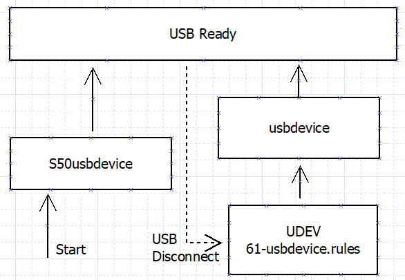
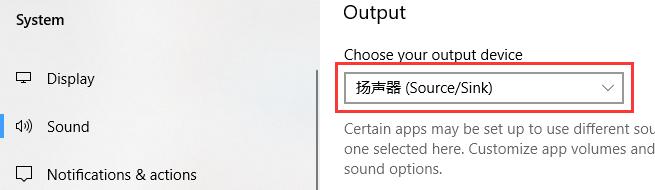
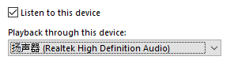

# Rockchip Linux USB Gadget Quick Start

Document ID：RK-JC-YF-316

Release Version：V1.0.0

Date：2020-03-10

Security Level: □Top-Secret   □Secret   □Internal   ■Public

---

**DISCLAIMER**

THIS DOCUMENT IS PROVIDED “AS IS”. FUZHOU ROCKCHIP ELECTRONICS CO., LTD.(“ROCKCHIP”)DOES NOT PROVIDE ANY WARRANTY OF ANY KIND, EXPRESSED, IMPLIED OR OTHERWISE, WITH RESPECT TO THE ACCURACY, RELIABILITY, COMPLETENESS,MERCHANTABILITY, FITNESS FOR ANY PARTICULAR PURPOSE OR NON-INFRINGEMENT OF ANY REPRESENTATION, INFORMATION AND CONTENT IN THIS DOCUMENT. THIS DOCUMENT IS FOR REFERENCE ONLY. THIS DOCUMENT MAY BE UPDATED OR CHANGED WITHOUT ANY NOTICE AT ANY TIME DUE TO THE UPGRADES OF THE PRODUCT OR ANY OTHER REASONS.

**Trademark Statement**

"Rockchip", "瑞芯微", "瑞芯" shall be Rockchip’s registered trademarks and owned by Rockchip. All the other trademarks or registered trademarks mentioned in this document shall be owned by their respective owners.

**All rights reserved. ©2019. Fuzhou Rockchip Electronics Co., Ltd.**

Beyond the scope of fair use, neither any entity nor individual shall extract, copy, or distribute this document in any form in whole or in part without the written approval of Rockchip.

Fuzhou Rockchip Electronics Co., Ltd.

No.18 Building, A District, No.89, software Boulevard Fuzhou, Fujian,PRC

Website:     [www.rock-chips.com](http://www.rock-chips.com)

Customer service Tel:  +86-4007-700-590

Customer service Fax:  +86-591-83951833

Customer service e-Mail:  [fae@rock-chips.com](mailto:fae@rock-chips.com)

---

## **Preface**

 **Overview**

This document mainly introduces the basic usage of Linux USB Gadget, aiming to help developers understand and use Linux USB Gadget functions faster.

**Product Version**

| **Platform** | **Kernel version** |
| ------------ | ------------------ |
| Linux        | V4.4               |

**Intended Audience**

This document (this guide) is mainly intended for:

Technical support engineers
Software development engineers

**Revision History**

| **Date**   | **Revision No.** | **Author** | **Revision History**                                         |
| ---------- | ---------------- | :--------- | ------------------------------------------------------------ |
| 2019-12-10 | V0.0.1           | Zain Wang  | Initial version                                              |
| 2020-03-10 | V1.0.0           | Zain Wang  | Update English screenshot Update some description of the word |

---

## **Contents**

[TOC]

---

## **1 Linux-USB Gadget API Framework**

USB Gadget is a system running inside a USB peripheral normally has at least three layers inside the kernel to handle USB protocol processing, and may have additional layers in user space code. The gadget API is used by the middle layer to interact with the lowest level (which directly handles hardware).

In Linux, from the bottom up, these layers are:

- **USB Controller**: This is the lowest software level. It is the only layer that talks to hardware. That hardware is exposed through endpoint objects, which accept streams of IN/OUT buffers, and through callbacks that interact with gadget drivers.
- **USB Gadget**: The lower boundary of this driver implements hardware-neutral USB functions, using calls to the controller driver. For example, setup a function by using ep0 protocol response including class-specific functionality, and managing IN and OUT transfers on all currently enabled endpoints.
- **Upper Level**: Most gadget drivers have an upper boundary that connects to some Linux driver or framework in Linux. Through that boundary flows the data which the gadget driver produces and/or consumes through protocol transfers over USB.
- **Additional Layers**: Other layers may exist. These could include kernel layers, such as network protocol stacks, as well as user mode applications building on standard POSIX system call APIs such as `open()`, `close()`, `read()` and `write()`.

**NOTE:** reference documents: <https://www.kernel.org/doc/htmldocs/gadget/intro.html>

### **1.1 Kernel Configuration**

USB Gadget function is configured in menuconfig as follows:

~~~shell
Location:
  -> Device Drivers
    -> USB support
      -> USB Gadget Support
        -> USB Gadget Drivers
~~~

There is a set of automatic configuration scripts under RK Linux, to achieve the following automatic configuration functions:

~~~shell
CONFIG_USB_CONFIGFS_ACM
CONFIG_USB_CONFIGFS_RNDIS
CONFIG_USB_CONFIGFS_MASS_STORAGE
CONFIG_USB_CONFIGFS_F_FS
CONFIG_USB_CONFIGFS_F_MTP
CONFIG_USB_CONFIGFS_F_UAC1
CONFIG_USB_CONFIGFS_F_UAC2
CONFIG_USB_CONFIGFS_F_UVC
~~~

### **1.2 USB configfs**

configfs is a ram-based filesystem that provides the converse of sysfs's functionality. Where sysfs is a filesystem-based view of kernel objects, configfs is a filesystem-based manager of kernel objects, or config_items.

With sysfs, an object is created in kernel (for example, when a device is discovered) and it is registered with sysfs. Its attributes then appear in sysfs, allowing userspace to read the attributes via readdir/read. It may allow some attributes to be modified via write. The important point is that the object is created and destroyed in kernel, the kernel controls the lifecycle of the sysfs representation, and sysfs is merely a window on all this.

A configfs config_item is created via an explicit userspace operation: mkdir. It is destroyed via rmdir. The attributes appear at mkdir time, and can be read or modified via read and write. As with sysfs, readdir queries the list of items and/or attributes. symlink can be used to group item together. Unlike sysfs, the lifetime of the representation is completely driven by userspace. The kernel modules backing the items must respond to this.

## **2 USB Gadget Usage**

### **2.1 USB Management Process**

There are three USB related files in `RKScript` package：

~~~shell
S50usbdevice # /etc/init.d/ works with .usb_config in the same directory
usbdevice # /usr/bin/
61-usbdevice.rules # /lib/udev/rules.d/
#There are two related files that need to be built or modified by users
.usb_config # /etc/init.d/
/tmp/.usb_config # S50usbdevice generates automaticlly

~~~

You can directly  modify .usb_config and execute S50usbdevce script to configure USB function when needed.

After USB function is configured successfully, the following log will be showed to indicate USB is ready:

~~~shell
[   66.178517] android_work: sent uevent USB_STATE=CONNECTED
[   66.179977] configfs-gadget gadget: high-speed config #1: b
[   66.180663] android_work: sent uevent USB_STATE=CONFIGURED
~~~

### **2.2 Function Configuration**

USB function configuration is written in `/etc/init.d/.usb_config`. You can change USB function by modifying `/tmp/.usb_config` and run `/etc/init.d/S50usbdevice restart` during running state.

Currently USB Gadget auto-configuration supports the following options for `.usb_config`:

~~~ shell
usb_adb_en
usb_uac1_en
usb_uac2_en
usb_rndis_en
usb_mtp_en
usb_ums_en
usb_acm_en
usb_uvc_en
~~~

**Differences between `/etc/init.d/.usb_config` and `/tmp/.usb_config`：**

`/etc/init.d/.usb_config` is **the default configuration**, sometimes your system may be a read-only system, and the file is unable to modify. Therefore, it is not recommended to modify this file in running state except for special cases.

`/tmp/.usb_config` is a copy file of `/etc/init.d/.usb_config`. After booting, S50usbdevice will copy the `/etc/init.d/.usb_config` to `/tmp` which is a ram space and could be modified at any time. When you need to modify USB function in the running state, you can modify this file and reset USB function by `/etc/init.d/S50usbdevice restart`.

#### 2.2.1 ADB (Android Debug Bridge)

ADB is a versatile command line debugging tool that can be used for file transfer, Unix Shell login and other functions.

ADB will be start properly by upper-layer application **`adbd`** , and the `adbd` compilation switch needs to be turned on in Buildroot.

~~~shell
BR2_PACKAGE_ANDROID_TOOLS_ADBD
~~~

After ensuring there is an `adbd` running in your system, run the following command and connect to PC:

~~~shell
echo usb_adb_en > /tmp/.usb_config
/etc/init.d/S50usbdevice restart
~~~

Run `adb devices`, you can get devices on PC.

Note: If not find the device by `adb device` under Linux, run the following command:

~~~shell
adb kill-server
sudo adb devices
~~~

In Windows system, ADB driver need to be installed, `adb devices` need to run as an administrator if necessary.

#### 2.2.2 UAC (USB Audio Class)

UAC implements the function of audio transmission between Device and Host for Host devices through USB virtual standard PCM interface.

UAC has two versions, UAC1 and UAC2. The differences between UAC2 and UAC1 follows:

- The bandwidth of UAC2 is higher than UAC1 (the implementation of each platform is slightly different depends on actual testing)

- Windows 7 and some Windows 10 systems do not support UAC2 by default. You need to install the driver manually, but they all support UAC1.

You can enable UAC by running the following command:

~~~shell
echo usb_uac1_en > /tmp/.usb_config # or usb_uac2_en
/etc/init.d/S50usbdevice restart
~~~

UAC testing requires a third-party open-source library ALSA. Use `aplay -l` or `arecord -l` to find supported sound cards used to playing or recording:

~~~shell
# aplay -l
card 2: rk3xxx [rk3xxx], device 0: USB Audio [USB Audio]
  Subdevices: 1/1
  Subdevice #0: subdevice #0

# Specify the device setting by using: -D "hw:${card},${device}" (the above information can be written as -D "hw:2,0")
~~~

UAC test process needs to build a loopback of audio data stream to test UAC Playback and Capture functions at the same time:

(1) PC plays audio to Device

Linux:

~~~shell
aplay -D "plughw:2,0" -f S16_LE -r 48000 -c 2 /userdata/test.wav
# plughw: if the audio sampling rate does not match the setting, alsa will resample the audio to ensure that the output audio sampling rate is consistent with the setting
~~~

Windows:

Right-click the sound icon at the bottom right corner-> `Open Sound Settings`-> Select output device and select the device (generally its name is Source/Sink which is related to Windows version), and then open the player to play music.

(2) Device will redirect the audio from UAC Playback to Capture

~~~shell
arecord -D "hw:3,0" -f S16_LE -r 48000 -c 2 -t raw -N |  aplay -D "hw:3,0" -f S16_LE -r 48000 -c 2 -t raw -N
~~~

(3) PC will redirect the audio from UAC Capture to normal speakers

Linux

~~~shell
arecord -D "hw:2,0" -f S16_LE -r 44100 -c 2 -t raw -N | aplay -D "hw:1,0" -f S16_LE -r 44100 -c 2 -t raw -N
~~~

Windows:

Right-click the sound icon at the lower right corner-> "Open Sound Settings"-> Select the input device and select the device (generally its name is Source/Sink which is related to Windows version)

Click on `Device properties->Additional device properties`, select item `Listen` and `Listen to this device` ,click on `Play through this device` to select the original playback device of PC.

In this way you will hear the test audio from the speaker of your PC.

#### 2.2.3 RNDIS (Remote Network Driver Interface Specification)

RNDIS provides network interface specifications based on USB. Data interaction between Device and Host can be done by network commands (like SSH, etc.).

Run the following commands to enable RNDIS function:

~~~shell
echo usb_rndis_en > /tmp/.usb_config
/etc/init.d/S50usbdevice restart
~~~

You can find a new network card on both Host and Device by ifconfig:

~~~shell
# Host Linux
ifconfig
enp0s20u3u4u4 Link encap:Ethernet  HWaddr d6:11:03:17:c3:97
          inet6 addr: fe80::3fa6:da84:77bd:122a/64 Scope:Link
          UP BROADCAST RUNNING MULTICAST  MTU:1500  Metric:1
          RX packets:61 errors:0 dropped:0 overruns:0 frame:0
          TX packets:187 errors:0 dropped:0 overruns:0 carrier:0
          collisions:0 txqueuelen:1000
          RX bytes:7198 (7.1 KB)  TX bytes:41844 (41.8 KB)
# Device
ifconfig
usb0      Link encap:Ethernet  HWaddr 46:26:71:47:E3:9F
          inet addr:169.254.216.27  Bcast:169.254.255.255  Mask:255.255.0.0
          inet6 addr: fe80::9e72:7f20:cc68:4a34/64 Scope:Link
          UP BROADCAST RUNNING MULTICAST  MTU:1500  Metric:1
          RX packets:606 errors:606 dropped:0 overruns:0 frame:606
          TX packets:125 errors:0 dropped:0 overruns:0 carrier:0
          collisions:0 txqueuelen:1000
          RX bytes:100024 (97.6 KiB)  TX bytes:30346 (29.6 KiB)
~~~

Host did not assign an IPv4 address which can be specified by ifconfig command manually:

~~~shell
#RNDIS address is fixed 169.254.216.1
ifconfig enp0s20u3u4u4 down
ifconfig enp0s20u3u4u4 169.254.216.1
ifconfig enp0s20u3u4u4 up
~~~

Now, you can use ping command on Device or Host to communicate with each other.

**Note**: IPV4 address is assigned automatically and successfully without manual assignment under Windows.

#### 2.2.4 MTP (Media Transfer Protocol)

MTP is a media file transfer protocol proposed by Microsoft, which can conveniently share media files between Device and Host.

MTP could start normally depended on `mtp-server` of upper-layer application. and the `mtp-server` compilation switch in Buildroot should be enabled.

~~~shell
BR2_PACKAGE_MTP
~~~

After making sure there is a `mtp-server` in the system, run the following command and connect to PC:

~~~shell
echo usb_mtp_en > /tmp/.usb_config
/etc/init.d/S50usbdevice restart
~~~

Then you will see the "--- MODEL ---" device on the PC, which is the same in Linux and Windows.

**Note**: The MTP attribute name can be modified in buildroot/package/rockchip/mtp, please refer to the patch. The /userdata directory is shared by default.

#### 2.2.5 UMS (USB Mass Storage)

UMS provides large-capacity external storage for Host devices.

Differences between UMS and MTP follows:

- UMS works in blocks, but MTP works in files.

- When UMS works, target block works exclusively, if multi-user operate the same block will cause errors; but MTP supports multi-user operation.

  Run the following command to enable UMS:

~~~shell
echo usb_ums_en > /tmp/.usb_config
echo "ums_block=/dev/block/by-name/userdata" >> /tmp/.usb_config # it could be replaced with an image file,for example /userdata/ums_shared.img
/etc/init.d/S50usbdevice restart
~~~

You will see a new USB drive on your PC.

As UMS Block works exclusively, S50usbdevice provides a new property that enables UMS Block to be uninstalled from the device when it is connected to a PC to prevent the device from operating incorrectly; when the PC is disconnected, it will be remounted to `/mnt/ums`.

You can enable the following properties in .usb_config:

~~~shell
echo "ums_block_auto_mount=on" >> /tmp/.usb_config
~~~

If you don't want to use a logical partition to load UMS, you can use an image file instead of a logical partition. image can be generated by yourself or automatically generated by S50usbdevice script.

~~~shell
#To generate a fat format with 8M size image file automatically, and enable UMS to mount automatically
echo usb_ums_en > /tmp/.usb_config
echo "ums_block=/userdata/ums_shared.img" >> /tmp/.usb_config
echo "ums_block_size=8" >> /tmp/.usb_config #Unit M
echo "ums_block_type=fat" >> /tmp/.usb_config
echo "ums_block_auto_mount=on" >> /tmp/.usb_config
/etc/init.d/S50usbdevice restart
~~~

All above operations can be configured in Buildroot in this path: Target packages-> Rockchip BSP packages-> rockchip usb mass storage. After configuration, rebuild `RKscript` to generate `/etc/init.d/.usb_config` automatically.

#### 2.2.6 ACM (CDC - ACM: Communication Device Class - Abstract Control Model)

It can be understood as a USB virtual serial port, and generates TTY devices both in Device and Host.

Run the following command to enable ACM:

~~~shell
echo usb_acm_en > /tmp/.usb_config
/etc/init.d/S50usbdevice restart
~~~

After enabling ACM, the /dev/ttyGS0 device will be found on the Device and the /dev/ttyACM0 device will be found on the PC.

~~~shell
#Run the following command on PC:
echo test > /dev/ttyACM0
#Run the following command on Device
cat /dev/ttyGS0 #to get test output
~~~

#### 2.2.7 UVC (USB Video Class)

UVC function requires UVC application to start normally. A test demo (`uvc_app`) is provided in Buildroot, and the corresponding compilation switch needs to be turned on in Buildroot.

~~~shell
BR2_PACKAGE_UVC_APP
~~~

To manually modify S50usbdevice script and add:

~~~shell
-       # Add uvc app here with start-stop-daemon
+       if [ $UVC_EN = on ];then
+               start-stop-daemon --start --quiet --background --exec /usr/bin/uvc_app -- 640 480
+       fi
~~~

Use the following command to enable UVC:

~~~shell
echo usb_uvc_en > /tmp/.usb_config # Output is 640x480 format image by default
/etc/init.d/S50usbdevice restart
~~~

Checking tool on the Host: it  recommends to use `guvcview` in Linux and  `amcap` in Windows, select `Device-> UVC Camera / Options-> Preview`

The bottom left corner shows the frame rate.

**Note:**

- `uvc_app` is just a test demo, not an formal application. It displays 4 solid-color stripes. Users can modify the application according to this demo.
- UVC application is needed when using UVC function; otherwise, starting UVC function directly will cause abnormal USB functions.
- If your system is a read-only file system, S50usbdevice should be modified in advance before the system is packaged
- UVC is not friendly support hot plug. Once USB Gadget completes unbind action, UVC will not be used normally, which is caused by V4L2 registration mechanism.

### **2.3 USB Composite Device**

If conditions of port and bandwidth permits, The composite function of USB Gadget can be used to combine multiple USB Gadegt functions into one USB Port.

For example: combine ADB + RNDIS:

~~~shell
echo usb_mtp_en > /tmp/.usb_config
echo usb_adb_en >> /tmp/.usb_config
/etc/init.d/S50usbdevice restart
~~~
