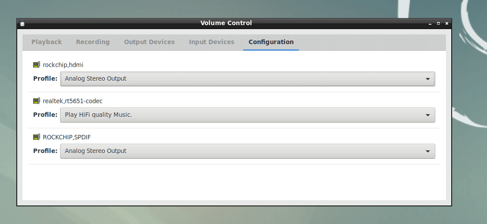
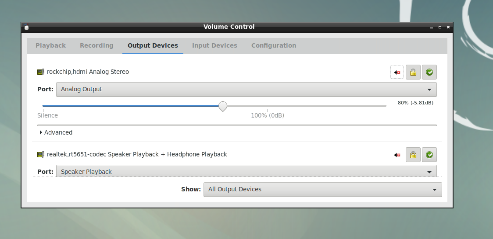

# Rockchip Linux Graphics开发指南

文档标识：RK-SM-YF-345

发布版本：V1.0.0

日期：2020-03-18

文件密级：□绝密   □秘密   □内部资料   ■公开

---

**免责声明**

本文档按“现状”提供，福州瑞芯微电子股份有限公司（“本公司”，下同）不对本文档的任何陈述、信息和内容的准确性、可靠性、完整性、适销性、特定目的性和非侵权性提供任何明示或暗示的声明或保证。本文档仅作为使用指导的参考。

由于产品版本升级或其他原因，本文档将可能在未经任何通知的情况下，不定期进行更新或修改。

**商标声明**

“Rockchip”、“瑞芯微”、“瑞芯”均为本公司的注册商标，归本公司所有。

本文档可能提及的其他所有注册商标或商标，由其各自拥有者所有。

**版权所有** **© 2020** **福州瑞芯微电子股份有限公司**

超越合理使用范畴，非经本公司书面许可，任何单位和个人不得擅自摘抄、复制本文档内容的部分或全部，并不得以任何形式传播。

福州瑞芯微电子股份有限公司

Fuzhou Rockchip Electronics Co., Ltd.

地址：     福建省福州市铜盘路软件园A区18号

网址：     www.rock-chips.com

客户服务电话： +86-4007-700-590

客户服务传真： +86-591-83951833

客户服务邮箱： fae@rock-chips.com

---

**前言**

**概述**

文档主要介绍 Rockchip Linux Graphics使用说明，旨在帮助工程师更快上手Graphics开发及相关调试方法。

**读者对象**

本文档（本指南）主要适用于以下工程师：

技术支持工程师

软件开发工程师

**各芯片系统支持状态**

| **芯片名称**    | **Buildroot** | **Debian** | **Yocto** |
| ----------- | :-------------- | :------------- | :---------- |
| RK3288 | Y               | Y              | N           |
| RK3399      | Y               | Y              | N           |
| RK3399Pro      | Y               | Y              | N           |

## **修订记录**

| **日期**   | **版本** | **作者** | **修改说明** |
| ---------- | -------- | -------- | ------------ |
| 2020-03-18 | V1.0.0   | Caesar Wang   | 初始版本     |

## **目录**

---
[TOC]
---

## 1 Rockchip Linux Graphics介绍

### 1.1 概述

Rockchip Linux平台的Graphics，是应用上DRM和DMA-BUF的ARM Linux平台。优势是，通用的架构，在上面客制化会很容易，可以利用很多现有组件，现有很多基础开源项目的开发，都开始基于Rockchip平台来作为ARM端的适配平台。但缺点是，很多人不是很理解这些内容，实际应用起来需要一个学习过程。更多资料可以参考[Rockchip wiki](http://opensource.rock-chips.com/wiki_Graphics)。

### 1.2 芯片硬件模块介绍

#### 1.2 1 VOP (Video Output Processor)

VOP是从存储器帧缓冲区到显示设备的显示接口, 是显示单元用来显示图像 （比如输入NV12,RGB的Buffer，显示到屏幕）。

VOP的一些特性：比如RK3399/RK3399PRO有VOP_LIT和VOP_BIG两个VOP，其中VOP_BIG有4个图层，VOP_LIT有2个图层。VOP_BIG最大可支持到4K（4096x2160）分辨率，VOP_LIT最大可支持到2K（2560x1600）分辨率。

#### 1.2.2 GPU (Graphics Process Unit)

GPU提供了一个基于开放标准的完整图形加速平台,支持2D,3D和GPGPU计算，Rockchip Linux的GPU有提供OpenGles，EGL，OpenCl的 API，不支持OPENGL.支持类型如下:

- OpenGL ES 3.0
- OpenGL ES 2.0
- OpenGL ES 1.1
- OpenCL 1.2
- OpenCL 1.1
- OpenCL 1.0
- DirectX 11.1
- DirectX 9

#### 1.2.3 RGA (Raster Graphic Acceleration)

Rockchip RGA是一个独立的二维光栅图形加速单元。它加速了二维图形操作，
例如点/线绘制、图像缩放、旋转、位图、图像合成等。

### 1.3 图像软件模块介绍

主要理解libdrm,wayland和x11(compositor), mesa和libmali,qt和gtk（applcation）的关系。可参[Linux_Graphics_Stack](https://upload.wikimedia.org/wikipedia/commons/c/c2/Linux_Graphics_Stack_2013.svg)。

#### 1.3.1 LIBDRM

LIBDRM是一个跨驱动的中间件，它允许用户空间应用（例如作为Mesa和2D驱动程序）通过DRI与内核通信协议。参考如下DRM结构图：


LIBDRM是DRM下沟通驱动和用户层的库。过去APP可能是直接使用open(fb)这样的方式来和图形驱动沟通，但是在现在的硬件演化下，已经不合适了。有以下一些理由：

- 有多个图层怎么办？

- 有多个屏幕怎么办？

- 怎么处理vsync的问题，怎么同步不撕裂？

- 怎么利用上dmabuf，做到memory zero-copy？

LIBDRM的存在就是用来方便用户层和驱动这些问题，提供API给X11, Wayland这样的display backend使用。如果程序比较简单，比如一个广告机循环播放视频，那是可以直接调用LIBDRM，但是不建议直接使用LIBDRM的API。原因很多：

- 首先，LIBDRM本身是一个比较新的API，而且接触者局限在相关的DRM驱动开发和Wayland/Xserver开发上。

- 另外，LIBDRM的演进比较快，比如说API还分atomic和legacy, 很多效果依赖于厂商的实现，Rockchip有修改一些core API的表现效果来辅助产品项目，所以同个API在不同平台表现有可能完全不同的。这里不是让你用X11和Wayland，而是用我们封装好的东西。 比如，广告机循环播放视频，那最好是用gstreamer，然后选kmssink显示，而不是直接调用LIBDRM的API。

DRM里有crtc，plane，connector这三个概念，可以这么理解:

- connector就是屏幕，比如一个hdmi一个connector num， 一个dsi一个connector num。
- crtc表示vop， 一个屏幕一般对应一个crtc。
- plane就是图层，比如视频层在plane2，UI在plane1， 视频在UI上面。

DRM里API分两套，legacy和atomic。

legacy看名字就是早期的API，我们现在大部分程序也都是用的legacy API。 里面有几个关键的功能接口要注意下，drmModeSetCrtc包括了drmModeSetPlane和drmModePageFlip。

drmModeSetCrtc一般是用来设置UI层，同时用来设置分辨率。
drmModeSetPlane用来设置不同图层的显示，比如视频。参数上分别是要显示buffer fd，要操作的图层，要显示的大小，buffer的大小。它会缩放buffer显示到屏幕上。在Rockchip平台上这个API是async的，两续调用两次，前面的就被覆盖了，可能需要drmwaitvblank一下。
为什么要这么多地方呢。因为想在legacy的API上也完成多图层的显示。假设目前有图层1和图层2,图层1调用一次drmModeSetPlane，图层2也调用一次drmModeSetPlane，然后它们都等一个vsync单位的时间，如果屏幕刷新率60hz，那么最大帧数是不是只有30fps？ 为了解决这个问题，上游的人又开发了atomic的API。

其中atomic API的实质可以理解为一个提交包括了所有图层的更新信息。这样就不用调用两次drmModeSetPlane了，而是一次的drmModeAtomicCommit，跟上所有的参数。 atomic还有一个很特殊的功能在于它可以设置plane的zpos，这样就可以自由交换overlay plane和primary plane的显示层级了。之前我们在legacy api（kmssink）的时候都在kernel里hard code层级，但用atomic（mpv）的时候就不需要这样做，设置zpos后，osd（primary layer）也能在video(overlay layer)上面显示了。

```shell
mainline source code:
git clone git://anongit.freedesktop.org/mesa/drm
rockchip libdrm source code:
git clone https://github.com/rockchip-linux/libdrm-rockchip.git
```

详情请参考以下资料：

- Rockchip wiki官网[wiki_Libdrm]( http://opensource.rock-chips.com/wiki_Libdrm)。
- [官方文档](https://dri.freedesktop.org/docs/drm/gpu/drm-kms.html)。

leagacy的实例

- [mpp+libdrm](https://github.com/sliver-chen/mpp_linux_cpp)
- [rga+libdrm](https://github.com/Caesar-github/rga-v4l2-demo)
- [gstreamer里的kmssink](https://github.com/rockchip-linux/gstreamer-rockchip-extra/blob/master/gst/kms/gstkmssink.c)

atomic的实例

- [mpv播放器](https://github.com/mpv-player/mpv/pull/5008/commits)

当然最好还是看libdrm的文档和test程序。 如果你是自己写小程序，可以把mpp+libdrm那demo里的rkdrm下的文件抽出来自己用，还是挺方便的。如果只是写给rockchip平台用，就legacy api，如果还有多个平台的需求，就研究下atomic了。

#### 1.3.2 LIBMALI

前面说了，GPU是提供opengles，egl，opencl API的，所以要这几个工作，就需要把LIBMALI加进rootfs里。

默认的binary在[rockchip github](https://github.com/rockchip-linux/libmali)
命名规则： GPU型号-软件版本-硬件版本（如果有的话，比如说r1p0区分3288和3288w）-编译选项。

要注意编译选项:
不带后缀。是x11-gbm，注意GBM是配置DRM使用的memory机制，如果不是3.10的kernel，不要用fbdev的。GBM是给QT EGLFS这样的程序用的，不依赖X11,Wayland。Wayland/ Wayland-gbm给Wayland使用。

#### 1.3.3 ZERO-COPY

用mali显示dmabuf的数据，比如说摄像头，视频，其实是可以用dmabuf ZERO-COPY机制优化的。 不然载入texture还要cpu去拷贝。X11/Wayland有ZERO-COPY的配置，可以搜下相关的Wayland dmabuf。

#### 1.3.4 X11

就和一般桌面平台差不多，不过X11有个GPU性能缺陷的问题。

参考链接如下:

```http
https://en.wikipedia.org/wiki/X.Org_Server
https://www.comptechdoc.org/os/linux/howlinuxworks/linux_hlxwindows.html
https://dri.freedesktop.org/wiki/DDX/
https://www.freedesktop.org/wiki/Software/Glamor/
https://en.wikipedia.org/wiki/X.Org_Server
```

#### 1.3.5 Wayland

建议使用Yocto/Buildroot SDK做Wayland的开发。 效率上Wayland要比X11好点，主要是兼容性问题。如果不需要桌面，又要多窗口，可以Wayland试试看。

参考资料：

```http
https://en.wikipedia.org/wiki/Wayland
```

#### 1.3.6 None

除了X11和Wayland之外，还有None，这也是嵌入式上接触比较多的。 比如MiniGUI，SDL皆是如此。

若要支持到DRM和opengl的话，就只能选择QT了。

#### 1.3.7 QT EGLFS

QT EGLFS是QT自己实现的一个GUI系统，不支持多窗口，但也因此少了window compoiste。
QT EGLFS和dri2的方式也差不多，区别就在于，QT EGLFS的font buffer在自己用gpu compoiste后，是直接送给DRM去显示，而X里是送Window manager去做compoiste，所以EGLFS在效率上是有优势的。

#### 1.3.7 显示架构的选择

- QT+ Wayland
- QT + EGLFS
- EGL program + X11
- X11
- Wayland
- None

多窗口的功能需求,选择:

- X11
- Wayland

桌面的功能需求,选择:

- X11

4K视频播放+全屏:

- QT+ Wayland
- QT + EGLFS
- X11
- Wayland

4K视频播放+多窗口:

- X11
- QT+ Wayland
- Wayland

### 1.4 双屏异显异音功能的介绍

Rockchip Linux 在 Debian/Buildroot 平台上对DP/HDMI/MIPI/eDP/LVDS等显示接口可以任意组合,支持双屏同显或异显的功能。当双屏异显时，一个显示接口当主屏，另一个当副屏。同时也支持不同声卡在不同显示上播放， 下面主要介绍双屏异显和双屏异声功能。

#### 1.4.1 Debian双屏显示功能介绍

在 Debian 使用X11系统，可以使用 xrandr 去设置双屏同显和异显功能。

"xrandr" 是一款官方的 RandR (Resize and Rotate)Wikipedia:X Window System 扩展配置工具。它可以设置屏幕显示的大小、方向、镜像等。对多显示器的情况请参考 [Multihead](https://wiki.archlinux.org/index.php/Multihead) 页面。

##### 1.4.1.1 系统的显示设备及设备名

支持命令行和界面下对双屏显示模式进行设置。

菜单界面：
使用鼠标点击 menu->Prefences->Monitor Settings


命令行：

```shell
su linaro -c "DISPLAY=:0 xrandr"
```

输出：

```shell
root@linaro-alip:/# su linaro -c "DISPLAY=:0 xrandr"
Screen 0: minimum 320 x 200, current 1920 x 2048, maximum 8192 x 8192
eDP-1 connected primary 1536x2048+0+0 (normal left inverted right x axis y axis) 0mm x 0mm
   1536x2048     59.99*+
HDMI-1 connected 1920x1080+0+0 (normal left inverted right x axis y axis) 708mm x 398mm
   1920x1080     60.00*+  50.00    59.94    30.00    24.00    29.97    23.98
   1920x1080i    60.00    50.00    59.94
   1280x1024     60.02
   1440x900      59.90
   1360x768      60.02
   1280x720      60.00    50.00    59.94
   1024x768      60.00
   800x600       60.32
   720x576       50.00
   720x576i      50.00
   720x480       60.00    59.94
   720x480i      60.00    59.94
   640x480       60.00    59.94
DP-1 disconnected (normal left inverted right x axis y axis)
```

可以看到当前系统有两个显示设备，设备名分别为 HDMI-1 和 eDP-1。

##### 1.4.1.2 双屏显示模式设置

双屏支持双屏同显，双屏异显模式。异显模式下支持 On right、Above、On left、Below四种模式。
菜单界面：
在 Display Settings 中设置设备的 Position,则可以切换双屏的显示模式：


命令行:

```shell
su linaro -c "DISPLAY=:0 xrandr --output HDMI-1 --above eDP-1"
```

其中--above 参数可以设置为 right-of, left-of, below, same-as 切换双屏的显示模式
Default/same-as 模式下为双屏同显。

#### 1.4.2  Buildroot双屏显示功能介绍

Buildroot SDK的Weston支持多屏同异显及热拔插等功能，不同显示器屏幕的区分根据drm的name（通过Weston启动log或者/sys/class/drm/card0-\<name\>获取），相关配置通过环境变量设置，如：

```shell
    # /etc/init.d/S50launcher
      start)
			...
			export WESTON_DRM_PRIMARY=HDMI-A-1 # 指定主显为HDMI-A-1
			export WESTON_DRM_MIRROR=1 # 使用镜像模式（多屏同显），不设置此环境变量即为异显
			export WESTON_DRM_KEEP_RATIO=1 # 镜像模式下缩放保持纵横比，不设置此变量即为强制全屏
			export WESTON_DRM_PREFER_EXTERNAL=1 # 外置显示器连接时自动关闭内置显示器
			export WESTON_DRM_PREFER_EXTERNAL_DUAL=1 # 外置显示器连接时默认以第一个外显为主显
			weston --tty=2 -B=drm-backend.so --idle-time=0&
			...
```

镜像模式缩放显示内容时需要依赖RGA加速。

同时也支持在weston.ini的output段单独禁用指定屏幕：

```ini
    # /etc/xdg/weston/weston.ini

    [output]
    name=LVDS-1

    mode=off
    # off|current|preferred|<WIDTHxHEIGHT@RATE>
```

#### 1.4.3  Debian双屏异音功能介绍

(1) 在Debian系统Sound&Video---->PulseAudio Volume Control ，然后对应声卡进行播放，比下图：



我们也可以使用 aplay 来确认声卡和选择声卡播放。
aplay -l:

```shell
root@linaro-alip:~# aplay -l
**** List of PLAYBACK Hardware Devices ****
card 0: realtekrt5651co [realtek,rt5651-codec], device 0: dailink-multicodecs rt5651-aif1-0 []
  Subdevices: 0/1
  Subdevice #0: subdevice #0
card 1: rockchiphdmi [rockchip,hdmi], device 0: ff8a0000.i2s-i2s-hifi i2s-hifi-0 []
  Subdevices: 0/1
  Subdevice #0: subdevice #0
card 2: ROCKCHIPSPDIF [ROCKCHIP,SPDIF], device 0: ff870000.spdif-dit-hifi dit-hifi-0 []
  Subdevices: 0/1
  Subdevice #0: subdevice #0

RT5651测试:  aplay -D plughw:0,0 /dev/urandom
HDMI声卡测试: aplay -D plughw:1,0 /dev/urandom
SPDIF声卡测试:: aplay -D plughw:2,0 /dev/urandom
```

(2) 打开一个音乐歌曲从主屏拖到副屏，然后在主屏中同样方式选择一个声卡来播放。比如下：



#### 1.4.4  Buildroot双屏异音功能介绍

Buildroot上应用还没开发对应功能，可以在qfm/oem/piano2-CoolEdit.mp3进行播放，声卡可以通过如下命令进行切换：

```shell
RT5651： aplay -D plughw:0,0 /dev/urandom
HDMI声卡测试: aplay -D plughw:1,0 /dev/urandom
SPDIF声卡测试： aplay -D plughw:2,0 /dev/urandom
```
