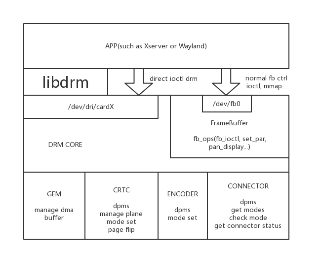
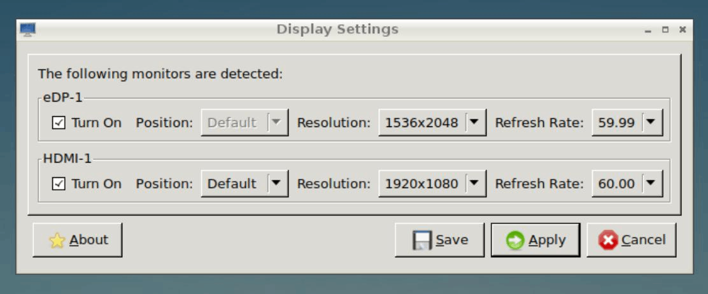
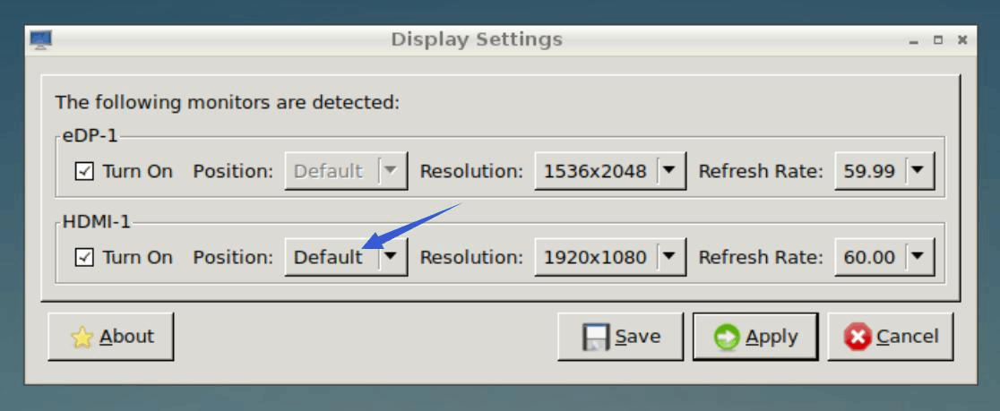

# Rockchip Linux Graphics Developer Guide

ID: RK-SM-YF-345

Release Version: V1.1.1

Release Date: 2020-07-28

Security Level: □Top-Secret   □Secret   □Internal   ■Public

**DISCLAIMER**

THIS DOCUMENT IS PROVIDED “AS IS”. ROCKCHIP ELECTRONICS CO., LTD.(“ROCKCHIP”)DOES NOT PROVIDE ANY WARRANTY OF ANY KIND, EXPRESSED, IMPLIED OR OTHERWISE, WITH RESPECT TO THE ACCURACY, RELIABILITY, COMPLETENESS,MERCHANTABILITY, FITNESS FOR ANY PARTICULAR PURPOSE OR NON-INFRINGEMENT OF ANY REPRESENTATION, INFORMATION AND CONTENT IN THIS DOCUMENT. THIS DOCUMENT IS FOR REFERENCE ONLY. THIS DOCUMENT MAY BE UPDATED OR CHANGED WITHOUT ANY NOTICE AT ANY TIME DUE TO THE UPGRADES OF THE PRODUCT OR ANY OTHER REASONS.

**Trademark Statement**

"Rockchip", "瑞芯微", "瑞芯" shall be Rockchip’s registered trademarks and owned by Rockchip. All the other trademarks or registered trademarks mentioned in this document shall be owned by their respective owners.

**All rights reserved. ©2020. Rockchip Electronics Co., Ltd.**

Beyond the scope of fair use, neither any entity nor individual shall extract, copy, or distribute this document in any form in whole or in part without the written approval of Rockchip.

Rockchip Electronics Co., Ltd.

No.18 Building, A District, No.89, software Boulevard Fuzhou, Fujian,PRC

Website:     [www.rock-chips.com](http://www.rock-chips.com)

Customer service Tel:  +86-4007-700-590

Customer service Fax:  +86-591-83951833

Customer service e-Mail:  [fae@rock-chips.com](mailto:fae@rock-chips.com)

---

**Preface**

**Overview**

This document mainly presents Rockchip Linux Graphics usage, aiming to help engineers get started with Graphics development and related debugging methods faster.

**Intended Audience**

This document (this guide) is mainly intended for:

Technical support engineers

Software development engineers

**Chipset Supported**

| **Chipset** | **Buildroot** | **Debian** | **Yocto** |
| ----------- | :-------------- | :------------- | :---------- |
| RK3288 | Y               | Y              | N           |
| RK3399      | Y               | Y              | N           |
| RK3399Pro      | Y               | Y              | N           |

**Revision History**

| **Date** | **Version** | **Author** | **Change Description** |
| ---------- | -------- | -------- | ------------ |
| 2020-03-18 | V1.0.0   | Caesar Wang   | Initial version |
| 2020-07-03 | V1.1.0   | Caesar Wang   | Added screen parameter adjustment introduction |
| 2020-07-28 | V1.1.1 | Ruby Zhang | Fixed some descriptions |

---

 **Contents**

[TOC]

---

## Rockchip Linux Graphics Introduction

### Overview

Graphics on Rockchip Linux platform is an ARM Linux platform using DRM and DMA-BUF. The advantage is that the general architecture is easy to customize, and many existing components can be used. The development of many existing basic open source projects has begun to use Rockchip platform as the ARM-side adaptation platform. But the disadvantage is that many people don't understand these contents very well, and practical application requires a learning process. For more details, please refer to [Rockchip wiki](http://opensource.rock-chips.com/wiki_Graphics).

### Chipset Hardware Modules Introduction

#### VOP (Video Output Processor)

VOP is the display interface from memory frame buffer to display device. which is used to display images by the display unit(for example, input NV12, RGB Buffer, and display to the screen).

Some VOP features: For example, RK3399 and RK3399PRO have two VOP_LIT and VOP_BIG, VOP_BIG with 4 layers and VOP_LIT with 2 layers. VOP_BIG supports up to 4K (4096x2160) resolution, and VOP_LIT supports up to 2K (2560x1600) resolution.

#### GPU (Graphics Process Unit)

GPU provides a complete graphics acceleration platform based on open standards, supporting 2D, 3D and GPGPU calculations. Rockchip Linux GPUs provide OpenGles, EGL, OpenCl APIs, but do not support OPENGL. The supported types are as follows:

- OpenGL ES 3.0
- OpenGL ES 2.0
- OpenGL ES 1.1
- OpenCL 1.2
- OpenCL 1.1
- OpenCL 1.0
- DirectX 11.1
- DirectX 9

#### RGA (Raster Graphic Acceleration)

Rockchip RGA is an independent two-dimensional raster graphics acceleration unit. Which accelerates two-dimensional graphics operations, for example, point or line drawing, image scaling, rotation, bitmap, image synthesis, etc.

### Image Software Module Introduction

You mainly have to known the relationship between libdrm, wayland and x11 (compositor), mesa and libmali, qt and gtk (application). Please refer to [Linux_Graphics_Stack](https://upload.wikimedia.org/wikipedia/commons/c/c2/Linux_Graphics_Stack_2013.svg).

#### LIBDRM

LIBDRM is a cross-driver middleware that allows user space applications (for example, as Mesa and 2D drivers) to communicate with the kernel through DRI. Please refer to the following DRM structure diagram:


LIBDRM is a library under DRM for communication between driver and user layer. In the past, APP may directly use open (fb) to communicate with graphics drivers, but  it is no longer suitable under the current hardware evolution. Reasons are as follows:

- What if there are multiple layers?
- What if there are multiple screens?
- How to deal with vsync problem, and how to sync without tearing?
- How to use dmabuf to achieve memory zero-copy?

LIBDRM is used to facilitate to deal with these problems in user layer and drive, and provide APIs for display backends such as X11 and Wayland. If the program is relatively simple, such as an advertising machine that plays a video in a loop, you can call LIBDRM directly, but it is not recommended to use LIBDRM API directly. Reasons are as follows:

- First of all, LIBDRM is a relatively new API, and the users are limited to DRM driver development and Wayland/Xserver development.
- In addition, the evolution of LIBDRM is relatively fast. For example, APIs are divided into atomic and legacy, many effects depend on the implementation of manufacturers. Rockchip has modified some core API performance effects to assist product projects, so the same API may perform completely different on different platforms. It is not advise you to use X11 and Wayland, but to use what we have packaged. For example, if the advertising player plays the video in a loop, it is best to use GStreamer and then choose kmssink to display instead of directly calling the LIBDRM API.

There are three concepts of crtc, plane, and connector in DRM, which can be understood as follows:

- connector is the screen, such as one HDMI with one connector num, and one DSI with one connector num.
- crtc means vop, and one screen generally corresponds to one crtc.
- The plane is layer. For example, the video layer is on plane2, the UI is on plane1, and the video is on top of UI.

There are two groups of APIs in DRM, legacy and atomic.

From the name legacy, you will know it is an early API, and most of our programs now use legacy API. There are several key functional interfaces to note, drmModeSetCrtc includes drmModeSetPlane and drmModePageFlip.

drmModeSetCrtc is generally used to set UI layer and resolution.

drmModeSetPlane is used to set the display of different layers, like video. The parameters are: the buffer fd to be displayed , the layer to be operated, the size to be displayed, and the size of the buffer. It will zoom the buffer and display it on the screen. On the Rockchip platform, this API is async. After two continuously calls, the previous one will be overwritten, at this time drmwaitvblank may be needed.

Why is drmmodesetplane called by so many parts? Because we want to display multiple layers on the legacy API. Assuming that there are layer 1 and layer 2 currently, layer 1 calls drmModeSetPlane once, layer 2 also calls drmModeSetPlane once, and then they all wait for a vsync unit of time. If the screen refresh rate is 60hz, then the maximum number of frames is only 30fps ? In order to solve this problem, upstream engineers have developed atomic API.

The essence of atomic API can be known as a commit that includes the updated information of all layers. In this way, there is no need to call drmModeSetPlane twice, but one drmModeAtomicCommit to keep up with all the parameters. A special feature of atomic is that it can set the zpos of the plane, so that the display levels of the overlay plane and the primary plane can be freely exchanged. Previously, we used legacy API (kmssink) at the hard code level in the kernel, but we don’t need to do this when using atomic (mpv). After setting zpos, the osd (primary layer) can also be shown on the video (overlay layer).

```shell
mainline source code:
git clone git://anongit.freedesktop.org/mesa/drm
rockchip libdrm source code:
git clone https://github.com/rockchip-linux/libdrm-rockchip.git
```

Please refer to the following information for details:

- Rockchip wiki [Official website wiki_Libdrm]( http://opensource.rock-chips.com/wiki_Libdrm)。
- [Official documents](https://dri.freedesktop.org/docs/drm/gpu/drm-kms.html)。

Examples of legacy:

- [mpp+libdrm](https://github.com/sliver-chen/mpp_linux_cpp)
- [rga+libdrm](https://github.com/Caesar-github/rga-v4l2-demo)
- [kmssink in gstreamer](https://github.com/rockchip-linux/gstreamer-rockchip-extra/blob/master/gst/kms/gstkmssink.c)

Examples of atomic:

- [mpv player](https://github.com/mpv-player/mpv/pull/5008/commits)

Of course, it is best to read documents and test programs in the libdrm. If you write small program yourself, you can extract the files under rkdrm in the demo of mpp+libdrm for your own use, which is quite convenient; If it is only written for rockchip platform, legacy api is recommended; If there are requirements for multiple platforms, please refer to atomic.

#### LIBMALI

As mentioned before, GPU provides opengles, egl, and opencl APIs, so please add LIBMALI to rootfs to use them.

The default binary is on [rockchip github](https://github.com/rockchip-linux/libmali).

Naming rules: GPU model-software version-hardware version (maybe for example, r1p0 is used to distinguish RK3288 and RK3288w)-building options.

Pay attention to the following building options:
Without suffix. It is x11-gbm. Note that GBM is the memory mechanism used to configure DRM. Do not use fbdev except 3.10 kernel. GBM is used for programs like QT EGLFS, and does not rely on X11, Wayland. Wayland or Wayland-gbm are used by Wayland.

#### ZERO-COPY

Mali is used to display dmabuf data, such as cameras and videos, actually can be optimized by dmabuf ZERO-COPY mechanism. Otherwise, it requires CPU to copy when loading texture. X11/Wayland with ZERO-COPY configuration, you can search for related Wayland dmabuf.

#### X11

X11 is similar to general desktop platforms,  with weak GPU performance problem.

The reference links are as follows:

```http
https://en.wikipedia.org/wiki/X.Org_Server
https://www.comptechdoc.org/os/linux/howlinuxworks/linux_hlxwindows.html
https://dri.freedesktop.org/wiki/DDX/
https://www.freedesktop.org/wiki/Software/Glamor/
https://en.wikipedia.org/wiki/X.Org_Server
```

#### Wayland

It is recommended to use Yocto/Buildroot SDK for Wayland development. Wayland is better than X11 in efficiency, mainly due to compatibility issues. If you need multiple windows instead of desktop, you can try Wayland.

Reference documents:

```http
https://en.wikipedia.org/wiki/Wayland
```

#### None

In addition to X11 and Wayland, there is also None, which is also commonly used in embedded system. The same as MiniGUI, SDL.

If you want to support DRM and opengl, OT is your only choice.

#### QT EGLFS

QT EGLFS is a GUI system implemented by QT. It does not support multiple windows, but also without window compoiste.
The methods of QT EGLFS and dri2 are similar. The difference is that after using gpu compoiste, the font buffer of QT EGLFS is directly sent to DRM for display, while in X11, compoiste is done by sending to window manager. so EGLFS is more efficient.

#### Choice of Display Architecture

- QT+ Wayland
- QT + EGLFS
- EGL program + X11
- X11
- Wayland
- None

Multi-window functional requirements:

- X11
- Wayland

Desktop functional requirements:

- X11

4K video playback + full screen:

- QT+ Wayland
- QT + EGLFS
- X11
- Wayland

4K video playback + multiple windows:

- X11
- QT+ Wayland
- Wayland

### Dual-screen with Different Display and Different Audio Function Introduction

Rockchip Linux can freely use any combination of  DP/HDMI/MIPI/eDP/LVDS and other display interfaces on the Debian/Buildroot platform, and supports dual-screen with the same display or different display functions. When dual-screen with different display, one display interface serves as the main screen and the other as the secondary screen. It also supports different sound cards to play on different displays. The following mainly introduces the dual-screen with different display and dual-screen with different sound functions.

#### Debian Dual-screen Display Function Introduction

X11 system is used in Debian, and xrandr is used to set dual-screen with the same display and different display functions.

"xrandr" is an official RandR (Resize and Rotate) Wikipedia: X Window System extension configuration tool. It can be used to set the size, direction, mirroring, etc. of the display. For multiple displays, please refer to the [Multihead](https://wiki.archlinux.org/index.php/Multihead).

##### Display Device and Device Name

Both of command line and interface setting of dual-screen display mode are supported.

Menu interface:

Click menu->Preferences->Monitor Settings:



Command：

```shell
su linaro -c "DISPLAY=:0 xrandr"
```

Output：

```shell
root@linaro-alip:/# su linaro -c "DISPLAY=:0 xrandr"
Screen 0: minimum 320 x 200, current 1920 x 2048, maximum 8192 x 8192
eDP-1 connected primary 1536x2048+0+0 (normal left inverted right x axis y axis) 0mm x 0mm
   1536x2048     59.99*+
HDMI-1 connected 1920x1080+0+0 (normal left inverted right x axis y axis) 708mm x 398mm
   1920x1080     60.00*+  50.00    59.94    30.00    24.00    29.97    23.98
   1920x1080i    60.00    50.00    59.94
   1280x1024     60.02
   1440x900      59.90
   1360x768      60.02
   1280x720      60.00    50.00    59.94
   1024x768      60.00
   800x600       60.32
   720x576       50.00
   720x576i      50.00
   720x480       60.00    59.94
   720x480i      60.00    59.94
   640x480       60.00    59.94
DP-1 disconnected (normal left inverted right x axis y axis)
```

You will see that there are two display devices in the current system , the device names are HDMI-1 and eDP-1。

##### Dual-screen Display Mode Setting

Both of dual-screen with the same display and dual-screen with different display mode are supported. In the different display mode, four modes are supported: On right, Above, On left, and Below.
Menu interface:
Setting the position of the device in the Display Settings will switch the dual-screen display mode:



Command:

```shell
su linaro -c "DISPLAY=:0 xrandr --output HDMI-1 --above eDP-1"
```

The `--above` parameter can be set to right-of, left-of, below, same-as to switch the dual-screen display mode. `Default/same-as` mode is dual-screen with the same display.

#### Dual-screen Display Function Introduction

Weston in Buildroot SDK supports many functions such as multi-screen with the same and different display and hot-plugging. Different display screens are distinguished according to the drm name (obtained by Weston startup log or /sys/class/drm/card0-<name>), and the related configurations are set by environment variables, such as:

```shell
    # /etc/init.d/S50launcher
      start)
			...
			export WESTON_DRM_PRIMARY=HDMI-A-1 # Specify the main display as HDMI-A-1
			export WESTON_DRM_MIRROR=1 # Use mirror mode (multi-screen with the same display), it is different display when this environment variable is not set
			export WESTON_DRM_KEEP_RATIO=1 # Keeps the aspect ratio of zoom in mirror mode. it will force full screen when this variable is not set
			export WESTON_DRM_PREFER_EXTERNAL=1 # Turn off the built-in display automatically when an external display is connected
			export WESTON_DRM_PREFER_EXTERNAL_DUAL=1 # When external displays are connected, keep the first external display as the main display by default
			weston --tty=2 -B=drm-backend.so --idle-time=0&
			...
```

It is necessary to depend on RGA acceleration when zooming the display content in mirror mode.

At the same time, it is also supported to disable specific screens alone in the output section of weston.ini:

```ini
    # /etc/xdg/weston/weston.ini

    [output]
    name=LVDS-1

    mode=off
    # off|current|preferred|<WIDTHxHEIGHT@RATE>
```

#### Debian Dual-screen with Different Sound Function Introduction

(1) In the Debian system, Sound&Video---->PulseAudio Volume Control, then play the sound card, as shown in the figure below:


We can also use aplay to confirm the sound card and select the sound card to play.
aplay -l:

```shell
root@linaro-alip:~# aplay -l
**** List of PLAYBACK Hardware Devices ****
card 0: realtekrt5651co [realtek,rt5651-codec], device 0: dailink-multicodecs rt5651-aif1-0 []
  Subdevices: 0/1
  Subdevice #0: subdevice #0
card 1: rockchiphdmi [rockchip,hdmi], device 0: ff8a0000.i2s-i2s-hifi i2s-hifi-0 []
  Subdevices: 0/1
  Subdevice #0: subdevice #0
card 2: ROCKCHIPSPDIF [ROCKCHIP,SPDIF], device 0: ff870000.spdif-dit-hifi dit-hifi-0 []
  Subdevices: 0/1
  Subdevice #0: subdevice #0

RT5651 test:  aplay -D plughw:0,0 /dev/urandom
HDMI sound card test: aplay -D plughw:1,0 /dev/urandom
SPDIF sound card test: aplay -D plughw:2,0 /dev/urandom
```

(2) Open a song and then drag it from the main screen to the secondary screen, and then select a sound card to play in the same way on the main screen. For example:


#### Buildroot Dual-screen with Different Sound Function Introduction

Buildroot application has not yet developed related function, it can be played in qfm/oem/piano2-CoolEdit.mp3, and the sound card can be switched by the following command:

```shell
RT5651： aplay -D plughw:0,0 /dev/urandom
HDMI sound card test: aplay -D plughw:1,0 /dev/urandom
SPDIF sound card test: aplay -D plughw:2,0 /dev/urandom
```

### Screen Parameter Adjustment

On Linux platform, you can use modetest to adjust the screen's hue, saturation, contrast and brightness and other properties.

The drm drivers of libdrm and kernel are required to support atomic property.

- [libdrm](https://github.com/rockchip-linux/buildroot/blob/rockchip/2018.02-rc3/package/libdrm/0009-modetest-Add-option-to-enable-atomic-capabilities.patch)

```
331017ae06a modetest: Add option to enable atomic capabilities
```

- [Kernel](https://github.com/rockchip-linux/kernel)

```
3fdcc6dc0779 drm/rockchip: dsi: add support legacy api to set property
0de45ac60e93 drm/bridge: analogix_dp: add support legacy api to set property
ad0afccfcd79 drm/rockchip: lvds: add support legacy api to set property
1210fcf23a85 drm/rockchip: rgb: add support legacy api to set property
```

Use modetest and modetest -w option: -w <obj_id>:<prop_name>:<value> to set related properties.

For example, set the color hue of an EDP screen:

modetest -M rockchip will get the eDP screen Connectors id is 92.

```
Connectors:
id      encoder status          name            size (mm)       modes   encoders
92      91      connected       eDP-1           129x171         1       91
  modes:
        name refresh (Hz) hdisp hss hse htot vdisp vss vse vtot)
  1536x2048 60 1536 1548 1564 1612 2048 2056 2060 2068 200000 flags: nhsync, nvsync; type: preferred
...
```

Set the hue value of the EDP screen to 60, the default hue value is 50, and the adjustable range is 0~100.

```
modetest -M rockchip -a -w 92:hue:60
```

Similarly, you can set the hue, saturation, contrast, and brightness of other screens such as lvds/hdmi/mipi.
