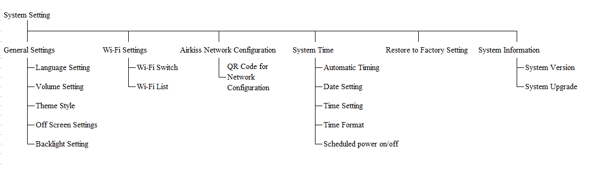

# Rockchip MiniGUI Desktop Developer Guide

ID: RK-KF-CS-001

Release Version: V1.0.1

Release Date: 2021-03-15

Security Level: □Top-Secret   □Secret   □Internal   ■Public

**DISCLAIMER**

THIS DOCUMENT IS PROVIDED “AS IS”. ROCKCHIP ELECTRONICS CO., LTD.(“ROCKCHIP”)DOES NOT PROVIDE ANY WARRANTY OF ANY KIND, EXPRESSED, IMPLIED OR OTHERWISE, WITH RESPECT TO THE ACCURACY, RELIABILITY, COMPLETENESS,MERCHANTABILITY, FITNESS FOR ANY PARTICULAR PURPOSE OR NON-INFRINGEMENT OF ANY REPRESENTATION, INFORMATION AND CONTENT IN THIS DOCUMENT. THIS DOCUMENT IS FOR REFERENCE ONLY. THIS DOCUMENT MAY BE UPDATED OR CHANGED WITHOUT ANY NOTICE AT ANY TIME DUE TO THE UPGRADES OF THE PRODUCT OR ANY OTHER REASONS.

**Trademark Statement**

"Rockchip", "瑞芯微", "瑞芯" shall be Rockchip’s registered trademarks and owned by Rockchip. All the other trademarks or registered trademarks mentioned in this document shall be owned by their respective owners.

**All rights reserved. ©2021. Rockchip Electronics Co., Ltd.**

Beyond the scope of fair use, neither any entity nor individual shall extract, copy, or distribute this document in any form in whole or in part without the written approval of Rockchip.

Rockchip Electronics Co., Ltd.

No.18 Building, A District, No.89, software Boulevard Fuzhou, Fujian,PRC

Website:     [www.rock-chips.com](http://www.rock-chips.com)

Customer service Tel:  +86-4007-700-590

Customer service Fax:  +86-591-83951833

Customer service e-Mail:  [fae@rock-chips.com](mailto:fae@rock-chips.com)

---

**Preface**

**Overview**

This document mainly introduces the functions, general interfaces and operating principles of MiniGUI Desktop, and will introduce the development process and notices through examples.

**Product Version**

| **Chipset** | **Kernel Version** |
| ------------ | ------------ |
| RK3126C | Linux 4.4 |
| RK3308 | Linux 4.4 |

**Intended Audience**

This document (this guide) is mainly intended for:

Technical support engineers

Software development engineers

**Revision History**

| **Version** | **Author** | **Date** | **Revision History** |
| :--------: | --------| :--------- | ------------ |
| V0.0.1 | WJJ | 2019-06-26 | Initial version |
| V1.0.0 | Ruby Zhang | 2020-03-09 | Initial release |
| V1.0.1 | Ruby Zhang | 2021-03-15 | Update company name and document format |

---

**Contents**

[TOC]

---

## MiniGUI Desktop

### Introduction

MiniGUI is a high-level window system (Windowing System) for embedded systems and the graphical user interface (Graphical User Interface, GUI) support system. At present, we have compiled MiniGUI Desktop on the basis of MiniGUI to implement the functions such as audio playback, video playback, and picture browsing, and support buttons or touch screen control for secondary development more easily.

### Functions

#### File Browsing

Table 1-1 Supported file types:

| File types | **File Formats** |
| ---------- | ---------------- |
| pictures   | jpg, bmp, png    |
| audio      | wav, mp3         |
| video      | mp4              |

File browsing is processed by the browser_dialog form and the related audio playback form, video playback form, or picture preview form are all created based on their file extensions.

In the audio and video playback form, play/pause, previous/next song, and fast forward and backward are all supported.

In the picture preview form, support previous/next picture and double-click screen to exit.

#### System Setting

Figure 1-1 Architecture of system settings



**General Settings**: Support Chinese, English, Japanese, Korean four language settings; support volume settings; support two theme styles, which can be extented as needed; support 5, 10, 15, 30, 60s off screen or constant light; support four levels of backlight brightness.

**Wi-Fi Settings**: WiFi can be turned on or off; list nearby hotspot information; slide up and down to turn pages; click to enter the password input interface.

**Airkiss **: Not supported currently.

**System Time**: NTP time synchronization is optional; the Date Setting and Time Setting items are invalid after the automatic time synchronization is enabled; click Date Setting, Time Setting, and Scheduled power on/off to enter the corresponding input interfaces. After clicking OK, the time and date will be written into the system , and sync to RTC; 12-hour or 24-hour display are optional.

**Restore to Factory Settings**: Return system settings to default values.

**System Information**: Display module number and firmware version number; click System Upgrade to check if there is a firmware to update.

### Compilation Configuration

Board-level configuration

Run "make menuconfig" in the root directory to find the following items and enable:

```
BR2_PACKAGE_MINIGUI=y
BR2_PACKAGE_MINIGUI_ENABLE_FREETYPE=y
BR2_PACKAGE_MINIGUI_ENABLE_PNG=y
BR2_PACKAGE_MINIGUI_DESKTOP=y
```

Optional items:

FFMPEG and SDL2 are used to support audio and video playback, and NTP is used to support network time synchronization.

```
BR2_PACKAGE_FFMPEG_FFPLAY=y
BR2_PACKAGE_SDL2_KMSDRM=y
BR2_PACKAGE_SDL2_OPENGLES=y
BR2_PACKAGE_NTP=y
BR2_PACKAGE_NTP_NTPDATE=y
BR2_PACKAGE_NTP_NTPTIME=y
```

Compilation configuration of minigui_desktop:

Edit external/minigui_desktop/config.mk and modify the following items to enable or disable the battery and Wi-Fi compilation for some boards without batteries or not supporting Wi-Fi. You can refer to Makefile and config.mk to add other compilation switches.

```
ENABLE_WIFI=1
ENABLE_BATT=1
```

### Development Guide

#### Create a Form

The DialogBoxIndirectParam function is used to create a form and set the related event processing function. Generally, each form has a separate dialog file, such as audioplay_dialog.c. Each form has its own creation function and event processing function. Take audioplay_dialog as an example. Its creation function is creat_audioplay_dialog. and its main job is to specify the position of the form and transfer and initialize some parameters. Finally, call the DialogBoxIndirectParam function to create the form.

#### Form Event Processing

When a Form is created, the corresponding event processing function has been fixed. Take audioplay_dialog.c as an example. Its processing function is audioplay_dialog_proc. After the system triggers an event, it will be sent to this function for processing. Commonly used events are as follows:

Table 1-2 Form Events

| **Events name**     | **Description**                                              |
| ------------------- | ------------------------------------------------------------ |
| MSG_INITDIALOG      | Initialization event, is triggered when the form is created  |
| MSG_TIMER           | Timer event, and a timer can be created in the initialization event, the system will trigger the event regularly, and which timer is triggered can be checked according to the wParam (ID) |
| MSG_KEYDOWN         | Key events, and which key has been pressed can be checked by the wParam |
| MSG_DISPLAY_CHANGED | To check whether the picture output device has been changed. For example, plugging or unplugging HDMI will trigger this event. |
| MSG_PAINT           | Drawing event which will be triggered by the function InvalidateRect to redraw. You can specify the redraw area to reduce unnecessary consumption. |
| MSG_MEDIA_UPDATE    | Media playback update events sent by player, such as obtaining the total media time, current playback time, notification of the end of playback, etc. |
| MSG_DESTROY         | Destroy event, triggered when a form completely exits and executes the deinitialization function |
| MSG_LBUTTONDOWN     | Check whether the left mouse button is pressed or whether fingers touch the screen |
| MSG_LBUTTONUP       | Check whether the left mouse button is released or whether fingers are away from the screen |

Note: For more event triggering and processing, please refer to the official documentation of MiniGUI.

#### Widgets Drawing and Press down Checking

The essence of drawing buttons or other widgets is to draw pictures, which are implemented by functions such as FillBox, FillBoxWithBitmap, and DrawText. Press down checking is to record the corresponding coordinates after the MSG_LBUTTONDOWN and MSG_LBUTTONUP events are triggered. Call the check_button function of each form to check which widgets is triggered, and then to do the corresponding operation.

Coordinates or other parameters in drawing are specified by ui_1024x600.h, ui_480x272.h, and ui_480_320.h respectively at the corresponding resolution. Currently, the ui_1024x600.h is well supported, and the other two resolutions, or other resolution' header files should be adapted. In common.h,  #include is used to specify which resolution header file to use.

### Frequently Ask Questions

Please refer to the  FAQs:[https://github.com/VincentWei/minigui/wiki/FAQs-in-Chinese](https://github.com/VincentWei/minigui/wiki/FAQs-in-Chinese)