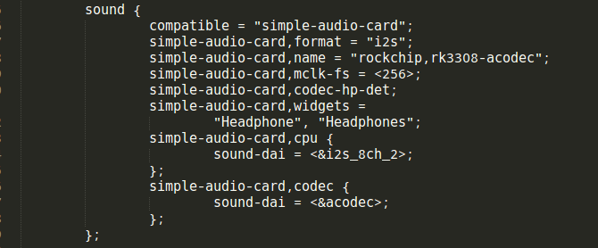
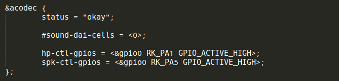
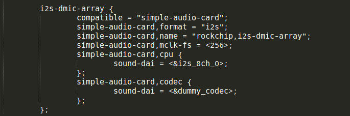
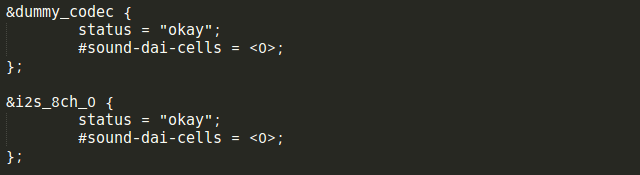
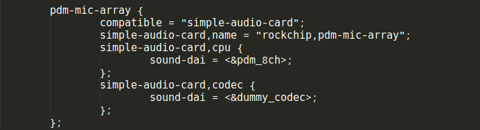
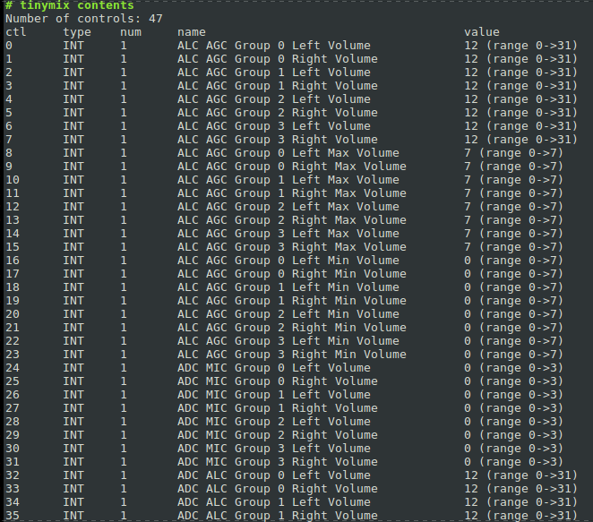
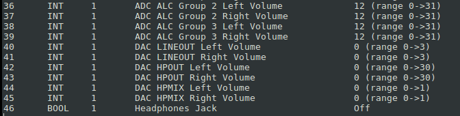
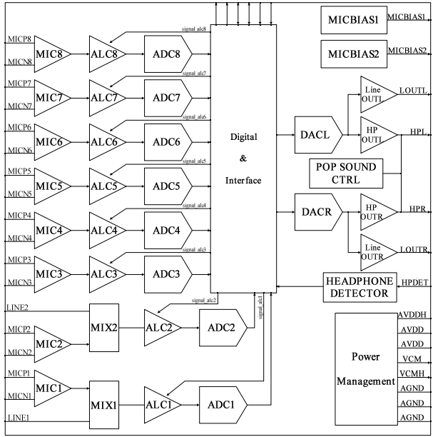
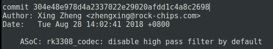
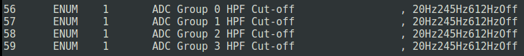

# RK3308 Audio Codec介绍

文件标识：RK-KF-YF-304

发布版本：1.0.1

日期：2020-08-10

文件密级：□绝密   □秘密   □内部资料   ■公开

**免责声明**

本文档按“现状”提供，瑞芯微电子股份有限公司（“本公司”，下同）不对本文档的任何陈述、信息和内容的准确性、可靠性、完整性、适销性、特定目的性和非侵权性提供任何明示或暗示的声明或保证。本文档仅作为使用指导的参考。

由于产品版本升级或其他原因，本文档将可能在未经任何通知的情况下，不定期进行更新或修改。

**商标声明**

“Rockchip”、“瑞芯微”、“瑞芯”均为本公司的注册商标，归本公司所有。

本文档可能提及的其他所有注册商标或商标，由其各自拥有者所有。

**版权所有 © 2020 瑞芯微电子股份有限公司**

超越合理使用范畴，非经本公司书面许可，任何单位和个人不得擅自摘抄、复制本文档内容的部分或全部，并不得以任何形式传播。

瑞芯微电子股份有限公司

Rockchip Electronics Co., Ltd.

地址：     福建省福州市铜盘路软件园A区18号

网址：     [www.rock-chips.com](http://www.rock-chips.com)

客户服务电话： +86-4007-700-590

客户服务传真： +86-591-83951833

客户服务邮箱： [fae@rock-chips.com](mailto:fae@rock-chips.com)

---

**前言**

**概述**

本文主要介绍RK3308 Audio 接口、EVB MIC 类型，常用Audio 配置以及Codec常用的属性配置。

**产品版本**

| **芯片名称** | **内核版本** |
| ------------ | ------------ |
| RK3308       | 4.4          |

**读者对象**

本文档（本指南）主要适用于以下工程师：

技术支持工程师

软件开发工程师

 **修订记录**

| 版本   | 作者       | 日期       | 描述 |
| ------ | ---------- | --------- | ---- |
| V0.1.0 | Xing Zheng | 2018-05-01 | 添加RK3308 Audio介绍初始版本 |
| V0.2.0 | Xing Zheng | 2018-09-16 | 添加RK3308 CODEC常用属性配置描述 |
| V0.3.0 | Xing Zheng | 2018-09-04 | 添加HPF和AGC相关配置说明 |
| V1.0.0 | Xing Zheng | 2019-03-08 | 修正通道映射描述，添加MICBIAS属性说明 |
| V1.0.1 | Ruby Zhang | 2020-08-10 | 更新公司名称和文档格式 |

---

**目录**

[TOC]

---

## RK3308 Audio接口介绍

RK3308有丰富的音频相关接口，包括I2S，PCM，TDM，PDM，SPDIF，VAD(Voice Activity Detection) 以及内置CODEC：

- I2S with 2 channel
- I2S with 8 channel
- I2S with 16 channel
- PDM with 8 channel
- TDM with 8 channel
- SPDIF
- Voice Activity Detection(VAD)
- Embedded Audio Codec

更多具体Audio接口细节请参看《RK3308 TRM Chapter 22 Audio Subsystem》章节。

## RK3308 EVB MIC类型介绍

RK3308支持不同类型接口的MIC矩阵是其一大亮点，EVB上有三种接口类型的MIC可供客户选择：

- 模拟MIC（以下简称AMIC）与RK3308内置CODEC连接
- 数字MIC（以下简称DMIC）与RK3308 I2S连接
- PDM MIC与RK3308 PDM连接

因此，RK3308的kernel工程也是依据以上三种不同的MIC来区分板级dts文件。除了公共的部分ACODEC的配置需引用：

arch/arm64/boot/dts/rockchip/rk3308-evb-v10.dtsi

最末端的子板级dts他们分别是：

arch/arm64/boot/dts/rockchip/rk3308-evb-amic-v10.dts

arch/arm64/boot/dts/rockchip/rk3308-evb-dmic-i2s-v10.dts

arch/arm64/boot/dts/rockchip/rk3308-evb-dmic-pdm-v10.dts

下面简单介绍一下Audio部分相关的dts配置。

### RK3308 AMIC Board配置

因为RK3308 EVB都需要启用内置的CODEC功能，将rk3308-evb-amic-v10.dts中CODEC的配置挪到公共的rk3308-evb-v10.dtsi中，所以rk3308-evb-amic-v10.dts里仅仅是引用了rk3308-evb-v10.dtsi，并作了空的描述（后期根据项目需要可根据AMIC Board独有的功能模块在其中自行添加）：

</left>

其中在rk3308-evb-v10.dtsi中添加的CODEC部分（DMIC Board和PDM MIC Board也包含了它）：

</left>

启用了内部8通道的i2s_8ch_2：

</left>

启用内置CODEC：

</left>

### RK3308 DMIC Board配置

RK3308 EVB DMIC Board描述如下：

</left>

因为i2s_8ch_0接的是I2S接口的功放，所以对sound framework来说需要注册一个dummy_codec来保证音频设备的完整性：

</left>

### RK3308 PDM MIC Board配置

与DMIC Board类似，PDM MIC Board的描述：

</left>

开启pdm_8ch的同时，也需要打开dummy_codec：

</left>

## RK3308常用Audio相关配置

Audio是消费电子产品中不可或缺、非常重要的一个功能模块，Linux平台上相关的工具也非常多样。所以，RK3308 EVB上也整合了常用的alsa-utils、tiny-alsa等工具来帮助我们日常开发使用。

### 常用音频工具的使用

我们常用的音频使用场景主要是音频的播放和录音，常用的有alsa-utils的aplay/arecord，tiny-alsa的/tinyplay/tinycap。由于alsa-utils一般会使用到alsa-libs和alsa相关的route配置，为避免其中的配置不当导致引起播放/录音结果与预期不符，建议项目开发过程中还是多使用更简单直接的tiny-alsa来避免这些问题。

- 播放命令

播放wav文件输出到声卡0上：

```c
tinyplay /data/2k_1k0db_48K.wav -D 0
```

- 录音命令

录制采样率44100Hz、位深16bit、双声道格式的wav文件到声卡0上：

```c
tinycap /tmp/my_record.wav -r 44100 -b 16 -D 0 -c 2
```

- 同时录放回采命令

RK3308 EVB支持将Lineout 2CH输出的同时，loopback到内置CODEC ADC7/ADC8通道。我们可以在后台启动一个tinycap进程的同时，去播放需要回采的wav文件：

```c
tinycap /tmp/my_loopback.wav -r 44100 -b 16 -D 0 -c 8 &
tinyplay /data/2k_1k0db_48K.wav -D 0
```

### CODEC音频通路切换

目前CODEC支持使用脚本来直接切换通路，比如LINEOUT切换到HPOUT：

```c
# /data/switch_inoutput.sh hp
switch to hp-out
dac path: hp out
```

更多的使用可以不带参数查看usage：

```c
# /data/switch_inoutput.sh
```

Usage:

```c
input <-- mi: mic-in, li: line-in
output --> lo: line-out, hp: hp-out, lohp: both line-out and hp-out
```

### CODEC音频增益调节

RK3308 CODEC内部支持多级输入/输出增益调节，它们的所有状态都可以用amixer或者tinymix工具来查看。

使用amixer contents查看，输出的内容比较多，不是很直观：

</left>

我们可以使用tinymix contents，这样每个通道的每个增益范围都一目了然：

</left>

</left>

从上面的contents dump可以看到，可调节的Volume Gain有不少，这里简单说明一下。来自一张RK3308 TRM ACODEC章节的Block图：

</left>

可以看到，RK3308 CODEC包含了8个ADC输入，将其分组的话，ADC1/ADC2作为Group 0，ADC3/ADC4作为Group 1，ADC5/ADC6作为Group 2，ADC7/ADC8作为Group 3。

“ALC AGC”前缀的表示对AGC自动调节增益的配置，以及调节对应通道的 “Max” 和 “Min” 部分，来控制AGC的范围。目前默认AGC是关闭状态，所以可以暂时忽略这些Volume。

“ADC MIC”前缀表示调节前级MIC PGA线性放大增益。

“ADC ALC”前缀表示调节后级ALC线性放大增益。

“DAC LINEOUT”前缀表示调节后级LINEOUT线性放大增益。

“DAC HPOUT”前缀表示调节后级HPOUT线性放大增益。

“DAC HPMIX”前缀表示调节前级线性放大增益，它作为LINEOUT和HPOUT共同的前级。

另外，每个通道都有各自的调节范围，比如：

</left>

表示”ADC ALC Group 0 Left Volume”量化了0～31共32个量化等级，当前的Volume值是12。如果我们想改变这个Volume为20，可以通过tinymix set去设置它：

```c
# tinymix set "ADC ALC Group 0 Left Volume" 20
```

通过tinymix get可以去读取指定Volume的状态：

```c
# tinymix get "ADC ALC Group 0 Left Volume"
20 (range 0->31)
```

### CODEC高通滤波器配置

</left>

从这个提交开始，acodec driver将默认关闭HPF功能，客户需要根据实际项目情况去关闭/打开HPF：

</left>

因为tinymix contents可以比较方便的一行显示controls的状态，但上图由于是tinymix contents显示排版不是很友好的原因，逗号分割在Off的前面，表示该item是选择Off。这个可以通过amixer sget命令确认。比如：

</left>

如果需要是能acodec的HPF Cut-off 20Hz功能（一般作用是去直流分量），则可以：

```c
amixer sset 'ADC Group 0 HPF Cut-off' 20Hz
amixer sset 'ADC Group 1 HPF Cut-off' 20Hz
amixer sset 'ADC Group 2 HPF Cut-off' 20Hz
amixer sset 'ADC Group 3 HPF Cut-off' 20Hz
```

对4组/8个ADC通道开启截止频率20Hz的HPF：

</left>

这时逗号是分割在20Hz前面，item选择的是20Hz：

</left>

### CODEC AGC相关配置简要说明

默认情况下，acodec 中8个ADC AGC是处于关闭状态：

</left>

如果客户想使能acodec的AGC功能。这里以ADC3通道为例：

ADC3属于ADC Group 1 Left通道，我们先要根据目前采样率设置AGC对应的ASR（Approximate Sample Rate）。比如，当前录音的采样率是44.1KHz，ADC3的ASR就需要配置成44.1KHz：

```c
amixer sset 'AGC Group 1 Left Approximate Sample Rate' 44.1KHz
```

</left>

然后打开ADC3的AGC：

```c
amixer sset 'ALC AGC Group 1 Left' On
```

</left>

这样，ADC3就使能了AGC功能。

## RK3308 CODEC常用属性配置

RK3308 CODEC的属性比较多，dts里能使用到的属性都可以在kernel代码的：

Documentation/devicetree/bindings/sound/rockchip,rk3308-codec.txt

找到，这里介绍一些平时开发中常用的属性，以便于理解：

- rockchip,adc-grps-route

这个属性是可选项，可以调整各路ADC与i2s sdi的映射关系。注意，这里不是指MIC和ADC的映射，是CODEC IP出来的sdo与连接的i2s IP的sdi的映射关系。具体框图可以参考RK3308 TRM Chapter 6 Audio Subsystem：

</left>

如果不指定，默认为一一映射的关系。比如CODEC和i2s_8ch_2连接，录制8ch时。ADC_MIC 0-7分别对应i2s_8ch_2的sdi 0-7:

```c
* sdi_0 <-- sdo_0 <-- MIC_0_1  // ch0 and ch1
* sdi_1 <-- sdo_1 <-- MIC_2_3  // ch2 and ch3
* sdi_2 <-- sdo_2 <-- MIC_4_5  // ch4 and ch5
* sdi_3 <-- sdo_3 <-- MIC_6_7  // ch6 and ch7
```

如果有这样一个场景，我们希望再录制4ch的时候，MIC_2_3移到最后作为回采功能，MIC_4_5移到最前面，dts里可以增加这样的描述：

```c
rockchip,adc-grps-route = <2 1 3 0>;
```

此时的ADC通路的映射关系：

```c
* sdi_0 <-- sdo_2 <-- MIC_4_5  // ch0 and ch1
* sdi_1 <-- sdo_1 <-- MIC_2_3  // ch2 and ch3
* sdi_2 <-- sdo_3 <-- MIC_6_7  // not used
* sdi_3 <-- sdo_0 <-- MIC_0_1  // not used
```

由于我们只用到4ch，i2s的sdi2和sdi3并没有被使用到，所以后面2组的描述可以忽略。

- rockchip,loopback-grp

这个属性指定的是模拟PA对应的连接的ADC group，通过这个属性，codec driver会在合适的时间打开回采，以节省功耗。比如，回采电路连接在ADC_0_1上，我们可以在dts指定：

```c
rockchip,loopback-grp = <0>;
```

- rockchip,no-hp-det

该属性表明CODEC就不会去使能hp-det的功能。如果目标板硬件上没有用CODEC的耳机检测功能，CODEC hp-det pin悬空，该属性强烈建议加上，否则会引起耳机插入误报的现象。

- hp-ctl-gpios

该属性指定了控制耳机通路的gpio pin。在耳机通路使能下，播放/关闭音乐的时候，打开/关闭耳机通路模块。比如：

```c
hp-ctl-gpios = <&gpio0 1 GPIO_ACTIVE_HIGH>;
```

- spk-ctl-gpios

该属性指定了控制喇叭通路的gpio pin。在喇叭通路使能下，播放/关闭音乐的时候，打开/关闭PA通路模块。比如：

```c
spk-ctl-gpios = <&gpio0 5 GPIO_ACTIVE_HIGH>;
```

- rockchip,en-always-grps

该属性可以让指定的ADC group打开一次之后就常开，主要应用于与VAD配合的场景，即在休眠的时候不关闭与VAD相关的ADC，达到快速响应的功能。

- rockchip,delay-loopback-handle-ms

因为在实际开发过程中，选用的PA的启动时延不同。该属性指定了打开回采后，需要等待的稳定时延才重新打开对应的ADC，避免回采数据抖动。比如：

```c
rockchip,delay-loopback-handle-ms = <200>;
```

- rockchip,no-deep-low-power

该属性表明在系统休眠的时候CODEC不进入低功耗模式，以适应更快速的响应需求，适合对功耗不是很在意的场景。

- rockchip,micbias1
- rockchip,micbias2

为了让codec有更好的功耗表现，目前驱动默认关闭了codec的MICBIAS1和MICBIAS2。如果硬件上有使用到，可以通过dts分别开启对应的属性去开启对应的MICBIAS。