# DLNA开发指南

文件标识：RK-KF-YF-380

发布版本：V1.0.2

日期：2020-08-11

文件密级：□绝密   □秘密   □内部资料   ■公开

**免责声明**

本文档按“现状”提供，瑞芯微电子股份有限公司（“本公司”，下同）不对本文档的任何陈述、信息和内容的准确性、可靠性、完整性、适销性、特定目的性和非侵权性提供任何明示或暗示的声明或保证。本文档仅作为使用指导的参考。

由于产品版本升级或其他原因，本文档将可能在未经任何通知的情况下，不定期进行更新或修改。

**商标声明**

“Rockchip”、“瑞芯微”、“瑞芯”均为本公司的注册商标，归本公司所有。

本文档可能提及的其他所有注册商标或商标，由其各自拥有者所有。

**版权所有 © 2020 瑞芯微电子股份有限公司**

超越合理使用范畴，非经本公司书面许可，任何单位和个人不得擅自摘抄、复制本文档内容的部分或全部，并不得以任何形式传播。

瑞芯微电子股份有限公司

Rockchip Electronics Co., Ltd.

地址：     福建省福州市铜盘路软件园A区18号

网址：     [www.rock-chips.com](http://www.rock-chips.com)

客户服务电话： +86-4007-700-590

客户服务传真： +86-591-83951833

客户服务邮箱： [fae@rock-chips.com](mailto:fae@rock-chips.com)

---

**前言**

**概述**

本文主要介绍基于Buildroot DLNA开发指南。

**产品版本**

| **芯片名称** | **内核版本** |
| ------------ | ------------ |
| RK3308    | 4.4 |

**读者对象**

本文档（本指南）主要适用于以下工程师：

技术支持工程师

软件开发工程师

**修订记录**

| **版本号** | **作者** | **修改日期** | **修改说明** |
| ---------- | --------| :--------- | ------------ |
| V1.0.0 | SCH        | 2018-05-28 | 初始版本     |
| V1.0.1    | Ruby Zhang | 2019-05-29 | 格式修正 |
| V1.0.2   | Ruby Zhang | 2020-08-11 | 更新公司名称转换成md格式 |

---

**目录**

[TOC]

---

## DLNA概述

DLNA的全称是DIGITAL LIVING NETWORK ALLIANCE(数字生活网络联盟)。

DLNA 成立于2003 年6 月24 日, 其前身是DHWG （Digital Home Working Group 数字家庭工作组），由Sony、Intel、Microsoft等发起成立、旨在解决个人PC ，消费电器，移动设备在内的无线网络和有线网络的互联互通，使得数字媒体和内容服务的无限制的共享和增长成为可能。DLNA的口号是Enjoy your music, photos and videos, anywhere anytime。

DLNA 宣布组织在2017年1月15日正式解散，未来不会再更新DLNA标准。

DLNA将其整个应用规定成5个功能组件。从下到上依次为：网络互连，网络协议，媒体传输，设备的发现控制和管理，媒体格式, 以下是DLNA的一个应用场景（实际场景远不止这些）

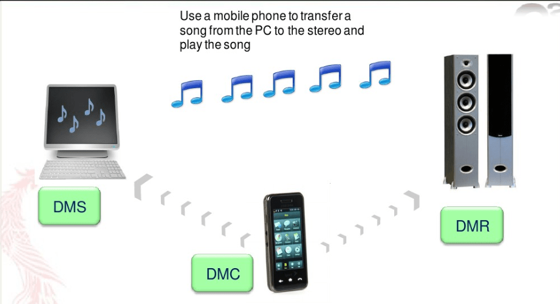<left>

## DLNA重要概念

- Home NetWork Device(HND)。这类设备指家庭设备，具有比较大的尺寸及较全面的功能，主要与移动设备区别开来，下属5类设备：

1. Digital Media Server(DMS)。数字媒体服务器，提供媒体获取、记录、存储和输出功能。同时，内容保护功能是对DMS的强制要求。DMS总是包含DMP的功能，并且肯能包含其他智能功能，包括设备/用户服务的管理；丰富的用户界面；媒体管理/收集和分发功能。DMS的例子有PC、数字机顶盒（附带联网，存储功能）和摄像机等等。

2. DMP。数字媒体播放器。能从DMS/M-DMS上查找并获取媒体内容并播放和渲染显示。比如智能电视、家庭影院等。

3. DMC。数字媒体控制器，查找DMS的内容并建立DMS与DMR之间的连接并控制媒体的播放。如遥控器。

4. DMR。数字媒体渲染设备。通过其他设备配置后，可以播放从DMS上的内容。与DMP的区别在于DMR只有接受媒体和播放功能，而没查找有浏览媒体的功能。比如显示器、音箱等。

5. DMPr。数字媒体打印机，提供打印服务。网络打印机，一体化打印机就属于DMPr。

- Mobile Handheld Devices(MHD)手持设备。相比家庭设备，手持设备的功能相对简化一些，支持的媒体格式也会不同。

1. M-DMS。与DMS类似，如移动电话，随身音乐播放器等。

2. M-DMP。与DMP类似。比如智能移动电视。

3. M-DMD。移动多媒体下载设备。如随身音乐播放器，车载音乐播放器和智能电子相框等

4. M-DMU。移动多媒体下载设备。如摄像设备和手机等。

5. M-DMC。与DMC类似。P如DA，智能遥控器。 手持设备没有定义M-DMR，因为手持设备会讲究便利性，会附加查找控制功能，要不然就只是普通的移动电视或收音机了。

- Networked Infrastructure Devices (NID) 联网支持设备。

1. Mobile Network Connectivity Function (M-NCF)。移动网络连接功能设备。提供各种设备接入移动网络的物理介质。 DLNA的希望是全部实现无线化。

2. Interoperability Unit (MIU)媒体交互设备。提供媒体格式的转换以支持各种设备需要。

## DLNA框架

DLNA架构是个互联系统，因此在逻辑上它也类似OSI（Open System Interconnection，开放系统互连）七层网络模型。

DLNA架构分为如下图7个层次：

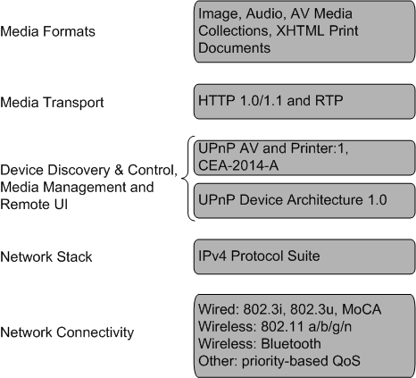<left>

1. NetWorking Connectivity 网络互联方式:包括物理连接的标准，有有线的，比如符合IEEE802.3标准的Ethernet；有无线的 ，比如符合IEEE802.11a/g标准的WiFi，能做到54Mbps，蓝牙(802.15)等技术都很成熟。现在OFDM和MIMO(802.11n)已经能做到300Mbps了，早就超过比较普及的100Mbps的Ethernet了，只不过产品还没有普及，以后肯定会用到。

2. NetWorking Stack 网络协议栈：DLNA的互联传输基本上是在IPV4协议簇的基础上的。用TCP或者UDP来传都可以。这一层相当于OSI网络层。

3. Device Discovery&Control 设备发现和控制。  这个层次是比较essential的，是DLNA的基础协议框架。DLNA用UPnP协议来实现设备的发现和控制。这一部分可以看一下<http://upnp.org/sdcps-and-certification/standards/device-architecture-documents/>里的文档。

4. Media Management媒体管理。媒体管理包括媒体的识别、管理、分发和记录（保存），UPnP AV Architecture:1 and UPnP Printer Architecture:1这两个属于UPnP的文档会说明如何进行媒体管理。

5. Media Transport 媒体传输：这一层用HTTP(HyperText Transfer Protocol)超文本传输协议。就是平时我们上网用的媒体传输协议。HTTP用TCP可靠传输，也有混合UDP方式的HTTP。现在HTTP的最新版本是HTTP1.1。可选协议是RTP。

6. Media Formats媒体格式。格式Formats在这里等同于编码格式Codec，平时我们说的编码格式比如Mpeg-2，AVC，x264就是视频编码格式；PCM，mp3(MPEG-2 Layer 3)，aac，flac就是音频编码格式。而avi，rmvb，mkv这些是媒体封装格式，包含视频音频可能还有字幕流。比如一个常见的后缀为mkv的文件，它的视频Codec是x264，音频是aac，它的视音频编码属于Mpeg-4 Codec Family。

## 开发指引

前3章我们对DLNA有个初步的了解，接下来我们来搭建一个DLNA环境实现 M-DMS（手机QQ音乐播放器）推送音乐到DMR(RK3308智能音箱)。

我们选择gmrender-resurrect开源代码来搭建DMR角色，找一个手机安装QQ播放器充当M-DMS角色。

### 编译

#### 版本确认

编译之前我们先确认一下gmrender-resurrect和关联库libupnp的版本，确保版本符合一下要求：

**gmrender-resurrect版本：33600ab663f181c4f4f5c48aba25bf961760a300**

**Libupnp版本：1.6.21**

Buildroot的package的配置信息在Buildroot/package文件下相应的文件夹里， 每个文件夹包含3个文件，分别是*.in, *.hash, *.mk, 以下是gmrender-resurrect 和 libupnp的配置文件截图：

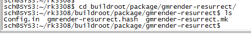<left>

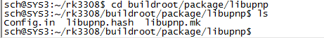<left>

其中
*.in文件记录了makeconfig中的开关宏
*.hash文件记录了代码压缩包的HASH值和版本信息
*.mk文件记录了代码编译信息和版本信息

我们使用vi命令打开对应的文件，来确认版本信息，如下图：

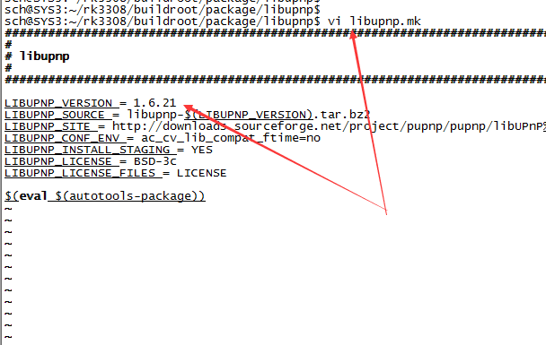<left>

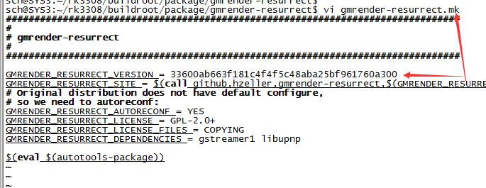<left>

#### 配置

编译之前按照以下步骤进行配置

1. 设置环境变量，使用source buildroot/build/envsetup.sh

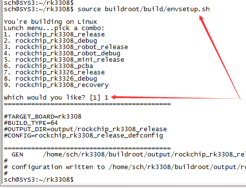<left>

2. 配置menuconfig

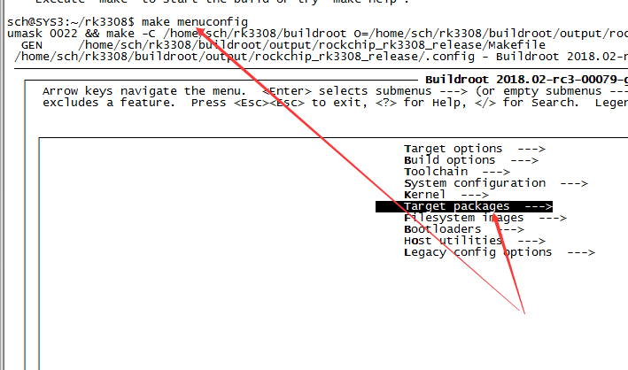<left>

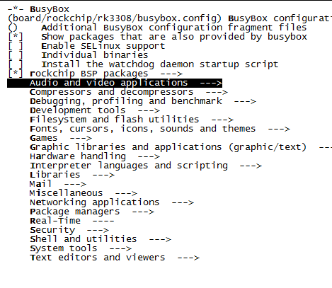<left>

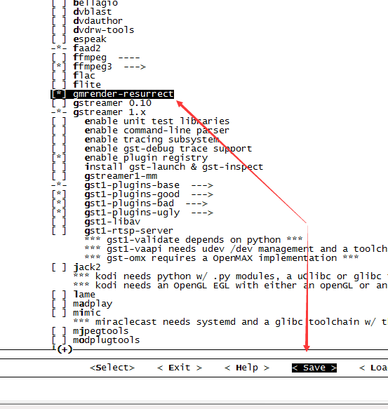<left>

如果gmrender-resurrect 未被选中（图为选中），按Y选中后save保存:

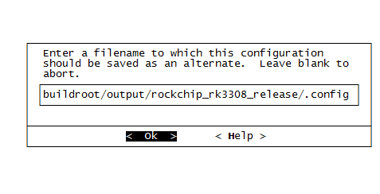<left>

保存config之后还不能编译，需要使用make savedefconfig导出配置

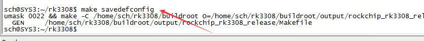<left>

成功导出配置后我们可以相关的编译，请参考1.4.1.3

#### 编译

1. 如果没有编译过，请使用build.sh进行全编译

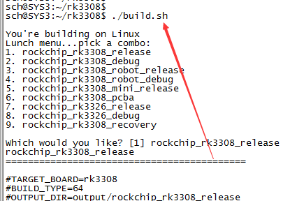<left>

全编译之后，会在IMAGE目录下生成一个子目录IMAGE\RK3308-EVB-DMIC-I2S-V10_20180515.1456_RELEASE_TEST\IMAGES，该目录下包含了RK3308所需要的全部IMG，如下图：

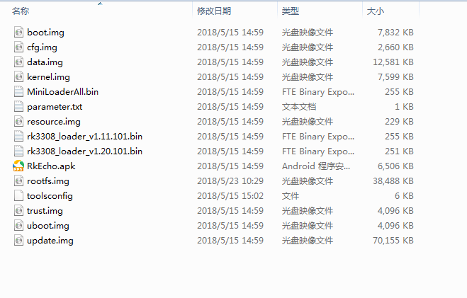<left>

如果系统有全编译过，我们可以使用make gmrender-resurrect-rebuild只编译gmrender-resurrect及其相关库。

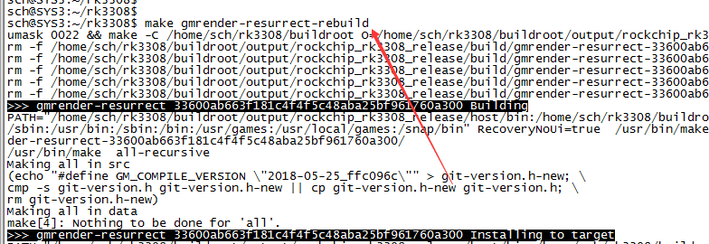<left>

gmrender-resurrect单独编译完成之后， 需要使用make命令来生成rootfs。

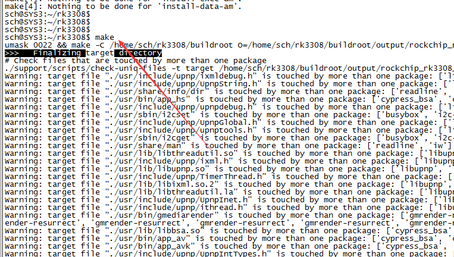<left>

生成的rootfs在buildroot\output\rockchip_rk3308_release\images\rootfs.squashfs, 用该文件替换掉IMAGE\RK3308-EVB-DMIC-I2S-V10_20180515.1456_RELEASE_TEST\IMAGES\rootfs.img。

RK3308-EVB-DMIC-I2S-V10_20180515.1456_RELEASE_TEST该文件夹是自动生成的，请以当时生成的文件夹为准。

编译完成之后，我们就可以烧写代码进行运行了，请参考1.4.2运行。

### 运行

使用工具tools\windows\AndroidTool\AndroidTool_Release\AndroidTool.exe将生成的BIN烧写到RK3308当中：

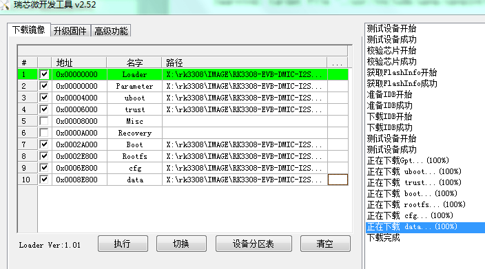<left>

烧写完成后启动RK3308。

如果SDK开机自动启动DLNA，请参考1.4.3测试DLNA的功能。

如果SDK开机没有自动启动DLNA，需要按如下方式手动启动DLNA(前提是已经连接网络，否则DLNA会启动失败)

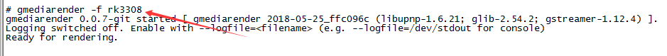<left>

看到Ready for rendering说明启动成功等待手机连接（rk3308将作为DMR的名称被手机看到），接下来的步骤请参考1.4.3

### 测试

将手机接入局域网（需要和RK3308同一个网段），打开手机QQ播放器，选择一首歌曲。

<left>

看到上图红色箭头指定的图标，点击打开如下图：

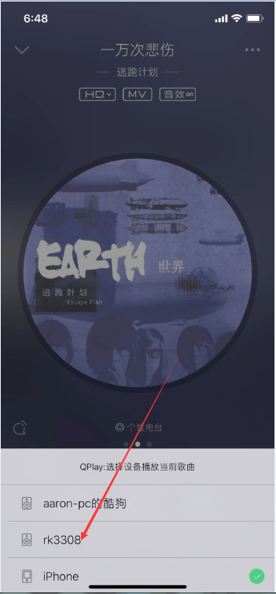<left>

将会出现rk3308, 选择后这首歌曲将被推送到RK3308上，手机进入显示播放的进度条：

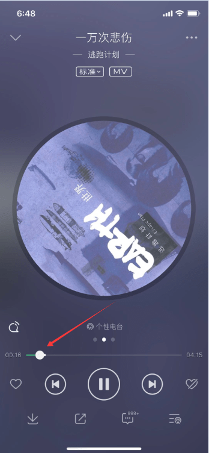<left>

播放的过程中，你可以调节音量，切换上下曲，再次单击 可以看到当前播放设备是RK3308,如下图：

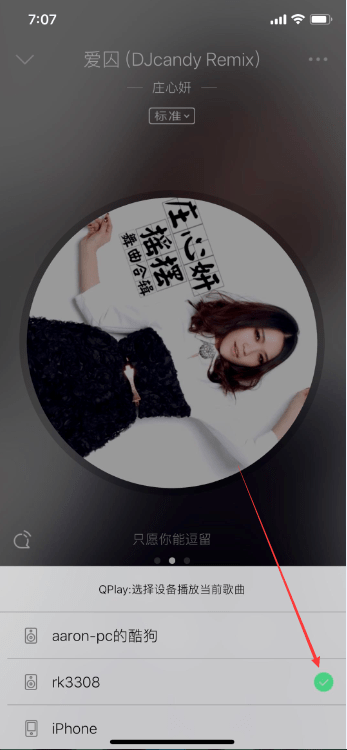<left>