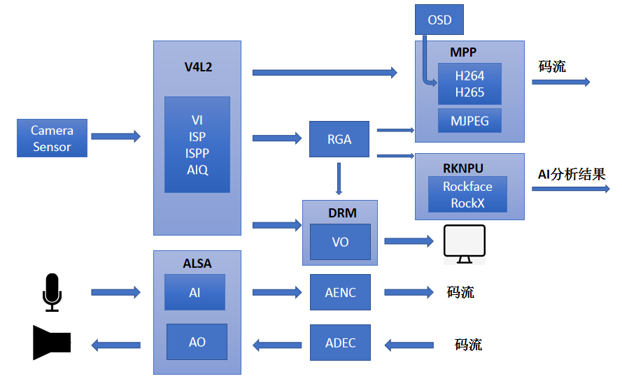
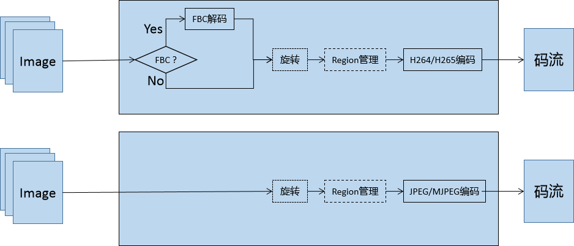

# Rockchip RKMedia Development Guide

文件标识：RK-KF-YF-382

发布版本：V1.0.0

日期：2020-09-03

文件密级：□绝密   □秘密   □内部资料   ■公开

**免责声明**

本文档按“现状”提供，瑞芯微电子股份有限公司（“本公司”，下同）不对本文档的任何陈述、信息和内容的准确性、可靠性、完整性、适销性、特定目的性和非侵权性提供任何明示或暗示的声明或保证。本文档仅作为使用指导的参考。

由于产品版本升级或其他原因，本文档将可能在未经任何通知的情况下，不定期进行更新或修改。

**商标声明**

“Rockchip”、“瑞芯微”、“瑞芯”均为本公司的注册商标，归本公司所有。

本文档可能提及的其他所有注册商标或商标，由其各自拥有者所有。

**版权所有 © 2020 瑞芯微电子股份有限公司**

超越合理使用范畴，非经本公司书面许可，任何单位和个人不得擅自摘抄、复制本文档内容的部分或全部，并不得以任何形式传播。

瑞芯微电子股份有限公司

Rockchip Electronics Co., Ltd.

地址：     福建省福州市铜盘路软件园A区18号

网址：     [www.rock-chips.com](http://www.rock-chips.com)

客户服务电话： +86-4007-700-590

客户服务传真： +86-591-83951833

客户服务邮箱： [fae@rock-chips.com](mailto:fae@rock-chips.com)

---

**前言**

**概述**

 本文主要描述了RKMedia 媒体开发参考。

**产品版本**

| **芯片名称** | **内核版本** |
| ------------ | ------------ |
| RK1126/RK1109| Linux V4.19 |

**读者对象**

本文档（本指南）主要适用于以下工程师：

技术支持工程师

软件开发工程师

**修订记录**

| **版本号** | **作者** | **修改日期** | **修改说明** |
| ---------- | --------| :--------- | ------------ |
| V0.0.1   | 范立创 / 余永镇 | 2020-08-31 | 初始版本     |
| V1.0.0 | 林刘迪铭 | 2020-09-03 | 增加数据类型和错误码，关联链接 |

---

**目录**

[TOC]

---

## 系统概述

### 概述

 RKMedia提供了一种媒体处理方案，可支持应用软件快速开发。RKMedia在各模块基础API上做进一步封装，简化了应用开发难度。该平台支持以下功能：VI(输入视频捕获)、VENC(H.265/H.264/JPEG/MJPEG 编码)、VDEC(H.265/H.264/JPEG、MJPEG 解码)、VO(视频输出显示)、RGA视频处理（包括旋转、缩放、裁剪）、AI(音频采集）、AO（音频输出）、AENC（音频编码）、ADEC（音频解码）、MD（移动侦测）、OD（遮挡侦测）。

### 系统架构

 

### 系统资源数目表

| 模块名称 | 通道数量 |
| -------- | -------- |
| VI       | 4        |
| VENC     | 16       |
| VDEC     | 16       |
| AI       | 1        |
| AO       | 1        |
| AENC     | 16       |
| ADEC     | 16       |
| MD       | 4        |
| OD       | 4        |
| RGA      | 16       |
| VO       | 2        |

## 系统控制

### 概述

系统控制基本系统的初始化工作，同时负责完成各个模块的初始化、反初始化以及管理各个业务模块的绑定关系、提供当前系统版本、系统日志管理。

### 功能描述

#### 系统绑定

RKMedia提供系统绑定接口（[RK_MPI_SYS_Bind](#RK_MPI_SYS_Bind)），即通过数据接收者绑定数据源来建立两者之间的关联（只允许数据接收者绑定数据源）。绑定后，数据源生成的数据将自动发送给接收者。目前支持的绑定关系如[表 2-1](#bind-relation)所示。

<a name="bind-relation">表2-1 RKMedia支持的绑定关系</a>

| 数据源 | 数据接受者        |
| ------ | ----------------- |
| VI     | VO/RGA/VENC/MD/OD |
| VDEC   | VO/RGA/VENC/MD/OD |
| RGA    | VO/VENC/MD/OD     |
| AI     | AO/AENC           |
| ADEC   | AO                |

### API参考

#### RK_MPI_SYS_Init

【描述】

初始化系统。

【语法】

RK_S32 RK_MPI_SYS_Init();

【参数】

无。

【返回值】

| 返回值 | 描述                             |
| ------ | -------------------------------- |
| 0      | 成功。                           |
| 非0    | 失败，其值参见[错误码](#common-error)。 |

【需求】

头文件：rkmedia_api.h

库文件：libeasymedia.so

【注意】

无。

【举例】

无。

【相关主题】

无。

#### RK_MPI_SYS_DumpChn

【描述】

打印通道信息。

【语法】

RK_VOID RK_MPI_SYS_DumpChn([MOD_ID_E](#MOD_ID_E) enModId);

【参数】

| 参数名称 | 描述     | 输入/输出 |
| -------- | -------- | --------- |
| enModId  | 模块号。 | 输入      |

【返回值】

| 返回值 | 描述                             |
| ------ | -------------------------------- |
| 0      | 成功。                           |
| 非0    | 失败，其值参见[错误码](#common-error)。 |

【需求】

头文件：rkmedia_api.h

库文件：libeasymedia.so

【注意】

无。

【举例】

无。

【相关主题】

无。

#### RK_MPI_SYS_Bind

【描述】

数据源到数据接收者绑定接口。

【语法】

RK_S32 RK_MPI_SYS_Bind(const [MPP_CHN_S](#MPP_CHN_S) *pstSrcChn,const [MPP_CHN_S](#MPP_CHN_S) *pstDestChn);

【参数】

| 参数名称   | 描述           | 输入/输出 |
| ---------- | -------------- | --------- |
| pstSrcChn  | 源通道指针。   | 输入      |
| pstDestChn | 目的通道指针。 | 输入      |

【返回值】

| 返回值 | 描述                             |
| ------ | -------------------------------- |
| 0      | 成功。                           |
| 非0    | 失败，其值参见[错误码](#common-error)。 |

【需求】

头文件：rkmedia_api.h

库文件：libeasymedia.so

【注意】

系统目前支持的绑定关系，请参见[表2-1](#bind-relation)。

如果使用了此函数，则不能使用[RK_MPI_MB_ReleaseBuffer](#RK_MPI_MB_ReleaseBuffer)获取数据。

【举例】

无。

【相关主题】

[RK_MPI_SYS_UnBind](#RK_MPI_SYS_UnBind)

#### RK_MPI_SYS_UnBind

【描述】

数据源到数据接收者解绑定接口。

【语法】

RK_MPI_SYS_UnBind(const [MPP_CHN_S](#MPP_CHN_S) *pstSrcChn,const [MPP_CHN_S](#MPP_CHN_S) *pstDestChn);

【参数】

| 参数名称   | 描述           | 输入/输出 |
| ---------- | -------------- | --------- |
| pstSrcChn  | 源通道指针。   | 输入      |
| pstDestChn | 目的通道指针。 | 输入      |

【返回值】

| 返回值 | 描述                             |
| ------ | -------------------------------- |
| 0      | 成功。                           |
| 非0    | 失败，其值参见[错误码](#common-error)。 |

【需求】

头文件：rkmedia_api.h

库文件：libeasymedia.so

【注意】

无。

【举例】

无。

【相关主题】

[RK_MPI_SYS_Bind](#RK_MPI_SYS_Bind)

#### RK_MPI_SYS_RegisterEventCb

【描述】

注册事件回调，比如移动侦测事件。

【语法】

RK_S32 RK_MPI_SYS_RegisterEventCb(const [MPP_CHN_S](#MPP_CHN_S) *pstChn, [EventCbFunc](#EventCbFunc) cb);

【参数】

| 参数名称 | 描述           | 输入/输出 |
| -------- | -------------- | --------- |
| pstChn   | 指定通道指针。 | 输入      |
| cb       | 事件回调函数。 | 输出      |

【返回值】

| 返回值 | 描述                             |
| ------ | -------------------------------- |
| 0      | 成功。                           |
| 非0    | 失败，其值参见[错误码](#common-error)。 |

【需求】

头文件：rkmedia_api.h

库文件：libeasymedia.so

【注意】

无。

【举例】

无。

【相关主题】

无。

#### RK_MPI_SYS_RegisterOutCb

【描述】

注册数据输出回调。

【描述】

注册数据输出回调。注意：回调函数不能处理耗时操作，否则对应通道数据流将被阻塞。

【语法】

RK_S32 RK_MPI_SYS_RegisterOutCb(const [MPP_CHN_S](#MPP_CHN_S) *pstChn, [OutCbFunc](#OutCbFunc) cb);

【参数】

| 参数名称 | 描述               | 输入/输出 |
| -------- | ------------------ | --------- |
| pstChn   | 指定通道指针。     | 输入      |
| cb       | 数据输出回调函数。 | 输出      |

【返回值】

| 返回值 | 描述                             |
| ------ | -------------------------------- |
| 0      | 成功。                           |
| 非0    | 失败，其值参见[错误码](#表2-2)。 |

【需求】

头文件：rkmedia_api.h

库文件：libeasymedia.so

【注意】

回调函数不能处理耗时操作，否则对应通道数据流将被阻塞。

【举例】

无。

【相关主题】

无。

#### RK_MPI_SYS_SendMediaBuffer

【描述】

向指定通道输入数据，比如将本地yuv文件送入编码器编码。

【语法】

RK_S32 RK_MPI_SYS_SendMediaBuffer([MOD_ID_E](#MOD_ID_E) enModID, RK_S32 s32ChnID, [MEDIA_BUFFER](#MEDIA_BUFFER) buffer);

【参数】

| 参数名称 | 描述     | 输入/输出 |
| -------- | -------- | --------- |
| enModID  | 模块号。 | 输入      |
| s32ChnID | 通道号。 | 输入      |
| buffer   | 缓冲区。 | 输入      |

【返回值】

| 返回值 | 描述                             |
| ------ | -------------------------------- |
| 0      | 成功。                           |
| 非0    | 失败，其值参见[错误码](#表2-2)。 |

【需求】

头文件：rkmedia_api.h

库文件：libeasymedia.so

【注意】

无。

【举例】

无。

【相关主题】

[RK_MPI_SYS_GetMediaBuffer](#RK_MPI_SYS_GetMediaBuffer)

#### RK_MPI_SYS_GetMediaBuffer

【描述】

从指定通道中获取数据。

【语法】

[MEDIA_BUFFER](#MEDIA_BUFFER) RK_MPI_SYS_GetMediaBuffer(MOD_ID_E enModID, RK_S32 s32ChnID, RK_S32 s32MilliSec);

【参数】

| 参数名称    | 描述           | 输入/输出 |
| ----------- | -------------- | --------- |
| enModID     | 模块号。       | 输入      |
| s32ChnID    | 通道号。       | 输入      |
| s32MilliSec | 阻塞等待时间。 | 输入      |

【返回值】

| 返回值类型                    | 描述         |
| ----------------------------- | ------------ |
| [MEDIA_BUFFER](#MEDIA_BUFFER) | 缓冲区指针。 |

【需求】

头文件：rkmedia_api.h

库文件：libeasymedia.so

【注意】

如果使用了[RK_MPI_SYS_Bind](#RK_MPI_SYS_Bind)，则此函数获取不到数据。

【举例】

无。

【相关主题】

[RK_MPI_SYS_SendMediaBuffer](#RK_MPI_SYS_SendMediaBuffer)

[RK_MPI_MB_ReleaseBuffer](#RK_MPI_MB_ReleaseBuffer)

#### RK_MPI_MB_ReleaseBuffer

【描述】

释放缓冲区。

【语法】

RK_S32 RK_MPI_MB_ReleaseBuffer([MEDIA_BUFFER](#MEDIA_BUFFER) mb);

【参数】

| 参数名称 | 描述     | 输入/输出 |
| -------- | -------- | --------- |
| mb       | 缓冲区。 | 输入      |

【返回值】

| 返回值 | 描述                             |
| ------ | -------------------------------- |
| 0      | 成功。                           |
| 非0    | 失败，其值参见[错误码](#表2-2)。 |

【需求】

头文件：rkmedia_api.h

库文件：libeasymedia.so

【注意】

无。

【举例】

无。

【相关主题】

[RK_MPI_SYS_GetMediaBuffer](#RK_MPI_SYS_GetMediaBuffer)

#### RK_MPI_MB_GetPtr

【描述】

从指定的[MEDIA_BUFFER](#MEDIA_BUFFER)中获取缓冲区指针。

【语法】

void *RK_MPI_MB_GetPtr([MEDIA_BUFFER](#MEDIA_BUFFER) mb);

【参数】

| 参数名称 | 描述     | 输入/输出 |
| -------- | -------- | --------- |
| mb       | 缓冲区。 | 输入      |

【返回值】

| 返回值类型 | 描述         |
| ---------- | ------------ |
| void *     | 缓冲区指针。 |

【需求】

头文件：rkmedia_buffer.h

库文件：libeasymedia.so

【注意】

无。

【举例】

无。

【相关主题】

无。

#### RK_MPI_MB_GetFD

【描述】

从指定的[MEDIA_BUFFER](#MEDIA_BUFFER)中获取文件描述符。

【语法】

int RK_MPI_MB_GetFD([MEDIA_BUFFER](#MEDIA_BUFFER) mb);

【参数】

| 参数名称 | 描述     | 输入/输出 |
| -------- | -------- | --------- |
| mb       | 缓冲区。 | 输入      |

【返回值】

| 返回值类型 | 描述         |
| ---------- | ------------ |
| int        | 文件描述符。 |

【需求】

头文件：rkmedia_buffer.h

库文件：libeasymedia.so

【注意】

无。

【举例】

无。

【相关主题】

无。

#### RK_MPI_MB_GetSize

【描述】

从指定的[MEDIA_BUFFER](#MEDIA_BUFFER)中获取缓冲区大小。

【语法】

size_t RK_MPI_MB_GetSize([MEDIA_BUFFER](#MEDIA_BUFFER) mb);

【参数】

| 参数名称 | 描述     | 输入/输出 |
| -------- | -------- | --------- |
| mb       | 缓冲区。 | 输入      |

【返回值】

| 返回值类型 | 描述         |
| ---------- | ------------ |
| size_t     | 缓冲区大小。 |

【需求】

头文件：rkmedia_buffer.h

库文件：libeasymedia.so

【注意】

无。

【举例】

无。

【相关主题】

无。

#### RK_MPI_MB_GetModeID

【描述】

从指定的[MEDIA_BUFFER](#MEDIA_BUFFER)中获取模块ID。

【语法】

[MOD_ID_E](#MOD_ID_E) RK_MPI_MB_GetModeID([MEDIA_BUFFER](#MEDIA_BUFFER) mb);

【参数】

| 参数名称 | 描述     | 输入/输出 |
| -------- | -------- | --------- |
| mb       | 缓冲区。 | 输入      |

【返回值】

| 返回值类型            | 描述     |
| --------------------- | -------- |
| [MOD_ID_E](#MOD_ID_E) | 模块ID。 |

【需求】

头文件：rkmedia_buffer.h

库文件：libeasymedia.so

【注意】

无。

【举例】

无。

【相关主题】

无。

#### RK_MPI_MB_GetChannelID

【描述】

从指定的[MEDIA_BUFFER](#MEDIA_BUFFER)中获取通道ID。

【语法】

RK_S16 RK_MPI_MB_GetChannelID([MEDIA_BUFFER](#MEDIA_BUFFER) mb);

【参数】

| 参数名称 | 描述     | 输入/输出 |
| -------- | -------- | --------- |
| mb       | 缓冲区。 | 输入      |

【返回值】

| 返回值类型 | 描述     |
| ---------- | -------- |
| RK_S16     | 通道ID。 |

【需求】

头文件：rkmedia_buffer.h

库文件：libeasymedia.so

【注意】

无。

【举例】

无。

【相关主题】

无。

#### RK_MPI_MB_GetTimestamp

【描述】

从指定的[MEDIA_BUFFER](#MEDIA_BUFFER)中获取时间戳。

【语法】

RK_U64 RK_MPI_MB_GetTimestamp([MEDIA_BUFFER](#MEDIA_BUFFER) mb);

【参数】

| 参数名称 | 描述     | 输入/输出 |
| -------- | -------- | --------- |
| mb       | 缓冲区。 | 输入      |

【返回值】

| 返回值类型 | 描述     |
| ---------- | -------- |
| RK_S16     | 时间戳。 |

【需求】

头文件：rkmedia_buffer.h

库文件：libeasymedia.so

【注意】

无。

【举例】

无。

【相关主题】

无。

### 数据类型

#### 基本数据类型

基本数据类型定义如下：

##### 公共数据类型

```c
typedef unsigned char RK_U8;
typedef unsigned short RK_U16;
typedef unsigned int RK_U32;

typedef signed char RK_S8;
typedef short RK_S16;
typedef int RK_S32;

typedef unsigned long RK_UL;
typedef signed long RK_SL;

typedef float RK_FLOAT;
typedef double RK_DOUBLE;

#ifndef _M_IX86
typedef unsigned long long RK_U64;
typedef long long RK_S64;
#else
typedef unsigned __int64 RK_U64;
typedef __int64 RK_S64;
#endif

typedef char RK_CHAR;
#define RK_VOID void

typedef unsigned int RK_HANDLE;

/*----------------------------------------------*
 * const defination                             *
 *----------------------------------------------*/
typedef enum {
  RK_FALSE = 0,
  RK_TRUE = 1,
} RK_BOOL;

#ifndef NULL
#define NULL 0L
#endif

#define RK_NULL 0L
#define RK_SUCCESS 0
#define RK_FAILURE (-1)

#define MAX_FILE_PATH_LEN    256
```

##### IMAGE_TYPE_E

【说明】

定义图像格式枚举类型。

【定义】

```C
typedef enum rk_IMAGE_TYPE_E {
  IMAGE_TYPE_UNKNOW = 0,
  IMAGE_TYPE_GRAY8,
  IMAGE_TYPE_GRAY16,
  IMAGE_TYPE_YUV420P,
  IMAGE_TYPE_NV12,
  IMAGE_TYPE_NV21,
  IMAGE_TYPE_YV12,
  IMAGE_TYPE_FBC2,
  IMAGE_TYPE_FBC0,
  IMAGE_TYPE_YUV422P,
  IMAGE_TYPE_NV16,
  IMAGE_TYPE_NV61,
  IMAGE_TYPE_YV16,
  IMAGE_TYPE_YUYV422,
  IMAGE_TYPE_UYVY422,
  IMAGE_TYPE_RGB332,
  IMAGE_TYPE_RGB565,
  IMAGE_TYPE_BGR565,
  IMAGE_TYPE_RGB888,
  IMAGE_TYPE_BGR888,
  IMAGE_TYPE_ARGB8888,
  IMAGE_TYPE_ABGR8888,
  IMAGE_TYPE_JPEG,

  IMAGE_TYPE_BUTT
} IMAGE_TYPE_E;
```

##### CODEC_TYPE_E

【说明】

定义编解码格式枚举类型。

【定义】

```c
typedef enum rk_CODEC_TYPE_E {
  RK_CODEC_TYPE_NONE = -1,
  // Audio
  RK_CODEC_TYPE_AAC,
  RK_CODEC_TYPE_MP2,
  RK_CODEC_TYPE_VORBIS,
  RK_CODEC_TYPE_G711A,
  RK_CODEC_TYPE_G711U,
  RK_CODEC_TYPE_G726,
  // Video
  RK_CODEC_TYPE_H264,
  RK_CODEC_TYPE_H265,
  RK_CODEC_TYPE_JPEG,
  RK_CODEC_TYPE_MJPEG,
  RK_CODEC_TYPE_NB
} CODEC_TYPE_E;
```

##### MOD_ID_E

【说明】

定义模块 ID 枚举类型。

【定义】

```c
typedef enum rkMOD_ID_E {
  RK_ID_UNKNOW = 0,
  RK_ID_VB,
  RK_ID_SYS,
  RK_ID_VDEC,
  RK_ID_VENC,
  RK_ID_H264E,
  RK_ID_JPEGE,
  RK_ID_H265E,
  RK_ID_VO,
  RK_ID_VI,
  RK_ID_AIO,
  RK_ID_AI,
  RK_ID_AO,
  RK_ID_AENC,
  RK_ID_ADEC,
  RK_ID_ALGO_MD,
  RK_ID_ALGO_OD,
  RK_ID_RGA,

  RK_ID_BUTT,
} MOD_ID_E;
```

##### Sample_Format_E

【说明】

定义采样格式枚举类型。

【定义】

```c
typedef enum rkSample_Format_E {
  RK_SAMPLE_FMT_NONE = -1,
  RK_SAMPLE_FMT_U8,
  RK_SAMPLE_FMT_S16,
  RK_SAMPLE_FMT_S32,
  RK_SAMPLE_FMT_FLT,
  RK_SAMPLE_FMT_U8P,
  RK_SAMPLE_FMT_S16P,
  RK_SAMPLE_FMT_S32P,
  RK_SAMPLE_FMT_FLTP,
  RK_SAMPLE_FMT_G711A,
  RK_SAMPLE_FMT_G711U,
  RK_SAMPLE_FMT_NB
} Sample_Format_E;
```

##### RECT_S

【说明】

定义区域属性结构体。

【定义】

```c

typedef struct rkRECT_S {
  RK_S32 s32X;
  RK_S32 s32Y;
  RK_U32 u32Width;
  RK_U32 u32Height;
} RECT_S;
```

【成员】

| 成员名称  | 描述          |
| --------- | ------------- |
| s32X      | 区域的X轴坐标 |
| s32Y      | 区域的Y轴坐标 |
| u32Width  | 区域的宽度    |
| u32Height | 区域的高度    |

【注意事项】

无。

【相关数据类型及接口】

无。

#### 系统控制数据类型

系统控制相关数据类型定义如下：

[MPP_CHN_S](#MPP_CHN_S)：定义模块设备通道结构体。

[EventCbFunc](#EventCbFunc)：事件回调函数指针。

[MEDIA_BUFFER](#MEDIA_BUFFER)：数据缓冲区指针。

[OutCbFunc](#OutCbFunc)：数据输出回调函数指针。

[MB_IMAGE_INFO_S](#MB_IMAGE_INFO_S)：图像信息结构体。

##### MPP_CHN_S

【说明】

定义模块设备通道结构体。

【定义】

```c
typedef struct rkMPP_CHN_S {
  MOD_ID_E enModId;
  RK_S32 s32DevId;
  RK_S32 s32ChnId;
} MPP_CHN_S;
```

【成员】

| 成员名称 | 描述     |
| -------- | -------- |
| enModId  | 模块号。 |
| s32DevId | 设备号。 |
| s32ChnId | 通道号。 |

##### EventCbFunc

【说明】

事件回调函数指针。

【定义】

```c
typedef struct rkMD_EVENT_S {
  RK_U16 u16Cnt;
  RK_U32 u32Width;
  RK_U32 u32Height;
  RECT_S stRects[4096];
} MD_EVENT_S;

typedef struct rkOD_EVENT_S {
  RK_U16 u16Cnt;
  RK_U32 u32Width;
  RK_U32 u32Height;
  RECT_S stRects[10];
  RK_U16 u16Occlusion[10];
} OD_EVENT_S;

typedef struct rkEVENT_S {
  EVENT_TYPE_E type;
  MOD_ID_E mode_id;
  union {
    MD_EVENT_S md_event;
    OD_EVENT_S stOdEvent;
  };
} EVENT_S;

typedef void (*EventCbFunc)(EVENT_S *event);
```

【成员】

| 成员名称  | 描述           |
| --------- | -------------- |
| type      | 事件类型。     |
| mode_id   | 模块号。       |
| md_event  | 移动侦测事件。 |
| stOdEvent | 遮挡侦测事件。 |

##### MEDIA_BUFFER

【说明】

数据缓冲区指针。

【定义】

```c
typedef void *MEDIA_BUFFER;
```

【相关数据类型及接口】

[OutCbFunc](#OutCbFunc)

##### OutCbFunc

【说明】

数据输出回调函数指针。

【定义】

```c
typedef void (*OutCbFunc)(MEDIA_BUFFER mb);
```

【相关数据类型及接口】

[MEDIA_BUFFER](#MEDIA_BUFFER)

##### MB_IMAGE_INFO_S

【说明】

图像信息结构体。

【定义】

```c
typedef struct rkMB_IMAGE_INFO {
  RK_U32 u32Width;
  RK_U32 u32Height;
  RK_U32 u32VerStride;
  RK_U32 u32HorStride;
  IMAGE_TYPE_E enImgType;
} MB_IMAGE_INFO_S;
```

【成员】

| 成员名称     | 描述           |
| ------------ | -------------- |
| u32Width     | 宽度。         |
| u32Height    | 高度。         |
| u32VerStride | 虚宽。         |
| u32HorStride | 虚高。         |
| enImgType    | 图像格式类型。 |

【相关数据类型及接口】

[IMAGE_TYPE_E](#IMAGE_TYPE_E)

### 错误码

系统控制错误码如[表2-2](#common-error)所示：

<a name = "common-error">表2-2 系统控制 API 错误码</a>

| 错误代码 | 宏定义                   | 描述                         |
| -------- | ------------------------ | ---------------------------- |
| 1        | RK_ERR_SYS_NULL_PTR      | 空指针错误                   |
| 2        | RK_ERR_SYS_NOTREADY      | 系统控制属性未配置           |
| 3        | RK_ERR_SYS_NOT_PERM      | 操作不允许                   |
| 4        | RK_ERR_SYS_NOMEM         | 分配内存失败，如系统内存不足 |
| 5        | RK_ERR_SYS_ILLEGAL_PARAM | 参数设置无效                 |
| 6        | RK_ERR_SYS_BUSY          | 系统忙                       |
| 7        | RK_ERR_SYS_NOT_SUPPORT   | 不支持的功能                 |

## 视频输入

### 概述

视频输入（VI）模块实现的功能：ISPP驱动实现标准V4L2设备，通过对V4L2 API的封装，可以采集到ISPP多通道视频数据。VI 将接收到的数据存入到指定的内存区域，实现视频数据的采集。

### 功能描述

#### VI节点名称

VI的创建需要指定视频节点名称，比如“/dev/video0”。在RV1126/RV1109平台则比较特殊，对应节点名称如下所示。

表3-1 ISPP节点名称（RV1126/RV1109芯片）

| ISPP 节点名称   | 视频节点路径 | 最大宽度                         | 支持的输出格式                   |
| --------------- | ------------ | -------------------------------- | -------------------------------- |
| rkispp_m_bypass | /dev/video13 | **不支持设置分辨率，不支持缩放** | NV12/NV16/YUYV/**FBC0**/**FBC2** |
| rkispp_scale0   | /dev/video14 | 3264, 最大支持8倍缩放            | NV12/NV16/YUYV                   |
| rkispp_scale1   | /dev/video15 | 1280, 最大支持8倍缩放            | NV12/NV16/YUYV                   |
| rkispp_scale2   | /dev/video16 | 1280, 最大支持8倍缩放            | NV12/NV16/YUYV                   |

#### VI工作模式

VI有两种工作模式，如下表所示

| 模式名称 | 宏定义名称             | 功能说明                                                     |
| -------- | ---------------------- | ------------------------------------------------------------ |
| 正常模式 | VI_WORK_MODE_NORMAL    | 相对于“亮度模式”，<br/>该模式下正常读取Camera数据并发给后级。 |
| 亮度模式 | VI_WORK_MODE_LUMA_ONLY | 亮度模式下，VI仅用于亮度统计。<br/>此时VI模块无法通过回调函数或者<br/>RK_MPI_SYS_GetMediaBuffer获取数据。 |

### API参考

#### RK_MPI_VI_EnableChn

【描述】

启用VI通道。

【语法】

RK_S32 RK_MPI_VI_EnableChn([VI_PIPE](#VI_PIPE) ViPipe, [VI_CHN](#VI_CHN) ViChn);

【参数】

| 参数名称 | 描述                                                         | 输入/输出 |
| -------- | ------------------------------------------------------------ | --------- |
| ViPipe   | VI 管道号。                                                  | 输入      |
| ViChn    | VI 通道号。取值范围：[0, [VI_MAX_CHN_NUM](#VI_MAX_CHN_NUM))。 | 输入      |

【返回值】

| 返回值 | 描述                                |
| ------ | ----------------------------------- |
| 0      | 成功。                              |
| 非0    | 失败，其值参见[错误码](#vi-error)。 |

【需求】

头文件：rkmedia_api.h

库文件：libeasymedia.so

【注意】

无。

【举例】

无。

【相关主题】

[RK_MPI_VI_DisableChn](#RK_MPI_VI_DisableChn)

#### RK_MPI_VI_DisableChn

【描述】

关闭VI通道。

【语法】

RK_S32 RK_MPI_VI_DisableChn([VI_PIPE](#VI_PIPE) ViPipe, [VI_CHN](#VI_CHN) ViChn);

【参数】

| 参数名称 | 描述                                                         | 输入/输出 |
| -------- | ------------------------------------------------------------ | --------- |
| ViPipe   | VI 管道号。                                                  | 输入      |
| ViChn    | VI 通道号。取值范围：[0, [VI_MAX_CHN_NUM](#VI_MAX_CHN_NUM))。 | 输入      |

【返回值】

| 返回值 | 描述                                |
| ------ | ----------------------------------- |
| 0      | 成功。                              |
| 非0    | 失败，其值参见[错误码](#vi-error)。 |

【需求】

头文件：rkmedia_api.h

库文件：libeasymedia.so

【注意】

无。

【举例】

无。

【相关主题】

[RK_MPI_VI_EnableChn](#RK_MPI_VI_EnableChn)

#### RK_MPI_VI_SetChnAttr

【描述】

设置VI通道属性。

【语法】

RK_MPI_VI_SetChnAttr([VI_PIPE](#VI_PIPE) ViPipe, [VI_CHN](#VI_CHN) ViChn, const [VI_CHN_ATTR_S](#VI_CHN_ATTR_S) *pstChnAttr);

【参数】

| 参数名称   | 描述                                                         | 输入/输出 |
| ---------- | ------------------------------------------------------------ | --------- |
| ViPipe     | VI 管道号。                                                  | 输入      |
| ViChn      | VI 通道号。取值范围：[0, [VI_MAX_CHN_NUM](#VI_MAX_CHN_NUM))。 | 输入      |
| pstChnAttr | VI 通道属性结构体指针。                                      | 输入      |

【返回值】

| 返回值 | 描述                                |
| ------ | ----------------------------------- |
| 0      | 成功。                              |
| 非0    | 失败，其值参见[错误码](#vi-error)。 |

【需求】

头文件：rkmedia_api.h

库文件：libeasymedia.so

【注意】

无。

【举例】

无。

【相关主题】

无。

#### RK_MPI_VI_GetChnRegionLuma

【描述】

获取区域亮度信息。

【语法】

RK_S32 RK_MPI_VI_GetChnRegionLuma([VI_PIPE](#VI_PIPE) ViPipe, [VI_CHN](#VI_CHN) ViChn, const [VIDEO_REGION_INFO_S](#VIDEO_REGION_INFO_S) *pstRegionInfo, RK_U64 *pu64LumaData, RK_S32 s32MilliSec);

【参数】

| 参数名称      | 描述                                                         | 输入/输出 |
| ------------- | ------------------------------------------------------------ | --------- |
| ViPipe        | VI 管道号。                                                  | 输入      |
| ViChn         | VI 通道号。取值范围：[0, [VI_MAX_CHN_NUM](#VI_MAX_CHN_NUM))  | 输入      |
| pstRegionInfo | 区域信息。其中 pstRegionInfo->pstRegion 为统计区域的区域属性，即起始位置、宽、高；pstRegionInfo->u32RegionNum 为统计区域的个数。 | 输入      |
| pu64LumaData  | 接收区域亮度和统计信息的内存指针，该内存大小应该大于或等于 sizeof(RK_U64)×pstRegionInfo->u32RegionNum。 | 输出      |
| s32MilliSec   | 超时参数 s32MilliSec： -1 表示阻塞模式；0 表示非阻塞模式；大于 0 表示超时模式，超时时间的单位为毫秒（ms）。 | 输入      |

【返回值】

| 返回值 | 描述                                |
| ------ | ----------------------------------- |
| 0      | 成功。                              |
| 非0    | 失败，其值参见[错误码](#vi-error)。 |

【需求】

头文件：rkmedia_api.h

库文件：libeasymedia.so

【注意】

该接口不支持FBC0/FBC2压缩格式。

【举例】

无。

【相关主题】

无。

#### RK_MPI_VI_StartStream

【描述】

启动视频流。

【语法】

RK_S32 RK_MPI_VI_StartStream([VI_PIPE](#VI_PIPE) ViPipe, [VI_CHN](#VI_CHN) ViChn);

【参数】

| 参数名称 | 描述                                                         | 输入/输出 |
| -------- | ------------------------------------------------------------ | --------- |
| ViPipe   | VI 管道号。                                                  | 输入      |
| ViChn    | VI 通道号。取值范围：[0, [VI_MAX_CHN_NUM](#VI_MAX_CHN_NUM))。 | 输入      |

【返回值】

| 返回值 | 描述                                |
| ------ | ----------------------------------- |
| 0      | 成功。                              |
| 非0    | 失败，其值参见[错误码](#vi-error)。 |

【需求】

头文件：rkmedia_api.h

库文件：libeasymedia.so

【注意】

无。

【举例】

无。

【相关主题】

无。

### 数据类型

视频输入相关数据类型定义如下：

[VI_MAX_DEV_NUM](#VI_MAX_DEV_NUM)：定义VI设备的最大个数。

[VI_MAX_CHN_NUM](#VI_MAX_CHN_NUM)：定义 VI 物理通道和扩展通道的总个数。

[VI_PIPE](#VI_PIPE)：VI管道号。

[VI_CHN](#VI_CHN)：VI通道号。

[VI_CHN_ATTR_S](#VI_CHN_ATTR_S)：VI 通道属性结构体指针。

[VIDEO_REGION_INFO_S](#VIDEO_REGION_INFO_S)：定义视频区域信息。

#### VI_MAX_DEV_NUM

【说明】

定义 VI 设备的最大个数。

【定义】

```c
RV1109/RV1126:
#define VI_MAX_DEV_NUM 4
```

#### VI_MAX_CHN_NUM

【说明】

定义 VI 物理通道和扩展通道的总个数。

【定义】

```c
RV1109/RV1126:
#define VI_MAX_CHN_NUM VI_MAX_DEV_NUM
```

#### VI_PIPE

【说明】

VI管道号。

【定义】

```c
typedef RK_S32 VI_PIPE;
```

#### VI_CHN

【说明】

VI通道号。

【定义】

```c
typedef RK_S32 VI_CHN;
```

#### VI_CHN_ATTR_S

【说明】

VI 通道属性结构体指针。

【定义】

```c
typedef char RK_CHAR;

typedef enum rkVI_CHN_WORK_MODE {
  VI_WORK_MODE_NORMAL = 0,
  // for vi single caculate luma.
  // In this mode, vi has no output,
  // and data cannot be obtained from vi.
  VI_WORK_MODE_LUMA_ONLY,
} VI_CHN_WORK_MODE;

typedef struct rkVI_CHN_ATTR_S {
  const RK_CHAR *pcVideoNode;
  RK_U32 u32Width;
  RK_U32 u32Height;
  IMAGE_TYPE_E enPixFmt;
  RK_U32 u32BufCnt; // VI capture video buffer cnt.
  VI_CHN_WORK_MODE enWorkMode;
} VI_CHN_ATTR_S;
```

【成员】

| 成员名称    | 描述                 |
| ----------- | -------------------- |
| pcVideoNode | video节点路径。      |
| u32Width    | video宽度。          |
| u32Height   | video高度。          |
| enPixFmt    | video格式。          |
| u32BufCnt   | VI捕获视频缓冲区计数 |
| enWorkMode  | VI通道工作模式       |

【注意事项】

VI_WORK_MODE_LUMA_ONLY模式，用于VI亮度统计，在此模式下VI没有输出，并且无法从VI获取数据。

【相关数据类型及接口】

[IMAGE_TYPE_E](#IMAGE_TYPE_E)

[RK_MPI_VI_SetChnAttr](#RK_MPI_VI_SetChnAttr)

#### VIDEO_REGION_INFO_S

【说明】

定义视频区域信息。

【定义】

```c
typedef struct rkVIDEO_REGION_INFO_S {
  RK_U32 u32RegionNum; /* count of the region */
  RECT_S *pstRegion; /* region attribute */
} VIDEO_REGION_INFO_S;
```

【成员】

| 成员名称     | 描述                   |
| ------------ | ---------------------- |
| u32RegionNum | 视频区域个数。         |
| pstRegion    | 视频区域位置信息指针。 |

【相关数据类型及接口】

[RECT_S](#RECT_S)

[RK_MPI_VI_GetChnRegionLuma](#RK_MPI_VI_GetChnRegionLuma)

### 错误码

视频输入 API 错误码如[表3-2](#vi-error)所示：

<a name = "vi-error">表3-2 视频输入 API 错误码</a>

| 错误代码 | 宏定义                  | 描述                 |
| -------- | ----------------------- | -------------------- |
| 10       | RK_ERR_VI_INVALID_CHNID | 视频输入通道号无效   |
| 11       | RK_ERR_VI_BUSY          | 视频输入系统忙       |
| 12       | RK_ERR_VI_EXIST         | 视频输入通道已存在   |
| 13       | RK_ERR_VI_NOT_CONFIG    | 视频输入未配置       |
| 14       | RK_ERR_VI_TIMEOUT       | 视频输入超时         |
| 15       | RK_ERR_VI_BUF_EMPTY     | 视频输入缓存为空     |
| 16       | RK_ERR_VI_ILLEGAL_PARAM | 视频输入参数设置无效 |
| 17       | RK_ERR_VI_NOTREADY      | 视频输入系统未初始化 |

## 视频编码

### 概述

VENC 模块，即视频编码模块。本模块支持多路实时编码，且每路编码独立，编码协议和编码 profile 可以不同。支持视频编码同时，调度 Region 模块对编码图像内容进行叠加和遮挡。支持H264/H1265/MJPEG/JPEG编码。

### 功能描述

#### 数据流程图



注：虚线框所述功能为可选，只有对编码器进行相应配置才会触发。

#### 码率控制

| 编码器类型 | 支持码控类型 |
| ---------- | ------------ |
| H265       | CBR / VBR    |
| H264       | CBR / VBR    |
| MJPEG      | CBR / VBR    |

#### GOP Mode

GOP Mode用于定制参考帧的依赖关系，目前支持如下模式。注：可根据需求定制。

| 名称             | 宏定义               | 描述                                                         |
| ---------------- | -------------------- | ------------------------------------------------------------ |
| 普通模式         | VENC_GOPMODE_NORMALP | 最常见场景，每隔GopSize一个I帧                               |
| 智能P帧模式      | VENC_GOPMODE_SMARTP  | 每隔GopSize一个虚拟I帧，每隔BgInterval一个I帧                |
| 多层时域参考模式 | VENC_GOPMODE_TSVC    | 编码依赖关系划分为多层，可根据<br/>RK_MPI_MB_GetTsvcLevel获取层信息，<br/>从而定制码流。<br/>比如只播放第0层码流，可实现快速预览。 |

#### 感兴趣区域(ROI)

通过配置编码器感兴趣区域，可实现指定区域QP的定制。比如一个对着走廊的镜头，用户真正感兴趣的是走廊中央。可通过配置ROI让走廊中央编码质量更高，图像更清晰，走廊的边框（墙体、天花板等）非感兴趣区域图像质量会偏低。通过这种方式实现保持码率基本不变情况下，突出显示用户关心区域。

系统提供8个感兴趣区域，优先级从REGION_ID_0~REGION_ID_7递增。在多个ROI重叠的区域，其QP策略会按照优先级高的区域进行配置。

```
  REGION_ID_0
  REGION_ID_1
  REGION_ID_2
  REGION_ID_3
  REGION_ID_4
  REGION_ID_5
  REGION_ID_6
  REGION_ID_7
```

#### 旋转(Rotation)

编码器支持4种类型的旋转，分别为0°，90°，180°，270°。编码器旋转目前不支持FBC格式，FBC格式的旋转则需要通过ISPP的旋转来实现。

### API参考

#### RK_MPI_VENC_CreateChn

【描述】

创建编码通道。

【语法】

RK_MPI_VENC_CreateChn([VENC_CHN](#VENC_CHN) VeChn, [VENC_CHN_ATTR_S](#VENC_CHN_ATTR_S) *stVencChnAttr);

【参数】

| 参数名称      | 描述                                                         | 输入/输出 |
| ------------- | ------------------------------------------------------------ | --------- |
| VeChn         | 编码通道号。取值范围：[0, [VENC_MAX_CHN_NUM](#VENC_MAX_CHN_NUM))。 | 输入      |
| stVencChnAttr | 编码通道属性指针。                                           | 输入      |

【返回值】

| 返回值 | 描述                                  |
| ------ | ------------------------------------- |
| 0      | 成功。                                |
| 非0    | 失败，其值参见[错误码](#venc-error)。 |

【需求】

头文件：rkmedia_api.h

库文件：libeasymedia.so

【注意】

无。

【举例】

无。

【相关主题】

无。

#### RK_MPI_VENC_DestroyChn

【描述】

销毁编码通道。

【语法】

RK_S32 RK_MPI_VENC_DestroyChn([VENC_CHN](#VENC_CHN) VeChn);

【参数】

| 参数名称 | 描述                                                         | 输入/输出 |
| -------- | ------------------------------------------------------------ | --------- |
| VeChn    | 编码通道号。取值范围：[0, [VENC_MAX_CHN_NUM](#VENC_MAX_CHN_NUM))。 | 输入      |

【返回值】

| 返回值 | 描述                                  |
| ------ | ------------------------------------- |
| 0      | 成功。                                |
| 非0    | 失败，其值参见[错误码](#venc-error)。 |

【需求】

头文件：rkmedia_api.h

库文件：libeasymedia.so

【注意】

无。

【举例】

无。

【相关主题】

无。

#### RK_MPI_VENC_SetRcParam

【描述】

设置码率控制参数。

【语法】

RK_MPI_VENC_SetRcParam([VENC_CHN](#VENC_CHN) VeChn, const [VENC_RC_PARAM_S](#VENC_RC_PARAM_S) *pstRcParam);

【参数】

| 参数名称   | 描述                                                         | 输入/输出 |
| ---------- | ------------------------------------------------------------ | --------- |
| VeChn      | 编码通道号。取值范围：[0, [VENC_MAX_CHN_NUM](#VENC_MAX_CHN_NUM))。 | 输入      |
| pstRcParam | 编码通道码率控制器的高级参数。                               | 输入      |

【返回值】

| 返回值 | 描述                                  |
| ------ | ------------------------------------- |
| 0      | 成功。                                |
| 非0    | 失败，其值参见[错误码](#venc-error)。 |

【需求】

头文件：rkmedia_api.h

库文件：libeasymedia.so

【注意】

无。

【举例】

无。

【相关主题】

无。

#### RK_MPI_VENC_SetRcMode

【描述】

设置码率控制模式。

【语法】

RK_S32 RK_MPI_VENC_SetRcMode([VENC_CHN](#VENC_CHN) VeChn, [VENC_RC_MODE_E](#VENC_RC_MODE_E) RcMode);

【参数】

| 参数名称 | 描述                                                         | 输入/输出 |
| -------- | ------------------------------------------------------------ | --------- |
| VeChn    | 编码通道号。取值范围：[0, [VENC_MAX_CHN_NUM](#VENC_MAX_CHN_NUM))。 | 输入      |
| RcMode   | 码率控制模式。                                               | 输入      |

【返回值】

| 返回值 | 描述                                  |
| ------ | ------------------------------------- |
| 0      | 成功。                                |
| 非0    | 失败，其值参见[错误码](#venc-error)。 |

【需求】

头文件：rkmedia_api.h

库文件：libeasymedia.so

【注意】

无。

【举例】

无。

【相关主题】

无。

#### RK_MPI_VENC_SetRcQuality

【描述】

设置编码质量。用于H264 / H265编码器。

【语法】

RK_MPI_VENC_SetRcQuality([VENC_CHN](#VENC_CHN) VeChn, [VENC_RC_QUALITY_E](#VENC_RC_QUALITY_E) RcQuality);

【参数】

| 参数名称  | 描述                                                         | 输入/输出 |
| --------- | ------------------------------------------------------------ | --------- |
| VeChn     | 编码通道号。取值范围：[0, [VENC_MAX_CHN_NUM](#VENC_MAX_CHN_NUM))。 | 输入      |
| RcQuality | 编码质量。                                                   | 输入      |

【返回值】

| 返回值 | 描述                                  |
| ------ | ------------------------------------- |
| 0      | 成功。                                |
| 非0    | 失败，其值参见[错误码](#venc-error)。 |

【需求】

头文件：rkmedia_api.h

库文件：libeasymedia.so

【注意】

无。

【举例】

无。

【相关主题】

无。

#### RK_MPI_VENC_SetBitrate

【描述】

设置码率。

【语法】

RK_MPI_VENC_SetBitrate([VENC_CHN](#VENC_CHN) VeChn, RK_U32 u32BitRate, RK_U32 u32MinBitRate, RK_U32 u32MaxBitRate);

【参数】

| 参数名称      | 描述                                                         | 输入/输出 |
| ------------- | ------------------------------------------------------------ | --------- |
| VeChn         | 编码通道号。取值范围：[0, [VENC_MAX_CHN_NUM](#VENC_MAX_CHN_NUM))。 | 输入      |
| u32BitRate    | 目标码率。                                                   | 输入      |
| u32MinBitRate | 最小码率。                                                   | 输入      |
| u32MaxBitRate | 最大码率。                                                   | 输入      |

【返回值】

| 返回值 | 描述                                  |
| ------ | ------------------------------------- |
| 0      | 成功。                                |
| 非0    | 失败，其值参见[错误码](#venc-error)。 |

【需求】

头文件：rkmedia_api.h

库文件：libeasymedia.so

【注意】

无。

【举例】

无。

【相关主题】

无。

#### RK_MPI_VENC_RequestIDR

【描述】

请求IDR帧。调用该接口后，编码器立即刷新IDR帧。

【语法】

RK_S32 RK_MPI_VENC_RequestIDR([VENC_CHN](#VENC_CHN) VeChn, RK_BOOL bInstant);

【参数】

| 参数名称 | 描述                                                         | 输入/输出 |
| -------- | ------------------------------------------------------------ | --------- |
| VeChn    | 编码通道号。取值范围：[0, [VENC_MAX_CHN_NUM](#VENC_MAX_CHN_NUM))。 | 输入      |
| bInstant | 是否使能立即编码 IDR 帧。                                    | 输入      |

【返回值】

| 返回值 | 描述                                  |
| ------ | ------------------------------------- |
| 0      | 成功。                                |
| 非0    | 失败，其值参见[错误码](#venc-error)。 |

【需求】

头文件：rkmedia_api.h

库文件：libeasymedia.so

【注意】

无。

【举例】

无。

【相关主题】

无。

#### RK_MPI_VENC_SetFps

【描述】

设置编码帧率。

【语法】

RK_S32 RK_MPI_VENC_SetFps([VENC_CHN](#VENC_CHN) VeChn, RK_U8 u8OutNum, RK_U8 u8OutDen, RK_U8 u8InNum, RK_U8 u8InDen);

【参数】

| 参数名称 | 描述                                                         | 输入/输出 |
| -------- | ------------------------------------------------------------ | --------- |
| VeChn    | 编码通道号。取值范围：[0, [VENC_MAX_CHN_NUM](#VENC_MAX_CHN_NUM))。 | 输入      |
| u8OutNum | 编码输出帧率分母。                                           | 输入      |
| u8OutDen | 编码输出帧率分子。                                           | 输入      |
| u8InNum  | 编码输入帧率分母。                                           | 输入      |
| u8InDen  | 编码输入帧率分子。                                           | 输入      |

【返回值】

| 返回值 | 描述                                  |
| ------ | ------------------------------------- |
| 0      | 成功。                                |
| 非0    | 失败，其值参见[错误码](#venc-error)。 |

【需求】

头文件：rkmedia_api.h

库文件：libeasymedia.so

【注意】

输出帧率不能大于输入帧率。

【举例】

无。

【相关主题】

无。

#### RK_MPI_VENC_SetGop

【描述】

设置GOP。用于H264 / H265编码器。

【语法】

RK_S32 RK_MPI_VENC_SetGop([VENC_CHN](#VENC_CHN) VeChn, RK_U32 u32Gop);

【参数】

| 参数名称 | 描述                                                         | 输入/输出 |
| -------- | ------------------------------------------------------------ | --------- |
| VeChn    | 编码通道号。取值范围：[0, [VENC_MAX_CHN_NUM](#VENC_MAX_CHN_NUM))。 | 输入      |
| u32Gop   | GOP。                                                        | 输入      |

【返回值】

| 返回值 | 描述                                  |
| ------ | ------------------------------------- |
| 0      | 成功。                                |
| 非0    | 失败，其值参见[错误码](#venc-error)。 |

【需求】

头文件：rkmedia_api.h

库文件：libeasymedia.so

【注意】

无。

【举例】

无。

【相关主题】

无。

#### RK_MPI_VENC_SetAvcProfile

【描述】

设置 profile。用于H264 编码器。

【语法】

RK_MPI_VENC_SetAvcProfile([VENC_CHN](#VENC_CHN) VeChn, RK_U32 u32Profile,RK_U32 u32Level);

【参数】

| 参数名称   | 描述                                                         | 输入/输出 |
| ---------- | ------------------------------------------------------------ | --------- |
| VeChn      | 编码通道号。取值范围：[0, [VENC_MAX_CHN_NUM](#VENC_MAX_CHN_NUM))。 | 输入      |
| u32Profile | Profile IDC值。                                              | 输入      |
| u32Level   | Level IDC值。                                                | 输入      |

【返回值】

| 返回值 | 描述                                  |
| ------ | ------------------------------------- |
| 0      | 成功。                                |
| 非0    | 失败，其值参见[错误码](#venc-error)。 |

【需求】

头文件：rkmedia_api.h

库文件：libeasymedia.so

【注意】

暂时只支持u32Profile为66、77、100，分别对应Baseline、Main Profile、High Profile。

【举例】

无。

【相关主题】

无。

#### RK_MPI_VENC_InsertUserData

【描述】

插入用户数据，插入后的数据将在码流的SEI包中体现。用于H264 / H265编码器。

【语法】

RK_MPI_VENC_InsertUserData([VENC_CHN](#VENC_CHN) VeChn, RK_U8 *pu8Data, RK_U32 u32Len);

【参数】

| 参数名称 | 描述                                                         | 输入/输出 |
| -------- | ------------------------------------------------------------ | --------- |
| VeChn    | 编码通道号。取值范围：[0, [VENC_MAX_CHN_NUM](#VENC_MAX_CHN_NUM))。 | 输入      |
| pu8Data  | 用户数据指针。                                               | 输入      |
| u32Len   | 用户数据长度。                                               | 输入      |

【返回值】

| 返回值 | 描述                                  |
| ------ | ------------------------------------- |
| 0      | 成功。                                |
| 非0    | 失败，其值参见[错误码](#venc-error)。 |

【需求】

头文件：rkmedia_api.h

库文件：libeasymedia.so

【注意】

暂时只支持u32Profile为66、77、100，分别对应Baseline、Main Profile、High Profile。

【举例】

无。

【相关主题】

无。

#### RK_MPI_VENC_SetRoiAttr

【描述】

设置ROI编码感兴趣区。用于H264 / H265编码器。

【语法】

RK_MPI_VENC_SetRoiAttr([VENC_CHN](#VENC_CHN) VeChn,const [VENC_ROI_ATTR_S](#VENC_ROI_ATTR_S) *pstRoiAttr);

【参数】

| 参数名称   | 描述                                                         | 输入/输出 |
| ---------- | ------------------------------------------------------------ | --------- |
| VeChn      | 编码通道号。取值范围：[0, [VENC_MAX_CHN_NUM](#VENC_MAX_CHN_NUM))。 | 输入      |
| pstRoiAttr | ROI 区域参数。                                               | 输入      |

【返回值】

| 返回值 | 描述                                  |
| ------ | ------------------------------------- |
| 0      | 成功。                                |
| 非0    | 失败，其值参见[错误码](#venc-error)。 |

【需求】

头文件：rkmedia_api.h

库文件：libeasymedia.so

【注意】

无。

【举例】

无。

【相关主题】

无。

#### RK_MPI_VENC_SetGopMode

【描述】

设置GopMode。用于H264 / H265编码器。

【语法】

RK_S32 RK_MPI_VENC_SetGopMode([VENC_CHN](#VENC_CHN) VeChn, [VENC_GOP_ATTR_S](#VENC_GOP_ATTR_S) GopMode);

【参数】

| 参数名称 | 描述                                                         | 输入/输出 |
| -------- | ------------------------------------------------------------ | --------- |
| VeChn    | 编码通道号。取值范围：[0, [VENC_MAX_CHN_NUM](#VENC_MAX_CHN_NUM))。 | 输入      |
| GopMode  | GOP属性结构体。                                              | 输入      |

【返回值】

| 返回值 | 描述                                  |
| ------ | ------------------------------------- |
| 0      | 成功。                                |
| 非0    | 失败，其值参见[错误码](#venc-error)。 |

【需求】

头文件：rkmedia_api.h

库文件：libeasymedia.so

【注意】

无。

【举例】

无。

【相关主题】

无。

#### RK_MPI_VENC_RGN_Init

【描述】

初始化OSD。

【语法】

RK_S32 RK_MPI_VENC_RGN_Init([VENC_CHN](#VENC_CHN) VeChn);

【参数】

| 参数名称 | 描述                                                         | 输入/输出 |
| -------- | ------------------------------------------------------------ | --------- |
| VeChn    | 编码通道号。取值范围：[0, [VENC_MAX_CHN_NUM](#VENC_MAX_CHN_NUM))。 | 输入      |

【返回值】

| 返回值 | 描述                                  |
| ------ | ------------------------------------- |
| 0      | 成功。                                |
| 非0    | 失败，其值参见[错误码](#venc-error)。 |

【需求】

头文件：rkmedia_api.h

库文件：libeasymedia.so

【注意】

在调用[RK_MPI_VENC_RGN_SetBitMap](#RK_MPI_VENC_RGN_SetBitMap)或[RK_MPI_VENC_RGN_SetCover](#RK_MPI_VENC_RGN_SetCover)之前，必须先调用该接口，并且每个编码通道只能调用一次。

【举例】

无。

【相关主题】

[RK_MPI_VENC_RGN_SetBitMap](#RK_MPI_VENC_RGN_SetBitMap)

[RK_MPI_VENC_RGN_SetCover](#RK_MPI_VENC_RGN_SetCover)

#### RK_MPI_VENC_RGN_SetBitMap

【描述】

设置OSD位图。

【语法】

RK_S32 RK_MPI_VENC_RGN_SetBitMap([VENC_CHN](#VENC_CHN) VeChn, const [OSD_REGION_INFO_S](#OSD_REGION_INFO_S) *pstRgnInfo, const [BITMAP_S](#BITMAP_S) *pstBitmap);

【参数】

| 参数名称   | 描述                                                         | 输入/输出 |
| ---------- | ------------------------------------------------------------ | --------- |
| VeChn      | 编码通道号。取值范围：[0, [VENC_MAX_CHN_NUM](#VENC_MAX_CHN_NUM))。 | 输入      |
| pstRgnInfo | OSD区域信息。                                                | 输入      |
| pstBitmap  | 位图信息和数据。                                             | 输入      |

【返回值】

| 返回值 | 描述                                  |
| ------ | ------------------------------------- |
| 0      | 成功。                                |
| 非0    | 失败，其值参见[错误码](#venc-error)。 |

【需求】

头文件：rkmedia_api.h

库文件：libeasymedia.so

【注意】

在调用此接口之前，必须先调用[RK_MPI_VENC_RGN_Init](#RK_MPI_VENC_RGN_Init)。

【举例】

无。

【相关主题】

[RK_MPI_VENC_RGN_Init](#RK_MPI_VENC_RGN_Init)

#### RK_MPI_VENC_RGN_SetCover

【描述】

设置隐私遮挡。

【语法】

RK_S32 RK_MPI_VENC_RGN_SetCover([VENC_CHN](#VENC_CHN) VeChn, const [OSD_REGION_INFO_S](#OSD_REGION_INFO_S) *pstRgnInfo, const [COVER_INFO_S](#COVER_INFO_S) *pstCoverInfo);

【参数】

| 参数名称     | 描述                                                         | 输入/输出 |
| ------------ | ------------------------------------------------------------ | --------- |
| VeChn        | 编码通道号。取值范围：[0, [VENC_MAX_CHN_NUM](#VENC_MAX_CHN_NUM))。 | 输入      |
| pstRgnInfo   | OSD区域信息。                                                | 输入      |
| pstCoverInfo | 隐私遮挡信息。                                               | 输入      |

【返回值】

| 返回值 | 描述                                  |
| ------ | ------------------------------------- |
| 0      | 成功。                                |
| 非0    | 失败，其值参见[错误码](#venc-error)。 |

【需求】

头文件：rkmedia_api.h

库文件：libeasymedia.so

【注意】

在调用此接口之前，必须先调用[RK_MPI_VENC_RGN_Init](#RK_MPI_VENC_RGN_Init)。

【举例】

无。

【相关主题】

[RK_MPI_VENC_RGN_Init](#RK_MPI_VENC_RGN_Init)

#### RK_MPI_VENC_SetJpegParam

【描述】

设置JPEG编码参数。

【语法】

RK_S32 RK_MPI_VENC_SetJpegParam([VENC_CHN](#VENC_CHN) VeChn, const [VENC_JPEG_PARAM_S](#VENC_JPEG_PARAM_S) *pstJpegParam);

【参数】

| 参数名称     | 描述                                                         | 输入/输出 |
| ------------ | ------------------------------------------------------------ | --------- |
| VeChn        | 编码通道号。取值范围：[0, [VENC_MAX_CHN_NUM](#VENC_MAX_CHN_NUM))。 | 输入      |
| pstJpegParam | JPEG 协议编码通道的高级参数。                                | 输入      |

【返回值】

| 返回值 | 描述                                  |
| ------ | ------------------------------------- |
| 0      | 成功。                                |
| 非0    | 失败，其值参见[错误码](#venc-error)。 |

【需求】

头文件：rkmedia_api.h

库文件：libeasymedia.so

【注意】

无。

【举例】

无。

【相关主题】

无。

#### RK_MPI_VENC_StartRecvFrame

【描述】

设置编码器接收帧的数量。默认创建编码器将持续不断的接收VI数据，通过RK_MPI_VENC_StartRecvFrame接口可以设置接收帧数量，到达指定数目后，编码器将休眠，直至下一次调用该接口改变接收帧数目。

【语法】

RK_S32 RK_MPI_VENC_StartRecvFrame([VENC_CHN](#VENC_CHN) VeChn, const [VENC_RECV_PIC_PARAM_S](#VENC_RECV_PIC_PARAM_S) *pstRecvParam);

【参数】

| 参数名称     | 描述                                                         | 输入/输出 |
| ------------ | ------------------------------------------------------------ | --------- |
| VeChn        | 编码通道号。取值范围：[0, [VENC_MAX_CHN_NUM](#VENC_MAX_CHN_NUM))。 | 输入      |
| pstRecvParam | 接收图像参数结构体指针，用于指定需要接收的图像帧数。         | 输入      |

【返回值】

| 返回值 | 描述                                  |
| ------ | ------------------------------------- |
| 0      | 成功。                                |
| 非0    | 失败，其值参见[错误码](#venc-error)。 |

【需求】

头文件：rkmedia_api.h

库文件：libeasymedia.so

【注意】

无。

【举例】

无。

【相关主题】

无。

### 数据类型

视频编码相关数据类型定义如下：

[VENC_MAX_CHN_NUM](#VENC_MAX_CHN_NUM)：定义 VENC物理通道和扩展通道的总个数。

[VENC_CHN](#VENC_CHN)：VENC通道号。

[VENC_ATTR_JPEG_S](#VENC_ATTR_JPEG_S)：定义 JPEG 抓拍编码器属性结构体。

[VENC_ATTR_MJPEG_S](#VENC_ATTR_MJPEG_S)：定义MJPEG 编码器属性结构体。

[VENC_ATTR_H264_S](#VENC_ATTR_H264_S)：定义 H.264 编码器属性结构体。

[VENC_ATTR_H265_S](#VENC_ATTR_H265_S)：定义 H.265 编码器属性结构体。

[VENC_ATTR_S](#VENC_ATTR_S)： 定义编码器属性结构体。

[VENC_MJPEG_CBR_S](#VENC_MJPEG_CBR_S)： 定义 MJPEG 编码通道 CBR 属性结构。

[VENC_MJPEG_VBR_S](#VENC_MJPEG_VBR_S)： 定义 MJPEG 编码通道 VBR 属性结构。

[VENC_H264_CBR_S](#VENC_H264_CBR_S)： 定义 H.264 编码通道 CBR 属性结构。

[VENC_H264_VBR_S](#VENC_H264_VBR_S)： 定义 H.264 编码通道 VBR 属性结构。

[VENC_H265_CBR_S](#VENC_H265_CBR_S)： 定义 H.265 编码通道 CBR 属性结构。

[VENC_H265_VBR_S](#VENC_H265_VBR_S)： 定义 H.265 编码通道 VBR 属性结构。

[VENC_RC_MODE_E](#VENC_RC_MODE_E)： 定义编码通道码率控制器模式。

[VENC_RC_ATTR_S](#VENC_RC_ATTR_S)： 定义编码通道码率控制器属性。

[VENC_GOP_MODE_E](#VENC_GOP_MODE_E)： 定义 Gop Mode 类型。

[VENC_GOP_ATTR_S](#VENC_GOP_ATTR_S)： 定义编码器 GOP 属性结构体。

[VENC_CHN_ATTR_S](#VENC_CHN_ATTR_S)：VENC通道属性结构体。

[VENC_PARAM_MJPEG_S](#VENC_PARAM_MJPEG_S)： MJPEG 通道参数。

[VENC_PARAM_H264_S](#VENC_PARAM_H264_S)：H.264 通道参数。

[VENC_PARAM_H265_S](#VENC_PARAM_H265_S)：H.265 通道参数。

[VENC_RC_PARAM_S](#VENC_RC_PARAM_S)：编码通道码率控制器的高级参数。

[VENC_RC_QUALITY_E](#VENC_RC_QUALITY_E)：编码质量。

[VENC_ROI_ATTR_S](#VENC_ROI_ATTR_S)：ROI 属性结构体。

[OSD_REGION_ID_E](#OSD_REGION_ID_E)：OSD区域ID枚举类型。

[OSD_REGION_INFO_S](#OSD_REGION_INFO_S)：OSD区域信息。

[OSD_PIXEL_FORMAT_E](#OSD_PIXEL_FORMAT_E)：OSD像素格式类型枚举。

[BITMAP_S](#BITMAP_S)：位图信息和数据。

[COVER_INFO_S](#COVER_INFO_S)：隐私遮挡信息。

[VENC_RECV_PIC_PARAM_S](#VENC_RECV_PIC_PARAM_S)：接收图像参数结构体指针，用于指定需要接收的图像帧数。

[VENC_JPEG_PARAM_S](#VENC_JPEG_PARAM_S)：JPEG 协议编码通道的高级参数。

#### VENC_MAX_CHN_NUM

【说明】

VENC物理通道和扩展通道的总个数。

【定义】

```c
RV1109/RV1126:
#define VENC_MAX_CHN_NUM 16
```

#### VENC_CHN

【说明】

VENC通道号。

【定义】

```c
typedef RK_S32 VENC_CHN;
```

#### VENC_ATTR_JPEG_S

【说明】

定义 JPEG 抓拍编码器属性结构体。

【定义】

```c
typedef struct rkVENC_ATTR_JPEG_S {
  RK_U32 u32ZoomWidth;  // Zoom to specified width
  RK_U32 u32ZoomHeight; // Zoom to specified height
  RK_U32 u32ZoomVirWidth;
  RK_U32 u32ZoomVirHeight;
} VENC_ATTR_JPEG_S;
```

【成员】

| 成员名称         | 描述             |
| ---------------- | ---------------- |
| u32ZoomWidth     | 缩放的指定宽度。 |
| u32ZoomHeight    | 缩放的指定高度。 |
| u32ZoomVirWidth  | 缩放的虚拟高度。 |
| u32ZoomVirHeight | 缩放的虚拟宽度。 |

#### VENC_ATTR_MJPEG_S

【说明】

定义 MJPEG 编码器属性结构体。

【定义】

```c
typedef struct rkVENC_ATTR_MJPEG_S {
  RK_U32 u32ZoomWidth;  // Zoom to specified width
  RK_U32 u32ZoomHeight; // Zoom to specified height
  RK_U32 u32ZoomVirWidth;
  RK_U32 u32ZoomVirHeight;
} VENC_ATTR_MJPEG_S;
```

【成员】

| 成员名称         | 描述             |
| ---------------- | ---------------- |
| u32ZoomWidth     | 缩放的指定宽度。 |
| u32ZoomHeight    | 缩放的指定高度。 |
| u32ZoomVirWidth  | 缩放的虚拟宽度。 |
| u32ZoomVirHeight | 缩放的虚拟高度。 |

#### VENC_ATTR_H264_S

【说明】

定义 H.264 编码器属性结构体。

【定义】

```c
typedef struct rkVENC_ATTR_H264_S {
  RK_U32 u32Level;
  // reserved
} VENC_ATTR_H264_S;
```

【成员】

| 成员名称 | 描述            |
| -------- | --------------- |
| u32Level | Profile IDC值。 |

#### VENC_ATTR_H265_S

【说明】

定义 H.265 编码器属性结构体。

【定义】

```c
typedef struct rkVENC_ATTR_H265_S {
  // reserved
} VENC_ATTR_H265_S;
```

#### VENC_ATTR_S

【说明】

定义编码器属性结构体。

【定义】

```c
typedef struct rkVENC_ATTR_S {

  CODEC_TYPE_E enType;    // RW; the type of encodec
  IMAGE_TYPE_E imageType; // the type of input image
  RK_U32 u32VirWidth;  // stride width, same to buffer_width, must greater than
                       // width, often set vir_width=(width+15)&(~15)
  RK_U32 u32VirHeight; // stride height, same to buffer_height, must greater
                       // than height, often set vir_height=(height+15)&(~15)
  RK_U32 u32Profile;   // RW;
                       // H.264:   66: baseline; 77:MP; 100:HP;
                       // H.265:   default:Main;
                       // Jpege/MJpege:   default:Baseline
  RK_BOOL bByFrame;    // RW; Range:[0,1];
                       // get stream mode is slice mode or frame mode
  RK_U32 u32PicWidth;  // RW; width of a picture to be encoded, in pixel
  RK_U32 u32PicHeight; // RW; height of a picture to be encoded, in pixel
  VENC_ROTATION_E enRotation;
  union {
    VENC_ATTR_H264_S stAttrH264e;   // attributes of H264e
    VENC_ATTR_H265_S stAttrH265e;   // attributes of H265e
    VENC_ATTR_MJPEG_S stAttrMjpege; // attributes of Mjpeg
    VENC_ATTR_JPEG_S stAttrJpege;   // attributes of jpeg
  };
} VENC_ATTR_S;
```

【成员】

| 成员名称                                         | 描述                                                         |
| ------------------------------------------------ | ------------------------------------------------------------ |
| enType                                           | 编码协议类型。                                               |
| imageType                                        | 输入图像类型。                                               |
| u32VirWidth                                      | stride宽度（与buffer_width相同），必须大于width，通常设置vir_width=(width+15)&(~15)。 |
| u32VirHeight                                     | stride高度（与buffer_height相同），必须大于height，通常设置vir_height=(height+15)&(~15)。 |
| u32Profile                                       | 编码的等级。<br/>H.264:   66: Baseline; 77:Main Profile; 100:High Profile;<br/>H.265:   default:Main;<br/>Jpege/MJpege:   default:Baseline |
| bByFrame                                         | 是否按帧模式获取码流。取值范围：[0, 1]。<br/>1：frame mode。<br/>0：slice mode。 |
| u32PicWidth                                      | 编码图像宽度。以像素为单位。                                 |
| u32PicHeight                                     | 编码图像高度。以像素为单位。                                 |
| stAttrH264e/stAttrH265e/stAttrMjpege/stAttrJpege | 某种协议的编码器属性。                                       |

【相关数据类型及接口】

[VENC_ATTR_JPEG_S](#VENC_ATTR_JPEG_S)

[VENC_ATTR_MJPEG_S](#VENC_ATTR_MJPEG_S)

[VENC_ATTR_H264_S](#VENC_ATTR_H264_S)

[VENC_ATTR_H265_S](#VENC_ATTR_H265_S)

[VENC_CHN_ATTR_S](#VENC_CHN_ATTR_S)

#### VENC_MJPEG_CBR_S

【说明】

定义 MJPEG 编码通道 CBR 属性结构。

【定义】

```c
typedef struct hiVENC_MJPEG_CBR_S {
  RK_U32 u32SrcFrameRateNum;
  RK_U32 u32SrcFrameRateDen;
  RK_FR32 fr32DstFrameRateNum;
  RK_FR32 fr32DstFrameRateDen;
  RK_U32 u32BitRate; // RW; Range:[2000, 98000000]; average bitrate
} VENC_MJPEG_CBR_S;
```

【成员】

| 成员名称            | 描述                                     |
| ------------------- | ---------------------------------------- |
| u32SrcFrameRateNum  | 数据源帧率分子。                         |
| u32SrcFrameRateDen  | 数据源帧率分母。                         |
| fr32DstFrameRateNum | 目标帧率分子。                           |
| fr32DstFrameRateDen | 目标帧率分母。                           |
| u32BitRate          | 平均比特率，取值范围：[2000, 98000000]。 |

#### VENC_MJPEG_VBR_S

【说明】

定义 MJPEG 编码通道 VBR 属性结构。

【定义】

```c
typedef struct hiVENC_MJPEG_VBR_S {
  RK_U32 u32SrcFrameRateNum;
  RK_U32 u32SrcFrameRateDen;
  RK_FR32 fr32DstFrameRateNum;
  RK_FR32 fr32DstFrameRateDen;
  RK_U32 u32BitRate; // RW; Range:[2000, 98000000]; average bitrate
} VENC_MJPEG_VBR_S;
```

【成员】

| 成员名称            | 描述                                     |
| ------------------- | ---------------------------------------- |
| u32SrcFrameRateNum  | 数据源帧率分子。                         |
| u32SrcFrameRateDen  | 数据源帧率分母。                         |
| fr32DstFrameRateNum | 目标帧率分子。                           |
| fr32DstFrameRateDen | 目标帧率分母。                           |
| u32BitRate          | 平均比特率，取值范围：[2000, 98000000]。 |

#### VENC_H264_CBR_S

【说明】

定义 H.264 编码通道 CBR 属性结构。

【定义】

```c
typedef struct rkVENC_H264_CBR_S {
  RK_U32 u32Gop; // RW; Range:[1, 65536]; the interval of I Frame.
  RK_U32 u32SrcFrameRateNum;
  RK_U32 u32SrcFrameRateDen;
  RK_FR32 fr32DstFrameRateNum;
  RK_FR32 fr32DstFrameRateDen;
  RK_U32 u32BitRate; // RW; Range:[2, 614400]; average bitrate
} VENC_H264_CBR_S;
```

【成员】

| 成员名称            | 描述                                |
| ------------------- | ----------------------------------- |
| u32Gop              | I帧间隔，取值范围：[1, 65536]。     |
| u32SrcFrameRateNum  | 数据源帧率分子。                    |
| u32SrcFrameRateDen  | 数据源帧率分母。                    |
| fr32DstFrameRateNum | 目标帧率分子。                      |
| fr32DstFrameRateDen | 目标帧率分母。                      |
| u32BitRate          | 平均比特率，取值范围：[2, 614400]。 |

#### VENC_H264_VBR_S

【说明】

定义 H.264 编码通道 VBR 属性结构。

【定义】

```c
typedef struct rkVENC_H264_VBR_S {
  RK_U32 u32Gop; // RW; Range:[1, 65536]; the interval of ISLICE.
  RK_U32 u32SrcFrameRateNum;
  RK_U32 u32SrcFrameRateDen;
  RK_FR32 fr32DstFrameRateNum;
  RK_FR32 fr32DstFrameRateDen;
  RK_U32 u32MaxBitRate; // RW; Range:[2, 614400];the max bitrate
} VENC_H264_VBR_S;
```

【成员】

| 成员名称            | 描述                                |
| ------------------- | ----------------------------------- |
| u32Gop              | ISLICE间隔，取值范围：[1, 65536]。  |
| u32SrcFrameRateNum  | 数据源帧率分子。                    |
| u32SrcFrameRateDen  | 数据源帧率分母。                    |
| fr32DstFrameRateNum | 目标帧率分子。                      |
| fr32DstFrameRateDen | 目标帧率分母。                      |
| u32BitRate          | 平均比特率，取值范围：[2, 614400]。 |

#### VENC_H265_CBR_S

【说明】

定义 H.265 编码通道 CBR 属性结构。

【定义】

```c
typedef struct rkVENC_H264_CBR_S VENC_H265_CBR_S;
```

【相关数据类型及接口】

[VENC_H264_CBR_S](#VENC_H264_CBR_S)

#### VENC_H265_VBR_S

【说明】

定义 H.265 编码通道 VBR 属性结构。

【定义】

```c
typedef struct rkVENC_H264_VBR_S VENC_H265_VBR_S;
```

【相关数据类型及接口】

[VENC_H264_VBR_S](#VENC_H264_VBR_S)

#### VENC_RC_MODE_E

【说明】

定义编码通道码率控制器模式。

【定义】

```c
typedef enum rkVENC_RC_MODE_E {
  // H264
  VENC_RC_MODE_H264CBR = 1,
  VENC_RC_MODE_H264VBR,
  // MJPEG
  VENC_RC_MODE_MJPEGCBR,
  VENC_RC_MODE_MJPEGVBR,
  // H265
  VENC_RC_MODE_H265CBR,
  VENC_RC_MODE_H265VBR,
  VENC_RC_MODE_BUTT,
} VENC_RC_MODE_E;
```

#### VENC_RC_ATTR_S

【说明】

定义编码通道码率控制器属性。

【定义】

```c
typedef struct rkVENC_RC_ATTR_S {
  /* RW; the type of rc*/
  VENC_RC_MODE_E enRcMode;
  union {
    VENC_H264_CBR_S stH264Cbr;
    VENC_H264_VBR_S stH264Vbr;

    VENC_MJPEG_CBR_S stMjpegCbr;
    VENC_MJPEG_VBR_S stMjpegVbr;

    VENC_H265_CBR_S stH265Cbr;
    VENC_H265_VBR_S stH265Vbr;
  };
} VENC_RC_ATTR_S;
```

【成员】

| 成员名称   | 描述                              |
| ---------- | --------------------------------- |
| enRcMode   | 编码协议类型。                    |
| stH264Cbr  | H.264 协议编码通道 Cbr 模式属性。 |
| stH264Vbr  | H.264 协议编码通道 Vbr 模式属性。 |
| stMjpegCbr | MJPEG 协议编码通道 Cbr 模式属性。 |
| stMjpegVbr | MJPEG 协议编码通道 Vbr 模式属性。 |
| stH265Cbr  | H.265 协议编码通道 Cbr 模式属性。 |
| stH265Vbr  | H.265 协议编码通道 Vbr 模式属性。 |

【相关数据类型及接口】

[VENC_MJPEG_CBR_S](#VENC_MJPEG_CBR_S)

[VENC_MJPEG_VBR_S](#VENC_MJPEG_VBR_S)

[VENC_H264_CBR_S](#VENC_H264_CBR_S)

[VENC_H264_VBR_S](#VENC_H264_VBR_S)

[VENC_H265_CBR_S](#VENC_H265_CBR_S)

[VENC_H265_VBR_S](#VENC_H265_VBR_S)

[VENC_RC_MODE_E](#VENC_RC_MODE_E)

#### VENC_GOP_MODE_E

【说明】

定义 Gop Mode 类型。

【定义】

```c
typedef enum rkVENC_GOP_MODE_E {
  VENC_GOPMODE_NORMALP = 0,
  VENC_GOPMODE_TSVC,
  VENC_GOPMODE_SMARTP,
  VENC_GOPMODE_BUTT,
} VENC_GOP_MODE_E;
```

【注意】

具体模式说明可参考[GOP Mode](#GOP Mode)。

#### VENC_GOP_ATTR_S

【说明】

定义编码器 GOP 属性结构体。

【定义】

```c
typedef struct rkVENC_GOP_ATTR_S {
  VENC_GOP_MODE_E enGopMode;
  RK_U32 u32GopSize;
  RK_S32 s32IPQpDelta;
  RK_U32 u32BgInterval;
  RK_S32 s32ViQpDelta;
} VENC_GOP_ATTR_S;
```

【成员】

| 成员名称      | 描述                                 |
| ------------- | ------------------------------------ |
| enGopMode     | 编码 GOP 类型。                      |
| u32GopSize    | 编码 GOP 大小。                      |
| s32IPQpDelta  | I 帧相对 P 帧的 QP 差值。            |
| u32BgInterval | 长期参考帧的间隔。                   |
| s32ViQpDelta  | 虚拟 I 帧相对于普通 P 帧的 QP 差值。 |

【相关数据类型及接口】

[VENC_GOP_MODE_E](#VENC_GOP_MODE_E)

#### VENC_CHN_ATTR_S

【说明】

VENC通道属性结构体。

【定义】

```c
typedef struct rkVENC_CHN_ATTR_S {
  VENC_ATTR_S stVencAttr;    // the attribute of video encoder
  VENC_RC_ATTR_S stRcAttr;   // the attribute of rate  ctrl
  VENC_GOP_ATTR_S stGopAttr; // the attribute of gop
} VENC_CHN_ATTR_S;
```

【成员】

| 成员名称   | 描述             |
| ---------- | ---------------- |
| stVencAttr | 编码器属性。     |
| stRcAttr   | 码率控制器属性。 |
| stGopAttr  | GOP属性。        |

【相关数据类型及接口】

[VENC_ATTR_S](#VENC_ATTR_S)

[VENC_RC_ATTR_S](#VENC_RC_ATTR_S)

[VENC_GOP_ATTR_S](#VENC_GOP_ATTR_S)

#### VENC_PARAM_MJPEG_S

【说明】

MJPEG 通道参数。

【定义】

```c
typedef struct rkVENC_PARAM_MJPEG_S {
  // reserved
} VENC_PARAM_MJPEG_S;
```

#### VENC_PARAM_H264_S

【说明】

H.264 通道参数。

【定义】

```c
typedef struct rkVENC_PARAM_H264_S {
  RK_U32 u32StepQp;
  RK_U32 u32MaxQp; // RW; Range:[8, 51];the max QP value
  RK_U32 u32MinQp; // RW; Range:[0, 48]; the min QP value,can not be larger than
                   // u32MaxQp
  RK_U32 u32MaxIQp; // RW; max qp for i frame
  RK_U32 u32MinIQp; // RW; min qp for i frame,can not be larger
                    // than u32MaxIQp
  // RK_S32  s32MaxReEncodeTimes;        /* RW; Range:[0, 3]; Range:max number
  // of re-encode times.*/
} VENC_PARAM_H264_S;
```

【成员】

| 成员名称  | 描述                                          |
| --------- | --------------------------------------------- |
| u32StepQp | QP的step值。                                  |
| u32MaxQp  | QP最大值，取值范围[8, 51]。                   |
| u32MinQp  | QP最小值，取值范围[0, 48]，不能大于u32MaxQp。 |
| u32MaxIQp | I帧的QP最大值。                               |
| u32MinIQp | I帧的QP最小值。                               |

#### VENC_PARAM_H265_S

【说明】

H.265 通道参数。

【定义】

```c
typedef struct rkVENC_PARAM_H265_S {
  RK_U32 u32StepQp;
  RK_U32 u32MaxQp; // RW; Range:[8, 51];the max QP value
  RK_U32 u32MinQp; // RW; Range:[0, 48];the min QP value ,can not be larger than
                   // u32MaxQp
  RK_U32 u32MaxIQp; // RW; max qp for i frame
  RK_U32 u32MinIQp; // RW; min qp for i frame,can not be larger than u32MaxIQp

  // RK_S32  s32MaxReEncodeTimes;         /* RW; Range:[0, 3]; Range:max number
  // of re-encode times.*/
  // RK_U32  u32DeltIpQp;
} VENC_PARAM_H265_S;
```

【成员】

| 成员名称  | 描述                                          |
| --------- | --------------------------------------------- |
| u32StepQp | QP的step值。                                  |
| u32MaxQp  | QP最大值，取值范围[8, 51]。                   |
| u32MinQp  | QP最小值，取值范围[0, 48]，不能大于u32MaxQp。 |
| u32MaxIQp | I帧的QP最大值。                               |
| u32MinIQp | I帧的QP最小值。                               |

#### VENC_RC_PARAM_S

【说明】

编码通道码率控制器的高级参数。

【定义】

```c
typedef struct rkVENC_RC_PARAM_S {
  RK_U32 s32FirstFrameStartQp; // RW; Start QP value of the first frame
  union {
    VENC_PARAM_H264_S stParamH264;
    VENC_PARAM_H265_S stParamH265;
    VENC_PARAM_MJPEG_S stParamMjpeg;
  };
} VENC_RC_PARAM_S;
```

【成员】

| 成员名称             | 描述             |
| -------------------- | ---------------- |
| s32FirstFrameStartQp | 第一帧的QP值。   |
| stParamH264          | H.264 通道参数。 |
| stParamH265          | H.265 通道参数。 |
| stParamMjpeg         | MJPEG 通道参数。 |

【相关数据类型及接口】

[VENC_PARAM_H264_S](#VENC_PARAM_H264_S)

[VENC_PARAM_H265_S](#VENC_PARAM_H265_S)

[VENC_PARAM_MJPEG_S](#VENC_PARAM_MJPEG_S)

#### VENC_RC_QUALITY_E

【说明】

编码质量枚举类型。

【定义】

```c
typedef enum rkVENC_RC_QUALITY_E {
  VENC_RC_QUALITY_HIGHEST,
  VENC_RC_QUALITY_HIGHER,
  VENC_RC_QUALITY_HIGH,
  VENC_RC_QUALITY_MEDIUM,
  VENC_RC_QUALITY_LOW,
  VENC_RC_QUALITY_LOWER,
  VENC_RC_QUALITY_LOWEST,
  VENC_RC_QUALITY_BUTT,
} VENC_RC_QUALITY_E;
```

#### VENC_ROI_ATTR_S

【说明】

ROI 区域参数。

【定义】

```c
typedef struct hiVENC_ROI_ATTR_S {
  RK_U32 u32Index; // RW; Range:[0, 7]; Index of an ROI. The system supports
                   // indexes ranging from 0 to 7
  RK_BOOL bEnable; // RW; Range:[0, 1]; Whether to enable this ROI
  RK_BOOL bAbsQp;  // RW; Range:[0, 1]; QP mode of an ROI.HI_FALSE: relative
                   // QP.HI_TURE: absolute QP.
  RK_S32 s32Qp; // RW; Range:[-51, 51]; QP value,only relative mode can QP value
                // less than 0.
  RK_BOOL bIntra; // flag of forced intra macroblock
  RECT_S stRect;  // RW; Region of an ROI
} VENC_ROI_ATTR_S;
```

【成员】

| 成员名称 | 描述                                                         |
| -------- | ------------------------------------------------------------ |
| u32Index | ROI索引值，取值范围[0, 7]。                                  |
| bEnable  | 是否使能ROI。                                                |
| bAbsQp   | ROI的QP模式，取值范围：[0, 1]。<br/>1：absolute QP。<br/>0：relative QP。 |
| s32Qp    | QP值，取值范围：[-51, 51]。<br/>只有相对模式才能使QP值小于0。 |
| bIntra   | 强制帧内宏块的标志。                                         |
| stRect   | ROI区域。                                                    |

【相关数据类型及接口】

[RECT_S](#RECT_S)

#### OSD_REGION_ID_E

【说明】

OSD区域ID枚举类型。

【定义】

```c
typedef enum rkOSD_REGION_ID_E {
  REGION_ID_0 = 0,
  REGION_ID_1,
  REGION_ID_2,
  REGION_ID_3,
  REGION_ID_4,
  REGION_ID_5,
  REGION_ID_6,
  REGION_ID_7
} OSD_REGION_ID_E;
```

#### OSD_REGION_INFO_S

【说明】

OSD区域信息。

【定义】

```c
typedef struct rkOSD_REGION_INFO_S {
  OSD_REGION_ID_E enRegionId;
  RK_U32 u32PosX;
  RK_U32 u32PosY;
  RK_U32 u32Width;
  RK_U32 u32Height;
  RK_U8 u8Inverse;
  RK_U8 u8Enable;
} OSD_REGION_INFO_S;
```

【成员】

| 成员名称   | 描述                            |
| ---------- | ------------------------------- |
| enRegionId | OSD区域索引值，取值范围[0, 7]。 |
| u32PosX    | OSD区域X轴坐标。                |
| u32PosY    | OSD区域Y轴坐标。                |
| u32Width   | OSD区域宽度。                   |
| u32Height  | OSD区域高度。                   |
| u8Inverse  | OSD区域是否反色。               |
| u8Enable   | OSD区域是否使能。               |

【相关数据类型及接口】

[OSD_REGION_ID_E](#OSD_REGION_ID_E)

#### OSD_PIXEL_FORMAT_E

【说明】

OSD像素格式类型枚举。

【定义】

```c
typedef enum rkOSD_PIXEL_FORMAT_E {
  PIXEL_FORMAT_ARGB_1555 = 0,
  PIXEL_FORMAT_ARGB_8888,
} OSD_PIXEL_FORMAT_E;
```

#### BITMAP_S

【说明】

位图信息和数据。

【定义】

```c
typedef struct rkBITMAP_S {
  OSD_PIXEL_FORMAT_E enPixelFormat; /* Bitmap's pixel format */
  RK_U32 u32Width;                  /* Bitmap's width */
  RK_U32 u32Height;                 /* Bitmap's height */
  RK_VOID *pData;                   /* Address of Bitmap's data */
} BITMAP_S;
```

【成员】

| 成员名称      | 描述             |
| ------------- | ---------------- |
| enPixelFormat | 位图像素格式。   |
| u32Width      | 位图宽度。       |
| u32Height     | 位图高度。       |
| pData         | 位图数据的地址。 |

【相关数据类型及接口】

[OSD_PIXEL_FORMAT_E](#OSD_PIXEL_FORMAT_E)

#### COVER_INFO_S

【说明】

隐私遮挡信息。

【定义】

```c
typedef struct rkCOVER_INFO_S {
  OSD_PIXEL_FORMAT_E enPixelFormat; /* Bitmap's pixel format */
  RK_U32 u32Color;                  /* Covered area color */
} COVER_INFO_S;
```

【成员】

| 成员名称      | 描述           |
| ------------- | -------------- |
| enPixelFormat | 位图像素格式。 |
| u32Color      | 遮挡区域颜色。 |

【相关数据类型及接口】

[OSD_PIXEL_FORMAT_E](#OSD_PIXEL_FORMAT_E)

#### VENC_RECV_PIC_PARAM_S

【说明】

接收图像参数结构体指针，用于指定需要接收的图像帧数。

【定义】

```c
typedef struct rkVENC_RECV_PIC_PARAM_S {
  RK_S32 s32RecvPicNum;
} VENC_RECV_PIC_PARAM_S;
```

【成员】

| 成员名称      | 描述                 |
| ------------- | -------------------- |
| s32RecvPicNum | 需要接收的图像帧数。 |

#### VENC_JPEG_PARAM_S

【说明】

JPEG 协议编码通道的高级参数。

【定义】

```c
typedef struct rkVENC_JPEG_PARAM_S {
  RK_U32 u32Qfactor; // 1-10
  RK_U8 u8YQt[64];
  RK_U8 u8CbQt[64];
  RK_U8 u8CrQt[64];
  RK_U32 u32MCUPerECS;
} VENC_JPEG_PARAM_S;
```

【成员】

| 成员名称     | 描述                                             |
| ------------ | ------------------------------------------------ |
| u32Qfactor   | 具体含义请参见 RFC2435 协议，取值范围：[1, 10]。 |
| u8YQt        | Y 量化表。                                       |
| u8CbQt       | Cb 量化表。                                      |
| u8CrQt       | Cr 量化表。                                      |
| u32MCUPerECS | 每个 ECS 中包含多少个 MCU。                      |

### 错误码

视频编码 API 错误码如[表4-1](#venc-error)所示：

<a name = "venc-error">表4-1 视频编码 API 错误码</a>

| 错误代码 | 宏定义                    | 描述                                         |
| -------- | ------------------------- | -------------------------------------------- |
| 20       | RK_ERR_VENC_INVALID_CHNID | 通道 ID 超出合法范围                         |
| 21       | RK_ERR_VENC_ILLEGAL_PARAM | 参数超出合法范围                             |
| 22       | RK_ERR_VENC_EXIST         | 试图申请或者创建已经存在的设备、通道或者资源 |
| 23       | RK_ERR_VENC_UNEXIST       | 试图使用或者销毁不存在的设备、通道或者资源   |
| 24       | RK_ERR_VENC_NULL_PTR      | 函数参数中有空指针                           |
| 25       | RK_ERR_VENC_NOT_CONFIG    | 使用前未配置                                 |
| 26       | RK_ERR_VENC_NOT_SUPPORT   | 不支持的参数或者功能                         |
| 27       | RK_ERR_VENC_NOT_PERM      | 该操作不允许，如试图修改静态配置参数         |
| 28       | RK_ERR_VENC_NOBUF         | 分配缓存失败，如申请的数据缓冲区太大         |
| 29       | RK_ERR_VENC_BUF_EMPTY     | 缓冲区中无数据                               |
| 30       | RK_ERR_VENC_BUF_FULL      | 缓冲区中数据满                               |
| 31       | RK_ERR_VENC_NOTREADY      | 系统没有初始化或没有加载相应模块             |
| 32       | RK_ERR_VENC_BUSY          | VENC 系统忙                                  |

## 移动侦测

### 概述

移动侦测（MD）模块实现运动区域检测，最大支持4096个区域。

### 功能描述

MD算法由软件实现，输入的分辨率不宜太大，典型分辨率640x480，分辨率越大，CPU负载也高。

### API参考

#### RK_MPI_ALGO_MD_CreateChn

【描述】

创建MD通道。

【语法】

RK_MPI_ALGO_MD_CreateChn([ALGO_MD_CHN](#ALGO_MD_CHN) MdChn, const [ALGO_MD_ATTR_S](#ALGO_MD_ATTR_S) *pstChnAttr);

【参数】

| 参数名称   | 描述                                                         | 输入/输出 |
| ---------- | ------------------------------------------------------------ | --------- |
| MdChn      | 移动侦测通道号。取值范围：[0, [ALGO_MD_MAX_CHN_NUM](#ALGO_MD_MAX_CHN_NUM))。 | 输入      |
| pstChnAttr | 移动侦测通道属性。                                           | 输入      |

【返回值】

| 返回值 | 描述                                         |
| ------ | -------------------------------------------- |
| 0      | 成功。                                       |
| 非0    | 失败，其值参见[错误码](#move-detect-error)。 |

【需求】

头文件：rkmedia_api.h

库文件：libeasymedia.so

【注意】

无。

【举例】

无。

【相关主题】

[RK_MPI_ALGO_MD_DestroyChn](#RK_MPI_ALGO_MD_DestroyChn)

#### RK_MPI_ALGO_MD_DestroyChn

【描述】

销毁MD通道。

【语法】

RK_S32 RK_MPI_ALGO_MD_DestroyChn([ALGO_MD_CHN](#ALGO_MD_CHN) MdChn);

【参数】

| 参数名称 | 描述                                                         | 输入/输出 |
| -------- | ------------------------------------------------------------ | --------- |
| MdChn    | 移动侦测通道号。取值范围：[0, [ALGO_MD_MAX_CHN_NUM](#ALGO_MD_MAX_CHN_NUM))。 | 输入      |

【返回值】

| 返回值 | 描述                                         |
| ------ | -------------------------------------------- |
| 0      | 成功。                                       |
| 非0    | 失败，其值参见[错误码](#move-detect-error)。 |

【需求】

头文件：rkmedia_api.h

库文件：libeasymedia.so

【注意】

无。

【举例】

无。

【相关主题】

[RK_MPI_ALGO_MD_CreateChn](#RK_MPI_ALGO_MD_CreateChn)

### 数据类型

移动侦测相关数据类型定义如下：

[ALGO_MD_MAX_CHN_NUM](#ALGO_MD_MAX_CHN_NUM)：定义移动侦测通道的最大个数。

[ALGO_MD_ROI_RET_MAX](#ALGO_MD_ROI_RET_MAX)：定义移动侦测每个通道的ROI区域最大个数。

[ALGO_MD_CHN](#ALGO_MD_CHN)：移动侦测通道号。

[ALGO_MD_ATTR_S](#ALGO_MD_ATTR_S)：定义移动侦测通道属性结构体。

#### ALGO_MD_MAX_CHN_NUM

【说明】

定义移动侦测通道的最大个数。

【定义】

```c
RV1109/RV1126:
#define ALGO_MD_MAX_CHN_NUM VI_MAX_CHN_NUM
```

【相关数据类型及接口】

[VI_MAX_CHN_NUM](#VI_MAX_CHN_NUM)

#### ALGO_MD_ROI_RET_MAX

【说明】

定义移动侦测每个通道的ROI区域最大个数。

【定义】

```c
RV1109/RV1126:
#define ALGO_MD_ROI_RET_MAX 4096
```

#### ALGO_MD_CHN

【说明】

移动侦测通道号。

【定义】

```c
typedef RK_S32 ALGO_MD_CHN;
```

#### ALGO_MD_ATTR_S

【说明】

定义移动侦测通道属性结构体。

【定义】

```c
typedef struct rkALGO_MD_ATTR_S {
  IMAGE_TYPE_E imageType; // the type of input image
  RK_U32 u32Width;
  RK_U32 u32Height;
  RK_U16 u16RoiCnt; // RW; Range:[0, ALGO_MD_ROI_RET_MAX].
  RECT_S stRoiRects[ALGO_MD_ROI_RET_MAX];
  RK_U16 u16Sensitivity; // value 0(sys default) or [1 - 100].
} ALGO_MD_ATTR_S;
```

【成员】

| 成员名称       | 描述                                                         |
| -------------- | ------------------------------------------------------------ |
| imageType      | 输入图像类型。                                               |
| u32Width       | 移动侦测区域宽度。                                           |
| u32Height      | 移动侦测区域高度。                                           |
| u16RoiCnt      | ROI区域个数，取值范围：[0, [ALGO_MD_ROI_RET_MAX](#ALGO_MD_ROI_RET_MAX)]。 |
| stRoiRects     | ROI区域属性的结构体数组。                                    |
| u16Sensitivity | 移动侦测灵敏度，取值范围：[1, 100]。                         |

【相关数据类型及接口】

[RECT_S](#RECT_S)

[IMAGE_TYPE_E](#IMAGE_TYPE_E)

[ALGO_MD_ROI_RET_MAX](#ALGO_MD_ROI_RET_MAX)

### 错误码

视频编码 API 错误码如[表5-1](#move-detect-error)所示：

<a name = "move-detect-error">表5-1 视频编码 API 错误码</a>

| 错误代码 | 宏定义                       | 描述                                         |
| -------- | ---------------------------- | -------------------------------------------- |
| 70       | RK_ERR_ALGO_MD_INVALID_CHNID | 通道 ID 超出合法范围                         |
| 71       | RK_ERR_ALGO_MD_BUSY          | 移动侦测系统忙                               |
| 72       | RK_ERR_ALGO_MD_EXIST         | 试图申请或者创建已经存在的设备、通道或者资源 |
| 73       | RK_ERR_ALGO_MD_NOT_CONFIG    | 使用前未配置                                 |
| 74       | RK_ERR_ALGO_MD_ILLEGAL_PARAM | 参数超出合法范围                             |

## 遮挡侦测

### 概述

遮挡侦测（Occlusion Detection）模块实现遮挡报警，最大支持10个区域。

### 功能描述

OD算法由软件实现，输入的分辨率不宜太大，典型分辨率640x480，分辨率越大，CPU负载也高。

### API参考

#### RK_MPI_ALGO_OD_CreateChn

【描述】

创建OD通道。

【语法】

RK_S32 RK_MPI_ALGO_OD_CreateChn([ALGO_OD_CHN](#ALGO_OD_CHN) OdChn, const [ALGO_OD_ATTR_S](#ALGO_OD_ATTR_S) *pstChnAttr);

【参数】

| 参数名称   | 描述                                                         | 输入/输出 |
| ---------- | ------------------------------------------------------------ | --------- |
| OdChn      | 遮挡侦测通道号。取值范围：[0, [ALGO_OD_MAX_CHN_NUM](#ALGO_OD_MAX_CHN_NUM))。 | 输入      |
| pstChnAttr | 遮挡侦测通道属性。                                           | 输入      |

【返回值】

| 返回值 | 描述                                              |
| ------ | ------------------------------------------------- |
| 0      | 成功。                                            |
| 非0    | 失败，其值参见[错误码](#occlusion-detect-error)。 |

【需求】

头文件：rkmedia_api.h

库文件：libeasymedia.so

【注意】

无。

【举例】

无。

【相关主题】

[RK_MPI_ALGO_OD_DestroyChn](#RK_MPI_ALGO_OD_DestroyChn)

#### RK_MPI_ALGO_OD_DestroyChn

【描述】

销毁OD通道。

【语法】

RK_S32 RK_MPI_ALGO_OD_DestroyChn([ALGO_OD_CHN](#ALGO_OD_CHN) OdChn);

【参数】

| 参数名称 | 描述                                                         | 输入/输出 |
| -------- | ------------------------------------------------------------ | --------- |
| OdChn    | 遮挡侦测通道号。取值范围：[0, [ALGO_OD_MAX_CHN_NUM](#ALGO_OD_MAX_CHN_NUM))。 | 输入      |

【返回值】

| 返回值 | 描述                                              |
| ------ | ------------------------------------------------- |
| 0      | 成功。                                            |
| 非0    | 失败，其值参见[错误码](#occlusion-detect-error)。 |

【需求】

头文件：rkmedia_api.h

库文件：libeasymedia.so

【注意】

无。

【举例】

无。

【相关主题】

[RK_MPI_ALGO_OD_CreateChn](#RK_MPI_ALGO_OD_CreateChn)

### 数据类型

遮挡侦测相关数据类型定义如下：

[ALGO_OD_MAX_CHN_NUM](#ALGO_OD_MAX_CHN_NUM)：定义遮挡侦测通道的最大个数。

[ALGO_OD_ROI_RET_MAX](#ALGO_OD_ROI_RET_MAX)：定义遮挡侦测每个通道的ROI区域最大个数。

[ALGO_OD_CHN](#ALGO_OD_CHN)：遮挡侦测通道号。

[ALGO_OD_ATTR_S](#ALGO_OD_ATTR_S)：定义遮挡侦测通道属性结构体。

#### ALGO_OD_MAX_CHN_NUM

【说明】

定义遮挡侦测通道的最大个数。

【定义】

```c
RV1109/RV1126:
#define ALGO_OD_MAX_CHN_NUM VI_MAX_CHN_NUM
```

【相关数据类型及接口】

[VI_MAX_CHN_NUM](#VI_MAX_CHN_NUM)

#### ALGO_OD_ROI_RET_MAX

【说明】

定义遮挡侦测每个通道的ROI区域最大个数。

【定义】

```c
RV1109/RV1126:
#define ALGO_OD_ROI_RET_MAX 10
```

#### ALGO_OD_CHN

【说明】

遮挡侦测通道号。

【定义】

```c
typedef RK_S32 ALGO_OD_CHN;
```

#### ALGO_OD_ATTR_S

【说明】

定义遮挡侦测通道属性结构体。

【定义】

```c
typedef struct rkALGO_OD_ATTR_S {
  IMAGE_TYPE_E enImageType; // the type of input image
  RK_U32 u32Width;
  RK_U32 u32Height;
  RK_U16 u16RoiCnt; // RW; Range:[0, ALGO_OD_ROI_RET_MAX].
  RECT_S stRoiRects[ALGO_OD_ROI_RET_MAX];
  RK_U16 u16Sensitivity; // value 0(sys default) or [1 - 100].
} ALGO_OD_ATTR_S;
```

【成员】

| 成员名称       | 描述                                                         |
| -------------- | ------------------------------------------------------------ |
| enImageType    | 输入图像类型。                                               |
| u32Width       | 遮挡侦测区域宽度。                                           |
| u32Height      | 遮挡侦测区域高度。                                           |
| u16RoiCnt      | ROI区域个数，取值范围：[0, [ALGO_OD_ROI_RET_MAX](#ALGO_OD_ROI_RET_MAX)]。 |
| stRoiRects     | ROI区域属性的结构体数组。                                    |
| u16Sensitivity | 遮挡侦测灵敏度，取值范围：[1, 100]。                         |

【相关数据类型及接口】

[RECT_S](#RECT_S)

[IMAGE_TYPE_E](#IMAGE_TYPE_E)

[ALGO_OD_ROI_RET_MAX](#ALGO_OD_ROI_RET_MAX)

### 错误码

视频编码 API 错误码如[表6-1](#occlusion-detect-error)所示：

<a name = "occlusion-detect-error">表6-1 视频编码 API 错误码</a>

| 错误代码 | 宏定义                       | 描述                                         |
| -------- | ---------------------------- | -------------------------------------------- |
| 80       | RK_ERR_ALGO_OD_INVALID_CHNID | 通道 ID 超出合法范围                         |
| 81       | RK_ERR_ALGO_OD_BUSY          | 移动侦测系统忙                               |
| 82       | RK_ERR_ALGO_OD_EXIST         | 试图申请或者创建已经存在的设备、通道或者资源 |
| 83       | RK_ERR_ALGO_OD_NOT_CONFIG    | 使用前未配置                                 |
| 84       | RK_ERR_ALGO_OD_ILLEGAL_PARAM | 参数超出合法范围                             |

## 音频

### 概述

AUDIO 模块包括音频输入、音频输出、音频编码、音频解码四个子模块。

音频输入和输出模块通过对Linux ALSA音频接口的封装，实现音频输入输出功能。

音频编码和解码模块通过对ffmpeg 音频编码器的封装实现。支持G711A/G711U/G726 /MP2。

### 功能描述

#### 音频输入输出

音频输入AI输出AO，用于和 Audio Codec 对接，完成声音的录制和播放。RKMedia AI/AO依赖于Linux ALSA设备，不同的声卡，只要支持ALSA驱动，就可以使用AI/AO接口。AI中集成了音频算法，可通过配置开启。开启算法后，AI输出经过算法处理后的PCM数据。

#### 音频编解码

音频编解码是通过对ffmpeg的封装实现，目前支持G711A/G711U/G726/MP2。

#### 音频算法

目前支持对讲场景AEC算法，录音场景ANR算法。

### API参考

#### 音频输入

##### RK_MPI_AI_EnableChn

【描述】

打开AI通道。

【语法】

RK_S32 RK_MPI_AI_EnableChn([AI_CHN](#AI_CHN) AiChn);

【参数】

| 参数名称 | 描述                                                         | 输入/输出 |
| -------- | ------------------------------------------------------------ | --------- |
| AiChn    | 音频输入通道号。取值范围：[0, [AI_MAX_CHN_NUM](#AI_MAX_CHN_NUM))。 | 输入      |

【返回值】

| 返回值 | 描述                                |
| ------ | ----------------------------------- |
| 0      | 成功。                              |
| 非0    | 失败，其值参见[错误码](#ai-error)。 |

【需求】

头文件：rkmedia_api.h

库文件：libeasymedia.so

【注意】

无。

【举例】

无。

【相关主题】

[RK_MPI_AI_DisableChn](#RK_MPI_AI_DisableChn)

##### RK_MPI_AI_DisableChn

【描述】

关闭AI通道。

【语法】

RK_S32 RK_MPI_AI_DisableChn([AI_CHN](#AI_CHN) AiChn);

【参数】

| 参数名称 | 描述                                                         | 输入/输出 |
| -------- | ------------------------------------------------------------ | --------- |
| AiChn    | 音频输入通道号。取值范围：[0, [AI_MAX_CHN_NUM](#AI_MAX_CHN_NUM))。 | 输入      |

【返回值】

| 返回值 | 描述                                |
| ------ | ----------------------------------- |
| 0      | 成功。                              |
| 非0    | 失败，其值参见[错误码](#ai-error)。 |

【需求】

头文件：rkmedia_api.h

库文件：libeasymedia.so

【注意】

无。

【举例】

无。

【相关主题】

[RK_MPI_AI_EnableChn](#RK_MPI_AI_EnableChn)

##### RK_MPI_AI_SetChnAttr

【描述】

设置AO通道属性。

【语法】

RK_S32 RK_MPI_AI_SetChnAttr([AI_CHN](#AI_CHN) AiChn, const [AI_CHN_ATTR_S](#AI_CHN_ATTR_S) *pstAttr);

【参数】

| 参数名称 | 描述                                                         | 输入/输出 |
| -------- | ------------------------------------------------------------ | --------- |
| AiChn    | 音频输入通道号。取值范围：[0, [AI_MAX_CHN_NUM](#AI_MAX_CHN_NUM))。 | 输入      |
| pstAttr  | AI 通道属性指针。                                            | 输入      |

【返回值】

| 返回值 | 描述                                |
| ------ | ----------------------------------- |
| 0      | 成功。                              |
| 非0    | 失败，其值参见[错误码](#ai-error)。 |

【需求】

头文件：rkmedia_api.h

库文件：libeasymedia.so

【注意】

无。

【举例】

无。

【相关主题】

无。

##### RK_MPI_AI_SetVolume

【描述】

设置音量。

【语法】

RK_S32 RK_MPI_AI_SetVolume([AI_CHN](#AI_CHN) AiChn, RK_S32 s32Volume);

【参数】

| 参数名称  | 描述                                                         | 输入/输出 |
| --------- | ------------------------------------------------------------ | --------- |
| AiChn     | 音频输入通道号。取值范围：[0, [AI_MAX_CHN_NUM](#AI_MAX_CHN_NUM))。 | 输入      |
| s32Volume | 音频输入通道音量大小。取值范围：[0, 100]。                   | 输入      |

【返回值】

| 返回值 | 描述                                |
| ------ | ----------------------------------- |
| 0      | 成功。                              |
| 非0    | 失败，其值参见[错误码](#ai-error)。 |

【需求】

头文件：rkmedia_api.h

库文件：libeasymedia.so

【注意】

无。

【举例】

无。

【相关主题】

无。

##### RK_MPI_AI_GetVolume

【描述】

获取音量。

【语法】

RK_S32 RK_MPI_AI_GetVolume([AI_CHN](#AI_CHN) AiChn, RK_S32 *ps32Volume);

【参数】

| 参数名称   | 描述                                                         | 输入/输出 |
| ---------- | ------------------------------------------------------------ | --------- |
| AiChn      | 音频输入通道号。取值范围：[0, [AI_MAX_CHN_NUM](#AI_MAX_CHN_NUM))。 | 输入      |
| ps32Volume | 音频输入通道音量大小。                                       | 输出      |

【返回值】

| 返回值 | 描述                                |
| ------ | ----------------------------------- |
| 0      | 成功。                              |
| 非0    | 失败，其值参见[错误码](#ai-error)。 |

【需求】

头文件：rkmedia_api.h

库文件：libeasymedia.so

【注意】

无。

【举例】

无。

【相关主题】

无。

##### RK_MPI_AI_SetTalkVqeAttr

【描述】

设置 AI 的声音质量增强功能（Talk）相关属性。

【语法】

RK_S32 RK_MPI_AI_SetTalkVqeAttr([AI_CHN](#AI_CHN) AiChn, [AI_TALKVQE_CONFIG_S](#AI_TALKVQE_CONFIG_S)*pstVqeConfig);

【参数】

| 参数名称     | 描述                                                         | 输入/输出 |
| ------------ | ------------------------------------------------------------ | --------- |
| AiChn        | 音频输入通道号。取值范围：[0, [AI_MAX_CHN_NUM](#AI_MAX_CHN_NUM))。 | 输入      |
| pstVqeConfig | 音频输入声音质量增强配置结构体指针。                         | 输入      |

【返回值】

| 返回值 | 描述                                |
| ------ | ----------------------------------- |
| 0      | 成功。                              |
| 非0    | 失败，其值参见[错误码](#ai-error)。 |

【需求】

头文件：rkmedia_api.h

库文件：libeasymedia.so

【注意】

无。

【举例】

无。

【相关主题】

无。

##### RK_MPI_AI_GetTalkVqeAttr

【描述】

获取 AI 的声音质量增强功能（Talk）相关属性。

【语法】

RK_S32 RK_MPI_AI_GetTalkVqeAttr([AI_CHN](#AI_CHN) AiChn, [AI_TALKVQE_CONFIG_S](#AI_TALKVQE_CONFIG_S)*pstVqeConfig);

【参数】

| 参数名称     | 描述                                                         | 输入/输出 |
| ------------ | ------------------------------------------------------------ | --------- |
| AiChn        | 音频输入通道号。取值范围：[0, [AI_MAX_CHN_NUM](#AI_MAX_CHN_NUM))。 | 输入      |
| pstVqeConfig | 音频输入声音质量增强配置结构体指针。                         | 输出      |

【返回值】

| 返回值 | 描述                                |
| ------ | ----------------------------------- |
| 0      | 成功。                              |
| 非0    | 失败，其值参见[错误码](#ai-error)。 |

【需求】

头文件：rkmedia_api.h

库文件：libeasymedia.so

【注意】

无。

【举例】

无。

【相关主题】

无。

##### RK_MPI_AI_SetRecordVqeAttr

【描述】

设置 AI 的声音质量增强功能（Record）相关属性。

【语法】

RK_S32 RK_MPI_AI_SetRecordVqeAttr([AI_CHN](#AI_CHN) AiChn, [AI_RECORDVQE_CONFIG_S](AI_RECORDVQE_CONFIG_S)*pstVqeConfig);

【参数】

| 参数名称     | 描述                                                         | 输入/输出 |
| ------------ | ------------------------------------------------------------ | --------- |
| AiChn        | 音频输入通道号。取值范围：[0, [AI_MAX_CHN_NUM](#AI_MAX_CHN_NUM))。 | 输入      |
| pstVqeConfig | 音频输入声音质量增强配置结构体指针。                         | 输入      |

【返回值】

| 返回值 | 描述                                |
| ------ | ----------------------------------- |
| 0      | 成功。                              |
| 非0    | 失败，其值参见[错误码](#ai-error)。 |

【需求】

头文件：rkmedia_api.h

库文件：libeasymedia.so

【注意】

无。

【举例】

无。

【相关主题】

无。

##### RK_MPI_AI_GetRecordVqeAttr

【描述】

获取 AI 的声音质量增强功能（Record）相关属性。

【语法】

RK_S32 RK_MPI_AI_GetRecordVqeAttr([AI_CHN](#AI_CHN) AiChn, [AI_RECORDVQE_CONFIG_S](#AI_RECORDVQE_CONFIG_S)*pstVqeConfig);

【参数】

| 参数名称     | 描述                                                         | 输入/输出 |
| ------------ | ------------------------------------------------------------ | --------- |
| AiChn        | 音频输入通道号。取值范围：[0, [AI_MAX_CHN_NUM](#AI_MAX_CHN_NUM))。 | 输入      |
| pstVqeConfig | 音频输入声音质量增强配置结构体指针。                         | 输出      |

【返回值】

| 返回值 | 描述                                |
| ------ | ----------------------------------- |
| 0      | 成功。                              |
| 非0    | 失败，其值参见[错误码](#ai-error)。 |

【需求】

头文件：rkmedia_api.h

库文件：libeasymedia.so

【注意】

无。

【举例】

无。

【相关主题】

无。

##### RK_MPI_AI_EnableVqe

【描述】

使能 AI 的声音质量增强功能。

【语法】

RK_S32 RK_MPI_AI_EnableVqe([AI_CHN](#AI_CHN) AiChn);

【参数】

| 参数名称 | 描述                                                         | 输入/输出 |
| -------- | ------------------------------------------------------------ | --------- |
| AiChn    | 音频输入通道号。取值范围：[0, [AI_MAX_CHN_NUM](#AI_MAX_CHN_NUM))。 | 输入      |

【返回值】

| 返回值 | 描述                                |
| ------ | ----------------------------------- |
| 0      | 成功。                              |
| 非0    | 失败，其值参见[错误码](#ai-error)。 |

【需求】

头文件：rkmedia_api.h

库文件：libeasymedia.so

【注意】

无。

【举例】

无。

【相关主题】

无。

##### RK_MPI_AI_DisableVqe

【描述】

禁用 AI 的声音质量增强功能。

【语法】

RK_S32 RK_MPI_AI_DisableVqe([AI_CHN](#AI_CHN) AiChn);

【参数】

| 参数名称 | 描述                                                         | 输入/输出 |
| -------- | ------------------------------------------------------------ | --------- |
| AiChn    | 音频输入通道号。取值范围：[0, [AI_MAX_CHN_NUM](#AI_MAX_CHN_NUM))。 | 输入      |

【返回值】

| 返回值 | 描述                                |
| ------ | ----------------------------------- |
| 0      | 成功。                              |
| 非0    | 失败，其值参见[错误码](#ai-error)。 |

【需求】

头文件：rkmedia_api.h

库文件：libeasymedia.so

【注意】

无。

【举例】

无。

【相关主题】

无。

#### 音频输出

##### RK_MPI_AO_EnableChn

【描述】

打开AO通道。

【语法】

RK_S32 RK_MPI_AO_EnableChn([AO_CHN](#AO_CHN) AoChn);

【参数】

| 参数名称 | 描述                                                         | 输入/输出 |
| -------- | ------------------------------------------------------------ | --------- |
| AoChn    | 音频输出通道号。取值范围：[0, [AO_MAX_CHN_NUM](#AO_MAX_CHN_NUM))。 | 输入      |

【返回值】

| 返回值 | 描述                                |
| ------ | ----------------------------------- |
| 0      | 成功。                              |
| 非0    | 失败，其值参见[错误码](#ao-error)。 |

【需求】

头文件：rkmedia_api.h

库文件：libeasymedia.so

【注意】

无。

【举例】

无。

【相关主题】

[RK_MPI_AO_DisableChn](#RK_MPI_AO_DisableChn)

##### RK_MPI_AO_DisableChn

【描述】

关闭AO通道。

【语法】

RK_S32 RK_MPI_AO_DisableChn([AO_CHN](#AO_CHN) AoChn);

【参数】

| 参数名称 | 描述                                                         | 输入/输出 |
| -------- | ------------------------------------------------------------ | --------- |
| AoChn    | 音频输出通道号。取值范围：[0, [AO_MAX_CHN_NUM](#AO_MAX_CHN_NUM))。 | 输入      |

【返回值】

| 返回值 | 描述                                |
| ------ | ----------------------------------- |
| 0      | 成功。                              |
| 非0    | 失败，其值参见[错误码](#ao-error)。 |

【需求】

头文件：rkmedia_api.h

库文件：libeasymedia.so

【注意】

无。

【举例】

无。

【相关主题】

[RK_MPI_AO_EnableChn](#RK_MPI_AO_EnableChn)

##### RK_MPI_AO_SetChnAttr

【描述】

设置AO通道属性。

【语法】

RK_S32 RK_MPI_AO_SetChnAttr([AO_CHN](#AO_CHN) AoChn, const [AO_CHN_ATTR_S](#AO_CHN_ATTR_S) *pstAttr);

【参数】

| 参数名称 | 描述                                                         | 输入/输出 |
| -------- | ------------------------------------------------------------ | --------- |
| AoChn    | 音频输出通道号。取值范围：[0, [AO_MAX_CHN_NUM](#AO_MAX_CHN_NUM))。 | 输入      |
| pstAttr  | 音频输出通道属性指针。                                       | 输入      |

【返回值】

| 返回值 | 描述                                |
| ------ | ----------------------------------- |
| 0      | 成功。                              |
| 非0    | 失败，其值参见[错误码](#ao-error)。 |

【需求】

头文件：rkmedia_api.h

库文件：libeasymedia.so

【注意】

无。

【举例】

无。

【相关主题】

无。

##### RK_MPI_AO_SetVolume

【描述】

设置音量。

【语法】

RK_S32 RK_MPI_AO_SetVolume([AO_CHN](#AO_CHN) AoChn, RK_S32 s32Volume);

【参数】

| 参数名称  | 描述                                                         | 输入/输出 |
| --------- | ------------------------------------------------------------ | --------- |
| AoChn     | 音频输出通道号。取值范围：[0, [AO_MAX_CHN_NUM](#AO_MAX_CHN_NUM))。 | 输入      |
| s32Volume | 音频输出通道音量大小。取值范围：[0, 100]。                   | 输入      |

【返回值】

| 返回值 | 描述                                |
| ------ | ----------------------------------- |
| 0      | 成功。                              |
| 非0    | 失败，其值参见[错误码](#ao-error)。 |

【需求】

头文件：rkmedia_api.h

库文件：libeasymedia.so

【注意】

无。

【举例】

无。

【相关主题】

无。

##### RK_MPI_AO_GetVolume

【描述】

获取音量。

【语法】

RK_S32 RK_MPI_AO_GetVolume([AO_CHN](#AO_CHN) AoChn, RK_S32 *ps32Volume);

【参数】

| 参数名称   | 描述                                                         | 输入/输出 |
| ---------- | ------------------------------------------------------------ | --------- |
| AoChn      | 音频输出通道号。取值范围：[0, [AO_MAX_CHN_NUM](#AO_MAX_CHN_NUM))。 | 输入      |
| ps32Volume | 音频输出通道音量大小。                                       | 输出      |

【返回值】

| 返回值 | 描述                                |
| ------ | ----------------------------------- |
| 0      | 成功。                              |
| 非0    | 失败，其值参见[错误码](#ao-error)。 |

【需求】

头文件：rkmedia_api.h

库文件：libeasymedia.so

【注意】

无。

【举例】

无。

【相关主题】

无。

##### RK_MPI_AO_SetVqeAttr

【描述】

设置 AO 的声音质量增强功能相关属性。

【语法】

RK_S32 RK_MPI_AO_SetVqeAttr([AO_CHN](#AO_CHN) AoChn, [AO_VQE_CONFIG_S](#AO_VQE_CONFIG_S) *pstVqeConfig);

【参数】

| 参数名称     | 描述                                                         | 输入/输出 |
| ------------ | ------------------------------------------------------------ | --------- |
| AoChn        | 音频输出通道号。取值范围：[0, [AO_MAX_CHN_NUM](#AO_MAX_CHN_NUM))。 | 输入      |
| pstVqeConfig | 音频输出声音质量增强配置结构体指针。                         | 输入      |

【返回值】

| 返回值 | 描述                                |
| ------ | ----------------------------------- |
| 0      | 成功。                              |
| 非0    | 失败，其值参见[错误码](#ao-error)。 |

【需求】

头文件：rkmedia_api.h

库文件：libeasymedia.so

【注意】

无。

【举例】

无。

【相关主题】

无。

##### RK_MPI_AO_GetVqeAttr

【描述】

获取 AO 的声音质量增强功能相关属性。

【语法】

RK_S32 RK_MPI_AO_GetVqeAttr([AO_CHN](#AO_CHN) AoChn, [AO_VQE_CONFIG_S](#AO_VQE_CONFIG_S) *pstVqeConfig);

【参数】

| 参数名称     | 描述                                                         | 输入/输出 |
| ------------ | ------------------------------------------------------------ | --------- |
| AoChn        | 音频输出通道号。取值范围：[0, [AO_MAX_CHN_NUM](#AO_MAX_CHN_NUM))。 | 输入      |
| pstVqeConfig | 音频输出声音质量增强配置结构体指针。                         | 输出      |

【返回值】

| 返回值 | 描述                                |
| ------ | ----------------------------------- |
| 0      | 成功。                              |
| 非0    | 失败，其值参见[错误码](#ao-error)。 |

【需求】

头文件：rkmedia_api.h

库文件：libeasymedia.so

【注意】

无。

【举例】

无。

【相关主题】

无。

##### RK_MPI_AO_EnableVqe

【描述】

使能 AO 的声音质量增强功能。

【语法】

RK_S32 RK_MPI_AO_EnableVqe([AO_CHN](#AO_CHN) AoChn);

【参数】

| 参数名称 | 描述                                                         | 输入/输出 |
| -------- | ------------------------------------------------------------ | --------- |
| AoChn    | 音频输出通道号。取值范围：[0, [AO_MAX_CHN_NUM](#AO_MAX_CHN_NUM))。 | 输入      |

【返回值】

| 返回值 | 描述                                |
| ------ | ----------------------------------- |
| 0      | 成功。                              |
| 非0    | 失败，其值参见[错误码](#ao-error)。 |

【需求】

头文件：rkmedia_api.h

库文件：libeasymedia.so

【注意】

无。

【举例】

无。

【相关主题】

无。

##### RK_MPI_AO_DisableVqe

【描述】

禁用 AO 的声音质量增强功能。

【语法】

RK_S32 RK_MPI_AO_DisableVqe([AO_CHN](#AO_CHN) AoChn);

【参数】

| 参数名称 | 描述                                                         | 输入/输出 |
| -------- | ------------------------------------------------------------ | --------- |
| AoChn    | 音频输出通道号。取值范围：[0, [AO_MAX_CHN_NUM](#AO_MAX_CHN_NUM))。 | 输入      |

【返回值】

| 返回值 | 描述                                |
| ------ | ----------------------------------- |
| 0      | 成功。                              |
| 非0    | 失败，其值参见[错误码](#ao-error)。 |

【需求】

头文件：rkmedia_api.h

库文件：libeasymedia.so

【注意】

无。

【举例】

无。

【相关主题】

无。

#### 音频编码

##### RK_MPI_AENC_CreateChn

【描述】

创建音频编码通道。

【语法】

RK_MPI_AENC_CreateChn([AENC_CHN](#AENC_CHN) AencChn,const [AENC_CHN_ATTR_S](#[AENC_CHN_ATTR_S]()) *pstAttr);

【参数】

| 参数名称 | 描述                                                         | 输入/输出 |
| -------- | ------------------------------------------------------------ | --------- |
| AencChn  | 音频编码通道号。取值范围：[0, [AENC_MAX_CHN_NUM](#AENC_MAX_CHN_NUM))。 | 输入      |
| pstAttr  | 音频编码通道属性指针。                                       | 输入      |

【返回值】

| 返回值 | 描述                                  |
| ------ | ------------------------------------- |
| 0      | 成功。                                |
| 非0    | 失败，其值参见[错误码](#aenc-error)。 |

【需求】

头文件：rkmedia_api.h

库文件：libeasymedia.so

【注意】

目前支持协议如[音频编解码](#音频编解码)所示。

【举例】

无。

【相关主题】

[RK_MPI_AENC_DestroyChn](#RK_MPI_AENC_DestroyChn)

##### RK_MPI_AENC_DestroyChn

【描述】

销毁音频编码通道。

【语法】

RK_S32 RK_MPI_AENC_DestroyChn([AENC_CHN](#AENC_CHN) AencChn);

【参数】

| 参数名称 | 描述                                                         | 输入/输出 |
| -------- | ------------------------------------------------------------ | --------- |
| AencChn  | 音频编码通道号。取值范围：[0, [AENC_MAX_CHN_NUM](#AENC_MAX_CHN_NUM))。 | 输入      |

【返回值】

| 返回值 | 描述                                  |
| ------ | ------------------------------------- |
| 0      | 成功。                                |
| 非0    | 失败，其值参见[错误码](#aenc-error)。 |

【需求】

头文件：rkmedia_api.h

库文件：libeasymedia.so

【注意】

无。

【举例】

无。

【相关主题】

[RK_MPI_AENC_CreateChn](#RK_MPI_AENC_CreateChn)

#### 音频解码

##### RK_MPI_ADEC_CreateChn

【描述】

创建音频解码通道。

【语法】

RK_S32 RK_MPI_ADEC_CreateChn([ADEC_CHN](#ADEC_CHN) AdecChn, const [ADEC_CHN_ATTR_S](#ADEC_CHN_ATTR_S) *pstAttr);

【参数】

| 参数名称 | 描述                                                         | 输入/输出 |
| -------- | ------------------------------------------------------------ | --------- |
| AdecChn  | 音频解码通道号。取值范围：[0, [ADEC_MAX_CHN_NUM](#ADEC_MAX_CHN_NUM))。 | 输入      |
| pstAttr  | 音频解码通道属性指针。                                       | 输入      |

【返回值】

| 返回值 | 描述                                  |
| ------ | ------------------------------------- |
| 0      | 成功。                                |
| 非0    | 失败，其值参见[错误码](#adec-error)。 |

【需求】

头文件：rkmedia_api.h

库文件：libeasymedia.so

【注意】

目前支持协议如[音频编解码](#音频编解码)所示。

【举例】

无。

【相关主题】

[RK_MPI_ADEC_DestroyChn](#RK_MPI_ADEC_DestroyChn)

##### RK_MPI_ADEC_DestroyChn

【描述】

销毁音频解码通道。

【语法】

RK_S32 RK_MPI_ADEC_DestroyChn([ADEC_CHN](#ADEC_CHN) AdecChn);

【参数】

| 参数名称 | 描述                                                         | 输入/输出 |
| -------- | ------------------------------------------------------------ | --------- |
| AdecChn  | 音频解码通道号。取值范围：[0, [ADEC_MAX_CHN_NUM](#ADEC_MAX_CHN_NUM))。 | 输入      |

【返回值】

| 返回值 | 描述                                  |
| ------ | ------------------------------------- |
| 0      | 成功。                                |
| 非0    | 失败，其值参见[错误码](#adec-error)。 |

【需求】

头文件：rkmedia_api.h

库文件：libeasymedia.so

【注意】

无。

【举例】

无。

【相关主题】

[RK_MPI_ADEC_CreateChn](#RK_MPI_ADEC_CreateChn)

### 数据类型

#### 音频输入

音频输入相关数据类型定义如下：

[AI_MAX_CHN_NUM](#AI_MAX_CHN_NUM)：音频输入通道的最大个数。

[AI_CHN](#AI_CHN)：音频输入通道号。

[AI_CHN_ATTR_S](#AI_CHN_ATTR_S)：音频输入属性结构体。

[AI_TALKVQE_CONFIG_S](#AI_TALKVQE_CONFIG_S)：音频输入声音质量增强（Talk）配置信息结构体。

[AI_RECORDVQE_CONFIG_S](#AI_RECORDVQE_CONFIG_S)：音频输入声音质量增强（Record）配置信息结构体。

##### AI_MAX_CHN_NUM

【说明】

音频输入通道的最大个数。

【定义】

```c
RV1109/RV1126:
#define AI_MAX_CHN_NUM 1
```

##### AI_CHN

【说明】

音频输入通道号。

【定义】

```c
typedef RK_S32 AI_CHN;
```

##### AI_CHN_ATTR_S

【说明】

音频输入属性结构体。

【定义】

```c
typedef struct rkAI_CHN_ATTR_S {
  RK_CHAR *pcAudioNode;
  Sample_Format_E enSampleFormat;
  RK_U32 u32Channels;
  RK_U32 u32SampleRate;
  RK_U32 u32NbSamples;
} AI_CHN_ATTR_S;
```

【成员】

| 成员名称       | 描述               |
| -------------- | ------------------ |
| pcAudioNode    | 音频设备节点路径。 |
| enSampleFormat | 采样格式。         |
| u32Channels    | 通道数。           |
| u32SampleRate  | 采样率。           |
| u32NbSamples   | 每帧的采样点个数。 |

【相关数据类型及接口】

[Sample_Format_E](#Sample_Format_E)

##### AI_TALKVQE_CONFIG_S

【说明】

音频输入声音质量增强（Talk）配置信息结构体。

【定义】

```c
#define AI_TALKVQE_MASK_AEC 0x1
#define AI_TALKVQE_MASK_ANR 0x2
#define AI_TALKVQE_MASK_AGC 0x4

typedef struct rkAI_TALKVQE_CONFIG_S {
  RK_U32 u32OpenMask;
  RK_S32 s32WorkSampleRate;
  RK_S32 s32FrameSample;
  RK_CHAR aParamFilePath[MAX_FILE_PATH_LEN];
} AI_TALKVQE_CONFIG_S;
```

【成员】

| 成员名称          | 描述                                                         |
| ----------------- | ------------------------------------------------------------ |
| u32OpenMask       | Talk Vqe 的各功能使能的 Mask 值。<br/>目前支持AI_TALKVQE_MASK_AEC、<br/>AI_TALKVQE_MASK_ANR、<br/>AI_TALKVQE_MASK_AGC。 |
| s32WorkSampleRate | 工作采样频率。                                               |
| s32FrameSample    | 采样点数目。                                                 |
| aParamFilePath    | 参数文件路径。                                               |

【相关数据类型及接口】

[MAX_FILE_PATH_LEN](#公共数据类型)

##### AI_RECORDVQE_CONFIG_S

【说明】

音频输入声音质量增强（Record）配置信息结构体。

【定义】

```c
#define AI_RECORDVQE_MASK_ANR 0x1

typedef struct rkAI_RECORDVQE_CONFIG_S {
  RK_U32 u32OpenMask;
  RK_S32 s32WorkSampleRate;
  RK_S32 s32FrameSample;
  struct {
    RK_FLOAT fPostAddGain; /* post-gain 0*/
    RK_FLOAT fGmin;        /* spectral gain floor,unit:(dB),default:-30dB */
    RK_FLOAT fNoiseFactor; /* noise suppression factor,default:0.98 */
  } stAnrConfig;
} AI_RECORDVQE_CONFIG_S;
```

【成员】

| 成员名称                 | 描述                                                         |
| ------------------------ | ------------------------------------------------------------ |
| u32OpenMask              | Record Vqe 的各功能使能的 Mask 值。<br/>目前支持AI_RECORDVQE_MASK_ANR。 |
| s32WorkSampleRate        | 工作采样频率。                                               |
| s32FrameSample           | 采样点数目。                                                 |
| stAnrConfig.fPostAddGain | ANR的post-gain。                                             |
| stAnrConfig.fGmin        | ANR频谱增益底限，单位为dB，默认值为-30dB。                   |
| stAnrConfig.fNoiseFactor | ANR噪音抑制系数，默认值为0.98。                              |

#### 音频输出

音频输出相关数据类型定义如下：

[AO_MAX_CHN_NUM](#AO_MAX_CHN_NUM)：音频输出通道的最大个数。

[AO_CHN](#AO_CHN)：音频输出通道号。

[AO_CHN_ATTR_S](#AO_CHN_ATTR_S)：音频输出属性结构体。

[AO_VQE_CONFIG_S](#AO_VQE_CONFIG_S)：音频输出声音质量增强配置信息结构体。

##### AO_MAX_CHN_NUM

【说明】

音频输出通道的最大个数。

【定义】

```c
RV1109/RV1126:
#define AO_MAX_CHN_NUM 1
```

##### AO_CHN

【说明】

音频输出通道号。

【定义】

```c
typedef RK_S32 AO_CHN;
```

##### AO_CHN_ATTR_S

【说明】

音频输出属性结构体。

【定义】

```c
typedef struct rkAO_CHN_ATTR_S {
  RK_CHAR *pcAudioNode;
  Sample_Format_E enSampleFormat;
  RK_U32 u32Channels;
  RK_U32 u32SampleRate;
  RK_U32 u32NbSamples;
} AO_CHN_ATTR_S;
```

【成员】

| 成员名称       | 描述               |
| -------------- | ------------------ |
| pcAudioNode    | 音频设备节点路径。 |
| enSampleFormat | 采样格式。         |
| u32Channels    | 通道数。           |
| u32SampleRate  | 采样率。           |
| u32NbSamples   | 每帧的采样点个数。 |

【相关数据类型及接口】

[Sample_Format_E](#Sample_Format_E)

##### AO_VQE_CONFIG_S

【说明】

音频输出声音质量增强配置信息结构体。

【定义】

```c
#define AO_VQE_MASK_ANR     0x1
#define AO_VQE_MASK_AGC     0x2

typedef struct rkAO_VQE_CONFIG_S
{
  RK_U32 u32OpenMask;
  RK_S32 s32WorkSampleRate;
  RK_S32 s32FrameSample;
  RK_CHAR aParamFilePath[MAX_FILE_PATH_LEN];
} AO_VQE_CONFIG_S;
```

【成员】

| 成员名称          | 描述                                                         |
| ----------------- | ------------------------------------------------------------ |
| u32OpenMask       | AO Vqe 的各功能使能的 Mask值。<br/>目前支持AO_VQE_MASK_ANR、<br/>AO_VQE_MASK_AGC。 |
| s32WorkSampleRate | 工作采样频率。                                               |
| s32FrameSample    | 采样点数目。                                                 |
| aParamFilePath    | 参数文件路径。                                               |

【相关数据类型及接口】

[MAX_FILE_PATH_LEN](#公共数据类型)

#### 音频编码

音频编码相关数据类型定义如下：

[AENC_MAX_CHN_NUM](#AENC_MAX_CHN_NUM)：音频编码通道的最大个数。

[AENC_CHN](#AENC_CHN)：音频编码通道号。

[AENC_ATTR_AAC_S](#AENC_ATTR_AAC_S)：AAC 编码协议属性结构体。

[AENC_ATTR_MP2_S](#AENC_ATTR_MP2_S)：MP2 编码协议属性结构体。

[AENC_ATTR_G711A_S](#AENC_ATTR_G711A_S)：G.711A 编码协议属性结构体。

[AENC_ATTR_G711U_S](#AENC_ATTR_G711U_S)：G.711U 编码协议属性结构体。

[AENC_ATTR_G726_S](#AENC_ATTR_G726_S)：G.726 编码协议属性结构体。

[AENC_CHN_ATTR_S](#AENC_CHN_ATTR_S)：音频编码属性结构体。

##### AENC_MAX_CHN_NUM

【说明】

音频编码通道的最大个数。

【定义】

```c
RV1109/RV1126:
#define AENC_MAX_CHN_NUM 16
```

##### AENC_CHN

【说明】

音频编码通道号。

【定义】

```c
typedef RK_S32 AENC_CHN;
```

##### AENC_ATTR_AAC_S

【说明】

AAC 编码协议属性结构体。

【定义】

```c
typedef struct rkAENC_ATTR_AAC_S {
  RK_U32 u32Channels;
  RK_U32 u32SampleRate; // 96000, 88200, 64000, 48000, 44100, 32000,
                        // 24000, 22050, 16000, 12000, 11025, 8000, 7350
} AENC_ATTR_AAC_S;
```

【成员】

| 成员名称      | 描述                                                         |
| ------------- | ------------------------------------------------------------ |
| u32Channels   | 通道数。                                                     |
| u32SampleRate | 采样率。取值范围为：96000, 88200, 64000, 48000, 44100, 32000, <br/>24000, 22050, 16000, 12000, 11025, 8000, 7350。 |

##### AENC_ATTR_MP2_S

【说明】

MP2编码协议属性结构体。

【定义】

```c
typedef struct rkAENC_ATTR_MP2_S {
  RK_U32 u32Channels;
  RK_U32 u32SampleRate; // 44100, 48000, 32000, 22050, 24000, 16000, 0
} AENC_ATTR_MP2_S;
```

【成员】

| 成员名称      | 描述                                                         |
| ------------- | ------------------------------------------------------------ |
| u32Channels   | 通道数。                                                     |
| u32SampleRate | 采样率。取值范围为：44100, 48000, 32000, 22050, 24000, 16000, 0。 |

##### AENC_ATTR_G711A_S

【说明】

G.711A 编码协议属性结构体。

【定义】

```c
typedef struct rkAENC_ATTR_G711A_S {
  RK_U32 u32Channels;
  RK_U32 u32SampleRate;
  RK_U32 u32NbSample;
} AENC_ATTR_G711A_S;
```

【成员】

| 成员名称      | 描述               |
| ------------- | ------------------ |
| u32Channels   | 通道数。           |
| u32SampleRate | 采样率。           |
| u32NbSample   | 每帧的采样点个数。 |

##### AENC_ATTR_G711U_S

【说明】

G.711U 编码协议属性结构体。

【定义】

```c
typedef struct rkANEC_ATTR_G711U_S {
  RK_U32 u32Channels;
  RK_U32 u32SampleRate;
  RK_U32 u32NbSample;
} AENC_ATTR_G711U_S;
```

【成员】

| 成员名称      | 描述               |
| ------------- | ------------------ |
| u32Channels   | 通道数。           |
| u32SampleRate | 采样率。           |
| u32NbSample   | 每帧的采样点个数。 |

##### AENC_ATTR_G726_S

【说明】

G.726 编码协议属性结构体。

【定义】

```c
typedef struct rkAENC_ATTR_G726_S {
  RK_U32 u32Channels;
  RK_U32 u32SampleRate;
} AENC_ATTR_G726_S;
```

【成员】

| 成员名称      | 描述     |
| ------------- | -------- |
| u32Channels   | 通道数。 |
| u32SampleRate | 采样率。 |

##### AENC_CHN_ATTR_S

【说明】

音频编码属性结构体。

【定义】

```c
typedef struct rkAENC_CHN_ATTR_S {
  CODEC_TYPE_E enCodecType; /*payload type ()*/
  RK_U32 u32Bitrate;
  RK_U32 u32Quality;
  union {
    AENC_ATTR_AAC_S stAencAAC;
    AENC_ATTR_MP2_S stAencMP2;
    AENC_ATTR_G711A_S stAencG711A;
    AENC_ATTR_G711U_S stAencG711U;
    AENC_ATTR_G726_S stAencG726;
  };
} AENC_CHN_ATTR_S;
```

【成员】

| 成员名称                                               | 描述                     |
| ------------------------------------------------------ | ------------------------ |
| enCodecType                                            | 编码协议类型。           |
| u32Bitrate                                             | 比特率。                 |
| u32Quality                                             | 编码质量。               |
| stAencAAC/stAencMP2/stAencG711A/stAencG711U/stAencG726 | 相关编码协议属性结构体。 |

【相关数据类型及接口】

[CODEC_TYPE_E](#CODEC_TYPE_E)

#### 音频解码

音频解码相关数据类型定义如下：

[ADEC_MAX_CHN_NUM](#ADEC_MAX_CHN_NUM)：音频解码通道的最大个数。

[ADEC_CHN](#ADEC_CHN)：音频解码通道号。

[ADEC_ATTR_AAC_S](#ADEC_ATTR_AAC_S)：AAC 解码协议属性结构体。

[ADEC_ATTR_MP2_S](#ADEC_ATTR_MP2_S)：MP2 解码协议属性结构体。

[ADEC_ATTR_G711A_S](#ADEC_ATTR_G711A_S)：G.711A 解码协议属性结构体。

[ADEC_ATTR_G711U_S](#ADEC_ATTR_G711U_S)：G.711U 解码协议属性结构体。

[ADEC_ATTR_G726_S](#ADEC_ATTR_G726_S)：G.726 解码协议属性结构体。

[ADEC_CHN_ATTR_S](#ADEC_CHN_ATTR_S)：音频解码属性结构体。

##### ADEC_MAX_CHN_NUM

【说明】

音频解码通道的最大个数。

【定义】

```c
RV1109/RV1126:
#define ADEC_MAX_CHN_NUM 16
```

##### ADEC_CHN

【说明】

音频解码通道号。

【定义】

```c
typedef RK_S32 ADEC_CHN;
```

##### ADEC_ATTR_AAC_S

【说明】

AAC 解码协议属性结构体。

【定义】

```c
typedef struct rkADEC_ATTR_AAC_S {
  // reserved
} ADEC_ATTR_AAC_S;
```

##### ADEC_ATTR_MP2_S

【说明】

MP2解码协议属性结构体。

【定义】

```c
typedef struct rkADEC_ATTR_MP2_S {
  // reserved
} ADEC_ATTR_MP2_S;
```

##### ADEC_ATTR_G711A_S

【说明】

G.711A 解码协议属性结构体。

【定义】

```c
typedef struct rkADEC_ATTR_G711A_S {
  RK_U32 u32Channels;
  RK_U32 u32SampleRate;
} ADEC_ATTR_G711A_S;
```

【成员】

| 成员名称      | 描述     |
| ------------- | -------- |
| u32Channels   | 通道数。 |
| u32SampleRate | 采样率。 |

##### ADEC_ATTR_G711U_S

【说明】

G.711U 解码协议属性结构体。

【定义】

```c
typedef struct rkADEC_ATTR_G711U_S {
  RK_U32 u32Channels;
  RK_U32 u32SampleRate;
} ADEC_ATTR_G711U_S;
```

【成员】

| 成员名称      | 描述     |
| ------------- | -------- |
| u32Channels   | 通道数。 |
| u32SampleRate | 采样率。 |

##### ADEC_ATTR_G726_S

【说明】

G.726 解码协议属性结构体。

【定义】

```c
typedef struct rkADEC_ATTR_G726_S {
  // reserved
} ADEC_ATTR_G726_S;
```

##### ADEC_CHN_ATTR_S

【说明】

音频解码属性结构体。

【定义】

```c
typedef struct rkADEC_CHN_ATTR_S {
  CODEC_TYPE_E enCodecType;
  union {
    ADEC_ATTR_AAC_S stAdecAAC;
    ADEC_ATTR_MP2_S stAdecMP2;
    ADEC_ATTR_G711A_S stAdecG711A;
    ADEC_ATTR_G711U_S stAdecG711U;
    ADEC_ATTR_G726_S stAdecG726;
  };
} ADEC_CHN_ATTR_S;
```

【成员】

| 成员名称                                               | 描述                     |
| ------------------------------------------------------ | ------------------------ |
| enCodecType                                            | 编码协议类型。           |
| stAdecAAC/stAdecMP2/stAdecG711A/stAdecG711U/stAdecG726 | 相关解码协议属性结构体。 |

【相关数据类型及接口】

[CODEC_TYPE_E](#CODEC_TYPE_E)

### 错误码

#### 音频输入错误码

音频输入 API 错误码如[表7-1](#ai-error)所示：

<a name = "ai-error">表7-1 音频输入 API 错误码</a>

| 错误代码 | 宏定义                  | 描述                                         |
| -------- | ----------------------- | -------------------------------------------- |
| 40       | RK_ERR_AI_INVALID_DEVID | 音频输入设备号无效                           |
| 41       | RK_ERR_AI_BUSY          | 音频输入系统忙                               |
| 42       | RK_ERR_AI_EXIST         | 试图申请或者创建已经存在的设备、通道或者资源 |
| 43       | RK_ERR_AI_NOTOPEN       | 系统未打开，尚未初始化或使能                 |
| 44       | RK_ERR_AI_NOT_CONFIG    | 使用前未配置                                 |

#### 音频输出错误码

音频输出 API 错误码如[表7-2](#ao-error)所示：

<a name = "ao-error">表7-2 音频输出 API 错误码</a>

| 错误代码 | 宏定义                  | 描述                                         |
| -------- | ----------------------- | -------------------------------------------- |
| 50       | RK_ERR_AO_INVALID_DEVID | 音频输出设备号无效                           |
| 51       | RK_ERR_AO_BUSY          | 音频输出系统未初始化                         |
| 52       | RK_ERR_AO_NOTREADY      | 试图申请或者创建已经存在的设备、通道或者资源 |
| 53       | RK_ERR_AO_NOTOPEN       | 系统未打开，尚未初始化或使能                 |

#### 音频编码错误码

音频编码 API 错误码如[表7-3](#aenc-error)所示：

<a name = "aenc-error">表7-3 音频编码 API 错误码</a>

| 错误代码 | 宏定义                        | 描述               |
| -------- | ----------------------------- | ------------------ |
| 60       | RK_ERR_AENC_INVALID_DEVID     | 音频编码设备号无效 |
| 61       | RK_ERR_AENC_BUSY              | 音频编码系统忙     |
| 62       | RK_ERR_AENC_CODEC_NOT_SUPPORT | 音频编码不支持     |

#### 音频解码错误码

音频解码 API 错误码如[表7-4](#adec-error)所示：

<a name = "adec-error">表7-3 音频解码 API 错误码</a>

| 错误代码 | 宏定义                        | 描述               |
| -------- | ----------------------------- | ------------------ |
| 100      | RK_ERR_ADEC_INVALID_DEVID     | 音频解码设备号无效 |
| 101      | RK_ERR_ADEC_BUSY              | 音频解码系统忙     |
| 102      | RK_ERR_ADEC_CODEC_NOT_SUPPORT | 音频解码不支持     |

## RGA

### 概述

RGA模块用于2D图像的裁剪、格式转换、缩放、旋转、图片叠加等。

### 功能描述

rkmedia中RGA通道仅支持格式转换、缩放、裁剪、旋转功能，图片叠加则需要单独调用librga.so库，参见docs/Linux/Multimedia/《Rockchip_Developer_Guide_Linux_RGA_CN.pdf》

### API参考

#### RK_MPI_RGA_CreateChn

【描述】

创建RGA通道。

【语法】

RK_S32 RK_MPI_RGA_CreateChn([RGA_CHN](#RGA_CHN) RgaChn, [RGA_ATTR_S](#RGA_ATTR_S) *pstRgaAttr);

【参数】

| 参数名称 | 描述                                                         | 输入/输出 |
| -------- | ------------------------------------------------------------ | --------- |
| RgaChn   | RGA通道号。取值范围：[0, [RGA_MAX_CHN_NUM](#RGA_MAX_CHN_NUM))。 | 输入      |
| pstAttr  | RGA通道属性指针。                                            | 输入      |

【返回值】

| 返回值 | 描述                                 |
| ------ | ------------------------------------ |
| 0      | 成功。                               |
| 非0    | 失败，其值参见[错误码](#rga-error)。 |

【需求】

头文件：rkmedia_api.h

库文件：libeasymedia.so

【注意】

无。

【举例】

无。

【相关主题】

[RK_MPI_RGA_DestroyChn](#RK_MPI_RGA_DestroyChn)

#### RK_MPI_RGA_DestroyChn

【描述】

销毁RGA通道。

【语法】

RK_S32 RK_MPI_RGA_DestroyChn([RGA_CHN](#RGA_CHN) RgaChn);

【参数】

| 参数名称 | 描述                                                         | 输入/输出 |
| -------- | ------------------------------------------------------------ | --------- |
| RgaChn   | RGA通道号。取值范围：[0, [RGA_MAX_CHN_NUM](#RGA_MAX_CHN_NUM))。 | 输入      |

【返回值】

| 返回值 | 描述                                 |
| ------ | ------------------------------------ |
| 0      | 成功。                               |
| 非0    | 失败，其值参见[错误码](#rga-error)。 |

【需求】

头文件：rkmedia_api.h

库文件：libeasymedia.so

【注意】

无。

【举例】

无。

【相关主题】

[RK_MPI_RGA_CreateChn](#RK_MPI_RGA_CreateChn)

### 数据类型

RGA相关数据类型定义如下：

[RGA_MAX_CHN_NUM](#RGA_MAX_CHN_NUM)：RGA通道的最大个数。

[RGA_CHN](#RGA_CHN)：RGA通道号。

[RGA_INFO_S](#RGA_INFO_S)：RGA区域属性结构体。

[RGA_ATTR_S](#RGA_ATTR_S)：RGA属性结构体。

#### RGA_MAX_CHN_NUM

【说明】

RGA通道的最大个数。

【定义】

```c
RV1109/RV1126:
#define RGA_MAX_CHN_NUM 16
```

#### RGA_CHN

【说明】

RGA通道号。

【定义】

```c
typedef RK_S32 RGA_CHN;
```

#### RGA_INFO_S

【说明】

RGA区域属性结构体。

【定义】

```c
typedef struct rkRGA_INFO_S {
  IMAGE_TYPE_E imgType;
  RK_U32 u32X;
  RK_U32 u32Y;
  RK_U32 u32Width;
  RK_U32 u32Height;
  RK_U32 u32HorStride; // horizontal stride
  RK_U32 u32VirStride; // virtual stride
} RGA_INFO_S;
```

【成员】

| 成员名称     | 描述           |
| ------------ | -------------- |
| imgType      | 图像格式类型。 |
| u32X         | RGA的X轴坐标。 |
| u32Y         | RGA的Y轴坐标。 |
| u32Width     | RGA的宽度。    |
| u32Height    | RGA的高度。    |
| u32HorStride | 虚宽。         |
| u32VirStride | 虚高。         |

【相关数据类型及接口】

[IMAGE_TYPE_E](#IMAGE_TYPE_E)

#### RGA_ATTR_S

【说明】

RGA属性结构体。

【定义】

```c
typedef struct rkRGA_ATTR_S {
  RGA_INFO_S stImgIn;  // input image info
  RGA_INFO_S stImgOut; // output image info
  RK_U16 u16Rotaion;   // support 0/90/180/270.
  RK_BOOL bEnBufPool;
  RK_U16 u16BufPoolCnt;
} RGA_ATTR_S;
```

【成员】

| 成员名称      | 描述                                  |
| ------------- | ------------------------------------- |
| stImgIn       | 输入图像信息。                        |
| stImgOut      | 输出图像信息。                        |
| u16Rotaion    | 旋转角度。取值范围：0，90，180，270。 |
| bEnBufPool    | 使能缓冲池。                          |
| u16BufPoolCnt | 缓冲池计数。                          |

【相关数据类型及接口】

[RGA_INFO_S](#RGA_INFO_S)

### 错误码

RGA API 错误码如[表8-1](#rga-error)所示：

<a name = "rga-error">表8-1 RGA API 错误码</a>

| 错误代码 | 宏定义                   | 描述                                         |
| -------- | ------------------------ | -------------------------------------------- |
| 90       | RK_ERR_RGA_INVALID_CHNID | RGA输入设备号无效                            |
| 91       | RK_ERR_RGA_BUSY          | RGA系统忙                                    |
| 92       | RK_ERR_RGA_EXIST         | 试图申请或者创建已经存在的设备、通道或者资源 |
| 93       | RK_ERR_RGA_NOT_CONFIG    | 使用前未配置                                 |
| 94       | RK_ERR_RGA_ILLEGAL_PARAM | 非法参数                                     |

## 视频输出

### 概述

VO模块用于视频输出管理。

### 功能描述

VO模块是对DRM/KMS的封装，支持多VOP以及多图层显示。

### API参考

#### RK_MPI_VO_CreateChn

【描述】

创建VO通道。

【语法】

RK_S32 RK_MPI_VO_CreateChn([VO_CHN](#VO_CHN) VoChn, const [VO_CHN_ATTR_S](#VO_CHN_ATTR_S) *pstAttr);

【参数】

| 参数名称 | 描述                                                         | 输入/输出 |
| -------- | ------------------------------------------------------------ | --------- |
| VoChn    | VO通道号。取值范围：[0, [VO_MAX_CHN_NUM](#VO_MAX_CHN_NUM))。 | 输入      |
| pstAttr  | VO通道属性指针。                                             | 输入      |

【返回值】

| 返回值 | 描述                                |
| ------ | ----------------------------------- |
| 0      | 成功。                              |
| 非0    | 失败，其值参见[错误码](#vo-error)。 |

【需求】

头文件：rkmedia_api.h

库文件：libeasymedia.so

【注意】

无。

【举例】

无。

【相关主题】

[RK_MPI_VO_DestroyChn](#RK_MPI_VO_DestroyChn)

#### RK_MPI_VO_DestroyChn

【描述】

销毁VO通道。

【语法】

RK_S32 RK_MPI_VO_DestroyChn([VO_CHN](#VO_CHN) VoChn);

【参数】

| 参数名称 | 描述                                                         | 输入/输出 |
| -------- | ------------------------------------------------------------ | --------- |
| VoChn    | VO通道号。取值范围：[0, [VO_MAX_CHN_NUM](#VO_MAX_CHN_NUM))。 | 输入      |

【返回值】

| 返回值 | 描述                                |
| ------ | ----------------------------------- |
| 0      | 成功。                              |
| 非0    | 失败，其值参见[错误码](#vo-error)。 |

【需求】

头文件：rkmedia_api.h

库文件：libeasymedia.so

【注意】

无。

【举例】

无。

【相关主题】

[RK_MPI_VO_CreateChn](#RK_MPI_VO_CreateChn)

### 数据类型

视频输出相关数据类型定义如下：

[VO_MAX_CHN_NUM](#VO_MAX_CHN_NUM)：视频输出通道的最大个数。

[VO_CHN](#VO_CHN)：视频输出通道号。

[VO_CHN_ATTR_S](#VO_CHN_ATTR_S)：视频输出属性结构体。

#### VO_MAX_CHN_NUM

【说明】

视频输出通道的最大个数。

【定义】

```c
RV1109/RV1126:
#define VO_MAX_CHN_NUM 2
```

#### VO_CHN

【说明】

视频输出通道号。

【定义】

```c
typedef RK_S32 VO_CHN;
```

#### VO_CHN_ATTR_S

【说明】

视频输出属性结构体。

【定义】

```c
typedef struct rkVO_CHN_ATTR_S {
  RK_U32 u32Width;
  RK_U32 u32Height;
  RK_U32 u32VerStride;
  RK_U32 u32HorStride;
  IMAGE_TYPE_E enImgType;
  RK_U16 u16Fps;
  RK_U16 u16Zpos;
} VO_CHN_ATTR_S;
```

【成员】

| 成员名称     | 描述           |
| ------------ | -------------- |
| u32Width     | 视频输出宽度。 |
| u32Height    | 视频输出高度。 |
| u32VerStride | 虚宽。         |
| u32HorStride | 虚高。         |
| enImgType    | 图像格式类型。 |
| u16Fps       | 帧率。         |
| u16Zpos      | 图层选择。     |

【相关数据类型及接口】

[IMAGE_TYPE_E](#IMAGE_TYPE_E)

### 错误码

视频输出 API 错误码如[表9-1](#vo-error)所示：

<a name = "vo-error">表9-1 RGA API 错误码</a>

| 错误代码 | 宏定义                  | 描述                                         |
| -------- | ----------------------- | -------------------------------------------- |
| 110      | RK_ERR_VO_INVALID_DEVID | 设备 ID 超出合法范围                         |
| 111      | RK_ERR_VO_EXIST         | 试图申请或者创建已经存在的设备、通道或者资源 |
| 112      | RK_ERR_VO_NOT_CONFIG    | 使用前未配置                                 |
| 113      | RK_ERR_VO_TIMEOUT       | 视频输出超时                                 |
| 114      | RK_ERR_VO_BUF_EMPTY     | 视频输出缓冲区为空                           |
| 115      | RK_ERR_VO_ILLEGAL_PARAM | 非法参数                                     |
| 116      | RK_ERR_VO_NOTREADY      | 系统未初始化                                 |

## 使用限制

需要特别注意的是 rkmedia对模块的析构顺序有特殊的要求：数据流管道中后级模块要先于前级模块销毁。比如：
VI --> RGA --> VENC
则建议析构顺序如下：
destroy VENC
destroy RGA
destroy VI

以VI为例，VI是数据产生端。其生产的buffer在数据管道销毁时可能被后级占用，从而导致VI管理的资源也被占用。再次打开就会遇到Device Busy的错误。这个问题在频繁创建销毁数据通道时有概率发生。

