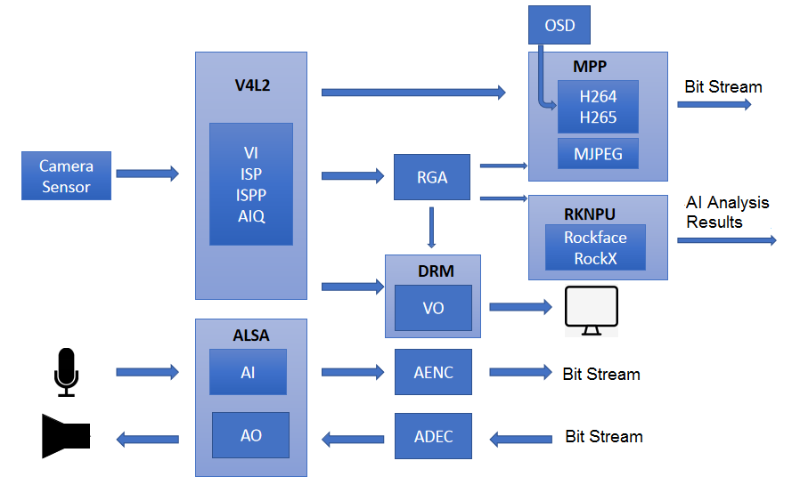
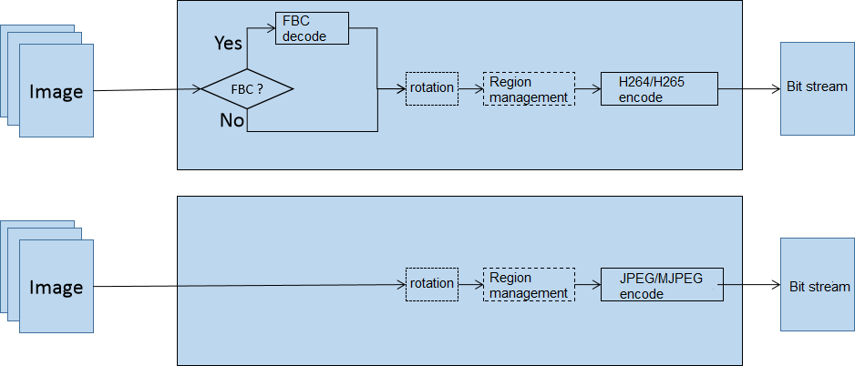

# Rockchip RKMedia Development Guide

ID: RK-KF-YF-382

Release Version: V1.2.1

Release Date: 2021-01-03

Security Level: □Top-Secret   □Secret   □Internal   ■Public

**DISCLAIMER**

THIS DOCUMENT IS PROVIDED “AS IS”. ROCKCHIP ELECTRONICS CO., LTD.(“ROCKCHIP”)DOES NOT PROVIDE ANY WARRANTY OF ANY KIND, EXPRESSED, IMPLIED OR OTHERWISE, WITH RESPECT TO THE ACCURACY, RELIABILITY, COMPLETENESS,MERCHANTABILITY, FITNESS FOR ANY PARTICULAR PURPOSE OR NON-INFRINGEMENT OF ANY REPRESENTATION, INFORMATION AND CONTENT IN THIS DOCUMENT. THIS DOCUMENT IS FOR REFERENCE ONLY. THIS DOCUMENT MAY BE UPDATED OR CHANGED WITHOUT ANY NOTICE AT ANY TIME DUE TO THE UPGRADES OF THE PRODUCT OR ANY OTHER REASONS.

**Trademark Statement**

"Rockchip", "瑞芯微", "瑞芯" shall be Rockchip’s registered trademarks and owned by Rockchip. All the other trademarks or registered trademarks mentioned in this document shall be owned by their respective owners.

**All rights reserved. ©2020. Rockchip Electronics Co., Ltd.**

Beyond the scope of fair use, neither any entity nor individual shall extract, copy, or distribute this document in any form in whole or in part without the written approval of Rockchip.

Rockchip Electronics Co., Ltd.

No.18 Building, A District, No.89, software Boulevard Fuzhou, Fujian,PRC

Website:     [www.rock-chips.com](http://www.rock-chips.com)

Customer service Tel:  +86-4007-700-590

Customer service Fax:  +86-591-83951833

Customer service e-Mail:  [fae@rock-chips.com](mailto:fae@rock-chips.com)

---

**Preface**

**Overview**

This document mainly describes the RKMedia media development reference.

**Product Version**

| **Chipset** | **Kernel Version** |
| ------------ | ------------ |
| RK1126/RK1109| Linux V4.19 |

**Intended Audience**

This document (this guide) is mainly intended for:

Technical support engineers

Software development engineers

**Revision History**

| **Version** | **Author** | **Date** | **Revision History** |
| ---------- | --------| :--------- | ------------ |
| V0.0.1   | Francis / Yongzhen | 2020-08-31 | Initial version |
| V1.0.0 | Fenrir Lin | 2020-09-03 | Add data type and error code, and related link |
| V1.1.0 | Francis/Allen | 2020-11-18 | 1.Add API description：<br />（1）[RK_MPI_MB_CreateBuffer](#RK_MPI_MB_CreateBuffer)<br />（2）[RK_MPI_MB_CreateImageBuffer](#RK_MPI_MB_CreateImageBuffer)<br />（3）[RK_MPI_MB_CreateAudioBuffer](#RK_MPI_MB_CreateAudioBuffer)<br />（4）[RK_MPI_MB_ConvertToImgBuffer](#RK_MPI_MB_ConvertToImgBuffer)<br />（5）[RK_MPI_MB_ConvertToAudBuffer](#RK_MPI_MB_ConvertToAudBuffer)<br />（6）[RK_MPI_MB_SetSzie](#RK_MPI_MB_SetSzie)<br />（7）[RK_MPI_MB_SetTimestamp](#RK_MPI_MB_SetTimestamp)<br />（8）[RK_MPI_MB_GetFlag](#RK_MPI_MB_GetFlag)<br />（9）[RK_MPI_MB_GetTsvcLevel](#RK_MPI_MB_GetTsvcLevel)<br />（10）[RK_MPI_MB_IsViFrame](#RK_MPI_MB_IsViFrame)<br />（11）[RK_MPI_MB_GetImageInfo](#RK_MPI_MB_GetImageInfo)<br />（12）[RK_MPI_MB_BeginCPUAccess](#RK_MPI_MB_BeginCPUAccess)<br />（13）[RK_MPI_MB_EndCPUAccess](#RK_MPI_MB_EndCPUAccess)<br />（14）[RK_MPI_VI_StartRegionLuma](#RK_MPI_VI_StartRegionLuma)<br />（15）[RK_MPI_VI_StopRegionLuma](#RK_MPI_VI_StopRegionLuma)<br />（16）[RK_MPI_VENC_GetVencChnAttr](#RK_MPI_VENC_GetVencChnAttr)<br />（17）[RK_MPI_VENC_SetVencChnAttr](#RK_MPI_VENC_SetVencChnAttr)<br />（18）[RK_MPI_VENC_CreateJpegLightChn](#RK_MPI_VENC_CreateJpegLightChn)<br />（19）[RK_MPI_VENC_GetRcParam](#RK_MPI_VENC_GetRcParam)<br />（20）[RK_MPI_VENC_SetResolution](#RK_MPI_VENC_SetResolution)<br />（21）[RK_MPI_VENC_GetRoiAttr](#RK_MPI_VENC_GetRoiAttr)<br />（22）[RK_MPI_VENC_RGN_SetPaletteId](#RK_MPI_VENC_RGN_SetPaletteId)<br />（23）[RK_MPI_VENC_GetFd](#RK_MPI_VENC_GetFd)<br />（24）[RK_MPI_VENC_QueryStatus](#RK_MPI_VENC_QueryStatus)<br />（25）[RK_MPI_ALGO_MD_EnableSwitch](#RK_MPI_ALGO_MD_EnableSwitch)<br />（26）[RK_MPI_ALGO_OD_EnableSwitch](#RK_MPI_ALGO_OD_EnableSwitch)<br />（27）[RK_MPI_VO_SetChnAttr](#RK_MPI_VO_SetChnAttr)<br />（28）[RK_MPI_AI_StartStream](#RK_MPI_AI_StartStream)<br />（29）[RK_MPI_AO_QueryChnStat](#RK_MPI_AO_QueryChnStat)<br />（30）[RK_MPI_AO_ClearChnBuf](#RK_MPI_AO_ClearChnBuf)<br />（31）[RK_MPI_SYS_StartGetMediaBuffer](#RK_MPI_SYS_StartGetMediaBuffer)<br />（32）[RK_MPI_SYS_StopGetMediaBuffer](#RK_MPI_SYS_StopGetMediaBuffer)<br />（33）[RK_MPI_VDEC_CreateChn](#RK_MPI_VDEC_CreateChn)<br />（34）[RK_MPI_VDEC_DestroyChn](#RK_MPI_VDEC_DestroyChn)<br />2. Update API：[RK_MPI_VO_CreateChn](#RK_MPI_VO_CreateChn)<br />3.[New example description section](#Examples) |
| V1.1.1 | Allen  Chen | 2020-12-08 | Fix some VI working mode errors |
| V1.2.0 | Allen Chen/Fenrir Lin | 2020-12-17 | 1. Optimize language description<br />2. Add [Build Introduction](# Build Introduction)<br />3. Add API Introduction：<br />（1）[RK_MPI_LOG_SetLevelConf](#RK_MPI_LOG_SetLevelConf)<br />（2）[RK_MPI_LOG_GetLevelConf](#RK_MPI_LOG_GetLevelConf) |
| V1.2.1 | Francis/Ruby | 2021-01-03 | Update some expression of contents<br />Correct some code error<br />Correct some example description error<br />Update some example parameter description |

---

**Contents**

[TOC]

---

## Introduction

### Overview

 RKMedia provides a media processing solution that helps customers developing application software rapidly. RKMedia further package basic API of each module to simplify the difficulty of application development. This platform supports the following functions: VI (input video capture), VENC (H.265/H.264/JPEG/MJPEG encoding), VDEC (H.265/H.264/JPEG, MJPEG decoding), VO (video output display ), RGA video processing (including rotation, scaling, cropping), AI (audio capture), AO (audio output), AENC (audio coding), ADEC (audio decoding), MD (motion detection), OD (occlusion detection) ).

### System Structure

 

### System Resources Table

| Module name | Number of channels |
| -------- | -------- |
| VI | 8 |
| VENC | 16 |
| VDEC | 16 |
| AI | 1 |
| AO | 1 |
| AENC | 16 |
| ADEC | 16 |
| MD | 4 |
| OD | 4 |
| RGA | 16 |
| VO | 2 |

## System Control

### Overview

The system controls the initialization work of the basic system, and is also responsible for initialization and de-initialization of each module, managing the binding relationship of each module, providing the current system version, and system log management.

### Function Introduction

#### System BindingExpression

RKMedia provides a system binding interface ([RK_MPI_SYS_Bind](#RK_MPI_SYS_Bind)), in other words, data source is bound by data receiver to establish the relations between the two(data receiver is allowed to bind data source only). After binding, the data generated by the data source will be automatically sent to the receiver. Currently, the supported binding relations are shown in [Table 2-1](#bind-relation).

<a name="bind-relation">Table 2-1 Binding relations supported by RKMedia</a>

| Data Source | Data Receiver |
| ------ | ----------------- |
| VI | VO/RGA/VENC/MD/OD |
| VDEC | VO/RGA/VENC/MD/OD |
| RGA | VO/VENC/MD/OD |
| AI | AO/AENC |
| ADEC | AO |

### API Reference

#### RK_MPI_SYS_Init

【Description】

Initialize the system.

【Grammar】

RK_S32 RK_MPI_SYS_Init();

【Parameter】

No.

【Return value】

| Return value | Description |
| ------ | -------------------------------- |
| 0 | Success. |
| Not 0 | Failure, see [Error Code](#common-error) for details. |

【Requirement】

Header file: rkmedia_api.h

Library file: libeasymedia.so

【Note】

No.

【Example】

No.

【Related topic】

No.

#### RK_MPI_SYS_DumpChn

【Description】

Print channel information.

【Grammar】

RK_VOID RK_MPI_SYS_DumpChn([MOD_ID_E](#MOD_ID_E) enModId);

【Parameter】

| Parameter name | Description | Input/Output |
| -------- | -------- | --------- |
| enModId | Module number. | Input |

【Return value】

No.

【Requirement】

Header file: rkmedia_api.h

Library file: libeasymedia.so

【Note】

No.

【Example】

No.

【Related topic】

No.

#### RK_MPI_SYS_Bind

【Description】

The binding interface between data source and data receiver.

【Grammar】

RK_S32 RK_MPI_SYS_Bind(const [MPP_CHN_S](#MPP_CHN_S) *pstSrcChn,const [MPP_CHN_S](#MPP_CHN_S) *pstDestChn);

【Parameter】

| Parameter name | Description | Input/Output |
| ---------- | -------------- | --------- |
| pstSrcChn | Source channel pointer. | Input |
| pstDestChn | Target channel pointer. | Input |

【Return value】

| Return value | Description |
| ------ | -------------------------------- |
| 0 | Success. |
| Not 0 | Failure, see [Error Code](#common-error) for details |

【Requirement】

Header file: rkmedia_api.h

Library file: libeasymedia.so

【Note】

For the binding relations currently supported by the system, please refer to [Table 2-1](#bind-relation).

Before releasing the bound channel, you need to unbind it through [RK_MPI_SYS_UnBind](#RK_MPI_SYS_UnBind).

【Example】

No.

【Related topic】

[RK_MPI_SYS_UnBind](#RK_MPI_SYS_UnBind)

#### RK_MPI_SYS_UnBind

【Description】

The Data source to data receiver unbinding interface.

【Grammar】

RK_MPI_SYS_UnBind(const [MPP_CHN_S](#MPP_CHN_S) *pstSrcChn,const [MPP_CHN_S](#MPP_CHN_S) *pstDestChn);

【Parameter】

| Parameter name | Description | Input/Output |
| ---------- | -------------- | --------- |
| pstSrcChn | Source channel pointer. | Input |
| pstDestChn | Target channel pointer. | Input |

【Return value】

| Return value | Description |
| ------ | -------------------------------- |
| 0 | Success. |
| Not 0 | Failure, see [Error Code](#common-error) for details |

【Requirement】

Header file: rkmedia_api.h

Library file: libeasymedia.so

【Note】

No.

【Example】

No.

【Related topic】

[RK_MPI_SYS_Bind](#RK_MPI_SYS_Bind)

#### RK_MPI_SYS_RegisterEventCb

【Description】

Register an event callback, such as motion detection event.

【Grammar】

RK_S32 RK_MPI_SYS_RegisterEventCb(const [MPP_CHN_S](#MPP_CHN_S) *pstChn, [EventCbFunc](#EventCbFunc) cb);

【Parameter】

| Parameter name | Description | Input/Output |
| -------- | -------------- | --------- |
| pstChn | Specify the channel pointer. | Input |
| cb | Event callback function. | Output |

【Return value】

| Return value | Description |
| ------ | -------------------------------- |
| 0 | Success. |
| Not 0 | Failure, see [Error Code](#common-error) for details |

【Requirement】

Header file: rkmedia_api.h

Library file: libeasymedia.so

【Note】

No.

【Example】

[rkmedia_vi_md_test](#rkmedia_vi_md_test).

【Related topic】

No.

#### RK_MPI_SYS_RegisterOutCb

【Description】

Register a data output callback.

【Description】

Register a data output callback. Compared with [RK_MPI_SYS_GetMediaBuffer](#RK_MPI_SYS_GetMediaBuffer), there is no need to cache buffer waiting for users to request it, and save memories.

【Grammar】

RK_S32 RK_MPI_SYS_RegisterOutCb(const [MPP_CHN_S](#MPP_CHN_S) *pstChn, [OutCbFunc](#OutCbFunc) cb);

【Parameter】

| Parameter name | Description | Input/Output |
| -------- | ------------------ | --------- |
| pstChn | Specify the channel pointer. | Input |
| cb | Data output callback function. | Output |

【Return value】

| Return value | Description |
| ------ | -------------------------------- |
| 0 | Success. |
| Not 0 | Failure, see [Error Code](#common-error) for details |

【Requirement】

Header file: rkmedia_api.h

Library file: libeasymedia.so

【Note】

The callback function cannot handle time-consuming operations, otherwise the corresponding channel data stream will be blocked.

【Example】

[rkmedia_vi_venc_test](#rkmedia_vi_venc_test).

【Related topic】

No.

#### RK_MPI_SYS_SendMediaBuffer

【Description】

Input data to the specified channel, such as sending the local yuv file to the encoder for encoding.

【Grammar】

RK_S32 RK_MPI_SYS_SendMediaBuffer([MOD_ID_E](#MOD_ID_E) enModID, RK_S32 s32ChnID, [MEDIA_BUFFER](#MEDIA_BUFFER) buffer);

【Parameter】

| Parameter name | Description | Input/Output |
| -------- | -------- | --------- |
| enModID | Module number. | Input |
| s32ChnID | Channel number. | Input |
| buffer | Buffer. | Input |

【Return value】

| Return value | Description |
| ------ | -------------------------------- |
| 0 | Success. |
| Not 0 | Failure, see [Error Code](#common-error) for details |

【Requirement】

Header file: rkmedia_api.h

Library file: libeasymedia.so

【Note】

No.

【Example】

[rkmedia_vo_display_test](#rkmedia_vo_display_test).

【Related topic】

[RK_MPI_SYS_GetMediaBuffer](#RK_MPI_SYS_GetMediaBuffer)

#### RK_MPI_SYS_StartGetMediaBuffer

【Description】

Enable the receive buffer. After the receive buffer is enabled, even if the channel is bound, the MediaBuffer can be obtained through [RK_MPI_SYS_GetMediaBuffer](#RK_MPI_SYS_GetMediaBuffer).

【Grammar】

RK_S32 RK_MPI_SYS_StartGetMediaBuffer([MOD_ID_E](#MOD_ID_E) enModID, RK_S32 s32ChnID);

【Parameter】

| Parameter name | Description | Input/Output |
| -------- | -------- | --------- |
| enModID | Module number. | Input |
| s32ChnID | Channel number. | Input |

【Return value】

| Return value | Description |
| ------ | -------------------------------- |
| 0 | Success. |
| Not 0 | Failure, see [Error Code](#common-error) for details |

【Requirement】

Header file: rkmedia_api.h

Library file: libeasymedia.so

【Note】

After enabling the receive buffer, call [RK_MPI_SYS_GetMediaBuffer](#RK_MPI_SYS_GetMediaBuffer) in time to remove MediaBuffer, otherwise a packet loss warning will be prompted.

【Example】

No.

【Related topic】

[RK_MPI_SYS_GetMediaBuffer](#RK_MPI_SYS_GetMediaBuffer)

[RK_MPI_SYS_StopGetMediaBuffer](#RK_MPI_SYS_StopGetMediaBuffer)

#### RK_MPI_SYS_StopGetMediaBuffer

【Description】

Close the receive buffer and clear the existing MediaBuffer in the buffer.

【Grammar】

[MEDIA_BUFFER](#MEDIA_BUFFER) RK_MPI_SYS_StopGetMediaBuffer([MOD_ID_E](#MOD_ID_E) enModID, RK_S32 s32ChnID);

【Parameter】

| Parameter name | Description | Input/Output |
| -------- | -------- | --------- |
| enModID | Module number. | Input |
| s32ChnID | Channel number. | Input |

【Return value】

| Return value | Description |
| ------ | -------------------------------- |
| 0 | Success. |
| Not 0 | Failure, see [Error Code](#common-error) for details |

【Requirement】

Header file: rkmedia_api.h

Library file: libeasymedia.so

【Note】

After calling this interface, if you call [RK_MPI_SYS_GetMediaBuffer](#RK_MPI_SYS_GetMediaBuffer) again to get data, the receive buffer will be opened again.

【Example】

No.

【Related topic】

[RK_MPI_SYS_StartGetMediaBuffer](#RK_MPI_SYS_StartGetMediaBuffer)

[RK_MPI_SYS_GetMediaBuffer](#RK_MPI_SYS_GetMediaBuffer)

#### RK_MPI_SYS_GetMediaBuffer

【Description】

Obtain data from the specified channel.

【Grammar】

[MEDIA_BUFFER](#MEDIA_BUFFER) RK_MPI_SYS_GetMediaBuffer([MOD_ID_E](#MOD_ID_E) enModID, RK_S32 s32ChnID, RK_S32 s32MilliSec);

【Parameter】

| Parameter name | Description                                | Input/Output |
| -------------- | ------------------------------------------ | ------------ |
| enModID        | Module number.                             | Input        |
| s32ChnID       | Channel number.                            | Input        |
| s32MilliSec    | -1: blocking;  >=0: blocking waiting time. | Input        |

【Return value】

| Return value type | Description |
| ----------------------------- | ------------ |
| [MEDIA_BUFFER](#MEDIA_BUFFER) | Buffer pointer. |

【Requirement】

Header file: rkmedia_api.h

Library file: libeasymedia.so

【Note】

This interface will trigger [RK_MPI_SYS_StartGetMediaBuffer](#RK_MPI_SYS_StartGetMediaBuffer) automatically.

【Example】

[rkmedia_vi_get_frame_test](#rkmedia_vi_get_frame_test).

【Related topic】

[RK_MPI_SYS_StartGetMediaBuffer](#RK_MPI_SYS_StartGetMediaBuffer)

[RK_MPI_SYS_StopGetMediaBuffer](#RK_MPI_SYS_StopGetMediaBuffer)

#### RK_MPI_MB_CreateBuffer

【Description】

Create a common buffer.

【Grammar】

[MEDIA_BUFFER](#MEDIA_BUFFER) RK_MPI_MB_CreateBuffer(RK_U32 u32Size, RK_BOOL boolHardWare, RK_U8 u8Flag);

| Parameter name | Description                                                  | Input/Output |
| -------------- | ------------------------------------------------------------ | ------------ |
| u32Size        | Create buffer size.                                          | Input        |
| boolHardWare   | Whether to create a hardware type buffer (DMA Buffer).       | Input        |
| u8Flag         | Additional flag for hardware type buffer, values: <br />0: create a hardware buffer with a buffer type<br />MB_FLAG_NOCACHED: create a hardware buffer without a buffer type | Input        |

【Return value】

| Return value type | Description |
| ----------------------------- | ------------ |
| [MEDIA_BUFFER](#MEDIA_BUFFER) | Buffer pointer. |

【Requirement】

Header file: rkmedia_buffer.h

Library file: libeasymedia.so

【Note】

There is no image information structure in regular buffers.

【Example】

[rkmedia_venc_local_file_test](#rkmedia_venc_local_file_test).

【Related topic】

No.

#### RK_MPI_MB_CreateImageBuffer

【Description】

Create an image buffer. Compared with regular buffers, it carries image information structure. During image handling , it is recommended to use this method to get buffer.

【Grammar】

[MEDIA_BUFFER](#MEDIA_BUFFER) RK_MPI_MB_CreateImageBuffer([MB_IMAGE_INFO_S](#MB_IMAGE_INFO_S) *pstImageInfo, RK_BOOL boolHardWare, RK_U8 u8Flag);

| Parameter name | Description                                                  | Input/Output |
| -------------- | ------------------------------------------------------------ | ------------ |
| pstImageInfo   | Image buffer information structure.                          | Input        |
| boolHardWare   | Whether to create a hardware type buffer (DMA Buffer).       | Input        |
| u8Flag         | Additional flag for hardware type buffer, values: <br />0: create a hardware buffer with a buffer type<br />MB_FLAG_NOCACHED: create a hardware buffer without a buffer type | Input        |

【Return value】

| Return value type | Description |
| ----------------------------- | ------------ |
| [MEDIA_BUFFER](#MEDIA_BUFFER) | Buffer pointer. |

【Requirement】

Header file: rkmedia_buffer.h

Library file: libeasymedia.so

【Note】

No.

【Example】

[rkmedia_venc_local_file_test](#rkmedia_venc_local_file_test).

【Related topic】

No.

#### RK_MPI_MB_CreateAudioBuffer

【Description】

Create an audio buffer.

【Grammar】

[MEDIA_BUFFER](#MEDIA_BUFFER) RK_MPI_MB_CreateAudioBuffer(RK_U32 u32BufferSize, RK_BOOL boolHardWare);

| Parameter name | Description                                            | Input/Output |
| -------------- | ------------------------------------------------------ | ------------ |
| u32BufferSize  | Buffer size.                                           | Input        |
| boolHardWare   | Whether to create a hardware type Buffer (DMA Buffer). | Input        |

【Return value】

| Return value type | Description |
| ----------------------------- | ------------ |
| [MEDIA_BUFFER](#MEDIA_BUFFER) | Buffer pointer. |

【Requirement】

Header file: rkmedia_buffer.h

Library file: libeasymedia.so

【Note】

No.

【Example】

[rkmedia_adec_ao_test](#rkmedia_adec_ao_test).

【Related topic】

No.

#### RK_MPI_MB_ConvertToImgBuffer

【Description】

Convert regular buffer to image buffer.

【Grammar】

[MEDIA_BUFFER](#MEDIA_BUFFER) RK_MPI_MB_ConvertToImgBuffer([MEDIA_BUFFER](#MEDIA_BUFFER) mb, [MB_IMAGE_INFO_S](#MB_IMAGE_INFO_S) *pstImageInfo);

| Parameter name | Description                         | Input/Output |
| -------------- | ----------------------------------- | ------------ |
| mb             | regular buffer pointer.             | Input        |
| pstImageInfo   | Image buffer information structure. | Input        |

【Return value】

| Return value type | Description |
| ----------------------------- | ------------ |
| [MEDIA_BUFFER](#MEDIA_BUFFER) | Buffer pointer. |

【Requirement】

Header file: rkmedia_buffer.h

Library file: libeasymedia.so

【Note】

No.

【Example】

No.

【Related topic】

No.

#### RK_MPI_MB_ConvertToAudBuffer

【Description】

Convert a regular buffer to audio buffer.

【Grammar】

[MEDIA_BUFFER](#MEDIA_BUFFER) RK_MPI_MB_ConvertToAudBuffer([MEDIA_BUFFER](#MEDIA_BUFFER) mb);

| Parameter name | Description             | Input/Output |
| -------------- | ----------------------- | ------------ |
| mb             | Regular buffer pointer. | Input        |

【Return value】

| Return value type | Description |
| ----------------------------- | ------------ |
| [MEDIA_BUFFER](#MEDIA_BUFFER) | Buffer pointer. |

【Requirement】

Header file: rkmedia_buffer.h

Library file: libeasymedia.so

【Note】

No.

【Example】

No.

【Related topic】

No.

#### RK_MPI_MB_ReleaseBuffer

【Description】

Release a buffer.

【Grammar】

RK_S32 RK_MPI_MB_ReleaseBuffer([MEDIA_BUFFER](#MEDIA_BUFFER) mb);

【Parameter】

| Parameter name | Description     | Input/Output |
| -------------- | --------------- | ------------ |
| mb             | Buffer pointer. | Input        |

【Return value】

| Return value | Description                                          |
| ------------ | ---------------------------------------------------- |
| 0            | Success.                                             |
| Not 0        | Failure, see [Error Code](#common-error) for details |

【Requirement】

Header file: rkmedia_buffer.h

Library file: libeasymedia.so

【Note】

No.

【Example】

[rkmedia_venc_local_file_test](#rkmedia_venc_local_file_test).

【Related topic】

[RK_MPI_SYS_GetMediaBuffer](#RK_MPI_SYS_GetMediaBuffer)

#### RK_MPI_MB_GetPtr

【Description】

Get the buffer data pointer from the specified [MEDIA_BUFFER](#MEDIA_BUFFER).

【Grammar】

void *RK_MPI_MB_GetPtr([MEDIA_BUFFER](#MEDIA_BUFFER) mb);

【Parameter】

| Parameter name | Description     | Input/Output |
| -------------- | --------------- | ------------ |
| mb             | Buffer pointer. | Input        |

【Return value】

| Return value type | Description          |
| ----------------- | -------------------- |
| void *            | Buffer data pointer. |

【Requirement】

Header file: rkmedia_buffer.h

Library file: libeasymedia.so

【Note】

No.

【Example】

[rkmedia_venc_local_file_test](#rkmedia_venc_local_file_test).

【Related topic】

No.

#### RK_MPI_MB_GetFD

【Description】

Get the file descriptor from the specified [MEDIA_BUFFER](#MEDIA_BUFFER).

【Grammar】

int RK_MPI_MB_GetFD([MEDIA_BUFFER](#MEDIA_BUFFER) mb);

【Parameter】

| Parameter name | Description     | Input/Output |
| -------------- | --------------- | ------------ |
| mb             | Buffer pointer. | Input        |

【Return value】

| Return value type | Description      |
| ----------------- | ---------------- |
| int               | File descriptor. |

【Requirement】

Header file: rkmedia_buffer.h

Library file: libeasymedia.so

【Note】

No.

【Example】

[rkmedia_venc_local_file_test](#rkmedia_venc_local_file_test).

【Related topic】

No.

#### RK_MPI_MB_GetSize

【Description】

Get the buffer data size from the specified [MEDIA_BUFFER](#MEDIA_BUFFER).

【Grammar】

size_t RK_MPI_MB_GetSize([MEDIA_BUFFER](#MEDIA_BUFFER) mb);

【Parameter】

| Parameter name | Description | Input/Output |
| -------------- | ----------- | ------------ |
| mb             | Buffer.     | Input        |

【Return value】

| Return value type | Description       |
| ----------------- | ----------------- |
| size_t            | Buffer data size. |

【Requirement】

Header file: rkmedia_buffer.h

Library file: libeasymedia.so

【Note】

No.

【Example】

[rkmedia_venc_local_file_test](#rkmedia_venc_local_file_test).

【Related topic】

No.

#### RK_MPI_MB_SetSzie

【Description】

Set the date size of specified [MEDIA_BUFFER](#MEDIA_BUFFER).

| Parameter name | Description      | Input/Output |
| -------------- | ---------------- | ------------ |
| mb             | Buffer pointer.  | Input        |
| size           | Buffer data size | Input        |

【Return value】

| Return value | Description                                          |
| ------------ | ---------------------------------------------------- |
| 0            | Success.                                             |
| Not 0        | Failure, see [Error Code](#common-error) for details |

【Requirement】

Header file: rkmedia_buffer.h

Library file: libeasymedia.so

【Note】

The buffer data size has to been set by this function after operating the buffer and changing its size, otherwise [RK_MPI_MB_GetSize](#RK_MPI_MB_GetSize) will not be able to get the correct buffer data size.

【Example】

No.

【Related topic】

[RK_MPI_MB_GetSize](#RK_MPI_MB_GetSize).

#### RK_MPI_MB_GetModeID

【Description】

Get the module ID from the specified [MEDIA_BUFFER](#MEDIA_BUFFER).

【Grammar】

[MOD_ID_E](#MOD_ID_E) RK_MPI_MB_GetModeID([MEDIA_BUFFER](#MEDIA_BUFFER) mb);

【Parameter】

| Parameter name | Description | Input/Output |
| -------------- | ----------- | ------------ |
| mb             | Buffer.     | Input        |

【Return value】

| Return value type     | Description |
| --------------------- | ----------- |
| [MOD_ID_E](#MOD_ID_E) | Module ID.  |

【Requirement】

Header file: rkmedia_buffer.h

Library file: libeasymedia.so

【Note】

No.

【Example】

[rkmedia_vi_multi_bind_test](#rkmedia_vi_multi_bind_test).

【Related topic】

No.

#### RK_MPI_MB_GetChannelID

【Description】

Get the channel ID from the specified [MEDIA_BUFFER](#MEDIA_BUFFER).

【Grammar】

RK_S16 RK_MPI_MB_GetChannelID([MEDIA_BUFFER](#MEDIA_BUFFER) mb);

【Parameter】

| Parameter name | Description | Input/Output |
| -------------- | ----------- | ------------ |
| mb             | Buffer.     | Input        |

【Return value】

| Return value type | Description |
| ----------------- | ----------- |
| RK_S16            | Channel ID. |

【Requirement】

Header file: rkmedia_buffer.h

Library file: libeasymedia.so

【Note】

No.

【Example】

[rkmedia_vi_multi_bind_test](#/rkmedia_vi_multi_bind_test).

【Related topic】

No.

#### RK_MPI_MB_GetTimestamp

【Description】

Get the timestamp from the specified [MEDIA_BUFFER](#MEDIA_BUFFER).

【Grammar】

RK_U64 RK_MPI_MB_GetTimestamp([MEDIA_BUFFER](#MEDIA_BUFFER) mb);

【Parameter】

| Parameter name | Description | Input/Output |
| -------------- | ----------- | ------------ |
| mb             | Buffer.     | Input        |

【Return value】

| Return value type | Description |
| ----------------- | ----------- |
| RK_U64            | Timestamp.  |

【Requirement】

Header file: rkmedia_buffer.h

Library file: libeasymedia.so

【Note】

No.

【Example】

[rkmedia_vi_rockx_venc_rtsp_test](#rkmedia_vi_rockx_venc_rtsp_test).

【Related topic】

[RK_MPI_MB_SetTimestamp](#RK_MPI_MB_SetTimestamp).

#### RK_MPI_MB_SetTimestamp

【Description】

Set timestamp of the specified [MEDIA_BUFFER](#MEDIA_BUFFER).

【Grammar】

RK_S32 RK_MPI_MB_SetTimestamp([MEDIA_BUFFER](#MEDIA_BUFFER) mb, RK_U64 timestamp);

【Parameter】

| Parameter name | Description | Input/Output |
| -------------- | ----------- | ------------ |
| mb             | Buffer.     | Input        |
| timestamp      | timestamp   | Input        |

【Return value】

| Return value | Description                                          |
| ------------ | ---------------------------------------------------- |
| 0            | Success.                                             |
| Not 0        | Failure, see [Error Code](#common-error) for details |

【Requirement】

Header file: rkmedia_buffer.h

Library file: libeasymedia.so

【Note】

When calling the librga library (relative to RGA Channel) to handle MEDIA_BUFFER directly, users need to process the timestamp attribute manually. such as:

```c
// Call librga api to deal with MediaBuffer0, the output timestamp attribute of MediaBuffer1 will be lost
// MediaBuffer0 --> RGA Crop --> MediaBuffer1
// Need to call this interface to copy the timestamp of MediaBuffer0 manually
RK_MPI_MB_SetTimestamp(MediaBuffer1, RK_MPI_MB_GetTimestamp(MediaBuffer0));
```

【Example】

[rkmedia_vi_rockx_venc_rtsp_test](#rkmedia_vi_rockx_venc_rtsp_test).

【Related topic】

[RK_MPI_MB_GetTimestamp](#RK_MPI_MB_GetTimestamp).

#### RK_MPI_MB_GetFlag

【Description】

Get Flag from the specified [MEDIA_BUFFER](#MEDIA_BUFFER). Flag is used to mark the special attributes of Buffer, such as frame type: I frame, P frame, etc.

【Grammar】

RK_S32 RK_MPI_MB_GetFlag([MEDIA_BUFFER](#MEDIA_BUFFER) mb);

【Parameter】

| Parameter name | Description | Input/Output |
| -------------- | ----------- | ------------ |
| mb             | Buffer.     | Input        |

【Return value】

| Return value type | Description                                                  |
| ----------------- | ------------------------------------------------------------ |
| RK_S32            | Additional flag for hardware type Buffer:<br />0: create hardware buffer with buffer type<br />MB_FLAG_NOCACHED: create hardware buffer without buffer type |

【Requirement】

Header file: rkmedia_buffer.h

Library file: libeasymedia.so

【Note】

No.

【Example】

[rkmedia_venc_smartp_test](#rkmedia_venc_smartp_test).

【Related topic】

No.

#### RK_MPI_MB_GetTsvcLevel

【Description】

Get TSVC level from the specified [MEDIA_BUFFER](#MEDIA_BUFFER). TSVC represents SVC in time dimension. After TSVC function is enabled, the code stream will be divided into three levels: L0, L1, and L2. High-level coded frames are decoded depending on low-level coded frames (for example, L2 depends on L1, L0; L1 depends on L0), but low-level coded frames can be decoded independently (L0 can be decoded independently, L1, L0 can be decoded independently of L2). For example, for a 60fps video, if you decode L1 and L0 only, you will get a 30fps video, if you decode L0 only, you will get a 15fps video.

【Grammar】

RK_S32 RK_MPI_MB_GetTsvcLevel([MEDIA_BUFFER](#MEDIA_BUFFER) mb);

【Parameter】

| Parameter name | Description | Input/Output |
| -------- | -------- | --------- |
| mb | Buffer. | Input |

【Return value】

| Return value type | Description |
| ---------- | ---------- |
| RK_S32 | TSVC level. |

【Requirement】

Header file: rkmedia_buffer.h

Library file: libeasymedia.so

【Note】

If the encoder does not turn on the TSVC/SMARTP mode, the return value of this interface is invalid.

【Example】

[rkmedia_venc_smartp_test](#rkmedia_venc_smartp_test).

【Related topic】

No.

#### RK_MPI_MB_IsViFrame

【Description】

Determine whether the specified [MEDIA_BUFFER](#MEDIA_BUFFER) is a VirtualIntra frame (virtual I frame).

【Grammar】

RK_BOOL RK_MPI_MB_IsViFrame([MEDIA_BUFFER](#MEDIA_BUFFER) mb);

【Parameter】

| Parameter name | Description | Input/Output |
| -------- | -------- | --------- |
| mb | Buffer. | Input |

【Return value】

| Return value type | Description |
| ---------- | ------------ |
| RK_BOOL | Whether it is a VI frame. |

【Requirement】

Header file: rkmedia_buffer.h

Library file: libeasymedia.so

【Note】

Only valid in smartp mode.

【Example】

[rkmedia_venc_smartp_test](#rkmedia_venc_smartp_test).

【Related topic】

No.

#### RK_MPI_MB_GetImageInfo

【Description】

Get image information from the specified image buffer [MEDIA_BUFFER](#MEDIA_BUFFER).

【Grammar】

RK_S32 RK_MPI_MB_GetImageInfo([MEDIA_BUFFER](#MEDIA_BUFFER) mb, [MB_IMAGE_INFO_S](#MB_IMAGE_INFO_S) *pstImageInfo);

【Parameter】

| Parameter name | Description | Input/Output |
| ------------ | -------------------------- | --------- |
| mb | Buffer pointer. | Input |
| pstImageInfo | Image information structure pointer in Buffer | Output |

【Return value】

| Return value | Description |
| ------ | -------------------------------- |
| 0 | Success. |
| Not 0 | Failure, see [Error Code](#common-error) details. |

【Requirement】

Header file: rkmedia_buffer.h

Library file: libeasymedia.so

【Note】

 This function can be used by the image buffer to get information only.

【Example】

[rkmedia_vi_get_frame_test](#rkmedia_vi_get_frame_test).

【Related topic】

No.

#### RK_MPI_MB_BeginCPUAccess

【Description】

Solve the synchronization problem caused by the operation of the same [MEDIA_BUFFER](#MEDIA_BUFFER) between CPU and hardware module (such as ENCODER).

【Grammar】

RK_S32 RK_MPI_MB_BeginCPUAccess([MEDIA_BUFFER](#MEDIA_BUFFER) mb, RK_BOOL bReadonly);

【Parameter】

| Parameter name | Description | Input/Output |
| --------- | ------------ | --------- |
| mb | Buffer pointer. | Input |
| bReadonly | Whether it is read-only. | Input |

【Return value】

| Return value | Description |
| ------ | -------------------------------- |
| 0 | Success. |
| Not 0 | Failure, see [Error Code](#common-error) details. |

【Requirement】

Header file: rkmedia_buffer.h

Library file: libeasymedia.so

【Note】

Need to be used together with [RK_MPI_MB_EndCPUAccess](#RK_MPI_MB_EndCPUAccess).

【Example】

For example, in the case that after CPU filling buffer and then sending date for VENC encoding, the MediaBuffer created by the [RK_MPI_MB_CreateImageBuffer](#RK_MPI_MB_CreateImageBuffer) interface is with cache by default (you can create a NoCache type MediaBuffer through flag=MB_FLAG_NOCACHED), so after CPU writing buffer and it will remain some data in the cache and fail to be synchronized to memory (DDR) in time. At this time, it will be sent for VENC coding immediately, which will cause the image to be abnormal (such as intermittent green short lines). This interface is used to ensure that after CPU operates buffer, the buffer is flushed to memory immediately.

```
MEDIA_BUFFER mb;
RK_MPI_MB_BeginCPUAccess(mb, RK_FALSE);
// CPU fill data to mb.
memset(RK_MPI_MB_GetPtr(mb),'F', size);
RK_MPI_MB_EndCPUAccess(mb, RK_FALSE);
// Send mb to VENC
RK_MPI_SYS_SendMediaBuffer(RK_ID_VENC, 0, mb);
```

【Related topic】

No.

#### RK_MPI_MB_EndCPUAccess

【Description】

Solve the synchronization problem caused by the operation of the same [MEDIA_BUFFER](#MEDIA_BUFFER) between CPU and hardware module (such as ENCODER).

【Grammar】

RK_S32 RK_MPI_MB_BeginCPUAccess([MEDIA_BUFFER](#MEDIA_BUFFER) mb, RK_BOOL bReadonly);

【Parameter】

| Parameter name | Description | Input/Output |
| --------- | ------------ | --------- |
| mb | Buffer pointer. | Input |
| bReadonly | Whether it is read-only. | Input |

【Return value】

| Return value | Description |
| ------ | -------------------------------- |
| 0 | Success. |
| Not 0 | Failure, see [Error Code](#common-error) for details |

【Requirement】

Header file: rkmedia_buffer.h

Library file: libeasymedia.so

【Note】

Need to be used together with [RK_MPI_MB_BeginCPUAccess](#RK_MPI_MB_BeginCPUAccess).

【Example】

No.

【Related topic】

No.

#### RK_MPI_LOG_SetLevelConf

【Description】

Set log level.

【Grammar】

RK_S32 RK_MPI_LOG_SetLevelConf([LOG_LEVEL_CONF_S](#LOG_LEVEL_CONF_S) *pstConf);

【Parameter】

| Parameter name | Description | Input/Output |
| -------- | -------------------- | --------- |
| pstConf | Log level information structure. | Input |

【Return value】

| Return value | Description |
| ------ | --------------------------------------- |
| 0 | Success. |
| Not 0 | Failure, see [Error Code](#common-error) for details. |

【Requirement】

Header file: rkmedia_api.h

Library file: libeasymedia.so

【Note】

When the member cModName in pstConf is set to the string "all", log level of all modules will be set. Otherwise, set log level of the module specified by enModId only.

【Example】

No.

【Related topic】

[RK_MPI_LOG_GetLevelConf](#RK_MPI_LOG_GetLevelConf).

#### RK_MPI_LOG_GetLevelConf

【Description】

Get log level.

【Grammar】

RK_S32 RK_MPI_LOG_GetLevelConf([LOG_LEVEL_CONF_S](#LOG_LEVEL_CONF_S) *pstConf);

【Parameter】

| Parameter name     | Description                                         | Input/Output |
| ------------------ | --------------------------------------------------- | ------------ |
| pstConf-> enModId  | The module ID whose log level needs to be obtained. | Input        |
| pstConf-> s32Level | Get log level.                                      | Output       |
| pstConf-> cModName | The name of the module.                             | Output       |

【Return value】

| Return value | Description |
| ------ | --------------------------------------- |
| 0 | Success. |
| Not 0 | Failure, see [Error Code](#common-error) for details |

【Requirement】

Header file: rkmedia_api.h

Library file: libeasymedia.so

【Note】

No.

【Example】

No.

【Related topic】

[RK_MPI_LOG_SetLevelConf](#RK_MPI_LOG_SetLevelConf).

### Data Type

#### Basic Data Types

##### Regular Data Types

【Description】

Definition of basic data types.

【Definition】

```c
typedef unsigned char RK_U8;
typedef unsigned short RK_U16;
typedef unsigned int RK_U32;

typedef signed char RK_S8;
typedef short RK_S16;
typedef int RK_S32;

typedef unsigned long RK_UL;
typedef signed long RK_SL;

typedef float RK_FLOAT;
typedef double RK_DOUBLE;

#ifndef _M_IX86
typedef unsigned long long RK_U64;
typedef long long RK_S64;
#else
typedef unsigned __int64 RK_U64;
typedef __int64 RK_S64;
#endif

typedef char RK_CHAR;
#define RK_VOID void

typedef unsigned int RK_HANDLE;

typedef enum {
  RK_FALSE = 0,
  RK_TRUE = 1,
} RK_BOOL;

#ifndef NULL
#define NULL 0L
#endif

#define RK_NULL 0L
#define RK_SUCCESS 0
#define RK_FAILURE (-1)

#define MAX_FILE_PATH_LEN 256
```

##### IMAGE_TYPE_E

【Description】

Define an image format enumeration type.

【Definition】

```C
typedef enum rk_IMAGE_TYPE_E {
  IMAGE_TYPE_UNKNOW = 0,
  IMAGE_TYPE_GRAY8,
  IMAGE_TYPE_GRAY16,
  IMAGE_TYPE_YUV420P,
  IMAGE_TYPE_NV12,
  IMAGE_TYPE_NV21,
  IMAGE_TYPE_YV12,
  IMAGE_TYPE_FBC2,
  IMAGE_TYPE_FBC0,
  IMAGE_TYPE_YUV422P,
  IMAGE_TYPE_NV16,
  IMAGE_TYPE_NV61,
  IMAGE_TYPE_YV16,
  IMAGE_TYPE_YUYV422,
  IMAGE_TYPE_UYVY422,
  IMAGE_TYPE_RGB332,
  IMAGE_TYPE_RGB565,
  IMAGE_TYPE_BGR565,
  IMAGE_TYPE_RGB888,
  IMAGE_TYPE_BGR888,
  IMAGE_TYPE_ARGB8888,
  IMAGE_TYPE_ABGR8888,
  IMAGE_TYPE_JPEG,

  IMAGE_TYPE_BUTT
} IMAGE_TYPE_E;
```

##### CODEC_TYPE_E

【Description】

Define codec format enumeration type.

【Definition】

```c
typedef enum rk_CODEC_TYPE_E {
  RK_CODEC_TYPE_NONE = -1,
  // Audio
  RK_CODEC_TYPE_AAC,
  RK_CODEC_TYPE_MP2,
  RK_CODEC_TYPE_VORBIS,
  RK_CODEC_TYPE_G711A,
  RK_CODEC_TYPE_G711U,
  RK_CODEC_TYPE_G726,
  // Video
  RK_CODEC_TYPE_H264,
  RK_CODEC_TYPE_H265,
  RK_CODEC_TYPE_JPEG,
  RK_CODEC_TYPE_MJPEG,
  RK_CODEC_TYPE_NB
} CODEC_TYPE_E;
```

##### MOD_ID_E

【Description】

Define a module ID enumeration type.

【Definition】

```c
typedef enum rkMOD_ID_E {
  RK_ID_UNKNOW = 0,
  RK_ID_VB,
  RK_ID_SYS,
  RK_ID_VDEC,
  RK_ID_VENC,
  RK_ID_H264E,
  RK_ID_JPEGE,
  RK_ID_H265E,
  RK_ID_VO,
  RK_ID_VI,
  RK_ID_AIO,
  RK_ID_AI,
  RK_ID_AO,
  RK_ID_AENC,
  RK_ID_ADEC,
  RK_ID_ALGO_MD,
  RK_ID_ALGO_OD,
  RK_ID_RGA,

  RK_ID_BUTT,
} MOD_ID_E;
```

##### Sample_Format_E

【Description】

Define the sampling format enumeration type.

【Definition】

```c
typedef enum rkSample_Format_E {
  RK_SAMPLE_FMT_NONE = -1,
  RK_SAMPLE_FMT_U8,
  RK_SAMPLE_FMT_S16,
  RK_SAMPLE_FMT_S32,
  RK_SAMPLE_FMT_FLT,
  RK_SAMPLE_FMT_U8P,
  RK_SAMPLE_FMT_S16P,
  RK_SAMPLE_FMT_S32P,
  RK_SAMPLE_FMT_FLTP,
  RK_SAMPLE_FMT_G711A,
  RK_SAMPLE_FMT_G711U,
  RK_SAMPLE_FMT_NB
} Sample_Format_E;
```

##### RECT_S

【Description】

Define the region attribute structure.

【Definition】

```c

typedef struct rkRECT_S {
  RK_S32 s32X;
  RK_S32 s32Y;
  RK_U32 u32Width;
  RK_U32 u32Height;
} RECT_S;
```

【Members】

| Member name | Description |
| --------- | ------------- |
| s32X | X coordinate of the region |
| s32Y | Y coordinate of the region |
| u32Width | The width of the region |
| u32Height | The height of the region |

【Note】

No.

【Related data types and interfaces】

No.

#### System Control Data Type

The data types about system control are defined as follows:

[MPP_CHN_S](#MPP_CHN_S): define the module device channel structure.

[EventCbFunc](#EventCbFunc): event callback function pointer.

[MEDIA_BUFFER](#MEDIA_BUFFER): data buffer pointer.

[OutCbFunc](#OutCbFunc): data output callback function pointer.

[MB_IMAGE_INFO_S](#MB_IMAGE_INFO_S): image information structure.

##### MPP_CHN_S

【Description】

Define the module device channel structure.

【Definition】

```c
typedef struct rkMPP_CHN_S {
  MOD_ID_E enModId;
  RK_S32 s32DevId;
  RK_S32 s32ChnId;
} MPP_CHN_S;
```

【Members】

| Member name | Description |
| -------- | -------- |
| enModId | Module number. |
| s32DevId | Device ID. |
| s32ChnId | Channel number. |

##### EventCbFunc

【Description】

Event callback function pointer.

【Definition】

```c
typedef enum rkEVENT_TYPE_E {
  RK_EVENT_ERR = 0,
  RK_EVENT_MD, // Algo::Move detection event.
  RK_EVENT_OD, // Algo::Occlusion detection event.
  RK_EVNET_BUT
} EVENT_TYPE_E;

typedef struct rkMD_EVENT_S {
  RK_U16 u16Cnt;
  RK_U32 u32Width;
  RK_U32 u32Height;
  RECT_S stRects[4096];
} MD_EVENT_S;

typedef struct rkOD_EVENT_S {
  RK_U16 u16Cnt;
  RK_U32 u32Width;
  RK_U32 u32Height;
  RECT_S stRects[10];
  RK_U16 u16Occlusion[10];
} OD_EVENT_S;

typedef struct rkEVENT_S {
  EVENT_TYPE_E type;
  MOD_ID_E mode_id;
  union {
    MD_EVENT_S md_event;
    OD_EVENT_S stOdEvent;
  };
} EVENT_S;

typedef void (*EventCbFunc)(EVENT_S *event);
```

【Members】

| Member name | Description |
| --------- | -------------- |
| type | Event type. |
| mode_id | Module number. |
| md_event | Motion detection event. |
| stOdEvent | Occlusion detection event. |

##### MEDIA_BUFFER

【Description】

Data buffer pointer.

【Definition】

```c
typedef void *MEDIA_BUFFER;
```

【Related data types and interfaces】

[OutCbFunc](#OutCbFunc)

##### OutCbFunc

【Description】

Data output callback function pointer.

【Definition】

```c
typedef void (*OutCbFunc)(MEDIA_BUFFER mb);
```

【Related data types and interfaces】

[MEDIA_BUFFER](#MEDIA_BUFFER)

##### MB_IMAGE_INFO_S

【Description】

Image information structure.

【Definition】

```c
typedef struct rkMB_IMAGE_INFO {
  RK_U32 u32Width;
  RK_U32 u32Height;
  RK_U32 u32VerStride;
  RK_U32 u32HorStride;
  IMAGE_TYPE_E enImgType;
} MB_IMAGE_INFO_S;
```

【Members】

| Member name | Description |
| ------------ | -------------- |
| u32Width | Width. |
| u32Height | Height. |
| u32HorStride | Virtual width. |
| u32VerStride | Virtual height. |
| enImgType | Image format type. |

【Related data types and interfaces】

[IMAGE_TYPE_E](#IMAGE_TYPE_E)

##### LOG_LEVEL_CONF_S

【Description】

Define the log level information structure.

【Definition】

```c
typedef struct rkLOG_LEVEL_CONF_S {
  MOD_ID_E enModId;
  RK_S32 s32Level;
  RK_CHAR cModName[16];
} LOG_LEVEL_CONF_S;
```

【Members】

| Member name | Description |
| -------- | ------------ |
| enModId | Module ID |
| s32Level | Log level. |
| cModName | The name of the module. |

【Related data types and interfaces】

No.

### Error Code

System control error codes are shown in [Table 2-2](#common-error):

<a name = "common-error">Table 2-2 System Control API Error Codes</a>

| Error code | Macro definition         | Description                                                  |
| ---------- | ------------------------ | ------------------------------------------------------------ |
| 1          | RK_ERR_SYS_NULL_PTR      | Null pointer error                                           |
| 2          | RK_ERR_SYS_NOTREADY      | System control attributes are not configured                 |
| 3          | RK_ERR_SYS_NOT_PERM      | Operation not allowed                                        |
| 4          | RK_ERR_SYS_NOMEM         | Failed to allocate memory, such as insufficient system memory |
| 5          | RK_ERR_SYS_ILLEGAL_PARAM | Invalid parameter setting                                    |
| 6          | RK_ERR_SYS_BUSY          | System is busy                                               |
| 7          | RK_ERR_SYS_NOT_SUPPORT   | Unsupported function                                         |

## Video Input

### Overview

Video Input (Vi for short) is used to read camera data. This module is an encapsulation of standard V4L2 interface and depends on Linux V4L2 driver architecture. The ISP/ISPP/VICAP driver provides file nodes (such as /dev/video0) to user layer through V4L2 architecture, and VI implements operations such as reading parameter configuration video frame by operating the file nodes.

### Function Description

#### VI Channel Initialization

For RV1126/RV1109 platform, the rkaiq interface needs to be called to initialize hardware path. Please refer to the interface in external/rkmedia/examples/common/sample_common.h for details.

Introduction to using rkaiq and rkmedia VI interface together:

1. Restrictions:

If all VI Channels are closed, you need to re-initialize the channel. In the case of multi-VI Channel, if only part of VI Channel is closed, there is no need to reinitialize the channel. Reinitialization is required when all VI Channels are closed, In the single VI Channel case, to close the VI Channel, you need to call ISP Stop logic to close the ISP channel; to open the VI, you need to initialize the VI channel again.

2. The interface calling sequence for channel initialization and de-initialization is as follows

 Initialization:

  1) ISP Init // corresponding to rk_aiq_uapi_sysctl_init

  2) ISP Run // corresponding to rk_aiq_uapi_sysctl_prepare & rk_aiq_uapi_sysctl_start

  3) VI Enable (single/multi)

Deinitialization:

 1) VI disable (single/multi)

 2) ISP Stop // corresponding to rk_aiq_uapi_sysctl_stop & rk_aiq_uapi_sysctl_deinit

#### VI Video Node

VI creation needs to specify the video node (VideoNode), such as "/dev/video0". Each video node corresponds to a video stream. A single camera can provide multiple resolution video streams. For example, ISPP of  RV1126/RV1109 platform can provide 4 resolution video streams at the same time, because ISPP driver provides 4 video nodes to user layer.

For platforms with RKISP (such as RV1126/RV1109), each camera connected to ISPP will provide users with 4 video nodes, as shown in the following table. The name starting with "rkispp_" is an alias mechanism provided by driver, which will be translated into the corresponding /dev/videoX node inside VI. Users only need to use these 4 fixed names to obtain video streams of different resolutions.

Table 3-1 ISPP video node (RV1126/RV1109)

| ISPP node name  | Maximum width            | Scale         | Supported output format          |
| --------------- | ------------------------ | ------------- | -------------------------------- |
| rkispp_m_bypass | maximum width of sensors | Not supported | NV12/NV16/YUYV/**FBC0**/**FBC2** |
| rkispp_scale0   | 3264                     | 1-8 times     | NV12/NV16/YUYV                   |
| rkispp_scale1   | 1280                     | 2-8 times     | NV12/NV16/YUYV                   |
| rkispp_scale2   | 1280                     | 2-8 times     | NV12/NV16/YUYV                   |

Note: rkispp_m_bypass does not support scaling, and the resolution can only maintain the maximum resolution of sensor. After the resolution of rkispp_scale0 exceeds 2K, NV16 format is needed.

#### VI Working Mode

There are two VI working modes, as shown in the following table:

| Mode name       | Macro definition name  | Function description                                         |
| --------------- | ---------------------- | ------------------------------------------------------------ |
| Normal mode     | VI_WORK_MODE_NORMAL    | Compared with "Brightness mode",<br />camera data is read normally in this mode and sent to the subsequent stage. |
| Brightness mode | VI_WORK_MODE_LUMA_ONLY | In brightness mode, VI is used for brightness statistics only. <br />At this time, VI module cannot get data through callback function or RK_MPI_SYS_GetMediaBuffer. |

### API Reference

#### RK_MPI_VI_EnableChn

【Description】

Enable the VI channel.

【Grammar】

RK_S32 RK_MPI_VI_EnableChn([VI_PIPE](#VI_PIPE) ViPipe, [VI_CHN](#VI_CHN) ViChn);

【Parameter】

| Parameter name | Description                                                  | Input/Output |
| -------------- | ------------------------------------------------------------ | ------------ |
| ViPipe         | VI pipe number.                                              | Input        |
| ViChn          | VI channel number. Values range: [0, [VI_MAX_CHN_NUM](#VI_MAX_CHN_NUM)]. | Input        |

【Return value】

| Return value | Description |
| ------ | ----------------------------------- |
| 0 | Success. |
| Not 0 | Failure, see [Error Code](#vi-error) for details. |

【Requirement】

Header file: rkmedia_api.h

Library file: libeasymedia.so

【Note】

No.

【Example】

[rkmedia_vi_get_frame_test](#rkmedia_vi_get_frame_test).

【Related topic】

[RK_MPI_VI_DisableChn](#RK_MPI_VI_DisableChn)

#### RK_MPI_VI_DisableChn

【Description】

Close the VI channel.

【Grammar】

RK_S32 RK_MPI_VI_DisableChn([VI_PIPE](#VI_PIPE) ViPipe, [VI_CHN](#VI_CHN) ViChn);

【Parameter】

| Parameter name | Description                                                  | Input/Output |
| -------------- | ------------------------------------------------------------ | ------------ |
| ViPipe         | VI pipe number.                                              | Input        |
| ViChn          | VI channel number. Values range: [0, [VI_MAX_CHN_NUM](#VI_MAX_CHN_NUM)]. | Input        |

【Return value】

| Return value | Description                                       |
| ------------ | ------------------------------------------------- |
| 0            | Success.                                          |
| Not 0        | Failure, see [Error Code](#vi-error) for details. |

【Requirement】

Header file: rkmedia_api.h

Library file: libeasymedia.so

【Note】

No.

【Example】

[rkmedia_vi_get_frame_test](#rkmedia_vi_get_frame_test).

【Related topic】

[RK_MPI_VI_EnableChn](#RK_MPI_VI_EnableChn)

#### RK_MPI_VI_SetChnAttr

【Description】

Set VI channel properties.

【Grammar】

RK_MPI_VI_SetChnAttr([VI_PIPE](#VI_PIPE) ViPipe, [VI_CHN](#VI_CHN) ViChn, const [VI_CHN_ATTR_S](#VI_CHN_ATTR_S) *pstChnAttr);

【Parameter】

| Parameter name | Description                                                  | Input/Output |
| -------------- | ------------------------------------------------------------ | ------------ |
| ViPipe         | VI pipe number.                                              | Input        |
| ViChn          | VI channel number. Values range: [0, [VI_MAX_CHN_NUM](#VI_MAX_CHN_NUM)). | Input        |
| pstChnAttr     | VI channel attribute structure pointer.                      | Input        |

【Return value】

| Return value | Description |
| ------ | ----------------------------------- |
| 0 | Success. |
| Not 0 | Failure, see [error code](#vi-error) for details. |

【Requirement】

Header file: rkmedia_api.h

Library file: libeasymedia.so

【Note】

If the channel to be set has been bound to other channels through [RK_MPI_SYS_Bind](#RK_MPI_SYS_Bind), you need to unbind it through [RK_MPI_SYS_UnBind](#RK_MPI_SYS_UnBind) before using this function setting.

If the channel to be set has been enabled with [RK_MPI_VI_EnableChn](#RK_MPI_VI_EnableChn), you need to disable the channel through [RK_MPI_VI_DisableChn](#RK_MPI_VI_DisableChn) before using this function setting.

【Example】

[rkmedia_vi_get_frame_test](#rkmedia_vi_get_frame_test).

【Related topic】

No.

#### RK_MPI_VI_StartRegionLuma

【Description】

Turn on VI brightness statistics.

【Grammar】

RK_S32 RK_MPI_VI_StartRegionLuma([VI_CHN](#VI_CHN) ViChn);

【Parameter】

| Parameter name | Description                                                  | Input/Output |
| -------------- | ------------------------------------------------------------ | ------------ |
| ViChn          | VI channel number. Values range: [0, [VI_MAX_CHN_NUM](#VI_MAX_CHN_NUM)). | Input        |

【Return value】

| Return value | Description |
| ------ | ----------------------------------- |
| 0 | Success. |
| Not 0 | Failure, see [Error Code](#vi-error) for details. |

【Requirement】

Header file: rkmedia_api.h

Library file: libeasymedia.so

【Note】

It will take effect when [VI_WORK_MODE](#VI_WORK MODE) is set to [VI_WORK_MODE_LUMA_ONLY](#VI_CHN_ATTR_S). In this mode, the number of buffers ([u32BufCnt](#VI_CHN_ATTR_S)) needs to be greater than or equal to 3.

【Example】

No.

【Related topic】

No.

#### RK_MPI_VI_StopRegionLuma

【Description】

Stop VI brightness counting.

【Grammar】

RK_S32 RK_MPI_VI_StopRegionLuma([VI_CHN](#VI_CHN) ViChn);

【Parameter】

| Parameter name | Description                                                  | Input/Output |
| -------------- | ------------------------------------------------------------ | ------------ |
| ViChn          | VI channel number. Values range: [0, [VI_MAX_CHN_NUM](#VI_MAX_CHN_NUM)]. | Input        |

【Return value】

| Return value | Description |
| ------ | ----------------------------------- |
| 0 | Success. |
| Not 0 | Failure, see [Error Code](#vi-error) for details. |

【Requirement】

Header file: rkmedia_api.h

Library file: libeasymedia.so

【Note】

It will take effect when [VI_WORK_MODE](#VI_WORK MODE) is set to [VI_WORK_MODE_LUMA_ONLY](#VI_CHN_ATTR_S) only .

【Example】

No.

【Related topic】

No.

#### RK_MPI_VI_GetChnRegionLuma

【Description】

Get the region brightness information. It can be used to reverse color of VENC OSD.

【Grammar】

RK_S32 RK_MPI_VI_GetChnRegionLuma([VI_PIPE](#VI_PIPE) ViPipe, [VI_CHN](#VI_CHN) ViChn, const [VIDEO_REGION_INFO_S](#VIDEO_REGION_INFO_S) *pstRegionInfo, _SumaDatas32 RK_64, *pu

【Parameter】

| Parameter name | Description                                                  | Input/Output |
| -------------- | ------------------------------------------------------------ | ------------ |
| ViPipe         | VI pipe number.                                              | Input        |
| ViChn          | VI channel number. Values range: [0, [VI_MAX_CHN_NUM](#VI_MAX_CHN_NUM)) | Input        |
| pstRegionInfo  | Region information. pstRegionInfo->pstRegion is region attribute of the statistical region, that is, the starting position, width, and height; pstRegionInfo->u32RegionNum is the number of the statistical region. | Input        |
| pu64LumaData   | Memory pointer for receiving region brightness and statistical information. The memory size should be greater than or equal to sizeof(RK_U64)×pstRegionInfo->u32RegionNum. | Output       |
| s32MilliSec    | Timeout parameter s32MilliSec: -1 means blocking mode; 0 means non-blocking mode; greater than 0 means timeout mode, and the unit of timeout time is milliseconds (ms). | Input        |

【Return value】

| Return value | Description |
| ------ | ----------------------------------- |
| 0 | Success. |
| Not 0 | Failure, see [error code](#vi-error) for details. |

【Requirement】

Header file: rkmedia_api.h

Library file: libeasymedia.so

【Note】

This interface does not support FBC0/FBC2 compression format.

【Example】

[rkmedia_vi_luma_only_mode_test](#rkmedia_vi_luma_only_mode_test).

【Related topic】

No.

#### RK_MPI_VI_StartStream

【Description】

Start video stream.

【Grammar】

RK_S32 RK_MPI_VI_StartStream([VI_PIPE](#VI_PIPE) ViPipe, [VI_CHN](#VI_CHN) ViChn);

【Parameter】

| Parameter name | Description                                                  | Input/Output |
| -------------- | ------------------------------------------------------------ | ------------ |
| ViPipe         | VI pipe number.                                              | Input        |
| ViChn          | VI channel number. Values range: [0, [VI_MAX_CHN_NUM](#VI_MAX_CHN_NUM)). | Input        |

【Return value】

| Return value | Description |
| ------ | ----------------------------------- |
| 0 | Success. |
| Not 0 | Failure, see [Error Code](#vi-error) for details. |

【Requirement】

Header file: rkmedia_api.h

Library file: libeasymedia.so

【Note】

No.

【Example】

[rkmedia_vi_get_frame_test](#rkmedia_vi_get_frame_test).

【Related topic】

No.

### Type of Data

The video input data types are defined as follows:

[VI_MAX_CHN_NUM](#VI_MAX_CHN_NUM): define the total number of VI physical channels.

[VI_PIPE](#VI_PIPE): VI pipe number.

[VI_CHN](#VI_CHN): VI channel number.

[VI_CHN_ATTR_S](#VI_CHN_ATTR_S): VI channel attribute structure pointer.

[VIDEO_REGION_INFO_S](#VIDEO_REGION_INFO_S): define video region information.

#### VI_MAX_CHN_NUM

【Description】

Define the total number of VI physical channels. The typical case of RV1126/RV1109 platform is to connect 1~2 sensor modules, and each sensor can provide a maximum of 4 video channels (corresponding to the 4 video nodes of ISPP), so the maximum number is 8. If the actual usage case exceeds the current limit (such as connecting three sensors, or using the N4 expansion board, etc.), you can change the macro definition yourself.

【Definition】

```c
RV1109/RV1126:
#define VI_MAX_CHN_NUM 8
```

#### VI_PIPE

【Description】

VI pipe number, corresponding to the number of sensors. PIPE is named because the back end of sensor is connected to a series of processing units such as ISP/ISPP to form a data PIPE.

【Definition】

```c
typedef RK_S32 VI_PIPE;
```

#### VI_CHN

【Description】

VI channel number. It determine the data of a channel of a certain camera together with [VI_PIPE](#VI_PIPE).

【Definition】

```c
typedef RK_S32 VI_CHN;
```

#### VI_CHN_ATTR_S

【Description】

VI channel attribute structure pointer.

【Definition】

```c
typedef char RK_CHAR;

typedef enum rkVI_CHN_WORK_MODE {
  VI_WORK_MODE_NORMAL = 0,
  // for vi single caculate luma.
  // In this mode, vi has no output,
  // and data cannot be obtained from vi.
  VI_WORK_MODE_LUMA_ONLY
} VI_CHN_WORK_MODE;

typedef enum rkVI_CHN_BUF_TYPE {
  VI_CHN_BUF_TYPE_DMA = 0, // Default
  VI_CHN_BUF_TYPE_MMAP,
} VI_CHN_BUF_TYPE;

typedef struct rkVI_CHN_ATTR_S {
  const RK_CHAR *pcVideoNode;
  RK_U32 u32Width;
  RK_U32 u32Height;
  IMAGE_TYPE_E enPixFmt;
  RK_U32 u32BufCnt; // VI capture video buffer cnt.
  // VI capture video buffer type.
  VI_CHN_BUF_TYPE enBufType;
  VI_CHN_WORK_MODE enWorkMode;
} VI_CHN_ATTR_S;
```

【Members】

| Member name | Description |
| ----------- | -------------------- |
| pcVideoNode | Video node path. |
| u32Width | Video width. |
| u32Height | video height. |
| enPixFmt | video format. |
| u32BufCnt | VI capture video buffer count |
| enWorkMode | VI channel working mode |

【Note】

VI_WORK_MODE_LUMA_ONLY mode is used for VI brightness counting. In this mode, VI has no output and cannot obtain data from VI.

【Related data types and interfaces】

[IMAGE_TYPE_E](#IMAGE_TYPE_E)

[RK_MPI_VI_SetChnAttr](#RK_MPI_VI_SetChnAttr)

#### VIDEO_REGION_INFO_S

【Description】

Define the video region information.

【Definition】

```c
typedef struct rkVIDEO_REGION_INFO_S {
  RK_U32 u32RegionNum; /* count of the region */
  RECT_S *pstRegion; /* region attribute */
} VIDEO_REGION_INFO_S;
```

【Members】

| Member name | Description |
| ------------ | ---------------------- |
| u32RegionNum | The number of video regions. |
| pstRegion | A pointer to the position information of a video region. |

【Related data types and interfaces】

[RECT_S](#RECT_S)

[RK_MPI_VI_GetChnRegionLuma](#RK_MPI_VI_GetChnRegionLuma)

### Error Code

Video input API error codes are shown in [Table 3-2](#vi-error):

<a name = "vi-error">Table 3-2 Video input API error codes</a>

| Error code | Macro definition        | Description                               |
| ---------- | ----------------------- | ----------------------------------------- |
| 10         | RK_ERR_VI_INVALID_CHNID | Invalid video input channel number        |
| 11         | RK_ERR_VI_BUSY          | Video input system is busy                |
| 12         | RK_ERR_VI_EXIST         | Video input channel already exists        |
| 13         | RK_ERR_VI_NOT_CONFIG    | Video input is not configured             |
| 14         | RK_ERR_VI_TIMEOUT       | Video input timeout                       |
| 15         | RK_ERR_VI_BUF_EMPTY     | Video input buffer is empty               |
| 16         | RK_ERR_VI_ILLEGAL_PARAM | Video input parameter setting is invalid  |
| 17         | RK_ERR_VI_NOTREADY      | The video input system is not initialized |

## Video Encoding

### Overview

VENC module is also called video encoding module. This module supports multi-channel real-time encoding, and each channel encodes independently, and the encoding protocol and encoding profile can be different. While supporting video encoding, the Region module is scheduled to overlay and cover the encoded image contents, supporting H264/H265/MJPEG/JPEG encoding.

### Function Description

#### Data Flow Chart



Note: The functions described in the dotted rectangle are optional and will only be triggered when the encoder is configured accordingly.

#### Rate Control

| Encoder type | Supported code control type |
| ---------- | ------------ |
| H265 | CBR / VBR |
| H264 | CBR / VBR |
| MJPEG | CBR / VBR |

#### GOP Mode

GOP Mode is used to customize the dependency of reference frame, and the following modes are supported currently. Note: can be customized accordingly.

| Name                                   | Macro Definition     | Description                                                  |
| -------------------------------------- | -------------------- | ------------------------------------------------------------ |
| Normal mode                            | VENC_GOPMODE_NORMALP | The most common scene, one I frame every GopSize             |
| Smart P frame mode                     | VENC_GOPMODE_SMARTP  | One virtual I frame every GopSize and one I frame every BgInterval |
| Multi-layer time domain reference mode | VENC_GOPMODE_TSVC    | The coding dependency relationship is divided into multiple layers, and layers information can be obtained according to  RK_MPI_MB_GetTsvcLevel, and the code stream can be customized. <br />For example, only play the 0th layer stream, which can realize fast preview. |

#### Region of Interest (ROI)

By configuring the region of interest of encoder, QP can be customized for the specified region. For example, a lens facing corridor, users are really interested in the center of corridor. ROI can be configured to make the coding quality in the center of the corridor higher and the image clearer, and the image quality of the non-interest region of the corridor (wall, ceiling, etc.) will be lower. In this way, user's region of interest is highlighted while keeping the bit rate nearly unchanged.

Each VENC channel provides 8 regions of interest, and the priority increases from REGION_ID_0 to REGION_ID_7. In regions where multiple ROIs overlap, the QP strategy will be configured according to the regions with high priority.

```
  REGION_ID_0
  REGION_ID_1
  REGION_ID_2
  REGION_ID_3
  REGION_ID_4
  REGION_ID_5
  REGION_ID_6
  REGION_ID_7
```

#### Rotation

The encoder supports 4 types of rotation, 0°, 90°, 180°, 270°. Encoder rotation does not support FBC format currently, and FBC format rotation needs to be achieved through ISPP rotation.

### API Reference

#### RK_MPI_VENC_CreateChn

【Description】

Create an encoding channel.

【Grammar】

RK_S32 RK_MPI_VENC_CreateChn([VENC_CHN](#VENC_CHN) VeChn, [VENC_CHN_ATTR_S](#VENC_CHN_ATTR_S) *stVencChnAttr);

【Parameter】

| Parameter name | Description                                                  | Input/Output |
| -------------- | ------------------------------------------------------------ | ------------ |
| VeChn          | Encoding channel number. Values range: [0, [VENC_MAX_CHN_NUM](#VENC_MAX_CHN_NUM)]. | Input        |
| stVencChnAttr  | Encoding channel attribute pointer.                          | Input        |

【Return value】

| Return value | Description |
| ------ | ------------------------------------- |
| 0 | Success. |
| Not 0 | Failure, see [Error Code](#venc-error) for details. |

【Requirement】

Header file: rkmedia_api.h

Library file: libeasymedia.so

【Note】

Compared with PEG/MJPEG Light created by [RK_MPI_VENC_CreateJpegLightChn](#RK_MPI_VENC_CreateJpegLightChn), the JPEG/MJPEG created by this interface supports FBC format, supports OSD, supports rotation, and zoom; but does not support dynamic resolution switching.

【Example】

[rkmedia_vi_venc_test](#rkmedia_vi_venc_test).

【Related topic】

No.

#### RK_MPI_VENC_GetVencChnAttr

【Description】

Get encoding channel parameters.

【Grammar】

RK_S32 RK_MPI_VENC_GetVencChnAttr([VENC_CHN](#VENC_CHN) VeChn, [VENC_CHN_ATTR_S](#VENC_CHN_ATTR_S) *stVencChnAttr);

【Parameter】

| Parameter name | Description                                                  | Input/Output |
| -------------- | ------------------------------------------------------------ | ------------ |
| VeChn          | Encoding channel number. Values range: [0, [VENC_MAX_CHN_NUM](#VENC_MAX_CHN_NUM)]. | Input        |
| stVencChnAttr  | Encoding channel attribute pointer.                          | Output       |

【Return value】

| Return value | Description |
| ------ | ------------------------------------- |
| 0 | Success. |
| Not 0 | Failure, see [Error Code](#venc-error) for details. |

【Requirement】

Header file: rkmedia_api.h

Library file: libeasymedia.so

【Note】

This function can get the parameter configuration of the created channels only.

【Example】

No.

【Related topic】

No.

#### RK_MPI_VENC_SetVencChnAttr

【Description】

Set encoding channel parameters.

【Grammar】

RK_S32 RK_MPI_VENC_SetVencChnAttr([VENC_CHN](#VENC_CHN) VeChn, [VENC_CHN_ATTR_S](#VENC_CHN_ATTR_S) *stVencChnAttr);

【Parameter】

| Parameter name | Description                                                  | Input/Output |
| -------------- | ------------------------------------------------------------ | ------------ |
| VeChn          | Encoding channel number. Values range: [0, [VENC_MAX_CHN_NUM](#VENC_MAX_CHN_NUM)]. | Input        |
| stVencChnAttr  | Encoding channel attribute pointer.                          | Input        |

【Return value】

| Return value | Description |
| ------ | ------------------------------------- |
| 0 | Success. |
| Not 0 | Failure, see [Error Code](#venc-error) for details. |

【Requirement】

Header file: rkmedia_api.h

Library file: libeasymedia.so

【Note】

This function can configure parameters of the created channels only. Currently, it supports encoding complexity (H264 only), resolution, bit rate, frame rate, GOP dynamic settings. The other configuration changes need to be destroyed and then recreated.

The resolution dynamic configuration needs to keep the width and height information of the encoder input buffer consistent with dynamic configuration, otherwise it will cause the risk of memory access overrun. This interface is only recommended to be used when VENC is not bound. And make sure that the input buffer of VENC channel has been cleared before changing resolution (see [RK_MPI_VENC_QueryStatus](#RK_MPI_VENC_QueryStatus))

【Example】

No.

【Related topic】

No.

#### RK_MPI_VENC_CreateJpegLightChn

【Description】

Create a lightweight JPEG encoding channel.

【Grammar】

RK_S32 RK_MPI_VENC_CreateJpegLightChn([VENC_CHN](#VENC_CHN) VeChn,[VENC_CHN_ATTR_S](#VENC_CHN_ATTR_S) *stVencChnAttr);

【Parameter】

| Parameter name | Description                                                  | Input/Output |
| -------------- | ------------------------------------------------------------ | ------------ |
| VeChn          | Encoding channel number. Values range: [0, [VENC_MAX_CHN_NUM](#VENC_MAX_CHN_NUM)]. | Input        |
| stVencChnAttr  | Encoding channel attribute pointer.                          | Input        |

【Return value】

| Return value | Description |
| ------ | ------------------------------------- |
| 0 | Success. |
| Not 0 | Failure, see [Error Code](#venc-error) for details. |

【Requirement】

Header file: rkmedia_api.h

Library file: libeasymedia.so

【Note】

Compared with JPEG/MJPEG created by [RK_MPI_VENC_CreateChn](#RK_MPI_VENC_CreateChn), the JPEG/MJPEG Light created through this interface is more efficient and supports dynamic resolution switching; but does not support FBC format, OSD, and scaling. JPEG/MJPEG Light can be used together with RGA for OSD and zoom functions.

【Example】

[rkmedia_venc_jpeg_light_test](#rkmedia_venc_jpeg_light_test).

【Related topic】

No.

#### RK_MPI_VENC_DestroyChn

【Description】

Destroy the encoding channel.

【Grammar】

RK_S32 RK_MPI_VENC_DestroyChn([VENC_CHN](#VENC_CHN) VeChn);

【Parameter】

| Parameter name | Description                                                  | Input/Output |
| -------------- | ------------------------------------------------------------ | ------------ |
| VeChn          | Encoding channel number. Values range: [0, [VENC_MAX_CHN_NUM](#VENC_MAX_CHN_NUM)]. | Input        |

【Return value】

| Return value | Description |
| ------ | ------------------------------------- |
| 0 | Success. |
| Not 0 | Failure, see [Error Code](#venc-error) for details. |

【Requirement】

Header file: rkmedia_api.h

Library file: libeasymedia.so

【Note】

No.

【Example】

[rkmedia_vi_venc_test](#rkmedia_vi_venc_test).

【Related topic】

No.

#### RK_MPI_VENC_GetRcParam

【Description】

Get the bit rate control parameters.

【Grammar】

RK_S32 RK_MPI_VENC_GetRcParam([VENC_CHN](#VENC_CHN) VeChn, [VENC_RC_PARAM_S](#VENC_RC_PARAM_S) *pstRcParam);

【Parameter】

| Parameter name | Description                                                  | Input/Output |
| -------------- | ------------------------------------------------------------ | ------------ |
| VeChn          | Encoding channel number. Values range: [0, [VENC_MAX_CHN_NUM](#VENC_MAX_CHN_NUM)]. | Input        |
| pstRcParam     | The advanced parameters of the code rate controller.         | Output       |

【Return value】

| Return value | Description |
| ------ | ------------------------------------- |
| 0 | Success. |
| Not 0 | Failure, see [Error Code](#venc-error) for details. |

【Requirement】

Header file: rkmedia_api.h

Library file: libeasymedia.so

【Note】

No.

【Example】

No.

【Related topic】

[RK_MPI_VENC_SetRcParam](#RK_MPI_VENC_SetRcParam).

#### RK_MPI_VENC_SetRcParam

【Description】

Set bit rate control parameters.

【Grammar】

RK_S32 RK_MPI_VENC_SetRcParam([VENC_CHN](#VENC_CHN) VeChn, const [VENC_RC_PARAM_S](#VENC_RC_PARAM_S) *pstRcParam);

【Parameter】

| Parameter name | Description                                                  | Input/Output |
| -------------- | ------------------------------------------------------------ | ------------ |
| VeChn          | Encoding channel number. Values range: [0, [VENC_MAX_CHN_NUM](#VENC_MAX_CHN_NUM)]. | Input        |
| pstRcParam     | Advanced parameters of code rate controller.                 | Input        |

【Return value】

| Return value | Description |
| ------ | ------------------------------------- |
| 0 | Success. |
| Not 0 | Failure, see [Error Code](#venc-error) for details. |

【Requirement】

Header file: rkmedia_api.h

Library file: libeasymedia.so

【Note】

No.

【Example】

[rkmedia_isp_test](#rkmedia_isp_test).

【Related topic】

[RK_MPI_VENC_GetRcParam](#RK_MPI_VENC_GetRcParam).

#### RK_MPI_VENC_SetRcMode

【Description】

Set the bit rate control mode.

【Grammar】

RK_S32 RK_MPI_VENC_SetRcMode([VENC_CHN](#VENC_CHN) VeChn, [VENC_RC_MODE_E](#VENC_RC_MODE_E) RcMode);

【Parameter】

| Parameter name | Description                                                  | Input/Output |
| -------------- | ------------------------------------------------------------ | ------------ |
| VeChn          | Encoding channel number. Values range: [0, [VENC_MAX_CHN_NUM](#VENC_MAX_CHN_NUM)]. | Input        |
| RcMode         | Rate control mode.                                           | Input        |

【Return value】

| Return value | Description |
| ------ | ------------------------------------- |
| 0 | Success. |
| Not 0 | Failure, see [Error Code](#venc-error) for details. |

【Requirement】

Header file: rkmedia_api.h

Library file: libeasymedia.so

【Note】

No.

【Example】

No.

【Related topic】

No.

#### RK_MPI_VENC_SetRcQuality

【Description】

Set the encoding quality for H264/H265 encoder.

【Grammar】

RK_S32 RK_MPI_VENC_SetRcQuality([VENC_CHN](#VENC_CHN) VeChn, [VENC_RC_QUALITY_E](#VENC_RC_QUALITY_E) RcQuality);

【Parameter】

| Parameter name | Description                                                  | Input/Output |
| -------------- | ------------------------------------------------------------ | ------------ |
| VeChn          | Encoding channel number. Values range: [0, [VENC_MAX_CHN_NUM](#VENC_MAX_CHN_NUM)]. | Input        |
| RcQuality      | Encoding quality.                                            | Input        |

【Return value】

| Return value | Description |
| ------ | ------------------------------------- |
| 0 | Success. |
| Not 0 | Failure, see [Error Code](#venc-error) for details. |

【Requirement】

Header file: rkmedia_api.h

Library file: libeasymedia.so

【Note】

No.

【Example】

No.

【Related topic】

No.

#### RK_MPI_VENC_SetBitrate

【Description】

Set the bit rate.

【Grammar】

RK_S32 RK_MPI_VENC_SetBitrate([VENC_CHN](#VENC_CHN) VeChn, RK_U32 u32BitRate, RK_U32 u32MinBitRate, RK_U32 u32MaxBitRate);

【Parameter】

| Parameter name | Description                                                  | Input/Output |
| -------------- | ------------------------------------------------------------ | ------------ |
| VeChn          | Encoding channel number. Values range: [0, [VENC_MAX_CHN_NUM](#VENC_MAX_CHN_NUM)]. | Input        |
| u32BitRate     | Target bit rate.                                             | Input        |
| u32MinBitRate  | The minimum bit rate. Unit bps                               | Input        |
| u32MaxBitRate  | Maximum bit rate. Unit bps                                   | Input        |

【Return value】

| Return value | Description |
| ------ | ------------------------------------- |
| 0 | Success. |
| Not 0 | Failure, see [Error Code](#venc-error) for details. |

【Requirement】

Header file: rkmedia_api.h

Library file: libeasymedia.so

【Note】

No.

【Example】

No.

【Related topic】

No.

#### RK_MPI_VENC_RequestIDR

【Description】

Request IDR frame. After calling this interface, the encoder refreshes IDR frame immediately.

【Grammar】

RK_S32 RK_MPI_VENC_RequestIDR([VENC_CHN](#VENC_CHN) VeChn, RK_BOOL bInstant);

【Parameter】

| Parameter name | Description                                                  | Input/Output |
| -------------- | ------------------------------------------------------------ | ------------ |
| VeChn          | Encoding channel number. Values range: [0, [VENC_MAX_CHN_NUM](#VENC_MAX_CHN_NUM)]. | Input        |
| bInstant       | Whether to enable IDR frame encoding immediately.            | Input        |

【Return value】

| Return value | Description |
| ------ | ------------------------------------- |
| 0 | Success. |
| Not 0 | Failure, see [Error Code](#venc-error) for details. |

【Requirement】

Header file: rkmedia_api.h

Library file: libeasymedia.so

【Note】

No.

【Example】

No.

【Related topic】

No.

#### RK_MPI_VENC_SetFps

【Description】

Set the encoding frame rate.

【Grammar】

RK_S32 RK_MPI_VENC_SetFps([VENC_CHN](#VENC_CHN) VeChn, RK_U8 u8OutNum, RK_U8 u8OutDen, RK_U8 u8InNum, RK_U8 u8InDen);

【Parameter】

| Parameter name | Description                                                  | Input/Output |
| -------------- | ------------------------------------------------------------ | ------------ |
| VeChn          | Encoding channel number. Values range: [0, [VENC_MAX_CHN_NUM](#VENC_MAX_CHN_NUM)]. | Input        |
| u8OutNum       | Denominator of the encoding output frame rate.               | Input        |
| u8OutDen       | Numerator of the encoding output frame rate.                 | Input        |
| u8InNum        | Denominator of the encoding input frame rate.                | Input        |
| u8InDen        | Numerator of the encoding input frame rate.                  | Input        |

【Return value】

| Return value | Description |
| ------ | ------------------------------------- |
| 0 | Success. |
| Not 0 | Failure, see [Error Code](#venc-error) for details. |

【Requirement】

Header file: rkmedia_api.h

Library file: libeasymedia.so

【Note】

The output frame rate cannot be greater than the input frame rate.

【Example】

No.

【Related topic】

No.

#### RK_MPI_VENC_SetGop

【Description】

Set GOP for H264/H265 encoder.

【Grammar】

RK_S32 RK_MPI_VENC_SetGop([VENC_CHN](#VENC_CHN) VeChn, RK_U32 u32Gop);

【Parameter】

| Parameter name | Description                                                  | Input/Output |
| -------------- | ------------------------------------------------------------ | ------------ |
| VeChn          | Encoding channel number. Values range: [0, [VENC_MAX_CHN_NUM](#VENC_MAX_CHN_NUM)]. | Input        |
| u32Gop         | GOP.                                                         | Input        |

【Return value】

| Return value | Description |
| ------ | ------------------------------------- |
| 0 | Success. |
| Not 0 | Failure, see [Error Code](#venc-error) for details. |

【Requirement】

Header file: rkmedia_api.h

Library file: libeasymedia.so

【Note】

No.

【Example】

No.

【Related topic】

No.

#### RK_MPI_VENC_SetAvcProfile

【Description】

Set profile for H264 encoder.

【Grammar】

RK_S32 RK_MPI_VENC_SetAvcProfile([VENC_CHN](#VENC_CHN) VeChn, RK_U32 u32Profile,RK_U32 u32Level);

【Parameter】

| Parameter name | Description                                                  | Input/Output |
| -------------- | ------------------------------------------------------------ | ------------ |
| VeChn          | Encoding channel number. Values range: [0, [VENC_MAX_CHN_NUM](#VENC_MAX_CHN_NUM)]. | Input        |
| u32Profile     | Profile IDC value.                                           | Input        |
| u32Level       | Level IDC value.                                             | Input        |

【Return value】

| Return value | Description |
| ------ | ------------------------------------- |
| 0 | Success. |
| Not 0 | Failure, see [Error Code](#venc-error) for details. |

【Requirement】

Header file: rkmedia_api.h

Library file: libeasymedia.so

【Note】

The supported u32Profile are 66, 77, 100 only, corresponding to Baseline, Main Profile, and High Profile respectively at present.

【Example】

No.

【Related topic】

No.

#### RK_MPI_VENC_InsertUserData

【Description】

Inserted user data which will be reflected in the SEI packet of code stream, and it is used for H264/H265 encoder.

【Grammar】

RK_S32 RK_MPI_VENC_InsertUserData([VENC_CHN](#VENC_CHN) VeChn, RK_U8 *pu8Data, RK_U32 u32Len);

【Parameter】

| Parameter name | Description                                                  | Input/Output |
| -------------- | ------------------------------------------------------------ | ------------ |
| VeChn          | Encoding channel number. Values range: [0, [VENC_MAX_CHN_NUM](#VENC_MAX_CHN_NUM)]. | Input        |
| pu8Data        | User data pointer.                                           | Input        |
| u32Len         | User data length.                                            | Input        |

【Return value】

| Return value | Description |
| ------ | ------------------------------------- |
| 0 | Success. |
| Not 0 | Failure, see [Error Code](#venc-error) for details. |

【Requirement】

Header file: rkmedia_api.h

Library file: libeasymedia.so

【Note】

No.

【Example】

No.

【Related topic】

No.

#### RK_MPI_VENC_SetResolution

【Description】

Set VENC channel resolution

【Grammar】

RK_S32 RK_MPI_VENC_SetResolution([VENC_CHN](#VENC_CHN) VeChn, [VENC_RESOLUTION_PARAM_S](#VENC_RESOLUTION_PARAM_S) stResolutionParam);

【Parameter】

| Parameter name    | Description                                                  | Input/Output |
| ----------------- | ------------------------------------------------------------ | ------------ |
| VeChn             | Encoding channel number. Values range: [0, [VENC_MAX_CHN_NUM](#VENC_MAX_CHN_NUM)]. | Input        |
| stResolutionParam | Resolution parameter structure.                              | Input        |

【Return value】

| Return value | Description |
| ------ | ------------------------------------- |
| 0 | Success. |
| Not 0 | Failure, see [Error Code](#venc-error) for details. |

【Requirement】

Header file: rkmedia_api.h

Library file: libeasymedia.so

【Note】

No.

【Example】

[rkmedia_rga_crop_venc_test](#rkmedia_rga_crop_venc_test).

【Related topic】

No.

#### RK_MPI_VENC_GetRoiAttr

【Description】

Get ROI configuration parameters of the specified index value, it is used for H264/H265 encoder.

【Grammar】

RK_S32 RK_MPI_VENC_GetRoiAttr([VENC_CHN](#VENC_CHN) VeChn,[VENC_ROI_ATTR_S](#VENC_ROI_ATTR_S) *pstRoiAttr, RK_S32 roi_index);

【Parameter】

| Parameter name | Description                                                  | Input/Output |
| -------------- | ------------------------------------------------------------ | ------------ |
| VeChn          | Encoding channel number. Values range: [0, [VENC_MAX_CHN_NUM](#VENC_MAX_CHN_NUM)]. | Input        |
| pstRoiAttr     | ROI region parameters.                                       | Output       |
| roi_index      | ROI region index value. Values range: [0,7].                 | Input        |

【Return value】

| Return value | Description |
| ------ | ------------------------------------- |
| 0 | Success. |
| Not 0 | Failure, see [Error Code](#venc-error) for details. |

【Requirement】

Header file: rkmedia_api.h

Library file: libeasymedia.so

【Note】

No.

【Example】

No.

【Related topic】

[RK_MPI_VENC_SetRoiAttr](#RK_MPI_VENC_SetRoiAttr).

#### RK_MPI_VENC_SetRoiAttr

【Description】

Set ROI coding region of ​​interest, it is used for H264/H265 encoder.

【Grammar】

RK_S32 RK_MPI_VENC_SetRoiAttr([VENC_CHN](#VENC_CHN) VeChn,const [VENC_ROI_ATTR_S](#VENC_ROI_ATTR_S) *pstRoiAttr, RK_S32 region_cnt);

【Parameter】

| Parameter name | Description                                                  | Input/Output |
| -------------- | ------------------------------------------------------------ | ------------ |
| VeChn          | Encoding channel number. Values range: [0, [VENC_MAX_CHN_NUM](#VENC_MAX_CHN_NUM)]. | Input        |
| pstRoiAttr     | ROI region parameters.                                       | Input        |
| region_cnt     | The number of ROI regions. Values range: [1,8].              | Input        |

【Return value】

| Return value | Description |
| ------ | ------------------------------------- |
| 0 | Success. |
| Not 0 | Failure, see [Error Code](#venc-error) for details. |

【Requirement】

Header file: rkmedia_api.h

Library file: libeasymedia.so

【Note】

No.

【Example】

No.

【Related topic】

[RK_MPI_VENC_GetRoiAttr](#RK_MPI_VENC_GetRoiAttr).

#### RK_MPI_VENC_SetGopMode

【Description】

Set GopMode, and it is used for H264/H265 encoder.

【Grammar】

RK_S32 RK_MPI_VENC_SetGopMode([VENC_CHN](#VENC_CHN) VeChn, [VENC_GOP_ATTR_S](#VENC_GOP_ATTR_S) GopMode);

【Parameter】

| Parameter name | Description                                                  | Input/Output |
| -------------- | ------------------------------------------------------------ | ------------ |
| VeChn          | Encoding channel number. Values range: [0, [VENC_MAX_CHN_NUM](#VENC_MAX_CHN_NUM)]. | Input        |
| GopMode        | GOP attribute structure.                                     | Input        |

【Return value】

| Return value | Description |
| ------ | ------------------------------------- |
| 0 | Success. |
| Not 0 | Failure, see [Error Code](#venc-error) for details. |

【Requirement】

Header file: rkmedia_api.h

Library file: libeasymedia.so

【Note】

No.

【Example】

[rkmedia_venc_smartp_test](#rkmedia_venc_smartp_test).

【Related topic】

No.

#### RK_MPI_VENC_RGN_Init

【Description】

Initialize OSD. Each encoder channel needs to call this function for initialization before using OSD module.

【Grammar】

RK_S32 RK_MPI_VENC_RGN_Init([VENC_CHN](#VENC_CHN) VeChn, [VENC_COLOR_TBL_S](#VENC_COLOR_TBL_S) *stColorTbl);

【Parameter】

| Parameter name | Description                                                  | Input/Output |
| -------------- | ------------------------------------------------------------ | ------------ |
| VeChn          | Encoding channel number. Values range: [0, [VENC_MAX_CHN_NUM](#VENC_MAX_CHN_NUM)]. | Input        |
| stColorTbl     | 265 color palette, supports ARGB8888 format only, setting NULL to use the default palette. | Input        |

【Return value】

| Return value | Description |
| ------ | ------------------------------------- |
| 0 | Success. |
| Not 0 | Failure, see [Error Code](#venc-error) for details. |

【Requirement】

Header file: rkmedia_api.h

Library file: libeasymedia.so

【Note】

Before calling [RK_MPI_VENC_RGN_SetBitMap](#RK_MPI_VENC_RGN_SetBitMap) or [RK_MPI_VENC_RGN_SetCover](#RK_MPI_VENC_RGN_SetCover), this interface must be called first, and each encoding channel can only be called once.

【Example】

No.

【Related topic】

[RK_MPI_VENC_RGN_SetBitMap](#RK_MPI_VENC_RGN_SetBitMap)

[RK_MPI_VENC_RGN_SetCover](#RK_MPI_VENC_RGN_SetCover)

#### RK_MPI_VENC_RGN_SetBitMap

【Description】

Sets OSD bitmap. Supports ARGB8888 format bitmap Only.

【Grammar】

RK_S32 RK_MPI_VENC_RGN_SetBitMap([VENC_CHN](#VENC_CHN) VeChn, const [OSD_REGION_INFO_S](#OSD_REGION_INFO_S) *pstRgnInfo, const [BITMAP_S](#BITMAP_S) *pstBitmap);

【Parameter】

| Parameter name | Description                                                  | Input/Output |
| -------------- | ------------------------------------------------------------ | ------------ |
| VeChn          | Encoding channel number. Values range: [0, [VENC_MAX_CHN_NUM](#VENC_MAX_CHN_NUM)]. | Input        |
| pstRgnInfo     | OSD region information.                                      | Input        |
| pstBitmap      | Bitmap information and data.                                 | Input        |

【Return value】

| Return value | Description |
| ------ | ------------------------------------- |
| 0 | Success. |
| Not 0 | Failure, see [Error Code](#venc-error) for details. |

【Requirement】

Header file: rkmedia_api.h

Library file: libeasymedia.so

【Note】

Before calling this interface, you must call [RK_MPI_VENC_RGN_Init](#RK_MPI_VENC_RGN_Init) firstly. This interface shares 8 layers of the encoder with [RK_MPI_VENC_RGN_SetCover](#RK_MPI_VENC_RGN_SetCover), please see [OSD_REGION_INFO_S](#OSD_REGION_INFO_S) for details.

【Example】

[rkmedia_venc_jpeg_test](#rkmedia_venc_jpeg_test).

【Related topic】

[RK_MPI_VENC_RGN_Init](#RK_MPI_VENC_RGN_Init)

#### RK_MPI_VENC_RGN_SetCover

【Description】

Set privacy cover. the efficiency of monochrome cover with RGB8888 is higher than [RK_MPI_VENC_RGN_SetBitMap](#RK_MPI_VENC_RGN_SetBitMap).

【Grammar】

RK_S32 RK_MPI_VENC_RGN_SetCover([VENC_CHN](#VENC_CHN) VeChn, const [OSD_REGION_INFO_S](#OSD_REGION_INFO_S) *pstRgnInfo, const [COVER_INFO_S](#COVER_INFO_S) *pstCoverInfo

【Parameter】

| Parameter name | Description                                                  | Input/Output |
| -------------- | ------------------------------------------------------------ | ------------ |
| VeChn          | Encoding channel number. Values range: [0, [VENC_MAX_CHN_NUM](#VENC_MAX_CHN_NUM)]. | Input        |
| pstRgnInfo     | OSD region information.                                      | Input        |
| pstCoverInfo   | Privacy covering information.                                | Input        |

【Return value】

| Return value | Description |
| ------ | ------------------------------------- |
| 0 | Success. |
| Not 0 | Failure, see [Error Code](#venc-error) for details. |

【Requirement】

Header file: rkmedia_api.h

Library file: libeasymedia.so

【Note】

Before calling this interface, you have to call [RK_MPI_VENC_RGN_Init](#RK_MPI_VENC_RGN_Init) firstly. This interface shares 8 layers of encoder with [RK_MPI_VENC_RGN_SetBitMap](#RK_MPI_VENC_RGN_SetBitMap), please refer to [OSD_REGION_INFO_S](#OSD_REGION_INFO_S).

【Example】

[rkmedia_venc_cover_test](#rkmedia_venc_cover_test);

【Related topic】

[RK_MPI_VENC_RGN_Init](#RK_MPI_VENC_RGN_Init)

#### RK_MPI_VENC_RGN_SetPaletteId

【Description】

Palette index is used to build buffer for OSD overlay. It will be higher efficiency without matching color palette. In addition, compared with argb8888 format buffer, the memory consumption of using index to build buffer is reduced to 1/4..

【Grammar】

RK_S32 RK_MPI_VENC_RGN_SetPaletteId([VENC_CHN](#VENC_CHN) VeChn, const [OSD_REGION_INFO_S](#OSD_REGION_INFO_S) *pstRgnInfo,

  const [OSD_COLOR_PALETTE_BUF_S](#OSD_COLOR_PALETTE_BUF_S) *pstColPalBuf);

【Parameter】

| Parameter name | Description                                                  | Input/Output |
| -------------- | ------------------------------------------------------------ | ------------ |
| VeChn          | Encoding channel number. Values range: [0, [VENC_MAX_CHN_NUM](#VENC_MAX_CHN_NUM)]. | Input        |
| pstRgnInfo     | OSD region information.                                      | Input        |
| pstColPalBuf   | OSD buffer constructed by palette index.                     | Input        |

【Return value】

| Return value | Description |
| ------ | ------------------------------------- |
| 0 | Success. |
| Not 0 | Failure, see [Error Code](#venc-error) for details. |

【Requirement】

Header file: rkmedia_api.h

Library file: libeasymedia.so

【Note】

Before calling this interface, you have to call [RK_MPI_VENC_RGN_Init](#RK_MPI_VENC_RGN_Init) firstly. This interface shares 8 layers of the encoder with [RK_MPI_VENC_RGN_SetBitMap](#RK_MPI_VENC_RGN_SetBitMap), please refer to [OSD_REGION_INFO_S](#OSD_REGION_INFO_S).

【Example】

No.

【Related topic】

No.

#### RK_MPI_VENC_SetJpegParam

【Description】

Set JPEG encoding parameters.

【Grammar】

RK_S32 RK_MPI_VENC_SetJpegParam([VENC_CHN](#VENC_CHN) VeChn, const [VENC_JPEG_PARAM_S](#VENC_JPEG_PARAM_S) *pstJpegParam);

【Parameter】

| Parameter name | Description                                                  | Input/Output |
| -------------- | ------------------------------------------------------------ | ------------ |
| VeChn          | Encoding channel number. Values range: [0, [VENC_MAX_CHN_NUM](#VENC_MAX_CHN_NUM)]. | Input        |
| pstJpegParam   | Advanced parameters of JPEG protocol encoding channel.       | Input        |

【Return value】

| Return value | Description |
| ------ | ------------------------------------- |
| 0 | Success. |
| Not 0 | Failure, see [Error Code](#venc-error) for details. |

【Requirement】

Header file: rkmedia_api.h

Library file: libeasymedia.so

【Note】

No.

【Example】

[rkmedia_venc_jpeg_light_test](#rkmedia_venc_jpeg_light_test).

【Related topic】

No.

#### RK_MPI_VENC_StartRecvFrame

【Description】

Set the number of frames received by encoder. The encoder created by default will receive VI data continuously. The number of received frames can be set by the RK_MPI_VENC_StartRecvFrame interface. After reaching specified number, the encoder will go to sleep until next time the interface is called to change the number of received frames.

【Grammar】

RK_S32 RK_MPI_VENC_StartRecvFrame([VENC_CHN](#VENC_CHN) VeChn, const [VENC_RECV_PIC_PARAM_S](#VENC_RECV_PIC_PARAM_S) *pstRecvParam);

【Parameter】

| Parameter name | Description                                                  | Input/Output |
| -------------- | ------------------------------------------------------------ | ------------ |
| VeChn          | Encoding channel number. Values range: [0, [VENC_MAX_CHN_NUM](#VENC_MAX_CHN_NUM)]. | Input        |
| pstRecvParam   | Receive image parameter structure pointer which is used to specify the number of image frames to be received. | Input        |

【Return value】

| Return value | Description |
| ------ | ------------------------------------- |
| 0 | Success. |
| Not 0 | Failure, see [Error Code](#venc-error) for details. |

【Requirement】

Header file: rkmedia_api.h

Library file: libeasymedia.so

【Note】

No.

【Example】

[rkmedia_venc_jpeg_light_test](#rkmedia_venc_jpeg_light_test).

【Related topic】

No.

#### RK_MPI_VENC_GetFd

【Description】

Get the file descriptor of the encoder channel.

【Grammar】

RK_S32 RK_MPI_VENC_GetFd([VENC_CHN](#VENC_CHN) VeChn);

【Parameter】

| Parameter name | Description                                                  | Input/Output |
| -------------- | ------------------------------------------------------------ | ------------ |
| VeChn          | Encoding channel number. Values range: [0, [VENC_MAX_CHN_NUM](#VENC_MAX_CHN_NUM)]. | Input        |

【Return value】

| Return value type | Description |
| ---------- | ---------- |
| RK_S32 | File Descriptor |

【Requirement】

Header file: rkmedia_api.h

Library file: libeasymedia.so

【Note】

No.

【Example】

No.

【Related topic】

No.

#### RK_MPI_VENC_QueryStatus

【Description】

Get the encoder channel status.

【Grammar】

RK_S32 RK_MPI_VENC_QueryStatus([VENC_CHN](#VENC_CHN) VeChn, [VENC_CHN_STATUS_S](#VENC_CHN_STATUS_S) *pstStatus);

【Parameter】

| Parameter name | Description                                                  | Input/Output |
| -------------- | ------------------------------------------------------------ | ------------ |
| VeChn          | Encoding channel number. Values range: [0, [VENC_MAX_CHN_NUM](#VENC_MAX_CHN_NUM)]. | Input        |
| pstStatus      | Encoder status structure.                                    | Output       |

【Return value】

| Return value | Description |
| ------ | ------------------------------------- |
| 0 | Success. |
| Not 0 | Failure, see [Error Code](#venc-error) for details. |

【Requirement】

Header file: rkmedia_api.h

Library file: libeasymedia.so

【Note】

No.

【Example】

[rkmedia_venc_jpeg_light_test](#rkmedia_venc_jpeg_light_test).

【Related topic】

No.

### Type of Data

The video coding related data types are defined as follows:

[VENC_MAX_CHN_NUM](#VENC_MAX_CHN_NUM): define the total number of VENC physical channels and extended channels.

[VENC_CHN](#VENC_CHN): VENC channel number.

[VENC_ATTR_JPEG_S](#VENC_ATTR_JPEG_S): define the attribute structure of JPEG capture encoder.

[VENC_ATTR_MJPEG_S](#VENC_ATTR_MJPEG_S): define the attribute structure of MJPEG encoder.

[VENC_ATTR_H264_S](#VENC_ATTR_H264_S): define H.264 encoder attribute structure.

[VENC_ATTR_H265_S](#VENC_ATTR_H265_S): define H.265 encoder attribute structure.

[VENC_ATTR_S](#VENC_ATTR_S): define the encoder attribute structure.

[VENC_MJPEG_CBR_S](#VENC_MJPEG_CBR_S): define CBR attribute structure of MJPEG encoding channel.

[VENC_MJPEG_VBR_S](#VENC_MJPEG_VBR_S): define VBR attribute structure of MJPEG encoding channel.

[VENC_H264_CBR_S](#VENC_H264_CBR_S): define CBR attribute structure of H.264 encoding cha nnel.

[VENC_H264_VBR_S](#VENC_H264_VBR_S): define VBR attribute structure of H.264 encoding channel.

[VENC_H265_CBR_S](#VENC_H265_CBR_S): define CBR attribute structure of H.265 encoding channel.

[VENC_H265_VBR_S](#VENC_H265_VBR_S): define VBR attribute structure of H.265 encoding channel.

[VENC_RC_MODE_E](#VENC_RC_MODE_E): define the code rate controller mode of the encoding channel.

[VENC_RC_ATTR_S](#VENC_RC_ATTR_S): define the code rate controller attributes of the encoding channel.

[VENC_GOP_MODE_E](#VENC_GOP_MODE_E): define Gop mode type.

[VENC_GOP_ATTR_S](#VENC_GOP_ATTR_S): define the encoder GOP attribute structure.

[VENC_CHN_ATTR_S](#VENC_CHN_ATTR_S): VENC channel attribute structure.

[VENC_PARAM_MJPEG_S](#VENC_PARAM_MJPEG_S): MJPEG channel parameters.

[VENC_PARAM_H264_S](#VENC_PARAM_H264_S): H.264 channel parameters.

[VENC_PARAM_H265_S](#VENC_PARAM_H265_S): H.265 channel parameters.

[VENC_RC_PARAM_S](#VENC_RC_PARAM_S): the advanced parameters of the code rate controller of the encoding channel.

[VENC_RC_QUALITY_E](#VENC_RC_QUALITY_E): encoding quality.

[VENC_ROI_ATTR_S](#VENC_ROI_ATTR_S): ROI attribute structure.

[OSD_REGION_ID_E](#OSD_REGION_ID_E): OSD region ID enumeration type.

[OSD_REGION_INFO_S](#OSD_REGION_INFO_S): OSD region information.

[OSD_PIXEL_FORMAT_E](#OSD_PIXEL_FORMAT_E): OSD pixel format type enumeration.

[BITMAP_S](#BITMAP_S): bitmap information and data.

[COVER_INFO_S](#COVER_INFO_S): privacy cover information.

[VENC_RECV_PIC_PARAM_S](#VENC_RECV_PIC_PARAM_S): receive image parameter structure pointer, is used to specify the number of image frames to be received.

[VENC_JPEG_PARAM_S](#VENC_JPEG_PARAM_S): advanced parameters of JPEG protocol encoding channel.

#### VENC_MAX_CHN_NUM

【Description】

The total number of VENC physical channels and expansion channels.

【Definition】

```c
RV1109/RV1126:
#define VENC_MAX_CHN_NUM 16
```

#### VENC_CHN

【Description】

VENC channel number.

【Definition】

```c
typedef RK_S32 VENC_CHN;
```

#### VENC_ATTR_JPEG_S

【Description】

Define the attribute structure of JPEG capture encoder.

【Definition】

```c
typedef struct rkVENC_ATTR_JPEG_S {
  RK_U32 u32ZoomWidth; // Zoom to specified width
  RK_U32 u32ZoomHeight; // Zoom to specified height
  RK_U32 u32ZoomVirWidth;
  RK_U32 u32ZoomVirHeight;
} VENC_ATTR_JPEG_S;
```

【Members】

| Member name      | Description                  |
| ---------------- | ---------------------------- |
| u32ZoomWidth     | Zoom to the specified width. |
| u32ZoomHeight    | Zoom to the specified height |
| u32ZoomVirWidth  | Zoom to the virtual width.   |
| u32ZoomVirHeight | Zoom to the virtual height.  |

#### VENC_ATTR_MJPEG_S

【Description】

Define the attribute structure of MJPEG encoder.

【Definition】

```c
typedef struct rkVENC_ATTR_MJPEG_S {
  RK_U32 u32ZoomWidth; // Zoom to specified width
  RK_U32 u32ZoomHeight; // Zoom to specified height
  RK_U32 u32ZoomVirWidth;
  RK_U32 u32ZoomVirHeight;
} VENC_ATTR_MJPEG_S;
```

【Members】

| Member name      | Description                   |
| ---------------- | ----------------------------- |
| u32ZoomWidth     | Zoom to the specified width.  |
| u32ZoomHeight    | Zoom to the specified height. |
| u32ZoomVirWidth  | Zoom to the virtual width.    |
| u32ZoomVirHeight | Zoom to the virtual height.   |

#### VENC_ATTR_H264_S

【Description】

Define the attribute structure of  H.264 encoder.

【Definition】

```c
typedef struct rkVENC_ATTR_H264_S {
  RK_U32 u32Level;
  // reserved
} VENC_ATTR_H264_S;
```

【Members】

| Member name | Description        |
| ----------- | ------------------ |
| u32Level    | Profile IDC value. |

#### VENC_ATTR_H265_S

【Description】

Define the attribute structure of H.265 encoder.

【Definition】

```c
typedef struct rkVENC_ATTR_H265_S {
  // reserved
} VENC_ATTR_H265_S;
```

#### VENC_ATTR_S

【Description】

Define the encoder attribute structure.

【Definition】

```c
typedef struct rkVENC_ATTR_S {

  CODEC_TYPE_E enType; // RW; the type of encodec
  IMAGE_TYPE_E imageType; // the type of input image
  RK_U32 u32VirWidth; // stride width, same to buffer_width, must greater than
                       // width, often set vir_width=(width+15)&(~15)
  RK_U32 u32VirHeight; // stride height, same to buffer_height, must greater
                       // than height, often set vir_height=(height+15)&(~15)
  RK_U32 u32Profile; // RW;
                       // H.264: 66: baseline; 77:MP; 100:HP;
                       // H.265: default:Main;
                       // Jpege/MJpege: default:Baseline
  RK_BOOL bByFrame; // reserve
  RK_U32 u32PicWidth; // RW; width of a picture to be encoded, in pixel
  RK_U32 u32PicHeight; // RW; height of a picture to be encoded, in pixel
  VENC_ROTATION_E enRotation;
  union {
    VENC_ATTR_H264_S stAttrH264e; // attributes of H264e
    VENC_ATTR_H265_S stAttrH265e; // attributes of H265e
    VENC_ATTR_MJPEG_S stAttrMjpege; // attributes of Mjpeg
    VENC_ATTR_JPEG_S stAttrJpege; // attributes of jpeg
  };
} VENC_ATTR_S;
```

【Members】

| Member name                                      | Description                                                  |
| ------------------------------------------------ | ------------------------------------------------------------ |
| enType                                           | Encoding protocol type.                                      |
| imageType                                        | Input image type.                                            |
| u32VirWidth                                      | stride width, usually is the same as buffer_width. If u32VirWidth is greater than buffer width, it must be 16 alignment. |
| u32VirHeight                                     | stride height, usually is the same as buffer_height. If u32VirHeight is greater than buffer height, it must be16 alignment. |
| u32Profile                                       | The level of encoding. <br />H.264: 66: Baseline; 77: Main Profile; 100: High Profile;<br />H.265: default:Main;<br />Jpege/MJpege: default:Baseline |
| bByFrame                                         | Reserved parameter, not supported currently.                 |
| u32PicWidth                                      | Encoded image width. In pixels.                              |
| u32PicHeight                                     | The height of the encoded image. In pixels.                  |
| stAttrH264e/stAttrH265e/stAttrMjpege/stAttrJpege | Encoder attributes of one protocol.                          |

【Related data types and interfaces】

[VENC_ATTR_JPEG_S](#VENC_ATTR_JPEG_S)

[VENC_ATTR_MJPEG_S](#VENC_ATTR_MJPEG_S)

[VENC_ATTR_H264_S](#VENC_ATTR_H264_S)

[VENC_ATTR_H265_S](#VENC_ATTR_H265_S)

[VENC_CHN_ATTR_S](#VENC_CHN_ATTR_S)

#### VENC_MJPEG_CBR_S

【Description】

Define the CBR attribute structure of MJPEG encoding channel.

【Definition】

```c
typedef struct rkVENC_MJPEG_CBR_S {
  RK_U32 u32SrcFrameRateNum;
  RK_U32 u32SrcFrameRateDen;
  RK_FR32 fr32DstFrameRateNum;
  RK_FR32 fr32DstFrameRateDen;
  RK_U32 u32BitRate; // RW; Range:[2000, 98000000]; average bitrate
} VENC_MJPEG_CBR_S;
```

【Members】

| Member name                  | Description                                       |
| ---------------------------- | ------------------------------------------------- |
| u32SrcFrameRateNum           | Numerator of data source frame rate.              |
| u32SrcFrameRateDen           | Denominator of data source frame rate.            |
| fr32DstFrameRateNum          | Numerator of target frame rate.                   |
| Numeratorfr32DstFrameRateDen | Denominator of target frame rate.                 |
| u32BitRate                   | Average bit rate, Values range: [2000, 98000000]. |

#### VENC_MJPEG_VBR_S

【Description】

Defines the VBR attribute structure of MJPEG encoding channel.

【Definition】

```c
typedef struct rkVENC_MJPEG_VBR_S {
  RK_U32 u32SrcFrameRateNum;
  RK_U32 u32SrcFrameRateDen;
  RK_FR32 fr32DstFrameRateNum;
  RK_FR32 fr32DstFrameRateDen;
  RK_U32 u32BitRate; // RW; Range:[2000, 98000000]; average bitrate
} VENC_MJPEG_VBR_S;
```

【Members】

| Member name         | Description                                       |
| ------------------- | ------------------------------------------------- |
| u32SrcFrameRateNum  | Numerator of Numerator of data source frame rate. |
| u32SrcFrameRateDen  | Denominator of data source frame rate.            |
| fr32DstFrameRateNum | Numerator of target frame rate.                   |
| fr32DstFrameRateDen | Denominator of target frame rate.                 |
| u32BitRate          | Average bit rate, Values range: [2000, 98000000]. |

#### VENC_H264_CBR_S

【Description】

Define the CBR attribute structure of H.264 encoding channel.

【Definition】

```c
typedef struct rkVENC_H264_CBR_S {
  RK_U32 u32Gop; // RW; Range:[1, 65536]; the interval of I Frame.
  RK_U32 u32SrcFrameRateNum;
  RK_U32 u32SrcFrameRateDen;
  RK_FR32 fr32DstFrameRateNum;
  RK_FR32 fr32DstFrameRateDen;
  RK_U32 u32BitRate; // RW; Range:[2000, 98000000]; average bitrate
} VENC_H264_CBR_S;
```

【Members】

| Member name         | Description                                                 |
| ------------------- | ----------------------------------------------------------- |
| u32Gop              | I frame interval, Values range: [1, 65536].                 |
| u32SrcFrameRateNum  | Numerator of data source frame rate.                        |
| u32SrcFrameRateDen  | Denominator of data source frame rate.                      |
| fr32DstFrameRateNum | Numerator of target frame rate.                             |
| fr32DstFrameRateDen | Denominator of target frame rate.                           |
| u32BitRate          | Average bit rate, Values range: [2000, 98000000], unit: bps |

#### VENC_H264_VBR_S

【Description】

Define the VBR attribute structure of H.264 encoding channel.

【Definition】

```c
typedef struct rkVENC_H264_VBR_S {
  RK_U32 u32Gop; // RW; Range:[1, 65536]; the interval of ISLICE.
  RK_U32 u32SrcFrameRateNum;
  RK_U32 u32SrcFrameRateDen;
  RK_FR32 fr32DstFrameRateNum;
  RK_FR32 fr32DstFrameRateDen;
  RK_U32 u32MaxBitRate; // RW; Range:[2000, 98000000];the max bitrate
} VENC_H264_VBR_S;
```

【Members】

| Member name         | Description                                                 |
| ------------------- | ----------------------------------------------------------- |
| u32Gop              | ISLICE interval, Values range: [1, 65536].                  |
| u32SrcFrameRateNum  | Numerator of data source frame rate.                        |
| u32SrcFrameRateDen  | Denominator of data source frame rate.                      |
| fr32DstFrameRateNum | Numerator of target frame rate.                             |
| fr32DstFrameRateDen | Denominator of target frame rate.                           |
| u32MaxBitRate       | Maximum bit rate, Values range: [2000, 98000000], unit: bps |

#### VENC_H265_CBR_S

【Description】

Define the CBR attribute structure of H.265 encoding channel.

【Definition】

```c
typedef struct rkVENC_H264_CBR_S VENC_H265_CBR_S;
```

【Related data types and interfaces】

[VENC_H264_CBR_S](#VENC_H264_CBR_S)

#### VENC_H265_VBR_S

【Description】

Define the VBR attribute structure of H.265 encoding channel.

【Definition】

```c
typedef struct rkVENC_H264_VBR_S VENC_H265_VBR_S;
```

【Related data types and interfaces】

[VENC_H264_VBR_S](#VENC_H264_VBR_S)

#### VENC_RC_MODE_E

【Description】

Define code rate controller mode of the encoding channel.

【Definition】

```c
typedef enum rkVENC_RC_MODE_E {
  // H264
  VENC_RC_MODE_H264CBR = 1,
  VENC_RC_MODE_H264VBR,
  VENC_RC_MODE_H264AVBR,
  // MJPEG
  VENC_RC_MODE_MJPEGCBR,
  VENC_RC_MODE_MJPEGVBR,
  // H265
  VENC_RC_MODE_H265CBR,
  VENC_RC_MODE_H265VBR,
  VENC_RC_MODE_H265AVBR,
  VENC_RC_MODE_BUTT,
} VENC_RC_MODE_E;
```

#### VENC_RC_ATTR_S

【Description】

Define code channel rate controller properties.

【Definition】

```c
typedef struct rkVENC_RC_ATTR_S {
  /* RW; the type of rc*/
  VENC_RC_MODE_E enRcMode;
  union {
    VENC_H264_CBR_S stH264Cbr;
    VENC_H264_VBR_S stH264Vbr;
    VENC_H264_AVBR_S stH264Avbr;

    VENC_MJPEG_CBR_S stMjpegCbr;
    VENC_MJPEG_VBR_S stMjpegVbr;

    VENC_H265_CBR_S stH265Cbr;
    VENC_H265_VBR_S stH265Vbr;
    VENC_H265_AVBR_S stH265Avbr;
  };
} VENC_RC_ATTR_S;
```

【Members】

| Member name | Description                                             |
| ----------- | ------------------------------------------------------- |
| enRcMode    | Encoding protocol type.                                 |
| stH264Cbr   | Cbr mode attribute of H.264 protocol encoding channel.  |
| stH264Vbr   | Vbr mode attribute of H.264 protocol encoding channel.  |
| stMjpegCbr  | Cbr mode attribute of MJPEG protocol encoding channel.  |
| stMjpegVbr  | Vbr mode attribute of MJPEG protocol encoding channel.  |
| stH265Cbr   | Cbr mode attribute of H.265 protocol encoding channel.  |
| stH265Vbr   | Vbr mode attributes of H.265 protocol encoding channel. |

【Related data types and interfaces】

[VENC_MJPEG_CBR_S](#VENC_MJPEG_CBR_S)

[VENC_MJPEG_VBR_S](#VENC_MJPEG_VBR_S)

[VENC_H264_CBR_S](#VENC_H264_CBR_S)

[VENC_H264_VBR_S](#VENC_H264_VBR_S)

[VENC_H265_CBR_S](#VENC_H265_CBR_S)

[VENC_H265_VBR_S](#VENC_H265_VBR_S)

[VENC_RC_MODE_E](#VENC_RC_MODE_E)

#### VENC_GOP_MODE_E

【Description】

Define Gop mode type.

【Definition】

```c
typedef enum rkVENC_GOP_MODE_E {
  VENC_GOPMODE_NORMALP = 0,
  VENC_GOPMODE_TSVC,
  VENC_GOPMODE_SMARTP,
  VENC_GOPMODE_BUTT,
} VENC_GOP_MODE_E;
```

【Note】

For detailed mode description, please refer to [GOP Mode](#GOP Mode).

#### VENC_GOP_ATTR_S

【Description】

Define encoder GOP attribute structure.

【Definition】

```c
typedef struct rkVENC_GOP_ATTR_S {
  VENC_GOP_MODE_E enGopMode;
  RK_U32 u32GopSize;
  RK_S32 s32IPQpDelta;
  RK_U32 u32BgInterval;
  RK_S32 s32ViQpDelta;
} VENC_GOP_ATTR_S;
```

【Members】

| Member name   | Description                                                  |
| ------------- | ------------------------------------------------------------ |
| enGopMode     | Encoding GOP type.                                           |
| u32GopSize    | Encoding GOP size.                                           |
| s32IPQpDelta  | QP difference between I frame and P frame.                   |
| u32BgInterval | Long-term reference frame interval.                          |
| s32ViQpDelta  | The QP difference between virtual I frame and regular P frame. |

【Related data types and interfaces】

[VENC_GOP_MODE_E](#VENC_GOP_MODE_E)

#### VENC_CHN_ATTR_S

【Description】

VENC channel attribute structure.

【Definition】

```c
typedef struct rkVENC_CHN_ATTR_S {
  VENC_ATTR_S stVencAttr; // the attribute of video encoder
  VENC_RC_ATTR_S stRcAttr; // the attribute of rate ctrl
  VENC_GOP_ATTR_S stGopAttr; // the attribute of gop
} VENC_CHN_ATTR_S;
```

【Members】

| Member name | Description                     |
| ----------- | ------------------------------- |
| stVencAttr  | Encoder attributes.             |
| stRcAttr    | Bit rate controller attributes. |
| stGopAttr   | GOP attributes.                 |

【Related data types and interfaces】

[VENC_ATTR_S](#VENC_ATTR_S)

[VENC_RC_ATTR_S](#VENC_RC_ATTR_S)

[VENC_GOP_ATTR_S](#VENC_GOP_ATTR_S)

#### VENC_PARAM_MJPEG_S

【Description】

MJPEG channel parameters.

【Definition】

```c
typedef struct rkVENC_PARAM_MJPEG_S {
  // reserved
} VENC_PARAM_MJPEG_S;
```

#### VENC_PARAM_H264_S

【Description】

H.264 channel parameters.

【Definition】

```c
typedef struct rkVENC_PARAM_H264_S {
  RK_U32 u32StepQp;
  RK_U32 u32MaxQp; // RW; Range:[8, 51];the max QP value
  RK_U32 u32MinQp; // RW; Range:[0, 48]; the min QP value,can not be larger than
                   // u32MaxQp
  RK_U32 u32MaxIQp; // RW; max qp for i frame
  RK_U32 u32MinIQp; // RW; min qp for i frame,can not be larger
                    // than u32MaxIQp
  // RK_S32 s32MaxReEncodeTimes; /* RW; Range:[0, 3]; Range:max number
  // of re-encode times.*/
} VENC_PARAM_H264_S;
```

【Members】

| Member name | Description                                                  |
| ----------- | ------------------------------------------------------------ |
| u32StepQp   | The step value of QP.                                        |
| u32MaxQp    | QP maximum value, values range [8, 51].                      |
| u32MinQp    | QP minimum value, values range [0, 48], cannot be greater than u32MaxQp. |
| u32MaxIQp   | QP maximum value of I frame.                                 |
| u32MinIQp   | QP minimum value of I frame.                                 |

#### VENC_PARAM_H265_S

【Description】

H.265 channel parameters.

【Definition】

```c
typedef struct rkVENC_PARAM_H265_S {
  RK_U32 u32StepQp;
  RK_U32 u32MaxQp; // RW; Range:[8, 51];the max QP value
  RK_U32 u32MinQp; // RW; Range:[0, 48];the min QP value ,can not be larger than
                   // u32MaxQp
  RK_U32 u32MaxIQp; // RW; max qp for i frame
  RK_U32 u32MinIQp; // RW; min qp for i frame,can not be larger than u32MaxIQp

  // RK_S32 s32MaxReEncodeTimes; /* RW; Range:[0, 3]; Range:max number
  // of re-encode times.*/
  // RK_U32 u32DeltIpQp;
} VENC_PARAM_H265_S;
```

【Members】

| Member name | Description                                                  |
| ----------- | ------------------------------------------------------------ |
| u32StepQp   | The step value of QP.                                        |
| u32MaxQp    | QP maximum value, values range [8, 51].                      |
| u32MinQp    | QP minimum value, values range [0, 48], cannot be greater than u32MaxQp. |
| u32MaxIQp   | QP maximum value of I frame.                                 |
| u32MinIQp   | QP minimum value of I frame.                                 |

#### VENC_RC_PARAM_S

【Description】

The advanced parameters of the code rate controller of encoding channel.

【Definition】

```c
typedef struct rkVENC_RC_PARAM_S {
  RK_U32 s32FirstFrameStartQp; // RW; Start QP value of the first frame
  union {
    VENC_PARAM_H264_S stParamH264;
    VENC_PARAM_H265_S stParamH265;
    VENC_PARAM_MJPEG_S stParamMjpeg;
  };
} VENC_RC_PARAM_S;
```

【Members】

| Member name          | Description                  |
| -------------------- | ---------------------------- |
| s32FirstFrameStartQp | QP value of the first frame. |
| stParamH264          | H.264 channel parameters.    |
| stParamH265          | H.265 channel parameters.    |
| stParamMjpeg         | MJPEG channel parameters.    |

【Related data types and interfaces】

[VENC_PARAM_H264_S](#VENC_PARAM_H264_S)

[VENC_PARAM_H265_S](#VENC_PARAM_H265_S)

[VENC_PARAM_MJPEG_S](#VENC_PARAM_MJPEG_S)

#### VENC_RC_QUALITY_E

【Description】

Enumerated type of encoding quality.

【Definition】

```c
typedef enum rkVENC_RC_QUALITY_E {
  VENC_RC_QUALITY_HIGHEST,
  VENC_RC_QUALITY_HIGHER,
  VENC_RC_QUALITY_HIGH,
  VENC_RC_QUALITY_MEDIUM,
  VENC_RC_QUALITY_LOW,
  VENC_RC_QUALITY_LOWER,
  VENC_RC_QUALITY_LOWEST,
  VENC_RC_QUALITY_BUTT,
} VENC_RC_QUALITY_E;
```

#### VENC_ROI_ATTR_S

【Description】

ROI region parameters.

【Definition】

```c
typedef struct rkVENC_ROI_ATTR_S {
  RK_U32 u32Index; // RW; Range:[0, 7]; Index of an ROI. The system supports
                   // indexes ranging from 0 to 7
  RK_BOOL bEnable; // RW; Range:[0, 1]; Whether to enable this ROI
  RK_BOOL bAbsQp; // RW; Range:[0, 1]; QP mode of an ROI.HI_FALSE: relative
                   // QP.HI_TURE: absolute QP.
  RK_S32 s32Qp; // RW; Range:[-51, 51]; QP value,only relative mode can QP value
                // less than 0.
  RK_BOOL bIntra; // flag of forced intra macroblock
  RECT_S stRect; // RW; Region of an ROI
} VENC_ROI_ATTR_S;
```

【Members】

| Member name | Description                                                  |
| ----------- | ------------------------------------------------------------ |
| u32Index    | ROI index value, value range[0, 7].                          |
| bEnable     | Whether to enable ROI.                                       |
| bAbsQp      | QP mode of ROI, Values range: [0, 1]. <br />1: absolute QP. <br />0: relative QP. |
| s32Qp       | QP value, Values range: [-51, 51]. <br />Only the relative mode can make QP value less than 0. |
| bIntra      | The flag of macro block in mandatory frame.                  |
| stRect      | ROI region.                                                  |

【Related data types and interfaces】

[RECT_S](#RECT_S)

#### OSD_REGION_ID_E

【Description】

OSD region ID enumeration type. The overlay priority increases from 0 to 7 gradually, and the OSD with the higher priority is located in the higher layer.

【Definition】

```c
typedef enum rkOSD_REGION_ID_E {
  REGION_ID_0 = 0,
  REGION_ID_1,
  REGION_ID_2,
  REGION_ID_3,
  REGION_ID_4,
  REGION_ID_5,
  REGION_ID_6,
  REGION_ID_7
} OSD_REGION_ID_E;
```

#### OSD_REGION_INFO_S

【Description】

OSD region information.

【Definition】

```c
typedef struct rkOSD_REGION_INFO_S {
  OSD_REGION_ID_E enRegionId;
  RK_U32 u32PosX;
  RK_U32 u32PosY;
  RK_U32 u32Width;
  RK_U32 u32Height;
  RK_U8 u8Inverse;
  RK_U8 u8Enable;
} OSD_REGION_INFO_S;
```

【Members】

| Member name | Description                                 |
| ----------- | ------------------------------------------- |
| enRegionId  | OSD region index value, value range [0, 7]. |
| u32PosX     | X-axis coordinate of OSD region.            |
| u32PosY     | Y-axis coordinate of OSD region.            |
| u32Width    | Width of OSD region.                        |
| u32Height   | Height of OSD region.                       |
| u8Inverse   | Whether OSD region is inverted.             |
| u8Enable    | Whether OSD region is enabled.              |

【Related data types and interfaces】

[OSD_REGION_ID_E](#OSD_REGION_ID_E)

#### OSD_PIXEL_FORMAT_E

【Description】

OSD pixel format type enumeration.

【Definition】

```c
typedef enum rkOSD_PIXEL_FORMAT_E {
  PIXEL_FORMAT_ARGB_8888 = 0,
  PIXEL_FORMAT_BUTT // butt of enum
} OSD_PIXEL_FORMAT_E;
```

#### VENC_COLOR_TBL_S

【Description】

The palette structure.

【Definition】

```c
#define VENC_RGN_COLOR_NUM 256
typedef struct rkVENC_COLOR_TBL {
  // PixFormat: ARGB => A:bit31~bit24 R:bit23~bit16 G:bit15~bit8 B:bit7~bit0
  RK_U32 u32ArgbTbl[VENC_RGN_COLOR_NUM];
  // Enabling dichotomy will speed up the search for the color table,
  // but will sort the color table set by the user in ascending order.
  RK_BOOL bColorDichotomyEnable;
} VENC_COLOR_TBL_S;
```

【Members】

| Member name           | Description                                                  |
| --------------------- | ------------------------------------------------------------ |
| u32ArgbTbl            | Color palette, in ARGB8888 format, supported up to VENC_RGN_COLOR_NUM (256) |
| bColorDichotomyEnable | Turn on dichotomy to optimize query.                         |

#### OSD_COLOR_PALETTE_BUF_S

【Description】

OSD buffer constructed by palette index.

【Definition】

```c
typedef struct rkOSD_COLOR_PALETTE_BUF_S {
  RK_U32 u32Width; /* buffer's width */
  RK_U32 u32Height; /* buffer's height */
  RK_VOID *pIdBuf; /* buffer of the color palette id */
} OSD_COLOR_PALETTE_BUF_S;
```

【Members】

| Member name | Description                                       |
| ----------- | ------------------------------------------------- |
| u32Width    | Buffer width.                                     |
| u32Height   | Buffer height                                     |
| pIdBuf      | Buffer pointer constructed by 8bit palette index. |

【Related data types and interfaces】

No.

#### BITMAP_S

【Description】

Bitmap information and data.

【Definition】

```c
typedef struct rkBITMAP_S {
  OSD_PIXEL_FORMAT_E enPixelFormat; /* Bitmap's pixel format */
  RK_U32 u32Width; /* Bitmap's width */
  RK_U32 u32Height; /* Bitmap's height */
  RK_VOID *pData; /* Address of Bitmap's data */
} BITMAP_S;
```

【Members】

| Member name   | Description                 |
| ------------- | --------------------------- |
| enPixelFormat | The format of bitmap pixel. |
| u32Width      | The width of Bitmap.        |
| u32Height     | The height of bitmap.       |
| pData         | The address of bitmap data. |

【Related data types and interfaces】

[OSD_PIXEL_FORMAT_E](#OSD_PIXEL_FORMAT_E)

#### COVER_INFO_S

【Description】

Privacy cover information.

【Definition】

```c
typedef struct rkCOVER_INFO_S {
  OSD_PIXEL_FORMAT_E enPixelFormat; /* Bitmap's pixel format */
  RK_U32 u32Color; /* Covered region color */
} COVER_INFO_S;
```

【Members】

| Member name   | Description                  |
| ------------- | ---------------------------- |
| enPixelFormat | Bitmap pixel format.         |
| u32Color      | Color of the covered region. |

【Related data types and interfaces】

[OSD_PIXEL_FORMAT_E](#OSD_PIXEL_FORMAT_E)

#### VENC_RECV_PIC_PARAM_S

【Description】

Receive image parameter structure pointer, is used to specify the number of image frames to be received.

【Definition】

```c
typedef struct rkVENC_RECV_PIC_PARAM_S {
  RK_S32 s32RecvPicNum;
} VENC_RECV_PIC_PARAM_S;
```

【Members】

| Member name   | Description                                |
| ------------- | ------------------------------------------ |
| s32RecvPicNum | The number of image frames to be received. |

#### VENC_JPEG_PARAM_S

【Description】

The advanced parameters of JPEG protocol encoding channel.

【Definition】

```c
typedef struct rkVENC_JPEG_PARAM_S {
  RK_U32 u32Qfactor; // 1-99
  RK_U8 u8YQt[64]; // reserve
  RK_U8 u8CbQt[64]; // reserve
  RK_U8 u8CrQt[64]; // reserve
  RK_U32 u32MCUPerECS; // reserve
} VENC_JPEG_PARAM_S;
```

【Members】

| Member name  | Description                                                  |
| ------------ | ------------------------------------------------------------ |
| u32Qfactor   | Please refer to the RFC2435 protocol for details, Values range: [1, 99]. |
| u8YQt        | Reserved parameter, not implemented yet.                     |
| u8CbQt       | Reserved parameter, not implemented yet.                     |
| u8CrQt       | Reserved parameter, not implemented yet.                     |
| u32MCUPerECS | Reserved parameter, not implemented yet.                     |

#### VENC_RESOLUTION_PARAM_S

【Description】

VENC resolution configuration structure.

【Definition】

```c
typedef struct rkVENC_RESOLUTION_PARAM_S {
  RK_U32 u32Width;
  RK_U32 u32Height;
  RK_U32 u32VirWidth;
  RK_U32 u32VirHeight;
} VENC_RESOLUTION_PARAM_S;
```

【Members】

| Member name  | Description                                                  |
| ------------ | ------------------------------------------------------------ |
| u32Width     | Width of buffer                                              |
| u32Height    | Height of buffer                                             |
| u32VirWidth  | Width of stride, usually it is the same as buffer_width. <br />If u32VirWidth is greater than the buffer width, it must be16 alignment. |
| u32VirHeight | Height of stride, usually it is the same as buffer_height. <br />If u32VirHeight is greater than the buffer height, it must be16 alignment. |

#### VENC_CHN_STATUS_S

【Description】

Encoder status structure.

【Definition】

```c
typedef struct rkVENC_CHN_STATUS_S {
  RK_U32 u32LeftFrames; // The number of unencoded frames remaining in the input buffer.
  RK_U32 u32TotalFrames; // The capacity of the input buffer.
  RK_U32 u32LeftPackets; // The number of packets remaining in the output buffer that have not been taken.
  RK_U32 u32TotalPackets; // The capacity of the output buffer.
} VENC_CHN_STATUS_S;
```

【Members】

| Member name     | Description                                   |
| --------------- | --------------------------------------------- |
| u32LeftFrames   | Number of frames haven't been handled.        |
| u32TotalFrames  | The total number of frames to be handled.     |
| u32LeftPackets  | The number of handled but not output packets. |
| u32TotalPackets | The total number of output packets.           |

### Error Code

Video encoding API error codes are shown in [Table 4-1](#venc-error):

<a name = "venc-error">Table 4-1 Video encoding API error codes</a>

| Error code | Macro definition          | Description                                                  |
| ---------- | ------------------------- | ------------------------------------------------------------ |
| 20         | RK_ERR_VENC_INVALID_CHNID | Channel ID is out of legal range                             |
| 21         | RK_ERR_VENC_ILLEGAL_PARAM | Parameter is out of legal range                              |
| 22         | RK_ERR_VENC_EXIST         | Attempt to apply for or create an existing device, channel or resource |
| 23         | RK_ERR_VENC_UNEXIST       | Attempt to use or destroy a device, channel or resource that does not exist |
| 24         | RK_ERR_VENC_NULL_PTR      | There is a null pointer in the function parameter            |
| 25         | RK_ERR_VENC_NOT_CONFIG    | Not configured before use                                    |
| 26         | RK_ERR_VENC_NOT_SUPPORT   | Unsupported parameter or function                            |
| 27         | RK_ERR_VENC_NOT_PERM      | This operation is not allowed, such as trying to modify static configuration parameters |
| 28         | RK_ERR_VENC_NOBUF         | Failed to allocate cache, such as the requested data buffer is too large |
| 29         | RK_ERR_VENC_BUF_EMPTY     | No data in buffer                                            |
| 30         | RK_ERR_VENC_BUF_FULL      | Data in buffer is full                                       |
| 31         | RK_ERR_VENC_NOTREADY      | The system is not initialized or the corresponding module is not loaded |
| 32         | RK_ERR_VENC_BUSY          | VENC system is busy                                          |

## Video Decoding

### Overview

VDEC module, is also called video decoding module. This module supports multi-channel decoding in real time , and each channel is decoded independently, and supports H264/H1265/MJPEG/JPEG decoding.

### API Reference

#### RK_MPI_VDEC_CreateChn

【Description】

Create a decoding channel.

【Grammar】

RK_S32 RK_MPI_VDEC_CreateChn([VDEC_CHN](#VDEC_CHN) VdChn, const [VDEC_CHN_ATTR_S](#VDEC_CHN_ATTR_S) *pstAttr);

【Parameter】

| Parameter name | Description                                                  | Input/Output |
| -------------- | ------------------------------------------------------------ | ------------ |
| VdChn          | Decoding channel number. Values range: [0, [VDEC_MAX_CHN_NUM](#VDEC_MAX_CHN_NUM)). | Input        |
| pstAttr        | Decoding channel attribute pointer.                          | Input        |

【Return value】

| Return value | Description |
| ------ | ------------------------------------- |
| 0 | Success. |
| Not 0 | Failure, see [Error Code](#venc-error) for details. |

【Requirement】

Header file: rkmedia_api.h

Library file: libeasymedia.so

【Note】

No.

【Example】

[rkmedia_vdec_test](#rkmedia_vdec_test).

【Related topic】

No.

#### RK_MPI_VDEC_DestroyChn

【Description】

Destroy a decoding channel.

【Grammar】

RK_S32 RK_MPI_VDEC_DestroyChn([VDEC_CHN](#VDEC_CHN) VdChn);

【Parameter】

| Parameter name | Description                                                  | Input/Output |
| -------------- | ------------------------------------------------------------ | ------------ |
| VdChn          | Decoding channel number. Values range: [0, [VDEC_MAX_CHN_NUM](#VDEC_MAX_CHN_NUM)]. | Input        |

【Return value】

| Return value | Description |
| ------ | ------------------------------------- |
| 0 | Success. |
| Not 0 | Failure, see [Error Code](#venc-error) for details. |

【Requirement】

Header file: rkmedia_api.h

Library file: libeasymedia.so

【Note】

No.

【Example】

[rkmedia_vdec_test](#rkmedia_vdec_test).

【Related topic】

No.

### Type of Data

#### VDEC_MAX_CHN_NUM

【Description】

The total number of VDEC physical channels and extended channels.

【Definition】

```c
RV1109/RV1126:
#define VDEC_MAX_CHN_NUM 16
```

#### VDEC_CHN

【Description】

VDEC channel number.

【Definition】

```c
typedef RK_S32 VDEC_CHN;
```

#### VDEC_CHN_ATTR_S

【Description】

Decoding channel attribute structure.

【Definition】

```c
typedef struct rkVDEC_CHN_ATTR_S {
  CODEC_TYPE_E enCodecType; // RW; video type to be decoded
  IMAGE_TYPE_E enImageType; // RW; image type to be outputed
  VIDEO_MODE_E enMode; // RW; send by stream or by frame
  VIDEO_DECODEC_MODE_E enDecodecMode; // RW; hardware or software
  union {
    VDEC_ATTR_VIDEO_S stVdecVideoAttr; // RW; structure with video
  };
} VDEC_CHN_ATTR_S;
```

【Members】

| Member name     | Description                                                  |
| --------------- | ------------------------------------------------------------ |
| enCodecType     | Decoding format.                                             |
| enImageType     | Output format after decoding.                                |
| enMode          | Decoding input mode, support frame or stream.                |
| enDecodecMode   | Decoding mode, supports hardware or software decoding.       |
| stVdecVideoAttr | Decoding video attribute structure. Reserved attribute and not supported currently. |

【Related data types and interfaces】

[CODEC_TYPE_E](#CODEC_TYPE_E)

[IMAGE_TYPE_E](#IMAGE_TYPE_E)

[VIDEO_MODE_E](#VIDEO_MODE_E)

[VIDEO_DECODEC_MODE_E](#VIDEO_DECODEC_MODE_E)

[VDEC_ATTR_VIDEO_S](#VDEC_ATTR_VIDEO_S)

#### VIDEO_MODE_E

【Description】

Input mode, support frame or stream input,

【Definition】

```c
typedef enum rkVIDEO_MODE_E {
  VIDEO_MODE_STREAM = 0, // send by stream
  VIDEO_MODE_FRAME, // send by frame
  VIDEO_MODE_COMPAT, // Not Support now! One Frame supports multiple packets
                     // sending.
  // The current frame is considered to end when bEndOfFrame is equal to RK_TRUE
  VIDEO_MODE_BUTT
} VIDEO_MODE_E;
```

#### VIDEO_DECODEC_MODE_E

【Description】

Decoding mode.

【Definition】

```c
typedef enum rkVIDEO_DECODEC_MODE_E {
  VIDEO_DECODEC_SOFTWARE = 0,
  VIDEO_DECODEC_HADRWARE,
} VIDEO_DECODEC_MODE_E;
```

#### VDEC_ATTR_VIDEO_S

【Description】

Decoding video attribute structure, reserved attribute, and not supported currently.

【Definition】

```c
typedef struct rkVDEC_ATTR_VIDEO_S {

} VDEC_ATTR_VIDEO_S;
```

## Motion Detection

### Overview

The motion detection (MD) module will implement motion region detection and support up to 4096 regions.

### Function Description

MD algorithm is implemented by software, and the input resolution should not be too large. The typical resolution is 640x480. The larger the resolution, the higher the CPU load.

### API Reference

#### RK_MPI_ALGO_MD_CreateChn

【Description】

Create MD channel.

【Grammar】

RK_S32 RK_MPI_ALGO_MD_CreateChn([ALGO_MD_CHN](#ALGO_MD_CHN) MdChn, const [ALGO_MD_ATTR_S](#ALGO_MD_ATTR_S) *pstChnAttr);

【Parameter】

| Parameter name | Description                                                  | Input/Output |
| -------------- | ------------------------------------------------------------ | ------------ |
| MdChn          | Motion detection channel number. Values range: [0, [ALGO_MD_MAX_CHN_NUM](#ALGO_MD_MAX_CHN_NUM)]. | Input        |
| pstChnAttr     | Motion detection channel attributes.                         | Input        |

【Return value】

| Return value | Description                                                |
| ------------ | ---------------------------------------------------------- |
| 0            | Success.                                                   |
| Not 0        | Failure, see [Error Code](#move-detect-error) for details. |

【Requirement】

Header file: rkmedia_api.h

Library file: libeasymedia.so

【Note】

No.

【Example】

[rkmedia_vi_md_test](#rkmedia_vi_md_test).

【Related topic】

[RK_MPI_ALGO_MD_DestroyChn](#RK_MPI_ALGO_MD_DestroyChn)

#### RK_MPI_ALGO_MD_DestroyChn

【Description】

Destroy MD channel.

【Grammar】

RK_S32 RK_MPI_ALGO_MD_DestroyChn([ALGO_MD_CHN](#ALGO_MD_CHN) MdChn);

【Parameter】

| Parameter name | Description                                                  | Input/Output |
| -------------- | ------------------------------------------------------------ | ------------ |
| MdChn          | Motion detection channel number. Values range: [0, [ALGO_MD_MAX_CHN_NUM](#ALGO_MD_MAX_CHN_NUM)). | Input        |

【Return value】

| Return value | Description                                                |
| ------------ | ---------------------------------------------------------- |
| 0            | Success.                                                   |
| Not 0        | Failure, see [Error Code](#move-detect-error) for details. |

【Requirement】

Header file: rkmedia_api.h

Library file: libeasymedia.so

【Note】

No.

【Example】

[rkmedia_vi_md_test](#rkmedia_vi_md_test).

【Related topic】

[RK_MPI_ALGO_MD_CreateChn](#RK_MPI_ALGO_MD_CreateChn)

#### RK_MPI_ALGO_MD_EnableSwitch

【Description】

Under the condition that MD channel is kept opened, switch MD dynamically .

【Grammar】

RK_S32 RK_MPI_ALGO_MD_EnableSwitch([ALGO_MD_CHN](#ALGO_MD_CHN) MdChn, RK_BOOL bEnable)

【Parameter】

| Parameter name | Description                                                  | Input/Output |
| -------------- | ------------------------------------------------------------ | ------------ |
| MdChn          | Motion detection channel number. Values range: [0, [ALGO_MD_MAX_CHN_NUM](#ALGO_MD_MAX_CHN_NUM)). | Input        |
| bEnable        | MD switch.                                                   | Input        |

【Return value】

| Return value | Description                                                |
| ------------ | ---------------------------------------------------------- |
| 0            | Success.                                                   |
| Not 0        | Failure, see [Error Code](#move-detect-error) for details. |

【Requirement】

Header file: rkmedia_api.h

Library file: libeasymedia.so

【Note】

No.

【Example】

[rkmedia_vi_md_test](#rkmedia_vi_md_test).

【Related topic】

No.

### Type of Data

The data types about motion detection are defined as follows:

[ALGO_MD_MAX_CHN_NUM](#ALGO_MD_MAX_CHN_NUM): define the maximum number of motion detection channels.

[ALGO_MD_ROI_RET_MAX](#ALGO_MD_ROI_RET_MAX): define the maximum number of ROI regions for each channel of motion detection.

[ALGO_MD_CHN](#ALGO_MD_CHN): motion detection channel number.

[ALGO_MD_ATTR_S](#ALGO_MD_ATTR_S): define the attribute structure of a motion detection channel.

#### ALGO_MD_MAX_CHN_NUM

【Description】

Define the maximum number of motion detection channels.

【Definition】

```c
RV1109/RV1126:
#define ALGO_MD_MAX_CHN_NUM VI_MAX_CHN_NUM
```

【Related data types and interfaces】

[VI_MAX_CHN_NUM](#VI_MAX_CHN_NUM)

#### ALGO_MD_ROI_RET_MAX

【Description】

Define the maximum number of ROI regions for each channel of motion detection.

【Definition】

```c
RV1109/RV1126:
#define ALGO_MD_ROI_RET_MAX 4096
```

#### ALGO_MD_CHN

【Description】

Motion detection channel number.

【Definition】

```c
typedef RK_S32 ALGO_MD_CHN;
```

#### ALGO_MD_ATTR_S

【Description】

Define the attribute structure of the motion detection channel.

【Definition】

```c
typedef struct rkALGO_MD_ATTR_S {
  IMAGE_TYPE_E imageType; // the type of input image
  RK_U32 u32Width;
  RK_U32 u32Height;
  RK_U16 u16RoiCnt; // RW; Range:[0, ALGO_MD_ROI_RET_MAX].
  RECT_S stRoiRects[ALGO_MD_ROI_RET_MAX];
  RK_U16 u16Sensitivity; // value 0(sys default) or [1-100].
} ALGO_MD_ATTR_S;
```

【Members】

| Member name    | Description                                                  |
| -------------- | ------------------------------------------------------------ |
| imageType      | Input image type.                                            |
| u32Width       | The width of a motion detection region.                      |
| u32Height      | The height of a motion detection region.                     |
| u16RoiCnt      | Number of ROI regions, Values range: [0, [ALGO_MD_ROI_RET_MAX](#ALGO_MD_ROI_RET_MAX)]. |
| stRoiRects     | Structure array of ROI region attributes.                    |
| u16Sensitivity | Motion detection sensitivity, values range: [1, 100].        |

【Related data types and interfaces】

[RECT_S](#RECT_S)

[IMAGE_TYPE_E](#IMAGE_TYPE_E)

[ALGO_MD_ROI_RET_MAX](#ALGO_MD_ROI_RET_MAX)

### Error Code

Video encoding API error codes are shown in [Table 5-1](#move-detect-error):

<a name = "move-detect-error">Table 5-1 Video encoding API error codes</a>

| Error code | Macro definition             | Description                                                  |
| ---------- | ---------------------------- | ------------------------------------------------------------ |
| 70         | RK_ERR_ALGO_MD_INVALID_CHNID | Channel ID is out of legal range                             |
| 71         | RK_ERR_ALGO_MD_BUSY          | Motion detection system is busy                              |
| 72         | RK_ERR_ALGO_MD_EXIST         | Attempting to apply for or create an existing device, channel or resource |
| 73         | RK_ERR_ALGO_MD_NOT_CONFIG    | Not configured before use                                    |
| 74         | RK_ERR_ALGO_MD_ILLEGAL_PARAM | Parameter out of legal range                                 |

## Occlusion Detection

### Overview

The Occlusion Detection module implements occlusion alarms and supports up to 10 regions.

### Function Description

The OD algorithm is implemented by software, and the input resolution should not be too large. The typical resolution is 640x480. The larger the resolution, the higher the CPU load.

### API Reference

#### RK_MPI_ALGO_OD_CreateChn

【Description】

Create an OD channel.

【Grammar】

RK_S32 RK_MPI_ALGO_OD_CreateChn([ALGO_OD_CHN](#ALGO_OD_CHN) OdChn, const [ALGO_OD_ATTR_S](#ALGO_OD_ATTR_S) *pstChnAttr);

【Parameter】

| Parameter name | Description                                                  | Input/Output |
| -------------- | ------------------------------------------------------------ | ------------ |
| OdChn          | Occlusion detection channel number. Values range: [0, [ALGO_OD_MAX_CHN_NUM](#ALGO_OD_MAX_CHN_NUM)]. | Input        |
| pstChnAttr     | Occlusion detection channel attributes.                      | Input        |

【Return value】

| Return value | Description                                                  |
| ------------ | ------------------------------------------------------------ |
| 0            | Success.                                                     |
| Not 0        | Failure, see [Error Code](#occlusion-detect-error) for details. |

【Requirement】

Header file: rkmedia_api.h

Library file: libeasymedia.so

【Note】

No.

【Example】

[rkmedia_vi_od_test](#rkmedia_vi_od_test).

【Related topic】

[RK_MPI_ALGO_OD_DestroyChn](#RK_MPI_ALGO_OD_DestroyChn)

#### RK_MPI_ALGO_OD_DestroyChn

【Description】

Destroy an OD channel.

【Grammar】

RK_S32 RK_MPI_ALGO_OD_DestroyChn([ALGO_OD_CHN](#ALGO_OD_CHN) OdChn);

【Parameter】

| Parameter name | Description                                                  | Input/Output |
| -------------- | ------------------------------------------------------------ | ------------ |
| OdChn          | Occlusion detection channel number. Values range: [0, [ALGO_OD_MAX_CHN_NUM](#ALGO_OD_MAX_CHN_NUM)). | Input        |

【Return value】

| Return value | Description                                                  |
| ------------ | ------------------------------------------------------------ |
| 0            | Success.                                                     |
| Not 0        | Failure, see [Error Code](#occlusion-detect-error) for details. |

【Requirement】

Header file: rkmedia_api.h

Library file: libeasymedia.so

【Note】

No.

【Example】

[rkmedia_vi_od_test](#rkmedia_vi_od_test).

【Related topic】

[RK_MPI_ALGO_OD_CreateChn](#RK_MPI_ALGO_OD_CreateChn)

#### RK_MPI_ALGO_OD_EnableSwitch

【Description】

Operate OD dynamic switching under the condition of keeping the OD channel open.

【Grammar】

RK_S32 RK_MPI_ALGO_OD_EnableSwitch([ALGO_OD_CHN](#ALGO_OD_CHN) OdChn, RK_BOOL bEnable);

【Parameter】

| Parameter name | Description                                                  | Input/Output |
| -------------- | ------------------------------------------------------------ | ------------ |
| OdChn          | Occlusion detection channel number. Values range: [0, [ALGO_OD_MAX_CHN_NUM](#ALGO_OD_MAX_CHN_NUM)). | Input        |
| bEnable        | OD switch.                                                   | Input        |

【Return value】

| Return value | Description                                                  |
| ------------ | ------------------------------------------------------------ |
| 0            | Success.                                                     |
| Not 0        | Failure, see [Error Code](#occlusion-detect-error) for details. |

【Requirement】

Header file: rkmedia_api.h

Library file: libeasymedia.so

【Note】

No.

【Example】

[rkmedia_vi_od_test](#rkmedia_vi_od_test).

【Related topic】

No.

### Type of Data

The data types about occlusion detection are defined as follows:

[ALGO_OD_MAX_CHN_NUM](#ALGO_OD_MAX_CHN_NUM): define the maximum number of occlusion detection channels.

[ALGO_OD_ROI_RET_MAX](#ALGO_OD_ROI_RET_MAX): define the maximum number of ROI regions for each channel of occlusion detection.

[ALGO_OD_CHN](#ALGO_OD_CHN): occlusion detection channel number.

[ALGO_OD_ATTR_S](#ALGO_OD_ATTR_S): define the occlusion detection channel attribute structure.

#### ALGO_OD_MAX_CHN_NUM

【Description】

Define the maximum number of occlusion detection channels.

【Definition】

```c
RV1109/RV1126:
#define ALGO_OD_MAX_CHN_NUM VI_MAX_CHN_NUM
```

【Related data types and interfaces】

[VI_MAX_CHN_NUM](#VI_MAX_CHN_NUM)

#### ALGO_OD_ROI_RET_MAX

【Description】

Define the maximum number of ROI regions for each channel of occlusion detection.

【Definition】

```c
RV1109/RV1126:
#define ALGO_OD_ROI_RET_MAX 10
```

#### ALGO_OD_CHN

【Description】

Occlusion detection channel number.

【Definition】

```c
typedef RK_S32 ALGO_OD_CHN;
```

#### ALGO_OD_ATTR_S

【Description】

Define the occlusion detection channel attribute structure.

【Definition】

```c
typedef struct rkALGO_OD_ATTR_S {
  IMAGE_TYPE_E enImageType; // the type of input image
  RK_U32 u32Width;
  RK_U32 u32Height;
  RK_U16 u16RoiCnt; // RW; Range:[0, ALGO_OD_ROI_RET_MAX].
  RECT_S stRoiRects[ALGO_OD_ROI_RET_MAX];
  RK_U16 u16Sensitivity; // value 0(sys default) or [1-100].
} ALGO_OD_ATTR_S;
```

【Members】

| Member name    | Description                                                  |
| -------------- | ------------------------------------------------------------ |
| enImageType    | Type of input image.                                         |
| u32Width       | Width of occlusion detection region.                         |
| u32Height      | Height of the occlusion detection region.                    |
| u16RoiCnt      | Number of ROI regions, Values range: [0, [ALGO_OD_ROI_RET_MAX](#ALGO_OD_ROI_RET_MAX)]. |
| stRoiRects     | Structure array of ROI region attributes.                    |
| u16Sensitivity | Occlusion detection sensitivity, values range: [1, 100].     |

【Related data types and interfaces】

[RECT_S](#RECT_S)

[IMAGE_TYPE_E](#IMAGE_TYPE_E)

[ALGO_OD_ROI_RET_MAX](#ALGO_OD_ROI_RET_MAX)

### Error Code

Video encoding API error codes are shown in [Table 6-1](#occlusion-detect-error):

<a name = "occlusion-detect-error">Table 6-1 Video encoding API Error Codes</a>

| Error code | Macro definition             | Description                                                  |
| ---------- | ---------------------------- | ------------------------------------------------------------ |
| 80         | RK_ERR_ALGO_OD_INVALID_CHNID | Channel ID is out of legal range                             |
| 81         | RK_ERR_ALGO_OD_BUSY          | Motion detection system is busy                              |
| 82         | RK_ERR_ALGO_OD_EXIST         | Attempting to apply for or create an existing device, channel or resource |
| 83         | RK_ERR_ALGO_OD_NOT_CONFIG    | Not configured before use                                    |
| 84         | RK_ERR_ALGO_OD_ILLEGAL_PARAM | Parameter is out of legal range                              |

## Video Output

### Overview

The VO module is used for video output management.

### Function Description

The VO module is an package of DRM/KMS and supports multi-VOP and multi-layer display.

### API Reference

#### RK_MPI_VO_CreateChn

【Description】

Create a VO channel.

【Grammar】

RK_S32 RK_MPI_VO_CreateChn([VO_CHN](#VO_CHN) VoChn, const [VO_CHN_ATTR_S](#VO_CHN_ATTR_S) *pstAttr);

【Parameter】

| Parameter name | Description                                                  | Input/Output |
| -------------- | ------------------------------------------------------------ | ------------ |
| VoChn          | VO channel number. Values range: [0, [VO_MAX_CHN_NUM](#VO_MAX_CHN_NUM)). | Input        |
| pstAttr        | VO channel attribute pointer.                                | Input        |

【Return value】

| Return value | Description |
| ------ | ----------------------------------- |
| 0 | Success. |
| Not 0 | Failure, see [Error Code](#vo-error) for details. |

【Requirement】

Header file: rkmedia_api.h

Library file: libeasymedia.so

【Note】

If RK_MPI_SYS_SendMediaBuffer is used to send MEDIA_BUFFER VO, MEDIA_BUFFER cannot be used directly after sending. Otherwise, the display content will be abnormal. It is because VO will constantly use the current received MEDIA_BUFFER to refresh VOP according to fps. If the content of MEDIA_BUFFER is changed during refresh, the display will be abnormal (blurred and tearing screen, etc.). This problem will be worked around by using the dual buffer mechanism.

The supported VO Plane format description:

|        | Primary | Overlay | Curse |
| ------ | ------- | ------- | ----- |
| RV1109 | RGB     | NV12    | /     |
| KR3399 |         |         |       |

【Example】

No.

【Related topic】

[RK_MPI_VO_DestroyChn](#RK_MPI_VO_DestroyChn)

#### RK_MPI_VO_GetChnAttr

【Description】

Get VO channel parameters.

【Grammar】

RK_S32 RK_MPI_VO_GetChnAttr([VO_CHN](#VO_CHN) VoChn, const [VO_CHN_ATTR_S](#VO_CHN_ATTR_S) *pstAttr);

【Parameter】

| Parameter name | Description                                                  | Input/Output |
| -------------- | ------------------------------------------------------------ | ------------ |
| VoChn          | VO channel number. Values range: [0, [VO_MAX_CHN_NUM](#VO_MAX_CHN_NUM)). | Input        |
| pstAttr        | VO channel attribute pointer.                                | Output       |

【Return value】

| Return value | Description |
| ------ | ----------------------------------- |
| 0 | Success. |
| Not 0 | Failure, see [Error Code](#vo-error) for details. |

【Requirement】

Header file: rkmedia_api.h

Library file: libeasymedia.so

【Note】

No.

【Example】

No.

【Related topic】

[RK_MPI_VO_SetChnAttr](#RK_MPI_VO_SetChnAttr)

#### RK_MPI_VO_SetChnAttr

【Description】

Set VO channel parameters.

【Grammar】

RK_S32 RK_MPI_VO_SetChnAttr([VO_CHN](#VO_CHN) VoChn, const [VO_CHN_ATTR_S](#VO_CHN_ATTR_S) *pstAttr);

【Parameter】

| Parameter name | Description                                                  | Input/Output |
| -------------- | ------------------------------------------------------------ | ------------ |
| VoChn          | VO channel number. Values range: [0, [VO_MAX_CHN_NUM](#VO_MAX_CHN_NUM)). | Input        |
| pstAttr        | VO channel attribute pointer.                                | Output       |

【Return value】

| Return value | Description |
| ------ | ----------------------------------- |
| 0 | Success. |
| Not 0 | Failure, see [Error Code](#vo-error) for details. |

【Requirement】

Header file: rkmedia_api.h

Library file: libeasymedia.so

【Note】

No.

【Example】

No.

【Related topic】

[RK_MPI_VO_GetChnAttr](#RK_MPI_VO_GetChnAttr)

#### RK_MPI_VO_DestroyChn

【Description】

Destroy a VO channel.

【Grammar】

RK_S32 RK_MPI_VO_DestroyChn([VO_CHN](#VO_CHN) VoChn);

【Parameter】

| Parameter name | Description                                                  | Input/Output |
| -------------- | ------------------------------------------------------------ | ------------ |
| VoChn          | VO channel number. Values range: [0, [VO_MAX_CHN_NUM](#VO_MAX_CHN_NUM)). | Input        |

【Return value】

| Return value | Description |
| ------ | ----------------------------------- |
| 0 | Success. |
| Not 0 | Failure, see [Error Code](#vo-error) for details. |

【Requirement】

Header file: rkmedia_api.h

Library file: libeasymedia.so

【Note】

No.

【Example】

No.

【Related topic】

[RK_MPI_VO_CreateChn](#RK_MPI_VO_CreateChn)

### Type of Data

The video output data types are defined as follows:

[VO_MAX_CHN_NUM](#VO_MAX_CHN_NUM): the maximum number of video output channels.

[VO_CHN](#VO_CHN): video output channel number.

[VO_CHN_ATTR_S](#VO_CHN_ATTR_S): video output attribute structure.

#### VO_MAX_CHN_NUM

【Description】

The maximum number of video output channels.

【Definition】

```c
RV1109/RV1126:
#define VO_MAX_CHN_NUM 2
```

#### VO_CHN

【Description】

Video output channel number.

【Definition】

```c
typedef RK_S32 VO_CHN;
```

#### VO_CHN_ATTR_S

【Description】

Video output attribute structure.

【Definition】

```c
typedef enum rk_VO_PLANE_TYPE_E {
  VO_PLANE_PRIMARY = 0,
  VO_PLANE_OVERLAY,
  VO_PLANE_CURSOR,
  VO_PLANE_BUTT
} VO_PLANE_TYPE_E;

typedef struct rkVO_CHN_ATTR_S {
  const RK_CHAR *pcDevNode;
  RK_U16 u16ConIdx; // Connectors idx
  RK_U16 u16EncIdx; // Encoder idx
  RK_U16 u16CrtcIdx; // CRTC idx
  VO_PLANE_TYPE_E emPlaneType;
  IMAGE_TYPE_E enImgType;
  RK_U32 u32Width; // for select display mode. 0 for default mode.
  RK_U32 u32Height; // for select display mode. 0 for default mode.
  RK_U16 u16Fps; // for select display mode. 0 for default mode.
  RK_U16 u16Zpos;
  RECT_S stImgRect; // for input image rect. default equal mode[0]
  RECT_S stDispRect; // for vop display rect. default equal mode[0]
} VO_CHN_ATTR_S;
```

【Members】

| Member name | Description                                                  |
| ----------- | ------------------------------------------------------------ |
| pcDevNode   | Node of the video output device .                            |
| u16ConIdx   | conn index, is used to specify multiple display modes.       |
| u16EncIdx   | Encoder index, is used for multiple display mode designation. |
| u16CrtcIdx  | CRTC index, is used to specify multiple display modes.       |
| emPlaneType | Layer type of video output.                                  |
| enImgType   | The format of video output.                                  |
| u32Width    | Width of video output.                                       |
| u32Height   | Height of video output.                                      |
| u16Fps      | Frame rate of video output .                                 |
| u16Zpos     | Z-axis height of output layer.                               |
| stImgRect   | Input image size parameters.                                 |
| stDispRect  | Output layer size parameter, is used for vop cropping.       |

【Related data types and interfaces】

[IMAGE_TYPE_E](#IMAGE_TYPE_E)

[RECT_S](#RECT_S)

### Error Code

Video output API error codes are shown in [Table 9-1](#vo-error):

<a name = "vo-error">Table 9-1 RGA API Error Codes</a>

| Error code | Macro definition        | Description                                                  |
| ---------- | ----------------------- | ------------------------------------------------------------ |
| 110        | RK_ERR_VO_INVALID_DEVID | Device ID is out of legal range                              |
| 111        | RK_ERR_VO_EXIST         | Attempting to apply for or create an existing device, channel or resource |
| 112        | RK_ERR_VO_NOT_CONFIG    | Not configured before use                                    |
| 113        | RK_ERR_VO_TIMEOUT       | Video output timeout                                         |
| 114        | RK_ERR_VO_BUF_EMPTY     | Video output buffer is empty                                 |
| 115        | RK_ERR_VO_ILLEGAL_PARAM | Illegal parameter                                            |
| 116        | RK_ERR_VO_NOTREADY      | The system is not initialized                                |

## Audio

### Overview

The AUDIO module includes four sub-modules: audio input, audio output, audio encoding, and audio decoding.

The functions of audio input and output module are implemented by the package of Linux ALSA audio interface.

The audio encoding and decoding module is implemented by the package of ffmpeg audio encoder, supporting G711A/G711U/G726 /MP2.

### Function Description

#### Audio Input and Output

Audio input AI and output AO, are used for connecting with Audio Codec to complete sound recording and playback. RKMedia AI/AO is depended on Linux ALSA devices. Different sound cards can use AI/AO interface as long as they support ALSA driver. Audio algorithms are integrated in AI, which can be turned on through configuration. After the algorithm is turned on, AI will output PCM data processed by the algorithm.

#### Audio Codec

Audio codec is implemented through the package of ffmpeg, and supports G711A/G711U/G726/MP2 at present.

#### Audio Algorithm

It supports AEC algorithm used in intercom and ANR algorithm used in recording.

### API Reference

#### Audio Input

##### RK_MPI_AI_EnableChn

【Description】

Open the AI ​​channel.

【Grammar】

RK_S32 RK_MPI_AI_EnableChn([AI_CHN](#AI_CHN) AiChn);

【Parameter】

| Parameter name | Description                                                  | Input/Output |
| -------------- | ------------------------------------------------------------ | ------------ |
| AiChn          | Audio input channel number. Values range: [0, [AI_MAX_CHN_NUM](#AI_MAX_CHN_NUM)). | Input        |

【Return value】

| Return value | Description |
| ------ | ----------------------------------- |
| 0 | Success. |
| Not 0 | Failure, see [Error Code](#ai-error) for details. |

【Requirement】

Header file: rkmedia_api.h

Library file: libeasymedia.so

【Note】

No.

【Example】

[rkmedia_ai_test](#rkmedia_ai_test).

【Related topic】

[RK_MPI_AI_DisableChn](#RK_MPI_AI_DisableChn)

##### RK_MPI_AI_DisableChn

【Description】

Close the AI ​​channel.

【Grammar】

RK_S32 RK_MPI_AI_DisableChn([AI_CHN](#AI_CHN) AiChn);

【Parameter】

| Parameter name | Description                                                  | Input/Output |
| -------------- | ------------------------------------------------------------ | ------------ |
| AiChn          | Audio input channel number. Values range: [0, [AI_MAX_CHN_NUM](#AI_MAX_CHN_NUM)). | Input        |

【Return value】

| Return value | Description |
| ------ | ----------------------------------- |
| 0 | Success. |
| Not 0 | Failure, see [Error Code](#ai-error) for details. |

【Requirement】

Header file: rkmedia_api.h

Library file: libeasymedia.so

【Note】

No.

【Example】

[rkmedia_ai_test](#rkmedia_ai_test).

【Related topic】

[RK_MPI_AI_EnableChn](#RK_MPI_AI_EnableChn)

##### RK_MPI_AI_SetChnAttr

【Description】

Set AO channel properties.

【Grammar】

RK_S32 RK_MPI_AI_SetChnAttr([AI_CHN](#AI_CHN) AiChn, const [AI_CHN_ATTR_S](#AI_CHN_ATTR_S) *pstAttr);

【Parameter】

| Parameter name | Description                                                  | Input/Output |
| -------------- | ------------------------------------------------------------ | ------------ |
| AiChn          | Audio input channel number. Values range: [0, [AI_MAX_CHN_NUM](#AI_MAX_CHN_NUM)]. | Input        |
| pstAttr        | AI channel attribute pointer.                                | Input        |

【Return value】

| Return value | Description |
| ------ | ----------------------------------- |
| 0 | Success. |
| Not 0 | Failure, see [Error Code](#ai-error) for details. |

【Requirement】

Header file: rkmedia_api.h

Library file: libeasymedia.so

【Note】

No.

【Example】

[rkmedia_ai_test](#rkmedia_ai_test).

【Related topic】

No.

##### RK_MPI_AI_SetVolume

【Description】

Set the volume.

【Grammar】

RK_S32 RK_MPI_AI_SetVolume([AI_CHN](#AI_CHN) AiChn, RK_S32 s32Volume);

【Parameter】

| Parameter name | Description                                                  | Input/Output |
| -------------- | ------------------------------------------------------------ | ------------ |
| AiChn          | Audio input channel number. Values range: [0, [AI_MAX_CHN_NUM](#AI_MAX_CHN_NUM)). | Input        |
| s32Volume      | Volume of audio input channel. Values range: [0, 100].       | Input        |

【Return value】

| Return value | Description |
| ------ | ----------------------------------- |
| 0 | Success. |
| Not 0 | Failure, see [Error Code](#ai-error) for details. |

【Requirement】

Header file: rkmedia_api.h

Library file: libeasymedia.so

【Note】

No.

【Example】

No.

【Related topic】

No.

##### RK_MPI_AI_GetVolume

【Description】

Get the volume.

【Grammar】

RK_S32 RK_MPI_AI_GetVolume([AI_CHN](#AI_CHN) AiChn, RK_S32 *ps32Volume);

【Parameter】

| Parameter name | Description                                                  | Input/Output |
| -------------- | ------------------------------------------------------------ | ------------ |
| AiChn          | Audio input channel number. Values range: [0, [AI_MAX_CHN_NUM](#AI_MAX_CHN_NUM)). | Input        |
| ps32Volume     | The volume of the audio input channel.                       | Output       |

【Return value】

| Return value | Description |
| ------ | ----------------------------------- |
| 0 | Success. |
| Not 0 | Failure, see [Error Code](#ai-error) for details. |

【Requirement】

Header file: rkmedia_api.h

Library file: libeasymedia.so

【Note】

No.

【Example】

No.

【Related topic】

No.

##### RK_MPI_AI_SetTalkVqeAttr

【Description】

Set attributes of AI voice quality enhancement function (Talk).

【Grammar】

RK_S32 RK_MPI_AI_SetTalkVqeAttr([AI_CHN](#AI_CHN) AiChn, [AI_TALKVQE_CONFIG_S](#AI_TALKVQE_CONFIG_S)*pstVqeConfig);

【Parameter】

| Parameter name | Description                                                  | Input/Output |
| -------------- | ------------------------------------------------------------ | ------------ |
| AiChn          | Audio input channel number. Values range: [0, [AI_MAX_CHN_NUM](#AI_MAX_CHN_NUM)). | Input        |
| pstVqeConfig   | The structure pointer of Audio input sound quality enhancement configuration. | Input        |

【Return value】

| Return value | Description |
| ------ | ----------------------------------- |
| 0 | Success. |
| Not 0 | Failure, see [Error Code](#ai-error) for details. |

【Requirement】

Header file: rkmedia_api.h

Library file: libeasymedia.so

【Note】

No.

【Example】

[rkmedia_audio_test](#rkmedia_audio_test).

【Related topic】

No.

##### RK_MPI_AI_GetTalkVqeAttr

【Description】

Get related attributes of AI sound quality enhancement function (Talk) .

【Grammar】

RK_S32 RK_MPI_AI_GetTalkVqeAttr([AI_CHN](#AI_CHN) AiChn, [AI_TALKVQE_CONFIG_S](#AI_TALKVQE_CONFIG_S)*pstVqeConfig);

【Parameter】

| Parameter name | Description                                                  | Input/Output |
| -------------- | ------------------------------------------------------------ | ------------ |
| AiChn          | Audio input channel number. Values range: [0, [AI_MAX_CHN_NUM](#AI_MAX_CHN_NUM)). | Input        |
| pstVqeConfig   | The structure pointer of audio input sound quality enhancement configuration. | Output       |

【Return value】

| Return value | Description |
| ------ | ----------------------------------- |
| 0 | Success. |
| Not 0 | Failure, see [Error Code](#ai-error) for details. |

【Requirement】

Header file: rkmedia_api.h

Library file: libeasymedia.so

【Note】

No.

【Example】

No.

【Related topic】

No.

##### RK_MPI_AI_SetRecordVqeAttr

【Description】

Set attributes of AI sound quality enhancement function (Record).

【Grammar】

RK_S32 RK_MPI_AI_SetRecordVqeAttr([AI_CHN](#AI_CHN) AiChn, [AI_RECORDVQE_CONFIG_S](AI_RECORDVQE_CONFIG_S)*pstVqeConfig);

【Parameter】

| Parameter name | Description                                                  | Input/Output |
| -------------- | ------------------------------------------------------------ | ------------ |
| AiChn          | Audio input channel number. Values range: [0, [AI_MAX_CHN_NUM](#AI_MAX_CHN_NUM)). | Input        |
| pstVqeConfig   | The structure pointer of audio input sound quality enhancement configuration. | Input        |

【Return value】

| Return value | Description |
| ------ | ----------------------------------- |
| 0 | Success. |
| Not 0 | Failure, see [Error Code](#ai-error) for details. |

【Requirement】

Header file: rkmedia_api.h

Library file: libeasymedia.so

【Note】

No.

【Example】

[rkmedia_audio_test](#rkmedia_audio_test).

【Related topic】

No.

##### RK_MPI_AI_GetRecordVqeAttr

【Description】

Get attributes of AI sound quality enhancement function (Record).

【Grammar】

RK_S32 RK_MPI_AI_GetRecordVqeAttr([AI_CHN](#AI_CHN) AiChn, [AI_RECORDVQE_CONFIG_S](#AI_RECORDVQE_CONFIG_S)*pstVqeConfig);

【Parameter】

| Parameter name | Description                                                  | Input/Output |
| -------------- | ------------------------------------------------------------ | ------------ |
| AiChn          | Audio input channel number. Values range: [0, [AI_MAX_CHN_NUM](#AI_MAX_CHN_NUM)). | Input        |
| pstVqeConfig   | The structure pointer of audio input sound quality enhancement configuration. | Output       |

【Return value】

| Return value | Description |
| ------ | ----------------------------------- |
| 0 | Success. |
| Not 0 | Failure, see [Error Code](#ai-error) for details. |

【Requirement】

Header file: rkmedia_api.h

Library file: libeasymedia.so

【Note】

No.

【Example】

No.

【Related topic】

No.

##### RK_MPI_AI_EnableVqe

【Description】

Enable AI sound quality enhancement function.

【Grammar】

RK_S32 RK_MPI_AI_EnableVqe([AI_CHN](#AI_CHN) AiChn);

【Parameter】

| Parameter name | Description                                                  | Input/Output |
| -------------- | ------------------------------------------------------------ | ------------ |
| AiChn          | Audio input channel number. Values range: [0, [AI_MAX_CHN_NUM](#AI_MAX_CHN_NUM)]. | Input        |

【Return value】

| Return value | Description |
| ------ | ----------------------------------- |
| 0 | Success. |
| Not 0 | Failure, see [Error Code](#ai-error) for details. |

【Requirement】

Header file: rkmedia_api.h

Library file: libeasymedia.so

【Note】

No.

【Example】

[rkmedia_audio_test](#rkmedia_audio_test).

【Related topic】

No.

##### RK_MPI_AI_DisableVqe

【Description】

Disable AI audio quality enhancement function.

【Grammar】

RK_S32 RK_MPI_AI_DisableVqe([AI_CHN](#AI_CHN) AiChn);

【Parameter】

| Parameter name | Description                                                  | Input/Output |
| -------------- | ------------------------------------------------------------ | ------------ |
| AiChn          | Audio input channel number. Values range: [0, [AI_MAX_CHN_NUM](#AI_MAX_CHN_NUM)). | Input        |

【Return value】

| Return value | Description |
| ------ | ----------------------------------- |
| 0 | Success. |
| Not 0 | Failure, see [Error Code](#ai-error) for details. |

【Requirement】

Header file: rkmedia_api.h

Library file: libeasymedia.so

【Note】

No.

【Example】

No.

【Related topic】

No.

##### RK_MPI_AI_StartStream

【Description】

Start audio stream.

【Grammar】

RK_S32 RK_MPI_AI_StartStream([AI_CHN](#AI_CHN) AiChn);

【Parameter】

| Parameter name | Description                                                  | Input/Output |
| -------------- | ------------------------------------------------------------ | ------------ |
| AiChn          | Audio input channel number. Values range: [0, [AI_MAX_CHN_NUM](#AI_MAX_CHN_NUM)]. | Input        |

【Return value】

| Return value | Description |
| ------ | ----------------------------------- |
| 0 | Success. |
| Not 0 | Failure, see [Error Code](#ai-error) for details. |

【Requirement】

Header file: rkmedia_api.h

Library file: libeasymedia.so

【Note】

No.

【Example】

No.

【Related topic】

No.

#### Audio Output

##### RK_MPI_AO_EnableChn

【Description】

Open the AO channel.

【Grammar】

RK_S32 RK_MPI_AO_EnableChn([AO_CHN](#AO_CHN) AoChn);

【Parameter】

| Parameter name | Description                                                  | Input/Output |
| -------------- | ------------------------------------------------------------ | ------------ |
| AoChn          | Audio output channel number. Values range: [0, [AO_MAX_CHN_NUM](#AO_MAX_CHN_NUM)]. | Input        |

【Return value】

| Return value | Description |
| ------ | ----------------------------------- |
| 0 | Success. |
| Not 0 | Failure, see [Error Code](#ao-error) for details. |

【Requirement】

Header file: rkmedia_api.h

Library file: libeasymedia.so

【Note】

No.

【Example】

[rkmedia_ao_test](#rkmedia_ao_test).

【Related topic】

[RK_MPI_AO_DisableChn](#RK_MPI_AO_DisableChn)

##### RK_MPI_AO_DisableChn

【Description】

Close the AO channel.

【Grammar】

RK_S32 RK_MPI_AO_DisableChn([AO_CHN](#AO_CHN) AoChn);

【Parameter】

| Parameter name | Description                                                  | Input/Output |
| -------------- | ------------------------------------------------------------ | ------------ |
| AoChn          | Audio output channel number. Values range: [0, [AO_MAX_CHN_NUM](#AO_MAX_CHN_NUM)]. | Input        |

【Return value】

| Return value | Description |
| ------ | ----------------------------------- |
| 0 | Success. |
| Not 0 | Failure, see [Error Code](#ao-error) for details. |

【Requirement】

Header file: rkmedia_api.h

Library file: libeasymedia.so

【Note】

No.

【Example】

[rkmedia_ao_test](#rkmedia_ao_test).

【Related topic】

[RK_MPI_AO_EnableChn](#RK_MPI_AO_EnableChn)

##### RK_MPI_AO_SetChnAttr

【Description】

Set AO channel properties.

【Grammar】

RK_S32 RK_MPI_AO_SetChnAttr([AO_CHN](#AO_CHN) AoChn, const [AO_CHN_ATTR_S](#AO_CHN_ATTR_S) *pstAttr);

【Parameter】

| Parameter name | Description                                                  | Input/Output |
| -------------- | ------------------------------------------------------------ | ------------ |
| AoChn          | Audio output channel number. Values range: [0, [AO_MAX_CHN_NUM](#AO_MAX_CHN_NUM)]. | Input        |
| pstAttr        | Audio output channel attribute pointer.                      | Input        |

【Return value】

| Return value | Description |
| ------ | ----------------------------------- |
| 0 | Success. |
| Not 0 | Failure, see [Error Code](#ao-error) for details. |

【Requirement】

Header file: rkmedia_api.h

Library file: libeasymedia.so

【Note】

No.

【Example】

[rkmedia_ao_test](#rkmedia_ao_test).

【Related topic】

No.

##### RK_MPI_AO_SetVolume

【Description】

Set volume.

【Grammar】

RK_S32 RK_MPI_AO_SetVolume([AO_CHN](#AO_CHN) AoChn, RK_S32 s32Volume);

【Parameter】

| Parameter name | Description                                                  | Input/Output |
| -------------- | ------------------------------------------------------------ | ------------ |
| AoChn          | Audio output channel number. Values range: [0, [AO_MAX_CHN_NUM](#AO_MAX_CHN_NUM)). | Input        |
| s32Volume      | Volume of audio output channel. Values range: [0, 100].      | Input        |

【Return value】

| Return value | Description |
| ------ | ----------------------------------- |
| 0 | Success. |
| Not 0 | Failure, see [Error Code](#ao-error) for details. |

【Requirement】

Header file: rkmedia_api.h

Library file: libeasymedia.so

【Note】

No.

【Example】

No.

【Related topic】

No.

##### RK_MPI_AO_GetVolume

【Description】

Get the volume.

【Grammar】

RK_S32 RK_MPI_AO_GetVolume([AO_CHN](#AO_CHN) AoChn, RK_S32 *ps32Volume);

【Parameter】

| Parameter name | Description                                                  | Input/Output |
| -------------- | ------------------------------------------------------------ | ------------ |
| AoChn          | Audio output channel number. Values range: [0, [AO_MAX_CHN_NUM](#AO_MAX_CHN_NUM)). | Input        |
| ps32Volume     | The volume of  audio output channel.                         | Output       |

【Return value】

| Return value | Description |
| ------ | ----------------------------------- |
| 0 | Success. |
| Not 0 | Failure, see [Error Code](#ao-error) for details. |

【Requirement】

Header file: rkmedia_api.h

Library file: libeasymedia.so

【Note】

No.

【Example】

No.

【Related topic】

No.

##### RK_MPI_AO_SetVqeAttr

【Description】

Set properties of AO audio quality enhancement function.

【Grammar】

RK_S32 RK_MPI_AO_SetVqeAttr([AO_CHN](#AO_CHN) AoChn, [AO_VQE_CONFIG_S](#AO_VQE_CONFIG_S) *pstVqeConfig);

【Parameter】

| Parameter name | Description                                                  | Input/Output |
| -------------- | ------------------------------------------------------------ | ------------ |
| AoChn          | Audio output channel number. Values range: [0, [AO_MAX_CHN_NUM](#AO_MAX_CHN_NUM)). | Input        |
| pstVqeConfig   | The structure pointer of audio output sound quality enhancement configuration. | Input        |

【Return value】

| Return value | Description |
| ------ | ----------------------------------- |
| 0 | Success. |
| Not 0 | Failure, see [Error Code](#ao-error) for details. |

【Requirement】

Header file: rkmedia_api.h

Library file: libeasymedia.so

【Note】

No.

【Example】

[rkmedia_audio_test](#rkmedia_audio_test).

【Related topic】

No.

##### RK_MPI_AO_GetVqeAttr

【Description】

Get the properties about audio quality enhancement function of AO.

【Grammar】

RK_S32 RK_MPI_AO_GetVqeAttr([AO_CHN](#AO_CHN) AoChn, [AO_VQE_CONFIG_S](#AO_VQE_CONFIG_S) *pstVqeConfig);

【Parameter】

| Parameter name | Description                                                  | Input/Output |
| -------------- | ------------------------------------------------------------ | ------------ |
| AoChn          | Audio output channel number. Values range: [0, [AO_MAX_CHN_NUM](#AO_MAX_CHN_NUM)]. | Input        |
| pstVqeConfig   | Audio output sound quality enhancement configuration structure pointer. | Output       |

【Return value】

| Return value | Description |
| ------ | ----------------------------------- |
| 0 | Success. |
| Not 0 | Failure, see [Error Code](#ao-error) for details. |

【Requirement】

Header file: rkmedia_api.h

Library file: libeasymedia.so

【Note】

No.

【Example】

No.

【Related topic】

No.

##### RK_MPI_AO_EnableVqe

【Description】

Enable audio quality enhancement function of AO.

【Grammar】

RK_S32 RK_MPI_AO_EnableVqe([AO_CHN](#AO_CHN) AoChn);

【Parameter】

| Parameter name | Description                                                  | Input/Output |
| -------------- | ------------------------------------------------------------ | ------------ |
| AoChn          | Audio output channel number. Values range: [0, [AO_MAX_CHN_NUM](#AO_MAX_CHN_NUM)]. | Input        |

【Return value】

| Return value | Description |
| ------ | ----------------------------------- |
| 0 | Success. |
| Not 0 | Failure, see [Error Code](#ao-error) for details. |

【Requirement】

Header file: rkmedia_api.h

Library file: libeasymedia.so

【Note】

No.

【Example】

[rkmedia_audio_test](#rkmedia_audio_test).

【Related topic】

No.

##### RK_MPI_AO_DisableVqe

【Description】

Disable the audio quality enhancement function of AO.

【Grammar】

RK_S32 RK_MPI_AO_DisableVqe([AO_CHN](#AO_CHN) AoChn);

【Parameter】

| Parameter name | Description                                                  | Input/Output |
| -------------- | ------------------------------------------------------------ | ------------ |
| AoChn          | Audio output channel number. Values range: [0, [AO_MAX_CHN_NUM](#AO_MAX_CHN_NUM)]. | Input        |

【Return value】

| Return value | Description |
| ------ | ----------------------------------- |
| 0 | Success. |
| Not 0 | Failure, see [Error Code](#ao-error) for details. |

【Requirement】

Header file: rkmedia_api.h

Library file: libeasymedia.so

【Note】

No.

【Example】

No.

【Related topic】

No.

##### RK_MPI_AO_QueryChnStat

【Description】

Get AO channel status information.

【Grammar】

RK_S32 RK_MPI_AO_QueryChnStat([AO_CHN](#AO_CHN) AoChn, [AO_CHN_STATE_S](#AO_CHN_STATE_S) *pstStatus);

【Parameter】

| Parameter name | Description                                                  | Input/Output |
| -------------- | ------------------------------------------------------------ | ------------ |
| AoChn          | Audio output channel number. Values range: [0, [AO_MAX_CHN_NUM](#AO_MAX_CHN_NUM)]. | Input        |
| pstStatus      | Structure pointer of status information.                     | Output       |

【Return value】

| Return value | Description |
| ------ | ----------------------------------- |
| 0 | Success. |
| Not 0 | Failure, see [Error Code](#ao-error) for details. |

【Requirement】

Header file: rkmedia_api.h

Library file: libeasymedia.so

【Note】

No.

【Example】

No.

【Related topic】

No.

##### RK_MPI_AO_ClearChnBuf

【Description】

Clear buffer data in the audio output channel.

【Grammar】

RK_S32 RK_MPI_AO_ClearChnBuf([AO_CHN](#AO_CHN) AoChn);

【Parameter】

| Parameter name | Description                                                  | Input/Output |
| -------------- | ------------------------------------------------------------ | ------------ |
| AoChn          | Audio output channel number. Values range: [0, [AO_MAX_CHN_NUM](#AO_MAX_CHN_NUM)]. | Input        |

【Return value】

| Return value | Description |
| ------ | ----------------------------------- |
| 0 | Success. |
| Not 0 | Failure, see [Error Code](#ao-error) for details. |

【Requirement】

Header file: rkmedia_api.h

Library file: libeasymedia.so

【Note】

No.

【Example】

No.

【Related topic】

No.

#### Audio Encoding

##### RK_MPI_AENC_CreateChn

【Description】

Create audio encoding channels.

【Grammar】

RK_S32 RK_MPI_AENC_CreateChn([AENC_CHN](#AENC_CHN) AencChn,const [AENC_CHN_ATTR_S](#AENC_CHN_ATTR_S) *pstAttr);

【Parameter】

| Parameter name | Description                                                  | Input/Output |
| -------------- | ------------------------------------------------------------ | ------------ |
| AencChn        | Audio encoding channel number. Values range: [0, [AENC_MAX_CHN_NUM](#AENC_MAX_CHN_NUM)]. | Input        |
| pstAttr        | Audio encoding channel attribute pointer.                    | Input        |

【Return value】

| Return value | Description |
| ------ | ------------------------------------- |
| 0 | Success. |
| Not 0 | Failure, see [Error Code](#aenc-error) for details. |

【Requirement】

Header file: rkmedia_api.h

Library file: libeasymedia.so

【Note】

The currently supported protocol is shown in [Audio Codec](#Audio Codec).

【Example】

[rkmedia_ai_aenc_test](#rkmedia_ai_aenc_test).

【Related topic】

[RK_MPI_AENC_DestroyChn](#RK_MPI_AENC_DestroyChn)

##### RK_MPI_AENC_DestroyChn

【Description】

Destroy audio encoding channels.

【Grammar】

RK_S32 RK_MPI_AENC_DestroyChn([AENC_CHN](#AENC_CHN) AencChn);

【Parameter】

| Parameter name | Description                                                  | Input/Output |
| -------------- | ------------------------------------------------------------ | ------------ |
| AencChn        | Audio encoding channel number. Values range: [0, [AENC_MAX_CHN_NUM](#AENC_MAX_CHN_NUM)]. | Input        |

【Return value】

| Return value | Description |
| ------ | ------------------------------------- |
| 0 | Success. |
| Not 0 | Failure, see [Error Code](#aenc-error) for details. |

【Requirement】

Header file: rkmedia_api.h

Library file: libeasymedia.so

【Note】

No.

【Example】

[rkmedia_ai_aenc_test](#rkmedia_ai_aenc_test).

【Related topic】

[RK_MPI_AENC_CreateChn](#RK_MPI_AENC_CreateChn)

#### Audio Decoding

##### RK_MPI_ADEC_CreateChn

【Description】

Create the audio decoding channel.

【Grammar】

RK_S32 RK_MPI_ADEC_CreateChn([ADEC_CHN](#ADEC_CHN) AdecChn, const [ADEC_CHN_ATTR_S](#ADEC_CHN_ATTR_S) *pstAttr);

【Parameter】

| Parameter name | Description                                                  | Input/Output |
| -------------- | ------------------------------------------------------------ | ------------ |
| AdecChn        | Audio decoding channel number. Values range: [0, [ADEC_MAX_CHN_NUM](#ADEC_MAX_CHN_NUM)]. | Input        |
| pstAttr        | Audio decoding channel attribute pointer.                    | Input        |

【Return value】

| Return value | Description |
| ------ | ------------------------------------- |
| 0 | Success. |
| Not 0 | Failure, see [Error Code](#adec-error) for details. |

【Requirement】

Header file: rkmedia_api.h

Library file: libeasymedia.so

【Note】

The currently supported protocols are shown in [Audio Codec](#Audio Codec).

【Example】

[rkmedia_adec_ao_test](#rkmedia_adec_ao_test).

【Related topic】

[RK_MPI_ADEC_DestroyChn](#RK_MPI_ADEC_DestroyChn)

##### RK_MPI_ADEC_DestroyChn

【Description】

Destroy audio decoding channels.

【Grammar】

RK_S32 RK_MPI_ADEC_DestroyChn([ADEC_CHN](#ADEC_CHN) AdecChn);

【Parameter】

| Parameter name | Description                                                  | Input/Output |
| -------------- | ------------------------------------------------------------ | ------------ |
| AdecChn        | Audio decoding channel number. Values range: [0, [ADEC_MAX_CHN_NUM](#ADEC_MAX_CHN_NUM)]. | Input        |

【Return value】

| Return value | Description |
| ------ | ------------------------------------- |
| 0 | Success. |
| Not 0 | Failure, see [Error Code](#adec-error) for details. |

【Requirement】

Header file: rkmedia_api.h

Library file: libeasymedia.so

【Note】

No.

【Example】

[rkmedia_adec_ao_test](#rkmedia_adec_ao_test).

【Related topic】

[RK_MPI_ADEC_CreateChn](#RK_MPI_ADEC_CreateChn)

### Type of Data

#### Audio Input

The data types about audio input are defined as follows:

[AI_MAX_CHN_NUM](#AI_MAX_CHN_NUM): the maximum number of audio input channels.

[AI_CHN](#AI_CHN): audio input channel number.

[AI_CHN_ATTR_S](#AI_CHN_ATTR_S): audio input attribute structure.

[AI_TALKVQE_CONFIG_S](#AI_TALKVQE_CONFIG_S): audio input sound quality enhancement (Talk) configuration information structure.

[AI_RECORDVQE_CONFIG_S](#AI_RECORDVQE_CONFIG_S): audio input sound quality enhancement (Record) configuration information structure.

##### AI_MAX_CHN_NUM

【Description】

The maximum number of audio input channels.

【Definition】

```c
RV1109/RV1126:
#define AI_MAX_CHN_NUM 1
```

##### AI_CHN

【Description】

Audio input channel number.

【Definition】

```c
typedef RK_S32 AI_CHN;
```

##### AI_CHN_ATTR_S

【Description】

Audio input attribute structure.

【Definition】

```c
typedef enum rk_AI_LAYOUT_E {
  AI_LAYOUT_NORMAL = 0, /* Normal */
  AI_LAYOUT_MIC_REF, /* chanel layout: [mic:ref];*/
  AI_LAYOUT_REF_MIC, /* chanel layout: [ref:mic];*/
  AI_LAYOUT_BUTT
} AI_LAYOUT_E;

typedef struct rkAI_CHN_ATTR_S {
  RK_CHAR *pcAudioNode;
  Sample_Format_E enSampleFormat;
  RK_U32 u32Channels;
  RK_U32 u32SampleRate;
  RK_U32 u32NbSamples;
  AI_LAYOUT_E enAiLayout;
} AI_CHN_ATTR_S;
```

【Members】

| Member name    | Description                              |
| -------------- | ---------------------------------------- |
| pcAudioNode    | The path of audio device node.           |
| enSampleFormat | Sampling format.                         |
| u32Channels    | Number of channels.                      |
| u32SampleRate  | Sample rate.                             |
| u32NbSamples   | The number of sampling points per frame. |
| enAiLayout     | Input layout type                        |

【Related data types and interfaces】

[Sample_Format_E](#Sample_Format_E)

##### AI_TALKVQE_CONFIG_S

【Description】

Audio input sound quality enhancement (Talk) configuration information structure.

【Definition】

```c
#define AI_TALKVQE_MASK_AEC 0x1
#define AI_TALKVQE_MASK_ANR 0x2
#define AI_TALKVQE_MASK_AGC 0x4

typedef struct rkAI_TALKVQE_CONFIG_S {
  RK_U32 u32OpenMask;
  RK_S32 s32WorkSampleRate;
  RK_S32 s32FrameSample;
  RK_CHAR aParamFilePath[MAX_FILE_PATH_LEN];
} AI_TALKVQE_CONFIG_S;
```

【Members】

| Member name       | Description                                                  |
| ----------------- | ------------------------------------------------------------ |
| u32OpenMask       | Mask value enabled by each function of Talk Vqe. <br />Currently supported AI_TALKVQE_MASK_AEC.<br />AI_TALKVQE_MASK_ANR,<br />AI_TALKVQE_MASK_AGC. |
| s32WorkSampleRate | Working sampling frequency.                                  |
| s32FrameSample    | Number of sampling points.                                   |
| aParamFilePath    | The path of parameter file.                                  |

【Related data types and interfaces】

[MAX_FILE_PATH_LEN](#public data type)

##### AI_RECORDVQE_CONFIG_S

【Description】

Audio input sound quality enhancement (Record) configuration information structure.

【Definition】

```c
#define AI_RECORDVQE_MASK_ANR 0x1

typedef struct rkAI_RECORDVQE_CONFIG_S {
  RK_U32 u32OpenMask;
  RK_S32 s32WorkSampleRate;
  RK_S32 s32FrameSample;
  struct {
    RK_FLOAT fPostAddGain; /* post-gain 0*/
    RK_FLOAT fGmin; /* spectral gain floor,unit:(dB),default:-30dB */
    RK_FLOAT fNoiseFactor; /* noise suppression factor,default:0.98 */
  } stAnrConfig;
} AI_RECORDVQE_CONFIG_S;
```

【Members】

| Member name              | Description                                                  |
| ------------------------ | ------------------------------------------------------------ |
| u32OpenMask              | Mask value enabled by each function of Record Vqe. <br />Currently supported AI_RECORDVQE_MASK_ANR. |
| s32WorkSampleRate        | Working sampling frequency.                                  |
| s32FrameSample           | Number of sampling points.                                   |
| stAnrConfig.fPostAddGain | ANR post-gain.                                               |
| stAnrConfig.fGmin        | The minimum value of ANR spectrum gain, the unit is dB, with default value of -30dB. |
| stAnrConfig.fNoiseFactor | ANR noise suppression coefficient, with default value of 0.98. |

#### Audio Output

The data types about audio output are defined as follows:

[AO_MAX_CHN_NUM](#AO_MAX_CHN_NUM): the maximum number of audio output channels.

[AO_CHN](#AO_CHN): audio output channel number.

[AO_CHN_ATTR_S](#AO_CHN_ATTR_S): audio output attribute structure.

[AO_VQE_CONFIG_S](#AO_VQE_CONFIG_S): audio output sound quality enhancement configuration information structure.

##### AO_MAX_CHN_NUM

【Description】

The maximum number of audio output channels.

【Definition】

```c
RV1109/RV1126:
#define AO_MAX_CHN_NUM 1
```

##### AO_CHN

【Description】

Audio output channel number.

【Definition】

```c
typedef RK_S32 AO_CHN;
```

##### AO_CHN_ATTR_S

【Description】

Audio output attribute structure.

【Definition】

```c
typedef struct rkAO_CHN_ATTR_S {
  RK_CHAR *pcAudioNode;
  Sample_Format_E enSampleFormat;
  RK_U32 u32Channels;
  RK_U32 u32SampleRate;
  RK_U32 u32NbSamples;
} AO_CHN_ATTR_S;
```

【Members】

| Member name    | Description                              |
| -------------- | ---------------------------------------- |
| pcAudioNode    | The path of audio device node.           |
| enSampleFormat | Sampling format.                         |
| u32Channels    | Number of channels.                      |
| u32SampleRate  | Sampling rate.                           |
| u32NbSamples   | The number of sampling points per frame. |

【Related data types and interfaces】

[Sample_Format_E](#Sample_Format_E)

##### AO_VQE_CONFIG_S

【Description】

Audio output audio quality enhancement configuration information structure.

【Definition】

```c
#define AO_VQE_MASK_ANR 0x1
#define AO_VQE_MASK_AGC 0x2

typedef struct rkAO_VQE_CONFIG_S
{
  RK_U32 u32OpenMask;
  RK_S32 s32WorkSampleRate;
  RK_S32 s32FrameSample;
  RK_CHAR aParamFilePath[MAX_FILE_PATH_LEN];
} AO_VQE_CONFIG_S;
```

【Members】

| Member name       | Description                                                  |
| ----------------- | ------------------------------------------------------------ |
| u32OpenMask       | Mask value enabled by each function of AO Vqe. <br />Currently supported AO_VQE_MASK_ANR,<br />AO_VQE_MASK_AGC. |
| s32WorkSampleRate | Working sampling frequency.                                  |
| s32FrameSample    | Number of sampling points.                                   |
| aParamFilePath    | The path of parameter file.                                  |

【Related data types and interfaces】

[MAX_FILE_PATH_LEN](#public data type)

##### AO_CHN_STATE_S

【Description】

AO channel status information structure.

【Definition】

```c
typedef struct rkAO_CHN_STATE_S {
  RK_U32 u32ChnTotalNum;
  RK_U32 u32ChnFreeNum;
  RK_U32 u32ChnBusyNum;
} AO_CHN_STATE_S;
```

【Members】

| Member name    | Description                      |
| -------------- | -------------------------------- |
| u32ChnTotalNum | The total number of AO channels. |
| u32ChnFreeNum  | Number of AO free channels.      |
| u32ChnBusyNum  | Channel number occupied by AO.   |

【Related data types and interfaces】

No.

#### Audio Encoding

The data types about audio coding are defined as follows:

[AENC_MAX_CHN_NUM](#AENC_MAX_CHN_NUM): the maximum number of audio coding channels.

[AENC_CHN](#AENC_CHN): audio coding channel number.

[AENC_ATTR_AAC_S](#AENC_ATTR_AAC_S): AAC encoding protocol attribute structure.

[AENC_ATTR_MP2_S](#AENC_ATTR_MP2_S): MP2 encoding protocol attribute structure.

[AENC_ATTR_G711A_S](#AENC_ATTR_G711A_S): G.711A encoding protocol attribute structure.

[AENC_ATTR_G711U_S](#AENC_ATTR_G711U_S): G.711U encoding protocol attribute structure.

[AENC_ATTR_G726_S](#AENC_ATTR_G726_S): G.726 encoding protocol attribute structure.

[AENC_CHN_ATTR_S](#AENC_CHN_ATTR_S): audio coding attribute structure.

##### AENC_MAX_CHN_NUM

【Description】

The maximum number of audio encoding channels.

【Definition】

```c
RV1109/RV1126:
#define AENC_MAX_CHN_NUM 16
```

##### AENC_CHN

【Description】

Audio encoding channel number.

【Definition】

```c
typedef RK_S32 AENC_CHN;
```

##### AENC_ATTR_AAC_S

【Description】

AAC encoding protocol attribute structure.

【Definition】

```c
typedef struct rkAENC_ATTR_AAC_S {
  RK_U32 u32Channels;
  RK_U32 u32SampleRate; // 96000, 88200, 64000, 48000, 44100, 32000,
                        // 24000, 22050, 16000, 12000, 11025, 8000, 7350
} AENC_ATTR_AAC_S;
```

【Members】

| Member name   | Description                                                  |
| ------------- | ------------------------------------------------------------ |
| u32Channels   | Number of channels.                                          |
| u32SampleRate | Sampling rate. The value range is: 96000, 88200, 64000, 48000, 44100, 32000, <br />24000, 22050, 16000, 12000, 11025, 8000, 7350. |

##### AENC_ATTR_MP2_S

【Description】

MP2 encoding protocol attribute structure.

【Definition】

```c
typedef struct rkAENC_ATTR_MP2_S {
  RK_U32 u32Channels;
  RK_U32 u32SampleRate; // 44100, 48000, 32000, 22050, 24000, 16000, 0
} AENC_ATTR_MP2_S;
```

【Members】

| Member name   | Description                                                  |
| ------------- | ------------------------------------------------------------ |
| u32Channels   | Number of channels.                                          |
| u32SampleRate | Sampling rate. The value range is: 44100, 48000, 32000, 22050, 24000, 16000, 0. |

##### AENC_ATTR_G711A_S

【Description】

G.711A encoding protocol attribute structure.

【Definition】

```c
typedef struct rkAENC_ATTR_G711A_S {
  RK_U32 u32Channels;
  RK_U32 u32SampleRate;
  RK_U32 u32NbSample;
} AENC_ATTR_G711A_S;
```

【Members】

| Member name   | Description                              |
| ------------- | ---------------------------------------- |
| u32Channels   | Number of channels.                      |
| u32SampleRate | Sampling rate.                           |
| u32NbSample   | The number of sampling points per frame. |

##### AENC_ATTR_G711U_S

【Description】

G.711U encoding protocol attribute structure.

【Definition】

```c
typedef struct rkANEC_ATTR_G711U_S {
  RK_U32 u32Channels;
  RK_U32 u32SampleRate;
  RK_U32 u32NbSample;
} AENC_ATTR_G711U_S;
```

【Members】

| Member name   | Description                              |
| ------------- | ---------------------------------------- |
| u32Channels   | Number of channels.                      |
| u32SampleRate | Sampling rate.                           |
| u32NbSample   | The number of sampling points per frame. |

##### AENC_ATTR_G726_S

【Description】

G.726 encoding protocol attribute structure.

【Definition】

```c
typedef struct rkAENC_ATTR_G726_S {
  RK_U32 u32Channels;
  RK_U32 u32SampleRate;
} AENC_ATTR_G726_S;
```

【Members】

| Member name   | Description         |
| ------------- | ------------------- |
| u32Channels   | Number of channels. |
| u32SampleRate | Sampling rate.      |

##### AENC_CHN_ATTR_S

【Description】

Audio encoding attribute structure.

【Definition】

```c
typedef struct rkAENC_CHN_ATTR_S {
  CODEC_TYPE_E enCodecType; /*payload type ()*/
  RK_U32 u32Bitrate;
  RK_U32 u32Quality;
  union {
    AENC_ATTR_AAC_S stAencAAC;
    AENC_ATTR_MP2_S stAencMP2;
    AENC_ATTR_G711A_S stAencG711A;
    AENC_ATTR_G711U_S stAencG711U;
    AENC_ATTR_G726_S stAencG726;
  };
} AENC_CHN_ATTR_S;
```

【Members】

| Member name                                            | Description                                    |
| ------------------------------------------------------ | ---------------------------------------------- |
| enCodecType                                            | Encoding protocol type.                        |
| u32Bitrate                                             | Bit rate                                       |
| u32Quality                                             | Encoding quality                               |
| stAencAAC/stAencMP2/stAencG711A/stAencG711U/stAencG726 | The structure of encoding protocol properties. |

【Related data types and interfaces】

[CODEC_TYPE_E](#CODEC_TYPE_E)

#### Audio Decoding

The data types about audio decoding are defined as follows:

[ADEC_MAX_CHN_NUM](#ADEC_MAX_CHN_NUM): the maximum number of audio decoding channels.

[ADEC_CHN](#ADEC_CHN): audio decoding channel number.

[ADEC_ATTR_AAC_S](#ADEC_ATTR_AAC_S): AAC decoding protocol attribute structure.

[ADEC_ATTR_MP2_S](#ADEC_ATTR_MP2_S): MP2 decoding protocol attribute structure.

[ADEC_ATTR_G711A_S](#ADEC_ATTR_G711A_S): G.711A decoding protocol attribute structure.

[ADEC_ATTR_G711U_S](#ADEC_ATTR_G711U_S): G.711U decoding protocol attribute structure.

[ADEC_ATTR_G726_S](#ADEC_ATTR_G726_S): G.726 decoding protocol attribute structure.

[ADEC_CHN_ATTR_S](#ADEC_CHN_ATTR_S): audio decoding attribute structure.

##### ADEC_MAX_CHN_NUM

【Description】

The maximum number of audio decoding channels.

【Definition】

```c
RV1109/RV1126:
#define ADEC_MAX_CHN_NUM 16
```

##### ADEC_CHN

【Description】

Audio decoding channel number.

【Definition】

```c
typedef RK_S32 ADEC_CHN;
```

##### ADEC_ATTR_AAC_S

【Description】

AAC decoding protocol attribute structure.

【Definition】

```c
typedef struct rkADEC_ATTR_AAC_S {
  // reserved
} ADEC_ATTR_AAC_S;
```

##### ADEC_ATTR_MP2_S

【Description】

MP2 decoding protocol attribute structure.

【Definition】

```c
typedef struct rkADEC_ATTR_MP2_S {
  // reserved
} ADEC_ATTR_MP2_S;
```

##### ADEC_ATTR_G711A_S

【Description】

G.711A decoding protocol attribute structure.

【Definition】

```c
typedef struct rkADEC_ATTR_G711A_S {
  RK_U32 u32Channels;
  RK_U32 u32SampleRate;
} ADEC_ATTR_G711A_S;
```

【Members】

| Member name   | Description         |
| ------------- | ------------------- |
| u32Channels   | Number of channels. |
| u32SampleRate | Sampling rate.      |

##### ADEC_ATTR_G711U_S

【Description】

G.711U decoding protocol attribute structure.

【Definition】

```c
typedef struct rkADEC_ATTR_G711U_S {
  RK_U32 u32Channels;
  RK_U32 u32SampleRate;
} ADEC_ATTR_G711U_S;
```

【Members】

| Member name   | Description         |
| ------------- | ------------------- |
| u32Channels   | Number of channels. |
| u32SampleRate | Sampling rate.      |

##### ADEC_ATTR_G726_S

【Description】

G.726 decoding protocol attribute structure.

【Definition】

```c
typedef struct rkADEC_ATTR_G726_S {
  // reserved
} ADEC_ATTR_G726_S;
```

##### ADEC_CHN_ATTR_S

【Description】

Audio decoding attribute structure.

【Definition】

```c
typedef struct rkADEC_CHN_ATTR_S {
  CODEC_TYPE_E enCodecType;
  union {
    ADEC_ATTR_AAC_S stAdecAAC;
    ADEC_ATTR_MP2_S stAdecMP2;
    ADEC_ATTR_G711A_S stAdecG711A;
    ADEC_ATTR_G711U_S stAdecG711U;
    ADEC_ATTR_G726_S stAdecG726;
  };
} ADEC_CHN_ATTR_S;
```

【Members】

| Member name                                            | Description                                            |
| ------------------------------------------------------ | ------------------------------------------------------ |
| enCodecType                                            | Encoding protocol type.                                |
| stAdecAAC/stAdecMP2/stAdecG711A/stAdecG711U/stAdecG726 | The structures related to decoding protocol attribute. |

【Related data types and interfaces】

[CODEC_TYPE_E](#CODEC_TYPE_E)

### Error Code

#### Audio Input Error Code

Audio input API error codes are shown in [Table 7-1](#ai-error):

<a name = "ai-error">Table 7-1 Audio input API Error Codes</a>

| Error code | Macro definition        | Description                                                  |
| ---------- | ----------------------- | ------------------------------------------------------------ |
| 40         | RK_ERR_AI_INVALID_DEVID | Invalid audio input device number                            |
| 41         | RK_ERR_AI_BUSY          | Audio input system is busy                                   |
| 42         | RK_ERR_AI_EXIST         | Attempting to apply for or create an existing device, channel or resource |
| 43         | RK_ERR_AI_NOTOPEN       | The system has not been opened,  initialized or enabled      |
| 44         | RK_ERR_AI_NOT_CONFIG    | Not configured before use                                    |

#### Audio Output Error Code

Audio output API Error Codes are shown in [Table 7-2](#ao-error):

<a name = "ao-error">Table 7-2 Audio output API Error Codes</a>

| Error code | Macro definition        | Description                                                  |
| ---------- | ----------------------- | ------------------------------------------------------------ |
| 50         | RK_ERR_AO_INVALID_DEVID | Invalid audio output device number                           |
| 51         | RK_ERR_AO_BUSY          | Audio output system is not initialized                       |
| 52         | RK_ERR_AO_NOTREADY      | Attempting to apply for or create an existing device, channel or resource |
| 53         | RK_ERR_AO_NOTOPEN       | System has not been opened,  initialized or enabled          |

#### Audio Encoding Error Code

Audio coding API error codes are shown in [Table 7-3](#aenc-error):

<a name = "aenc-error">Table 7-3 Audio coding API Error Codes</a>

| Error code | Macro definition              | Description                        |
| ---------- | ----------------------------- | ---------------------------------- |
| 60         | RK_ERR_AENC_INVALID_DEVID     | Invalid audio coding device number |
| 61         | RK_ERR_AENC_BUSY              | Audio coding system is busy        |
| 62         | RK_ERR_AENC_CODEC_NOT_SUPPORT | Audio encoding is not supported    |

#### Audio Decoding Error Code

Audio decoding API Error codes are shown in [Table 7-4](#adec-error):

<a name = "adec-error">Table 7-3 Audio decoding API Error Codes</a>

| Error code | Macro definition              | Description                          |
| ---------- | ----------------------------- | ------------------------------------ |
| 100        | RK_ERR_ADEC_INVALID_DEVID     | Invalid audio decoding device number |
| 101        | RK_ERR_ADEC_BUSY              | Audio decoding system is busy        |
| 102        | RK_ERR_ADEC_CODEC_NOT_SUPPORT | Audio decoding is not supported      |

## RGA

### Overview

The RGA module is used for 2D image cropping, format conversion, scaling, rotation, image overlay, etc.

### Function Description

The RGA channel in rkmedia only supports format conversion, zooming, cropping, and rotation functions. For image overlay, the librga.so library needs to be called separately, please refer to docs/Linux/Multimedia/《Rockchip_Developer_Guide_Linux_RGA_CN.pdf》

### API Reference

#### RK_MPI_RGA_CreateChn

【Description】

Create RGA channels.

【Grammar】

RK_S32 RK_MPI_RGA_CreateChn([RGA_CHN](#RGA_CHN) RgaChn, [RGA_ATTR_S](#RGA_ATTR_S) *pstRgaAttr);

【Parameter】

| Parameter name | Description                                                  | Input/Output |
| -------------- | ------------------------------------------------------------ | ------------ |
| RgaChn         | RGA channel number. Values range: [0, [RGA_MAX_CHN_NUM](#RGA_MAX_CHN_NUM)]. | Input        |
| pstAttr        | RGA channel attribute pointer.                               | Input        |

【Return value】

| Return value | Description                                        |
| ------------ | -------------------------------------------------- |
| 0            | Success.                                           |
| Not 0        | Failure, see [Error Code](#rga-error) for details. |

【Requirement】

Header file: rkmedia_api.h

Library file: libeasymedia.so

【Note】

No.

【Example】

[rkmedia_vi_vo_test](#rkmedia_vi_vo_test).

【Related topic】

[RK_MPI_RGA_DestroyChn](#RK_MPI_RGA_DestroyChn)

#### RK_MPI_RGA_DestroyChn

【Description】

Destroy an RGA channel.

【Grammar】

RK_S32 RK_MPI_RGA_DestroyChn([RGA_CHN](#RGA_CHN) RgaChn);

【Parameter】

| Parameter name | Description                                                  | Input/Output |
| -------------- | ------------------------------------------------------------ | ------------ |
| RgaChn         | RGA channel number. Values range: [0, [RGA_MAX_CHN_NUM](#RGA_MAX_CHN_NUM)]. | Input        |

【Return value】

| Return value | Description                                        |
| ------------ | -------------------------------------------------- |
| 0            | Success.                                           |
| Not 0        | Failure, see [Error Code](#rga-error) for details. |

【Requirement】

Header file: rkmedia_api.h

Library file: libeasymedia.so

【Note】

[rkmedia_vi_vo_test](#rkmedia_vi_vo_test).

【Example】

No.

【Related topic】

[RK_MPI_RGA_CreateChn](#RK_MPI_RGA_CreateChn)

### Type of Data

 Data types related to RGA are defined as follows:

[RGA_MAX_CHN_NUM](#RGA_MAX_CHN_NUM): the maximum number of RGA channels.

[RGA_CHN](#RGA_CHN): RGA channel number.

[RGA_INFO_S](#RGA_INFO_S): RGA region attribute structure.

[RGA_ATTR_S](#RGA_ATTR_S): RGA attribute structure.

#### RGA_MAX_CHN_NUM

【Description】

The maximum number of RGA channels.

【Definition】

```c
RV1109/RV1126:
#define RGA_MAX_CHN_NUM 16
```

#### RGA_CHN

【Description】

RGA channel number.

【Definition】

```c
typedef RK_S32 RGA_CHN;
```

#### RGA_INFO_S

【Description】

RGA region attribute structure.

【Definition】

```c
typedef struct rkRGA_INFO_S {
  IMAGE_TYPE_E imgType;
  RK_U32 u32X;
  RK_U32 u32Y;
  RK_U32 u32Width;
  RK_U32 u32Height;
  RK_U32 u32HorStride; // horizontal stride
  RK_U32 u32VirStride; // virtual stride
} RGA_INFO_S;
```

【Members】

| Member name  | Description               |
| ------------ | ------------------------- |
| imgType      | Image format type.        |
| u32X         | X-axis coordinate of RGA. |
| u32Y         | Y-axis coordinate of RGA. |
| u32Width     | The width of RGA.         |
| u32Height    | The height of RGA.        |
| u32HorStride | Virtual width.            |
| u32VirStride | Virtual height.           |

【Related data types and interfaces】

[IMAGE_TYPE_E](#IMAGE_TYPE_E)

#### RGA_ATTR_S

【Description】

RGA attribute structure.

【Definition】

```c
typedef struct rkRGA_ATTR_S {
  RGA_INFO_S stImgIn; // input image info
  RGA_INFO_S stImgOut; // output image info
  RK_U16 u16Rotaion; // support 0/90/180/270.
  RK_BOOL bEnBufPool;
  RK_U16 u16BufPoolCnt;
} RGA_ATTR_S;
```

【Members】

| Member name   | Description                              |
| ------------- | ---------------------------------------- |
| stImgIn       | Input image information.                 |
| stImgOut      | Output image information.                |
| u16Rotaion    | Rotation angle. Values: 0, 90, 180, 270. |
| bEnBufPool    | Enable buffer pool.                      |
| u16BufPoolCnt | Buffer pool count.                       |

【Related data types and interfaces】

[RGA_INFO_S](#RGA_INFO_S)

### Error Code

RGA API error codes are shown in [Table 8-1](#rga-error):

<a name = "rga-error">Table 8-1 RGA API Error Codes</a>

| Error code | Macro definition         | Description                                                  |
| ---------- | ------------------------ | ------------------------------------------------------------ |
| 90         | RK_ERR_RGA_INVALID_CHNID | RGA input device number is invalid                           |
| 91         | RK_ERR_RGA_BUSY          | RGA system is busy                                           |
| 92         | RK_ERR_RGA_EXIST         | Attempting to apply for or create an existing device, channel or resource |
| 93         | RK_ERR_RGA_NOT_CONFIG    | Not configured before use                                    |
| 94         | RK_ERR_RGA_ILLEGAL_PARAM | Illegal parameter                                            |

## Notices

### Channel Destruction Order

It is important to note that rkmedia has special requirements for destruction order of modules: the subsequent modules in the data flow pipeline must be destroyed before the previous modules. such as:
VI --> RGA --> VENC
The recommended order of destruction is as follows:
destroy VENC
destroy RGA
destroy VI

Take VI as an example. VI is a data generator, The generated buffer may be occupied by the subsequent stage when the data pipeline is destroyed, resulting in the resources managed by VI being occupied. You will encounter device busy error when you open it again. This problem may occur when frequently creating and destroying data channels.

### Parameter Initialization

It is recommended to use memset to initialize the parameter to 0 to avoid the influences of random initialization of parameters.

## Proc Debugging Information Description

### VI

When VI has no data output, check the following node information to check where is abnormal.

【Debugging information】

```shell
# cif command
cat /proc/rkcif_mipi_lvds | grep "frame amount"; sleep 3; cat /proc/rkcif_mipi_lvds | grep "frame amount"
# ouput
frame amount:1836735
frame amount:1836826

# isp command
cat /proc/rkisp* | grep Output; sleep 3; cat /proc/rkisp*| grep Output;
# output
Output rkispp0 ON Format:FBC420 Size:2688x1520 (frame:1837606 rate:32ms)
Output rkispp_m_bypass Format:NV12 Size:2688x1520 (frame:1837606 rate:31ms delay:29ms)
Output rkispp_scale0 Format:NV12 Size:1920x1080 (frame:1837606 rate:31ms delay:29ms)
Output rkispp_scale1 Format:NV12 Size:704x576 (frame:1837606 rate:31ms delay:29ms)
Output rkispp_scale2 Format:NV12 Size:1280x720 (frame:1837606 rate:31ms delay:29ms)
Output rkispp0 ON Format:FBC420 Size:2688x1520 (frame:1837698 rate:33ms)
Output rkispp_m_bypass Format:NV12 Size:2688x1520 (frame:1837697 rate:32ms delay:29ms)
Output rkispp_scale0 Format:NV12 Size:1920x1080 (frame:1837697 rate:32ms delay:29ms)
Output rkispp_scale1 Format:NV12 Size:704x576 (frame:1837697 rate:32ms delay:29ms)
Output rkispp_scale2 Format:NV12 Size:1280x720 (frame:1837697 rate:32ms delay:29ms)
```

【Analysis of the debugging information】

To get the difference between before and after frames, if frames increases normally, it means that the channel can transmit data normally. If the frame does not change, the channel may be abnormal and the data may be blocked.

【Parameter Description】

| Parameter name     | Description                |
| ------------------ | -------------------------- |
| frame amount/frame | The number of output frame |
| rate               | The rate of output frame   |
| Format             | The format of output       |
| Size               | The size of output frame   |

Note: parameters which are not mentioned here, are not used in the debugging of RKMedia.

### VENC

【Debug information】

```shell
# command
cat /proc/mpp_service/session_summary
# output
-------------------------------------------------- -------------------------------------------------- --------
| session| device| width| height| format| fps_in| fps_out| rc_mode| bitrate|gop_size|fps_calc| profile|
|8cdb338a| RKVENC| 2688| 1520| avc| 25| 16| vbr| 7549747| 50| 19.49| high|
-------------------------------------------------- -------------------------------------------------- --------
| session| device|
|0a1be0b6| VEPU2|
-------------------------------------------------- -------------------------------------------------- --------
| session| device| width| height| format| fps_in| fps_out| rc_mode| bitrate|gop_size|fps_calc| profile|
|6e6fd71b| RKVENC| 704| 576| avc| 25| 25| cbr| 943718| 50| 30.60| high|
-------------------------------------------------- -------------------------------------------------- --------
| session| device| width| height| format| fps_in| fps_out| rc_mode| bitrate|gop_size|fps_calc| profile|
|a87d7eac| RKVENC| 1920| 1080| hevc| 25| 25| cbr| 1887436| 50| 30.51| main|
```

【Analysis of debugging information】

Check VENC parameters of each channel to make sure whether the parameters of channel creation/modification are normal.

【Parameter Description】

| Parameter name | Description                  |
| -------------- | ---------------------------- |
| width          | The width of resolution      |
| height         | The high of resolution       |
| format         | Format                       |
| fps_in         | The rate of input frame      |
| fps_out        | The rate of output frame     |
| rc_mode        | Rate control mode            |
| bitrate        | Bit rate                     |
| gop_size       | I frame interval             |
| fps_calc       | Actual calculated frame rate |
| profile        | Encoder profile              |

Note: parameters which are not mentioned here, will not be used in the debugging of RKMedia.

## LOG Debugging Level Description

It is supported to modify of the current debugging level of each module dynamically .

For the echo command which is used to modify the debug level of a module, please refer to the following example:

`echo "venc=3"> /tmp/loglevel`

Modify the debugging level of all modules:

`echo "all=3"> /tmp/loglevel`

Modules listed in [MOD_ID_E](#MOD_ID_E) are all supported, with lowercase of module names.

The numbers 0~3 correspond to the four levels of ERROR, WARN, INFO, and DEBUG respectively.

## Examples

The following will provide functional examples, and notices for use are as follows:

1. Before running an example, ensure that no other applications occupy the nodes used by examples, such as mediaserver.
2. If ispserver is running in the background, the -a parameter cannot be used; if there is no ispserver in the background, the -a parameter must be used.
3. When running ISP related examples, ensure that no other ISP applications are running, such as ispserver.
4. The default parameters of the sample are suitable for our EVB. When hardwares are different from ours, the sample may need to display specify the parameters or modify the code.

### rkmedia_ai_test

【Description】

The audio input from a device is saved to a file.

【Code path】

external/rkmedia/examples/rkmedia_ai_test.c

【Quick use】

```shell
./rkmedia_ai_test
```

【Options】

| Options | Description                  | Default value |
| ------- | ---------------------------- | ------------- |
| -d      | The name of audio input node | default       |
| -r      | Input sampling rate          | 16000         |
| -c      | Input channel number         | 2             |
| -o      | Output file path             | /tmp/ai.pcm   |

【Note】

The example only supports saving to pcm file, with the format of s16_le.

### rkmedia_ai_aenc_test

【Description】

Encode audio input from device into an aac file (including adts header). Please get the authorization of FFMPEG AAC encoder firstly, and then enable the aac encoder option in ffmpeg, and run this example at last.

【Code path】

external/rkmedia/examples/rkmedia_ai_aenc_test.c

【Quick use】

```shell
./rkmedia_ai_aenc_test
```

【Options】

| Options | Description                  | Default value |
| ------- | ---------------------------- | ------------- |
| -d      | The name of audio input node | default       |
| -r      | Input sampling rate          | 16000         |
| -c      | Input channel number         | 2             |
| -o      | Output file path             | /tmp/aenc.aac |

【Note】

The format is s16_le.

### rkmedia_ao_test

【Description】

Read audio files and play them.

【Code path】

external/rkmedia/examples/rkmedia_ao_test.c

【Quick use】

```shell
./rkmedia_ao_test -i /tmp/ao.pcm
```

【Options】

| Option | Description                   | Default value |
| ------ | ----------------------------- | ------------- |
| -d     | The name of audio input nodes | default       |
| -r     | Input sampling rate           | 16000         |
| -c     | Input channel number          | 2             |
| -i     | Input file path               | None          |
| -s     | Number of output frames       | 1024          |

【Note】

The example only supports saving to pcm file, with the format of s16_le.

### rkmedia_adec_ao_test

【Description】

Read aac encoded files (adts package) to decode and play. Please get the authorization of FFMPEG AAC decoder firstly, then enable the aac decoder option in ffmpeg, and run this example at last.

【Code path】

external/rkmedia/examples/rkmedia_adec_ao_test.c

【Quick use】

```shell
./rkmedia_adec_ao_test -i /tmp/aenc.aac
```

【Options】

| Options | Description                   | Default value |
| ------- | ----------------------------- | ------------- |
| -d      | The name of audio output node | default       |
| -r      | Output sampling rate          | 16000         |
| -c      | Output channel number         | 2             |
| -i      | Input file path               | /tmp/aac.adts |

【Note】

The fixed encoding format in this example is aac, with the output format of s16_le.

### rkmedia_audio_test

【Description】

Audio function demo example, it supports four modes: AI->AENC->AO cycle, AI->AENC->File, File->ADEC->AO, AI input and AO output after Vqe enhancement.

【Code path】

external/rkmedia/examples/rkmedia_audio_test.c

【Quick use】

```shell
# AI->AENC->AO
./rkmedia_audio_test 0 16000

# AI->AENC->File
./rkmedia_audio_test 1 16000

# File->ADEC->AO
./rkmedia_audio_test 2 16000

# AI input Vqe enhanced AO output
./rkmedia_audio_test 3 16000
```

【Options】

| Option                          | Description                                                  | Default value     |
| ------------------------------- | ------------------------------------------------------------ | ----------------- |
| The first <br />input parameter | Required option, <br />0 is AI->AENC->AO, <br />1 is AI->AENC->File, <br />2 is File- >ADEC->AO,<br />3 is AI input and AO output after Vqe enhancement. | None              |
| The second<br />input parameter | Sampling rate. Options: 0, 16000, 22050, 24000, 32000, 44100, 48000. | None              |
| The third<br />input parameter  | output file path                                             | /userdata/out.mp2 |

【Note】

The fixed encoding format in this example is aac with the output format of s16_le.

### rkmedia_vi_get_frame_test

【Description】

Getting VI channel data, it will demo how to get the video stream when VI have not been bound.

【Code path】

external/rkmedia/examples/rkmedia_vi_get_frame_test.c

【Quick use】

```shell
./rkmedia_vi_get_frame_test
```

【Options】

| Options             | Description                                                  | Default value     |
| ------------------- | ------------------------------------------------------------ | ----------------- |
| -a \| --aiq         | Enable the built-in ISP function,<br />Input this option to enable the built-in ISP function,<br />when no parameter, the default value will be used,<br />the parameter is the folder path where the aiq file is located. | /oem/etc/iqfiles/ |
| -h \| --height      | The high of resolution.                                      | 1080              |
| -w \| --width       | The width of resolution.                                     | 1920              |
| -d \| --device_name | Device node.                                                 | rkispp_scale0     |
| -o \| --output      | Output file path, no output if it is not set.                | /tmp/1080p.nv12   |
| -c \| --frame_cnt   | Number of output frames, setting -1 is not limit. <br />The output path does not take effect if it is not set. | -1                |
| -? \| --help        | Display help information.                                    | None              |

【Note】

The output format is nv12.

### rkmedia_vi_luma_only_mode_test

【Description】

VI brightness counting example. It will demonstrate how VI can enable brightness mode without binding.

【Code path】

external/rkmedia/examples/rkmedia_vi_luma_only_mode_test.c

【Quick use】

```shell
./rkmedia_vi_luma_only_mode_test
```

【Options】

| Options      | Description                                                  | Default value     |
| ------------ | ------------------------------------------------------------ | ----------------- |
| -a \| --aiq  | Enable the built-in ISP function,<br />Input this option to enable the built-in ISP function,<br />when no parameter, the default value will be used,<br />the parameter is the folder path where the aiq file is located. | /oem/etc/iqfiles/ |
| -? \| --help | Show help options.                                           | None.             |

【Note】

No.

### rkmedia_vi_multi_bind_test

【Description】

Single VI channel binding multiple VENC channels demo.

【Code path】

external/rkmedia/examples/rrkmedia_vi_multi_bind_test.c

【Quick use】

```shell
./rkmedia_vi_multi_bind_test
```

【Options】

| Options      | Description                                                  | Default value     |
| ------------ | ------------------------------------------------------------ | ----------------- |
| -a \| --aiq  | Enable the built-in ISP function,<br />Input this option to enable the built-in ISP function,<br />when no parameter, the default value will be used,<br />the parameter is the folder path where the aiq file is located. | /oem/etc/iqfiles/ |
| -? \| --help | Show help options.                                           | None.             |

【Note】

No.

### rkmedia_vi_venc_test

【Description】

Input code to a device and saves it to a file.

【Code path】

external/rkmedia/examples/rkmedia_vi_venc_test.c

【Quick use】

```shell
./rkmedia_vi_venc_test -o /tmp/venc_output.h264
```

【Options】

| Options             | Description                                                  | Default value         |
| ------------------- | ------------------------------------------------------------ | --------------------- |
| -a \| --aiq         | Enable the built-in ISP function,<br />Input this option to enable the built-in ISP function,<br />when no parameter, the default value will be used,<br />the parameter is the folder path where the aiq file is located. | /oem/etc/iqfiles/     |
| -h \| --height      | The high of resolution.                                      | 1080                  |
| -w \| --width       | The width of resolution.                                     | 1920                  |
| -d \| --device_name | Device node.                                                 | rkispp_scale0         |
| -o \| --output      | Output file path.                                            | /tmp/venc_output.h264 |
| -c \| --frame_cnt   | Number of output frames.                                     | 150                   |
| -e \| --encode      | Encoding format,<br />0 sets H264 encoding,<br />1 sets H265 encoding | 0                     |
| -? \| --help        | Show help options.                                           | None.                 |

【Note】

No.

### rkmedia_vi_vo_test

【Description】

VI uses rkmedia built-in RGA to implement dual-window playback at the same time in a screen.

【Code path】

external/rkmedia/examples/rkmedia_vi_vo_test.c

【Quick use】

```shell
./rkmedia_vi_vo_test
```

【Options】

| Options      | Description                                                  | Default value     |
| ------------ | ------------------------------------------------------------ | ----------------- |
| -a \| --aiq  | Enable the built-in ISP function,<br />Input this option to enable the built-in ISP function,<br />when no parameter, the default value will be used,<br />the parameter is the folder path where the aiq file is located. | /oem/etc/iqfiles/ |
| -? \| --help | Show help options.                                           | None.             |

【Note】

No.

### rkmedia_venc_avbr_test

【Description】

VENC AVBR mode demo.

【Code path】

external/rkmedia/examples/rkmedia_venc_avbr_test.c

【Quick use】

```shell
./rkmedia_venc_avbr_test
```

【Options】

| Options        | Description                                                  | Default value         |
| -------------- | ------------------------------------------------------------ | --------------------- |
| -a \| --aiq    | Enable built-in ISP function,<br />Input this option to enable built-in ISP function,<br />when no parameter, the default value will be used,<br />parameter is the folder path where the aiq file is located. | /oem/etc/iqfiles/     |
| -o \| --output | Output path.                                                 | /userdata/output.h265 |
| -? \| --help   | Show help options.                                           | None.                 |

【Note】

The output format is H265.

### rkmedia_venc_jpeg_test

【Description】

The built-in RGA module in rkmedia is used to set bitmaps overlay and saves them through jpeg channel. After starting, hit Enter to save peg screenshots in the tmp directory in real time, and hit quit to exit.

【Code path】

external/rkmedia/examples/rkmedia_venc_jpeg_test.c

【Quick use】

```shell
./rkmedia_venc_jpeg_test
```

【Options】

| Options        | Description                                                  | Default value     |
| -------------- | ------------------------------------------------------------ | ----------------- |
| -a \| --aiq    | Enable the built-in ISP function,<br />Input this option to enable the built-in ISP function,<br />when no parameter, the default value will be used,<br />the parameter is the folder path where the aiq file is located. | /oem/etc/iqfiles/ |
| -w \| --width  | The width of output resolution.                              | 720               |
| -h \| --height | The high of output resolution.                               | 480               |
| -W \| --Width  | The width of input resolution.                               | 1920              |
| -H \| --Height | The high of input resolution.                                | 1080              |
| -o \| --output | Output folder path                                           | /tmp/             |
| -? \| --help   | Show help options.                                           | None.             |

【Note】

The output resolution should not exceed 4096*4096.

### rkmedia_venc_local_file_test

【Description】

The local nv12 file is encoded by venc and saved to local file.

【Code path】

external/rkmedia/examples/rkmedia_venc_local_file_test.c

【Quick use】

```shell
./rkmedia_venc_local_file_test
```

【Options】

| Options        | Description                                                  | Default value    |
| -------------- | ------------------------------------------------------------ | ---------------- |
| -e \| --encode | Encoding format,<br />0 sets H264 encoding,<br />1 sets H265 encoding | 0                |
| -i \| --input  | Input path.                                                  | /tmp/1080p.nv12  |
| -o \| --output | Output path.                                                 | /tmp/output.h264 |
| -? \| --help   | Show help options.                                           | None.            |
【Note】

No.

### rkmedia_venc_smartp_test

【Description】

Example of using smartp mode.

【Code path】

external/rkmedia/examples/rkmedia_venc_smartp_test.c

【Quick use】

```shell
./rkmedia_venc_smartp_test
```

【Options】

| Options        | Description                                                  | Default value     |
| -------------- | ------------------------------------------------------------ | ----------------- |
| -a \| --aiq    | Enable the built-in ISP function,<br />Input this option to enable the built-in ISP function,<br />when no parameter, the default value will be used,<br />the parameter is the folder path where the aiq file is located. | /oem/etc/iqfiles/ |
| -o \| --output | Output folder path, the file name is fixed                   | /tmp/output.h264  |
| -? \| --help   | Show help options.                                           | None.             |

【Note】

The output format is h264.

### rkmedia_main_stream_with_jpeg_test

【Description】

The example wtih main stream encoding and snapshot. Hit Enter to capture in real time .

【Code path】

external/rkmedia/examples/rkmedia_main_stream_with_jpeg_test.c

【Quick use】

```shell
./rkmedia_main_stream_with_jpeg_test
```

【Options】

| Options        | Description                                                  | Default value     |
| -------------- | ------------------------------------------------------------ | ----------------- |
| -a \| --aiq    | Enable the built-in ISP function,<br />Input this option to enable the built-in ISP function,<br />when no parameter, the default value will be used,<br />the parameter is the folder path where the aiq file is located. | /oem/etc/iqfiles/ |
| -o \| --output | The output folder path, the file name is fixed.              | /tmp/             |
| -? \| --help   | Show help options.                                           | None.             |

【Note】

No.

### rkmedia_vdec_test

【Description】

Decode and display the input file.

【Code path】

external/rkmedia/examples/rkmedia_vdec_test.c

【Quick use】

```shell
./rkmedia_vdec_test -w 720 -h 480 -i /userdata/out.jpeg -f 0 -t JPEG
```

【Options】

| Option       | Description                                                  | Default value |
| ------------ | ------------------------------------------------------------ | ------------- |
| -w           | The with of input file resolution                            | 1280          |
| -h           | The high of input file resolution                            | 720           |
| -i           | Input file path                                              | None          |
| -f           | Decoding ways, 0: software decoding, 1: hardware decoding    | 1             |
| -t           | Input file encoding format, JPEG, MJPEG, H264, H265 are supported | None          |
| -l           | Loop playback switch, 0: off, 1: on                          | -1            |
| -? \| --help | Show help options.                                           | None.         |

【Note】

No.

### rkmedia_vo_display_test

【Description】

VO playback demo.

【Code path】

external/rkmedia/examples/rkmedia_vo_display_test.c

【Quick use】

```shell
./rkmedia_vo_display_test
```

【Options】

| Option | Description                                                  | Default value  |
| ------ | ------------------------------------------------------------ | -------------- |
| -d     | VO output node.                                              | /dev/dri/card0 |
| -t     | Layer type. <br />Optional: Primary, Overlay.                | Primary        |
| -s     | Play the width and height of coordinate randomly . <br />0: Off; <br />1: On. | 0              |
| -x     | Play coordinate x.                                           | 0              |
| -y     | Play coordinate y.                                           | 0              |
| -w     | The width of play .                                          | 720            |
| -h     | The height of play.                                          | 1080           |
| -f     | The frequency of play.                                       | 60             |
| -z     | The Z coordinate of playback layer. <br />0, 1, 2 are optional | 0              |
| -?     | Show help options.                                           | None           |

【Note】

No.

### rkmedia_vo_scale_test

【Description】

It is a VO scaling example.

【Code path】

external/rkmedia/examples/rkmedia_vo_scale_test.c

【Quick use】

```shell
./rkmedia_vo_scale_test
```

【Options】

| Options      | Description                                                  | Default value     |
| ------------ | ------------------------------------------------------------ | ----------------- |
| -a \| --aiq  | Enable the built-in ISP function,<br />Enter this option to enable the built-in ISP function,<br />when no parameter, the default value will be used,<br />the parameter is the folder path where the aiq file is located. | /oem/etc/iqfiles/ |
| -? \| --help | Show help options.                                           | None.             |

【Note】

No.

### rkmedia_venc_cover_test

【Description】

It is a VENC privacy cover example

【Code path】

external/rkmedia/examples/rkmedia_venc_cover_test.c

【Quick use】

```shell
./rkmedia_venc_cover_test
```

【Options】

| Option         | Description                                                  | Default value         |
| -------------- | ------------------------------------------------------------ | --------------------- |
| -a \| --aiq    | Enable the built-in ISP function,<br />Input this option to enable the built-in ISP function,<br />when no parameter, the default value will be used,<br />the parameter is the folder path where the aiq file is located. | /oem/etc/iqfiles/     |
| -o \| --output | Output path.                                                 | /userdata/output.h264 |
| -? \| --help   | Show help options.                                           | None.                 |

【Note】

The output format is H264.

### rkmedia_venc_mjpeg_test

【Description】

It is a mjpeg encoding example

【Code path】

external/rkmedia/examples/rkmedia_venc_mjpeg_test.c

【Quick use】

```shell
./rkmedia_venc_mjpeg_test
```

【Options】

| Option         | Description                                                  | Default value     |
| -------------- | ------------------------------------------------------------ | ----------------- |
| -a \| --aiq    | Enable the built-in ISP function,<br />Input this option to enable the built-in ISP function,<br />when no parameter, the default value will be used,<br />the parameter is the folder path where the aiq file is located. | /oem/etc/iqfiles/ |
| -m \| --mode   | Bit rate type,<br />cbr sets fixed bit rate,<br />vbr sets variable bit rate | vbr               |
| -o \| --output | Output path.                                                 | /tmp/test.mjpg    |
| -? \| --help   | Show help options.                                           | None.             |

【Note】

No.

### rkmedia_venc_osd_test

【Description】

It is a VENC OSD overlay example

【Code path】

external/rkmedia/examples/rkmedia_venc_osd_test.c

【Quick use】

```shell
./rkmedia_venc_osd_test
```

【Options】

| Options        | Description                                                  | Default value     |
| -------------- | ------------------------------------------------------------ | ----------------- |
| -a \| --aiq    | Enable the built-in ISP function,<br />Input this option to enable the built-in ISP function,<br />when no parameter, the default value will be used,<br />the parameter is the folder path where the aiq file is located. | /oem/etc/iqfiles/ |
| -o \| --output | Output path.                                                 | /tmp/output.h264  |
| -? \| --help   | Show help options.                                           | None.             |

【Note】

The output format is h264.

### rkmedia_venc_roi_osd_test

【Description】

VENC ROI& OSD example

【Code path】

external/rkmedia/examples/rkmedia_venc_roi_osd_test.c

【Quick use】

```shell
./rkmedia_venc_roi_osd_test
```

【Options】

| Options        | Description                                                  | Default value     |
| -------------- | ------------------------------------------------------------ | ----------------- |
| -a \| --aiq    | Enable the built-in ISP function,<br />Input this option to enable the built-in ISP function,<br />when no parameter, the default value will be used,<br />the parameter is the folder path where the aiq file is located. | /oem/etc/iqfiles/ |
| -o \| --output | Output folder path, with fixed file name.                    | /tmp/             |
| -? \| --help   | Show help options.                                           | None.             |

【Note】

The output format is h264.

### rkmedia_rga_api_test

【Description】

A demo which is VI input and VO output through external RGA library cutting.

【Code path】

external/rkmedia/examples/rkmedia_rga_api_test.c

【Quick use】

```shell
./rkmedia_rga_api_test
```

【Options】

| Options             | Description                                                  | Default value     |
| ------------------- | ------------------------------------------------------------ | ----------------- |
| -a \| --aiq         | Enable the built-in ISP function,<br />Input this option to enable the built-in ISP function,<br />when no parameter, the default value will be used,<br />the parameter is the folder path where the aiq file is located. | /oem/etc/iqfiles/ |
| -H \| --vi_height   | The height of VI input resolution.                           | 1920.             |
| -W \| --vi_width    | The width of VI input resolution.                            | 1080.             |
| -h \| --crop_height | The height of resolution after cutting.                      | 640.              |
| -w \| --crop_width  | The width of resolution after cutting.                       | 640.              |
| -x \| --crop_x      | The cropped coordinate X, the upper left corner of VI is origin. | 300.              |
| -y \| --crop_y      | The cropped coordinate Y, the upper left corner of VI is origin. | 300.              |
| -d \| --device_name | Input node.                                                  | rkispp_scale0.    |
| -? \| --help        | Show help options.                                           | None.             |

【Note】

Devices which without allocating /dev/dri/card0 node cannot be used.

### rkmedia_rga_crop_venc_test

【Description】

The example which is VI input and rtsp live output after cropped by external RGA library and VENC encoding.

【Code path】

external/rkmedia/examples/rkmedia_rga_crop_venc_test.c

【Quick use】

```shell
./rkmedia_rga_crop_venc_test
```

【Options】

| Option              | Description                                                  | Default value     |
| ------------------- | ------------------------------------------------------------ | ----------------- |
| -a \| --aiq         | Enable the built-in ISP function,<br />Input this option to enable the built-in ISP function,<br />when no parameter, the default value will be used,<br />the parameter is the folder path where the aiq file is located. | /oem/etc/iqfiles/ |
| -H \| --vi_height   | The height of VI input resolution.                           | 1920.             |
| -W \| --vi_width    | The width of VI input resolution.                            | 1080.             |
| -h \| --crop_height | The height of resolution after cutting.                      | 640.              |
| -w \| --crop_width  | The width of resolution after cutting.                       | 640.              |
| -x \| --crop_x      | The cropped coordinate X, the upper left corner of  VI is origin. | 300.              |
| -y \| --crop_y      | The cropped coordinate Y, the upper left corner of  VI is origin. | 300.              |
| -r \| --rotation    | VENC rotation,<br />supports 0,90,180,270.                   | 0.                |
| -d \| --device_name | Input node.                                                  | rkispp_scale0.    |
| -? \| --help        | Show help options.                                           | None.             |

【Note】

Live URLis rtsp://\<ip\>/live/main_stream.

### rkmedia_rga_osd_test

【Description】

It is an OSD overlay through RGA example.

【Code path】

external/rkmedia/examples/rkmedia_rga_osd_test.c

【Quick use】

```shell
./rkmedia_rga_osd_test
```

【Options】

| Options               | Description                                                  | Default value     |
| --------------------- | ------------------------------------------------------------ | ----------------- |
| -a \| --aiq           | Enable the built-in ISP function,<br />Input this option to enable the built-in ISP function,<br />when no parameter, the default value will be used,<br />the parameter is the folder path where the aiq file is located. | /oem/etc/iqfiles/ |
| -m \| --mode          | Mode selection, 0 is solid rectangle mode, 1 is frame mode.  | 0.                |
| -r \| --raw_frame     | The number of frames saved without RGA processing.           | 0.                |
| -p \| --process_frame | The number of frames saved by RGA processing.                | 1.                |
| -o \| --output        | Output jpeg folder path.                                     | /tmp/.            |
| -? \| --help          | Show help options.                                           | None.             |

【Note】

No.

### rkmedia_isp_test

【Description】

An ISP function example, ISP settings can be switched after starting according to the menu prompts.

【Code path】

external/rkmedia/examples/rkmedia_isp_test.c

【Quick use】

```shell
./rkmedia_isp_test
```

【Options】

| Option       | Description                                                  | Default value     |
| ------------ | ------------------------------------------------------------ | ----------------- |
| -a \| --aiq  | Specify the path of the folder where the aiq file is located. | /oem/etc/iqfiles/ |
| -? \| --help | Show help options.                                           | None.             |

【Note】

When running this example, ensure that ispserver is not turned on.

### rkmedia_vi_double_cameras_test

【Description】

An example of binocular ISP.

【Code path】

external/rkmedia/examples/rkmedia_vi_double_cameras_test.c

【Quick use】

```shell
./rkmedia_vi_double_cameras_test
```

【Options】

| Option | Description                                                  | Default value |
| ------ | ------------------------------------------------------------ | ------------- |
| -a     | Specify the folder where the aiq file is located. <br />If not specified, ISP related services need to be opened in other applications. | None          |
| -W     | The width of input video resolution.                         | 1920          |
| -H     | The height of input video resolution.                        | 1080          |
| -w     | The width of output video resolution.                        | 720           |
| -h     | The height of output video resolution.                       | 1280          |
| -u     | The height of ui z layer, values [0, 1]                      | 1             |

【Note】

No.

### rkmedia_vi_double_cameras_switch_test

【Description】

A binocular ISP example, VO playback channel is optional according to the input parameters.

【Code path】

external/rkmedia/examples/rkmedia_vi_double_cameras_switch_test.c

【Quick use】

```shell
./rkmedia_vi_double_cameras_switch_test
```

【Options】

| Option | Description                                                  | Default value |
| ------ | ------------------------------------------------------------ | ------------- |
| -a     | Specify the folder where the aiq file is located. <br />If not specified, ISP related services need to be opened in other applications. | None          |
| -W     | The width of input video resolution.                         | 1920          |
| -H     | The height of input video resolution.                        | 1080          |
| -w     | The width of output video resolution.                        | 720           |
| -h     | The height of output video resolution.                       | 1280          |
| -u     | The height of ui z layer, values [0, 1]                      | 1             |
| -i     | Output channel id, values [0, 1]                             | 0             |

【Note】

When running this example, ensure that ispserver is not started.

### rkmedia_vi_md_test

【Description】

An example of motion detection functions.

【Code path】

external/rkmedia/examples/rkmedia_vi_md_test.c

【Quick use】

```shell
./rkmedia_vi_md_test
```

【Options】

| Option       | Description                                                  | Default value     |
| ------------ | ------------------------------------------------------------ | ----------------- |
| -a \| --aiq  | Enable the built-in ISP function,<br />Input this option to enable the built-in ISP function,<br />When no parameter, default value is used,<br />the parameter is the folder path where the aiq file is located. | /oem/etc/iqfiles/ |
| -? \| --help | Show help options.                                           | None.             |

【Note】

No.

### rkmedia_vi_od_test

【Description】

An examples of occlusion detection functions.

【Code path】

external/rkmedia/examples/rkmedia_vi_od_test.c

【Quick use】

```shell
./rkmedia_vi_od_test
```

【Options】

| Option       | Description                                                  | Default value     |
| ------------ | ------------------------------------------------------------ | ----------------- |
| -a \| --aiq  | Enable the built-in ISP function,<br />Input this option to enable the built-in ISP function,<br />when no parameter, the default value is used,<br />the parameter is the folder path where the aiq file is located. | /oem/etc/iqfiles/ |
| -? \| --help | Show help options.                                           | None.             |

【Note】

No.

### rkmedia_vi_rknn_venc_rtsp_test

【Description】

An example of face recognition function based on rknn_api.

【Code path】

external/rkmedia/examples/rkmedia_vi_rknn_venc_rtsp_test.c

【Quick use】

```shell
./rkmedia_vi_rknn_venc_rtsp_test
```

【Options】

| Option              | Description                                                  | Default value                                                |
| ------------------- | ------------------------------------------------------------ | ------------------------------------------------------------ |
| -a \| --aiq         | Enable the built-in ISP function,<br />Input this option to enable the built-in ISP function, when no parameter, the default value is used,<br />the parameter is the folder path where the aiq file is located. | /oem/etc/iqfiles/                                            |
| -c \| --cfg_path    | rtsp configuration file.                                     | /oem/usr/share/rtsp-nn.cfg.                                  |
| -b \| --box_priors  | box priors file.                                             | /oem/usr/share/rknn_model/box_priors.txt.                    |
| -l \| --labels_list | labels list file.                                            | /oem/usr/share/rknn_model/coco_labels_list.txt.              |
| -p \| --ssd_path    | ssd file.                                                    | /oem/usr/share/rknn_model/<br />ssd_inception_v2_rv1109_rv1126.rknn. |
| -? \| --help        | Show help options.                                           | None.                                                        |

【Note】

The default RTSP address: rtsp://\<ip\>/live/main_stream.

### rkmedia_vi_rockx_venc_rtsp_test

【Description】

An example of rockx-based face recognition and human shape detection functions. Including recognition frame and a snapshot of  recognition result.

【Code path】

external/rkmedia/examples/rkmedia_vi_rockx_venc_rtsp_test.c

【Quick use】

```shell
./rkmedia_vi_rockx_venc_rtsp_test
```

【Options】

| Option                | Description                                                  | Default value                                                |
| --------------------- | ------------------------------------------------------------ | ------------------------------------------------------------ |
| -a \| --aiq           | Enable the built-in ISP function,<br />Input this option to enable the built-in ISP function,<br />when no parameter, the default value is used,<br />the parameter is the folder path where the aiq file is located. | /oem/etc/iqfiles/                                            |
| -c \| --cfg_path      | rtsp configuration file.                                     | /oem/usr/share/rtsp-nn.cfg                                   |
| -r \| --runtime_path  | runtime file path.                                           | /usr/lib/librknn_runtime.so                                  |
| -v \| --data_version  | Model Library,<br />0: PERSON_DETECTION_V2;<br />1: PERSON_DETECTION_V3;<br />2: FACE_DETECTION_V2;<br />3: FACE_DETECTION_V3_LARGE;<br /> | 0                                                            |
| -l \| --limit_score   | Check the lower limit of score.                              | Human shape detection: 0.45; <br />Face detection V2: 0.75; <br />Face detection V3: 0.8. |
| -p \| --photo_dirpath | Identify the path to save the snapshot.                      | /tmp/                                                        |
| -t \| --time_log      | Time statistics log level. <br />0: disable;<br />1: detection time-consuming log;<br />2: image frame time-consuming log;<br />3: all logs. | 0                                                            |
| -f \| --fps           | ISP frame rate.                                              | 30                                                           |
| -m \| --hdr_mode      | HDR mode. <br />0: normal mode; <br />1: HDR2 mode.          | 0                                                            |
| -? \| --help          | Show help options.                                           | None                                                         |

【Note】

The default RTSP address: rtsp://\<ip\>/live/main_stream.

## Build Instructions

### How to Edit RKMedia Build Options

```shell
# SDK root directory, to select environment
source envsetup.sh
# Use the following command in the SDK root directory to enter the console and edit the build options of RKMedia
make menuconfig
# Use / to enter the search mode, search BR2_PACKAGE_RKMEDIA, and use the corresponding number to select BR2_PACKAGE_RKMEDIA, and use Select to enter the RKMedia build option selection interface
```

### Build Option Functions Description

| Options                                            | Description                                                  |
| -------------------------------------------------- | ------------------------------------------------------------ |
| camera capture                                     | VI function switch                                           |
| camera capture with rkaiq api                      | This option is visible after enabling camera capture. <br />When VI data stream is obtained via AIQ, this macro needs to be turned on. |
| drm output                                         | VO function switch                                           |
| rk mpp wrapper                                     | MPP codec switch, MPP codec function can be selected after it is turned on. |
| rk mpp encoder                                     | MPP encoding switch, corresponding to VENC function.         |
| rk mpp decoder                                     | MPP decoder switch, corresponding to VDEC function.          |
| audio capture and playback                         | Audio capture and playback function switch.                  |
| alsa playback                                      | ALSA playback switch, corresponding to AO function.          |
| alsa capture                                       | ALSA capture switch, corresponding to AI function.           |
| audio algorithm                                    | Audio algorithm switch.                                      |
| audio encoder and decoder                          | Audio codec master switch.                                   |
| audio encoder                                      | Audio encoding switch, corresponding to AENC function.       |
| audio decoder                                      | Audio decoder switch, corresponding to ADEC function.        |
| rkrga                                              | Built-in RGA function switch, corresponding to OSD, privacy cover, graphics overlay function. |
| rknn                                               | RKNN face function switch, corresponding to [rkmedia_vi_rknn_venc_rtsp_test](#rkmedia_vi_rknn_venc_rtsp_test), which is mainly used in customer face models. \| |
| rockface                                           | ROCKFACE face detection function switch, corresponding to the face application in MediaServer. |
| enable face recognize                              | When rockface is turned on, it is visible, the face recognition function switch corresponds to the face application in MediaServer. |
| rockx                                              | ROCKX face function switch, corresponding to the face function in [rkmedia_vi_rockx_venc_rtsp_test](#rkmedia_vi_rockx_venc_rtsp_test). |
| rk movedetection wrapper                           | Motion detection function switch.                            |
| rk occlusion detection wrapper                     | Occlusion detection function switch.                         |
| enable rkmedia examples                            | Examples build switch.                                       |
| utils for debug rkmedia                            | DEBUG function switch.                                       |
| enable rkmedia sanitizer tools with dynamic linker | sanitizer tool dynamic library build switch.                 |
| enable rkmedia sanitizer tools with static linker  | sanitizer tool static build switch.                          |
| Output log by minilogger                           | minilogger switch, minilogger will output log after opening. |
| live555                                            | live555 master switch, corresponding to the live broadcast function in MediaServer. |
| rtsp server                                        | It is visible after opening live555. The rtsp master switch corresponds to the rstp live broadcast function in MediaServer. |
| rtsp server h264 session                           | It is visible after opening rstp, playing H264 switch by rstp. |
| rtsp server h265 session                           | It is visible after opening rstp, playing H265 switch by rstp. |


