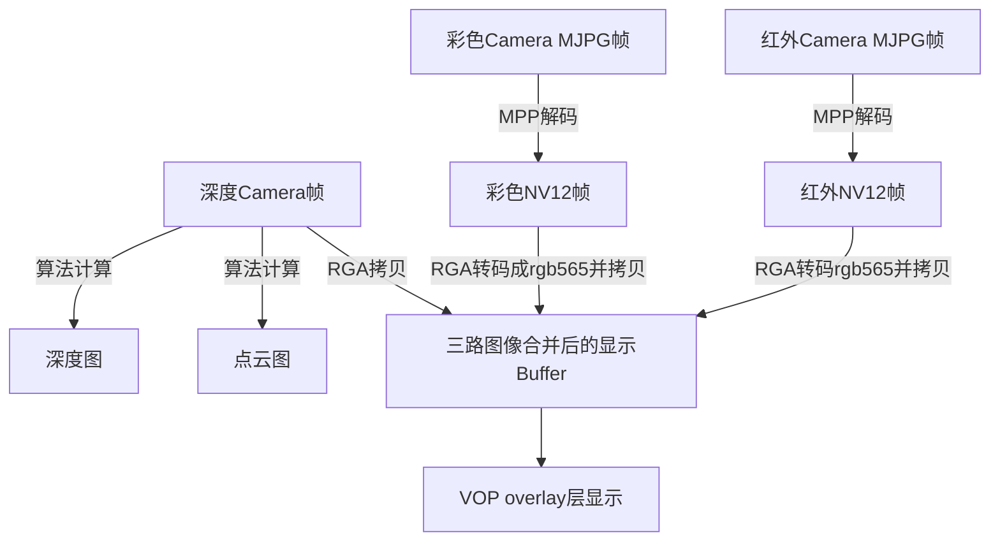

# Rockchip RMSL Linux 开发指南

文档标识：RK-KF-YF-355

发布版本：V1.0.1

日期：2020-12-14

文件密级：□绝密   □秘密   □内部资料   ■公开

**免责声明**

本文档按“现状”提供，瑞芯微电子股份有限公司（“本公司”，下同）不对本文档的任何陈述、信息和内容的准确性、可靠性、完整性、适销性、特定目的性和非侵权性提供任何明示或暗示的声明或保证。本文档仅作为使用指导的参考。

由于产品版本升级或其他原因，本文档将可能在未经任何通知的情况下，不定期进行更新或修改。

**商标声明**

“Rockchip”、“瑞芯微”、“瑞芯”均为本公司的注册商标，归本公司所有。

本文档可能提及的其他所有注册商标或商标，由其各自拥有者所有。

**版权所有 © 2020 瑞芯微电子股份有限公司**

超越合理使用范畴，非经本公司书面许可，任何单位和个人不得擅自摘抄、复制本文档内容的部分或全部，并不得以任何形式传播。

瑞芯微电子股份有限公司

Rockchip Electronics Co., Ltd.

地址：     福建省福州市铜盘路软件园A区18号

网址：     www.rock-chips.com

客户服务电话： +86-4007-700-590

客户服务传真： +86-591-83951833

客户服务邮箱： fae@rock-chips.com

---

**前言**

**概述**

Rockchip结构光模组RMSL(Rockchip Module Structured Light)是一款成熟的全功能的结构光 3D 相机。内置高达 3 万点的散斑投射器，500 万像素的 RGB 摄像头，100 万像素全局曝光的红外摄像头以及红外照明激光源。广泛适用于人脸支付，门禁安防，手势、肢体识别，高精度 3D 建模等产品应用。

本文主要介绍Rockchip结构光模组RMSL在Linux SDK下的使用方法及开发接口。

**读者对象**

本文档（本指南）主要适用于以下工程师：

技术支持工程师

软件开发工程师

**修订记录**

| **日期**   | **版本** | **作者**   | **修改说明**           |
| ---------- | -------- | ---------- | ---------------------- |
| 2020-04-09 | V1.0.0   | zhengsq    | 提交初始文档           |
| 2020-10-14 | V1.0.1   | Ruby Zhang | 更新公司名称及文档格式 |

---

**目录**

[TOC]

---

## RMSL模组接口简介

### 概述

Rockchip RMSL模组是USB即插即用设备，它可以同时有三路输出，即Depth, RGB, IR。其中Depth输出YUYV数据，RGB及IR输出MJPG数据。

| **Video** | **最大分辨率**   | **格式**  | **帧率** | **描述** |
| :-------- | :---------       | :-------: | :------: | :------- |
| Depth     | 640x480          | YUYV      | 15fps    | 输出视差图，可根据算法转换成深度图或点云图 |
| RGB       | 1920x1080        | MJPG      | 30fps    | 彩色视频输出，可解码为NV12格式 |
| IR        | 640x480          | MJPG      | 15fps    | 红外视频输出，可解码为NV12格式 |

### RMSL模组的型号

RK RMSL模组的型号可从SN码中获取，当前支持的RK结构光型号如下：

| **型号**        | **匹配的SN码**    | **接口** |
| :------:        | :------------:    | :------: |
| RMSL201-1301    | R2011301xxxxxxxxx | USB      |

### Buildroot中配置

在Buildroot Linux SDK中，开发接口及参考demo位于app/demo/rmsl目录下。默认SDK发布版本没有编译该程序，需要用户将Buildroot编译宏开关`BR2_PACKAGE_APP_DEMO_RMSL`使能后才可以编译。该程序依赖的如下应用包也需要使能。

- BR2_PACKAGE_CAMERA_ENGINE_RKISP，用于获取V4L2数据流
- BR2_PACKAGE_MPP，用于解码MJPG
- BR2_PACKAGE_LINUX_RGA，用于对YUV数据做处理，以便显示
- BR2_PACKAGE_LIBDRM，用于显示于屏幕上（可选）

注意：

- 若未发现该宏开关或无rmsl demo代码，请更新到最新SDK，或通过[github仓库](https://github.com/rockchip-linux/demo)获取。
- external/camera_engine_rkisp/需要更新到`86dc5bf1 apps: rkisp_api: add usb camera supports`。若SDK未更新到最新，可通过[github仓库](https://github.com/rockchip-linux/camera_engine_rkisp)获取。

### 编译和运行

在SDK目录下，通过如下命令进行模块编译，

```shell
# make app_demo
```

如需要重新编译，可通过命令：

```shell
# make app_demo-dirclean
# make app_demo
```

编译完成后会生成两个可执行文件rmsl_linux_demo及rmsl_tool。

```shell
# ls -1 /usr/bin/rmsl*
/usr/bin/rmsl_linux_demo
/usr/bin/rmsl_tool
```

因为依赖较多，建议用户按1.3小节配置完后，重编译整个Buildroot。

接上RMSL模组，可通过rmsl_tool获取设备信息。

**获取设备节点信息**

```shell
# rmsl_tool --list_devices
Device /dev/video6 info:
      usb interface: UVC DEPTH
        driver name: uvcvideo
          card type: RV1108
           bus_info: usb-ff340000.usb-1
Device /dev/video8 info:
      usb interface: UVC RGB
        driver name: uvcvideo
          card type: RV1108
           bus_info: usb-ff340000.usb-1
Device /dev/video10 info:
      usb interface: UVC IR
        driver name: uvcvideo
          card type: RV1108
           bus_info: usb-ff340000.usb-1
```

上例说明如下：

- 共有三个video设备节点/dev/video6, /dev/video8, /dev/video10，分别为DEPTH, RGB, IR设备
- 显示出其它信息如USB设备节点，驱动信息

**查询RMSL的SN码及软件版本**

```shell
# rmsl_tool --get_sn --get_version --device /dev/video6
SN: R2011301200801448
Version: 2.2.0
```

**在获取数据流前应首先初始化设备**

``` shell
# rmsl_tool --init --device /dev/video6
```

**在结束数据流之后应反初始化设备**

```shell
# rmsl_tool --deinit --device /dev/video6
```

**在结束数据流之后，也可以reset设备**

```shell
# rmsl_tool --reset --device /dev/video6
```

完成init之后，v4l2-ctl、vlc等开源工具是能够获取数据流的，需要注意数据流的格式及大小。

rmsl demo中提供的另外一个工具rmsl_linux_demo用于演示完整的init、获取数据流、解码、deinit、显示等功能。此时，**不必先用rmsl_tool 工具做初始化工作**。

**查看rmsl_linux_demo的使用帮助**

```shell
# rmsl_linux_demo --help
Usage of rmsl_linux_demo:
To display and/or save decode frames to files:
 --screen-width,   screen width,  required if need display
 --screen-height,  screen height, required if need display
 --no-display,     disable display, by default it's enabled
 --save-ir-to,     path to save IR    decoded frames in NV12
 --save-depth-to,  path to save DEPTH decoded frames with bpp = 16
 --save-rgb-to,    path to save RGB   decoded frames in NV12
```

如上所示，rmsl_linux_demo提供了获取数据流并保存成文件、显示在屏幕上的功能。默认情况下显示功能是打开的，如果不需要显示，使用--no-display参数禁用。

**将图像显示在屏幕上**

```shell
# rmsl_linux_demo --screen-width 1536 --screen-height 2048

UVC DEPTH: /dev/video5: draw in (0, 480)[640 x 480]
UVC RGB: /dev/video7: draw in (320, 0)[640 x 480]
UVC IR: /dev/video9: draw in (640, 480)[640 x 480]

```


上图显示了在RK3288屏幕上（1536x2048）的三个视频，从上到下、左到右，分别为RGB，DEPTH，IR。大小都是640x480。其中深度图是直接将视差图以RGB565格式显示出来。

**不显示图像，但将解码后的帧保存下来**

```shell
# rmsl_linux_demo --no-display \
                  --save-ir-to    /tmp/ir.bin  \
                  --save-rgb-to   /tmp/rgb.bin \
                  --save-depth-to /tmp/depth.bin
```

上例中禁用了显示功能，且将三路帧数据分别保存到文件中。其中，

- ir.bin，保存640x480 NV12帧数据
- rgb.bin，保存640x480 NV12帧数据
- depth.bin，保存640x480 深度数据，每个像素2个字节

以上三例中，数据流大小默认都是640 * 480，但RGB摄像头可以支持1080p的输出。抓取的文件若在PC机上可以用YUVPlayer(windows环境)或mplayer(Linux环境)查看。其中，mplayer使用可以参考如下命令。

```shell
# mplayer /tmp/ir.bin -loop 0 -demuxer rawvideo -fps 15 \
    -rawvideo w=640:h=480:size=$((640*480*3/2)):format=nv12

# mplayer /tmp/rgb.bin -loop 0 -demuxer rawvideo -fps 15 \
    -rawvideo w=640:h=480:size=$((640*480*3/2)):format=nv12

# mplayer /tmp/depth.bin -loop 0 -demuxer rawvideo -fps 15 \
    -rawvideo w=640:h=480:size=$((640*480*2)):format=rgb16
```

## demo代码简介

代码位于app/demo/rmsl/目录，包含了RMSL的设置、查询接口，获取数据流并解码、显示功能。

```shell
# tree app/demo/rmsl/
app/demo/rmsl/
├── CMakeLists.txt
├── main.c              # rmsl_linux_demo的主程序
├── rkdrm_display.c     # 用于overlay直接显示
├── rkdrm_display.h
├── rmsl_api.h          # rmsl 主要接口定义
├── rmsl_ctrl.c         # rmsl 控制、查询等方法的实现
├── rmsl_depth.c        # 深度图转换的实现
├── rmsl_tool.c         # rmsl_tool的主程序
├── vpu_decode.c        # vpu jpeg硬件解码接口
└── vpu_decode.h
```

### RMSL控制接口

**获取版本**

```c
int rmsl_get_version(int fd, char *ver, int size);
```

参数说明：

- fd，/dev/video节点对应的文件描述符
- ver，返回的版本号
- size，ver数组的大小，应不小RMSL_DATA_SIZE_QUERY

成功则返回0，其它值表示错误。

**获取SN号**

```c
int rmsl_get_sn(int fd, char *sn, int size);
```

参数说明：

- fd，/dev/video节点对应的文件描述符
- sn，返回的SN号
- size，sn数组的大小，应不小RMSL_DATA_SIZE_QUERY

成功则返回0，其它值表示错误。

**初始化/反初始化设备**

```c
int rmsl_init_device(int fd);
int rmsl_deinit_device(int fd);
```

初始化或反初始化设备，使得video节点能够输出数据。

参数说明：

- fd，/dev/video节点对应的文件描述符

成功则返回0，其它值表示错误。

**重置设备**

```c
int rmsl_reset_device(int fd);
```

参数说明：

- fd，/dev/video节点对应的文件描述符

成功则返回0，其它值表示错误。

**进入待机**

```c
int rmsl_suspend_device(int fd);
```

参数说明：

- fd，/dev/video节点对应的文件描述符

成功则返回0，其它值表示错误。

**获取各输出设备的节点名称**

```c
int rmsl_get_devices(char *dev_depth, char *dev_ir, char *dev_rgb, int silent);
```

获取三个视频设备的节点名称，如/dev/video6, /dev/video8等

参数说明：

- dev_depth，返回Depth设备的路径
- dev_ir，返回IR设备的路径
- dev_rgb，返回RGB设备的路径
- silent，1表示不输出log；0会打印一些log

成功则返回0，其它值表示错误。

**转换点云图及深度图**

```c
int rmsl_get_point_cloud_depth(const uint16_t *pIn, struct rmsl_pc *pc_out,
                               uint16_t *depth_out, int width, int height);
```

根据视差图转换点云图及深度图。

参数说明：

- pIn，Depth 设备输出的视差图帧数据，BPP为16
- pc_out，点云图输出结果。如果为NULL，不计算点云图
- depth_out，深度图输出结果。如果为NULL，不计算深度图
- width，图像的宽
- height，图像的高

返回值：

- 等于0表示成功计算
- 小于0表示错误
- 大于0表示模组原始的帧数据已经是深度图，不需要计算。（目前无此场景）

### 获取数据流

在rmsl_linux_demo中，使用到了rkisp_api.so获取数据流。与普通的USB Camera模组相比，要多一个初始化操作。

rkisp_api.so详细接口请参考《Rockchip_Developer_Guide_Linux_Camera_EN.pdf》。

### 解码

该demo中使用Rockchip MPP库解码MJPG。将从rkisp_api获取到的数据流交给MPP解码。MPP要求源数据拷贝一次，考虑到MJPG的每帧的数据量很小，性能上几无影响。解码后的Buffer由RGA分配，这里主要是因为后级需要有可能需要RGA拷贝以便显示。

主要接口：

```c
    ret = vpu_decode_jpeg_init(&ctx->decoder, ctx->width, ctx->height);
    while (has new frame)
        vpu_decode_jpeg_doing(&ctx->decoder, ctx->cur_frame->buf,
                ctx->cur_frame->size, ctx->rga_bo_fd, ctx->rga_bo.ptr);
    vpu_decode_jpeg_done(&ctx->decoder);
```

其中：

- decoder，vpu解码句柄
- rga_bo_fd，RGA buffer句柄
- rga_bo.ptr，RGA buffer的虚拟地址

### 显示

为尽可能高效地处理数据流并兼顾Rockchip不同芯片的特性，rmsl_linux_demo的显示直接使用了libdrm的接口，将三幅图像通过RGA拷贝到目标Buffer的具体偏移处，最后送到Rockchip VOP的overlay显示层。

主要流程如下图。



这里做了两个假设：

- 假设只有一个overlay层可用。因此使用RGA拷贝图像到目标Buffer的不同偏移中。例如px30/rk3326就只有一个overlay层
- 将视差图以RGB565显示。显示主要是示例，RGB565的BPP刚好也是16，显示出来只为看清物体的轮廓

虽然多了一步RGA转码及拷贝，但RGA硬件能快速地完成。该demo在px30、rk3288、rk3399平台上能以15fps显示。因为IR及Depth Camera只有15fps，故最多也只有15fps的帧率。性能上可以考虑如下的优化方式：

- 如果有多个overlay层可用，NV12格式可以直接用单独的层显示。共需要三个overlay层，两个用作彩色及红外NV12帧显示，另一个给深度图显示。这样可以省去RGA转码及/或拷贝部分。RGB Camera也可以达到30fps的帧率。
- 多线程化可提升并发性，特别是在需要处理点云图时，涉及到浮点运算

#### 与QT应用程序结合

用户如需要QT应用程序来实现如菜单、按键等UI组件，可预留出视频区域，并在需要视频显示时，以rmsl_linux_demo作为参考，将overlay层固定到预留区域中。

**需要注意的是，overlay层（视频）总是在UI之上，因此如有弹出对话框、菜单等与视频区域重叠，可将视频暂时隐去。**

以上仅是提供一种参考思路，请开发工程师自由发挥。

## 常见QA

### 打开Camera后设备断开

原因是供电不足导致，请使用外接电源的USB hub供电。
