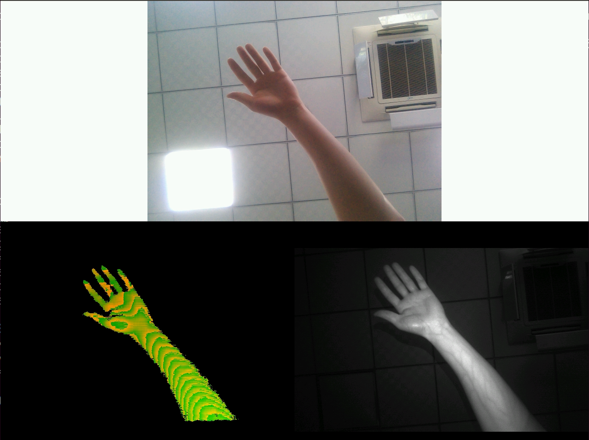
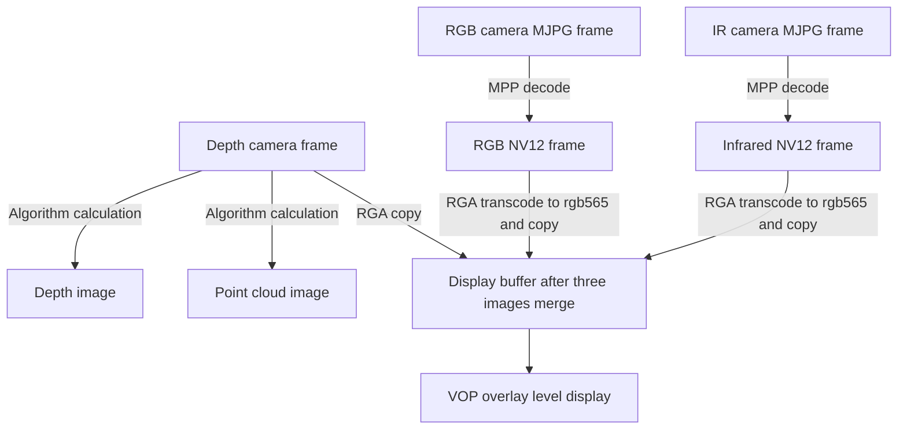

# Rockchip RMSL Linux Developer Guide

ID: RK-KF-YF-355

Release Version: V1.0.0

Release Date: 2020-04-09

Security Level: □Top-Secret   □Secret   □Internal   ■Public

---

**DISCLAIMER**

THIS DOCUMENT IS PROVIDED “AS IS”. FUZHOU ROCKCHIP ELECTRONICS CO., LTD.(“ROCKCHIP”)DOES NOT PROVIDE ANY WARRANTY OF ANY KIND, EXPRESSED, IMPLIED OR OTHERWISE, WITH RESPECT TO THE ACCURACY, RELIABILITY, COMPLETENESS,MERCHANTABILITY, FITNESS FOR ANY PARTICULAR PURPOSE OR NON-INFRINGEMENT OF ANY REPRESENTATION, INFORMATION AND CONTENT IN THIS DOCUMENT. THIS DOCUMENT IS FOR REFERENCE ONLY. THIS DOCUMENT MAY BE UPDATED OR CHANGED WITHOUT ANY NOTICE AT ANY TIME DUE TO THE UPGRADES OF THE PRODUCT OR ANY OTHER REASONS.

**Trademark Statement**

"Rockchip", "瑞芯微", "瑞芯" shall be Rockchip’s registered trademarks and owned by Rockchip. All the other trademarks or registered trademarks mentioned in this document shall be owned by their respective owners.

**All rights reserved. ©2020. Fuzhou Rockchip Electronics Co., Ltd.**

Beyond the scope of fair use, neither any entity nor individual shall extract, copy, or distribute this document in any form in whole or in part without the written approval of Rockchip.

Fuzhou Rockchip Electronics Co., Ltd.

No.18 Building, A District, No.89, software Boulevard Fuzhou, Fujian,PRC

Website:     [www.rock-chips.com](http://www.rock-chips.com)

Customer service Tel:  +86-4007-700-590

Customer service Fax:  +86-591-83951833

Customer service e-Mail:  [fae@rock-chips.com](mailto:fae@rock-chips.com)

---

**Preface**

**Overview**

Rockchip Module Structured Light (RMSL) is a feature-rich 3D camera module based on structured light technology. With integrated 30K speckles projector, 5M pixels RGB camera, 1M pixels global shutter IR camera and Infrared Illuminator. RMSL is applicable for payment, entrance guard, gesture recognition and high-precision 3D modeling.

This document mainly presents the usage and development interface of Rockchip structured light module RMSL under Linux SDK.

**Intended Audience**

This document (this guide) is mainly intended for:

Technical support engineers

Software development engineers

**Revision History**

| **Date**   | **Version** | **Author** | **Revision History** |
| ---------- | ----------- | ---------- | -------------------- |
| 2020-04-09 | V1.0.0      | zhengsq    | Initial version      |

## Contents

---
[TOC]
---

## 1. Introduction to RMSL Module Interface

### 1.1 Overview

Rockchip RMSL module is an USB plug and play device, there are three outputs at the same time: Depth, RGB and IR. Depth outputs YUYV data, RGB and IR output MJPG data.

| **Video** | **Max. Resolution** | **Format** | **Frame Rate** | **Description** |
| :-------- | :---------       | :-------: | :------: | :------- |
| Depth     | 640x480          | YUYV      | 15fps    | Output disparity image, which can be converted into depth image or point cloud image according to the algorithm |
| RGB       | 1920x1080        | MJPG      | 30fps    | Output RGB image, which can be decoded to NV12 format |
| IR        | 640x480          | MJPG      | 15fps    | Output Infrared image, which can be decoded to NV12 format |

### 1.2 RMSL Module

The model number of RK RMSL can be obtained from SN number. The currently supported RK structured light models are as follows:

|  **Model**   |  Matching SN No.  | **Interface** |
| :----------: | :---------------: | :-----------: |
| RMSL201-1301 | R2011301xxxxxxxxx |      USB      |

### 1.3 Configurations in Buildroot

In the Buildroot Linux SDK, the development interfaces and reference demos are located in the app/demo/rmsl directory. The default SDK release version will not build the program. You have to enable the Buildroot configuration BR2_PACKAGE_APP_DEMO_RMSL to enable building. The following application packages that this program depends on should be enabled too:

- BR2_PACKAGE_CAMERA_ENGINE_RKISP, used to get V4L2 data stream
- BR2_PACKAGE_MPP, used to decode MJPG
- BR2_PACKAGE_LINUX_RGA, used to process YUV data for display
- BR2_PACKAGE_LIBDRM, used to display on the screen (optional)

**Note：**

- If there is no macro switch or rmsl demo code, please update to the latest SDK or obtain it from the [github repository](https://github.com/rockchip-linux/demo).
- external/camera_engine_rkisp/ should be updated to `86dc5bf1 apps: rkisp_api: add usb camera supports`. If the SDK is not updated to the latest version, it can be obtained through the [github repository](https://github.com/rockchip-linux/camera_engine_rkisp).

### 1.4 Build and Run

Enter the SDK directory, build the modules with the following command:

```shell
# make app_demo
```

Please refer to the following command when need to rebuild:

```shell
# make app_demo-dirclean
# make app_demo
```

After finishing the building, two executable binaries rmsl_linux_demo and rmsl_tool will be generated.

```shell
# ls -1 /usr/bin/rmsl*
/usr/bin/rmsl_linux_demo
/usr/bin/rmsl_tool
```

Because of the large number of dependencies, it is recommended to make a clean build after section 1.3.

Connecting the RMSL module, the rmsl_tool can display the device information.

**Get node information of device**

```shell
# rmsl_tool --list_devices
Device /dev/video6 info:
      usb interface: UVC DEPTH
        driver name: uvcvideo
          card type: RV1108
           bus_info: usb-ff340000.usb-1
Device /dev/video8 info:
      usb interface: UVC RGB
        driver name: uvcvideo
          card type: RV1108
           bus_info: usb-ff340000.usb-1
Device /dev/video10 info:
      usb interface: UVC IR
        driver name: uvcvideo
          card type: RV1108
           bus_info: usb-ff340000.usb-1
```

**Note:**

- There are three video device nodes /dev/video6, /dev/video8, /dev/video10, they are DEPTH, RGB, IR devices respectively.

- It also displays other information such as USB device node, driver information

**Search the SN Number and software version of the RMSL:**

```shell
# rmsl_tool --get_sn --get_version --device /dev/video6
SN: R2011301200801448
Version: 2.2.0
```

**The device should be initialized before getting data stream:**

``` shell
# rmsl_tool --init --device /dev/video6
```

**The device should be de-initialized after ending the data flow:**

```shell
# rmsl_tool --deinit --device /dev/video6
```

**After ending the data flow, you can also reset the device**

```shell
# rmsl_tool --reset --device /dev/video6
```

Once the RMSL was initialized, some open source tools such as v4l2-ctl and vlc are able to get the data stream, but you have to pay attention to the format and size of the data stream.

Another tool rmsl_linux_demo provided in rmsl demo is used to demonstrate complete usage including init: get data stream, decode, deinit, display and other functions. Because the rmsl_linux_demo has initialized the RMSL properly, **it is not necessary to use the rmsl_tool to do the initialization first**.

**The usage help of rmsl_linux_demo:**

```shell
# rmsl_linux_demo --help
Usage of rmsl_linux_demo:
To display and/or save decode frames to files:
 --screen-width,   screen width,  required if need display
 --screen-height,  screen height, required if need display
 --no-display,     disable display, by default it's enabled
 --save-ir-to,     path to save IR    decoded frames in NV12
 --save-depth-to,  path to save DEPTH decoded frames with bpp = 16
 --save-rgb-to,    path to save RGB   decoded frames in NV12
```

As shown above, rmsl_linux_demo provides the function of getting data stream, saving it as a file, and displaying it on the screen. The display function is turned on by default, if you do not need display, use the --no-display parameter to disable.

**Display the image on the screen:**

```shell
# rmsl_linux_demo --screen-width 1536 --screen-height 2048

UVC DEPTH: /dev/video5: draw in (0, 480)[640 x 480]
UVC RGB: /dev/video7: draw in (320, 0)[640 x 480]
UVC IR: /dev/video9: draw in (640, 480)[640 x 480]

```



The pictures above show three images on RK3288 screen (1536x2048), from top to bottom and left to right, they are RGB, DEPTH, IR respectively. The size are all 640x480, in which the depth image displays the disparity image in RGB565 format directly.

**Don't display the image, but save the frame after decoding**

```shell
# rmsl_linux_demo --no-display \
                  --save-ir-to    /tmp/ir.bin  \
                  --save-rgb-to   /tmp/rgb.bin \
                  --save-depth-to /tmp/depth.bin
```

In the above example, the display function is disabled, and the three frame data are saved to files.

- ir.bin, save 640x480 NV12 frame data
- rgb.bin, save 640x480 NV12 frame data
- depth.bin, save 640x480 depth data, 2 bytes per pixel

In the above three examples, the data stream size is 640 * 480 by default, but the RGB camera can support 1080p output. YUVPlayer (windows environment) or mplayer (Linux environment) can be used to view the captured files when they are on a PC. and please refer to the following commands for mplayer usage.

```shell
# mplayer /tmp/ir.bin -loop 0 -demuxer rawvideo -fps 15 \
    -rawvideo w=640:h=480:size=$((640*480*3/2)):format=nv12

# mplayer /tmp/rgb.bin -loop 0 -demuxer rawvideo -fps 15 \
    -rawvideo w=640:h=480:size=$((640*480*3/2)):format=nv12

# mplayer /tmp/depth.bin -loop 0 -demuxer rawvideo -fps 15 \
    -rawvideo w=640:h=480:size=$((640*480*2)):format=rgb16
```

## 2 Demo Code Introduction

The source code is located in the app/demo/rmsl/ directory, which contains RMSL settings, querying interface, getting data stream and decoding and display functions.

```shell
# tree app/demo/rmsl/
app/demo/rmsl/
├── CMakeLists.txt
├── main.c              # main of rmsl_linux_demo
├── rkdrm_display.c     # use DRM to display directly on Overlay Plane of Rockchip devices
├── rkdrm_display.h
├── rmsl_api.h          # RMSL API Definition
├── rmsl_ctrl.c         # Implementation of rmsl control, query and other routines
├── rmsl_depth.c        # Implementation of depth image conversion
├── rmsl_tool.c         # The rmsl_tool source code
├── vpu_decode.c        # vpu jpeg hardware decoding interface
└── vpu_decode.h
```

### 2.1 RMSL Control Interface

**Get the version:**

```c
int rmsl_get_version(int fd, char *ver, int size);
```

Explanation of each parameter:

- fd, the file descriptor of the /dev/video node
- ver, the returned version number
- size, the size of the ver array, should not be less than RMSL_DATA_SIZE_QUERY

Return 0 on success, or error value if an error occurred.

**Get SN number:**

```c
int rmsl_get_sn(int fd, char *sn, int size);
```

Explanation of each parameter:

- fd, the file descriptor of the /dev/video node
- sn, the returned SN number
- size, the size of the sn array, should not be less than RMSL_DATA_SIZE_QUERY

Return 0 on success, or error value if an error occurred.

**Initialize/de-initialize the device:**

```c
int rmsl_init_device(int fd);
int rmsl_deinit_device(int fd);
```

Initialize or de-initialize the device so that the video node will output data.

Explanation of each parameter:

- fd, the file descriptor of the /dev/video node

Return 0 on success, or error value if an error occurred.

**Reset the device**

```c
int rmsl_reset_device(int fd);
```

Explanation of each parameter:

- fd, the file descriptor of the /dev/video node

Return 0 on success, or error value if an error occurred.

**Enter suspend mode:**

```c
int rmsl_suspend_device(int fd);
```

Explanation of each parameter:

- fd, the file descriptor of the /dev/video node

Return 0 on success, or error value if an error occurred.

**Get the file path of video devices:**

```c
int rmsl_get_devices(char *dev_depth, char *dev_ir, char *dev_rgb, int silent);
```

Get the file path of three video devices, such as /dev/video6, /dev/video8, etc.

Explanation of each parameter:

- dev_depth, return the path of the Depth device
- dev_ir, return the path of the IR device
- dev_rgb, return the path of the RGB device
- silent, 1 means no log output; 0 will print some logs

Return 0 on success, or error value if an error occurred.

**Convert Depth frame data to point cloud image and depth image:**

```c
int rmsl_get_point_cloud_depth(const uint16_t *pIn, struct rmsl_pc *pc_out,
                               uint16_t *depth_out, int width, int height);
```

Convert to point cloud image and depth image according to disparity image.

Explanation of each parameter:

- pIn, disparity image frame data from Depth device, and the BPP is 16
- pc_out, output point cloud image. If NULL, the point cloud image is not calculated
- depth_out, output depth image. If NULL, the depth  image is not calculated
- width, the width of the image
- height, the height of the image

Return values:

- 0 means successful calculation
- A negative means error
- A positive 0 means that the original frame data of the module is already a depth image and no calculation is required. (No such case currently)

### 2.2 Get Data Stream

The rkisp_api.so is used to get data stream in the rmsl_linux_demo. Compared with the common USB Camera module, one more initialization operation is required.

For more details about rkisp_api.so interface, please refer to "Rockchip_Developer_Guide_Linux_Camera_EN.pdf".

### 2.3 Decoding

The Rockchip MPP library is used to decode MJPG in this demo. Which will send the data stream got from rkisp_api to MPP for decoding. Because the decoded buffer may be resized/copied by RGA and then display on screen, this demo allocate buffer from RGA as decoded buffer.

Source code for decoding:

```c
    ret = vpu_decode_jpeg_init(&ctx->decoder, ctx->width, ctx->height);
    while (has new frame)
        vpu_decode_jpeg_doing(&ctx->decoder, ctx->cur_frame->buf,
                ctx->cur_frame->size, ctx->rga_bo_fd, ctx->rga_bo.ptr);
    vpu_decode_jpeg_done(&ctx->decoder);
```

Note:

- decoder, is vpu decoding handle
- rga_bo_fd, is RGA buffer handle
- rga_bo.ptr, is virtual address of RGA buffer

### 2.4 Display

In order to process the data stream as efficiently as possible and take the characteristics of different Rockchip chips into account, the display of rmsl_linux_demo directly uses the libdrm  interface, and the three images are copied to the specific offset of the target buffer through RGA, and finally sent to the overlay Plane of Rockchip VOP.

The main process is shown below.



There are two assumptions here:

- Suppose only one overlay layer is available. So use RGA to copy images to different offsets of the target buffer. For example, there is only one overlay layer in px30/rk3326
- Display the disparity image as RGB565 which is just for demonstration, the BPP of Depth happens to be 16 as RGB565 is. The outline of the Depth frame is quite clear if display in RGB565 format.

Although there is an additional step of RGA transcoding and copying, the RGA hardware acceleration make it efficiently. The demo can be displayed at 15fps on px30, rk3288, and rk3399 platforms. Because IR and Depth Camera are only 15fps, the maximum frame rate is only 15fps. The following methods can be considered to optimize performance:

- If multiple overlay layers are available, NV12 format can be displayed in a separate plane directly. A total of three overlay layers are required, two for RGB and infrared NV12 frame display, and the other for depth image display. In this way, RGA transcoding and/or copying steps can be skipped. RGB Camera can also reach a frame rate of 30fps.
- Multithreading can improve concurrency, especially when needing to process point cloud images, which involving floating-point operations.

#### 2.4.1 Integration with QT application

If you need QT applications to draw UI components such as menus and buttons, a video area can be reserved on main UI for video overlay plane.

**It should be noted that the overlay layer (video) is always above UI, so if there is a pop-up dialog, menu, etc. that overlaps with the video area, we can hide the video overlay plane temporarily.**

The above is just to provide a kind of idea, please make your own design as need.

## 3 FAQs

### 3.1 Device Disconnected after Opening Camera

The reason is that the power supply is insufficient. Please connect to the USB hub of an external power supply.
