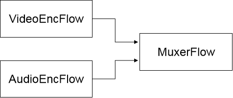
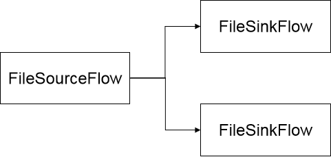

# Rockchip Rkmedia Instructions

文件标识：RK-SM-YF-365

发布版本：V0.0.1

日期：2020-06-08

文件密级：□绝密   □秘密   □内部资料   ■公开

**免责声明**

本文档按“现状”提供，瑞芯微电子股份有限公司（“本公司”，下同）不对本文档的任何陈述、信息和内容的准确性、可靠性、完整性、适销性、特定目的性和非侵权性提供任何明示或暗示的声明或保证。本文档仅作为使用指导的参考。

由于产品版本升级或其他原因，本文档将可能在未经任何通知的情况下，不定期进行更新或修改。

**商标声明**

“Rockchip”、“瑞芯微”、“瑞芯”均为本公司的注册商标，归本公司所有。

本文档可能提及的其他所有注册商标或商标，由其各自拥有者所有。

**版权所有** **© 2020** **瑞芯微电子股份有限公司**

超越合理使用范畴，非经本公司书面许可，任何单位和个人不得擅自摘抄、复制本文档内容的部分或全部，并不得以任何形式传播。

瑞芯微电子股份有限公司

Rockchip Electronics Co., Ltd.

地址：     福建省福州市铜盘路软件园A区18号

网址：     www.rock-chips.com

客户服务电话： +86-4007-700-590

客户服务传真： +86-591-83951833

客户服务邮箱： fae@rock-chips.com

---

## **前言**

**概述**

本文主要描述了rkmedia应用各个模块的使用说明。

**产品版本**

| **芯片名称** | **内核版本** |
| ------------ | ------------ |
| RV1109       | Linux 4.19   |
| RV1126       | Linux 4.19   |
| RK1808       | Linux 4.4    |
| RK1806       | Linux 4.4    |

**读者对象**

本文档（本指南）主要适用于以下工程师：

​        技术支持工程师

​        软件开发工程师

**修订记录**

| **日期**   | **版本** | **作者** | **修改说明** |
| ---------- | -------- | :------- | ------------ |
| 2020-06-08 | V0.0.1   | 范立创   | 初始版本     |

---

## **目录**

[TOC]

---

## **1 简介**

rkmedia是RockChip Linux平台的多媒体库，封装了底层媒体模块接口，提供常用多媒体解决方案。

目前包含了视频硬件编解码接口，媒体格式封装解封装接口，音频软件编解码接口，音频采集输出播放接口，摄像头采集接口等。

## **2 视频硬件编码**

**范例：mpp_enc_test.cc**

使用命令查看使用方法：./rkmpp_enc_test -? （可能默认生成的固件里没有此可执行bin，需要到pc上生成的路径手动push到板端）。

**接口及范例流程说明**

- easymedia::REFLECTOR(Encoder)::DumpFactories()：列出当前编入的编码模块(可不调用)

- easymedia::REFLECTOR(Encoder)::Create\<easymedia::VideoEncoder\> ：创建视频编码器实例，参数为上述的DumpFactories中列出的一个模块对应的字符串，以及对应的输出数据类型

- InitConfig：初始化编码器，参数为所需编码算法对应的设置系数

- GetExtraData：获取参数信息数据，h264的pps和sps数据在此返回的buffer里

- Process：执行编码，参数为原始未压缩图像数据buffer、压缩图像输出的buffer以及额外的输出buffer（如需要h264中的mv数据，在此buffer输出）

>注意：调用此函数前，需要给所有buffer SetValidSize表明buffer可访问的长度空间。最后输出buffer的数据长度以GetValidSize体现。

## **3 视频硬件解码**

**范例：mpp_dec_test.cc**

使用命令查看使用方法：./rkmpp_dec_test -? （可能默认生成的固件里没有此可执行bin，需要到pc上生成的路径手动push到板端）。

**接口及范例流程说明**

- easymedia::REFLECTOR(Decoder)::DumpFactories()：列出当前编入的解码模块(可不调用)

- easymedia::REFLECTOR(Decoder)::Create\<easymedia::VideoDecoder\> ：创建视频编码器实例，参数为上述的DumpFactories中列出的一个模块对应的字符串，以及其他一些设置参数，具体参考mpp_dec_test.cc里的注解

- SendInput：将压缩图像数据送给解码器，同样需要SetValidSize表明数据长度。函数返回值如果返回-EAGAIN，表示此帧数据未被解码器接受，需要等会重新尝试输入。最后一帧后，需要送入一个EOF的空buffer给解码器。

- FetchOutput：与SendInput配套使用，从解码器中取出已解码的raw格式数据。函数错误以errno的值体现。

- Process：同步解码，目前仅jpeg解码支持，参数为压缩图像数据buffer、raw格式数据输出的imagebuffer（必须分配空间）

>注意：调用此函数前，需要给所有buffer SetValidSize表明buffer可访问的长度空间。最后输出buffer的数据长度以GetValidSize体现。

---

## **4 媒体格式解封装**

>注意：当前仅支持ogg，其他格式待扩展

**范例：ogg_decode_test.cc**

使用命令查看使用方法：./ogg_decode_test -? （可能默认生成的固件里没有此可执行bin，需要到pc上生成的路径手动push到板端）。

**接口及范例流程说明**

- easymedia::REFLECTOR(Demuxer)::DumpFactories()：列出当前编入的格式解封装模块(可不调用)

- easymedia::REFLECTOR(Demuxer)::Create\<easymedia::Demuxer\>：创建格式解封装实例，参数为上述的DumpFactories中列出的一个模块对应的字符串和其他一些设置项

- Init(Stream *input, MediaConfig *out_cfg)：设置输入流和获取音频参数

- Read：读取一次数据

## **5 音频播放输出**

**范例：ogg_decode_test.cc**

复用[媒体格式解封装范例](#8 媒体格式封装)一样的范例
使用命令：./ogg_decode_test -i test.ogg -o alsa:default

**接口及范例流程说明**

- easymedia::REFLECTOR(Stream)::DumpFactories()：列出当前编入输入输出模块，stream的操作方法参数与c的FILE类似(可不调用)

- easymedia::REFLECTOR(Stream)::Create\<easymedia::Stream\>：创建音频播放输出流实例，参数为字符串"alsa_playback_stream"和设置打开设备的参数。

- Write：写入一次数据，参数为buffer对应的frame size和frame numbers

- Close：关闭输出流

## **6 音频输入采集**

**范例：ogg_encode_test.cc**

复用[媒体格式封装范例](#7 音频编码)一样的范例
使用命令：./ogg_encode_test -f s16le -c 2 -r 48000 -i alsa:default -o output_s16le_c2_r48k.pcm

**接口及范例流程说明**

- easymedia::REFLECTOR(Stream)::DumpFactories()：列出当前编入输入输出模块，stream的操作方法参数与c的FILE类似(可不调用)

- easymedia::REFLECTOR(Stream)::Create\<easymedia::Stream\>：创建音频播放采集流实例，参数为字符串"alsa_capture_stream"和设置打开设备的参数。

- Read：读入一次数据，参数为buffer以及其对应的frame size和frame numbers

- Close：关闭采集流

## **7 音频编码**

**范例：ogg_encode_test.cc**

使用命令查看使用方法：./ogg_encode_test -? （可能默认生成的固件里没有此可执行bin，需要到pc上生成的路径手动push到板端）。

**接口及范例流程说明**

- easymedia::REFLECTOR(Encoder)::DumpFactories()：列出当前编入的编码器模块(可不调用)

- easymedia::REFLECTOR(Encoder)::Create\<easymedia::AudioEncoder\>：创建音频编码器实例，参数为上述的DumpFactories中列出的一个模块对应的字符串，比如范例中的libvorbisenc

- InitConfig：初始化编码器，参数为所需编码算法对应的设置系数

- Process：如果该函数返回负值且errno==ENOSYS，则表示此编码器不支持该接口，需要调用下面的SendInput和FetchOutput接口

- SendInput：传入裸数据SampleBuffer，如果nb_samples为0，则表示告知编码器传入数据结束

- FetchOutput：获取编码后的数据，由于有些编码器，比如libvorbisenc，输入一次，会输出多帧，所以这里需要while循环获取直到无数据

## **8 媒体格式封装**

**范例：ogg_encode_test.cc ffmpeg_enc_mux_test.cc**

使用命令查看使用方法：./ogg_encode_test -? / ./ffmpeg_enc_mux_test -?（可能默认生成的固件里没有此可执行bin，需要到pc上生成的路径手动push到板端）。

**接口及范例流程说明**

- easymedia::REFLECTOR(Muxer)::DumpFactories()：列出当前编入的格式封装模块(可不调用)

- easymedia::REFLECTOR(Muxer)::Create\<easymedia::Muxer\>：创建格式封装实例，参数为上述的DumpFactories中列出的一个模块对应的字符串，比如范例中的liboggmuxer

- IncludeEncoder()：判断是否此解封装模块已包含了编码功能。如果没有，需要按章节[音频编码](#7 音频编码)所述创建编码器实例先做编码再传入做封装

- NewMuxerStream：创建一路数据流，返回数据流对应序号于参数stream_no

- SetIoStream：托管封装后数据写入的io stream。如果调用了该函数，则封装后立刻调用此iostream的Write方法写入数据；否则需要外部程序自行处理输出的封装数据。ffmpeg因为其内部的读写逻辑，不支持此函数

- WriteHeader：获取封装格式头信息数据

- Write：传入编码后的数据和对应数据流的序号，输出封装数据

## **9 rtsp服务端（基于live555）**

**范例：rtsp_server_test.cc**

拷贝对应的h264单帧数据[h264_frames]到板端文件夹备用。
使用命令查看使用方法：./rtsp_server_test -? （可能默认生成的固件里没有此可执行bin，需要到pc上生成的路径手动push到板端）。
在pc端播放验证时，需要先验证网络可靠性，规避网络丢包导致卡顿问题。

**范例流程说明**

以开启SIMPLE宏为例说明，此为纯粹的RTSP服务端功能范例。

- split_h264_separate：分割多个slice为单独的slice，因为live555一次只接受一个slice。如范例中，sps和pps在一起，需要调用此函数进行分割

- SetUserFlag/SetValidSize/SetTimeStamp（MediaBuff接口）：设置Buffer属性，在送往Rtsp Flow之前，MediaBuff必须设置这三个属性。其中SetUserFlag用于标记当前Buffer是否是I帧等。

- easymedia::REFLECTOR(Flow)::Create\<easymedia::Flow\>("live555_rtsp_server", param.c_str())：创建rtsp server，参数必须包括KEY_INPUTDATATYPE/KEY_CHANNEL_NAME，KEY_PORT_NUM（端口号）还有KEY_USERNAME/KEY_USERPASSWORD（用户名和密码）非必须。

- rtsp_flow->SendInput(buf, 0)：送数据给rtsp服务端，第二个参数0，表示送入rtsp服务端数据链0入口，之后rtsp服务端内部会从0入口获取数据。

> 注意：RTSP Flow入口个数是根据实际使用场景变化的。如果构建的RTSP包含音频和视频，那么RTSP Flow将会有两个入口。创建RTSP Flow时，音频参数在视频参数之前，那么0入口将对应音频，1入口将对应视频；反之，则0入口对应视频，1入口对应音频。

## **10 摄像头输入采集**

> 仅支持V4L2

**范例：camera_capture_test.cc**

使用命令查看使用方法：./camera_cap_test -?

**接口及范例流程说明**

- easymedia::REFLECTOR(Stream)::DumpFactories()：列出当前编入的输入输出模块(可不调用)

- easymedia::REFLECTOR(Stream)::Create\<easymedia::Stream\>：创建摄像头采集流实例，参数为字符串"v4l2_capture_stream"和设置打开设备的参数。参数参考范例。

- Read：读入一次数据，参数为空，返回MediaBuffer

## **11 2D图像处理**

**范例：rga_filter_flow_test.cc**

使用命令查看使用方法：./rga_filter_flow_test -?

**接口及范例流程说明**

- easymedia::REFLECTOR(Filter)::Create\<easymedia::Filter\>：创建rga实例，参数为字符串"rkrga"和设置图像的参数。参数参考范例。

- SetRects：设置原始和目标矩形信息。

- Process：将输入图像根据配置转换成目标图像。

- rga_blit：将输入图像根据配置转换成目标图像。该接口可独立Filter使用。

## **12 媒体管道构建**

### **Flow介绍**

Flow是作为上述功能模块的再次封装，便于实现模块间的数据通信。比如有如下业务场景：

v4l2 capture video --> rga --> display

如果使用Flow，则应用代码将类似如下形式(伪代码)：

```c++
// 创建v4l2_capture_stream flow
std::string v4l2_params = "name=v4l2_capture_stream ....";
auto v4l2_flow = easymedia::REFLECTOR(Flow)::Create<easymedia::Flow>("source_stream", flow_param.c_str());
// 创建 rga flow
std::string rga_params = "name=rkrga ....";
auto rga_flow = easymedia::REFLECTOR(Flow)::Create<easymedia::Flow>("filter", flow_param.c_str());
// 创建 display flow
std::string rga_params = "name=drm_output_stream ....";
auto display_flow = easymedia::REFLECTOR(Flow)::Create<easymedia::Flow>("output_stream", flow_param.c_str());
// 数据连接
rga_flow->AddDownFlow(display_flow, 0, 0);
v4l2_flow->AddDownFlow(rga_flow, 0, 0);
```

### **Flow 类型**

Flow可以分为Source类型、IO类型、Sink类型。

- Source类型：作为数据源，获取数据（读文件/V4L2节点等）封装为MediaBuff，然后送给下级Flow。不存在上级Flow。如：file_read_flow、source_stream等。

- IO类型：对输入的MediaBuff进行处理，然后输出给下级Flow。支持多个入口和多个出口。如：file_write_flow、output_stream

- Sink类型：作为数据通路的最后一级Flow，此类型Flow无下级Flow。

### **Flow连接管理**

#### **Flow连接**

Flow使用如下接口将多个Flow串联成一个数据管道（Pipeline）。

```c++
bool AddDownFlow(std::shared_ptr<Flow> down, int out_slot_index,
int in_slot_index_of_down);
```

参数说明：

​	down：下级Flow指针

​	out_slot_index：当前Flow输出接口ID，比如Flow有两个入口，那么ID分别为0,1

​	in_slot_index_of_down：下级Flow出入接口ID，比如Flow有3个入口，那么ID分别为0,1,2

函数说明：

​	该接口建立Flow之间的出口与入口绑定关系，通过out_slot_index指定当前Flow选择哪个出口，通过in_slot_index_of_down选择下级Flow的哪个入口，然后将二者连接起来。连接后数据将按照既定连接传递数据。

连接模式：

- 一对一模式

一对一模式指的是Flow的数据出口与入口一一绑定。有的flow支持一个入口/出口，也有flow支持多个入口/出口，但上下级Flow之间的出/入口之间是一一绑定的。比如：

例1：FileSourceFlow -> FileSinkFlow

```c++
// 将file_src_flow的0出口绑定到file_sink_flow的0入口
file_src_flow->AddDownFlow(file_sink_flow, 0, 0);
```


例2：VideoEncoderFlow -> MuxerFlow; AudioEncoderFlow -> MuxerFlow

```c++
// 将video_enc_flow的0出口绑定到muxer_flwo的0入口
// MuxerFlow的0入口为视频码流输入口。
video_enc_flow->AddDownFlow(muxer_flwo, 0, 0);
// 将audio_enc_flow的0出口绑定到muxer_flwo的1入口
// MuxerFlow的1入口为音频码流输入口。
video_enc_flow->AddDownFlow(muxer_flwo, 0, 1);
```



- 一对多模式

一对多模式指的是Flow的数据出入口存在一个出口绑定多个入口。这与Flow本身有几个出/入口无关。比如：

例3：一个FileSourceFlow接两个FileSinkFlow

```c++
// 将file_src_flow的0出口绑定到file_sink_flow0的0入口
file_src_flow->AddDownFlow(file_sink_flow0, 0, 0);
// 将file_src_flow的0出口绑定到file_sink_flow1的0入口
file_src_flow->AddDownFlow(file_sink_flow1, 0, 0);
```



注：这种模式下，FileSourceFlow仅发送一个MediaBuff给下级Flow，下级的两个FileSinkFlow拿到的是同一个MediaBuff，MediaBuff的引用加一。上图使用场景，下级Flow生成了两个相同的上级Flow的副本。

#### **Flow断开连接**

Flow调用如下接口断开连接

```c++
void RemoveDownFlow(std::shared_ptr<Flow> down);
```

参数说明：

down：下级Flow的指针。

注：Flow连接时，为避免丢失数据，最好是最后连接数据源Flow；Flow断开连接时，最好优先断开数据源头Flow。比如FileSourceFlow -> VideoEncFLow -> FileSinkFlow

连接：

```c++
VideoEncFLow->AddDownFlow(FileSinkFlow, 0, 0);
// 最后连接数据源头
FileSourceFlow ->AddDownFlow(VideoEncFLow, 0, 0);
```

断开：

```c++
// 优先断开数据源头
FileSourceFlow->RemoveDownFlow(VideoEncFLow);
VideoEncFLow->RemoveDownFlow(FileSinkFlow);
```

### **Flow传输模式**

Flow的模式决定了Flow数据传递是否启用线程。支持如下传输模式：

- 同步模式（SYNC）

Flow内部不会创建线程，上级Flow递交数据给当前Flow时，会等待当前Flow处理完毕后才返回。

- 异步模式（ASYNCCOMMON）

Flow内部会创建线程，上级Flow递交的数据直接放当前Flow的输入缓冲区就立即返回。当前Flow创建的线程将从输入缓冲区获取数据，处理后在发给下级Flow。

- 固定时长异步模式（ASYNCATOMIC）

与“异步模式”类似，但是输入缓冲区只有一个，当前Flow内部的线程会固定时间间隔从输入缓冲区取数据。

多数Flow的传输模式是固定的，少数Flow可通过创建Flow时，指定KEK_THREAD_SYNC_MODEL来选择，比如创建Flow的字符串中加入：

```c++
“KEK_THREAD_SYNC_MODEL=asynccommon”
```

### **Flow枚举**

**audio_enc**

- 功能：音频编码器封装，支持vorbis/aac/mp2/g711a/g711u/g726

- 源码：audio_encoder_flow.cc

- 范例：audio_encoder_flow_test.cc

- 类型：IO 类型，1入1出

**file_read_flow**

- 功能：读本地文件

- 源码：file_flow.cc

- 范例：video_encoder_flow_test.cc

- 类型：Source类型，0入1出。

**file_write_flow**

- 功能：写本地文件。

- 源码：file_flow.cc

- 范例：video_encoder_flow_test.cc

- 类型：Sink类型，1入0出

**filter**

- 功能：一种IO类型的Flow，对输入数据处理后发送给后级的Flow，支持rga/rknn等

- 源码：filter_flow.cc

- 范例：rga_filter_flow_test.cc

- 类型：IO类型，支持多入多出（根据实际使用场景来定）

**live555_rtsp_server**

- 功能：基于live555构建的rtsp服务器

- 源码：rtsp_server.cc

- 范例：rtsp_multi_server_test.cc

- 类型：Sink类型，1入0出

**move_detec**

- 功能：对输入图像做运动侦测，并抛送运动区域信息。

- 源码：move_detection_flow.cc

- 范例：move_detection_flow_test.cc

- 类型：Sink类型，1入0出

**muxer_flow**

- 功能：媒体封装，支持MP4/AVI/MPEG-PS/MPEG-TS/FLV/MKV

- 源码：muxer_flow.cc

- 范例：muxer_flow_test.cc

- 类型：IO类型，2入1出

**output_stream**

- 功能：封装所有输出源，比如drm_output_stream、alsa_playback_stream等

- 源码：output_stream_flow.cc

- 范例：drm_display_test.cc

- 类型：Sink类型，1入0出。

**source_stream**

- 功能：封装所有数据发生源，比如alsa_capture_stream、v4l2_capture_stream等

- 源码：source_stream_flow.cc

- 范例：audio_loop_test.cc

- 类型：Source类型，0入1出

**video_dec**

- 功能：视频解码，支持H265/H264/JPEG

- 源码：decoder_flow.cc

- 范例：video_decoder_flow_test.cc

- 类型：IO类型，1入1出

**video_enc**

- 功能：视频编码，支持H265/H264/JPEG

- 源码：video_encoder_flow.cc

- 范例：video_encoder_flow_test.cc

- 类型：IO类型，1入1出
