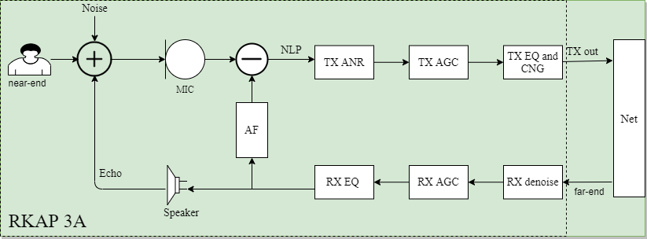
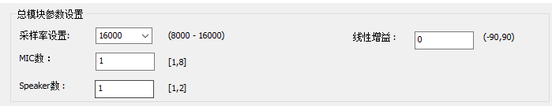
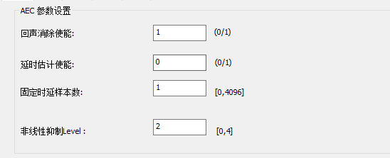
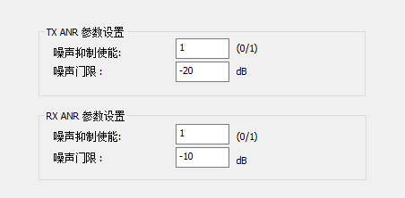
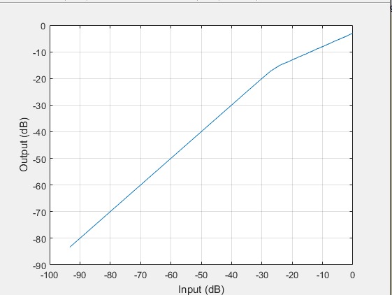
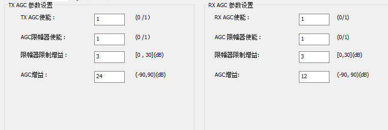
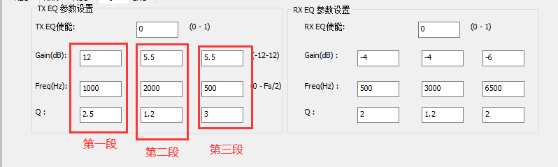

# Rockchip语音通话3A算法集成说明

文件标识：RK-SM-YF-391

发布版本：V1.0.0

日期：2020-12-10

文件密级：□绝密   □秘密   □内部资料   ■公开

**免责声明**

本文档按“现状”提供，瑞芯微电子股份有限公司（“本公司”，下同）不对本文档的任何陈述、信息和内容的准确性、可靠性、完整性、适销性、特定目的性和非侵权性提供任何明示或暗示的声明或保证。本文档仅作为使用指导的参考。

由于产品版本升级或其他原因，本文档将可能在未经任何通知的情况下，不定期进行更新或修改。

**商标声明**

“Rockchip”、“瑞芯微”、“瑞芯”均为本公司的注册商标，归本公司所有。

本文档可能提及的其他所有注册商标或商标，由其各自拥有者所有。

**版权所有 © 2020 瑞芯微电子股份有限公司**

超越合理使用范畴，非经本公司书面许可，任何单位和个人不得擅自摘抄、复制本文档内容的部分或全部，并不得以任何形式传播。

瑞芯微电子股份有限公司

Rockchip Electronics Co., Ltd.

地址：     福建省福州市铜盘路软件园A区18号

网址：     [www.rock-chips.com](http://www.rock-chips.com)

客户服务电话： +86-4007-700-590

客户服务传真： +86-591-83951833

客户服务邮箱： [fae@rock-chips.com](mailto:fae@rock-chips.com)

---

**前言**

**概述**

Rockchip Audio Processor（以下简称RKAP）是Rockchip一套音频处理算法。本文档主要介绍语音通话3A算法的处理流程和相关参数配置。

**产品版本**

| **名称** | **版本** |
| ------------ | ------------ |
| 通话3A算法 | RKAP_3A_V1.0.0 |

**读者对象**

本文档（本指南）主要适用于以下工程师：

技术支持工程师

软件开发工程师

**修订记录**

| **版本号** | **作者** | **修改日期** | **修改说明** |
| ---------- | --------| :--------- | ------------ |
| V1.0.0 | Cherry.Chen | 2020-12-09 | 初始版本     |

---

**目录**

[TOC]

---

## 简介

扬声器的声音多次反馈到麦克风引起的一段时间后人耳听到延迟的原音称作回声。回声的产生框图以及3A算法基本工作原理如下图。

### 原理简要



在上图中，TX表示发送端，即从近端（near-end）发送数据给远端（far-end）；RX表示接收，即从远端接收信号到近端。在扬声器播放的情况下，扬声器播放的远端声音通过空气传播到近端的麦克风中去，如果不对其进行回声消除（Acoustic Echo Cancellation，AEC），远端在听到近端声音的同时也能够听到自己刚刚的说话声，更恶劣的情况是，在远端也使用免持设备的时候，两端声音互相激励，容易产生啸叫。因此需要通过AEC算法，将回声进行衰减，AEC算法主要包括两个部分：AF（Adaptive Filter）和NLP（Nonlinear Process ）， 其中AF表示自适应滤波器，通过模拟回声路径，计算近端信号中回声的成分；NLP表示非线性处理，经过AF处理之后，近端信号中还有残留回声，需要通过NLP算法对其进行抑制。从图中可以看出，麦克风采集到的信号，除了近端说话声音以及回声之外，还有环境噪声，因此还需要进行语音降噪（Audio Noise Reduce， ANR）去除环境噪声；在近端麦克风采集的信号中，消除回声和噪声之后，保留的有用声音增益较低，因此引入自动增益控制算法(Audio Gain Control, AGC)对有用信号进行增益；最后，使用EQ（Equalizer）和CNG（Comfort Noise Generation）增加声音的舒适度，发送到远端。

### 测试说明

从1.1节的描述中，可以知道，在双端通话的时候，有以下三种情况：

- **近端说话，远端不说话**

  ​        在这种情况下，系统处于近端单讲状态，远端没有说话（近端扬声器没有声音），那么也就不存在回声，此时实际相当于麦克风采集到的只有近端声音和噪声，相当于自适应滤波器不工作。

- **近端不说话，远端说话**

  ​       在这种情况下，系统处于远端单讲状态，远端声音通过近端扬声器播放，再被麦克风采集回去（麦克风输入包含回声和噪声），该状态下自适应滤波器在一定时间的收敛之后达到稳定状态。

- **近端和远端同时说话**

  ​      在这种情况下，系统处于双讲状态，该状态下自适应滤波器容易发散，导致回声消除力度减小。

  因此，在测试回声消除效果的时候，需要以上三个情况同时测试。

### 指标

#### 客观指标

ITU G.168中提到，回声损耗（Echo Return Loss，ERL）：从回声抵消器的接收口至发送口信号的衰减。指在回声通道中（近端）的损耗，即远端出来的声音经过回声路径再到麦克输入的衰减。

回声损耗增强（Echo Return Loss Enhancement，ERLE）：当回声信号通过回声抵消器的发送通道传送时的衰减。

使用ERLE来衡量回声消除的效果，可以看作是在一段时间内实现回声衰减的平均值。ERLE值越大，说明效果越好，并且可以从时间上记录该值来统计收敛时间：
$$
\text{ERLE}(m) =10\log10 \frac{\sum_{j=1}^qd^2[(m-1)q+j]}{\sum_{j=1}^qe^2[(m-1)q+j]}
$$
其中，$d(n)$为近端信号，$e(n)$为误差信号，即为输出信号。

#### 主观指标

ITU-TP.800和P.830定义MOS分(Mean Opinion Score)的主观测试方法：由不同的人分别对原始语料和经过系统处理之后的语料进行主观感觉对比，分别打出MOS分，最后求平均值，这是一种纯主观的定性测量。ITU选取在很宽的听觉范围内，不同的年龄、性别和语言组别的相同得分，作出语音质量的评价标准。

| MOS分   | 主观意见          | 听觉感受                                             |
| ------- | ----------------- | ---------------------------------------------------- |
| 4-5分   | 优秀（excellent） | 很好，听的清楚，延迟小，<br />交流流畅               |
| 3-4分   | 良好（good）      | 稍差，听的清楚，延迟小，<br />交流欠缺顺畅，有点杂音 |
| 2-3分   | 一般（fair）      | 还可以，听不太清，延迟较大，<br />交流重复多次       |
| 1-2分   | 差（poor）        | 勉强，听不太清，延迟较大，<br />交流重复多次         |
| 1分以下 | 很差（bad）       | 极差，听不懂，延迟大，<br />交流不通畅               |

---

## API集成说明

### RKAP_3A_Init()

| 函数原型     | RKAP_Handle RKAP_3A_Init(RKAP_AEC_State *st,<br />                                            RKAP_AEC_TRANS_ENUM transType); |
| ------------ | ------------------------------------------------------------ |
| 输入参数     | st结构体输入一些基本参数；<br />transType 为TX或者RX表示当前处理流程 |
| 返回值       | TX或者RX处理过程的句柄                                       |
| 函数功能说明 | 对3A算法进行初始化                                           |

**说明**: 结构体RKAP_AEC_State各参数的取值范围如下：

```c
typedef struct RKAP_AEC_State_S
{
    /* Basic info */
    int swSampleRate;     /*表示采样率，只支持8k或者16k；*/
    int swFrameLen;     /* 表示帧长，只支持16ms或者20ms */
    const char *pathPara; /* 导入参数bin文件的路径 */
} RKAP_AEC_State;
```

### RKAP_3A_Destroy()

| 函数原型 | void RKAP_3A_Destroy(RKAP_Handle handle); |
| -------- | ------------------------------------- |
| 输入参数 | 句柄                                  |
| 返回值   | 无                                    |
| 功能说明 | 反初始化                              |

### RKAP_3A_Process()

| 函数原型 | int RKAP_3A_Process(RKAP_Handle handle, short *pfSigIn,<br/>                                short *pfSigRef, short *pfSigOut); |
| -------- | ------------------------------------------------------------ |
| 输入参数 | handle表示初始化的TX或者RX句柄; <br />pfSigIn表示近端信号；<br />pfSigRef表示远端信号，也叫参考信号；<br />pfSigOut表示输出信号 |
| 返回值   | 0表示正确返回，其余表示错误返回                              |
| 功能说明 | 3A算法处理<br />注意:一般TX和RX是共存的，因此需要分别初始化并处理 |

### RKAP_3A_DumpVersion()

| 函数原型 | void RKAP_3A_DumpVersion(void); |
| -------- | --------------------------- |
| 输入参数 | 无                          |
| 返回值   | 无                          |
| 功能说明 | 打印当前使用算法库版本号    |

---

## 参数说明

以下带TX标识的表示TX流程调参，RX同理。涉及到的调参模块比较多，因此使用Windows工具RKAP_3A_Para_Tool对相关参数进行保存。

### 基本参数

| 参数名称    | Index | 取值范围    | 描述                             |
| ----------- | ----- | ----------- | -------------------------------- |
| SampleRate  | 0     | 8k或16k     | 采样率                           |
| Mic_Num     | 5     | 1~8         | 麦克风的个数                     |
| Speaker_Num | 6     | 1~2         | 回采通道数                       |
| Linear Gain | 7     | -90~90 (dB) | 对TX输入信号进行线性增益，单位dB |

工具界面如下图：



### AEC参数

| 参数名称              | Index | 取值范围 | 描述                                                         |
| --------------------- | ----- | -------- | ------------------------------------------------------------ |
| AEC Enabled           | 10    | 0或1     | 回声消除使能：0-off；1-on                                    |
| AEC Delay Enabled     | 11    | 0或1     | 自动延时估计使能（一般软件回采的时候使用）                   |
| Default Delay Samples | 12    | 0~4096   | 在自动延时估计没有使能，mic跟ref信号有<br />固定时延的情况下，该值表示时延的样本数 |
| AEC NLP Level         | 13    | 0~4      | AEC NLP的抑制程度，0-4抑制力度逐渐加大                       |

**说明**：AEC NLP Level为非线性处理对残留回声的抑制力度，其中：

- Level 0表示关闭NLP模块，即只对回声做自适应滤波处理，该情况适用于近端信号和远端信号为线性关系的场景中；

- Level 1表示轻力度抑制残留回声，适用于喇叭质量较高，腔体密封性好，整机震动引入的非线性不多，结构较好的场景；

- Level 2表示中等力度抑制残留回声，该情况适用于喇叭、腔体以及结构等基本符合要求，但是线性度不够的情况；

- Level 3表示最高力度抑制回声，该情况适用于喇叭廉价，腔体情况糟糕，音频指标较差的场景，使用Level 3能够消除回声，但是容易产生过削、切音等情况，对语音理解产生影响。

  工具界面如下图：

  

### ANR参数

| 参数名称       | Index | 取值范围    | 描述                                                     |
| -------------- | ----- | ----------- | -------------------------------------------------------- |
| TX ANR Enabled | 100   | 0或1        | TX降噪使能：0-off；1-on                                  |
| TX ANR Gmin    | 101   | -50~-5 (dB) | Gmin表示噪声门限值，<br />即不存在语音时候的噪声能量值； |
| RX ANR Enabled | 110   | 0或1        | RX降噪使能：0-off；1-on                                  |
| RX ANR Gmin    | 111   | -50~-5 (dB) | 同TX ANR Gmin                                            |

**说明**：Gmin取值越小，噪声消的越干净，但是同时，能量较小的语音可能被过消。

工具界面如下图：



### AGC参数

| 参数名称               | Index | 取值范围   | 描述                                                       |
| ---------------------- | ----- | ---------- | ---------------------------------------------------------- |
| TX AGC Enabled         | 130   | 0或1       | TX AGC使能：0-off；1-on                                    |
| TX AGC Limiter Enabled | 131   | 0或1       | TX AGC限幅器使能：0-off；1-on                              |
| TX AGC Target Level    | 132   | 0~90(dB)   | 当限幅器使能的时候，target level表示要限幅的增益的（-1）倍 |
| TX AGC Add Gain        | 133   | -90~90(dB) | AGC增益幅度                                                |
|                        |       |            |                                                            |
| RX AGC Enabled         | 150   | 0或1       | RX AGC使能：0-off；1-on                                    |
| RX AGC Limiter Enabled | 151   | 0或1       | RX AGC限幅器使能：0-off；1-on                              |
| RX AGC Target Level    | 152   | 0~30(dB)   | 当限幅器使能的时候，target level表示要限幅的增益的（-1）倍 |
| RX AGC Add Gain        | 153   | -90~90(dB) | AGC增益幅度                                                |

下图为target Level为 3dB，RX AGC Add Gain为10dB时候的输入输出对比图：



工具界面如下图：



### EQ参数

本算法中的EQ(Equalizer)为简单的3段EQ，旨在3A算法处理之后的语音舒适度。具体参数如下表格：

| 参数名称      | Index | 取值范围      | 描述                    |
| ------------- | ----- | ------------- | ----------------------- |
| TX EQ Enabled | 160   | 0或1          | TX EQ使能：0-off；1-on  |
| TX EQ Freq0   | 170   | (0，Fs/2)     | 第1段EQ的中心频率       |
| TX EQ Gain0   | 171   | [-12,12] (dB) | 第1段EQ的增益，单位：dB |
| TX EQ Q0      | 172   | (0,10]        | 第1段EQ的品质因子       |
| TX EQ Freq1   | 180   | (0，Fs/2)     | 第2段EQ的中心频率       |
| TX EQ Gain1   | 181   | [-12,12] (dB) | 第2段EQ的增益，单位：dB |
| TX EQ Q1      | 182   | (0,10]        | 第2段EQ的品质因子       |
| TX EQ Freq2   | 190   | (0，Fs/2)     | 第3段EQ的中心频率       |
| TX EQ Gain2   | 191   | [-12,12] (dB) | 第3段EQ的增益，单位：dB |
| TX EQ Q2      | 192   | (0,10]        | 第3段EQ的品质因子       |
| RX EQ Enabled | 300   | 0或1          | RX EQ使能：0-off；1-on  |
| RX EQ Freq0   | 310   | (0，Fs/2)     | 第1段EQ的中心频率       |
| RX EQ Gain0   | 311   | [-12,12] (dB) | 第1段EQ的增益，单位：dB |
| RX EQ Q0      | 312   | (0,10]        | 第1段EQ的品质因子       |
| RX EQ Freq1   | 320   | (0，Fs/2)     | 第2段EQ的中心频率       |
| RX EQ Gain1   | 321   | [-12,12] (dB) | 第2段EQ的增益，单位：dB |
| RX EQ Q1      | 322   | (0,10]        | 第2段EQ的品质因子       |
| RX EQ Freq2   | 330   | (0，Fs/2)     | 第3段EQ的中心频率       |
| RX EQ Gain2   | 331   | [-12,12] (dB) | 第3段EQ的增益，单位：dB |
| RX EQ Q2      | 332   | (0,10]        | 第3段EQ的品质因子       |

工具界面如下图：



### CNG参数

| 参数名称       | Index | 取值范围 | 描述                   |
| -------------- | ----- | -------- | ---------------------- |
| TX CNG Enabled | 440   | 0或1     | TX CNG使能：0-off;1-on |
| TX CNG Ratio   | 441   |          | 施加舒适噪声比例       |
| TX CNG Amp     | 442   |          | 施加舒适噪声幅度       |