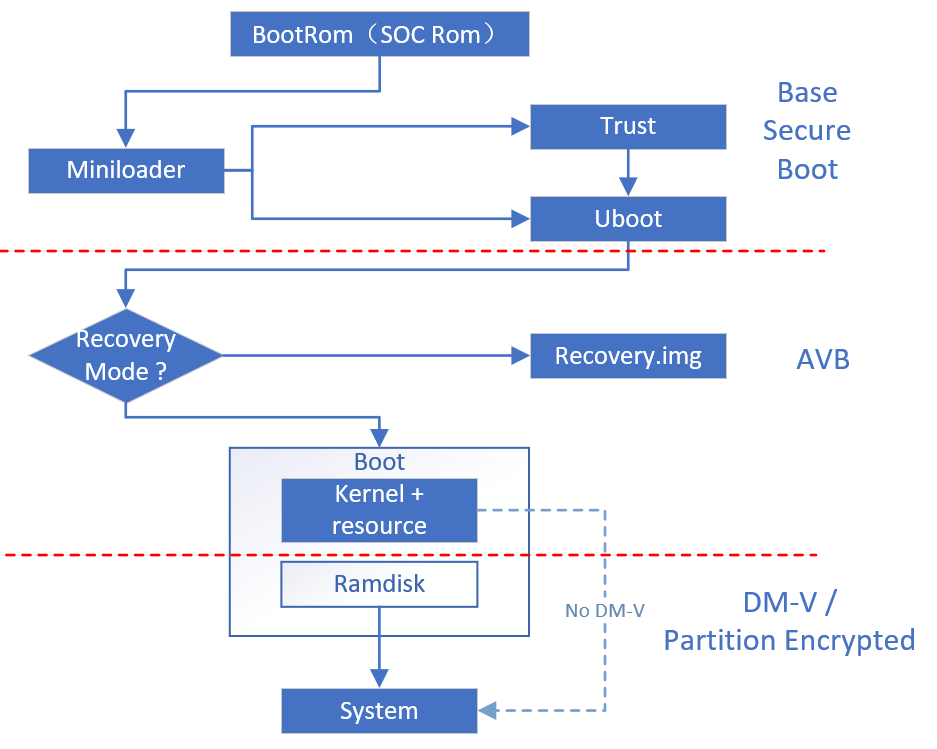
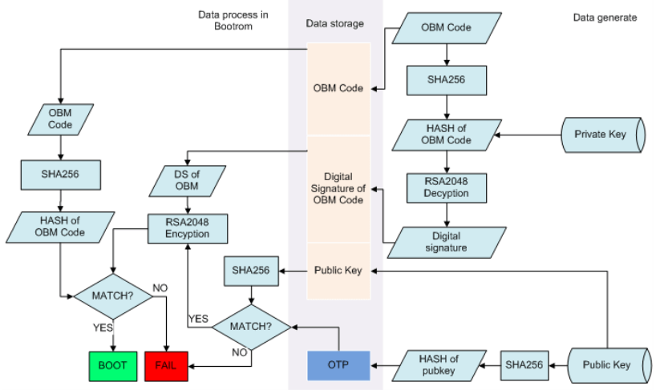
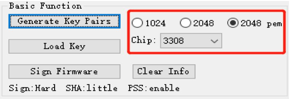
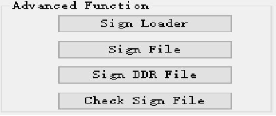
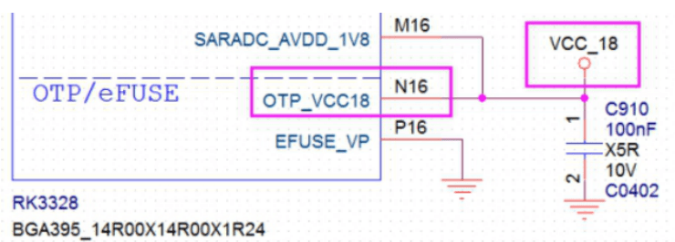
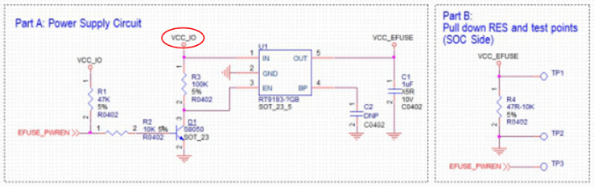
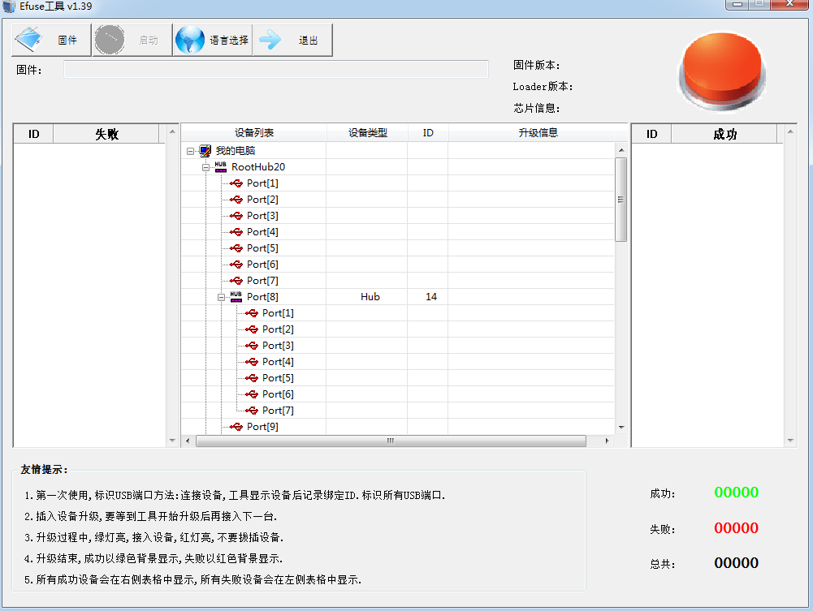
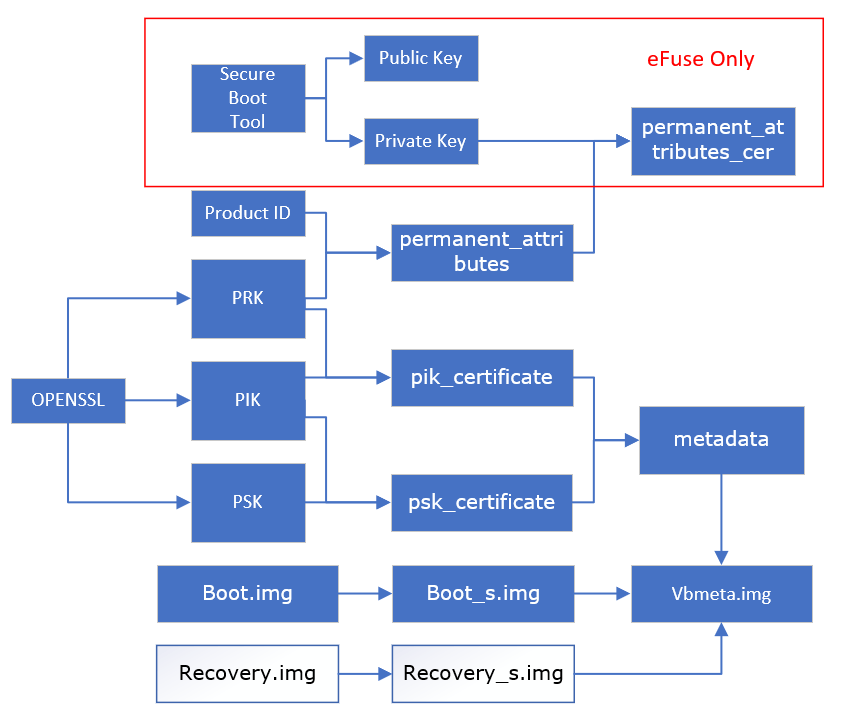
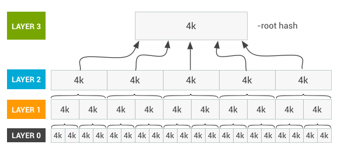

# Rockchip Linux Secure Boot 开发指南

文件标识：RK-KF-YF-379

发布版本：V2.0.1

日期：2020-8-10

文件密级：□绝密   □秘密   □内部资料   ■公开

**免责声明**

本文档按“现状”提供，瑞芯微电子股份有限公司（“本公司”，下同）不对本文档的任何陈述、信息和内容的准确性、可靠性、完整性、适销性、特定目的性和非侵权性提供任何明示或暗示的声明或保证。本文档仅作为使用指导的参考。

由于产品版本升级或其他原因，本文档将可能在未经任何通知的情况下，不定期进行更新或修改。

**商标声明**

“Rockchip”、“瑞芯微”、“瑞芯”均为本公司的注册商标，归本公司所有。

本文档可能提及的其他所有注册商标或商标，由其各自拥有者所有。

**版权所有 © 2020 瑞芯微电子股份有限公司**

超越合理使用范畴，非经本公司书面许可，任何单位和个人不得擅自摘抄、复制本文档内容的部分或全部，并不得以任何形式传播。

瑞芯微电子股份有限公司

Rockchip Electronics Co., Ltd.

地址：     福建省福州市铜盘路软件园A区18号

网址：     [www.rock-chips.com](http://www.rock-chips.com)

客户服务电话： +86-4007-700-590

客户服务传真： +86-591-83951833

客户服务邮箱： [fae@rock-chips.com](mailto:fae@rock-chips.com)

---

**前言**

**概述**

本文档主要介绍 RK Linux 平台下，Secure Boot 的使用步骤和注意事项，方便客户在此基础上进行二次开发。安全启动功能旨在保护设备使用正确有效的固件，非签名固件或无效固件将无法启动。

**产品版本**

| **芯片名称**                     | **内核版本** |
| -------------------------------- | ------------ |
| RK3308/RK3399/RK3328/RK3326/PX30 | 4.4          |

**读者对象**

本文档（本指南）主要适用于以下工程师：

技术支持工程师

软件开发工程师

**修订记录**

| **版本号** | **作者**   | **修改日期** | **修改说明**                                                 |
| ---------- | ---------- | :----------- | ------------------------------------------------------------ |
| V1.0.0     | WZZ        | 2018-10-31   | 初始版本                                                     |
| V1.0.1     | WZZ        | 2018-12-17   | 修改笔误 vbmeta->security                                    |
| V2.0.0     | WZZ        | 2019-06-03   | Sign_Tool 兼容 AVB boot.img，<br/>修改 device-mapper 相关使用说明 |
| V2.0.1     | Ruby Zhang | 2020-08-10   | 调整格式，更新公司名称                                       |

---

**目录**

[TOC]

---

## Secure Boot 介绍

### Secure Boot 流程



如上图所示，Linux 平台下，Secure Boot 从 BootRom 开始逐级建立了一个可靠的安全校验方案，并有序划分为三个部分，客户可以自行选择校验内容，以适配自己的需求。

Base Secure Boot: 由 BootRom 开始，逐步校验 Miniloader/Trust/Uboot 三级。

AVB: 由 Uboot 开始，校验 Boot 和 Recovery（可无）。

DM-V: 由打包在 Boot 中的 Ramdisk 工具完成校验或解密 System 分区。

Note: 以上流程和 Android 平台最大的不同是在 DM-V 阶段，Android 上借助 fs_mgr 机制，实现了 kernel 下的 DMV 校验；而这一部分，Linux 则是借助了 Ramdisk 达到校验的作用。

### Secure Boot 安全存储

Linux 平台下由以下几个安全存储区域：

| 存储区域           | 说明                                                         |
| ------------------ | ------------------------------------------------------------ |
| OTP / eFuse        | 位于 SOC 上，都是熔断机制的不可逆烧写。<br/>OTP 可由 Miniloader 烧写，eFuse 只能通过 PC 工具烧写<br/>详见 [2.2 节 安全信息烧写](# 安全信息烧写)<br/>不同的 SOC 采用不同的介质，目前 Linux 平台主要有：<br/>eFuse： RK3399 / RK3288<br/>OTP： RK3308 / RK3326 / PX30 / RK3328<br/>详见[1.3 节 相关资源](# 相关资源)Rockchip-Secure-Boot-Application-Note-V1.9.pdf |
| RPMB               | 位于 eMMC 上的一块物理分区，文件系统上不可见，<br/>需要 SOC 签权访问（即只能由 TEE 访问），<br/>一般认为是安全区域。 |
| Security Partition | 位于存储介质上的逻辑分区，是为弥补 Flash 介质上无<br/>RPMB 而加入的临时分区。分区内容加密存放，<br/>无法挂载，但可能被强制擦除。同样只能由 TEE 访问<br/>（强制擦除，TEE 访问报错，Secure Boot 无法正常启动）。 |

Note: 由于 OTP（eFuse）主要由 Rockchip 内部使用，客户安全信息请优先考虑 RPMB/Security 等其他区域。如有硬性需求，请向业务申请对应资料。

各阶段中，安全信息及其存储位置：

| 安全信息         | 存储位置                                                     |
| ---------------- | ------------------------------------------------------------ |
| Base Secure Boot | Public Key Hash 存在 OTP/eFuse                               |
| AVB              | OTP 设备中：permanent_attributes.bin 存在 OTP<br/> eFuse 设备中：<br/>permanent_attributes.bin 存在 RPMB/Security Partition <br/>permanent_attributes_cer.bin 存在 RPMB/Security Partition<br/>（permanent_attributes.bin 由 Base Secure Boot Key 校验安全） |
| DM-V             | Root Hash 存在 Boot 的 Ramdisk 中，由 AVB 校验 Boot 内容，保证无误 |

### 相关资源

参考文档位于 SDK/docs/Develop reference documents/SECURITY/ 目录下：

Rockchip-Secure-Boot-Application-Note-V1.9.pdf

Rockchip-Secure-Boot2.0.pdf

SDK/tools/linux/Linux_SecurityAVB/Readme.md

SDK/kernel/ Documentation/device-mapper/

<https://android.googlesource.com/platform/external/avb/+/master/README.md>

<https://source.android.google.cn/security/verifiedboot/dm-verity>

Linux Secure Boot 工具

企业网盘：链接：<https://eyun.baidu.com/s/3qZwY9FQ> 密码：OubV

（工具版本向下兼容，请优先使用高版本工具）

## Base Secure Boot

Base Secure Boot 提供基础的安全保障到 U-boot（loader/trust/uboot）

启动流程如图：



简略说，一个签名固件包括 Firmware(OBM Code) + Digital Signature + Public key

其中 Digital Signature + Public Key 都由签名工具添加。

存储上，签名固件放在 eMMC 或 Flash 上，Public Key Hash 放在芯片的 OTP(eFuse)上。

启动的时候，通过 OTP 中的 Hash 校验固件尾端的公钥，再用公钥校验数字签名的方式，达到芯片与签名代码绑定的效果。

详见 Rockchip-Secure-Boot-Application-Note-V1.9.pdf

### 签名工具

#### UI工具(Windows)

SDK/tools/windows/SecureBootTool_v1.94 或见企业网盘，详见 [1.3节 相关资源](# 相关资源)。

1. 修改配置

打开工具中的 setting.ini：

如果需要用到 AVB，则修改 exclude_boot_sign = True。

如果芯片使用 OTP 启用 Secure Boot 功能，将其中的 sign_flag=0x20。（bit 5: loader OTP write enabled, 已经写过 OTP 的板子上，或 eFuse 芯片，该 flag 置空。）

2. 生成公私钥

选定 Chip 和 Key 格式（pem 为通用格式），点击 Generate Key Pairs，生成 PrivteKey.pem 和 PublicKey.pem。(**密钥随机生成，请妥善保存这两个密钥，在安全功能启用后，如果丢失了这两个密钥，机子将无法刷机**)



3. 载入密钥

选择 Load Key，根据提示将公私钥载入。

4. 签名

签名有两种方式：只签 update.img 以及独立签名。

如果已经打包好了 update.img，那可以直接使用 Sign Firmware 对 update.img 进行签名。

独立签名，需要先按 CTRL + R + K 打开 Advanced Function



使用 Sign Loader 给 Miniloader.bin 签名，

使用 Sign File 给 trust.img 和 uboot.img 签名。

（实际上对 update.img 签名，也是将 update.img 解包，再对各个分立固件签名后，总体再打包，然后针对整体再签一次名）

#### 命令行工具

企业网盘，详见 [1.3节 相关资源](# 相关资源)。
下，rk_sign_tool_v1.3_win.zip/[rk_sign_tool_v1.3_linux.zip](https://eyun.baidu.com/enterprise/share/init?cid=8272257679089781337&uk=85686111&sid=201811148512294825#sharelink/javascript:void(0);)

```shell
# step1：产生rsa公私钥 （如果已经有了key，跳过这一步）
 ./rk_sign_tool kk --out .
# step2：加载公私钥,只需进行一次，路径自动保存到setting.ini
./rk_sign_tool lk --key privateKey.pem --pubkey publicKey.pem
# step3：选择芯片来决定签名方案
./rk_sign_tool cc --chip 3326
# stpe4：打开setting.ini，将 sign_flag = 0x20。如果平台使用OTP存储安全信息，将 sign_flag = 0x20，使能RKloader OTP 写功能，空板必须开启；否则该项清空。如果需要用到AVB，则修改exclude_boot_sign = True。
# stpe5：整体签名，独立签名跳过该步骤
./rk_sign_tool sf --firmware update.img
# stpe6：签名loader，整体签名，跳过6-8步骤。
./rk_sign_tool sl --loader  rk3326loader.bin
# stpe7：签名uboot，v1.3之前的版本，RK3326/RK3308需要带--pss；否则不带
./rk_sign_tool si --img uboot.img
# stpe8：签名trust，v1.3之前的版本，RK3326/RK3308需要带--pss；否则不带
./rk_sign_tool si --img trust.img
```

### 安全信息烧写

#### OTP

如果芯片使用 OTP 启用 Secure Boot 功能，保证芯片的 OTP 引脚在 Loader 阶段有供电。直接通过 AndroidTool(Windows) / upgrade_tool(Linux)把固件下载下去，第一次重启，Loader 会负责将 Key 的 Hash 写入 OTP，激活 Secure Boot。再次重启，固件就处于保护中了。



#### eFuse

如果芯片使用 eFuse 启用 Secure Boot 功能，请保证硬件连接没有问题，因为 eFuse 烧写时，Kernel 尚未启动，所以，请保证 VCC_IO 在 MaskRom 状态下有电才能用。



使用 tools/windows/eFusetool_vXX.zip，板子进入 MaskRom 状态。

点击"固件"，选择签名的 update.img，或者 Miniloader.bin，点击运行"启动"，开始烧写 eFuse。



eFuse 烧写成功后，再断电重启，进入 MaskRom，使用 AndroidTool，将其他签名固件下载到板子上。

### 验证

安全启动生效后，有类似如下 Log 在 Loader 阶段输出。

```log
SecureMode = 1
Secure read PBA: 0x4
SecureInit ret = 0, SecureMode = 1
```

## AVB

AVB 需要 U-boot 配合使用，Linux 上 AVB 用来保证 uboot.img 下一级的完整性（包括 boot.img 和 recovery.img）

对应的工具在 tools/linux/Linux_SecurityAVB

具体使用，参考 tools/linux/Linux_SecurityAVB/Readme.md

（如果说明冲突，以 Linux_SecurityAVB/Readme.md 为准）

### 注意事项

关于 Device Lock & Unlock：

当设备处于 Unlock 状态，程序还是会校验整个 boot.img，如果固件有错误，程序会报具体是什么错误，**但设备正常启动**。而如果设备处于 Lock 状态，程序会校验整个 boot.img，如果固件有误，则不会启动下一级固件。所以调试阶段设置 Device 处于 Unlock 状态，方便调试。

### 固件配置

Trust：

进入 rkbin/RKTRUST，以 RK3308 为例，找到 RK3308TRUST.ini，修改

```shell
[BL32_OPTION]
SEC=0
```

改为：

```shell
[BL32_OPTION]
SEC=1
```

U-boot：

U-boot 需要 FASTBOOT 和 OPTEE 支持。

```shell
CONFIG_OPTEE_CLIENT=y
CONFIG_OPTEE_V1=y	#RK312x/RK322x/RK3288/RK3228H/RK3368/RK3399 与V2互斥
CONFIG_OPTEE_V2=y	#RK3308/RK3326 与V1互斥
```

AVB 开启需要在 config 文件中配置:

```shell
CONFIG_AVB_LIBAVB=y
CONFIG_AVB_LIBAVB_AB=y
CONFIG_AVB_LIBAVB_ATX=y
CONFIG_AVB_LIBAVB_USER=y
CONFIG_RK_AVB_LIBAVB_USER=y
CONFIG_AVB_VBMETA_PUBLIC_KEY_VALIDATE=y
CONFIG_CRYPTO_ROCKCHIP=y
CONFIG_ANDROID_AVB=y
CONFIG_ANDROID_AB=y	#有需要再开
CONFIG_OPTEE_ALWAYS_USE_SECURITY_PARTITION=y	#rpmb无法使用时打开，默认不开
CONFIG_ROCKCHIP_PRELOADER_PUB_KEY=y #eFuse 安全方案需要打开
```

固件，Certificate 及 hash 需要通过 fastboot 烧写，所以需要在 config 中配置 fastboot 功能。

```shell
CONFIG_FASTBOOT=y
CONFIG_FASTBOOT_BUF_ADDR=0x800800 #各平台不同，以默认配置为主
CONFIG_FASTBOOT_BUF_SIZE=0x04000000 #各平台不同，以默认配置为主
CONFIG_FASTBOOT_FLASH=y
CONFIG_FASTBOOT_FLASH_MMC_DEV=0
```

使用`./make.sh xxxx`，生成 uboot.img, trust.img 和 loader.bin。

Parameter：

AVB 需要添加 vbmeta 分区，用来存放固件签名信息，大小 1M，位置无关。

AVB 需要 system 分区，在 buildroot 上（即 rootfs 分区）将 rootfs 改名为 system，如果使用了 uuid，还需要修改 uuid 分区名。

如果存储介质使用 Flash，还需要另外添加 security 分区，用来存放操作信息。内容同样加密存放。大小 4M，位置无关。（eMMC 无需添加该分区，eMMC 操作信息存放在物理 RPMB 分区）

以下是 AVB parameter 例子：

```shell
0x00002000@0x00004000(uboot),0x00002000@0x00006000(trust),0x00002000@0x00008000(misc),0x00010000@0x0000a000(boot),0x00010000@0x0001a000(recovery),0x00010000@0x0002a000(backup),0x00020000@0x0003a000(oem),0x00300000@0x0005a000(system),0x00000800@0x0035a000(vbmeta),0x00002000@0x0035a800(security),-@0x0035c800(userdata:grow)
```

AVB ab parameter:

```shell
0x00002000@0x00004000(uboot),0x00002000@0x00006000(trust_a),0x00002000@0x00008000(trust_b),0x00002000@0x0000a000(misc),0x00010000@0x0000c000(boot_a),0x00010000@0x0001c000(boot_b),0x00010000@0x0002c000(backup),0x00020000@0x0003c000(oem),0x00300000@0x0005c000(system_a),0x00300000@0x0035c000(system_b),0x00000800@0x0065c000(vbmeta_a),0x00000800@0x0065c800(vbmeta_b),0x00002000@0x0065d000(security),-@0x0065f00(userdata:grow)
```

下载的时候，工具上的名称要同步修改，修改后，重载 parameter。

### AVB Key

AVB 中主要信息包含以下 4 把 Key：

Product RootKey (PRK)：AVB 的 Root Key，eFuse 设备中，由 Base Secure Boot 的 Key 校验相关信息。OTP 设备中，直接读取预先存放于 OTP 中的 PRK-Hash 信息校验；

ProductIntermediate Key (PIK)：中间 Key，中介作用；

ProductSigning Key (PSK)：用于签名固件的 Key；

ProductUnlock Key (PUK)：用于解锁设备。



AVB 根据这 4 把 Key 派生出一系列的文件，如图所示，具体信息参 Google AVB 开源<https://android.googlesource.com/platform/external/avb/+/master/README.md>

和原版 AVB 相比，Linux 下主要截取了 AVB 最主要的固件校验功能，其中为适配 RK 平台，在 eFuse 上，额外产生了 permanent_attributes_cer.bin，这使得我们可以不必将 permanent_attributes.bin 存入 eFuse 内，直接由 Base Secure Boot Key 校验 permanent_attributes.bin 信息，达到节省 eFuse 空间的作用。

**该目录下已经有一套测试的证书和 Key，如果需要新的 Key 和证书，可以按下面步骤自行生成。**

**请妥善保管生成的文件，否则加锁之后将无法解锁，机子将无法刷机。**

```shell
openssl genpkey -algorithm RSA -pkeyopt rsa_keygen_bits:4096 -outform PEM -out testkey_prk.pem
openssl genpkey -algorithm RSA -pkeyopt rsa_keygen_bits:4096 -outform PEM -out testkey_psk.pem
openssl genpkey -algorithm RSA -pkeyopt rsa_keygen_bits:4096 -outform PEM -out testkey_pik.pem
touch temp.bin
python avbtool make_atx_certificate --output=pik_certificate.bin --subject=temp.bin --subject_key=testkey_pik.pem --subject_is_intermediate_authority --subject_key_version 42 --authority_key=testkey_prk.pem
echo "RKXXXX_nnnnnnnn" > product_id.bin
python avbtool make_atx_certificate --output=psk_certificate.bin --subject=product_id.bin --subject_key=testkey_psk.pem --subject_key_version 42 --authority_key=testkey_pik.pem
python avbtool make_atx_metadata --output=metadata.bin --intermediate_key_certificate=pik_certificate.bin --product_key_certificate=psk_certificate.bin

# 其中temp.bin需要自己创建的临时文件，新建temp.bin即可，无需填写数据。
# product_id.bin需要自己定义，占16字节，可作为产品ID定义。

# permanent_attributes.bin生成：
python avbtool make_atx_permanent_attributes --output=permanent_attributes.bin --product_id=product_id.bin --root_authority_key=testkey_prk.pem

# PUK生成：
openssl genpkey -algorithm RSA -pkeyopt rsa_keygen_bits:4096 -outform PEM -out testkey_puk.pem

# puk_certificate.bin permanent_attributes.bin为设备解锁的证书，生成过程需要用到PrivateKey.pem，该key为烧录进efuse/otp的key(参考[第2 章 Base Secure Boot](# Base Secure Boot), 其生成过程如下：
python avbtool make_atx_certificate --output=puk_certificate.bin --subject=product_id.bin --subject_key=testkey_puk.pem --usage=com.google.android.things.vboot.unlock --subject_key_version 42 --authority_key=testkey_pik.pem

# 针对eFuse设备，还需要另外生成 permanent_attributes_cer.bin（OTP设备可以跳过）：
openssl dgst -sha256 -out permanent_attributes_cer.bin -sign PrivateKey.pem permanent_attributes.bin
```

### 生成vbmeta.sh

签名脚本为 make_vbmeta.sh。

给固件签名的格式为：

```shell
python avbtool add_hash_footer --image  --partition_size <SIZE> --partition_name <PARTITION> --key testkey_psk.pem --algorithm SHA512_RSA4096
```

IMG 为签名固件

SIZE 为签名后，固件大小，至少比原文件大 64K，且不超过 parameter 中定义的分区大小，大小必须 4K 对齐

PARTITION 为 boot / recovery

签名完成后，用签名过的文件生成 vbmeta.img

基本格式：

```shell
python avbtool make_vbmeta_image --public_key_metadata metadata.bin --include_descriptors_from_image  --algorithm SHA256_RSA4096 --rollback_index 0 --key testkey_psk.pem  --output vbmeta.img
```

"--include_descriptors_from_image \ 该字段可以多次使用，即有多少个加密过的文件，就添加多少个 "--include_descriptors_from_image"。

例如：

```shell
python avbtool make_vbmeta_image --public_key_metadata metadata.bin --include_descriptors_from_image boot.img --include_descriptors_from_image recovery.img --algorithm SHA256_RSA4096 --rollback_index 0 --key testkey_psk.pem  --output vbmeta.img
```

可按照上述规则自行修改 make_vbmeta.sh 脚本，并生成 vbmeta.img。

### 烧写流程

1. 把 boot.img/recovery.img 放到这个目录下

2. 运行 make_vbmeta.sh,生成 vbmeta.bin 和加密过的 boot.img/recovery.img

3. 替换固件：

uboot.img, trust.img, MiniloaderAll.bin 替换成新配置的固件。

boot.img 使用该目录下生成的加密固件。

vbmeta.bin 提取出来。

parameter.txt 按 2.3 中规则修改

4. 使用工具烧录。

如果使用的 Windows 工具，请在工具中添加 vbmeta 分区（security 分区视 parameter 而定），地址不填。然后重新加载 parameter，工具会自行更新地址。

5. 下载之后，设备默认处于 Unlock 状态，此时固件还是会校验，但是不会阻拦系统启动，只会报错。

### AVB Lock \& Unlock

AVB 只有在 lock 状态下，才会真正阻拦非签名固件的启动。

AVB Lock 状态需要在 Fastboot 模式下进行，将设备进入到 Fastboot 模式，有 3 种途径：

1. 启动到系统中，运行 reboot fastboot

2. 进入到 U-boot 命令行中，输入 fastboot usb 0

3. 如果有 fastboot 按键，通过 fastboot 按键进入 fastboot 模式。

然后 PC 通过 fastboot 命令操作（可能需要管理员权限）

PUB Key 烧写：

```shell
sudo ./fastboot stage permanent_attributes.bin
sudo ./fastboot oem fuse at-perm-attr
#permanent_attributes.bin存放到RPMB/security分区，在OTP设备上，还会计算permanent_attributes.bin的Hash，并烧入到OTP

# eFuse only， skip this step if used OTP
sudo ./fastboot stage permanent_attributes_cer.bin
sudo ./fastboot oem fuse at-rsa-perm-attr
#下载permanent_attributes_cer.bin到RPMB/security，这样在efuse设备中，可以使用Base Secure Boot Root Key校验permanent_attributes.bin
```

Lock 流程：

```shell
sudo ./fastboot oem at-lock-vboot
sudo ./fastboot reboot
```

 Unlock 流程：

```shell
sudo ./fastboot oem at-get-vboot-unlock-challenge
sudo ./fastboot get_staged raw_unlock_challenge.bin
./make_unlock.sh
sudo ./fastboot stage unlock_credential.bin
sudo ./fastboot oem at-unlock-vboot
```

最终的 Lock Log:

```log
ANDROID: reboot reason: "(none)"
Could not find security partition
read_is_device_unlocked() ops returned that device is LOCKED
```

## DM-V

使用 DM-V 原理的一个前提是 boot.img 必须是安全的，该方案会在 boot.img 中打包一个 ramdisk，ramdisk 安全由 AVB 保证，ramdisk 中利用 veritysetup 工具验证挂载后级固件。

DM-V 的优点在于，校验速度快，固件越大，效果越明显。

而缺点是，DM-V 只能作用于只读文件系统，Boot 和 System 固件体积会变大。

基本原理是 Device-Mapper-Verity 技术，该机制会对校验固件进行 4K 切分，并对每个 4K 数据片进行 hash 计算，迭代多层，并生成对应 Hash-Map（30M 以内） 和 Root-Hash。创建基于 DM-V 的虚拟分区时，会对 Hash-Map 进行校验，保证 Hash-Map 无误。



分区被挂载后，有数据被访问时，会对数据所在的 4K 分区单独进行 Hash 校验，当校验出错时，返回 I/O 错误，无法使用对应位置，与文件系统损坏一样。

具体可参考 Kernel 底下 Documentation/device-mapper/

或者 <https://source.android.google.cn/security/verifiedboot/dm-verity>。

### 固件签名

DM-V 功能需要 Kernel 打开相关资源才能使用，编译 Kernel 请注意打开 CONFIG_DM_VERITY。

工具上，需要网盘[1.3节 相关资源](# 相关资源) 文件 Linux_SecurityDM_v1_01.tar.gz。

上述压缩文件请在 Linux 环境下解压，里面包含软连接，在 Windows 环境下，会被展开成原文件大小，造成文件变大。

将文件解压，得到：

```log
|── config
|── mkbootimg
|── mkdm.sh
└── ramdisk.tar.gz
```

首先配置 config，请根据实际填写对应信息

```shell
ROOT_DEV=	# 实际root固件在flash中的分区位置，比如/dev/mmcblk2p8
INIT=		# 实际root运行的第一个脚本，一般为/init 或 /sbin/init
ROOTFS_PATH=	#需要签名的rootfs 固件
KERNEL_PATH=		#Kernel Image位置，一般kernel/arch/arm(64)/boot/Image
RESOURCE_PATH=	#kernel resource.img 位置，一般 kernel/resource.img
```

然后运行 ./mkdm.sh -m dmv -c config (--debug)，脚本会自动将 Root-Hash 打包进 Ramdisk，并和 kernel，resource 打包成 boot.img。Hash-Map 附在 rootfs.img 后面。

output 目录下，得到 boot.img 和 rootfs_dmv.img。

将这两个固件代替原来的 boot.img 和 rootfs.img 下载到板上，即可。

## 分区加密

分区加密同样基于 device-mapper 技术，区别在于对各个分区块的处理方式不同。参考[第4章DM-V](# DM-V)。

优点，安全性高，文件系统自由，可读可写。

缺点，加密分区时无法压缩；读写数据都必须通过加解密计算，一定程度上影响读写效率。

### rootfs加密

同 DM-V 相同，分区加密同样需要 Kernel 打开相关资源才能使用:

```shell
CONFIG_BLK_DEV_DM
CONFIG_DM_CRYPT
CONFIG_BLK_DEV_CRYPTOLOOP
```

工具上，和 DM-V 共用一套工具（Linux_SecurityDM_v1_01.tar.gz）

需要在 config 文件中配置以下内容：

```shell
ROOT_DEV=	        # 实际root固件在flash中的分区位置，比如/dev/mmcblk2p8
INIT=		        # 实际root运行的第一个脚本，一般为/init 或 /sbin/init
KERNEL_PATH=		#Kernel Image位置，一般kernel/arch/arm(64)/boot/Image
RESOURCE_PATH=	    #Kernel resource.img 位置，一般 kernel/resource.img
inputimg=	        #需要加密的固件
cipher= 	        #默认使用aes-cbc-plain
key= 	            #请注意格式大小，使用与cipher匹配的key
```

使用`./mkdm.sh -m fde-s -c config`

会在 output 目录下，得到 boot.img 和 encrypted.img。

将这两个固件代替原来的 boot.img 和 rootfs.img 下载到板上，即可。

### 非系统固件加密

固件加解密有很多开源工具可选，这里使用 dmsetup（与 5.1 工具一致），使用该工具需要打开以下配置：

```shell
# Kernel：
CONFIG_BLK_DEV_DM
CONFIG_DM_CRYPT
CONFIG_BLK_DEV_CRYPTOLOOP

# Buildroot：
BR2_PACKAGE_LUKSMETA
```

工具上，和 DM-V 共用一套工具（Linux_SecurityDM_v1_01.tar.gz）
需要在 config 文件中配置以下内容：

```shell
inputimg=	#需要加密的固件，或者使用inputfile加密文件夹
cipher= #默认使用aes-cbc-plain
key= #请注意格式大小，使用与cipher匹配的key
```

使用`./mkdm.sh -m fde -c config`

会在 output 目录下，得到 encrypted.img 和 encrypted_info.

encrypted.img 即为加密过的文件，可将该文件用 dmsetup 虚拟成分区设备，挂载使用。其中 encrypted_info 为加密信息，如：

```shell
#dmsetup create encfs-4284779680572201071 --table "0 550912 crypt aes-cbc-plain 000102030405060708090a0b0c0d0e0f101112131415161718191a1b1c1d1e1f 0 TARGET_PARTITION 0 1 allow_discards"
sectors=550912
cipher=aes-cbc-plain
key=000102030405060708090a0b0c0d0e0f101112131415161718191a1b1c1d1e1f
```

挂载加密文件到/mnt 方法：

```shell
source encrypted_info
loopdevice=`losetup -f`
losetup ${loopdevice} encrypted.img
dmsetup create encrypt-file --table "0 $sectors crypt $cipher $key 0 $loopdevice 0 1 allow_discards"
mount /dev/mapper/encrypt-file /mnt
```

卸载方法：

```shell
umount /mnt
dmsetup remove encrypt-file
losetup -d ${loopdevice}
```

### 关于mkdm.sh

mkdm.sh 除 dm-verity 和加密分区外，还提供一些基础的调试功能。

比如：

1. boot_only

该选项打包的时候只更改 boot.img，rootfs 保持不动。

2. debug

提供所有 mkdm.sh 的实时运行命令，在脚本运行失败的情况下，会很有用。

3. ramdisk

当客户有自定义 ramdisk 需求时，该选项会很有用。

4. 更多功能，请自行阅读脚本发掘
