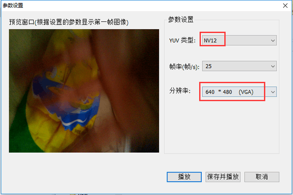
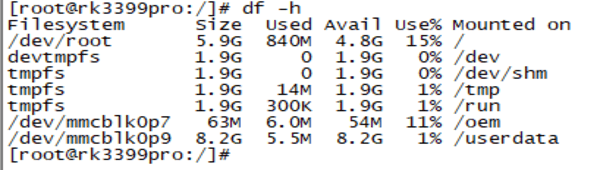
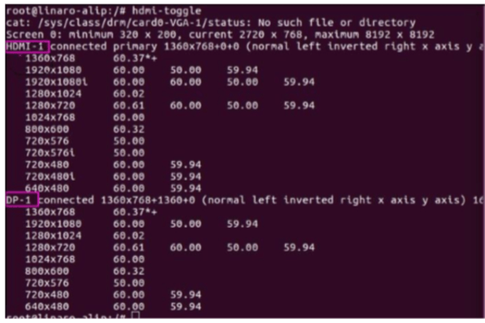
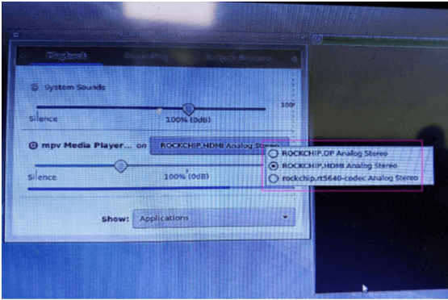
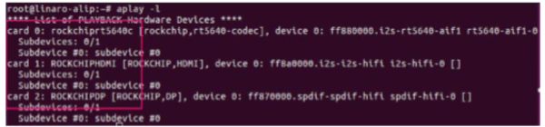
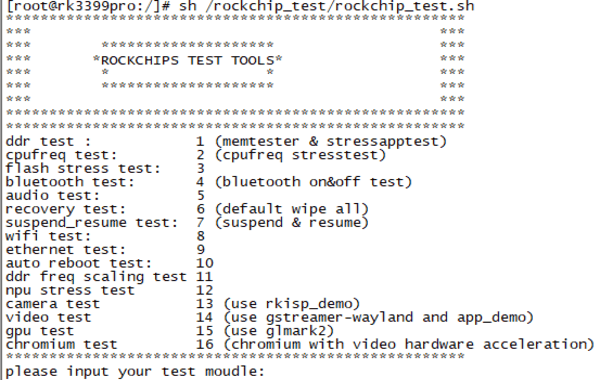

# Rockchip Linux System Test User Guide

ID:RK-SM-YF-352

Release Version:V1.1.2

Release Date: 2020-08-02

Security Level: □Top-Secret   □Secret   □Internal   ■Public

**DISCLAIMER**

THIS DOCUMENT IS PROVIDED “AS IS”. ROCKCHIP ELECTRONICS CO., LTD.(“ROCKCHIP”)DOES NOT PROVIDE ANY WARRANTY OF ANY KIND, EXPRESSED, IMPLIED OR OTHERWISE, WITH RESPECT TO THE ACCURACY, RELIABILITY, COMPLETENESS,MERCHANTABILITY, FITNESS FOR ANY PARTICULAR PURPOSE OR NON-INFRINGEMENT OF ANY REPRESENTATION, INFORMATION AND CONTENT IN THIS DOCUMENT. THIS DOCUMENT IS FOR REFERENCE ONLY. THIS DOCUMENT MAY BE UPDATED OR CHANGED WITHOUT ANY NOTICE AT ANY TIME DUE TO THE UPGRADES OF THE PRODUCT OR ANY OTHER REASONS.

**Trademark Statement**

"Rockchip", "瑞芯微", "瑞芯" shall be Rockchip’s registered trademarks and owned by Rockchip. All the other trademarks or registered trademarks mentioned in this document shall be owned by their respective owners.

**All rights reserved. ©2020. Rockchip Electronics Co., Ltd.**

Beyond the scope of fair use, neither any entity nor individual shall extract, copy, or distribute this document in any form in whole or in part without the written approval of Rockchip.

Rockchip Electronics Co., Ltd.

No.18 Building, A District, No.89, software Boulevard Fuzhou, Fujian,PRC

Website:     [www.rock-chips.com](http://www.rock-chips.com)

Customer service Tel:  +86-4007-700-590

Customer service Fax:  +86-591-83951833

Customer service e-Mail:   [fae@rock-chips.com](mailto:fae@rock-chips.com)

---

**Preface**

**Overview**

The document mainly presents Rockchip Linux SDK system software test methods and steps, aiming to help engineers get started with system testing and related debugging methods faster.

**Intended Audience**

This document (this guide) is mainly intended for:

Technical support engineers

Software development engineers

**Chipset Supported**

| **Chipset** | **Buildroot** | **Debian 9** | **Debian 10** | **Yocto** |
| ----------- | :-------------- | :------------- | :---------- | :---------- |
| PX30 | Y               | Y              | Y          | Y           |
| RK3326 | Y               | Y              | Y          | Y           |
| RK3288 | Y               | Y              | Y          | Y           |
| RK3399 | Y               | Y              | Y          | Y           |
| RK3399Pro | Y               | Y              | Y          | Y           |

**Revision History**

| **Date** | **Version** | **Date** | **Change Description** |
| -----------| :-------------- | :------------- | :---------- |
| 2017-01-15 | V1.0.0 | CQ | Initial version |
| 2020-03-24 | V1.1.0 | CQ | Update test items |
| 2020-03-30 | V1.1.1 | Caesar Wang	| Update the format |
| 2020-08-02 | V1.1.2 | Ruby Zhang	| Update the format |

---

**Contents**

[TOC]

---

## Functions Test

### Buildroot

#### Restore Moving Layer Down

When the touch screen of the device is invalid and serial port input is available, the layer is set to move down, which can be restored with the following command:

```shell
/etc/init.d/S50launcher stop (Close lanucher first)
/etc/init.d/S50launcher start (Then open lanucher)
```

#### Remove Background Applications

Example: remove background audio.

Search the audio playing:

```shell
ps | grep audio
[root@rk3399pro:/]# ps | grep audio
  569 root      557m S    /usr/bin/audioservice
 1248 root      2412 S    grep audio
```

Remove background audio playback: kill 569.

#### Video

Video:

```shell
rkisp_demo --device=/dev/video1 --output=/tmp/isp.yuv --iqfile=/etc/iqfiles/OV5695.xml
```

Play video:

Pull the file in the /tmp/cif.yuv directory to PC: `adb pull /tmp/cif.yuv /tmp/cif.yuv`, and play it through the tool YUVPlayer.exe. The settings of YUVPlayer.exe tool when playing YUV video files are as follows:



#### Recording

arecord -c channel -r sampling frequency -f sampling bits -d recording duration/recording storage path/recording file name.
Channel ch_tbl="2 4 6 8"

Sampling frequency: fs_tbl="8000 11025 16000 22050 32000 44100 48000 64000 88200 96000 176400 192000"

Sampling bits: bits_tbl="S16_LE S24_LE S32_LE"

Package format = "wmv, wav, mp3, etc."

For example:

**Time-limited recording- after recording for 10 seconds will exit and save automatically:**

```shell
arecord -c 2 -r 44100 -f S16_LE –d 10 /tmp/record.wav
```

**Unlimited time recording -ctrl+c: exit to save:**

```shell
arecord -c 2 -r 44100 -f S16_LE /tmp/record.wav
```

**Play recording files:**

```shell
aplay /tmp/record.wav
```

#### Wi-Fi  Connecting

**First way:**

```shell
cp data/cfg/wpa_supplicant.conf userdata/
vi /userdata/cfg/wpa_supplicant.conf
```

Add the following configuration items:

```
network={
ssid="WiFi-AP" // Wi-Fi name
psk="12345678" // Wi-Fi password
key_mgmt=WPA-PSK // Encryption
key_mgmt=NONE // Not encrypted
}

```

Re-read the above configuration: wpa_cli reconfigure

And reconnect: wpa_cli reconnect

Ping baidu.com

**Second way:**

```
./usr/sbin/wpa_supplicant -D nl80211 -i wlan0 -c /etc/wpa_supplicant.conf &  #Open Wi-Fi
wpa_cli -i wlan0 add_network  #add a network connection ID number, which is used in steps 3-6
wpa_cli -i wlan0 set_network 0 ssid \"pzb\"    #add the SSID of the router to be connected, such as: pzb
wpa_cli -iwlan0 set_network 0 psk \"123456789\"    #add the ap password to be connected, such as: 123456789
wpa_cli -iwlan0 enable_network 0   #0 here is obtained according to step 2, so that the network ID can be used
wpa_cli -iwlan0 select_network 0  #0 here is obtained according to step 2, connect the ID
wpa_cli -iwlan0 set_network 0 psk \""    #(No password)
ifconfig 以及ping baidu.com    #if you can get an IP address and can ping normally, it means you can connect to network
```

#### Music Player

```shell
aplay /media/usb0/musicdemo.wmv
```

#### System Time Checking and Setting

```shell
date                               #check system time
date --set='2018-12-24 15:17:42'   #Set system time
hwclock --show                     #check hardware time
hwclock --systohc                  #synchronous display of hardware time and system time
```

#### RTC Clock Test

`cat /path/time` is used to check whether the time has changed in the current state or after restart.

Such as:

RK3399 excavator EVB:

```shell
cat /sys/devices/platform/ff3c0000.i2c/i2c-0/0-001b/rk808-rtc/rtc/rtc0/time
```

PX30 EVB：

```shell
cat /sys/devices/platform/ff3c0000.i2c/i2c-0/0-001b/rk808-rtc/rtc/rtc0/time
```

RK3399Pro EVB：

```shell
cat /sys/devices/platform/ff3c0000.i2c/i2c-0/0-0020/rk808-rtc/rtc/rtc0/time
```

Different platforms correspond to different node paths of time. You can find the above similar nodes through this command: `find ./ -name time`.


#### Screen Rotation

Write in the /etc/xdg/weston/weston.ini configuration file:

```ini
[output]
name=eDP-1
transform=90
```

The name needs to be written according to the actual situation and obtained through `ls /sys/class/drm`:

```shell
[root@rk3399:/]# ls /sys/class/drm/
card0 card0-HDMI-A-1  controlD64    version card0-DP-1     card0-eDP-1    renderD128
```

For example, the drm device here is card0-eDP-1, and the name="eDP-1".

#### Video Playback

**Video playback in single window:**

```shell
gst-play-1.0 /oem/SampleVideo_1280x720_5mb.mp4
```

**Video playback in multi-window:**

First find the multi-window script and then execute:

```shell
cd rockchip_test/video/
sh test_gst_multivideo.sh test  #it is not this name probably, but test_multivideo.sh
```

**Stop multi-window:**

```shell
killall videowidget
etc/init.d/S50launcher stop
etc/init.d/S50launcher start
```

#### SD Card Upgrade and Boot

- Insert the SD card into PC, execute the SD_Firmware_Tool.exe on PC, select firmware upgrade/SD boot, select firmware-update.img, and start creating.
- After the SDK enters the maskrom and erases the flash, power off.
- Insert the prepared SD card, power on the SDK, and it will automatically burn the firmware.


#### Search the File

```shell
find ./ -name \*.sh
```

#### Check Memories

```shell
cat /proc/meminfo or free –h
```


#### Check Memory Usage

df -h：



#### Default Path of U Disk or SD Card Mount Automatically

U disk: /media/usb0/

SD car: /sdcard/

#### Copy Files

Copy files from U disk to device:

```shell
cp -r /media/usb0/3399-linux/ /userdata
```

### Debian

#### Disable Standby

Enter the command on the Debian terminal:

```shell
sudo xset –dpms
sudo xset s off
xset dpms force off (Turn off the screen immediately)
```

Note: after restarting the device, the above settings will become disabled.

Terminal position: start at the bottom left corner of the main interface -> System Tools -> LXTerminal

#### Wi-Fi Connection

Enter the following command in the serial port:

```shell
nmcli r wifi on  #steps 1：turn on Wi-Fi
nmcli dev wifi   #steps 2：scan nearby AP
#steps 3：connect AP
nmcli dev wifi connect "DIR-803" password "839919060" ifname wlan0
nmcli r wifi off #steps 4：turn off Wi-Fi
```

#### Dual-screen with Different Display

Use hdmi-toggle to make sure how many display devices there are. For example, the following two devices, HDMI-1 and DP-1 can be detected:



xrandr is used to set the relationship between the two screens:

```shell
su linaro-c "DISPLAY=:0xrandr--outputHDMI-1--aboveDP-1"
```

The --above can be replaced by right-of, left-of, below, same-as, preferred, off, etc.

In this way to realize the dual-screen with different display function.

#### Dual-screen with Different Audio

Open the Sound&Video---->PulseAudio Volume Control in the bottom left corner, and then select the song to play. which sound card for playback can be selected as follows:



You can also use aplay to confirm the sound card and select the sound card to play:

 aplay-l:



```shell
rt5640: aplay-Dplughw:0,0/dev/urandom
hdmiaudio: aplay-Dplughw:1,0/dev/urandom
DPaudio: aplay-Dplughw:2,0/dev/urandom
```

Open a song and drag it from the main screen to the secondary screen, and then select a sound card to play in the same way on the main screen to complete the dual-screen with different audio function.

#### Display Rotation

Rotation normal/left/right:

```shell
vi /etc/X11/xorg.conf.d/20-modesetting.conf
```

You can change the normal to left/right/ and it will take effect after reboot.

#### The Default Path for Automatic Mounting of U Disk

/media/linaro/B4EA-8716

Note: Different USB drives with different names, it depends actually.

## Performance Test

### Disk Read and Write Test

Check the node before testing: `fdisk -l`.

mmcblk1p9 is used to check the partition that can be readable and writable, the maximum capacity of this partition is 13.5G, the capacity of other P1-8 is relatively small with the capacity of 3.5G. After reading and writing this disk, it is easy to cause system damage. Restart the device and find that it cannot be turned on, so please choose p9.

#### e Read and Write

Write to disk:

```shell
dd if=/dev/zero of=/dev/mmcblk1p9 bs=1M count=2000 oflag=direct,nonblock
```

Read disk:

```shell
dd if=/dev/mmcblk1p9 of=/dev/null bs=1M count=2000 iflag=direct,nonblock
```

#### U disk Read and Write

Write to disk:

```shell
dd if=/dev/zero of=/dev/sda1 bs=1M count=2000 oflag=direct,nonblock
```

Read disk:

```shell
dd if=/dev/sda1 of=/dev/null bs=1M count=2000 iflag=direct,nonblock
```

### Set Performance Mode

First way:

```shell
echo performance | tee $(find /sys/ -name *governor)
```

Second way:

Set small core and large core respectively:

```shell
echo performance > /sys/devices/system/cpu/cpufreq/policy0/scaling_governor
echo performance > /sys/devices/system/cpu/cpufreq/policy4/scaling_governor
```

### Check Current CPU Frequency

```shell
cat /sys/devices/system/cpu/cpufreq/policy0/scaling_cur_freq
cat /sys/devices/system/cpu/cpufreq/policy4/scaling_cur_freq
```

### glmark2  Performance Score

**Buildroot glmark2**

Display screen performance score:

```shell
sh /rockchip_test/gpu/test_glmark2_fullscreen.sh
```

Do not display screen performance score:

```shell
sh /rockchip_test/gpu/test_glmark2_offscreen.sh
```

**Debian glmark2**

Display screen performance score:

```shell
cd /usr/local/bin/
sh test_glmark2_fullscreen.sh
```

Do not display screen performance score:

```shell
cd /usr/local/bin/
sh test_glmark2_offscreen.sh
```

## Stress Test

List of stress tests:



### glmark2

**Buildroot**

The script under the stress test table cannot be tested in a loop, use the command to test:

```shell
while true; do /rockchip_test/gpu/test_glmark2_fullscreen.sh sleep 2; done
```

**Debian**

```shell
while true; do /usr/local/bin/test_glmark2_fullscreen.sh sleep 2; done
```

### Reboot Test

- Open the stress test list:

```shell
sh rockchip_test/rockchip_test.sh
```

- Start testing (select the test item with the serial number 10 in the stress test list)

- Exit the test

```shell
echo off > /data/cfg/rockchip_test/reboot_cnt
```

### Recovery Test

- Open the stress test list:

```shell
sh rockchip_test/rockchip_test.sh
```

- Start testing (select the test item with the serial number 6 in the stress test list)

- Exit the test

```shell
echo off > /oem/rockchip_test/reboot_cnt
```

### memtester Test

First way:

- Open the stress test list:

```shell
sh rockchip_test/rockchip_test.sh
```

- Start testing (select the test item with the serial number 1 in the stress test list)

- Then select the serial number corresponding to memtester test (default memtester is 128M)

Second way:

- Directly execute memtester 300M

Note: 300MB can be set according to the actual DDR size, for example: 100MB, 200MB, but this value cannot be greater than the DDR size.

### stressapptest

First way:

- Open the stress test list:

```shell
sh rockchip_test/rockchip_test.sh
```

- Start testing (select the test item with the serial number 1 in the stress test list)

- Then select the corresponding serial number of stressapptest (is 48 hours by default).

Second way:

```shell
stressapptest -s 86400 -i 4 -C 4 -W --stop_on_errors -M 300 #The test will stop automatically after 24 hours
```

### cpufreq Test

- Open the stress test list:

```shell
sh rockchip_test/rockchip_test.sh
```

- Start testing (select the test item with the serial number 2 in the stress test list)

- Then select "cpu freq stress test" and "cpu freq test": (with out stress test) corresponding serial number.

### Flash Stress Test

- Open the stress test list:

```shell
sh rockchip_test/rockchip_test.sh
```

- Start testing (select the test item with the serial number 3 in the stress test list)

### Bluetooth Test

- Open the stress test list:

```shell
sh rockchip_test/rockchip_test.sh
```

- Start testing (select the test item with the serial number 4 in the stress test list)

### suspend_resume Test

**Buildroot**

- Open the stress test list:

```shell
sh rockchip_test/rockchip_test.sh
```

- Start testing (select the test item with the serial number 7 in the stress test list)

- Then select auto suspend (resume by rtc) corresponding serial number 3 to start the test.

**Debian**

- cd /usr/local/bin/
- sh test_suspend_resume.sh
- Then select auto suspend (resume by rtc) corresponding serial number 3 to start the test.

### Wi-Fi Test

- Open the stress test list:

```shell
sh rockchip_test/rockchip_test.sh
```

- Start testing (select the test item with the serial number 8 in the stress test list)

### DDR freq Scaling Test

- Open the stress test list:

```shell
sh rockchip_test/rockchip_test.sh
```

- Start testing (select the test item with the serial number 11 in the stress test list)

### NPU Stress Test

Connect the SDK serial port to the NPU port:


```shell
stressapptest -s 86400 -i 4 -C 4 -W --stop_on_errors -M 300  #The test will stop within 24 hours automatically
```

### Camera Test

- Open the stress test list:

```shell
sh rockchip_test/rockchip_test.sh
```

- Start testing (select the test item with the serial number 13 in the stress test list)

- Then select camera stresstest corresponding series number 3 to start the test.

### Video Test

The player cannot play all the videos in a loop by executing the script.

Firstly, copy the video folder and script  included all English video files into the device, and then execute the script to test:

```shell
cp -r /media/usb0/video /userdata
cp /media/usb0/video.sh /userdata
chmod 777 /userdata/video.sh
./video.sh
```
