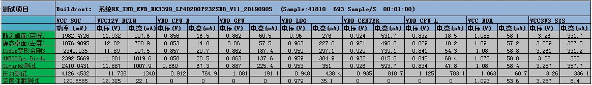
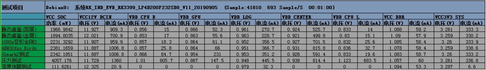
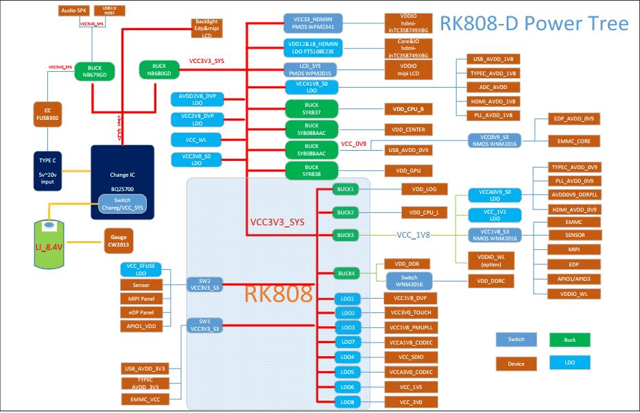

# Rockchip Linux Power Load Test

文档标识：RK-SM-YF-385

发布版本：V1.0.0

日期：2020-09-14

文件密级：□绝密   □秘密   □内部资料   ■公开

**免责声明**

本文档按“现状”提供，瑞芯微电子股份有限公司（“本公司”，下同）不对本文档的任何陈述、信息和内容的准确性、可靠性、完整性、适销性、特定目的性和非侵权性提供任何明示或暗示的声明或保证。本文档仅作为使用指导的参考。

由于产品版本升级或其他原因，本文档将可能在未经任何通知的情况下，不定期进行更新或修改。

**商标声明**

“Rockchip”、“瑞芯微”、“瑞芯”均为本公司的注册商标，归本公司所有。

本文档可能提及的其他所有注册商标或商标，由其各自拥有者所有。

**版权所有© 2020 瑞芯微电子股份有限公司**

超越合理使用范畴，非经本公司书面许可，任何单位和个人不得擅自摘抄、复制本文档内容的部分或全部，并不得以任何形式传播。

瑞芯微电子股份有限公司

Rockchip Electronics Co., Ltd.

地址：     福建省福州市铜盘路软件园A区18号

网址：     www.rock-chips.com

客户服务电话： +86-4007-700-590

客户服务传真： +86-591-83951833

客户服务邮箱： fae@rock-chips.com

---

**前言**

**概述**

文档主要介绍 Rockchip Linux 电源功耗的测试和优化的方法和步骤，旨在帮助工程师耗初步排查、优化、调试方法。达到系统性能和功耗合理性，以及提高安全性。

**读者对象**

本文档（本指南）主要适用于以下工程师：

技术支持工程师

软件开发工程师

**各芯片系统支持状态**

| **芯片名称** | **Buildroot** | **Debian 9** |
| ------------ | :------------ | :----------- |
| RK3399       | Y             | Y            |

 **修订记录**

| **日期**   | **版本** | **作者**    | **修改说明** |
| ---------- | :------- | :---------- | :----------- |
| 2020-09-14 | V1.0.0   | Caesar Wang | 初始版本     |

---

**目录**

[TOC]

---

## 系统场景功耗分析

RK3399测试条件主要如下：

- CPU: 4xA53+2xA72, 频率最高1.8GHz
- DDR: 最高频率856MHz
- GPU: 最高频率800MHz

以下主要介绍Buidroot/Debian9 Linux 系统中静态桌面、视频播放、压力测试和深度休眠的功耗数据。

### Buildroot 系统场景功耗



从上面数据分析来看：
屏幕的功耗在Pd=2.3W，静态桌面下的功耗Pui=10.8W，1080P视频的功耗Pl= 11.86W，4K@30fps视频的功耗Pb=12.1W，图形压力测试glmark2的功耗Pg= 11.98W，系统压力测试Ps=15.72W

- 静态桌面下Soc端的功耗Psui=1.88W

- 1080P视频Soc端的功耗Psl=2.34W

- 4K视频Soc端的功耗Psb=2.39W

- Glmark2的Soc端的功耗Psg=2.41W

- 压力测试下的Soc端功耗Pss=4.13W

- 深度休眠下的Soc端功耗Ps2=120.5mW

### Debian 9 系统场景功耗



从上面数据分析来看：
屏幕的功耗在Pd=2.4W，静态桌面下的功耗Pui=10.84W，1080P视频的功耗Pl=11.43W，4K@30fps视频的功耗Pb=11.96W，图形压力测试glmark2的功耗Pg=11.97W，系统压力测试Ps=15.95W

- 静态桌面下Soc端的功耗Psui=1.89W

- 1080P视频Soc端的功耗Psl=2.23W

- 4K视频Soc端的功耗Psb=2.38W

- Glmark2的Soc端的功耗Psg=2.34W

- 压力测试下的Soc端功耗Pss=4.06W

- 深度休眠下的Soc端功耗Ps2=111.6mW

## 系统功耗优化

### 功耗初步排查步骤

#### 对比总功耗

首先，对比同一场景下的总功耗，初步确认板子功耗是否正常。可参考上面章节各种场景的总功耗数据。假如客户板子总功耗和 RK 提供的 SDK 板参考数据差异较大，建议进一步分解功耗。

注意：测试功耗数据时，确保只有硬件差异，其他测试条件一致。例如对比 1080P/4K 视频播放场景的功耗数据、需视频片源相同、去除 edp 屏和 hdmi 显示等。

#### 分解各路功耗

为了详细分解功耗，熟悉项目 Power Tree 也是需要的。下图是 RK3399 挖掘机 Power Tree。在项目功耗优化过程中，可以根据硬件原理图列出 Power Tree，然后在对应电路上串一定阻值的电阻（一般推荐串 20mR 电阻），测量出对应电路的电流。RK3399 挖掘机分解了以下几路功耗：VCC3V3_SYS、VDD_CPU_B、VDD_CPU_L、VDD_GPU、VDD_LOG、VDD_0V9、VDD_CENTER、VCC_DDR、VCC_1V8。



分解功耗后，对比数据。先对比 CPU 大小核、GPU、DDR 功耗是否正常，确认 CPU 变频、GPU 变频、DDR 变频是否正常。假如有抬电压，确认抬的电压是否为 12.5mv 的整数倍。变频策略正常的情况下，则需要进一步对比分析其他外设功耗。

#### Clock 的检查

查看各个子系统 clock 状态，可以看到时钟频率、enable_count、prepare_count、父子时钟关系等。常用的 clock 命令如下（以 saradc 为例）：
查询 Clock Tree 命令：

```shell
# 获取总的Clock状态：
cat /sys/kernel/debug//clk/clk_summary

# 设置频率（单位 HZ）：
echo 24000000 > /sys/kernel/debug/clk_saradc/clk_rate

# 获取频率：
cat /sys/kernel/debug/clk_saradc/clk_rate

# 打开 clock：
echo 1 > /sys/kernel/debug/clk_saradc/clk_enable_count

# 关闭 clock：
echo 0 > /sys/kernel/debug/clk_saradc/clk_enable_count
```

注意：引用计数 enable_count,是驱动主动申请开启时钟后（clk_enable）引用计数就会+1。但是有一些默认常开的时钟，引用计数可能是 1 也可能是 0，这种查功耗可以不用太关心。主要关心没有使用的设备的 CLK 的 enable_cnt 是否为 0，如果不为 0，可以手动用关闭 CLK 的命令去关闭调试

#### Power domain (PD) 的检查

确认各个 PD 当前状态，没有使用的模块，其状态要是 suspend，然后这个 pd 下面所有的devices 都 suspend 后，这个 PD 就会关闭，详细如下：

查询 PD summary 命令：

```
 # cat /sys/kernel/debug/pm_genpd/pm_genpd_summary
domain                          status          slaves
    /device                                             runtime status
----------------------------------------------------------------------
pd_vopl                         on
    /devices/platform/ff8f3f00.iommu                    active
    /devices/platform/ff8f0000.vop                      active
pd_vopb                         off
    /devices/platform/ff903f00.iommu                    suspended
    /devices/platform/ff900000.vop                      suspended
pd_vo                           on              pd_vopb, pd_vopl
pd_tcpc1                        on
    /devices/platform/ff800000.phy                      active
pd_tcpc0                        on
    /devices/platform/ff7c0000.phy                      active
pd_isp1                         on
    /devices/platform/ff924000.iommu                    active
    /devices/platform/ff920000.rkisp1                   suspended
pd_isp0                         on
    /devices/platform/ff914000.iommu                    active
    /devices/platform/ff910000.rkisp1                   suspended
pd_hdcp                         on
    /devices/platform/ff940000.hdmi                     active
```

DTS 配置（以 vopb 为例）：

```
vopb: vop@ff900000 {
	power-domains = <&power RK3399_PD_VOPB>;
};
```

注意：如果 DTS 节点中没有引用 PD，这个 PD 认为没有 devices 使用，开机后会被框架关闭。如果上面 DTS 节点中，增加了 PD  的引用，但是 vop 驱动没有 runtime 的操作，这个 PD 是常开的（因为认为这个 device 是不支持的 runtime，状态会变成 unsupported）。如果 DTS 节点中增加 PD 引用，驱动中也有 runtime 操作，那么这个 PD 的状态就是看驱动主动申请是开还是关。降低运行功耗总结：查询 pd summary 和 clk tree，要求没有使用的模块，PD 和 CLK 需要关闭，避免内部 Mos 管的漏电。

### 功耗初步优化步骤

#### 修改默认背光值

[root@rk3399:/]# cat /sys/class/backlight/backlight/brightness
200

默认有0-255值可以设置,越大约亮, 可以设置到100,

echo 100 > /sys/class/backlight/backlight/brightness

当然可以结合实际再降低.

#### 降低刷新率

结合使用场景，实际GPU刷新率只有30fps以下，可以改dsi的刷新率

```
native-mode = <&mipi_1280x800>;
mipi_1280x800: mipi-1280x800 {
-clock-frequency = <76000000>;
+ clock-frequency = <60000000>;//45fps
hactive = <800>;
vactive = <1280>;
hsync-len = <10>;
```

#### 关闭ISP

在dts里面关闭一些没用到的模块，假如是USB camera，可以关闭ISP

```
+&isp0 {
+        status = "disabled";
+};
+
+&isp1 {
+        status = "disabled";
+};
+
+&isp0_mmu {
+        status = "disabled";
+};
+
+&isp1_mmu {
+        status = "disabled";
+};
```

#### 修改调频策略

```
--- a/arch/arm64/boot/dts/rockchip/rk3399-opp.dtsi
+++ b/arch/arm64/boot/dts/rockchip/rk3399-opp.dtsi
@@ -50,6 +50,8 @@
                rockchip,temp-hysteresis = <5000>;
                rockchip,low-temp = <10000>;
                rockchip,low-temp-min-volt = <900000>;
+               rockchip,high-temp = <45000>;
+               rockchip,high-temp-max-volt = <1000000>;

                nvmem-cells = <&cpul_leakage>, <&specification_serial_number>;
                nvmem-cell-names = "cpu_leakage",
@@ -141,6 +143,8 @@
                rockchip,temp-hysteresis = <5000>;
                rockchip,low-temp = <10000>;
                rockchip,low-temp-min-volt = <900000>;
+               rockchip,high-temp = <45000>;
+               rockchip,high-temp-max-volt = <1025000>;
                nvmem-cells = <&cpub_leakage>, <&specification_serial_number>;
                nvmem-cell-names = "cpu_leakage",
```

#### 调整 target load

默认load是90

```
[root@rk3399:/sys/devices/system/cpu/cpufreq/policy4/interactive]# cat target_loads
90
```

可以修改为:

```
[root@rk3399:/sys/devices/system/cpu/cpufreq/policy4/interactive]# cat target_loads
65 1008000:70 1200000:75 1416000:80 1608000:90
```
