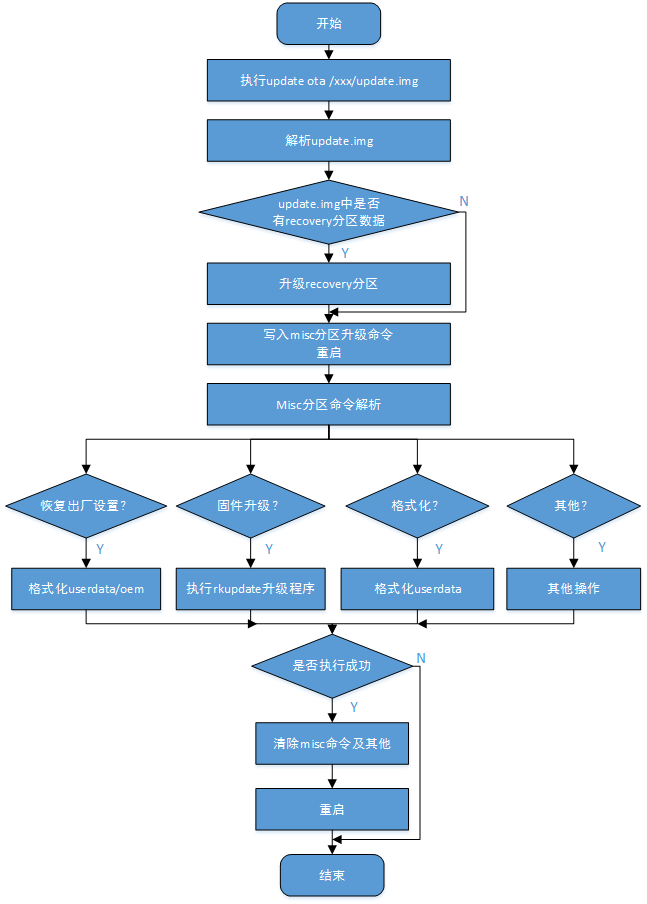

# Rockchip Linux Recovery升级开发指南

文件标识：RK-KF-YF-353

发布版本：V1.1.1

日期：2020-07-13

文件密级：□绝密   □秘密   □内部资料   ■公开

**免责声明**

本文档按“现状”提供，瑞芯微电子股份有限公司（“本公司”，下同）不对本文档的任何陈述、信息和内容的准确性、可靠性、完整性、适销性、特定目的性和非侵权性提供任何明示或暗示的声明或保证。本文档仅作为使用指导的参考。

由于产品版本升级或其他原因，本文档将可能在未经任何通知的情况下，不定期进行更新或修改。

**商标声明**

“Rockchip”、“瑞芯微”、“瑞芯”均为本公司的注册商标，归本公司所有。

本文档可能提及的其他所有注册商标或商标，由其各自拥有者所有。

**版权所有** **© 2020** **瑞芯微电子股份有限公司**

超越合理使用范畴，非经本公司书面许可，任何单位和个人不得擅自摘抄、复制本文档内容的部分或全部，并不得以任何形式传播。

瑞芯微电子股份有限公司

Rockchip Electronics Co., Ltd.

地址：     福建省福州市铜盘路软件园A区18号

网址：     [www.rock-chips.com](http://www.rock-chips.com)

客户服务电话： +86-4007-700-590

客户服务传真： +86-591-83951833

客户服务邮箱： [fae@rock-chips.com](mailto:fae@rock-chips.com)

---

**前言**

**概述**

本文档主要介绍 Rockchip 处理器在 OTA 升级时的 recovery 开发流程以及技术细节。
本文中详细介绍了该方案的开发过程以及注意事项。

**产品版本**

| **芯片名称**                                    | **内核版本** |
| ----------------------------------------------- | ------------ |
| RK3308、RK3226、RK3399、RK3288、RK3326、PX30 等 | Linux 4.4    |

**读者对象**

本文档（本指南）主要适用于以下工程师：

技术支持工程师

软件开发工程师

**修订记录**

| **版本号** | **作者**   | **修改日期** | **修改说明**                                           |
| ---------- | ---------- | :----------- | ------------------------------------------------------ |
| V1.0.0     | 马龙昌     | 2018-09-18   | 初始版本                                               |
| V1.0.1     | 马龙昌     | 2018-10-16   | 增加恢复出厂模式一节                                   |
| V1.0.2     | 马龙昌     | 2018-11-06   | 增加 SD 卡启动盘升级一章<br />附录章节增加常见问题汇总 |
| V1.0.3     | 马龙昌     | 2018-11-28   | 修改 1.2 节<br />增加 4.3.3 小节<br />增加 4.3.4 小节  |
| V1.0.4     | 马龙昌     | 2018-12-18   | 修改 1.3 小节<br />增加 2.2 小节                       |
| V1.0.5     | 马龙昌     | 2019-05-14   | 增加 4.1.1 小节<br />修改 4.3.4 小节                   |
| V1.0.6     | 马龙昌     | 2019-06-26   | 增加 2.2.1 小节                                        |
| V1.0.7     | 马龙昌     | 2019-08-23   | 增加 2.3 小节                                          |
| V1.1.0     | 马龙昌     | 2020-03-31   | 修改1.3小节<br />重新调整4.3小节                       |
| V1.1.1     | Ruby Zhang | 2020-07-13   | 格式修订                                               |

---

**目录**

[TOC]

---

## OTA升级

### 概述

OTA（Over-the-Air）即空间下载技术。 OTA 升级是 Android 系统提供的标准软件升级方式。它功能强大，可以无损失升级系统，主要通过网络，例如 WIFI、3G/4G 自动下载 OTA 升级包、自动升级，也支持通过下载 OTA 升级包到 SD 卡/U 盘升级，OTA 的升级包非常的小，一般几 MB 到十几 MB。

本文主要介绍了使用 OTA 技术升级时，本地升级程序 recovery 执行升级的流程及技术细节，以便用户在开发过程中了解升级的过程及注意事项。

### 编译

- **rootfs 主系统**

  rootfs 需要打开update 的支持，configs 文件配置 BR2_PACKAGE_UPDATE=y。

```bash
  source envsetup.sh
  #choose a combo number to build rootfs according to platform chip
  make menuconfig
```

  具体配置如下：

```makefile
  Target packages  --->
  	[*] Rockchip BSP packages  --->
  		[*]   Rockchip OTA update for linux
```

- **Recovery**

  `buildroot/configs/rockchip/recovery.config`中已经将不同平台的recovery配置抽取出来了。

  只需系统根目录下执行：

```bash
   ./build.sh recovery
```

  成功后，会生成文件 `buildroot/output/rockchip_rkxxxx_recovery/images/recovery.img`。rkxxxx为
具体某一芯片名称。

  执行：

```bash
 ./mkfirmware.sh
```

  会将生成的固件拷贝至 rockdev/目录下。

  与 recovery 相关的主要源码路径：

  `external/recovery/` ：主要生成 recovery 二进制 bin 程序，recovery 模式下的关键程序。

  `external/rkupdate/`：主要生成 rkupdate 二进制 bin 程序，解析 update.img 固件中各个分区数据，并执行对各分区执行升级的关键程序，该程序被recovery 二进制bin程序内部调用。

  若有修改以上两个目录中的源码文件之后的编译方法：
  1. `source envsetup.sh`
  2. 选择某一平台的 recovery 配置
  3. `make recovery-dirclean && make recovery`
  4. `make rkupdate-dirclean && make rkupdate`
  5. `./build.sh recovery`
  6. `./mkfirmware.sh`
  7. 烧写 recovery.img

### 升级流程

#### 升级固件准备

修改 `tools/linux/Linux_Pack_Firmware/rockdev/package-file`，根据需要升级的分区配置，修改该文件。

根目录下执行命令：

```bash
./build.sh updateimg
```

命令执行成功后，会将package-file指定的分区镜像打包生成update.img 升级固件，放在 rockdev/目录下。使用该update.img 升级。

如果升级过程中遇到错误“Error！imageHead.uiTag !=0x57464B52”，该错误表明固件打包有错误，请按照上述操作，重新生成 update.img 重试。


#### 升级过程

- 将升级固件 update.img 放在 SD 卡或 U 盘根目录或者设备的/userdata 目录下。

- Normal 系统下执行升级程序  `update ota /xxx/update.img`，设备将会进入 recovery 模式，并进行升级。

  可使用的路径如下：

  U 盘的挂载路径：`/udisk`

  sdcard 的挂载路径：`/mnt/sdcard/ 或/sdcard`

  flash 的挂载路径：`/userdata/`

- 升级成功后会 reboot 到正常的 normal 系统。

升级流程图如下：



### 恢复出厂模式

我们把可以读写的配置文件保存在 userdata 分区，出厂固件会默认一些配置参数，用户使用一
段时间后会生成或修改配置文件，有时用户需要清除这些数据，我们就需要恢复到出厂配置。直接运行`update`后面不加任何参数或者加 `factory/reset` 参数均可进入 recovery 后恢复出厂配置。

### 注意事项

- 打包 update.img 固件时需要注意，升级固件不一定要全分区升级，可修改 package-file 文件，将不要升级的分区去掉，这样可以减少升级包（update.img ）的大小。

- package-file 中 recovery.img 如果打包进去的话 ，不会在 Recovery 模式中升级，为了预防升级 recovery.img过程中掉电导致后面其他分区无法正常升级的问题，该分区升级放在 normal 系统下升级，即，执行`update`命令时会先检测 update.img 升级包中是否有打包 recovery.img，若有则升级 recovery 分区，再进入 Recovery 模式升级其他分区固件。

- misc 分区不建议打包进 update.img 中，即使有打包进去，也会在升级程序中加载判断到而忽略该分区，即使升级了 misc 分区，升级成功后 recovery 程序仍会清空 misc 分区中所有的命令及参数，从而导致达不到预想的结果。

- 如果将 update.img 升级包放置在 flash 中的 userdata 分区，则需要保证 package-file 中括 不包括 userdata.img 被打包进去，原因是可能会导致文件系统的损坏，升级成功后可能使 oem或 userdata 分区mount不成功。若从SD卡或 U 盘升级时，可以打包 userdata.img，从而对userdata 分区进行升级。升级完成后会对 userdata 分区重新resize 操作。

## 运行调试

### Recovery 模式中log的查看

`buildroot/output/rockchip_rkxxxx_recovery/target` 目录下创建一个隐藏文件，

```bash
touch .rkdebug
```

可将Recovery 模式中升级的 log 在串口中打印出来。


另外一种是通过查看 userdata/recovery/Log 文件

升级之后，在设备 userdata/recovery 目录中查看 log 文件。

```bash
cat userdata/recovery/log
```

### 带屏设备与不带屏设备

Recovery 执行过程中如果失败，且提示如下 log 信息：

```bash
failed to read font: res=-1, fall back to the compiled-in font
cannot find/open a drm device: No such file or directory
```

从log 可知，找不到或者打不开一个 drm 设备，此时如果开发的是带屏的设备，需要接上显示屏，如果是开发不带屏的设备需要进行如下配置。

默认 SDK 代码 recovery 配置中为不带屏设备。

```bash
cd Path_to_SDK/buildroot/package/rockchip/recovery

vim recovery.mk
```

打开 `buildroot/package/rockchip/recovery` 中的 recovery Makefile 文件如下图所示：


上图中，若配置了BR2_PACKAGE_RECOVERY_NO_UI，则定义RecoveryNoUi的宏定义为true。否则会链接显示相关的库。

```makefile
ifeq ($(BR2_PACKAGE_RECOVERY_NO_UI),y)
	TARGET_MAKE_ENV += RecoveryNoUi=true
else
	RECOVERY_BUILD_OPTS += -lz -lpng -ldrm
	RECOVERY_DEPENDENCIES += libzlib libpng libdrm
endif
```

故若不带屏设备需要在Recovery配置中打开BR2_PACKAGE_RECOVERY_NO_UI的配置。

修改后的编译：

1. `source envsetup.sh rockchip_xxxx_recovery` (xxxx 为具体芯片平台）
2. `make menuconfig`，打开配置No UI for recovery。
3. `make recovery-dirclean && make recovery`
4. `./build.sh recovery`
5. `./mkimage.sh`
6. 烧录 rockdev/recovery.img

#### 带屏设备的旋转与显示

- 若需要将 Recovery 升级过程中显示的界面根据显示设备的方向做一些旋转操作，可按如下说明操作。
  1. 更新Recovery 代码到最新。
  2. 修改 minui/graphics.c 中 gr_init 函数调用的 gr_rotate 接口函数的参数。
  旋转参数说明：
  ROTATION_NONE 默认不做旋转
  ROTATION_RIGHT 顺时针旋转 90°
  ROTATION_DOWN 顺时针旋转 180°
  ROTATION_LEFT 顺时针旋转 270°
  3. 重新编译 Recovery，生成 Recovery 分区固件，烧录。

- 若需要调整 UI 显示的亮度，可修改 gr_color 接口中最后一个参数 alpha 透明度。最大值 255 为不透明，最小值0 表示全透明。

- 更换 Recovery 中 UI 显示的背景图片。可自行更换 external/recovery/res/images 目录下的图片文件，保持文件名不变。

### Debian 与 Ubuntu 系统的升级

与 Buildroot recovery 升级一样，该Recovery OTA升级方案也支持 Debian 或 Ubuntu 系统下的升级。由于Recovery 模式下升级需要通过设备各个分区节点来识别并写入不同设备分区节点的固件数据，Buildroot 系统是通过 udev 中的别名方式（by-name）来对设备分区节点做了通用的易识别的处理。Debian 或 Ubuntu 系统中因为缺少这样的方式，导致了实际中不 Recovery 不能正常运行的情况，所以只需要将 Debian 或 Ubuntu 系统中设备分区的节点也跟Buildroot 系统下可通过 by-name 别名方式标识出来，Recovery 即可正常工作。

具体修改方式如下：

`buildroot/output/rockchip_rkxxxx/target/lib/udev/rules.d/61-partition-init.rules`，或者`buildroot/output/rockchip_rkxxxx_recovery/target/lib/udev/rules.d/61-partition-init.rules`

拷贝到 Debian 或 Ubuntu 系统下相关的位置，如 rootfs/overlay-debug/lib/udev/rules.d/ 下。此处 rkxxxx 为具体某一 rk

芯片平台（RK3308、RK3328、RK3399、RK3326 等）。修改的目的就是开机启动后可以将 Debian 系统或 Ubuntu 系统中各个分区节点形如`/dev/mmcblk0p0` 、`/dev/mmcblk0p1`、`/dev/mmcblk0p2`、`/dev/mmcblk0p3` ... 修改为
`/dev/block/by-name/uboot`、`/dev/block/by-name/misc`、`/dev/block/by-name/boot`、`/dev/block/by-name/rootfs`...等。

## SD 卡制作启动盘升级

本章节主要为了解决使用 SD 卡启动，进行裸片升级的需求，详细描述 SD 卡启动盘的制作及相关升级的问题。

使用工程目录中 `tools\windows\SDDiskTool` 中的 SD 卡启动盘升级制作工具制作 SD卡启动盘。


选择固件中选择打包好的 update.img 文件。

所有准备工作完成后，点击开始创建按钮，如果创建成功，会弹窗提示。

此时 SD 卡中根目录会存在两个文件，其中选择升级的固件 update.img，会被命名为 sdupdate.img.

所有准备工作做好后，设备中插入 SD 卡，并重新上电。

Log 中如果出现下面内容，说明 SD 卡启动设备成功：

```bash
U-Boot 2017.09-g1bee468 (Oct 11 2018 - 16:53:06 +0800) V1.000
Model: USM-110 a102-1
Board:Advantech usm110_rk3288 Board,HW version:0
DRAM: 2 GiB
Relocation Offset is: 7ff5a000
PMIC: RK808
vdd_arm 1100000 uV
vdd_gpu 1100000 uV
vcc_io 3300000 uV
regulator(LDO_REG2) init 3300000 uV
regulator(LDO_REG3) init 1100000 uV
regulator(LDO_REG4) init 1800000 uV
regulator(LDO_REG5) init 3300000 uV
regulator(LDO_REG6) init 1100000 uV
regulator(LDO_REG7) init 1800000 uV
regulator(LDO_REG8) init 1800000 uV
MMC: dwmmc@ff0c0000: 1, dwmmc@ff0f0000: 0
SF: Detected w25q32bv with page size 256 Bytes, erase size 4 KiB, total 4 MiB
*** Warning - bad CRC, using default environment
In: serial
Out: serial
Err: serial
switch to partitions #0, OK
mmc1 is current device
do_rkimg_test found IDB in SDcard
Boot from SDcard
enter Recovery mode!
SF: Detected w25q32bv with page size 256 Bytes, erase size 4 KiB, total 4 MiB
Skipped ethaddr assignment due to invalid,using default!
Net: No ethernet found.
Hit any key to stop autoboot: 0
ANDROID: reboot reason: "recovery"
FDT load addr 0x10f00000 size 263 KiB
Booting kernel at 0x3575c70 with fdt at 42cf470...
```

若串口 log 中打印如下的 log，说明 SD 卡启动进入了 recovery 固件对裸片设备的升级过程。

```bash
firmware update will from SDCARD.
is_sdcard_update out
sdupdate_package = /mnt/sdcard/sdupdate.img
Command: "/usr/bin/recovery"
sdboot update will update from /mnt/sdcard/sdupdate.img
start with main.
```

## 附录

### misc 分区说明

misc 其实是英文 miscellaneous 的前四个字母，杂项、混合体、大杂烩的意思。

misc 分区的概念来源于 Android 系统，Linux 系统中常用来作为系统升级时或者恢复出厂设置时使用。

misc 分区的读写：misc 分区在以下情况下会被读写。

​    1) Uboot：设备加电启动时，首先启动 Uboot，在 Uboot 中会读取 misc 分区的内容。根据 misc分区中 command 命令内容决定是进入正常系统还是 recovery 模式。

​        Command 为 boot-recovery，则进入 recovery 模式。

​        Command 为空，则进入正常系统。

​    2) Recovery：在设备进入 recovery 模式中，可以读取 misc 分区中 recovery 部分的内容，从而执行不同的动作，或升级分区固件，或擦除用户分区数据，或其他操作等等。

misc 分区的结构及内容：

misc 分区的结构组成详见下图。


下面以 RK3308 平台使用的 misc 分区为例，使用 winhex 或 ultraEdit 等工具，以二进制形式打开misc.img 文件，在距文件开始位置偏移 16K（16384 Byte）字节位置处开始，存放 BootLoader Msg结构体的内容。


Recovery 中支持的命令部分，可参考 external/recovery/recovery.c 中 OPTIONS 结构中内容。

#### misc.img 选择

SDK 根目录 `device/rockchip/rockimg` 目录下是经常使用的 misc.img 文件。生成固件的时候根据配置选择拷贝哪一个 misc.img 的文件。

```bash
.
├ ── blank-misc.img		#空白的 misc 分区文件
├── pcba_small_misc.img #不常用
├── pcba_whole_misc.img #不常用
└── wipe_all-misc.img   #格式化用户分区使用的 misc 分区文件
```

常用的两种 misc.img 文件是 blank-misc.img 与 wipe_all-misc.img。

打开具体芯片平台的 BoardConfig.mk 文件， 可配置 misc.img 的具体使用。

```bash
cd device/rockchip/rkxxxx
vim BoardConfig.mk
```


从上图中可看到，默认使用 `wipe_all-misc.img` 作为 misc 分区的固件，使用该 misc固件，烧写后会格式化用户（/userdata 或/data ）分区与客制（/oem）分区的数据。若希望开机不进入 recovery 模式，而进入正常系统，可以修改 `BoardConfig.mk` 这里 misc image 的具体文件为 `blank-misc.img`。然后重新编译，生成新的固件。

### Recovery 不同场景下的使用

#### 第一次开机

烧写过 misc.img、recovery.img 的设备会进入第一次开机流程。

串口log打印如下内容：

```bash
Boot command: boot-recovery
Got arguments from boot message
Command: "recovery" "--wipe_all"
format '/dev/block/by-name/userdata' to ext2 filesystem
executing '/sbin/mke2fs'
executed '/sbin/mke2fs' done
executed '/sbin/mke2fs' return 0
executing '/sbin/e2fsck'
e2fsck 1.43.9 (8-Feb-2018)
Pass 1: Checking inodes, blocks, and sizes
Pass 2: Checking directory structure
Pass 3: Checking directory connectivity
Pass 4: Checking reference counts
Pass 5: Checking group summary information
/dev/block/by-name/userdata: 11/2304 files (0.0% non-contiguous), 82/2299 blocks
executed '/sbin/e2fsck' done
executed '/sbin/e2fsck' return 0
executing '/usr/sbin/e2fsck'
e2fsck 1.43.9 (8-Feb-2018)
Pass 1: Checking inodes, blocks, and sizes
Pass 2: Checking directory structure
Pass 3: Checking directory connectivity
Pass 4: Checking reference counts
Pass 5: Checking group summary information
/dev/block/by-name/oem: 18/2448 files (0.0% non-contiguous), 513/16384 blocks
executed '/usr/sbin/e2fsck' done
executed '/usr/sbin/e2fsck' return 1
executing '/usr/sbin/resize2fs'
resize2fs 1.43.9 (8-Feb-2018)
The filesystem is already 16384 (1k) blocks long. Nothing to do!
executed '/usr/sbin/resize2fs' done
executed '/usr/sbin/resize2fs' return 0
```

#### 恢复出厂设置

命令行运行`update`程序，设备会进入 recovery，并进行格式化，格式化完成之后会自动进入 normal 系统。

```bash
update （或 update reset）
```

串口log打印如下内容：

```bash
I:Boot command: boot-recovery
I:Got arguments from boot message
Command: "recovery" "--wipe_data"
format '/dev/block/by-name/userdata' to ext2 filesystem
executing '/sbin/mke2fs'
[ 4.692437] vendor storage:20160801 ret = -1
[ 6.030842] phy phy-ff008000.syscon:usb2-phy@100.0: charger =
USB_SDP_CHARGER
[ 10.891460] random: nonblocking pool is initialized
```

#### 升级

执行`update ota /xxx/update.img`，设备会进入 recovery，并进行升级。

```
update ota /udisk/update.img
```

以从 U 盘升级为例，串口可能打印的 log 如下：

```bash
I:Boot command: boot-recovery
I:Got arguments from boot message
Command: "recovery" "--update_package=/udisk/update.img"
。。。。
librkupdate_ui_print = parameter writing....
########### RKA_Gpt_Download #########
librkupdate_###### Download trust ... #######
```

### 常见问题汇总

#### “cannot find/open a drm device ”

常见在非 RK3308 平台，进入 recovery 模式后串口打印如下 log：

```bash
we are in recovery, skip init oem/userdata
start debug recovery...
Starting recovery on Fri Jan 18 09:19:51 2013
failed to read font: res=-1, fall back to the compiled-in font
Starting network: cannot find/open a drm device: No such file or directory
```

遇到此情况时，解决方法是：接上设备支持的显示屏，或者 HDMI 设备。

原因分析：从提示的 log 看是找不到或者打开drm 设备失败。因为，默认非 RK3308 平台 recovery程序的编译是打开支持 UI 显示的，如果进入 recovery 模式之后，打开显示设备失败，则会导致 recovery执行失败。

解决方式：

1、`source envsetup.sh`

2、现在使用平台的recovery配置编号，回车

3、`make menuconfig`，打开`No UI for recovery`的配置

```bash
> Target packages  --->
    [*] Rockchip BSP packages  --->
        [*]   Rockchip recovery for linux
        [*]   No UI for recovery
        [ ]   Linux AB bool control
           Linux A/B bringup features. (successful_boot)  --->
           choice the update bin of recovery. (rkupdate)  --->
        -*-   recovery bin
        [ ]   updateEngine bin
```

`external/recovery/Makefile` 中就不会编译与显示相关的代码。


4、重新编译 recovery包

```bash
make recovery-dirclean && make recovery
```

5、重新生成 recovery 固件

```bash
./build.sh recovery
```

6、生成固件。

```
./mkfirmware.sh
```

#### misc 分区固件修改默认命令

如果想修改 misc 固件中打包不同的 recovery 命令，或者使用空白的 misc 分区固件。可按如下方式修改：

工程根目录下：修改 mkfirmware.sh。


#### userdata 分区设置为 vfat 文件系统

SDK 中默认 userdata 分区为 ext2/ext4 文件系统，若想修改为 vfat32 文件系统，可按如下修改：

1. 修改 `board/rockchip/rkxxxx/fs-overlay-recovery/etc/fstab`

   修改前：

   ```bash
   /dev/block/by-name/userdata /userdata ext2 defaults0
   ```

   修改后：

   ```bash
   /dev/block/by-name/userdata /userdata vfat defaults0 0
   ```

2. 修改 `configs/rockchip_rkxxxx_release_defconfig`

   增加以下配置：

   ```Makefile
   BR2_PACKAGE_DOSFSTOOLS=y
   BR2_PACKAGE_DOSFSTOOLS_FATLABEL=y
   BR2_PACKAGE_DOSFSTOOLS_FSCK_FAT=y
   BR2_PACKAGE_DOSFSTOOLS_MKFS_FAT=y
   ```

3. 修改 `package/rockchip/usbdevice/S50usbdevice`

   ```bash
   start)
   mkdir /dev/usb-ffs -m 0770
   mkdir /dev/usb-ffs/adb -m 0770
   mount -t configfs none /sys/kernel/config
   mkdir /sys/kernel/config/usb_gadget/rockchip -m 0770
   echo 0x2207 > /sys/kernel/config/usb_gadget/rockchip/idVendor
   echo "ums_adb" >
   /sys/kernel/config/usb_gadget/rockchip/configs/b.1/strings/0x409/configuration
   mount -t functionfs adb /dev/usb-ffs/adb
   mount -t vfat /dev/disk/by-partlabel/userdata /media/usb0
   export service_adb_tcp_port=5555
   adbd &
   sleep 1
   ```

4. 确保已更新以下补丁

   0001-common-mk-userdata-Fix-wrong-FS_TYPE-check.patch

   ```bash
   case $FS_TYPE in
   ext[2-4])
   $COMMON_DIR/mke2img.sh $USERDATA_DIR $USERDATA_IMG
   ;;
   fat|vfat)
   SIZE=$(du -h -BM --max-depth=1 $USERDATA_DIR|awk '{print int($1)}')
   # echo "create image size=${SIZE}M"
   dd if=/dev/zero of=$USERDATA_IMG bs=1M count=$SIZE >/dev/null 2>&1
   mkfs.vfat $USERDATA_IMG >/dev/null 2>&1
   mcopy -i $USERDATA_IMG $USERDATA_DIR/* ::/ >/dev/null 2>&1
   ;;
   *)
   echo "file system: $FS_TYPE not support."
   exit 1
   ;;
   Esac
   ```

5. 修改 `common/mk-userdata.sh`

   ```bash
   SIZE=$(du -h -BM --max-depth=1 $USERDATA_DIR|awk '{print int($1)}')
   # echo "create image size=${SIZE}M"
   dd if=/dev/zero of=$USERDATA_IMG bs=1M count=$SIZE >/dev/null 2>&1
   mkfs.vfat -F 32 $USERDATA_IMG >/dev/null 2>&1
   mcopy -i $USERDATA_IMG $USERDATA_DIR/* ::/ >/dev/null 2>&1
   ;;
   *)
   ```

6. 修改 rk3308/BoardConfig.mk

   ~~export RK_USERDATA_FS_TYPE=ext2~~

   ```bash
   # Set userdata partition type, including ext2, fat
   export RK_USERDATA_FS_TYPE=vfat
   ```

#### userdata （或/data ）分区不格式化

BoardConfig.mk 中配置了 `wipe_all-misc.img`，却不希望格式化用户或客制（userdata 或 oem）分区，此时需要修改 recovery 的代码。修改 `external/recovery/reocvery.c`： main 函数中如下图的代码，将下图红框中的代码注释掉后，重新编译 recovery 分区固件，烧写 recovery 分区固件即可。


