# Rockchip Linux Recovery Developer Guide

ID: RK-KF-YF-353

Release Version: V1.1.0

Release Date: 2020-03-31

Security Level: □Top-Secret   □Secret   □Internal   ■Public

---

**DISCLAIMER**

THIS DOCUMENT IS PROVIDED “AS IS”. FUZHOU ROCKCHIP ELECTRONICS CO., LTD.(“ROCKCHIP”)DOES NOT PROVIDE ANY WARRANTY OF ANY KIND, EXPRESSED, IMPLIED OR OTHERWISE, WITH RESPECT TO THE ACCURACY, RELIABILITY, COMPLETENESS,MERCHANTABILITY, FITNESS FOR ANY PARTICULAR PURPOSE OR NON-INFRINGEMENT OF ANY REPRESENTATION, INFORMATION AND CONTENT IN THIS DOCUMENT. THIS DOCUMENT IS FOR REFERENCE ONLY. THIS DOCUMENT MAY BE UPDATED OR CHANGED WITHOUT ANY NOTICE AT ANY TIME DUE TO THE UPGRADES OF THE PRODUCT OR ANY OTHER REASONS.

**Trademark Statement**

"Rockchip", "瑞芯微", "瑞芯" shall be Rockchip’s registered trademarks and owned by Rockchip. All the other trademarks or registered trademarks mentioned in this document shall be owned by their respective owners.

**All rights reserved. ©2019. Fuzhou Rockchip Electronics Co., Ltd.**

Beyond the scope of fair use, neither any entity nor individual shall extract, copy, or distribute this document in any form in whole or in part without the written approval of Rockchip.

Fuzhou Rockchip Electronics Co., Ltd.

No.18 Building, A District, No.89, software Boulevard Fuzhou, Fujian,PRC

Website:     [www.rock-chips.com](http://www.rock-chips.com)

Customer service Tel:  +86-4007-700-590

Customer service Fax:  +86-591-83951833

Customer service e-Mail:  [fae@rock-chips.com](mailto:fae@rock-chips.com)

---

## Preface

**Overview**

This document presents an overview and some notices of recovery development process and technical details for OTA upgrading of Rockchip processors.

**Product Version**

| **Chipset**                                             | **Kernel Version** |
| ------------------------------------------------------- | ------------------ |
| RK3308、RK3226、RK3399、RK3288、RK3326、PX30  and so on | Linux 4.4          |

**Intended Audience**

This document (this guide) is mainly intended for:

Technical support engineers

Software development engineers

**Revision History**

| **Version** | **Author** | **Date**   | **Change Description**                                       |
| ----------- | ---------- | :--------- | ------------------------------------------------------------ |
| V1.0.0      | Chad Ma    | 2018-09-18 | Initial version release                                      |
| V1.0.1      | Chad Ma    | 2018-10-16 | Add reset to factory mode chapter                            |
| V1.0.2      | Chad Ma    | 2018-11-06 | Add SD card boot up upgrading chapter<br />Add frequently asked questions summary in Appendix |
| V1.0.3      | Chad Ma    | 2018-11-28 | Modify chapter 1.2 <br />Add chapter 4.3.3 <br />Add chapter 4.3.4 |
| V1.0.4      | Chad Ma    | 2018-12-18 | Modify chapter 1.3 <br />Add chapter 2.2                     |
| V1.0.5      | Chad Ma    | 2019-05-14 | Add chapter 4.1.1 <br />Modify chapter 4.3.4                 |
| V1.0.6      | Chad Ma    | 2019-06-26 | Add chapter 2.2.1                                            |
| V1.0.7      | Chad Ma    | 2019-08-23 | Add chapter 2.3                                              |
| V1.1.0      | Chad Ma    | 2020-03-31 | Modify 1.3<br />Modify 4.3                                   |

## Contents

---

[TOC]

---

## 1 OTA Upgrading

### 1.1 Overview

OTA (Over-the-Air) is a space download technology. OTA upgrading is the standard software upgrading method provided by Android system. It is powerful and can upgrade system without loss, mainly through network such as WIFI, 3G/4G to download OTA package and upgrade automatically, also support to download OTA package to SD card or USB Flash drive to upgrade. OTA package is very small, generally from several MB to a dozen MB.

This document mainly introduces the local upgrading program of recovery execution process and technical details when using OTA technology to upgrade, to help customers understand the upgrading process and notices during development.

### 1.2 Build

- **rootfs main system**

The `update` should be enable in rootfs , set  `BR2_PACKAGE_UPDATE=y` in configs file.

```bash
source envsetup.sh
#choose a combo number to build rootfs according to platform chip
make menuconfig
```

Detailed configurations are as follows:

```makefile
Target packages  --->
[*] Rockchip BSP packages  --->
[*]   Rockchip OTA update for linux
```

- **Recovery**

The recovery configurations of different platforms are independent: in: `buildroot/configs/rockchip/recovery.config`

Just run the following command in system root directory:

```bash
./build.sh recovery
```

It will generate the following file when run successfully: `buildroot/output/rockchip_rkxxxx_recovery/images/recovery.img`

rkxxxx is the detailed chip name.

Execute the following command:

```bash
./mkfirmware.sh
```

Will copy the generated firmware to the directory of rockdev/.

The path of the main source code related with recovery are as follows:

`external/recovery/`: generate recovery binary files, it is the key program of recovery mode.

`external/rkupdate/`:  generate rkupdate binary files, parse the
date of each partition in the update.img firmware and execute the key program of upgrade for each
partition.

If the source files in above two directories are changed, please
refer to the following build method:

1. `source envsetup.sh`
2. Select the recovery configuration of one platform
3. `make recovery-dirclean && recovery`
4. `make rkupdate-dirclean && make rkupdate`
5. `./build.sh recovery`
6. `./mkfirmware.sh`
7. Flash recovery.img

### 1.3 Upgrading Process

#### 1.3.1 Firmware Preparation for Upgrade

Modify `tools/linux/Linux_Pack_Firmware/rockdev/package-file`  based on the partition configuration that needs to be upgraded,

Execute the following command in the root directory:

```bash
./build.sh updateimg
```

When successful, the partition image specified by the package-file will be packaged to generate the update.img firmware, and will be placed in the rockdev/ directory, finally updated using this update.img.

If the error “Error！imageHead.uiTag !=0x57464B52” occurs during upgrading, it means there are errors with firmware package. Please follow the above steps to regenerate update.img and retry.

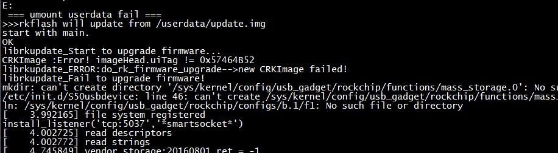

#### 1.3.2 Upgrading Process

- Put the upgrading firmware update.img in the root directory of the SD card or U disk or in the /userdata directory of the device.

- Execute the program: `update ota /xxx/update.img` in normal system, the device will enter recovery mode and start upgrading

The usable paths are as below:

U disk mount path:`/udisk`

SD card mount path:`/mnt/sdcard/ or /sdcard`

Flash mount path: /userdata/`

- After upgrading successfully, the device will reboot to normal system.

Upgrading flow chart is as follows:

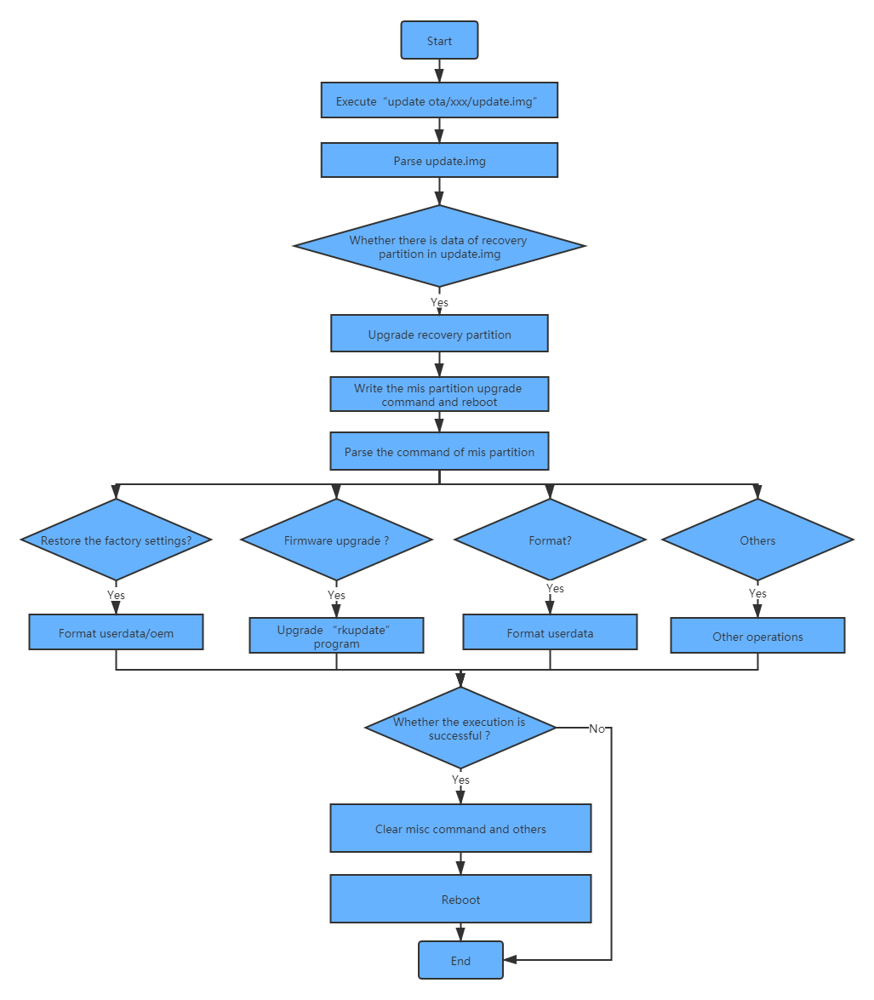

### 1.4 Restore the Factory Mode

The readable and writable configuration files are saved in the userdata partition. There are some default configuration parameters with factory firmware and users may generate or modify the configuration files after using for a period of time. Sometimes users want to erase these data, and then they need to restore the factory configuration.

Directly run `update`without adding any parameter or adding  `factory/reset` parameters will enter recovery to restore the factory mode.

### 1.5 Notices

- When packing update.img, need to pay attention to that, full partition upgrading is not necessary for firmware upgrading, you can change the package-file to remove the partition which is no need to upgrade, and in this way you will reduce the size of upgrading package (update.img).

- If recovery.img is packed in package-file, it will not upgrade in recovery mode, in order to prevent that other partitions cannot upgrade normally due to power off during recovery.img upgrading, this partition upgrading is done in normal system, that is, it will check if the recovery.img is packed in update.img package before executing `update` command, if so, it will upgrade recovery partition and then enter recovery mode to upgrade other partition images.

- Do not recommend to pack misc partition into update.img. Even if it is packed, it will also be checked and ignored while loading the upgrading program. Even if the misc partition is upgraded, after upgrading successfully, recovery program will still clear up all the commands and parameters in misc partition, as a result, the expected results cannot be achieved.

- If putting the update.img package in userdata partition of flash, need to ensure that userdata.img is not packed in package-file. Because it may cause the damage of the file system, and make the oem or userdata partitions fail to mount after upgrading successfully. If upgrading from SD card or U disk, userdata.img can be packed to update userdata partition. It will resize userdata partition after upgrading.

## 2 Debugging

### 2.1 Check the Log of Recovery Mode

Create a hidden file in the directory: `buildroot/output/rockchip_rkxxxx_recovery/target`:

```bash
touch .rkdebug
```

It is going to print out the upgrade log of recovery mode through serial port:

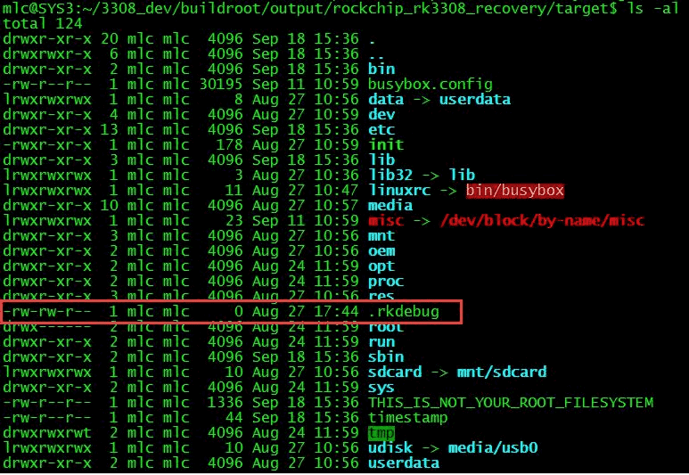

The other way is checking through userdata/recovery/Log file.

After upgrading successfully, check log files in the directory of userdata/recovery on the device.

```bash
cat userdata/recovery/log
```

### 2.2 With and Without Panels

If it failed during recovery process and prompt below log:

```bash
failed to read font: res=-1, fall back to the compiled-in font
cannot find/open a drm device: No such file or directory
```

The log means it cannot find or open a drm device, if it is a device with panels, need to connect a panel; if not, need to do the following configurations.

Devices are all without panels by default in recovery configuration of SDK code.

```bash
cd Path_to_SDK/buildroot/package/rockchip/recovery

vim recovery.mk
```

Open the recovery Makefile of `buildroot/package/rockchip/recovery` as shown below:

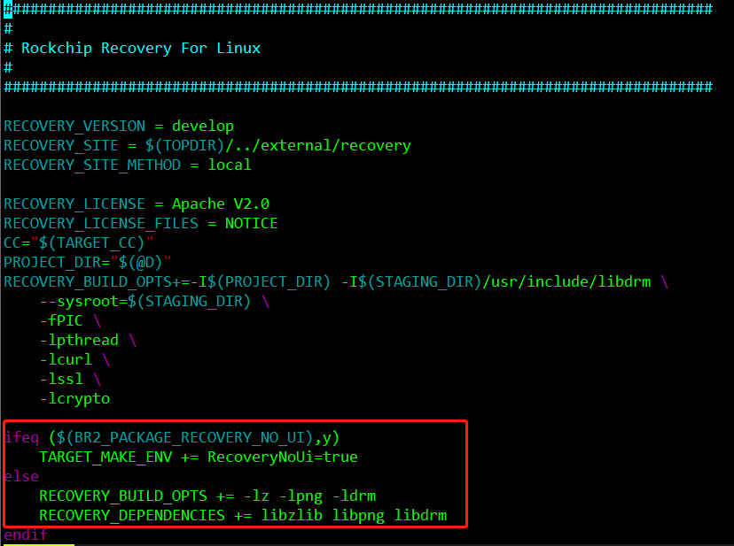

As showed in the figure above, if BR2_PACKAGE_RECOVERY_NO_UI is configured, the macro RecoveryNoUi is defined as true. Otherwise the related libraries are linked and displayed.

```makefile
ifeq ($(BR2_PACKAGE_RECOVERY_NO_UI),y)
TARGET_MAKE_ENV += RecoveryNoUi=true
else
RECOVERY_BUILD_OPTS += -lz -lpng -ldrm
RECOVERY_DEPENDENCIES += libzlib libpng libdrm
endif
```

Therefore, For devices without panels, the configuration of BR2_PACKAGE_RECOVERY_NO_UI should be enabled in the recovery configuration.

Build after modifying:

1. `source envsetup.sh rockchip_xxxx_recovery` (xxxx  is a detailed chip platform)
2. `make menuconfig`, enable the configuration `No UI for recovery`.
3. `make recovery-dirclean && make recovery`
4. `./build.sh recovery`
5. `./mkimage.sh`
6. Flash `rockdev/recovery.img`

#### 2.2.1. Rotation and Display of Device with Panels

- If you need to do some rotation during the recovery upgrade process according to the orientation of the display device, you can follow the introduction below.

1. Update to the latest recovery code.

2. Modify the parameters of the `gr_rotate` interface function called by the `gr_init` function in `minui/graphics.c`.

Rotation parameters:
ROTATION_NONE: do not rotate by default
ROTATION_RIGHT: rotate 90 ° clockwise
ROTATION_DOWN: rotate 180 ° clockwise
ROTATION_LEFT: rotate 270 ° clockwise

3. Rebuild recovery, generate recovery partition firmware, and flash.
- If you need to adjust the brightness of UI display, you can modify the last parameter `alpha` transparency in the gr_color interface. Maximum 255 means opaque, minimum 0 means fully transparent.
- Replace the background picture displayed in the UI in recovery. You can replace the image files in the `external/recovery/res/images` directory by yourself, keeping the file names unchanged.

### 2.3. Upgrade in Debian and Ubuntu System

Like the recovery upgrade in Buildroot, this recovery OTA upgrade solution also supports upgrades in Debian or Ubuntu systems. For upgrade in recovery mode needs to identify and write the firmware data of different device partition nodes through each partition node of the device, Buildroot system uses the alias method (by-name) in udev to make the device partition nodes universal and easy to identify. Debian or Ubuntu systems lack such a method, which leads to a situation where recovery does not work properly in practice. Therefore, you only need to identify the nodes of the device partition in the Debian or Ubuntu system like Buildroot system, recovery will work normally.

Detailed method to modify is as follows:

`buildroot/output/rockchip_rkxxxx/target/lib/udev/rules.d/61-partition-init.rules`, or `buildroot/output/rockchip_rkxxxx_recovery/target/lib/udev/rules.d/61-partition-init.rules`

Copy to the corresponding path under Debian or Ubuntu, like rootfs/overlay-debug/lib/udev/rules.d/, where rkxxxx  is one of Rockchip chipset (RK3308, RK3328, RK3399, RK3326  and so on), the purpose of the modification is to change each partition node like `/dev/mmcblk0p0` ,`/dev/mmcblk0p1`, `/dev/mmcblk0p2`, `/dev/mmcblk0p3` ... in Debian system or Ubuntu system to `/dev/block/by-name/uboot`, `/dev/block/by-name/misc`, `/dev/block/by-name/boot`, `/dev/block/by-name/rootfs`... on so on after booting.

## 3 Upgrade by SD Card Boot Disk

This chapter mainly describes how to make SD card boot disk and relative upgrading issues in order to meet the upgrading requirement of bare chip using SD card to boot.

Use the SD card boot disk upgrade creation tool in the project directory `tools\windows\SDDiskTool` to make a SD card boot disk

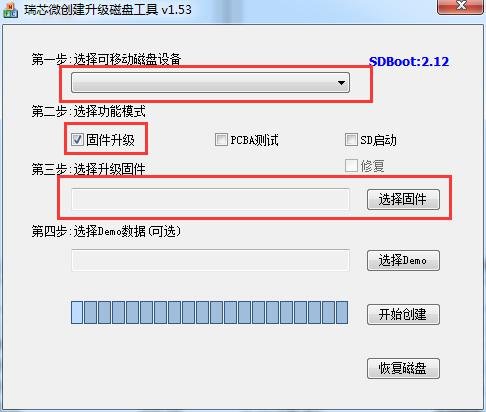

Select the packed update.img file in the firmware.

After all the preparation work is done, click start to create, and it will prompt if creation is successful.

Now there are two files in the root directory of SD card, where the image choosing to upgrade update.img will be renamed as sdupdate.img.

After all the preparation work is done, insert SD card to the device and then power on again.

If below information occurs in Log, it means the device is booted by SD card successfully.

```bash
U-Boot 2017.09-g1bee468 (Oct 11 2018 - 16:53:06 +0800) V1.000
Model: USM-110 a102-1
Board:Advantech usm110_rk3288 Board,HW version:0
DRAM: 2 GiB
Relocation Offset is: 7ff5a000
PMIC: RK808
vdd_arm 1100000 uV
vdd_gpu 1100000 uV
vcc_io 3300000 uV
regulator(LDO_REG2) init 3300000 uV
regulator(LDO_REG3) init 1100000 uV
regulator(LDO_REG4) init 1800000 uV
regulator(LDO_REG5) init 3300000 uV
regulator(LDO_REG6) init 1100000 uV
regulator(LDO_REG7) init 1800000 uV
regulator(LDO_REG8) init 1800000 uV
MMC: dwmmc@ff0c0000: 1, dwmmc@ff0f0000: 0
SF: Detected w25q32bv with page size 256 Bytes, erase size 4 KiB, total 4 MiB
*** Warning - bad CRC, using default environment
In: serial
Out: serial
Err: serial
switch to partitions #0, OK
mmc1 is current device
do_rkimg_test found IDB in SDcard
Boot from SDcard
enter Recovery mode!
SF: Detected w25q32bv with page size 256 Bytes, erase size 4 KiB, total 4 MiB
Skipped ethaddr assignment due to invalid,using default!
Net: No ethernet found.
Hit any key to stop autoboot: 0
ANDROID: reboot reason: "recovery"
FDT load addr 0x10f00000 size 263 KiB
Booting kernel at 0x3575c70 with fdt at 42cf470...
```

If below log is printed out through serial port, it means the recovery image upgrading process of bare chip through SD card boot up is ongoing.

```bash
firmware update will from SDCARD.
is_sdcard_update out
sdupdate_package = /mnt/sdcard/sdupdate.img
Command: "/usr/bin/recovery"
sdboot update will update from /mnt/sdcard/sdupdate.img
start with main.
```

## 4 Appendix

### 4.1. The misc Partition Introduction

Misc actually is the first four letters of miscellaneous, which means sundry, mixture and mess.

The concept of misc partition comes from Android system. It is usually used for system upgrading or restore to factory configuration in Linux system.

The write/read of misc partition: misc partition will be written/read in the following cases:

1. Uboot: when the device is powered on, it will firstly boot up uboot, and read the content of misc partition in uboot. Then decide will enter normal system or recovery mode according to the command of misc partition.

​       If command is "boot-recovery", it will enter recovery mode.

​       If command is empty, it will enter normal system.

2. Recovery: when the device enters recovery mode, it can read recovery part contents of misc partition, and then execute different actions such as upgrading or erasing user data and so on.

​       The structure and content of misc partition:

​       The structure of misc partition is shown as below:

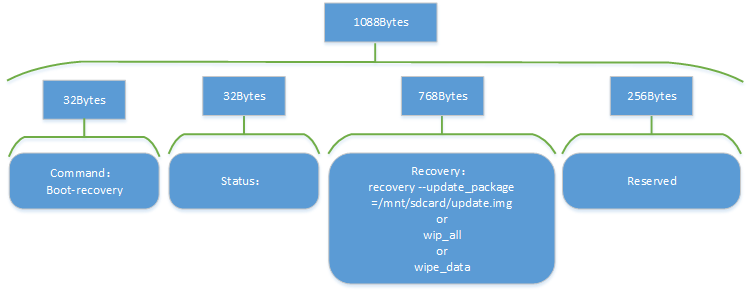

It will take RK3308 misc partition as an example below, use the tool such as winhex or ultraEdit etc. to open misc.img file with binary format, and save the content of struct BootLoader Msg starting at 16K (16384 Byte) byte offset from file start position.

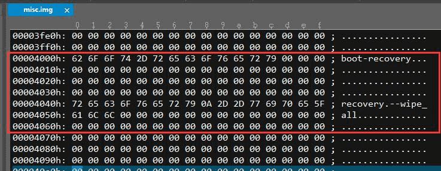

For the supported commands in recovery, please refer to the contents of struct OPTIONS in external/recovery/recovery.c.

#### 4.1.1 Select misc.img

The misc.img is a frequently used file in the SDK root directory device`device/rockchip/rockimg`. When generating firmware, choose which misc.img file to copy based on the configuration.

```bash
.
├ ── blank-misc.img		#blank misc partition file
├── pcba_small_misc.img #infrequently used
├── pcba_whole_misc.img #infrequently used
└── wipe_all-misc.img   #format the misc partition file used by the user partition
```

Open the BoardConfig.mk file of a specific chip to configure the usage of misc.img.

```bash
cd device/rockchip/rkxxxx
vim BoardConfig.mk
```

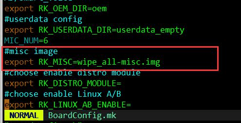

As shown from the above figure, `wipe_all-misc.img` is used as the firmware of the misc partition by default. After flash this misc firmware, the user (/userdata or /data) partition and the customize (/ oem) partition will be formatted. If you want to boot into the normal system without going into recovery mode, you can modify the specific file of misc image in BoardConfig.mk as blank-misc.img. Then rebuild to generate a new firmware.

### 4.2 Recovery Usage in Different Cases

#### 4.2.1 First Power up

The device have been flashed misc.img and recovery.img will enter the first power up process.

The serial port will print the following log:

```bash
Boot command: boot-recovery
Got arguments from boot message
Command: "recovery" "--wipe_all"
format '/dev/block/by-name/userdata' to ext2 filesystem
executing '/sbin/mke2fs'
executed '/sbin/mke2fs' done
executed '/sbin/mke2fs' return 0
executing '/sbin/e2fsck'
e2fsck 1.43.9 (8-Feb-2018)
Pass 1: Checking inodes, blocks, and sizes
Pass 2: Checking directory structure
Pass 3: Checking directory connectivity
Pass 4: Checking reference counts
Pass 5: Checking group summary information
/dev/block/by-name/userdata: 11/2304 files (0.0% non-contiguous), 82/2299 blocks
executed '/sbin/e2fsck' done
executed '/sbin/e2fsck' return 0
executing '/usr/sbin/e2fsck'
e2fsck 1.43.9 (8-Feb-2018)
Pass 1: Checking inodes, blocks, and sizes
Pass 2: Checking directory structure
Pass 3: Checking directory connectivity
Pass 4: Checking reference counts
Pass 5: Checking group summary information
/dev/block/by-name/oem: 18/2448 files (0.0% non-contiguous), 513/16384 blocks
executed '/usr/sbin/e2fsck' done
executed '/usr/sbin/e2fsck' return 1
executing '/usr/sbin/resize2fs'
resize2fs 1.43.9 (8-Feb-2018)
The filesystem is already 16384 (1k) blocks long. Nothing to do!
executed '/usr/sbin/resize2fs' done
executed '/usr/sbin/resize2fs' return 0
```

#### 4.2.2 Restore the Factory Configuration

Run `update` program in Command line, the device will enter recovery mode and start formatting, and it will automatically enter normal system after formatting.

```bash
update (or update reset)
```

The serial port will print the following log::

```bash
I:Boot command: boot-recovery
I:Got arguments from boot message
Command: "recovery" "--wipe_data"
format '/dev/block/by-name/userdata' to ext2 filesystem
executing '/sbin/mke2fs'
[ 4.692437] vendor storage:20160801 ret = -1
[ 6.030842] phy phy-ff008000.syscon:usb2-phy@100.0: charger =
USB_SDP_CHARGER
[ 10.891460] random: nonblocking pool is initialized
```

#### 4.2.3 Upgrade

Run`update ota /xxx/update.img`, the device will enter recovery and start upgrading.

```
update ota /udisk/update.img
```

Take upgrading from U disk as an example, the serial port may print the following log::

```bash
I:Boot command: boot-recovery
I:Got arguments from boot message
Command: "recovery" "--update_package=/udisk/update.img"
。。。。
librkupdate_ui_print = parameter writing....
########### RKA_Gpt_Download #########
librkupdate_###### Download trust ... #######
```

### 4.3  FAQ

#### 4.3.1  “cannot find or open a drm device ”

For Non RK3308 platforms, after the device enters recovery mode, usually it will to see below log printed from serial port:

```bash
we are in recovery, skip init oem/userdata
start debug recovery...
Starting recovery on Fri Jan 18 09:19:51 2013
failed to read font: res=-1, fall back to the compiled-in font
Starting network: cannot find/open a drm device: No such file or directory
```

In this case, the solution is to connect supported display panel or HDMI device to the device.

Analysis: it cannot find or open a drm device from the log. Because for non RK3308 platforms, build of recovery program enables UI display by default, if it cannot open the display device after entering recovery mode, it will lead to recovery execution failure.

If you want to support recovery upgrading feature without display for non RK3308 platforms such as RK3399, RK3288 etc., users can run according to below method:

Solution:

1. `source envsetup.sh`

2. Use the recovery of the current platform to configure the number and enter

3. `make menuconfig`,  enable the `No UI for recovery` configuration

```bash
> Target packages  --->
[*] Rockchip BSP packages  --->
[*]   Rockchip recovery for linux
[*]   No UI for recovery
[ ]   Linux AB bool control
Linux A/B bringup features. (successful_boot)  --->
choice the update bin of recovery. (rkupdate)  --->
-*-   recovery bin
[ ]   updateEngine bin
```

It is  not going to build display-related code in the `external/recovery/Makefile` .

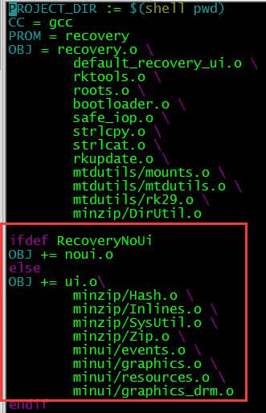

4. Rebuild the  recovery package

```bash
make recovery-dirclean && make recovery
```

5. Regenerate recovery firmware

```bash
./build.sh recovery
```

6. Generate a firmware.

```
./mkfirmware.sh
```

#### 4.3.2 Default Command For misc Partition Firmware Modification

If you want to modify the different recovery commands packaged in the misc firmware, or use a empty misc partition firmware. Please refer to the following modification:

Modify the mkfirmware.sh in the project root directory:

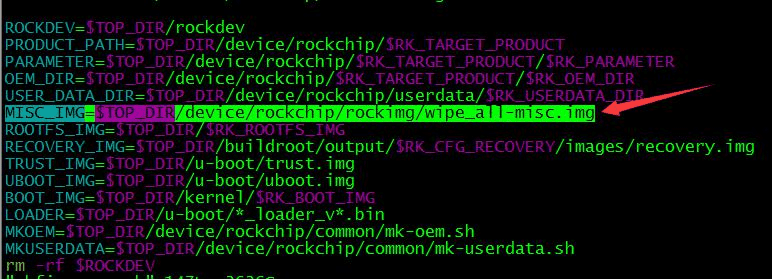

#### 4.3.3 Set userdata Partition as vfat File System

The userdata partition is ext2/ext4 file system in the SDK by default, if  you want to change it to vfat32 file system, please refer to following modification:

1. Modify `board/rockchip/rkxxxx/fs-overlay-recovery/etc/fstab` :

Before modificaiton:

```bash
/dev/block/by-name/userdata /userdata ext2 defaults0
```

After modificaiton:

```bash
/dev/block/by-name/userdata /userdata vfat defaults0 0
```

2. Modify `configs/rockchip_rkxxxx_release_defconfig`:

Add below configuration:

```Makefile
BR2_PACKAGE_DOSFSTOOLS=y
BR2_PACKAGE_DOSFSTOOLS_FATLABEL=y
BR2_PACKAGE_DOSFSTOOLS_FSCK_FAT=y
BR2_PACKAGE_DOSFSTOOLS_MKFS_FAT=y
```

3. Modify `package/rockchip/usbdevice/S50usbdevice`

```bash
start)
mkdir /dev/usb-ffs -m 0770
mkdir /dev/usb-ffs/adb -m 0770
mount -t configfs none /sys/kernel/config
mkdir /sys/kernel/config/usb_gadget/rockchip -m 0770
echo 0x2207 > /sys/kernel/config/usb_gadget/rockchip/idVendor
echo "ums_adb" >
/sys/kernel/config/usb_gadget/rockchip/configs/b.1/strings/0x409/configuration
mount -t functionfs adb /dev/usb-ffs/adb
mount -t vfat /dev/disk/by-partlabel/userdata /media/usb0
export service_adb_tcp_port=5555
adbd &
sleep 1
```

4. Make sure the following patch is already updated.

0001-common-mk-userdata-Fix-wrong-FS_TYPE-check.patch

```bash
case $FS_TYPE in
ext[2-4])
$COMMON_DIR/mke2img.sh $USERDATA_DIR $USERDATA_IMG
;;
fat|vfat)
SIZE=$(du -h -BM --max-depth=1 $USERDATA_DIR|awk '{print int($1)}')
# echo "create image size=${SIZE}M"
dd if=/dev/zero of=$USERDATA_IMG bs=1M count=$SIZE >/dev/null 2>&1
mkfs.vfat $USERDATA_IMG >/dev/null 2>&1
mcopy -i $USERDATA_IMG $USERDATA_DIR/* ::/ >/dev/null 2>&1
;;
*)
echo "file system: $FS_TYPE not support."
exit 1
;;
Esac
```

5. Modify`common/mk-userdata.sh`

```bash
SIZE=$(du -h -BM --max-depth=1 $USERDATA_DIR|awk '{print int($1)}')
# echo "create image size=${SIZE}M"
dd if=/dev/zero of=$USERDATA_IMG bs=1M count=$SIZE >/dev/null 2>&1
mkfs.vfat -F 32 $USERDATA_IMG >/dev/null 2>&1
mcopy -i $USERDATA_IMG $USERDATA_DIR/* ::/ >/dev/null 2>&1
;;
*)
```

6. Modify rk3308/BoardConfig.mk

~~export RK_USERDATA_FS_TYPE=ext2~~

```bash
# Set userdata partition type, including ext2, fat
export RK_USERDATA_FS_TYPE=vfat
```

#### 4.3.4 Do not Format the userdata or data Partition

The `wipe_all-misc.img` is configured in the BoardConfig.mk , but sometimes users don't want to  format user or custom (userdata or oem) partitions. in this case, the recovery code `external/recovery/reocvery.c` should be modified: the code in the main function as shown below, delete the code in the red box below, rebuild the the recovery partition firmware and flash the firmware.

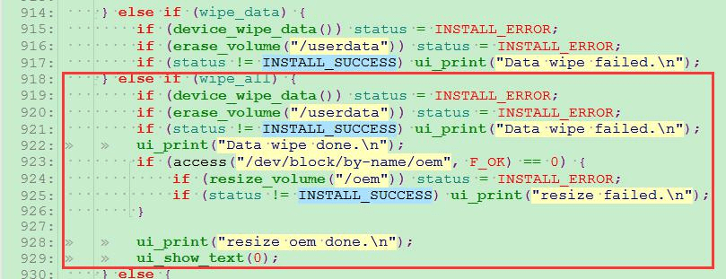
