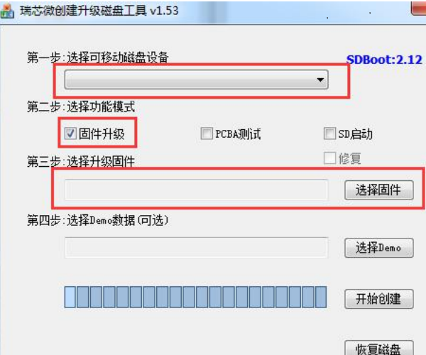
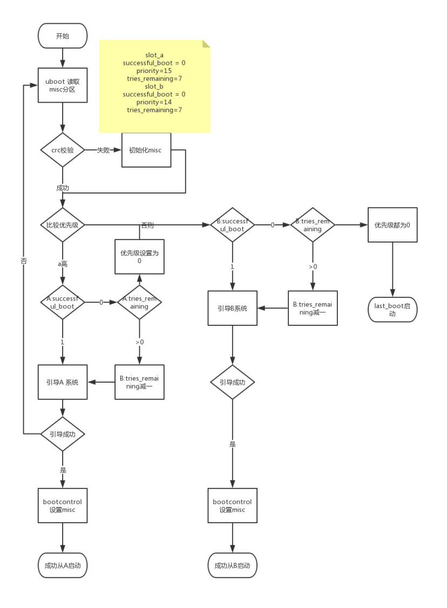

# Rockchip Linux 升级方案介绍

文件标识：RK-KF-YF-348

发布版本：V1.0.3

日期：2020-12-14

文件密级：□绝密   □秘密   □内部资料   ■公开

**免责声明**

本文档按“现状”提供，瑞芯微电子股份有限公司（“本公司”，下同）不对本文档的任何陈述、信息和内容的准确性、可靠性、完整性、适销性、特定目的性和非侵权性提供任何明示或暗示的声明或保证。本文档仅作为使用指导的参考。

由于产品版本升级或其他原因，本文档将可能在未经任何通知的情况下，不定期进行更新或修改。

**商标声明**

“Rockchip”、“瑞芯微”、“瑞芯”均为本公司的注册商标，归本公司所有。

本文档可能提及的其他所有注册商标或商标，由其各自拥有者所有。

**版权所有© 2020 瑞芯微电子股份有限公司**

超越合理使用范畴，非经本公司书面许可，任何单位和个人不得擅自摘抄、复制本文档内容的部分或全部，并不得以任何形式传播。

瑞芯微电子股份有限公司

Rockchip Electronics Co., Ltd.

地址：     福建省福州市铜盘路软件园A区18号

网址：     [www.rock-chips.com](http://www.rock-chips.com)

客户服务电话： +86-4007-700-590

客户服务传真： +86-591-83951833

客户服务邮箱： [fae@rock-chips.com](mailto:fae@rock-chips.com)

---

**前言**

**概述**

本文档旨在指导工程师如何快速使用Rockchip Linux 平台升级方案，并进行二次开发。

**读者对象**

本文档（本指南）主要适用于以下工程师：

技术支持工程师

软件开发工程师

**产品版本**

| **芯片名称** | **内核版本** |
| -------- | :------- |
| RK3308   | 4.4      |

**修订记录**

| **日期**   | **版本** | **作者**   | **修改说明**           |
| ---------- | -------- | ---------- | ---------------------- |
| 2019-06-05 | V1.0.1   | HKH MLC    | 初始版本               |
| 2020-03-31 | V1.0.2   | Ruby Zhang | 格式修正               |
| 2020-12-14 | V1.0.3   | Ruby Zhang | 更新公司名称及文档格式 |

---

**目录**

[TOC]

---

## 简介

Rockchip Linux 平台支持两种升级方案，Recovery 模式和Linux A/B 模式：

1. Recovery 模式，设备上有一个单独的分区(recovery)用于升级操作。
2. Linux A/B 模式，设备上有两套固件，可切换使用。

这两种模式各有优缺点，用户根据需求选择使用。

## Recovery 模式

### 概述

Recovery 模式是在设备上多一个Recovery分区，该分区由kernel+resource+ramdisk 组成，主要用于升级操作。u-boot会根据misc分区(详见misc 分区章节)存放的字段来判断将要引导的系统是Normal 系统还是Recovery 系统。由于系统的独立性，所以Recovery模式能保证升级的完整性，即升级过程被中断，如异常掉电，升级仍然能继续执行。

**优点：**

1. 能保证升级的完整性

**缺点：**

1. 系统多了一个分区，该分区仅用于升级
2. 升级过程必须重启进入recovery模式，不能在Normal系统直接进行升级

**分区简介：**

| 分区名      | 镜像名               | 简介                          |
| -------- | ----------------- | --------------------------- |
| loader   | MiniLoaderAll.bin | 一级loader                    |
| u-boot   | uboot.img         | 二级loader                    |
| trust    | trust.img         | 安全环境，如OP-TEE、ATF            |
| misc     | misc.img          | 引导参数分区                      |
| recovery | recovery.img      | kernel+dtb+ramdisk 组成的根文件系统 |
| boot     | boot.img          | kernel+dtb                  |
| rootfs   | rootfs.img        | 根文件系统，只读                    |
| oem      | oem.img           | 厂商预制，可读写                    |
| userdata | userdata.img      | 用于数据，可读写                    |

### 配置和编译

Buildroot：recovery 配置文件选择如下（make menuconfig）

```shell
BR2_PACKAGE_RECOVERY=y	#开启升级相关功能
BR2_PACKAGE_RECOVERY_USE_UPDATEENGINE=y	#使用新升级程序，不配置则默认使用原有升级流程
BR2_PACKAGE_RECOVERY_RECOVERYBIN=y	#开启recovery bin 文件
BR2_PACKAGE_RECOVERY_UPDATEENGINEBIN=y #编译新升级程序
```

Buildroot：rootfs 配置文件选择如下(make menuconfig)

```shell
BR2_PACKAGE_RECOVERY=y #开启升级相关功能
BR2_PACKAGE_RECOVERY_USE_UPDATEENGINE=y #使用新升级程序
BR2_PACKAGE_RECOVERY_UPDATEENGINEBIN=y	#编译新升级程序
```

**带屏与不带屏**

目前只有RK3308使用不带屏的recovery，如有其它要让recovery不显示界面，在文件

buildroot/package/rockchip/recovery/recovery.mk做如下配置即可：

```
TARGET_MAKE_ENV += RecoveryNoUi=true
```

SDK默认会开启以上配置，用户无需再次配置。源码目录位于external/recovery/，若有进行相关修改，则按照如下进行编译：

```shell
1. source envsetup.sh
2. 选择某一个平台的rootfs配置
3. make recovery-dirclean
4. source envsetup.sh
5. 选择某一平台的 recovery 配置
6. make recovery-dirclean
7. ./build.sh
8. 重新烧写固件
```

### OTA升级

升级支持网络下载和本地升级，且可指定要升级的分区，在normal系统运行如下命令：

网络升级：

```shell
# updateEngine --misc=update --image_url=固件地址 --partition=0x3F00 --version_url=版本文件地址 --savepath=/userdata/update.img --reboot
updateEngine --image_url=http://172.16.21.110:8080/recovery/update.img --misc=update --savepath=/userdata/update.img --reboot &
```

本地升级：

```
updateEngine --image_url=/userdata/update.img --misc=update --savepath=/userdata/update.img --reboot &
```

流程介绍：

1. 固件版本比较(--version_url)
2. 下载固件(--image_url)，并保存到本地(--savepath)
3. 升级recovery 分区
4. 重启(--reboot)
5. 进入recovery模式，升级指定的分区(--partition)
6. 升级成功，重启进入normal系统

可缺省参数：

1. --version_url：远程地址或本地地址，没有设置该参数，则不会进行版本比较
2. --savepath：固件保存地址，缺省时为/tmp/update.img，建议传入/userdata/update.img
3. --partition：设置将要升级的分区，建议使用0x3F00，**不支持升级parameter 和loader分区**。详见 [5.1节 参数说明](### 5.1、参数说明 )。
4. --reboot：升级recovery 完后，重启进入recovery模式

### SD 卡制作启动盘升级

SD卡启动盘升级指将通过SDDiskTool 制卡工具制作的SD卡插入到机器中进行升级，详细描述 SD 卡启动盘的制作及相关升级的问题。

**制作SD卡启动盘**

如图下图所示，使用工程目录 tools\windows\SDDiskTool 中的 SD 卡启动盘升级制作工具制作 SD 卡启动盘。



选择固件中选择打包好的 update.img 文件。

所有准备工作完成后，点击开始创建按钮，如果创建成功，会弹窗提示。

此时 SD 卡中根目录会存在两个文件，其中选择升级的固件 update.img，会被命名为 sdupdate.img.

所有准备工作做好后，设备中插入 SD 卡，并重新上电。

### 日志的查看

1. 串口日志查看

buildroot/output/rockchip_rk3308_recovery/target 目录下

```shell
touch .rkdebug
```

创建这个隐藏文件，可将 recovery 模式中升级的 log 在串口中打印出来。

2. 通过查看 userdata/recovery/Log 文件查看

升级之后，在设备 userdata/recovery 目录中查看 log 文件。

```shell
cat userdata/recovery/Log
```

## Linux A/B 模式

### 概述

Linux A/B，即准备两份独立的系统固件，分别存放在 flash 上，系统可以从其中一个 slot 启动，如果当前 slot 启动失败，可以从另外一个 slot 启动，在Normal模式下直接升级系统，无需进入系统升级模式，只需重启系统即可进入升级过的系统。

Linux A/B 由于有两个引导 slot，所以具有以下**优点**：

1. 升级无需重启进入升级模式，即机器可以在当前系统上直接进行升级。

2. 防止由于升级失败导致机器变砖，如果升级失败，机器可以回到当前版本。

3. 当前系统如果由于一些误操作被破坏掉，系统会自动切换到另外一个 slot 上。

**缺点：**

1. Linux A/B 有两个 slot，所以会增加 flash 上系统固件的占用率。

**分区：**

由于 miniloader，trust，uboot，机器上原有已经进行了多备份，所以目前这几个分区暂不支持双分区方案，只对 boot 和 system 进行了双分区。分区表如下：

| 分区名      | 镜像名            | 简介                                       |
| -------- | -------------- | ---------------------------------------- |
| loader   | Miniloader.bin | 一级loader，机器备份4份                          |
| uboot    | uboot.img      | 二级loader，机器备份2份，可修改u-boot/make.sh来修改备份份数 |
| trust    | trust.img      | 安全相关，机器备份2份，可修改u-boot/make.sh来修改备份份数     |
| misc     | misc.img       | 引导参数分区                                   |
| boot_a   | boot.img       | kernel+dtb，引导system_a                    |
| boot_b   | boot.img       | kernel+dtb，引导system_b                    |
| system_a | rootfs.img     | 根文件系统                                    |
| system_b | rootfs.img     | 根文件系统                                    |
| userdata | userdata.img   | 无备份                                      |

### 引导流程

#### 数据格式及存储

存储位置为 misc 分区偏移 2K 位置，AvbABSlotData 和 AvbABData 数据结构如下：

AvbABSlotData：存储 slot_a 和 slot_b

| 数据名称                          | 数据作用                         |
| ----------------------------- | ---------------------------- |
| unsigned char priority        | 分区优先级，0~15，0 为不可自动，15 为最高优先级 |
| unsigned char tries_remaining | 尝试启动次数，最高为 7 次，可修改           |
| unsigned char successful_boot | 0：不可启动，1：可启动                 |
| unsigned char is_update:1     | 0：升级失败，1：升级成功，后 7 位为保留数据     |

AvbABData：slot_a 和 slot_b 的引导信息

| 数据名称                                  | 数据作用                           |
| ------------------------------------- | ------------------------------ |
| unsigned char magic[AVB_AB_MAGIC_LEN] | 结构体头部信息：\0AB0                  |
| unsigned char version_major           | 版本信息                           |
| unsigned char version_minor           | 版本信息                           |
| unsigned char reserved1[2]            | 保留数据                           |
| AvbABSlotData slots[2]                | 分区引导信息                         |
| unsigned char last_boot               | 上一次成功启动的分区：0->slot_a，1->slot_b |
| unsigned char reserved2[11]           | 保留数据                           |
| unsigned char crc32                   | Crc 数据校验                       |

#### 引导流程

根据上层 bootcontrol 程序的设置方式，可分为两种引导方式 successful_boot 和 reset retry。 两种模式的对比如下：

| 模式                    | 优点                       | 缺点                                       | 成功启动设置的数据（A启动）                           | 升级时设置的数据（A启动，B升级）                |
| --------------------- | ------------------------ | ---------------------------------------- | ---------------------------------------- | -------------------------------- |
| Successful<br />_boot | 只要正常启动系统，不会回退到旧版本固件      | 设备长时间工作后，如果存储某些颗粒异常，会导致系统一直重启            | tries_remaining=0<br />successful_boot=1<br /><br />last_boot=0 | A:priority=14<br />B:priority=15 |
| Reset retry           | 始终保持 retry 机制，可以应对存储异常问题 | 1.机器会回到旧的版本上，可能出现版本不可控问题<br />2.如果因为用户误操作，retry尝试次数过了，会误判为当前分区为可启动 | tries_remaining=7<br />last_boot=0       | A:priority=14<br />B:priority=15 |

#### 引导流程图



### 编译配置

#### uboot

defconfig 增加如下配置，如 rk3308 64bit：u-boot/configs/rk3308_defconfig

```shell
CONFIG_AVB_LIBAVB=y
CONFIG_AVB_LIBAVB_AB=y
CONFIG_AVB_LIBAVB_ATX=y
CONFIG_AVB_LIBAVB_USER=y
CONFIG_RK_AVB_LIBAVB_USER=y
CONFIG_ANDROID_AB=y
```

#### Buildroot

```shell
BR2_PACKAGE_RECOVERY=y	#开启升级功能
BR2_PACKAGE_RECOVERY_BOOTCONTROL=y	#开启引导控制脚本
BR2_PACKAGE_RECOVERY_RETRY=y		#引导方式为retry模式，不配置则默认为successful_boot模式
BR2_PACKAGE_RECOVERY_USE_UPDATEENGINE=y	#使用新升级程序
BR2_PACKAGE_RECOVERY_UPDATEENGINEBIN=y	#编译新升级程序
```

注意：设置完成之后，须进行重新编译，如下：

```shell
make recovery-dirclean
make recovery
./build.sh
```

#### 分区表

相应的 BoardConfig.mk，设置 parameter 分区表，如下：

```shell
#选择了 device/rockchip/rk3308/parameter-ab-64bit.txt 文件
# parameter for GPT table
export RK_PARAMETER=parameter-ab-64bit.txt
```

64bit：参考/device/rockchip/rk3308/parameter-ab-64bit.txt

32bit：参考/device/rockchip/rk3308/parameter-ab-32bit.txt

#### 固件输出

相应的 BoardConfig.mk，设置开启 Linux A/B 自动编译系统，开启方式如下：

```shell
#choose enable Linux A/B
export RK_LINUX_AB_ENABLE=true
```

设置完成之后，运行

```shell
source envsetup.sh
./build.sh
```

即可生成如下固件：

```
tree rockdev/
rockdev/
├ ── boot.img
├ ── MiniLoaderAll.bin
├ ── misc.img
├ ── oem.img
├ ── parameter.txt
├ ── recovery.img
├ ── rootfs.img
├ ── trust.img
├ ── uboot.img
├ ── update_ab.img
├ ── update.img
├ ── update_ota.img
└── userdata.img

0 directories, 13 files
```

**升级固件**

rockdev 和 IMAGE 目录下，都会有 update_ota.img，用于 OTA 升级，该 IMAGE 包，包含boot.img 和 rootfs.img。可根据实际需求修改

tools/linux/Linux_Pack_Firmware/rockdev/rk3308-package-file-ota 文件。如下图：


**烧写固件**

rockdev 和 IMAGE 目录下，都会生成 update_ab.img，该固件用于烧写。根据需求修改该文件 tools/linux/Linux_Pack_Firmware/rockdev/rk3308-package-file-ab 文件。如下图：


### OTA升级

网络升级：

```shell
# updateEngine --update --image_url=固件地址 --partition=0x3F00 --version_url=版本文件地址 --savepath=保存的固件地址 --reboot
updateEngine --image_url=http://172.16.21.110:8080/linuxab/update.img --update --reboot
```

本地升级：

```shell
# updateEngine --update --image_url=固件地址 --partition=0x3F00 --version_url=版本文件地址 --savepath=保存的固件地址 --reboot
updateEngine --image_url=/userdata/update.img --update --reboot
```

流程介绍：

1. 固件版本比较
2. 下载固件(--image_url)，并保存到本地(--savepath)
3. 升级指定的分区(--partition)
4. 设置升级分区为将要引导分区
5. 重启
6. 尝试引导升级的分区

可缺省参数：

1. --partition：设置将要升级的分区 ，Linux A/B模式下，建议只升级boot和system，即0x0A00，**不支持升级parameter 和loader分区**。详见参数说明
2. --version：没有设置该参数，则不会进行版本比较
3. --savepath：固件保存地址，缺省时为/tmp/update.img，建议使用默认值
4. --reboot：升级完后重启

### 分区引导设置

#### 可引导设置

通过misc设置当前分区为可引导分区，要在 system 成功引导之后执行，标记系统成功启动，参考如下脚本

```shell
$external/recovery/update_engine$ cat S99_bootcontrol
case "$1" in
  start)
        /usr/bin/updateEngine --misc=now
        ;;
  stop)
        printf "stop finished\n"
        ;;
  *)
        echo "Usage: $0 {start|stop}"
        exit 1
        ;;
esac
exit 0
```

#### 升级分区设置

```shell
updateEngine --misc=other --reboot
```

流程介绍：

1. 往misc 偏移4K位置写入一个命令，该命令为引导另一个分区的命令
2. 重启

可缺省参数：

1. --reboot，缺省则机器不会立即重启，在下一次重启才会生效

注意：updateEngine程序在OTA升级结束之后会自动设置，无需重复设置。

## 恢复出厂设置

我们把可以读写的配置文件保存在 userdata 分区， 出厂固件会默认一些配置参数， 用户使用一段时间后会生成或修改配置文件， 有时用户需要清除这些数据， 我们就需要恢复到出厂配置。

SDK 实现：

功能键 RECOVERY + VOLUMEUP 触发恢复出厂配置， 代码请参考：

buildroot/board/rockchip/rk3308/fs-overlay/etc/input-event-daemon.conf

board/rockchip/rk3308/fs-overlay/usr/sbin/factory_reset_cfg

```shell
updateEngine --misc=wipe_userdata --reboot
```

流程介绍：

1. 往misc 分区偏移4k位置处写入格式命令
2. 重启(--reboot)
3. S21mountall.sh 识别misc中有格式化命令
4. 格式化userdata

可缺省参数:

1. --reboot 如果没有传入该参数，则在机器下次重启后才会恢复出厂设置。

## 升级程序详细说明

### 参数说明

updateEngine主要包含升级分区和写Misc配置功能，支持命令参数如下：

```shell
updateEngine --help
*** update_engine: Version V1.0.1 ***.
--misc=now           Linux A/B mode: Setting the current partition to bootable.
--misc=other         Linux A/B mode: Setting another partition to bootable.
--misc=update        Recovery mode: Setting the partition to be upgraded.
--misc=wipe_userdata Format data partition.
--update             Upgrade mode.
--partition=0xFF00   Set the partition to be upgraded.
                     0xFF00: 1111 1111 1000 0000.
                     111111111: loader parameter uboot trust boot recovery rootfs oem misc.
--reboot             Restart the machine at the end of the program.
--version_url=url    The path to the file of version.
--image_url=url      Path to upgrade firmware.
--savepath=url       save the update.img to url.
```

--misc

now：供Linux A/B 模式使用，将当前分区设置为可引导分区。

**注意**：external/recovery/update_engine/S99_bootcontrol 脚本在开机最后阶段会运行该命令，将当前分区设置为可引导分区，需要开启

```shell
BR2_PACKAGE_RECOVERY_BOOTCONTROL=y
```

other：供Linux A/B 模式使用，将另外一个分区设置为升级完成分区，重启之后会尝试从另外一个分区引导。

**注意**：如果使用updateEngine升级，在升级结束之后，会自动设置，无需重复设置。

update：供Recovery模式使用，在normal系统升级recovery分区，在recovery 系统升级其余分区。

display：调试使用，显示misc分区的数据结构

--update

sdboot：走sdboot升级流程，即直接对flash操作，没有分区概念。

不带参数：主要供Linux A/B使用，在当前模式下，直接进行升级。

--partition=0x0000

设置将要升级的分区，如果缺省，默认值为0x3F00，升级uboot，trust，boot，recovery，rootfs，oem分区。高9位已经使用，低7位为保留位，可扩展使用。

1：升级，0：不升级

| 位数 | 16     | 15        | 14    | 13    | 12   | 11       | 10     | 9    | 8    | 7~1  |
| ---- | ------ | --------- | ----- | ----- | ---- | -------- | ------ | ---- | ---- | ---- |
| 分区 | loader | parameter | uboot | trust | boot | recovery | rootfs | oem  | misc | 保留 |

--reboot

updateEngine 运行成功之后，机器重启

--vsersion_url

如果有传入路径，升级之前会与/etc/version 文件中的 RK_VERSION= 版本值进行比较

本地路径：从固件中读取版本号

远程路径：从远程下载版本文件，远程版本文件格式必须跟/etc/version 一致

--image_url

设置升级固件的路径，可为远程或本地路径。

--savepath

设置保存固件的位置，如果没有传入且升级的固件路径为远程地址，则默认值为/tmp/update.img

### 自定义分区升级

```c
typedef struct {
    char name[32];		//固件名称
    bool need_update;	//需要升级
    bool is_ab;			//是否为A/B双分区
    long long size;		//固件长度
    long long offset;	//在update.img 中的偏移位置
    long long flash_offset;	//flash上的偏移位置
    char dest_path[100];	//目标路径
    update_func cmd;		//升级函数
}UPDATE_CMD, *PUPDATE_CMD;
```

如要升级自定义分区，factory，则再下面添加一行, 且--partition 需要对应设置位值为1

```c
 {"factory", false, false, 0, 0, 0, "", flash_normal},
```

external/recovery/update_engine/update.cpp

```c
UPDATE_CMD update_cmd[] = {
    {"bootloader", false, false, 0, 0, 0, "", flash_bootloader},
    {"parameter", false, false, 0, 0, 0,"", flash_parameter},
    {"uboot", false, false, 0, 0, 0,"", flash_normal},
    {"trust", false, false, 0, 0, 0,"", flash_normal},
    {"boot", false, true, 0, 0, 0,"", flash_normal},
    {"recovery", false, false, 0, 0, 0, "", flash_normal},
    {"rootfs", false, true, 0, 0, 0, "", flash_normal},
    {"oem", false, false, 0, 0, 0, "", flash_normal},
    {"misc", false, false, 0, 0, 0, "", flash_normal},
};
```

## 附录

### 固件打包工具

#### windows 工具

Windows 打包工具在 tools\windows\AndroidTool\rockdev 目录下。先修改 package-file 文件将需要升级的 image 加入打包。注意路径是这里的路径是相对路径。 mkupdate.bat 批处理程序会把 tools\windows\AndroidTool\rockdev\Image 链接到根目录下的 rockdev 目录。所以请保证 rockdev 下 的相应 image 存在。接着执行 mkupdate.bat。mkupdate.bat 脚本会把根目录下 rockdev 中的相应的 image 打包成 update.img 存放在根目录下 rockdev。

#### linux工具

Linux 打包工具在 tools/linux/Linux_Pack_Firmware/rockdev 目录下。先修改 package-file 文件将需要升级的 image 加入打包。注意路径是这里的路径是相对路径。 tools/linux/Linux_Pack_Firmware/rockdev/Image 会链接到根目录下rockdev 目录。所以请保证 rockdev 下的相应 image 存在。 接着执行mkupdate.sh。mkupdate.sh脚本会把根目录下rockdev中的相应的image打包成update.img 存放在根目录下 rockdev。

### Misc 分区说明

Misc分区是一个没有文件系统的分区，用于存放一些引导配置参数，现有结构如下，详见external/recovery/bootloader.h、external/recovery/update_engine/rkbootloader.cpp

| 偏移地址 | 作用                     |
| ---- | ---------------------- |
| 2k   | Linux A/B 分区引导信息       |
| 4k   | 格式化命令                  |
| 16k  | Recovery 系统与Normal系统通信 |