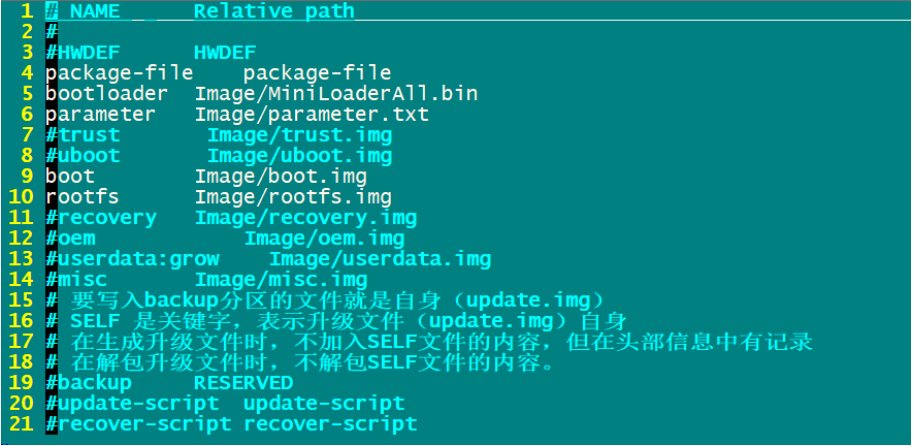
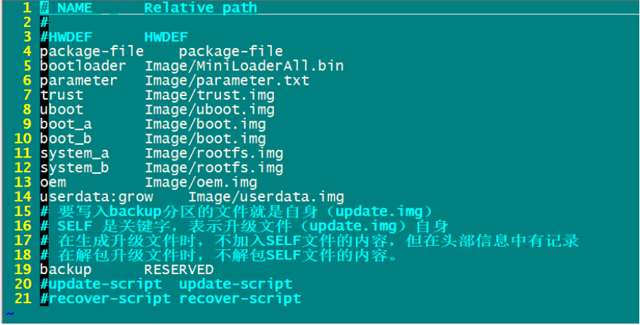

# Rockchip Linux  Upgrade Solution Introduction

ID: RK-KF-YF-348

Release version: V1.0.1

Release Date: 2020-03-31

Security Level: □Top-Secret   □Secret   □Internal   ■Public

-----------

**DISCLAIMER**

THIS DOCUMENT IS PROVIDED “AS IS”. FUZHOU ROCKCHIP ELECTRONICS CO., LTD.(“ROCKCHIP”)DOES NOT PROVIDE ANY WARRANTY OF ANY KIND, EXPRESSED, IMPLIED OR OTHERWISE, WITH RESPECT TO THE ACCURACY, RELIABILITY, COMPLETENESS,MERCHANTABILITY, FITNESS FOR ANY PARTICULAR PURPOSE OR NON-INFRINGEMENT OF ANY REPRESENTATION, INFORMATION AND CONTENT IN THIS DOCUMENT. THIS DOCUMENT IS FOR REFERENCE ONLY. THIS DOCUMENT MAY BE UPDATED OR CHANGED WITHOUT ANY NOTICE AT ANY TIME DUE TO THE UPGRADES OF THE PRODUCT OR ANY OTHER REASONS.

**Trademark Statement**

"Rockchip", "瑞芯微", "瑞芯" shall be Rockchip’s registered trademarks and owned by Rockchip. All the other trademarks or registered trademarks mentioned in this document shall be owned by their respective owners.

**All rights reserved. ©2019. Fuzhou Rockchip Electronics Co., Ltd.**

Beyond the scope of fair use, neither any entity nor individual shall extract, copy, or distribute this document in any form in whole or in part without the written approval of Rockchip.

Fuzhou Rockchip Electronics Co., Ltd.

No.18 Building, A District, No.89, software Boulevard Fuzhou, Fujian,PRC

Website:     [www.rock-chips.com](http://www.rock-chips.com)

Customer service Tel:  +86-4007-700-590

Customer service Fax:  +86-591-83951833

Customer service e-Mail:  [fae@rock-chips.com](mailto:fae@rock-chips.com)

-----------

## Preface

**Overview**

This document is intended to help engineers familiar with Rockchip Linux platform upgrade solution and do secondary development faster.

**Intended Audience**

This document (this guide) is mainly intended for:

Technical support engineers

Software development engineers

**Product Version**

| **Chipset** | **Kernel version** |
| :---------- | :----------------- |
| RK3308      | 4.4                |

**Revision History**

| **Date**   | **Version** | **Author** | **Revision Description**          |
| :--------- | :---------- | :--------- | :-------------------------------- |
| 2019-06-05 | V1.0.0      | HKH/MLC    | Initial version                   |
| 2020-03-31 | V1.0.1      | Ruby       | Update the format of the document |

-----------

## Contents

[TOC]

-----------

## 1. Overview

Rockchip Linux platform supports two upgrade modes: recovery mode and Linux A/B mode:

1. Recovery mode: there is a separate partition (recovery.img) on the device for upgrade.
2. Linux A/B mode: there are two firmware on the device that can be switched.

Users can choose one according to their requirements for both the modes with their advantages and disadvantages.

## 2. Recovery  Mode

### 2.1. Overview

There will be a recovery partition on the device, which is consists of kernel+resource+ramdisk and mainly used for upgrade operations on the machine in recovery mode. U-boot will determine whether the system to be booted is a normal system or a recovery system based on the fields stored in the misc partition (see the misc partition section for details). Due to system independence, the recovery mode can guarantee the integrity of upgrade even when upgrade process is interrupted. If the power is abnormally powered down, the upgrade can still continue.

**Advantages：**

1. It can guarantee the integrity of upgrade.

**Disadvantages：**

1. There is one more partition which is only used for upgrade in the system.
2. Reboot the system into recovery mode during upgrade process and should not upgrade directly in the normal system.

**Partition Instruction：**

| Partition name | Image name        | Description                              |
| -------------- | ----------------- | ---------------------------------------- |
| loader         | MiniLoaderAll.bin | First level loader                       |
| u-boot         | uboot.img         | Second level loader                      |
| trust          | trust.img         | Secure environment, like OP-TEE, ATF     |
| misc           | misc.img          | Boot parameter partition                 |
| recovery       | recovery.img      | Root file system consisting of kernel+dtb+ramdisk |
| boot           | boot.img          | kernel+dtb                               |
| rootfs         | rootfs.img        | Root file system, read only              |
| oem            | oem.img           | used for manufacturer, read and write    |
| userdata       | userdata.img      | used for users, read and write           |

<div style="page-break-after: always;"></div>

### 2.2. Configure and Compile

Buildroot: the recovery configuration files are selected as follows: (make menuconfig):

```shell
BR2_PACKAGE_RECOVERY=y	#turn on upgrade related functions
BR2_PACKAGE_RECOVERY_USE_UPDATEENGINE=y	#use the new upgrade program, if not configured, the original upgrade process will be used by default.
BR2_PACKAGE_RECOVERY_RECOVERYBIN=y	#turn on recovery bin file
BR2_PACKAGE_RECOVERY_UPDATEENGINEBIN=y #compile the new upgrade program
```

Buildroot: the rootfs configuration files are selected as follows (make menuconfig):

```shell
BR2_PACKAGE_RECOVERY=y #turn on upgrade related functions
BR2_PACKAGE_RECOVERY_USE_UPDATEENGINE=y #use the new upgrade program
BR2_PACKAGE_RECOVERY_UPDATEENGINEBIN=y	#compile the new upgrade program
```

**With and Without Display**

Currently only RK3308 uses the recovery without display, if the recovery of other chipset do not need display, just configure the following item in the file "buildroot/package/rockchip/recovery/recovery":

```
TARGET_MAKE_ENV += RecoveryNoUi=true
```

The SDK will enable the above configuration by default, so users do not need to configure it again. The source code is in "external/recovery/" directory, if you need to do some modifications, compile as follows:

Step1: run the following command:

```shell
source envsetup.sh
```

Step2: choose the rootfs configuration of a platform,and then run the following command:

```shell
make recovery-dirclean
source envsetup.sh
```

Step3: choose the recovery configuration of a platform, and then run the following command:

```shell
make recovery-dirclean
./build.sh
```

Step4: flashing the firmware again.

<div style="page-break-after: always;"></div>

### 2.3. OTA Upgrade

The upgrade supports network upgrade and local upgrade, and you can specify the partition to be upgraded. Run the following command on the normal system.

Network upgrade：

```shell
# updateEngine --misc=update --image_url=firmware address --partition=0x3F00 --version_url=version file address --savepath=/userdata/update.img --reboot
updateEngine --image_url=http://172.16.21.110:8080/recovery/update.img --misc=update --savepath=/userdata/update.img --reboot &
```

Local upgrade：

```
updateEngine --image_url=/userdata/update.img --misc=update --savepath=/userdata/update.img --reboot &
```

Process introduction：

1. Firmware versions comparison(--version_url)
2. Download the firmware(--image_url)  and save it locally(--savepath)
3. Upgrade recovery partition
4. Reboot(--reboot)
5. Enter the recovery mode, upgrade the partition(--partition)
6. Successfully upgrade and reboot into the normal system.

Optional parameters:

1. --version_url: remote address or local address. If this parameter is not set, versions comparison will not do .
2. --savepath: firmware saves path, it is "/tmp/update.img" by default. It is recommended to set to "/userdata/update.img".
3. --partition: set the partition to be upgraded. It is recommended to set it to 0x3F00. **It is not supported to upgrade the parameter and loader partitions**. See the [Chapter 5.1 Parameters Introduction](### 5.1. Parameters ) for details.
4. --reboot: after upgrading the recovery partition, reboot into the recovery mode.

### 2.4. Create an Upgrade Disk

Creating an upgrade disk refers to inserting the SD card created by the SDDiskTool card-making tool to
the machine to upgrade, this section will introduce how to create a upgrade disk and some upgrade issues
in details.

**Create an Upgrade Disk**

As shown in the figure below, use the tool in the project directory "tools\windows\SDDiskTool" to
create a upgrade disk.


Choose the packaged update.img file by the "Firmware" button.

After that, click the "Create" button. If the creation is successful, a prompt will appear.

At this point, there will be two files in the root directory of the SD card, and the upgraded firmware
update.img will be named sdupdate.img.

After all the preparations are completed, insert the SD card into the device and power on.

### 2.5. Log Checking

1. Check log by serial port

In the "buildroot/output/rockchip_rk3308_recovery/target" directory:

```shell
touch .rkdebug
```

Create this hidden file to print the upgraded log in recovery mode by serial port.

2. Checking through the "userdata/recovery/Log" file:

After upgrading, check the log file under "userdata/recovery" directory  in the device.

```shell
cat userdata/recovery/Log
```

## 3. Linux A/B  Mode

### 3.1. Overview

You have to prepare two separate system firmwares which are respectively stored in the flash in Linux A/B mode . The system can be booted from one of the slots. If the current slot fails to boot, it can be started from another slot, and the system can be directly upgraded in the normal state, without entering the system upgrade mode, and just restart the system to enter the upgraded system.

The following **advantages** are included in Linux A/B mode due to its two boot slots:

1. The machine can be upgraded directly on the current system without rebooting into upgrade mode.
2. Prevent the machine from crashing for failure upgrade. If the upgrade fails, the machine can return to the current version.
3. If the current system is destroyed due to misoperation, the system will automatically switch to another slot.

**Disadvantages：**

1. There are two slots in Linux A/B mode, so it will increase the system firmware usage on the flash.

**Partition：**

Since there are already multiple backups of miniloader, trust, and uboot on the device, these partitions do not support the dual partitions at present,  only the boot and system are dual-partitioned. The partition table is as follows:

| Partition | Image          | Description                              |
| --------- | -------------- | ---------------------------------------- |
| loader    | Miniloader.bin | First level loader, there are 4 backups in the device |
| uboot     | uboot.img      | Second level loader, there are 2 backups in the device，the backups number can be changed by modifying the "u-boot/make.sh" |
| trust     | trust.img      | Related to secure, there are 2 backups in the device，the backups number can be changed by modifying the "u-boot/ make.sh" |
| misc      | misc.img       | Boot parameter partition                 |
| boot_a    | boot.img       | kernel+dtb, boot system_a                |
| boot_b    | boot.img       | kernel+dtb, boot system_b                |
| system_a  | rootfs.img     | Root file system                         |
| system_b  | rootfs.img     | Root file system                         |
| userdata  | userdata.img   | No backup                                |

<div style="page-break-after: always;"></div>

### 3.2. Boot Process

#### 3.2.1. Data Format and Storage

The storage position is 2K offset from the misc partition, and AvbABSlotData and AvbABData data
structures are as follows

AvbABSlotData: store slot_a and slot_b

| Date name                     | Usage                                                        |
| ----------------------------- | ------------------------------------------------------------ |
| unsigned char priority        | Partition priority, 0~15, 0 is not automatic, 15 is the highest priority |
| unsigned char tries_remaining | The number of attempts to start, the highest is 7, can be modified |
| unsigned char successful_boot | 0: unbootable，1: bootable                                   |
| unsigned char is_update:1     | 0: upgrade failed, 1: upgrade successfully , and the last 7 bits are reserved data. |

AvbABData: slot_a and slot_b  boot information

| Date name                             | Usage                                    |
| ------------------------------------- | ---------------------------------------- |
| unsigned char magic[AVB_AB_MAGIC_LEN] | structure header information: \0AB0      |
| unsigned char version_major           | version information                      |
| unsigned char version_minor           | version information                      |
| unsigned char reserved1[2]            | reserved data                            |
| AvbABSlotData slots[2]                | Partition boot information               |
| unsigned char last_boot               | The partition that was successfully boot last time: 0->slot_a, 1->slot_b |
| unsigned char reserved2[11]           | reserved data                            |
| unsigned char crc32                   | Crc data verification                    |

<div style="page-break-after: always;"></div>

#### 3.2.2. Boot Process

According to the configuration method of the upper bootcontrol program, there are two boot modes: successful_boot and reset retry. The difference of the two modes is as follows:

| Mode                  | Advantage                                                    | Disadvantage                                                 | parameters need to set when successfully boot(A boot)        | parameters need to set when upgrade(A boot, B upgrade) |
| --------------------- | ------------------------------------------------------------ | ------------------------------------------------------------ | ------------------------------------------------------------ | ------------------------------------------------------ |
| Successful<br />_boot | As long as the system is booted normally, it will not go back to the old version of firmware. | After the device is working for a long time, if some memory are stored abnormally, the system will always restart. | tries_remaining=0<br />successful_boot=1<br /><br />last_boot=0 | A:priority=14<br />B:priority=15                       |
| Reset retry           | Always maintain the retry mechanism can fix storage issues   | 1. The machine will go back to the old version which may not be controlled.<br />2.If the retry try many times for users misoperation, it will be misidentified that the current partition is bootable. | tries_remaining=7<br />last_boot=0                           | A:priority=14<br />B:priority=15                       |

<div style="page-break-after: always;"></div>

#### 3.2.3. Boot Process


### 3.3. Compilation Configuration

#### 3.3.1. uboot

Add the following configurations to defconfig, take rk3308 64bit for example:
"u-boot/configs/rk3308_defconfig":

```shell
CONFIG_AVB_LIBAVB=y
CONFIG_AVB_LIBAVB_AB=y
CONFIG_AVB_LIBAVB_ATX=y
CONFIG_AVB_LIBAVB_USER=y
CONFIG_RK_AVB_LIBAVB_USER=y
CONFIG_ANDROID_AB=y
```

<div style="page-break-after: always;"></div>

#### 3.3.2. Buildroot

```shell
BR2_PACKAGE_RECOVERY=y	#enable recovery function
BR2_PACKAGE_RECOVERY_BOOTCONTROL=y	#enable the boot control script
BR2_PACKAGE_RECOVERY_RETRY=y
#The boot mode is retry mode. it is successful_boot mode by default when not configured.
BR2_PACKAGE_RECOVERY_USE_UPDATEENGINE=y	 #Use the new upgrade program
BR2_PACKAGE_RECOVERY_UPDATEENGINEBIN=y
#compile the new upgrade program
```

**Note:**  after finishing the configuration, you must recompile as follows：

```shell
make recovery-dirclean
make recovery
./build.sh
```

#### 3.3.3. Partition Table

Set parameter partition table of corresponding BoardConfig.mk as follows：

```shell
#choose device/rockchip/rk3308/parameter-ab-64bit.txt file
# parameter for GPT table
export RK_PARAMETER=parameter-ab-64bit.txt
```

64bit: please refer to /device/rockchip/rk3308/parameter-ab-64bit.txt

32bit: please refer to /device/rockchip/rk3308/parameter-ab-32bit.txt

#### 3.3.4. Firmware output

Enable Linux A / B automatic compilation system of corresponding  BoardConfig.mk as follows:

```shell
#choose enable Linux A/B
export RK_LINUX_AB_ENABLE=true
```

Run the following command after finishing the above setting :

```shell
source envsetup.sh
./build.sh
```

The following firmwares will be generated：

<div style="page-break-after: always;"></div>

```
tree rockdev/
rockdev/
├ ── boot.img
├ ── MiniLoaderAll.bin
├ ── misc.img
├ ── oem.img
├ ── parameter.txt
├ ── recovery.img
├ ── rootfs.img
├ ── trust.img
├ ── uboot.img
├ ── update_ab.img
├ ── update.img
├ ── update_ota.img
└── userdata.img

0 directories, 13 files
```

**Firmware Upgrade**

In the rockdev and IMAGE directories, there will be update_ota.img for OTA upgrades. The IMAGE package includes boot.img and rootfs.img. The "tools/linux/Linux_Pack_Firmware/rockdev/rk3308-package-file-ota" file can be modified according to actual cause. As shown below:



**Firmware flashing

The update_ab.img is generated in both rockdev and IMAGE directories, which is used for flashing. Modify the file "tools/linux/Linux_Pack_Firmware/rockdev/rk3308-package-file-ab" file as needed. As shown below:



### 3.4. OTA Upgrade

Upgrade online：

```shell
# updateEngine --update --image_url=firmware address --partition=0x3F00 --version_url=version file address --savepath=save the firmware address --reboot
updateEngine --image_url=http://172.16.21.110:8080/linuxab/update.img --update --reboot
```

Upgrade locally：

```shell
# updateEngine --update --image_url=firmware address --partition=0x3F00 --version_url=version file address --savepath=save the firmware address --reboot
updateEngine --image_url=/userdata/update.img --update --reboot
```

Process introduction：

1. Firmware versions comparison
2. Download the firmware (--image_url) and save it locally (--savepath)
3. Upgrade the specified partition(--partition)
4. Set the upgrade partition to the partition to be upgraded
5. Restart
6. Try to boot the upgraded partition

Optional parameters:

1. --partition: set the partition to be upgraded. In Linux A/B mode, it is recommended to upgrade only boot and system, that is setting it to 0x0A00. **It is not supported to upgrade the parameter and loader partitions**. See parameter instruction for details.
2. --version: if this parameter is not set, there will be no versions comparison.
3. --savepath: firmware save path. It is "/tmp/update.img" by default. and it is recommended to use the default value.
4. --reboot: reboot after upgrade

### 3.5. Partition Boot Settings

#### 3.5.1. Bootable Settings

Set the current partition to be bootable by the misc and then execute after the system successfully boots, mark the system to start successfully. Please refer to the following script.

```shell
$external/recovery/update_engine$ cat S99_bootcontrol
case "$1" in
start)
/usr/bin/updateEngine --misc=now
;;
stop)
printf "stop finished\n"
;;
*)
echo "Usage: $0 {start|stop}"
exit 1
;;
esac
exit 0
```

#### 3.5.2. Upgrade Partition Settings

```shell
updateEngine --misc=other --reboot
```

Process introduction：

1. Write a command to the position 4K offset from the misc in order to boot another partition
2. Restart

Optional parameter：

1. --reboot, the machine will not restart immediately and will not take effect until the next reboot by default.

**Note:** the updateEngine program is automatically set after OTA upgrade is completed, no need to repeat the settings.

## 4. Restore the Factory Settings

The configuration files that can be read and written were stored in the userdata partition. The factory firmware will set some configuration parameters by default. After using a period of time, the configuration file will be generated or modified. Sometimes users need to clear the data, at this time, they need to restore the factory configuration.

SDK implementation:

Function keys "RECOVERY + VOLUMEUP" are used to trigger to restore the factory configuration, please refer to the code in these directory:

buildroot/board/rockchip/rk3308/fs-overlay/etc/input-event-daemon.conf

board/rockchip/rk3308/fs-overlay/usr/sbin/factory_reset_cfg

```shell
updateEngine --misc=wipe_userdata --reboot
```

Process introduction：

1. Write format command to the position that 4k offset from the misc partition
2. Reboot(--reboot)
3. The S21mountall.sh is used to dentify formatting commands in the misc
4. format the userdata

Optional parameter:

1. --reboot: if this parameter was not set, the factory settings will be restored after the next reboot of the machine.

## 5. Details of the Upgrade Program

### 5.1. Parameters

The updateEngine mainly includes upgrading partition and writing the Misc configuration function, command parameters are as follows:

```shell
updateEngine --help
*** update_engine: Version V1.0.1 ***.
--misc=now           Linux A/B mode: Setting the current partition to bootable.
--misc=other         Linux A/B mode: Setting another partition to bootable.
--misc=update        Recovery mode: Setting the partition to be upgraded.
--misc=wipe_userdata Format data partition.
--update             Upgrade mode.
--partition=0xFF00   Set the partition to be upgraded.
                     0xFF00: 1111 1111 1000 0000.
                     111111111: loader parameter uboot trust boot recovery rootfs oem misc.
--reboot             Restart the machine at the end of the program.
--version_url=url    The path to the file of version.
--image_url=url      Path to upgrade firmware.
--savepath=url       save the update.img to url.
```

--misc

now: used to set the current partition as a bootable partition in Linux A/B mode

**Note:** The "external/recovery/update_engine/S99bootcontrol" script will run this command in the end of booting, setting the current partition as a bootable partition, which needs to be enabled.

```shell
BR2_PACKAGE_RECOVERY_BOOTCONTROL=y
```

other: used to set another partition as the upgraded partition, and try to boot from another partition after reboot  in Linux A/B mode.

**Note:**  if the updateEngine is used to upgrade, it will be set automatically after the upgrade is completed, no need to repeat the settings.

update: used to upgrade the recovery partition in the normal system, and upgrade the remaining partitions in the recovery system in Recovery mode.

display: used to debug, display the data structure of the misc partition.

--update

sdboot: do the sdboot upgrade process, that is, operate flash directly without partition concept.

Without parameters: mainly used in Linux A/B mode, directly upgrade in the current mode.

--partition=0x0000

Set the partition to be upgraded, the default value is 0x3F00, upgrade uboot, trust, boot, recovery, rootfs, oem partitions. The higher 9 bits are already used, and the lower 7 bits are reserved bits which can be extended.

1: upgrade, 0: not upgraded

| bits      | 16     | 15        | 14    | 13    | 12   | 11       | 10     | 9    | 8    | 7~1      |
| --------- | ------ | --------- | ----- | ----- | ---- | -------- | ------ | ---- | ---- | -------- |
| partition | loader | parameter | uboot | trust | boot | recovery | rootfs | oem  | misc | reserved |

--reboot

After the updateEngine runs successfully, the machine restarts.

--vsersion_url

If it was set, it will be compared to the RK_VERSION= version value in the "/etc/version" file before upgrade.

Local path: read the version number from the firmware.

Remote path: download the version file from the remote, and the remote version file format must be consistent with the "/etc/version".

--image_url

Set the path of the upgrade firmware, which can be remote or local path.

--savepath

Set the path where the firmware is saved. If  it is not set and the upgraded firmware path is a remote address, the default value is /tmp/update.img.

### 5.2. Upgrade Customize Partition

```c
typedef struct {
char name[32];		//firmware name
bool need_update;	//need to upgrade
bool is_ab;			//whether it is A/B dual patition
long long size;		//firmware size
long long offset;	//Offset position in update.img
long long flash_offset;	//Offset position in flash
char dest_path[100];	//Target path
update_func cmd;		//Upgrade function
}UPDATE_CMD, *PUPDATE_CMD;
```

To upgrade the customize partition "factory", add the following line below, and --partition needs to set the corresponding bit value to 1:

```c
{"factory", false, false, 0, 0, 0, "", flash_normal},
```

external/recovery/update_engine/update.cpp

```c
UPDATE_CMD update_cmd[] = {
{"bootloader", false, false, 0, 0, 0, "", flash_bootloader},
{"parameter", false, false, 0, 0, 0,"", flash_parameter},
{"uboot", false, false, 0, 0, 0,"", flash_normal},
{"trust", false, false, 0, 0, 0,"", flash_normal},
{"boot", false, true, 0, 0, 0,"", flash_normal},
{"recovery", false, false, 0, 0, 0, "", flash_normal},
{"rootfs", false, true, 0, 0, 0, "", flash_normal},
{"oem", false, false, 0, 0, 0, "", flash_normal},
{"misc", false, false, 0, 0, 0, "", flash_normal},
};
```

## 6. Appendix

### 6.1. Firmware Package Tools

#### 6.1.1. Windows Package Tool

The Windows package tool is located in the tools\windows\AndroidTool\rockdev directory. Modify the package-file first to add the image to be upgraded into package. Note that the path here is relative path.

The mkupdate.bat batch program will link the "tools\windows\AndroidTool\rockdev\Image" to the rockdev directory under root directory. So please make sure the corresponding image exists under rockdev. Then execute the mkupdate.bat which will package corresponding image in rockdev under root directory into update.img and stored in rockdev under root directory.

#### 6.1.2. Linux Package Tool

The Linux package tool is available in the "tools/linux/Linux_Pack_Firmware/rockdev" directory. Modify the package-file first to add the image to be upgraded into package. Note that the path here is relative path.

The "tools/linux/Linux_Pack_Firmware/rockdev/Image" will link to the rockdev under root directory. So please make sure the corresponding image under rockdev exists. Then execute the mkupdate.sh which will package the corresponding image in rockdev under root directory into update.img and stored in rockdev under root directory.

### 6.2. Misc Partition

The Misc partition is a partition without a file system. It is used to store some boot configuration parameters. The current structure is as follows. Please see the "external/recovery/bootloader.h" and "external/recovery/update_engine/rkbootloader.cpp" for details.

| Offset address | Usage                                    |
| :------------- | :--------------------------------------- |
| 2k             | Linux A/B partition boot information     |
| 4k             | Format command                           |
| 16k            | Communication between Recovery system and Normal system |