# Rockchip Linux 软件开发指南

文档标识：RK-KF-YF-902

发布版本：V1.1.0

日期：2021-05-20

文件密级：□绝密   □秘密   □内部资料   ■公开

**免责声明**

本文档按“现状”提供，瑞芯微电子股份有限公司（“本公司”，下同）不对本文档的任何陈述、信息和内容的准确性、可靠性、完整性、适销性、特定目的性和非侵权性提供任何明示或暗示的声明或保证。本文档仅作为使用指导的参考。

由于产品版本升级或其他原因，本文档将可能在未经任何通知的情况下，不定期进行更新或修改。

**商标声明**

“Rockchip”、“瑞芯微”、“瑞芯”均为本公司的注册商标，归本公司所有。

本文档可能提及的其他所有注册商标或商标，由其各自拥有者所有。

**版权所有© 2021 瑞芯微电子股份有限公司**

超越合理使用范畴，非经本公司书面许可，任何单位和个人不得擅自摘抄、复制本文档内容的部分或全部，并不得以任何形式传播。

瑞芯微电子股份有限公司

Rockchip Electronics Co., Ltd.

地址：     福建省福州市铜盘路软件园A区18号

网址：     www.rock-chips.com

客户服务电话： +86-4007-700-590

客户服务传真： +86-591-83951833

客户服务邮箱： fae@rock-chips.com

---

**前言**

**概述**

文档作为 Rockchip Buildroot/Debian/Yocto Linux 系统软件开发指南，旨在帮助软件开发工程师、技术支持工程师更快上手 Rockchip Linux 平台的开发及调试。

**读者对象**

本文档（本指南）主要适用于以下工程师：

技术支持工程师

软件开发工程师

**各芯片系统支持状态**

| **芯片名称** | **Buildroot版本** | **Debian版本** | **Yocto版本** | **Kernel版本** | **SDK版本** |
| :----------: | :---------------: | :---------: | :-------: | :------------: | :-------------: |
| RK3566、RK3568       | 2018.02-rc3    | 10         | 3.2      | 4.19          | V1.0.0 |
| RK3399      | 2018.02-rc3    | 10         | 3.2      | 4.19          | V1.0.0 |
| RK3326、PX30     | 2018.02-rc3    | 10         | 3.2      | 4.19          | V1.0.0 |
| RK3288      | 2018.02-rc3    | 10         | 3.2      | 4.19          | V1.0.0 |
| RK3399      | 2018.02-rc3    | 10         | 3.2      | 4.4          | V2.7.0 |
| RK3326、PX30     | 2018.02-rc3    | 10         | 3.2      | 4.4          | V1.5.0 |
| RK3288      | 2018.02-rc3    | 10         | 3.2      | 4.4          | V2.4.0 |

**修订记录**

| **日期**   | **作者** | **版本** | **修改说明** |
| -----------| :------------- | :-------------- | :---------- |
| 2021-04-10 | Caesar Wang | V1.0.0 | 初始版本 |
| 2021-05-20 | Caesar Wang | V1.0.0 | 增加rk3399、rk3288、rk3326/px30的支持 |

---

**目录**

[TOC]

---

## Rockchip Linux SDK 软件包

### 简介

Rockchip Linux SDK 支持三个系统, 其中 Buildroot 是基于2018.02-rc3上开发，Yocto 是基于 Gatesgarth 3.2 上开发， 以及Debian是基于Buster上开发，内核基于 Kernel 4.4或Kernel 4.19，引导基于 U-boot v2017.09，适用于 Rockchip EVB 开发板及基于此开发板进行二次开发的所有 Linux 产品。

目前支持 VPU 硬解码、GPU 3D、Wayland 显示、QT 等功能。具体功能调试和接口说明，请阅读工程目录 docs/下文档。

### Rockchip Linux 通用软件包获取方法

#### 通过代码服务器下载

获取 Rockchip Linux 软件包，需要有一个帐户访问 Rockchip 提供的源代码仓库。客户向瑞芯微技术窗口申请 SDK，同步提供 SSH公钥进行服务器认证授权，获得授权后即可同步代码。关于瑞芯微代码服务器 SSH公钥授权，请参考第 15 节  [SSH 公钥操作说明](# SSH 公钥操作说明)。

Rockchip Linux SDK 下载命令如下：

| **芯片**   | **版本** | **下载命令** |
| -----------| :------------- | :------------- |
| RK3566、RK3568 | Linux4.19 | repo init --repo-url ssh://git@www.rockchip.com.cn/repo/rk/tools/repo -u \ <br/>ssh://git@www.rockchip.com.cn/linux/rockchip/platform/manifests -b linux -m \ <br/>rk356x_linux_release.xml |
| RK3399 | Linux4.19 |  repo init --repo-url ssh://git@www.rockchip.com.cn/repo/rk/tools/repo -u \ <br/>ssh://git@www.rockchip.com.cn/linux/rockchip/platform/manifests -b linux -m \ <br/>rk3399_linux4.19_release.xml |
| RK3326 | Linux4.19 |  repo init --repo-url ssh://git@www.rockchip.com.cn/repo/rk/tools/repo -u \ <br/>ssh://git@www.rockchip.com.cn/linux/rockchip/platform/manifests -b linux -m \ <br/>rk3326_linux4.19_release.xml |
| PX30 | Linux4.19 |  repo init --repo-url ssh://git@www.rockchip.com.cn/repo/rk/tools/repo -u \ <br/>ssh://git@www.rockchip.com.cn/linux/rockchip/platform/manifests -b linux -m \ <br/>px30_linux4.19_release.xml |
| RK3288 | Linux4.19 |  repo init --repo-url ssh://git@www.rockchip.com.cn/repo/rk/tools/repo -u \ <br/>ssh://git@www.rockchip.com.cn/linux/rockchip/platform/manifests -b linux -m \ <br/>rk3288_linux4.19_release.xml |
| RK3399 | Linux4.4 |  repo init --repo-url ssh://git@www.rockchip.com.cn/repo/rk/tools/repo -u \ <br/>ssh://git@www.rockchip.com.cn/linux/rockchip/platform/manifests -b linux -m \ <br/>rk3399_linux_release.xml |
| RK3326 | Linux4.4 |  repo init --repo-url ssh://git@www.rockchip.com.cn/repo/rk/tools/repo -u \ <br/>ssh://git@www.rockchip.com.cn/linux/rockchip/platform/manifests -b linux -m \ <br/>rk3326_linux_release.xml |
| PX30 | Linux4.4 |  repo init --repo-url ssh://git@www.rockchip.com.cn/repo/rk/tools/repo -u \ <br/>ssh://git@www.rockchip.com.cn/linux/rockchip/platform/manifests -b linux -m \ <br/>px30_linux_release.xml |
| RK3288 | Linux4.4 |  repo init --repo-url ssh://git@www.rockchip.com.cn/repo/rk/tools/repo -u \ <br/>ssh://git@www.rockchip.com.cn/linux/rockchip/platform/manifests -b linux -m \ <br/>rk3288_linux_release.xml |

repo 是 google 用 Python 脚本写的调用 git 的一个脚本，主要是用来下载、管理项目的软件仓库，其下载地址如下：

```
git clone ssh://git@www.rockchip.com.cn/repo/rk/tools/repo
```

#### 通过本地压缩包解压获取

为方便客户快速获取 SDK 源码，瑞芯微技术窗口通常会提供对应版本的 SDK 初始压缩包，开发者可以通过这种方式，获得 SDK 代码的初始压缩包，该压缩包解压得到的源码，进行同步后与通过 repo 下载的源码是一致的。
以 RK356X_LINUX_SDK_V1.1_20210520.tgz 为例，拷贝到该初始化包后，通过如下命令可检出源码：

```shell
mkdir rk356x
tar xvf RK356X_LINUX_SDK_V1.1_20210520.tgz -C rk356x
cd rk356x
.repo/repo/repo sync -l
.repo/repo/repo sync -c --no-tags
```

后续开发者可根据 FAE 窗口定期发布的更新说明，通过 `.repo/repo/repo sync -c --no-tags` 命令同步更新。

目前Linux发布的SDK初始压缩包如下：

| **芯片名称**   | **压缩包**                             | **版本** |
| -------------- | :------------------------------------- | :------- |
| RK3566、RK3568 | RK356X_LINUX_SDK_V1.1_20210520.tgz     | v1.1.0   |
| RK3399         | RK3399_LINUX4.19_SDK_V1.0_20210520.tgz | v1.0.0   |
| RK3326         | PK3326_LINUX4.19_SDK_V1.0_20210520.tgz | v1.0.0   |
| PX30           | PX30_LINUX4.19_SDK_V1.0_20210520.tgz   | v1.0.0   |
| RK3288         | RK3288_LINUX4.19_SDK_V1.0_20210520.tgz | v1.0.0   |
| RK3399         | RK3399_LINUX_SDK_V2.7_20210520.tgz     | v2.7.0   |
| RK3326         | RK3326_LINUX_SDK_V1.5_20210520.tgz     | v1.5.0   |
| PX30           | PX30_LINUX_SDK_V1.5_20210520.tgz       | v1.5.0   |
| RK3288         | RK3288_LINUX_SDK_V2.4_20210520.tgz     | v2.4.0   |

注意：初始压缩包可能有新版本替换更新！

### SDK适配硬件全自动编译汇总

进入工程根目录执行以下命令自动完成所有的编译：

```shell
./build.sh all # 只编译模块代码（u-Boot，kernel，Rootfs，Recovery）
               # 需要再执行./mkfirmware.sh 进行固件打包

./build.sh     # 在./build.sh all基础上
               # 1. 增加固件打包 ./mkfirmware.sh
               # 2. update.img打包
               # 3. 复制rockdev目录下的固件到IMAGE/***_RELEASE_TEST/IMAGES目录
               # 4. 保存各个模块的补丁到IMAGE/***_RELEASE_TEST/PATCHES目录
               # 注：./build.sh 和 ./build.sh allsave 命令一样
```

默认是 Buildroot，可以通过设置坏境变量 RK_ROOTFS_SYSTEM 指定 rootfs。RK_ROOTFS_SYSTEM目前可设定三个类型：buildroot、debian、 yocto 。

如需要 debain 可以通过以下命令进行生成：

```shell
$export RK_ROOTFS_SYSTEM=debian
$./build.sh
```

硬件列表Buildroot全自动编译汇总如下：

| **芯片**   | **类型** | **版本** | **架构** | **板级配置** | **一键编译**|
| -----------| :------------- | :------------- | :------------- | :------------- | :------------- |
| RK3566 | 通用 | Linux4.19 | ARM32 | BoardConfig-rk3566-evb2-lp4x-v10-32bit.mk | ./build.sh device/rockchip/rk356x/BoardConfig-rk3566-evb2-lp4x-v10-32bit.mk && ./build.sh |
| RK3566 | 通用 | Linux4.19 | ARM64 | BoardConfig-rk3566-evb2-lp4x-v10.mk | ./build.sh device/rockchip/rk356x/BoardConfig-rk3566-evb2-lp4x-v10.mk && ./build.sh |
| RK3568 | 通用 | Linux4.19 | ARM32 | BoardConfig-rk3568-evb1-ddr4-v10-32bit.mk | ./build.sh device/rockchip/rk356x/BoardConfig-rk3568-evb1-ddr4-v10-32bit.mk && ./build.sh |
| RK3568 | 通用 | Linux4.19 | ARM64 | BoardConfig-rk3568-evb1-ddr4-v10.mk | ./build.sh device/rockchip/rk356x/BoardConfig-rk3568-evb1-ddr4-v10.mk && ./build.sh |
| RK3568 | 通用<br/>SPI Nor | Linux4.19 | ARM64 | BoardConfig-rk3568-evb1-ddr4-v10-spi-nor-64M.mk | ./build.sh device/rockchip/rk356x/BoardConfig-rk3568-evb1-ddr4-v10-spi-nor-64M.mk && ./build.sh |
| RK3568 | NVR<br/>SPI Nand  | Linux4.19 | ARM64 |  BoardConfig-rk3568-nvr-spi-nand.mk | ./build.sh device/rockchip/rk356x/BoardConfig-rk3568-nvr-spi-nand.mkk && ./build.sh |
| RK3568 | NVR | Linux4.19 | ARM64 |  BoardConfig-rk3568-nvr.mk | ./build.sh device/rockchip/rk356x/BoardConfig-rk3568-nvr.mk && ./build.sh |
| RK3568 | UVC | Linux4.19 | ARM64 |  BoardConfig-rk3568-uvc-evb1-ddr4-v10.mk | ./build.sh device/rockchip/rk356x/BoardConfig-rk3568-uvc-evb1-ddr4-v10.mk && ./build.sh |
| RK3399 | 通用 | Linux4.19 | ARM64 |  BoardConfig-rk3399-evb-ind-lpddr4-k4.19.mk | ./build.sh device/rockchip/rk3399/BoardConfig-rk3399-evb-ind-lpddr4-k4.19.mk && ./build.sh |
| RK3399 | 通用 | Linux4.19 | ARM64 | BoardConfig-rk3399-firefly-k4.19.mk | ./build.sh device/rockchip/rk3399/BoardConfig-rk3399-firefly-k4.19.mk && ./build.sh |
| RK3399 | 通用 | Linux4.19 | ARM64 | BoardConfig-rk3399-sapphire-excavator-k4.19.mk | ./build.sh device/rockchip/rk3399/BoardConfig-rk3399-firefly-k4.19.mk && ./build.sh |
| RK3399 | 通用 | Linux4.4 | ARM64 |  BoardConfig-rk3399-evb-ind-lpddr4.mk | ./build.sh device/rockchip/rk3399/BoardConfig-rk3399-evb-ind-lpddr4-k4.19.mk && ./build.sh |
| RK3399 | 开发板 | Linux4.4 | ARM64 | BoardConfig-rk3399-firefly.mk | ./build.sh device/rockchip/rk3399/BoardConfig-rk3399-firefly-k4.19.mk && ./build.sh |
| RK3399 | 通用 | Linux4.4 | ARM64 | BoardConfig-rk3399-sapphire-excavator.mk | ./build.sh device/rockchip/rk3399/BoardConfig-rk3399-firefly-k4.19.mk && ./build.sh |
| RK3326 | 通用 | Linux4.19 | ARM32 | BoardConfig-rk3326-evb-lp3-v10-32bit-k4.19.mk | ./build.sh device/rockchip/rk3326/BoardConfig-rk3326-evb-lp3-v10-32bit-k4.19.mk && ./build.sh |
| RK3326 | 通用 | Linux4.19 | ARM64 | BoardConfig-rk3326-evb-lp3-v10-k4.19.mk | ./build.sh device/rockchip/rk3326/BoardConfig-rk3326-evb-lp3-v10-k4.19.mk && ./build.sh |
| RK3326 | 通用 | Linux4.4 | ARM32 | BoardConfig-rk3326-evb-lp3-v10-32bit.mk | ./build.sh device/rockchip/rk3326/BoardConfig-rk3326-evb-lp3-v10-32bit-k4.19.mk && ./build.sh |
| RK3326 | 通用 | Linux4.4 | ARM64 | BoardConfig-rk3326-evb-lp3-v10.mk | ./build.sh device/rockchip/rk3326/BoardConfig-rk3326-evb-lp3-v10-k4.19.mk && ./build.sh |
| RK3326 | 扫地机 | Linux4.4 | ARM64 | BoardConfig-rk3326-robot64.mk | ./build.sh device/rockchip/rk3326/BoardConfig-rk3326-robot64.mk && ./build.sh |
| RK3326 | 扫地机 | Linux4.4 | ARM64 | BoardConfig-rk3326-robot64_no_gpu.mk| ./build.sh device/rockchip/rk3326/BoardConfig-rk3326-robot64_no_gpu.mk && ./build.sh |
| PX30 | 通用 | Linux4.19 | ARM64 | BoardConfig-px30-evb-ddr3-v10-k4.19.mk | ./build.sh device/rockchip/px30/BoardConfig-px30-evb-ddr3-v10-k4.19.mk && ./build.sh |
| PX30 | 通用 | Linux4.19 | ARM64 | BoardConfig-px30-evb-ddr3-v11-k4.19.mk | ./build.sh device/rockchip/px30/BoardConfig-px30-evb-ddr3-v11-k4.19.mk && ./build.sh |
| PX30 | 通用 | Linux4.4 | ARM32 | BoardConfig-px30-evb-ddr3-v10-32bit.mk | ./build.sh device/rockchip/px30/BoardConfig-px30-evb-ddr3-v10-32bit.mk && ./build.sh |
| PX30 | 通用 | Linux4.4 | ARM64 | BoardConfig-px30-evb-ddr3-v10.mk | ./build.sh device/rockchip/px30/BoardConfig-px30-evb-ddr3-v10.mk && ./build.sh |
| PX30 | 通用 | Linux4.4 | ARM32 | BoardConfig-px30-evb-ddr3-v11-32bit.mk | ./build.sh device/rockchip/px30/BoardConfig-px30-evb-ddr3-v11-32bit.mk && ./build.sh |
| PX30 | 通用 | Linux4.4 | ARM64 | BoardConfig-px30-evb-ddr3-v11.mk | ./build.sh device/rockchip/px30/BoardConfig-px30-evb-ddr3-v11.mk && ./build.sh |
| PX30 | 扫地机 | Linux4.4 | ARM64 | BoardConfig-px30-robot64.mk | ./build.sh device/rockchip/px30/BoardConfig-px30-robot64.mk && ./build.sh |
| PX30 | 扫地机 | Linux4.4 | ARM64 | BoardConfig-px30-robot64_no_gpu.mk | ./build.sh device/rockchip/px30/BoardConfig-px30-robot64_no_gpu.mk && ./build.sh |
| RK3288 | 通用 | Linux4.19 | ARM32 | BoardConfig-rk3288-evb-rk808-k4.19.mk | ./build.sh device/rockchip/rk3288/BoardConfig-rk3288-evb-rk808-k4.19.mk && ./build.sh |
| RK3288 | 通用 | Linux4.19 | ARM32 | BoardConfig-rk3288-firefly-k4.19.mk | ./build.sh device/rockchip/rk3288/BoardConfig-rk3288-firefly-k4.19.mk && ./build.sh |
| RK3288 | 通用 | Linux4.19 | ARM32 | BoardConfig_rk3288-evb-act8846-k4.19.mk | ./build.sh device/rockchip/rk3288/BoardConfig_rk3288-evb-act8846-k4.19.mk && ./build.sh |
| RK3288 | 通用 | Linux4.4 | ARM32 | BoardConfig-rk3288-evb-rk808.mk | ./build.sh device/rockchip/rk3288/BoardConfig-rk3288-evb-rk808.mk && ./build.sh |
| RK3288 | 开发板 | Linux4.4 | ARM32 | BoardConfig-rk3288-firefly.mk | ./build.sh device/rockchip/rk3288/BoardConfig-rk3288-firefly.mk && ./build.sh |
| RK3288 | 通用 | Linux4.4| ARM32 | BoardConfig_rk3288-evb-act8846.mk | ./build.sh device/rockchip/rk3288/BoardConfig_rk3288-evb-act8846.mk && ./build.sh |

## 文档说明

随 Rockchip Linux SDK 发布的文档旨在帮助开发者快速上手开发及调试，文档中涉及的内容并不能涵盖所有的开发知识和问题。文档列表也会不断更新，如有文档上的疑问及需求，请联系我们的FAE窗口<fae@rock-chips.com>。
Rockchip Linux SDK 中在 docs 目录下附带了 Common（通用开发指导文档）、Socs（芯片平台相关文档）、Linux （Linux 系统开发指南）、Others（其他参考文档）、docs_list.txt (docs文件目录结构）。

### 通用开发指导文档 (Common)

详见 <SDK>/docs/Common 各子目录下的文档。

### 外设支持列表 (AVL)

DDR/eMMC/NAND FLASH/WIFI-BT/CAMERA等支持列表实时更新在redmine上,链接如下：

```
https://redmine.rockchip.com.cn/projects/fae/documents
```

#### DDR支持列表

Rockchip 平台 DDR 颗粒支持列表，详见 <SDK>/docs/Common/AVL 目录下《Rockchip_Support_List_DDR_V2.47.pdf》，下表中所标示的DDR支持程度表，只建议选用√、T/A标示的颗粒。
表 1‑1 Rockchip DDR Support Symbol

| **Symbol** | **Description**                  |
| ---------- | :------------------------------- |
| √          | Fully Tested and Mass production |
| T/A        | Fully Tested and Applicable      |
| N/A        | Not Applicable                   |

#### eMMC支持列表

Rockchip 平台 eMMC 颗粒支持列表，详见  <SDK>/docs/Common/AVL 目录下《RKeMMCSupportList Ver1.57_20210506.pdf》，下表中所标示的EMMC支持程度表，只建议选用√、T/A标示的颗粒。
表 1‑2 Rockchip EMMC Support Symbol

| **Symbol** | **Description**                                         |
| ---------- | :------------------------------------------------------ |
| √          | Fully Tested , Applicable and Mass Production           |
| T/A        | Fully Tested , Applicable and Ready for Mass Production |
| D/A        | Datasheet Applicable,Need Sample to Test                |
| N/A        | Not Applicable                                          |

##### 高性能eMMC颗粒的选取

为了提高系统性能，需要选取高性能的 eMMC 颗粒。请在挑选 eMMC 颗粒前，参照 Rockchip 提供支持列表中的型号，重点关注厂商 Datashet 中 performance 一章节。
参照厂商大小以及 eMMC 颗粒读写的速率进行筛选。建议选取顺序读速率>200MB/s、顺序写速率>40MB/s。
如有选型上的疑问，也可直接联系Rockchip FAE窗口<fae@rock-chips.com>。

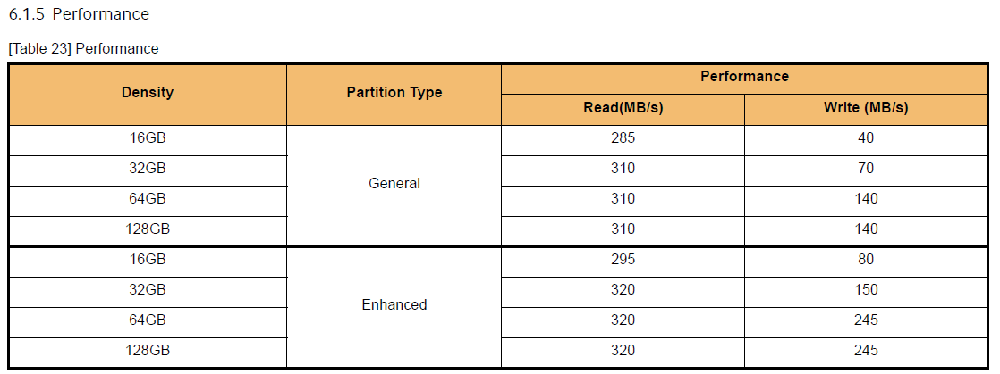
​																					图1‑1 eMMC Performance示例

#### SPI Nor及SLC Nand支持列表

Rockchip 平台 SPI Nor 及 SLC Nand 支持列表，详见 <SDK>/docs/Common/AVL 目录下《RK SpiNor and  SLC Nand SupportList Ver1.32_20210506.pdf》，文档中也有标注SPI Nand的型号，可供选型。下表中所标示的Nand支持程度表，只建议选用√、T/A标示的颗粒。

表 1‑3 Rockchip SPI Nor and SLC Nand Support Symbol

| **Symbol** | **Description**                                         |
| ---------- | :------------------------------------------------------ |
| √          | Fully Tested , Applicable and Mass Production           |
| T/A        | Fully Tested , Applicable and Ready for Mass Production |
| D/A        | Datasheet Applicable,Need Sample to Test                |
| N/A        | Not Applicable                                          |

#### Nand Flash支持列表

Rockchip 平台 Nand Flash 支持列表，详见 <SDK>/docs/Common/AVL 目录下《RKNandFlashSupportList Ver2.73_20180615.pdf》，文档中有标注 Nand Flash 的型号，可供选型。下表中所标示的 Nand Flash 支持程度表，只建议选用√、T/A标示的颗粒。

表 1‑4 Rockchip Nand Flash Support Symbol

| **Symbol** | **Description**                                         |
| ---------- | :------------------------------------------------------ |
| √          | Fully Tested , Applicable and Mass Production           |
| T/A        | Fully Tested , Applicable and Ready for Mass Production |
| D/A        | Datasheet Applicable,Need Sample to Test                |
| N/A        | Not Applicable                                          |

#### WIFI/BT支持列表

Rockchip 平台 WIFI/BT 支持列表，详见  <SDK>/docs/Common/AVL 目录下《Rockchip_Support_List_WiFi_and_BT_20190801_EN.pdf》 ，文档列表中为目前Rockchip平台上大量测试过的WIFI/BT芯片列表，建议按照列表上的型号进行选型。如果有其他WIFI/BT芯片调试，需要WIFI/BT芯片原厂提供对应内核驱动程序。
成熟度详见文档中说明：
Perfect > Very Good > Good > Preliminary > X
如有选型上的疑问，建议可以与Rockchip FAE窗口<fae@rock-chips.com>联系。

#### Camera支持列表

Rockchip 平台 Camera 支持列表，详见 <SDK>/docs/Common/AVL 目录下《Rockchip_Camera_Module_AVL_v2.1.pdf》，文档列表中为目前Rockchip平台上大量测试过的Camera Module 列表，建议按照列表上的型号进行选型。
注释:
1.该表格中模组，Rockchip 向模组厂直接采购模组进行效果调试，客户按照模组编号向模组厂采购(可更改FPC连接线)，未改变模组结构以及配置前提下，Rockchip、模组厂尽量保证效果可以直接使用；
2.调试状态： (Y：调试完成，N：尚未调试完成)
IQ：效果调试状态
driver(linux)：适配 Rockchip Linux 系统的 sensor driver，具体详见 driver 目录说明；
如有选型上的疑问，建议可以与Rockchip FAE窗口<fae@rock-chips.com>联系。

### 芯片平台相关文档 (Socs)

详见 <SDK>\docs\芯片名称 目录下的文档。

#### SDK软件包适用的硬件开发指南

Rockchip 平台会有对应的硬件参考文档随 SDK 软件包一起发布。硬件用户使用指南主要介绍参考硬件板基本功能特点、硬件接口和使用方法。旨在帮助相关开发人员更快、更准确地使用该 EVB，进行相关产品的应用开发，详见 <SDK>/docs/芯片名称/ 目录下相关文档 。

#### 多媒体编解码支持列表

Rockchip芯片比如RK3399/RK3399Pro 支持强大的多媒体功能：支持 4K VP9 and 4K 10bits H265/H264 视频解码，高达 60fps， 1080P 多格式视频解码 (WMV, MPEG-1/2/4, VP8)， 1080P 视频编码，支持 H.264，VP8 格式，视频后期处理器：反交错、去噪、边缘/细节/色彩优化。

注意：这是芯片的支持情况,实际搭配不同系统可能支持格式和性能会有所不同。

### Linux 系统开发文档 (Linux)

详见 <SDK>/docs/Linux 目录下的文档。

### 其他参考文档 (Others)

其他参考文档，比如Linux 软件测试指南、Rockchip SDK申请及同步指南、Rockchip Bug 系统使用指南等，详见 <SDK>/docs/Others 目录下的文档。

### 文件目录结构 (docs_list.txt)

详见 <SDK>/docs/docs_list.txt 文档。

```
docs
├── Common
├── docs_list.txt
├── Linux
├── Others
├── Rockchip_Developer_Guide_Linux_Software_CN.pdf
├── Socs
```

## 工具说明

随 Rockchip Linux SDK 发布的工具，用于开发调试阶段及量产阶段。工具版本会随SDK更新不断更新，如有工具上的疑问及需求，请联系我们的 FAE 窗口<fae@rock-chips.com>。
Rockchip Linux SDK 中在 tools 目录下附带了linux（Linux操作系统环境下使用工具）、windows（Windows操作系统环境下使用工具）。

- Windows工具

工具说明文档：tools/windows/ToolsRelease.txt

| 工具名称              | 工具用途                             |
| --------------------- | ------------------------------------ |
| RKDevTool             | 分立升级固件及整个update升级固件工具 |
| FactoryTool           | 量产升级工具                         |
| SecureBootTool        | 固件签名工具                         |
| efuseTool             | efuse烧写工具                        |
| RKDevInfoWriteTool    | 写号工具                             |
| SDDiskTool            | SD卡镜像制作                         |
| programmer_image_tool | 烧录器升级工具                       |
| pin_config_tool| IO配置工具                       |
| DriverAssitant        | 驱动安装工具                         |
| RKImageMaker          | 打包工具(打包成updata.img)           |
| SpeakerPCBATool       | 音箱PCBA测试工具                     |
| RKDevTool_Release     | 固件烧录工具                         |
| ParameterTool         | 分区表修改工具                       |
| CameraFactoryTestTool      | 摄像头模组厂测工具                    |

- Linux工具

工具说明文档：tools/linux/ToolsRelease.txt

| 工具名称            | 工具用途                                      |
| ------------------- | --------------------------------------------- |
| Linux_Pack_Firmware | 固件打包工具(打包成updata.img)                |
| Linux_Upgrade_Tool  | 烧录固件工具                                  |
| Linux_SecureBoot    | 固件签名工具                                  |
| Linux_TA_Sign_Tool  | loader（miniloader/trust/uboot）签名工具      |
| Linux_SecurityAVB   | boot/recovery签名工具                         |
| Linux_SecurityDM    | rootfs签名工具                                |
| programmer_image_tool    | 打包SPI NOR/SPI NAND/SLC NAND/eMMC的烧录器固件 |

### 驱动安装工具

Rockchip USB 驱动安装助手存放在 `<SDK>/tools/windows/DriverAssitant_<版本>.zip`。支持
xp,win7_32,win7_64, win10_32,win10_64等操作系统。

安装步骤如下：

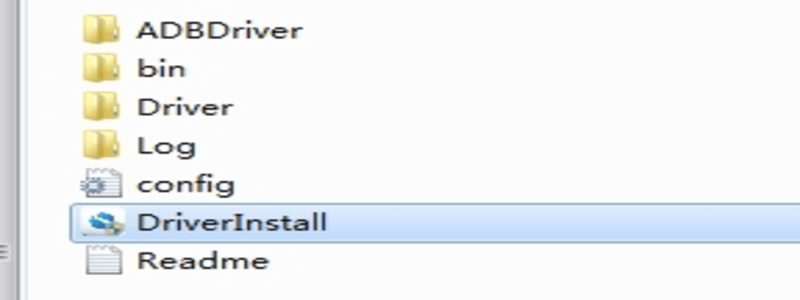</left>

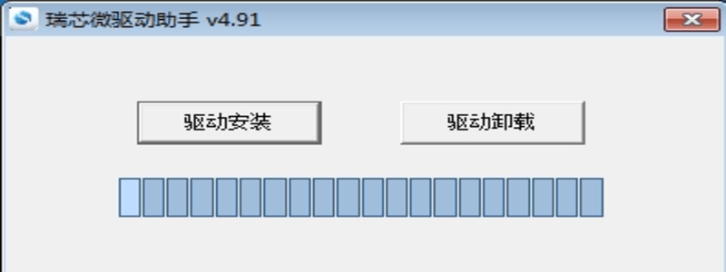</left>

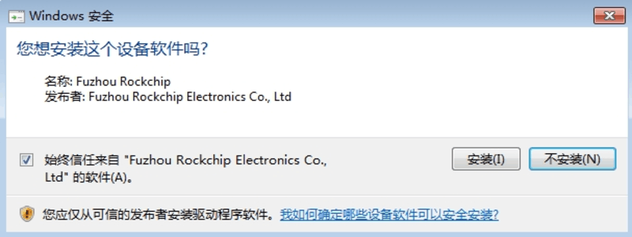</left>

### 开发烧写工具

- SDK 提供 Windows 烧写工具(工具版本需要 V2.84 或以上)，工具位于工程根目录：

```shell
<SDK>/Tools/windows/RKDevTool/
```

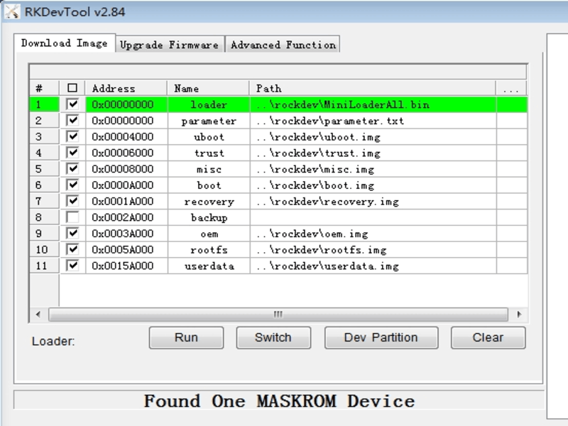</left>

- SDK 提供 Linux 烧写工具(Linux_Upgrade_Tool 工具版本需要 V1.65 或以上)，工具位于工程根目录：

```shell
<SDK>/Tools/linux/Linux_Upgrade_Tool/
```

```
Linux_Upgrade_Tool$ sudo ./upgrade_tool -h
Program Data in /home/wxt/.config/upgrade_tool

---------------------Tool Usage ---------------------
Help:             H
Quit:             Q
Version:          V
Clear Screen:     CS
------------------Upgrade Command ------------------
ChooseDevice:		CD
ListDevice:		    LD
SwitchDevice:		SD
UpgradeFirmware:	UF <Firmware> [-noreset]
UpgradeLoader:		UL <Loader> [-noreset]
DownloadImage:		DI <-p|-b|-k|-s|-r|-m|-u|-t|-re image>
DownloadBoot:		DB <Loader>
EraseFlash:		EF <Loader|firmware> [DirectLBA]
PartitionList:		PL
WriteSN:		SN <serial number>
ReadSN:		    RSN
----------------Professional Command -----------------
TestDevice:		TD
ResetDevice:		RD [subcode]
ResetPipe:		RP [pipe]
ReadCapability:		RCB
ReadFlashID:		RID
ReadFlashInfo:		RFI
ReadChipInfo:		RCI
ReadSector:		RS  <BeginSec> <SectorLen> [-decode] [File]
WriteSector:		WS  <BeginSec> <File>
ReadLBA:		RL  <BeginSec> <SectorLen> [File]
WriteLBA:		WL  <BeginSec> <File>
EraseLBA:		EL  <BeginSec> <EraseCount>
EraseBlock:		EB <CS> <BeginBlock> <BlokcLen> [--Force]
-------------------------------------------------------
```

### 打包工具

主要用于各分立固件打包成一个完整的update.img固件方便升级。

- Windows 环境下打包update.img固件方法，运行如下命令生成update.img

```
<SDK>/tools/windows/RKDevTool/rockdev/mkupdate.bat
```

- Linux 环境下打包update.img固件方法，运行如下命令生成update.img

```
<SDK>/tools/linux/Linux_Pack_Firmware/rockdev$./mkupdate.sh
```

### SD升级启动制作工具

用于制作SD卡升级、SD卡启动、SD卡PCBA测试.

```
<SDK>/tools/windows/SDDiskTool_v1.62.zip
```

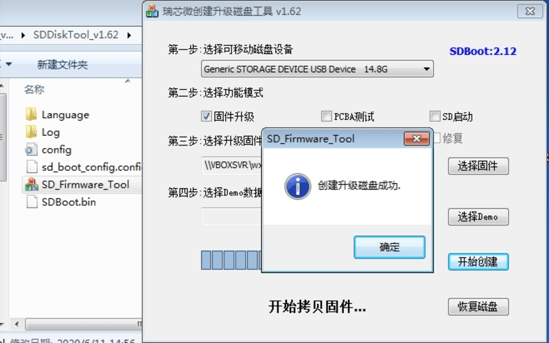</left>

### 写号工具

<SDK>/tools/windows/RKDevInfoWriteTool_Setup_V1.0.4_0422.zip
解压RKDevInfoWriteTool_Setup_V1.0.4_0422.zip后安装,以管理员权限打开软件，工具使用参考当前目录《RKDevInfoWriteTool使用指南.pdf》。

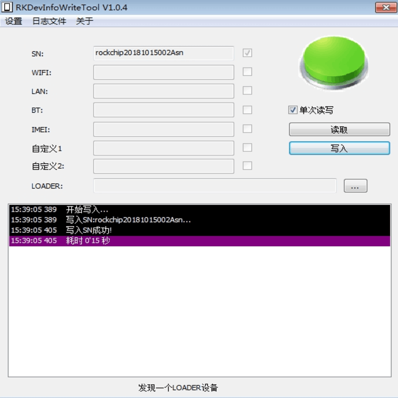</left>

### 固件签名工具

用于固件的efuse/otp签名.

-  SDK 提供 Windows 签名工具位于工程根目录：

```
<SDK>/tools/windows/SecureBootTool_v1.96
```

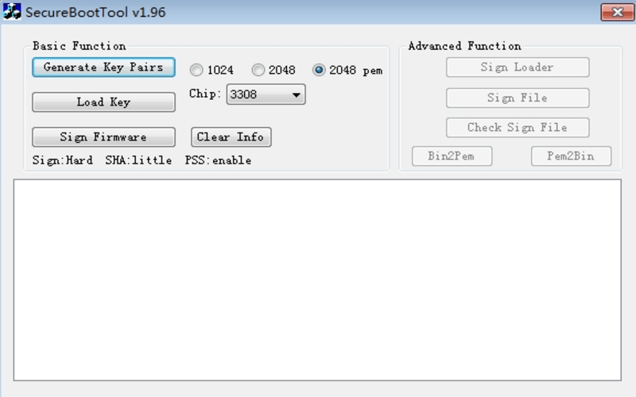</left>

 - SDK 提供 Linux 签名工具位于工程根目录：

```
<SDK>/tools/linux/rk_sign_tool_v1.31_linux.zip

rk_sign_tool_v1.3_linux$ ./rk_sign_tool
rk_sign_tool is a tool signing firmware and loader for secureboot
usage of rk_sign_tool v1.3:
CC <--chip chip_id> //select sign options by chip
KK [--bits default=2048] <--out> //generating rsa key pairs
LK <--key> <--pubkey> //loading rsa key pairs
SI [--key] <--img> [--pss] //signing image like boot uboot trust
SL [--key] [--pubkey] <--loader> [--little] [--pss] //signing loader like RKXX_loader.bin
SF [--key] [--pubkey] <--firmware> [--little] [--pss] //signing firmware like update.img
SB [--key] <--bin> [--pss] //signing binary file
GH <--bin> <--sha 160|256> [--little] //computing sha of binary file
******rk_sign_tool XX -h to get more help******
```

工具使用参考目录<SDK>/docs/Linux/Security/Rockchip_Developer_Guide_Linux4.4_SecureBoot_CN.pdf 中签名工具使用说明。

### 烧录器升级工具

用于量产烧录器镜像制作工具，该工具位于：

```
<SDK>/tools/windows/programmer_image_tool 或 <SDK>/tools/linux/programmer_image_tool
```

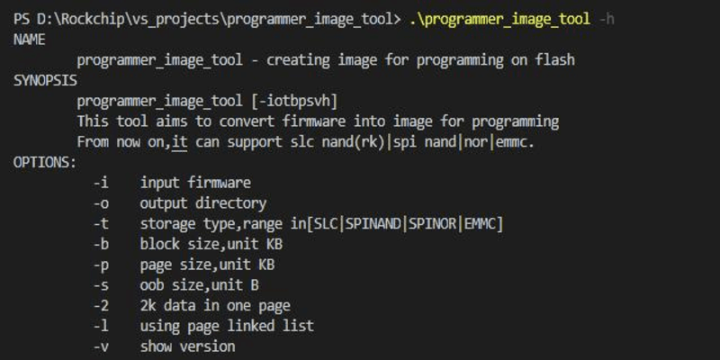</left>

烧录器镜像制作步骤:

- 烧录镜像到 emmc

```shell
./programmer_image_tool -i update.img -t emmc
```

- 烧录镜像到 spi nor

```
./programmer_image_tool -i update.img -t spinor
```

更多使用说明参考工具目录 `user_manual.pdf`文档。

### PCBA测试工具

PCBA 测试工具用于帮助在量产的过程中快速地甄别产品功能的好坏,提高生产效率。目前包括屏幕
(LCD)、无线(Wi-Fi)、蓝牙(bluetooth)、DDR/EMMC 存储、SD 卡(sdcard)、USB HOST、按键(KEY),喇叭耳机(Codec)等测试项目。

这些测试项目包括自动测试项和手动测试项,无线网络、DDR/EMMC、以太网为自动测试项,按键、
SD卡、USB HOST、Codec、为手动测试项目。

PCBA工具位于：

```
<SDK>/tools/windows/RKPCBATool_V1.0.9.zip
```

具体PCBA功能配置及使用说明,请参考:

<SDK>/tools/windows/RKPCBATool_V1.0.9/Rockchip PCBA测试开发指南_1.10.pdf

</left>

### DDR焊接测试工具

用于测试DDR的硬件连接,排查虚焊等硬件问题：

```
<SDK>/tools/windows/Rockchip_Platform_DDR_Test_Tool_V1.38_Release_Annoucement_CN.7z
<SDK>/tools/windows/Rockchip_Platform_DDR_Test_Tool_V1.38_Release_Annoucement_EN.7z
```

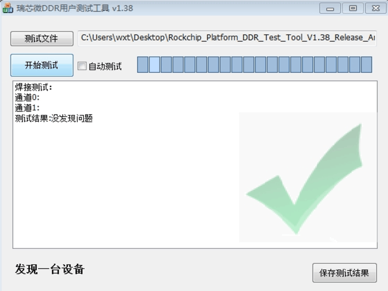</left>

### eFuse烧写工具

用于eFuse的烧写,适用于RK3288/RK3368/RK3399/RK3399Pro等平台。

```
<SDK>/tools/windows/EfuseTool_v1.4.zip
```

如果芯片使用 eFuse 启用 SecureBoot 功能,请保证硬件连接没有问题,因为 eFuse 烧写时,Kernel
尚未启动,所以请保证 VCC_EFUSE 在 MaskRom 状态下有电才能使用。

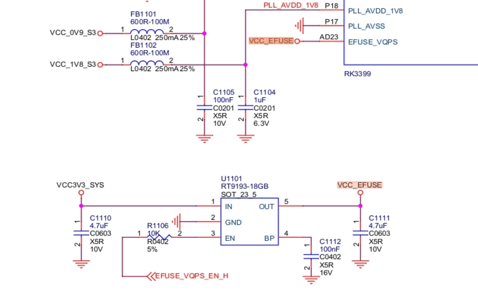</left>

使用 <SDK>/Tools/windows/EfuseTool_v1.4.zip,板子进入 MaskRom 状态。
点击“固件”,选择签名的 update.img,或者 Miniloader.bin,点击运行“启动”,开始烧写 eFuse。

### 量产升级工具

用于工厂批量烧写固件：

```
<SDK>/tools/windows/FactoryTool_v1.68.02.zip
```

### 分区修改工具

用于Paramter.txt中的分区修改工具：

```
<SDK>/tools/windows/ParameterTool_v1.0.zip
```

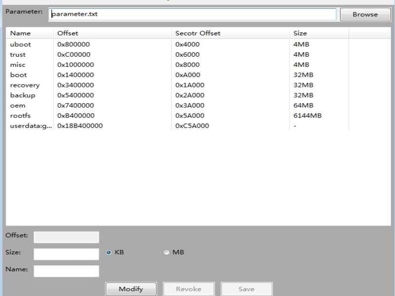</left>

### 摄像头模组厂测工具

用于摄像头模组厂测，该工具位于：

```
<SDK>/tools/windows/CameraFactoryTestTool-v2.0.5.1.zip
```

### EQTool工具

EQ_DRC工具(Equalizer& Dynamic Range Control Tool)是语音均衡器和动态范围规划调参工具
——以下简称EQTool。使用该工具可以在线调试各类音频参数,适用于RK3308。

该工具位于：

```
<SDK>/tools/windows/eq_drc_tool-v1.23.zip
```

## SDK软件架构

### SDK工程目录介绍

一个通用 Linux SDK 工程目录包含有 buildroot、debian、app、kernel、u-boot、device、docs、external 等目录。其中一些特性芯片如RK3308/RV1108/RV1109/RV1126等，会有所不同。每个目录或其子目录会对应一个 git 工程，提交需要在各自的目录下进行。

- app： 存放上层应用 app，主要是 qcamera/qfm/qplayer/settings 等一些应用程序。

- buildroot： 基于 buildroot (2018.02-rc3) 开发的根文件系统。

- debian： 基于debian 10 开发的根文件系统，支持部分芯片。

- device/rockchip： 存放各芯片板级配置和Parameter文件，以及一些编译与打包固件的脚本和预备文件。

- docs： 存放芯片模块开发指导文档、平台支持列表、芯片平台相关文档、Linux开发指南等。

- IMAGE： 存放每次生成编译时间、XML、补丁和固件目录。

- external： 存放第三方相关仓库,包括音频、视频、网络、recovery 等。

- kernel： 存放 kernel 4.4 或 4.19 开发的代码。

- prebuilts： 存放交叉编译工具链。

- rkbin： 存放 Rockchip 相关的 Binary 和工具。

- rockdev： 存放编译输出固件。

- tools： 存放 Linux 和 Windows 操作系统环境下常用工具。

- u-boot：存放基于 v2017.09 版本进行开发的 uboot 代码。

- yocto：基于 yocto gatesgarth 3.2 开发的根文件系统，支持部分芯片。

### SDK概述

#### Distribution

Distribution 就是我们日常在 Linux Host 上使用的那些系统。

如果是基于 Distribution 开发应用，事情相对变得简单。因为整个环境的配置，只要从网络源下已经编译和配置好的二进制包就可以了。比如，需要 qtmultimedia，python时，不需要关心 qtmultimedia 有哪些依赖，python 编译要做什么配置。比如在开发一些重度的 Web 应用，基于 python， nodejs 的后端，配置nginx， iptables 等，如果想基于 Buildroot 和 Yocto 进行开发，恐怕需要准备一个庞大团队才能完成。

缺点也较明显，没办法定制，就带来了冗余和缺损。冗余的体现就是更大的体积，比如 Xserver，系统默认的 Xserver 都会开启 selinux， glx这些嵌入式系统上根本用不到的功能，占用空间会更大。同样的功能，Yocto可能做出来占用空间 500 Mb， 而 Debian 需要 1 个 Gb空间。缺损的体现就是性能损失，没有做到最优的配置，比如QT， 默认发行版的都没有开启 gles 的支持，默认都是使用 gl， 而嵌入式系统上使用的都是 gles，这就导致在发行版上运行 QT 的时候，UI都是通过软件的 gl 来完成，而没走硬件的 gles，性能出现了损失。

#### Buildroot

Rockchip Buildroot Linux SDK 是基于 Buildroot-2018.02 的版本的软件开发包，其包含了基于 Linux 系统开发用到的各种系统源码，驱动，工具，应用软件包。Buildroot 是 Linux 平台上一个开源的嵌入式 Linux 系统自动构建框架。整个 Buildroot 是由 Makefile 脚本和 Kconfig 配置文件构成的。你可以通过Buildroot配置，编译出一个完整的可以直接烧写到机器上运行的 Linux 系统软件。

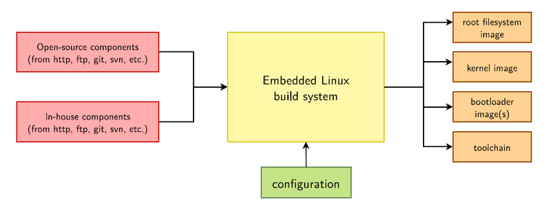</left>
															图4-1 Buildroot编译框图</center>

 Buildroot 有以下几点优势：

- 通过源码构建，有很大的灵活性；
- 方便的交叉编译环境，可以进行快速构建；
- 方便各系统组件配置及定制开发。

使用 Buildroot 的 project 最出名的就是 Openwrt 。可以看到，由它制作出的镜像可以跑在搭载16 Mb SPI NOR的路由器上，系统基本没包含多余的东西。 这就是得益于 Buildroot 的地方：简单化。整个 Buildroot project 在一个git维护。[Buildroot](https://git.busybox.net/buildroot/) 使用 kconfig 和 make，一个[defconfig](https://git.busybox.net/buildroot/tree/configs/beaglebone_defconfig) 配置代表一种 BSP 支持。

Buildroot 本身不具备扩展能力，用户需要自己通过脚本来完成工作。这些列出来的特点，都是和 Yocto 不同的地方。

#### Yocto

Yocto 和 Buildroot 一样， 是一套构建嵌入式系统的工具，但是两者的风格完全不同。
Yocto project 是通过一个个单独的包（meta）来维护，比如有的包负责核心，有的包负责外围。有的包用于跑 Rockchip 的芯片，有的包用于安装上 Qt, 有的包是则是用于跑 debian， 同样采用类似机制的 nodejs，社区膨胀非常厉害，活跃度很高，每个人都分享自己低质量垃圾包到 github 上,这样的机制保证了我们可以从互联网复用别人的工作成果，相当有价值。

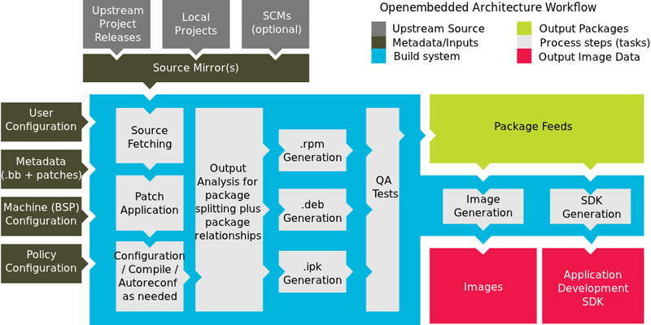</left>
																					图4-2 Yocto编译框图

Yocto 有一个非常灵活的构建系统，允许用户使用shell 和 python 处理各种特殊情况。更多Yocto参考如下：

- [Yocto](https://www.yoctoproject.org/)
- [Rockchip Yocto](http://opensource.rock-chips.com/wiki_Yocto)
- [Yocto stable branch](https://wiki.yoctoproject.org/wiki/Stable_branch_maintenance)

### SDK软件框图

 SDK 软件框图4-3 所示， 从下至上分为Bootloader、Linux Kernel、Libraries、Applications四个层次。各层次内容如下：

- Bootloader层主要提供底层系统支持包，如Bootloader、U-Boot、ATF相关支持。

- Kernel层主要提供Linux Kernel的标准实现，Linux也是一个开放的操作系统。Rockchip平台的Linux核心为标准的Linux4.4/4.19内核，提供安全性，内存管理，进程管理，网络协议栈等基础支持；主要是通过 Linux 内核管理设备硬件资源，如 CPU调度、缓存、内存、I/O 等。

- Libraries层对应一般嵌入式系统，相当于中间件层次。包含了各种系统基础库，及第三方开源程序库支持，对应用层提供API接口，系统定制者和应用开发者可以基于Libraries层的API开发新的应用。

- Applications层主要是实现具体的产品功能及交互逻辑，需要一些系统基础库及第三方程序库支持，开发者可以开发实现自己的应用程序，提供系统各种能力给到最终用户。

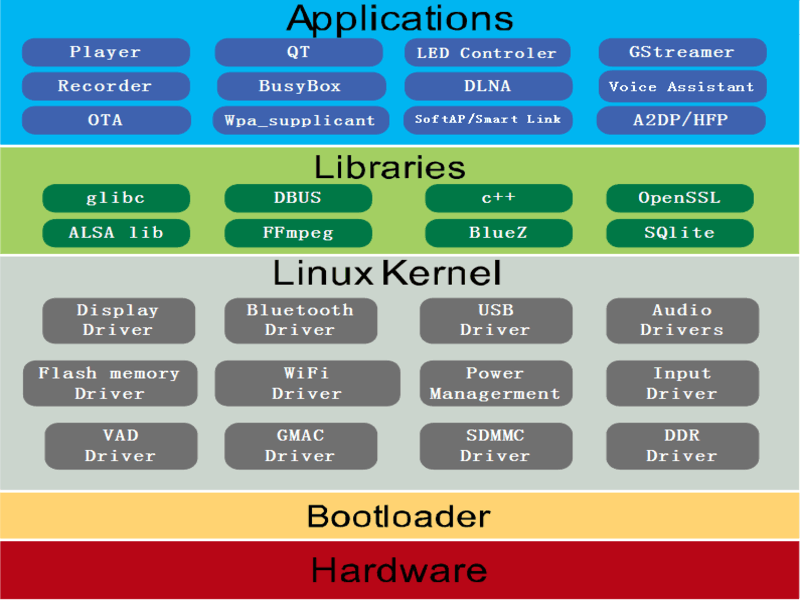</left>
																					图4-3 SDK软件框图

SDK 系统启动流程如图4-3.1所示。

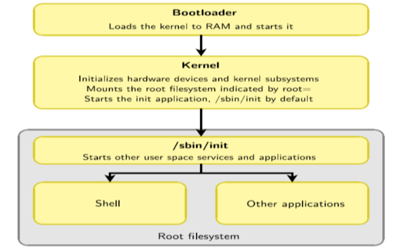</left>
																					图4-3.1 SDK启动流程

### SDK开发流程

Rockchip  Linux系统是基于Buildroot/Yocto/Debian  系统, 内核基于 kernel 4.4/4.19开发，针对多种不同产品形态开发的SDK。可以基于本SDK，有效地实现系统定制和应用移植开发。

</left>
																					图4-4 SDK开发流程

如图4-4所示，开发者可以遵循上述开发流程，在本地快速构建Rockchip Linux系统的开发环境和编译代码。下面将简单介绍下该流程：

- 检查系统需求：在下载代码和编译前，需确保本地的开发设备能够满足需求，包括机器的硬件能力，软件系统，工具链等。目前SDK支持Linux操作系统环境下编译，并仅提供Linux环境下的工具链支持，其他如MacOS，Windows等系统暂不支持。

- 搭建编译环境：介绍开发机器需要安装的各种软件包和工具，详见5章开发环境搭建，获知 Rockchip Linux 已经验证过的 Linux 操作系统版本，编译时依赖的库文件等。选择设备：在开发过程中，需要开发者根据自己的需求，选择对应的硬件板型，详见   [SDK适配硬件全自动编译汇总](# SDK适配硬件全自动编译汇总)。

- 下载源代码：选定设备类型后，需要安装repo工具用于批量下载源代码，详见 6.4 节 SDK获取。系统定制：开发者可以根据使用的硬件板子、产品定义，定制U-Boot（详见 9.1 节 U-Boot开发）、Kernel（详见 9.2 节Kernel 开发）及Buildroot（详见 9.4 节 Buildroot开发），请参考章节中相关开发指南和配置的描述。

- 编译与打包：介绍具备源代码后，选择产品及初始化相关的编译环境，而后执行编译命令，包括整体或模块编译以及编译清理等工作，进一步内容详见 7 章 SDK编译。烧录并运行：继生成镜像文件后，将介绍如何烧录镜像并运行在硬件设备，进一步内容详见 8.1 节 SDK镜像烧写。

## SDK 开发坏境搭建

### 概述

本节主要介绍了如何在本地搭建编译环境来编译Rockchip Buildroot Linux SDK源代码。当前SDK只支持在Linux环境下编译，并提供Linux下的交叉编译工具链。
一个典型的嵌入式开发环境通常包括Linux 服务器、Windows PC和目标硬件版，典型开发环境如下图 所示。

- Linux 服务器上建立交叉编译环境，为软件开发提供代码更新下载，代码交叉编译服务。
- Windows PC 和 Linux 服务器共享程序，并安装Putty，通过网络远程登陆到 Linux 服务器，进行交叉编译，及代码的开发调试。
- Windows PC 通过串口和 USB 与目标硬件板连接，可将编译后的镜像文件烧写到目标硬件板，并调试系统或应用程序。

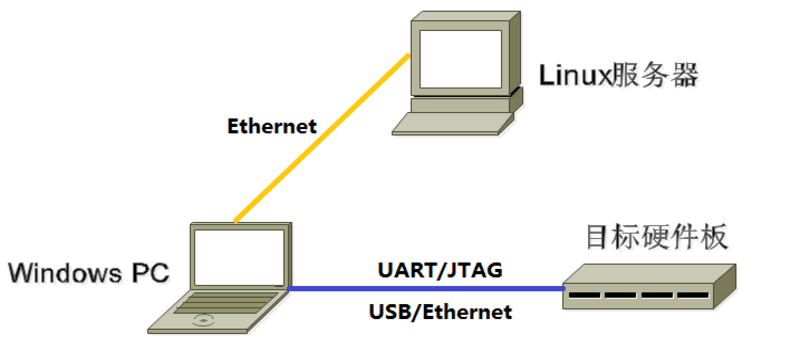</left>

注：开发环境中使用了Windows PC，实际上很多工作也可以在 Linux PC 上完成，如使用minicom 代替Putty等，用户可自行选择。

### Linux服务器开发环境搭建

Rockchip Linux SDK是在 Ubuntu 18.04 以上系统开发测试的。因此，我们推荐使用Ubuntu 18.04以上系统进行编译。其他版本没有具体测试，可能需要对软件包做相应调整。
除了系统要求外，还有其他软硬方面的要求。

- 硬件要求：64位系统，硬盘空间大于40G。如果您进行多个构建，将需要更大的硬盘空间。
- 软件包依赖：除了python 2.7，make 3.8，git 1.7之外，还需要安装一些额外的软件包，将在软件包安装章节中列出。

#### 发布包使用Linux服务器系统版本

本SDK开发环境安装如下版本Linux 系统，SDK默认均以此Linux 系统进行编译：

```
Ubuntu 18.04.4 LTS
Linux version 4.15.0-109-generic (buildd@lgw01-amd64-010) (gcc version 7.5.0 (Ubuntu 7.5.0-3ubuntu1~18.04)) #110-Ubuntu SMP Tue Jun 23 02:39:32 UTC 2020
```

#### 网络环境搭建

请用户自行配置网络，并安装nfs，samba，ssh 等网络组件。

#### 安装依赖包

本 SDK 开发环境是在 Ubuntu 系统上开发测试。我们推荐使用 Ubuntu 18.04 的系统进行编译。其他的 Linux 版本可能需要对软件包做相应调整。除了系统要求外，还有其他软硬件方面的要求。
硬件要求：64 位系统，硬盘空间大于 40G。如果您进行多个构建，将需要更大的硬盘空间。
软件要求：Ubuntu 18.04 系统：
编译 SDK 环境搭建所依赖的软件包安装命令如下：

```
sudo apt-get install repo git ssh make gcc libssl-dev liblz4-tool \
expect g++ patchelf chrpath gawk texinfo chrpath diffstat binfmt-support \
qemu-user-static live-build bison flex fakeroot cmake gcc-multilib g++-multilib unzip \
device-tree-compiler python-pip ncurses-dev pyelftools \
```

建议使用 Ubuntu18.04 系统或更高版本开发，若编译遇到报错，可以视报错信息，安装对应的软件包。

#### 交叉编译工具链介绍

鉴于Rockchip Buildroot SDK目前只在Linux下编译，我们也仅提供了Linux下的交叉编译工具链。其中U-Boot及Kernel使用的编译工具链预置目录在prebuilt/gcc下，buildroot使用该开源软件中编译出来的工具链。
U-Boot 及Kernel编译工具链：

```
prebuilts/gcc/linux-x86/aarch64/gcc-linaro-6.3.1-2017.05-x86_64_aarch64-linux-gnu/bin/aarch64-linux-gnu-
```

对应版本

```
gcc version 6.3.1 20170404 (Linaro GCC 6.3-2017.05)
```

Buildroot编译工具链
64位系统：
buildroot/output/rockchip_rk356x/host/bin/aarch64-buildroot-linux-gnu-
32位系统：
buildroot/output/rockchip_rk356x/host/usr/arm-linux-gcc

对应版本：

```
gcc version 9.3.0 (Buildroot 2018.02-rc3-02723-gd3fbc6ae13)
```

如果需要其他平台或版本的工具链，需自行编译。
上述环境准备好后，Linux服务器开发环境搭建已完成，可以下载编译源代码了。

### Window PC 开发坏境搭建

#### 开发工具安装

请用户自行安装 Vim，Notepad++等编辑软件。

#### Rockchip USB 驱动安装

开发调试阶段，需要将设备切换至 Loader 模式或是 Maskrom 模式，需要安装 Rockusb 驱动
才能正常识别设备。
Rockchip USB 驱动安装助手存放在 tools/windows/DriverAssitant_v5.x.zip。支持
xp,win7_32,win7_64,win10_32,win10_64 等操作系统。
安装步骤如下：

</left>

</left>

#### Windows 烧录工具使用

Windows 系统上的的烧录工具发布在
tools/windows/RKDevTool/RKDevTool_Release，可用于 Windows 环境下开发调试，固件的烧写。具体的使用说明见 12.3 节 瑞芯微开发工具。

#### 目标硬件板准备

请参考SDK 软件包适用硬件列表[SDK软件包适用硬件列表](#SDK软件包适用硬件列表)，选择对应硬件板子，进行后续的开发调试。
对应的硬件使用说明文档，会介绍硬件接口，使用说明，及烧录操作方法。

## SDK 安装准备工作

### 简要介绍

Rockchip Linux SDK 的代码和相关文档被划分为了若干 git 仓库分别进行版本管理，开发者可以使用 repo 对这些 git 仓库进行统一的下载，提交，切换分支等操作。

### 安装 repo

确保主目录下有一个 bin/ 目录，并且该目录包含在路径中：

```shell
mkdir ~/bin
export PATH=~/bin:$PATH
```

如果可以访问 google 的地址，下载 Repo 工具，并确保它可执行：

```shell
curl https://storage.googleapis.com/git-repo-downloads/repo > ~/bin/repo
chmod a+x ~/bin/repo
```

中国国内环境如果执行上述命令后发现~/bin/repo 为空，此时可以访问国内的站点来下载repo 工具

```shell
curl https://mirrors.tuna.tsinghua.edu.cn/git/git-repo -o ~/bin/repo
chmod a+x ~/bin/repo
```

除以上两种方式外，也可以使用如下命令获取 repo

```
sudo apt-get install repo
```

### Git 配置

在使用 repo 之前请配置一下自己的 git 信息，否则后面的操作可能会遇到 hook 检查的障碍：

```
git config --global user.name "your name"
git config --global user.email "your mail"
```

### SDK 获取

SDK 通过瑞芯微代码服务器对外发布。客户向瑞芯微技术窗口申请 SDK，需同步提供 SSH 公钥进行服务器认证授权，获得授权后即可同步代码。关于瑞芯微代码服务器 SSH 公钥授权，请参考
本文章节[SSH 公钥操作说明](#SSH 公钥操作说明)。

#### SDK 下载命令

Rockchip Linux SDK 被设计为可以适配到不同的芯片平台上，如 RK3566、RK3568、RK3308，RK3288，RK3326/PX30，RK3399，RK3399Pro, RK1808等，对于不同芯片平台的源代码会有一定程度的不同。开发者下载源代码的时候声明自己想要的芯片平台，从而不必下载自己不需要的代码。

SDK 使用 -m <芯片平台_linux_release>.xml 来声明自己想要下载的对应芯片平台。

请参考本文章节[通过代码服务器下载](#通过代码服务器下载)。

代码将开始自动下载，后面只需耐心等待。源代码文件将位于工作目录中对应的项目名称下。初始同步操作将需要 1 个小时或更长时间才能完成。

#### SDK 代码压缩包

为方便客户快速获取 SDK 源码，瑞芯微技术窗口通常会提供对应版本的 SDK 初始压缩包，开发者可以通过这种方式，获得 SDK 代码的初始压缩包，该压缩包解压得到的源码，与通过 repo 下载的源码是一致的。

请参考本文章节[通过本地压缩包解压获取](#通过本地压缩包解压获取)。

#### 软件更新记录

为方便客户及开发者了解到 SDK 更新所覆盖的修改，解决的问题。SDK 上加入了
ReleaseNote.txt，该文件会记录每次更新解决的问题，及是否建议客户全部更新。请客户及开发者更新 ReleaseNote 后，查看更新内容，并决定是否更新 SDK 代码。

软件发布版本升级通过工程 xml 进行查看当前版本，具体方法如下：

```
.repo/manifests$ ls -l -h 芯片名称_linux_release.xml
```

软件发布版本升级更新内容通过工程文本可以查看，具体方法如下：

```
.repo/manifests$ cat */芯片型号_Linux_SDK_Note.md
```

或者参考工程目录：

```
<SDK>/docs/芯片型号/芯片型号_Linux_SDK_Note.md
```

### SDK 更新

后续开发者可根据 FAE 窗口定期发布的更新说明，通过命令同步更新。

```
.repo/repo/repo sync -c --no-tags
```

### SDK 问题反馈

Rockchip bug 系统（Redmine）为了更好的帮助客户开发，记录了用户问题处理过程及状态，方便双方同时跟踪，使问题处理更及时更高效。后续 SDK 问题、具体技术问题、技术咨询等都可以提交到此 Bug 系统上，Rockchip 技术服务会及时将问题进行分发、处理和跟踪。更多详细说明，可参考文档 <SDK>/docs/Others/Rockchip_User_Guide_SDK_Application_And_Synchronization_CN.pdf。

## SDK 编译

本 SDK 开发环境是在 Ubuntu 系统上开发测试。我们推荐使用 Ubuntu 18.04 的系统进行编译。其他的 Linux 版本可能需要对软件包做相应调整。除了系统要求外，还有其他软硬件方面的要求。
硬件要求：64 位系统，硬盘空间大于 40G。如果您进行多个构建，将需要更大的硬盘空间。
软件要求：Ubuntu 18.04 系统。

编译 SDK 环境搭建所依赖的软件包安装，参考 [软件包安装](#软件包安装)。

### U-Boot 编译

进入SDK工程。运行如下命令进行编译

```shell
<SDK>#./build.sh uboot
```

具体板级编译参考SDK发布文档中编译说明。

### Kernel  编译

进入工程目录根目录执行以下命令自动完成 kernel 的编译及打包。

```shell
<SDK>#./build.sh kernel
```

具体板级编译参考发布说明或者Quick Start中编译说明。

### Recovery 编译

进入工程根目录执行以下命令自动完成 Recovery 的编译及打包。

```shell
<SDK>#./build.sh recovery
```

编译后在 Buildroot 目录 output/rockchip_芯片型号_recovery/images 生成 recovery.img。
需要特别注意 recovery.img 是包含 kernel.img，所以每次 Kernel 更改，Recovery 是需要重新打包生成。例如下：

```
<SDK>$source envsetup.sh rockchip_芯片名称
<SDK>$make recovery-rebuild
<SDK>$./build.sh recovery
```

更多编译说明请参考SDK发布文档。

### Buildroot  编译

#### Rootfs 编译

进入工程目录根目录执行以下命令自动完成 Rootfs 的编译及打包：

```shell
 ./build.sh rootfs
```

编译后在 Buildroot 目录 output/rockchip_芯片型号/images下生成 rootfs.ext4。

#### 模块编译

比如 qplayer 模块，常用相关编译命令如下：

- 编译 qplayer

```
SDK$make qplayer
```

- 重编 qplayer

```
SDK$make qplayer-rebuild
```

- 删除 qplayer

```
SDK$make qplayer-dirclean
或者
SDK$rm -rf /buildroot/output/rockchip_芯片型号/build/qlayer-1.0
```

### Debian  编译

```
 ./build.sh debian
```

或进入 debian/ 目录：

```
cd debian/
```

后续的编译和 Debian 固件生成请参考当前目录 readme.md。

**(1) Building base Debian system**

```
sudo apt-get install binfmt-support qemu-user-static live-build
sudo dpkg -i ubuntu-build-service/packages/*
sudo apt-get install -f
```

编译 32 位的 Debian:

```shell
RELEASE=buster TARGET=desktop ARCH=armhf ./mk-base-debian.sh
```

或编译 64 位的 Debian:

```shell
RELEASE=butser TARGET=desktop ARCH=arm64 ./mk-base-debian.sh
```

编译完成会在  debian/ 目录下生成：linaro-buster-alip-xxxxx-1.tar.gz（xxxxx 表示生成时间戳)。

FAQ：

- 上述编译如果遇到如下问题情况：

```
noexec or nodev issue /usr/share/debootstrap/functions: line 1450:
..../rootfs/ubuntu-build-service/buster-desktop-arm64/chroot/test-dev-null: Permission denied E: Cannot install into target '/rootfs/ubuntu-build-service/buster-desktop-arm64/chroot' mounted with noexec or nodev
```

解决方法：

```
mount -o remount,exec,dev xxx
(其中xxx 是工程目录路径，然后重新编译）
```

另外如果还有遇到其他编译异常，先排除使用的编译系统是 ext2/ext4 的系统类型。

- 由于编译 Base Debian 需要访问国外网站，而国内网络访问国外网站时，经常出现下载失败的情况:

Debian  使用 live build,镜像源改为国内可以这样配置：

```diff

32位系统：

+++ b/ubuntu-build-service/buster-desktop-armhf/configure
@@ -11,6 +11,11 @@ set -e
 echo "I: create configuration"
 export LB_BOOTSTRAP_INCLUDE="apt-transport-https gnupg"
 lb config \
+ --mirror-bootstrap "http://mirrors.163.com/debian" \
+ --mirror-chroot "http://mirrors.163.com/debian" \
+ --mirror-chroot-security "http://mirrors.163.com/debian-security" \
+ --mirror-binary "http://mirrors.163.com/debian" \
+ --mirror-binary-security "http://mirrors.163.com/debian-security" \
  --apt-indices false \
  --apt-recommends false \
  --apt-secure false \

  64位系统：
  --- a/ubuntu-build-service/buster-desktop-arm64/configure
+++ b/ubuntu-build-service/buster-desktop-arm64/configure
@@ -11,6 +11,11 @@ set -e
 echo "I: create configuration"
 export LB_BOOTSTRAP_INCLUDE="apt-transport-https gnupg"
 lb config \
+ --mirror-bootstrap "http://mirrors.163.com/debian" \
+ --mirror-chroot "http://mirrors.163.com/debian" \
+ --mirror-chroot-security "http://mirrors.163.com/debian-security" \
+ --mirror-binary "http://mirrors.163.com/debian" \
+ --mirror-binary-security "http://mirrors.163.com/debian-security" \
  --apt-indices false \
  --apt-recommends false \
  --apt-secure false \
```

如果其他网络原因不能下载包，有预编生成的包分享在[百度云网盘](<<https://eyun.baidu.com/s/3bqwrvo7>)，放在当前目录直接执行下一步操作。

**(2) Building rk-debian rootfs**

编译 32位的 Debian：

```shell
VERSION=debug ARCH=armhf ./mk-rootfs-buster.sh
```

或编译 64位的 Debian：

```shell
VERSION=debug ARCH=arm64 ./mk-rootfs-buster.sh
```

**(3) Creating the ext4 image(linaro-rootfs.img)**

```shell
./mk-image.sh
```

此时会生成 linaro-rootfs.img。

### Yocto  编译

进入工程目录根目录执行以下命令自动完成 Rootfs 的编译及打包：

```shell
./build.sh yocto
```

编译后在 yocto/ build/lastest 目录下生成 rootfs.img。

FAQ：
上面编译如果遇到如下问题情况：

```
Please use a locale setting which supports UTF-8 (such as LANG=en_US.UTF-8).
Python can't change the filesystem locale after loading so we need a UTF-8
when Python starts or things won't work.
```

解决方法:

```shell
locale-gen en_US.UTF-8
export LANG=en_US.UTF-8 LANGUAGE=en_US.en LC_ALL=en_US.UTF-8
```

或者参考 [setup-locale-python3](< https://webkul.com/blog/setup-locale-python3>) 编译后生成的 image 在 yocto/build/lastest/rootfs.img， 默认用户名登录是 root。
Yocto 更多信息请参考 [Rockchip Wiki](<http://opensource.rock-chips.com/wiki_Yocto>)。

### 全自动编译

完成上述 Kernel/U-Boot/Recovery/Rootfs 各个部分的编译后，进入工程目录根目录执行以下命
令自动完成所有的编译：

```shell
./build.sh all # 只编译模块代码（u-Boot，kernel，Rootfs，Recovery）
               # 需要再执行./mkfirmware.sh 进行固件打包

./build.sh     # 在./build.sh all基础上
               # 1. 增加固件打包 ./mkfirmware.sh
               # 2. update.img打包
               # 3. 复制rockdev目录下的固件到IMAGE/***_RELEASE_TEST/IMAGES目录
               # 4. 保存各个模块的补丁到IMAGE/***_RELEASE_TEST/PATCHES目录
               # 注：./build.sh 和 ./build.sh allsave 命令一样
```

默认是 Buildroot ，可以通过设置坏境变量 RK_ROOTFS_SYSTEM 指定 rootfs 。
比如需要 buildroot 可以通过以下命令进行生成：

```shell
<SDK>$export RK_ROOTFS_SYSTEM=buildroot
<SDK>$./build.sh
```

具体参数使用情况，可 help 查询，比如：

```shell
<SDK>$ ./build.sh --help
Usage: build.sh [OPTIONS]
Available options:
BoardConfig*.mk    -switch to specified board config
uboot              -build uboot
spl                -build spl
kernel             -build kernel
modules            -build kernel modules
toolchain          -build toolchain
rootfs             -build default rootfs, currently build buildroot as default
buildroot          -build buildroot rootfs
ramboot            -build ramboot image
multi-npu_boot     -build boot image for multi-npu board
yocto              -build yocto rootfs
debian             -build debian9 stretch rootfs
distro             -build debian10 buster rootfs
pcba               -build pcba
recovery           -build recovery
all                -build uboot, kernel, rootfs, recovery image
cleanall           -clean uboot, kernel, rootfs, recovery
firmware           -pack all the image we need to boot up system
updateimg          -pack update image
otapackage         -pack ab update otapackage image
save               -save images, patches, commands used to debug
allsave            -build all & firmware & updateimg & save

Default option is 'allsave'.
```

## SDK 固件升级

本章节主要介绍如何将构建完整的镜像文件（image）烧写并运行在硬件设备上的流程。
Rockchip 平台提供的几种镜像烧写工具介绍如下所示，可以选择合适的烧写方式进行烧写。烧写前，需安装最新的 USB 驱动，详见 [Rockchip USB 驱动安装](#Rockchip USB 驱动安装)。

| **工具**           | **运行系统** | **描述**                                               |
| ------------------ | :----------- | :----------------------------------------------------- |
| RKDevTool          | Windows      | 瑞芯微开发工具，分立升级固件及整个 update 升级固件工具 |
| FactoryTool        | Windows      | 量产升级工具，支持 USB 一拖多烧录                      |
| Linux_Upgrade_tool | Linux        | Linux 下开发的工具，支持固件的升级                     |

### 烧写模式介绍

Rockchip 平台硬件运行的几种模式如表所示，只有当设备处于 Maskrom，及 Loader
模式下，才能够烧写固件，或对板上固件进行更新操作。

| **模式**    | **工具烧录** | **描述**                                                     |
| ----------- | :----------- | :----------------------------------------------------------- |
| Maskrom     | 支持         | Flash 在未烧录固件时，芯片会引导进入 Maskrom 模式，可以进行初次固件的烧写；<br/>开发调试过程中若遇到 Loader 无法正常启动的情况，也可进入 Maskrom 模式烧写固件。 |
| Loader      | 支持         | Loader 模式下，可以进行固件的烧写、升级。<br/>可以通过工具单独烧写某一个分区镜像文件，方便调试。 |
| Recovery    | 不支持       | 系统引导 recovery 启动，主要作用是升级、恢复出厂设置类操作。 |
| Normal Boot | 不支持       | 系统引导 rootfs 启动，加载 rootfs，大多数的开发都是在这个模式下调试的。 |

进入烧写模式方式以下几种方法：

- 未烧录过固件，上电，进入 Maskrom 模式。
- 烧录过固件，按住 recovery 按键上电或复位，系统将进入 Loader 固件烧写模式。
- 烧录过固件，按住 Maskrom 按键上电或复位，系统将进入 MaskRom 固件烧写模式。
- 烧录过固件，上电或复位后开发板正常进入系统后，瑞芯微开发工具上显示“发现一个 ADB设备”或“发现一个 MSC 设备”，然后点击工具上的按钮“切换”，进入 Loader 模式。
- 烧录过固件，可在串口或 ADB 命令行模式下，输入 reboot loader 命令，进入 Loader 模式。

#### Windows 刷机说明

SDK 提供 Windows 烧写工具(工具版本需要 V2.79 或以上)，工具位于工程根目录：

```shell
tools/
├── windows/RKDevTool
```

如下图，编译生成相应的固件后，设备烧写需要进入 MASKROM 或 BootROM 烧写模式，
连接好 USB 下载线后，按住按键“MASKROM”不放并按下复位键“RST”后松手，就能进入
MASKROM 模式，加载编译生成固件的相应路径后，点击“执行”进行烧写，也可以按 “recovery" 按键不放并按下复位键 “RST” 后松手进入 loader 模式进行烧写，下面是 MASKROM 模式的分区偏移及烧写文件。(注意： Windows PC 需要在管理员权限运行工具才可执行)

</left>

注：烧写前，需安装最新 USB 驱动，驱动详见：

```shell
<SDK>/tools/windows/DriverAssitant_v5.11.zip
```

#### Linux 刷机说明

Linux 下的烧写工具位于 tools/linux 目录下(Linux_Upgrade_Tool 工具版本需要 V1.57 或以上)，请确认你的板子连接到 MASKROM/loader rockusb。比如编译生成的固件在 rockdev 目录下，升级命令如下：

```shell
sudo ./upgrade_tool ul rockdev/MiniLoaderAll.bin
sudo ./upgrade_tool di -p rockdev/parameter.txt
sudo ./upgrade_tool di -u rockdev/uboot.img
sudo ./upgrade_tool di -misc rockdev/misc.img
sudo ./upgrade_tool di -b rockdev/boot.img
sudo ./upgrade_tool di -recovery rockdev/recovery.img
sudo ./upgrade_tool di -oem rockdev/oem.img
sudo ./upgrade_tool di -rootfs rocdev/rootfs.img
sudo ./upgrade_tool di -userdata rockdev/userdata.img
sudo ./upgrade_tool rd
```

或升级打包后的完整固件：

```shell
sudo ./upgrade_tool uf rockdev/update.img
```

或在根目录，机器在 MASKROM 状态运行如下升级：

```shell
./rkflash.sh
```

#### 系统分区说明

默认分区说明 ( 下面是 RK3568 EVB 分区参考）

| **Number** | **Start (sector)** | **End (sector)** | **Size** | **Name** |
| ---------- | ------------------ | --------------- | --------- | --------- |
| 1      | 16384  | 24575     |  4096K     |uboot     |
| 2      | 24576  | 32767     |  4096K     |misc     |
| 3      | 32768  | 98303     |  32M    |boot     |
| 4      | 98304  | 163839     |  32M     |recovery     |
| 5      | 163840  | 229375     |  32M     |bakcup     |
| 6      | 229376  | 12812287     |  6144M     |rootfs     |
| 7      | 12812288  | 13074431     |  128M     |oem     |
| 8      | 13074432  | 61071326     |  22.8G     |userdata     |

- uboot 分区：供 uboot 编译出来的 uboot.img。
- misc 分区：供 misc.img，给 recovery 使用。
- boot 分区：供 kernel 编译出来的 boot.img。
- recovery 分区：供 recovery 编译出的 recovery.img。
- backup 分区：预留，暂时没有用，后续跟 Android 一样作为 recovery 的 backup 使用。
- rootfs 分区：供 buildroot、debian 或 yocto 编出来的 rootfs.img。
- oem 分区：给厂家使用，存放厂家的 APP 或数据。挂载在 /oem 目录。
- userdata 分区：供 APP 临时生成文件或给最终用户使用，挂载在 /userdata 目录下。

## SDK 开发

### U-Boot 开发

本节简单介绍 U-Boot 基本概念和编译的注意事项，帮助客户了解 RK 平台 U-Boot 框架，具体 U-Boot 开发细节可参考<SDK>/docs/Common/U-Boot 目录下《Rockchip-Developer-Guide-UBoot-*.pdf》。

#### U-Boot 简介

Rockchip U-Boot next-dev 分支是 Rockchip 从 U-Boot 官方的 v2017.09 正式版本中切出来进行开发的版本。目前在该平台上已经支持 RK 所有主流在售芯片。支持的功能主要有：

- 支持 RK Android 固件启动；
- 支持 Android AOSP 固件启动；
- 支持 Linux Distro 固件启动；
- 支持 Rockchip miniloader 和 SPL/TPL 两种 Pre-loader 引导；
- 支持 LVDS、EDP、MIPI、HDMI、CVBS、RGB 等显示设备；
- 支持 eMMC、Nand Flash、SPI Nand flash、SPI NOR flash、SD 卡、U 盘等存储设备启动；
- 支持 FAT、EXT2、EXT4 文件系统；
- 支持 GPT、RK parameter 分区表；
- 支持开机 LOGO、充电动画、低电管理、电源管理；
- 支持 I2C、PMIC、CHARGE、FUEL GUAGE、USB、GPIO、PWM、GMAC、eMMC、NAND、Interrupt 等；
- 支持 Vendor storage 保存用户的数据和配置；
- 支持 RockUSB 和 Google Fastboot 两种 USB gadget 烧写 eMMC；
- 支持 Mass storage、ethernet、HID 等 USB 设备；
- 支持通过硬件状态动态选择 kernel DTB；

#### 版本

RK 的 U-Boot 一共有两个版本：v2014旧版本和v2017新版本，内部名称分别为rkdevelop和next-dev。用户有两个方式确认当前U-Boot是否为v2017版本。

方式1：确认根目录Makefile的版本号是否为2017。

```
#
## Chapter-1 SPDX-License-Identifier:      GPL-2.0+
#

VERSION = 2017
PATCHLEVEL = 09
SUBLEVEL =
EXTRAVERSION =
NAME =
......
```

方式2：确认开机第一行正式打印是否为 U-Boot 2017.09。

```
U-Boot 2017.09-01818-g11818ff-dirty (Nov 14 2019 - 11:11:47 +0800)
......
```

> 项目开源：v2017已开源且定期更新到Github：<https://github.com/rockchip-linux/u-boot>
>
> 内核版本：v2017要求RK内核版本 >= 4.4

#### 平台编译

##### 下载rkbin

这是一个工具包仓库，用于存放RK不开源的bin、脚本、打包工具。U-Boot 编译时会从该仓库索引相关文件，打包生成loader、trust、uboot固件。rkbin和U-Boot工程必须保持同级目录关系。

##### 下载GCC

  GCC编译器使用gcc-linaro-6.3.1，放置于prebuilts目录之内。prebuilts和U-Boot保持同级目录关系。如下：

  ```c
  // 32位：
  prebuilts/gcc/linux-x86/arm/gcc-linaro-6.3.1-2017.05-x86_64_arm-linux-gnueabihf
  // 64位：
  prebuilts/gcc/linux-x86/aarch64/gcc-linaro-6.3.1-2017.05-x86_64_aarch64-linux-gnu/
  ```

##### 选择defconfig

| 芯片           | defconfig                                                    | 支持kernel dtb | 说明                                                         |
| :------------- | :----------------------------------------------------------- | :------------- | :----------------------------------------------------------- |
| rv1108         | evb-rv1108_defconfig                                         | N              | \                                                            |
| rk1808         | rk1808_defconfig                                             | Y              | \                                                            |
| rk1806         | rk1806_defconfig                                             | Y              | \                                                            |
| rk3036         | rk3036_defconfig                                             | Y              | \                                                            |
| rk3128x        | rk3128x_defconfig                                            | Y              | \                                                            |
| rk3128         | evb-rk3128_defconfig                                         | N              | \                                                            |
| rk3126         | rk3126_defconfig                                             | Y              | \                                                            |
| rk322x         | rk322x_defconfig                                             | Y              | \                                                            |
| rk3288         | rk3288_defconfig                                             | Y              | \                                                            |
| rk3368         | rk3368_defconfig                                             | Y              | \                                                            |
| rk3328         | rk3328_defconfig                                             | Y              | \                                                            |
| rk3399         | rk3399_defconfig                                             | Y              | \                                                            |
| rk3399pro      | rk3399pro_defconfig                                          | Y              | \                                                            |
| rk3399pro-npu  | rknpu-lion_defconfig                                         | Y              | \                                                            |
| rk3308         | rk3308_defconfig                                             | Y              | \                                                            |
| rk3308-aarch32 | rk3308-aarch32_defconfig                                     | Y              | \                                                            |
| px30           | px30_defconfig                                               | Y              | \                                                            |
| rk3326         | rk3326_defconfig                                             | Y              | \                                                            |
| rk3326-aarch32 | rk3326-aarch32_defconfig                                     | Y              | \                                                            |
| rv1126         | rv1126_defconfig                                             | Y              | 通用版本                                                     |
| rv1126         | rv1126-ab.config                                             | Y              | 通用版本+支持A/B                                             |
| rv1126         | rv1126-emmc-tb.config<br/>rv1126-lp3-emmc-tb.config<br/>rv1126-spi-nor-tb.config<br/> | Y              | eMMC+DDR3 快速开机<br/>eMMC+LP3 快速开机<br/>Spi Nor+DDR3 快速开机 |
| rv1126         | rv1126-spi-nor-tiny_defconfig<br/>rv1126-ramboot.config<br/>rv1126-usbplug.config | Y              | Spi Nor 小容量<br/>无存储器件(内存启动)<br/>usbplug功能      |
| rk3566         | rk3566.config<br/>rk3566-eink.config                         | Y              | 通用版本<br/>电子书版本                                      |
| rk3568         | rk3568_defconfig<br/>rk3568-dfu.config<br/>rk3568-nand.config<br/>rk3568-spl-spi-nand_defconfig<br/>rk3568-aarch32.config<br/>rk3568-usbplug.config | Y              | 通用版本<br/>支持dfu<br/>支持MLC/TLC/ eMMC<br/>SPI-nand专用SPL<br/>支持aarch32模式<br/>支持usbplug模式 |

  > 注意：如果表格和SDK发布的defconfig不同，请以SDK为准。

##### 编译

```c
./make.sh [board]               // [board]：configs/[board]_defconfig文件。
```

**首次编译**：无论32位或64位平台，第一次或想重新指定defconfig，则编译命令必须指定[board]。例如：

```c
./make.sh rk3399                // build for rk3399_defconfig
./make.sh evb-rk3399            // build for evb-rk3399_defconfig
./make.sh firefly-rk3288        // build for firefly-rk3288_defconfig
```

**二次编译**：无论32位或64位平台，如果要基于当前".config"二次编译，则编译命令不用指定[board]：

```
./make.sh
```

> 注意：如果编译时出现奇怪的问题导致编译失败，请尝试`make distclean`后重新编译。

**固件生成**：编译完成后会在U-Boot根目录下打包生成：trust、uboot、loader。

##### 启动流程

RK平台的U-Boot 启动流程如下，仅列出一些重要步骤：

```c
start.s
	// 汇编环境
	=> IRQ/FIQ/lowlevel/vbar/errata/cp15/gic   // ARM架构相关的lowlevel初始化
	=> _main
		=> stack                               // 准备好C环境需要的栈
		// 【第一阶段】C环境初始化，发起一系列的函数调用
		=> board_init_f: init_sequence_f[]
			initf_malloc
			arch_cpu_init                      // 【SoC的lowlevel初始化】
			serial_init                        // 串口初始化
			dram_init                          // 【获取ddr容量信息】
			reserve_mmu                        // 从ddr末尾开始往低地址reserve内存
			reserve_video
			reserve_uboot
			reserve_malloc
			reserve_global_data
			reserve_fdt
			reserve_stacks
			dram_init_banksize
			sysmem_init
			setup_reloc                        // 确定U-Boot自身要reloc的地址
		// 汇编环境
		=> relocate_code                       // 汇编实现U-Boot代码的relocation
		// 【第二阶段】C环境初始化，发起一系列的函数调用
		=> board_init_r: init_sequence_r[]
			initr_caches                       // 使能MMU和I/Dcache
			initr_malloc
			bidram_initr
			sysmem_initr
			initr_of_live                      // 初始化of_live
			initr_dm                           // 初始化dm框架
			board_init                         // 【平台初始化，最核心部分】
				board_debug_uart_init          // 串口iomux、clk配置
				init_kernel_dtb                // 【切到kernel dtb】！
				clks_probe                     // 初始化系统频率
				regulators_enable_boot_on      // 初始化系统电源
				io_domain_init                 // io-domain初始化
				set_armclk_rate                // __weak，ARM提频(平台有需求才实现)
				dvfs_init                      // 宽温芯片的调频调压
				rk_board_init                  // __weak，由各个具体平台进行实现
			console_init_r
			board_late_init                    // 【平台late初始化】
				rockchip_set_ethaddr           // 设置mac地址
				rockchip_set_serialno          // 设置serialno
				setup_boot_mode                // 解析"reboot xxx"命令、
				                               // 识别按键和loader烧写模式、recovery
				charge_display                 // U-Boot充电
				rockchip_show_logo             // 显示开机logo
				soc_clk_dump                   // 打印clk tree
				rk_board_late_init             // __weak，由各个具体平台进行实现
			run_main_loop                      // 【进入命令行模式，或执行启动命令】
```

##### 快捷键

RK平台提供串口组合键触发一些事件用于调试、烧写（如果无法触发，请多尝试几次；启用secure-boot时无效）。**开机时长按**：

- ctrl+c：进入 U-Boot 命令行模式；
- ctrl+d：进入 loader 烧写模式；
- ctrl+b：进入 maskrom 烧写模式；
- ctrl+f：进入 fastboot 模式；
- ctrl+m：打印 bidram/system 信息；
- ctrl+i：使能内核 initcall_debug；
- ctrl+p：打印 cmdline 信息；
- ctrl+s："Starting kernel..."之后进入 U-Boot 命令行；

### Kernel 开发

本节简单介绍内核一些常见配置的修改，主要是 dts 的配置，帮助客户更快更方便的进行一些简单的修改。Kernel 版本以 4.4 作为基准，做相应的介绍。

#### DTS 介绍

##### DTS 概述

早期版本的 Linux Kernel 是直接在板级配置文件配置板子相关的信息，如 IOMUX，默认拉高/低的 GPIO，每个 I2C/SPI 总线下的 client 设备信息。为了摒弃这种‘hard code' 的方式，Linux引入设备树（Device Tree）的概念来描述不同的硬件结构。

Device Tree 数据可读性较高，遵循 DTS 规范，通常被描述在.dtsi 和.dts 源文件。在内核编译的过程中，被编译为.dtb 的二进制文件。在开机启动阶段，dtb 会被 bootloader（如 U-Boot）加载到 RAM 的某个地址空间，并且将该地址作为参数传递给 Kernel space。内核解析整个 dtb 文件，提炼每个设备信息以初始化。

本文旨在介绍如何新增一个的板子 dts 配置以及一些常见的 dts 语法说明，关于更详细 dts 的
语法介绍不在本文范围内，如有兴趣，请参考：[devicetree-specifications](<https://www.devicetree.org/specifications/>)和[devicetree-bindings](<https://www.kernel.org/doc/Documentation/devicetree/bindings/>)

##### 新增一个产品 DTS

- 创建 dts 文件

Linux Kernel 目前支持多平台使用 dts，RK 平台的 dts 文件存放于：

```
ARM：arch/arm/boot/dts/
ARM64：arch/arm64/boot/dts/rockchip
```

一般 dts 文件的命名规则为”soc-board-name.dts”，如 rk3399-evb-ind-lpddr4-linux.dts。
soc 指的是芯片型号，board_name 一般是根据板子丝印来命名。
如果你的板子是一体板，则只需要一个 dts 文件来描述即可。

如果硬件设计上是核心板和底板的结构，或者产品有多个产品形态，可以把公用的硬件描述放
在 dtsi 文件，而 dts 文件则描述不同的硬件模块，并且通过 include "xxx.dtsi"将公用的硬件描述
包含进来。
├──rk3399-evb-ind-lpddr4-linux.dts
│ ├── rk3399-evb-ind.dtsi
│ └── rk3399-linux.dtsi

- 修改 dts 所在目录的 Makefile

```shell
--- a/arch/arm64/boot/dts/rockchip/Makefile
+++ b/arch/arm64/boot/dts/rockchip/Makefile
@@ -50,6 +50,7 @@ dtb-$(CONFIG_ARCH_ROCKCHIP) += rk3368-tablet.dtb
 dtb-$(CONFIG_ARCH_ROCKCHIP) += rk3399-evb.dtb
 dtb-$(CONFIG_ARCH_ROCKCHIP) += rk3399-evb-ind-lpddr4-android.dtb
 dtb-$(CONFIG_ARCH_ROCKCHIP) += rk3399-evb-ind-lpddr4-android-avb.dtb
+dtb-$(CONFIG_ARCH_ROCKCHIP) += rk3399-evb-ind-lpddr4-linux.dtb
```

编译 Kenrel 的时候可以直接 make dts-name.img（如 rk3399-evb-ind-lpddr4-linux.img），即可生成对应的 boot.img（包含 dtb 数据）。

- dts 语法的几个说明

dts 语法可以像 c/c++一样，通过#include xxx.dtsi 来包含其他公用的 dts 数据。dts 文件
将继承包含的 dtsi 文件的所有设备节点的属性和值。如 property 在多个 dts/dtsi 文件被定义，它的值最终为 dts 的定义。所有和芯片相关的控制器节点都会被定义在 soc.dtsi，如需使能该设备功能，需要在 dts 文件中设置其 status 为"okay"。关闭该设备，需要在 dts 文件中设置其 status 为"disabled"。

```
/dts-v1/;

#include "rk3399-evb-ind.dtsi"
#include "rk3399-linux.dtsi"
...
&i2s2 {
        #sound-dai-cells = <0>;
        status = "okay";
};

&hdmi_sound {
        status = "okay";
};

```

#### 内核模块开发文档

<SDK>\docs\Common\目录下分功能模块发布了对应的开发文档，本节主要
对这些开发文档进行一个归纳索引，大家结合实际开发遇到的问题，参照以下表格阅读学习对应的开发指南。

|       模块功能        |  子目录   | 对应文档                                                     |
| :-------------------: | :-------: | :----------------------------------------------------------- |
|         音频          |   Audio   | Rockchip_Developer_Guide_Audio_CN.pdf           |
|         显示          |  DISPLAY  | Rockchip_Developer_Guide_HDMI-CEC_CN.pdf<br/>Rockchip_Developer_Guide_HDMI_CN.pdf<br/>Rockchip_Developer_Guide_HDMI-PHY-PLL_Config_CN.pdf<br/> Rockchip_DRM_Display_Driver_Development_Guide_V1.0.pdf<br/>rockchip_drm_integration_helper-zh.pdf<br/>Rockchip_DRM_Panel_Porting_Guide_V1.6_20190228.pdf<br/>Rockchip_DRM_RK628_Porting_Guide_CN.pdf |
|          USB          |    USB    | Rockchip_Developer_Guide_Linux_USB_Initialization_Log_Analysis_CN.pdf<br/>Rockchip_Developer_Guide_Linux_USB_Performance_Analysis_CN.pdf<br/>Rockchip_Developer_Guide_USB2_Compliance_Test_CN.pdf<br/>Rockchip_Developer_Guide_Linux_USB_PHY_CN.pdf<br/>Rockchip_Developer_Guide_USB_CN.pdf<br/>Rockchip_Developer_Guide_USB_EN.pdf<br/>Rockchip_Developer_Guide_USB_FFS_Test_Demo_CN.pdf<br/>Rockchip_Developer_Guide_USB_Gadget_UAC_CN.pdf<br/>Rockchip_Developer_Guide_USB_SQ_Test_CN.pdf<br/>Rockchip_RK3399_Developer_Guide_USB_DTS_CN.pdf<br/>Rockchip_RK356x_Developer_Guide_USB_CN.pdf<br/>Rockchip_Trouble_Shooting_Linux4.19_USB_Gadget_UVC_CN.pdf |
|          I2C          |    I2C    | Rockchip_Developer_Guide_I2C_CN.pdf                          |
|         IOMMU         |   IOMMU   | Rockchip_Developer_Guide_Linux_IOMMU_CN.pdf                  |
|          MMC          |    MMC    | Rockchip_Developer_Guide_SD_Boot_CN.pdf<br/>Rockchip_Developer_Guide_SDMMC_SDIO_eMMC_CN.pdf |
|         PCIe          |   PCIe    | Rockchip_Developer_Guide_Linux4.4_PCIe_CN.pdf<br/>Rockchip_RK356X_Developer_Guide_PCIe_CN.pdf                |
|         GPIO          | Pin-Ctrl  | Rockchip-Developer-Guide-Linux-Pin-Ctrl-CN.pdf<br/>Rockchip_Problem_Shooting_Linux_GPIO_CN.pdf |
|      电源、功耗       |   Power   | Rockchip_Developer_Guide_Power_Analysis_CN.pdf <br/>Rockchip_Developer_Guide_Power_Analysis_EN.pdf |
|        SARADC         |  SARADC   | Rockchip_Developer_Guide_Linux_SARADC_CN.pdf                 |
|         温控          |  THERMAL  | Rockchip_Developer_Guide_Thermal_CN.pdf <br/>Rockchip_Developer_Guide_Thermal_EN.pdf |
|         TRUST         |   TRUST   | Rockchip_Developer_Guide_Trust_CN.pdf<br/>Rockchip_Developer_Guide_Trust_EN.pdf<br/>Rockchip_RK3308_Developer_Guide_System_Suspend_CN.pdf<br/>Rockchip_RK3308_Developer_Guide_System_Suspend_EN.pdf<br/>Rockchip_RK3399_Developer_Guide_System_Suspend_CN.pdf |
|        U-Boot         |  U-Boot   | Rockchip_Developer_Guide_Linux_AB_System_CN.pdf<br/>Rockchip_Developer_Guide_UBoot_MMC_Device_Analysis_CN.pdf<br/>Rockchip_Developer_Guide_UBoot_MTD_Block_Device_Design_CN.pdf<br/>Rockchip_Developer_Guide_UBoot_Nextdev_CN.pdf<br/>Rockchip_Introduction_UBoot_rkdevelop_vs_nextdev_CN.pdf |
|         喂狗          | WATCHDOG  | Rockchip_Developer_Guide_Linux_WDT_CN.pdf <br/>Rockchip_Developer_Guide_Linux_WDT_EN.pdf |
|     Clock时钟配置     |    CRU    | Rockchip-Clock-Developer-Guide-RTOS-CN.pdf<br/>Rockchip_RK3399_Developer_Guide_Linux4.4_Clock_CN.pdf |
|  JTAG GDB等常用调试   |   DEBUG   | Rockchip_Developer_Guide_DS5_CN.pdf<br/>Rockchip_Developer_Guide_GDB_Over_ADB_CN.pdf<br/>Rockchip_Developer_Guide_OpenOCD_CN.pdf<br/>Rockchip_User_Guide_J-Link_CN.pdf |
| CPU/GPU等频率电压调节 |   DVFS    | Rockchip_Developer_Guide_CPUFreq_CN.pdf<br/>Rockchip_Developer_Guide_CPUFreq_EN.pdf<br/>Rockchip_Developer_Guide_Devfreq_CN.pdf<br/>Rockchip_Developer_Guide_Devfreq_EN.pdf |
|      以太网配置       |   GMAC    | Rockchip_Developer_Guide_Linux_GMAC_RGMII_Delayline_CN.pdf<br/>Rockchip_Developer_Guide_Linux_GMAC_RGMII_Delayline_EN.pdf<br/>Rockchip_Developer_Guide_Linux_GMAC_CN.pdf<br/>Rockchip_Developer_Guide_Linux_GMAC_Mode_Configuration_CN.pdf<br/>Rockchip_Developer_Guide_Linux_MAC_TO_MAC_CN.pdf |
|      GPIO电源域       | IO-DOMAIN | Rockchip_Developer_Guide_Linux_IO_DOMAIN_CN.pdf              |
|   PMIC电量计 、DCDC   |   PMIC    | Rockchip_Developer_Guide_Power_Discrete_DCDC_EN.pdf<br/ Rockchip_RK805_Developer_Guide_CN.pdf<br/>Rockchip_RK808_Developer_Guide_CN.pdf<br/>Rockchip_RK809_Developer_Guide_CN.pdf<br/>Rockchip_RK816_Developer_Guide_CN.pdf<br/ Rockchip_RK817_Developer_Guide_CN.pdf<br/>Rockchip_RK818_Developer_Guide_CN.pdf<br/>Rockchip_RK818_RK816_Developer_Guide_Fuel_Gauge_CN.pdf<br/>Rockchip_RK818_RK816_Introduction_Fuel_Gauge_Log_CN.pdf |
|          PWM          |    PWM    | Rockchip_Developer_Guide_Linux_PWM_CN.pdf<br/>Rockchip_Developer_Guide_Linux_PWM_EN.pdf                    |
|          SPI          |    SPI    | Rockchip_Developer_Guide_Linux_SPI_CN.pdff<br/>Rockchip_Developer_Guide_Linux_SPI_EN.pdf |
|       串口通信        |   UART    | Rockchip_Developer_Guide_UART_CN.pdff<br/>Rockchip_Developer_Guide_UART_EN.pdf |

#### GPIO

比如 RK3399/RK3399Pro 提供 5 组 GPIO(GPIO0~GPIO4)共 122 个，所有的 GPIO 都可以用作中断，GPIO0/GPIO1 可以作为系统唤醒脚，所有 GPIO 都可以软件配置为上拉或者下拉，所有 GPIO 默 认为输入，GPIO 的驱动能力软件可以配置。 关于原理图上的 GPIO 跟 dts 里面的 GPIO 的对应关系，例如 GPIO4c0，那么对应的 dts 里面应该是“gpio4 16”。因为 GPIO4A 有 8 个 pin，GPIO4B 也有 8 个 pin，以此计算可得 c0 口就是 16，c1 口就是 17，以此类推； GPIO 的 使用请参考 docs\Kernel\Pin-Ctrl\目录下 《 Rockchip Pin-Ctrl 开 发指南 V1.0-20160725.pdf》。

#### CPU、GPU、DDR 频率修改

DVFS（Dynamic Voltage and Frequency Scaling）动态电压频率调节，是一种实时的电压和频率调节技术。目前 4.4 内核中支持 DVFS 的模块有 CPU、GPU、DDR。CPUFreq 是内核开发者定义的一套支持动态调整 CPU 频率和电压的框架模型。它能有效的降低 CPU 的功耗，同时兼顾 CPU 的性能。CPUFreq 通过不同的变频策略，选择一个合适的频率供CPU 使用，目前的内核版本提供了以下几种策略：

- interactive：根据 CPU 负载动态调频调压；
- conservative：保守策略，逐级调整频率和电压；
- ondemand：根据 CPU 负载动态调频调压，比 interactive 策略反应慢；
- userspace：用户自己设置电压和频率，系统不会自动调整；
- powersave：功耗优先，始终将频率设置在最低值；
- performance：性能优先，始终将频率设置为最高值；

详细的模块功能及配置，请参考 docs\Kernel\DVFS\目 录下文档。ARM/GPU/DDR 分别有对应的调试接口，可以通过 ADB 命令进行操作，对应的接口目录如下：

```
CPU小核：/sys/devices/system/cpu/cpu0/cpufreq/
CPU大核： /sys/devices/system/cpu/cpu4/cpufreq/
GPU：/sys/class/devfreq/ff9a0000.gpu/
DDR： /sys/class/devfreq/dmc/
```

这些目录下有如下类似节点：

- available_frequencies：显示支持的频率
- available_governors：显示支持的变频策略
- cur_freq：显示当前频率
- governor：显示当前的变频策略
- max_freq：显示当前最高能跑的频率
- min_freq：显示当前最低能跑的频率

以 RK3399/RK3399pro GPU 为例进行定频操作，流程如下：
查看支持哪些频率：

```
cat /sys/class/devfreq/ff9a0000.gpu/available_frequencies
```

切换变频策略：

```
echo userspace > /sys/class/devfreq/ff9a0000.gpu/governor
```

定频：

```
echo 400000000 > /sys/class/devfreq/ff9a0000.gpu/userspace/set_freq
cat /sys/class/devfreq/ff9a0000.gpu/cur_freq
```

#### 温控配置

RK3399/RK3399Pro 芯片的 ARM 核和 GPU 核分别带有温控传感器，可以实时监控 CPU 和 GPU 的温度，并通过算法来控制 CPU 和 GPU 的频率从而控制 CPU 和 GPU 的温度。每个产品的硬件设计和模具不同对应的散热情况也不同，可以通过 dts 中的如下配置进行适当的调整温控参数来适配产
品：

设置温控开启的温度：

```
&threshold {
	temperature = ; /* millicelsius */
};
```

设置温控上限温度：

```
&target {
	temperature = ; /* millicelsius */
};
```

设置软件关机温度：

```
&soc_crit {
	temperature = ; /* millicelsius */
};
```

配置硬件关机温度：

```
&tsadc {
    rockchip,hw-tshut-mode = ; /* tshut mode 0:CRU 1:GPIO */
    rockchip,hw-tshut-polarity = ; /* tshut polarity 0:LOW 1:HIGH */
    rockchip,hw-tshut-temp = ;
    status = "okay";
};
```

温控的具体说明可以参考 docs\Kernel\THERMAL\目录下相关文档。

#### LPDDR4 配置

RK3399Pro 使用 LPDDR4 的 dts 配置请参考文件：arch/arm64/boot/dts/rockchip/rk3399pro-evb-lp4-v11-avb.dts，将该文件中的下述 3 个节点拷贝到对应的产品 dts 中即可：

```c
&dfi {
	status = "okay";
};
&dmc {
    status = "okay";
    center-supply = <&vdd_center>;//这里需要客户根据实际硬件电路来配置
    upthreshold = <40>;
    downdifferential = <20>;
    system-status-freq = <
        /*system status freq(KHz)*/
        SYS_STATUS_NORMAL 856000
        SYS_STATUS_REBOOT 416000
        SYS_STATUS_SUSPEND 416000
        SYS_STATUS_VIDEO_1080P 416000
        SYS_STATUS_VIDEO_4K 856000
        SYS_STATUS_VIDEO_4K_10B 856000
        SYS_STATUS_PERFORMANCE 856000
        SYS_STATUS_BOOST 856000
        SYS_STATUS_DUALVIEW 856000
        SYS_STATUS_ISP 856000
	>;
    vop-pn-msch-readlatency = <
        /* plane_number readlatency */
        0 0
        4 0x20
    >;
    vop-bw-dmc-freq = <
        /* min_bw(MB/s) max_bw(MB/s) freq(KHz) */
        763 1893 416000
        3013 99999 856000 \
    >;
	auto-min-freq = <0>;
};

&dmc_opp_table {
    compatible = "operating-points-v2";
    opp-200000000 {
        opp-hz = /bits/ 64 ;
        opp-microvolt = <900000> ;
        status = "disabled";
    };
    opp-300000000 {
        opp-hz = /bits/ 64 ;
        opp-microvolt = <900000> ;
        status = "disabled";
    };
    opp-400000000 {
        opp-hz = /bits/ 64 ;
        opp-microvolt = <900000> ;
        status = "disabled";
    };
    opp-416000000 {
        opp-hz = /bits/ 64 ;
        opp-microvolt = <900000> ;
    };
    opp-528000000 {
        opp-hz = /bits/ 64 ;
        opp-microvolt = <900000> ;
        status = "disabled";
    };
    opp-600000000 {
        opp-hz = /bits/ 64 ;
        opp-microvolt = <900000>;
        status = "disabled";
    };
    opp-800000000 {
        opp-hz = /bits/ 64 ;
        opp-microvolt = <900000>;
        status = "disabled";
    };
    opp-856000000 {
        opp-hz = /bits/ 64 ;
        opp-microvolt = <900000>;
    };
    opp-928000000 {
        opp-hz = /bits/ 64 ;
        opp-microvolt = <900000>;
        status = "disabled";
    };
    opp-1056000000 {
        opp-hz = /bits/ 64 ;
        opp-microvolt = <900000>;
        status = "disabled";
    };
};
```

这里需要注意的是：

LPDDR4 我们只支持 416M 和 856M 两档频率，其他频率已经被 disabled，所以如果客户要使用同一个 dts 来支持 LPDDR4 和其他类型的 DDR，则其他类型的 DDR 也将只有 416M 和 856M 的频率，此时请务必注意配置默认开启 DDR 变频功能。LPDDR4 的变频功能对声卡的数量有所限制，原因如下：

- 如果 LPDDR4 需要变频功能，则需要将音频 buffer 移到 sram 中，RK3399Pro 的 sram 空间有限，可用空间 128k。目前预分配给单个音频流的空间为 32k，所以系统支持的上限声卡数最多只能2个（32k*2*2，每个声卡包含播放和录制），更多的声卡无法创建成功，除非减小单个流的预分配大小，但这也相对的减小了底下支持的最大buffer大小，如果用户层使用声卡想设置更大buffer时将受限。需注意USB 声卡由于未使用dma，所以不在限制范围内。也就是说，可以有2个声卡（包含 hdmi、spdif、i2s 等接口的声卡）加上多个 usb 声卡。

- 如果需要 LPDDR4 变频，则需要将音频 buffer 移到 sram 中，此时系统最多只能支持 2 个声卡。

请按照如下方法进行配置：

dts 中添加 sram 节点

```
/* first 64k(0xff8c0000~0xff8d0000) for ddr and suspend */
iram: sram@ff8d0000 {
    compatible = "mmio-sram";
    reg = ; /* 128k */
};
```

相对应的产品 dts 中引用 iram 节点。

```
&dmac_bus {
    iram = <&iram>;
    rockchip,force-iram;
};
```

- 如果不需要 LPDDR4 的变频, 由于 LPDDR4 变频有 2 个声卡的限制，因此如果需要 3 个以上声卡，需要关闭 LPDDR4 的变频，即在对应产品的 dts 中将 dmc 节点 disable，如下所示：

```
&dmc {
    status = "disabled";
    … …
};
```

另外，需要确保在内核中删除掉 如下2个配置：

删除 dts 中的如下配置：

```
/* first 64k(0xff8c0000~0xff8d0000) for ddr and suspend */
iram: sram@ff8d0000 {
    compatible = "mmio-sram";
    reg = ; /* 128k */
};

&dmac_bus {
    iram = <&iram>;
    rockchip,force-iram;
};
```

#### SD卡配置

有些芯片比如 RK3326/RK3399PRO 的 UART的debug 与 sdcard 复用，默认配置是打开debug，如果要使用 sdcard 需要如下配置：

```
&fiq_debugger {
    status = "disabled";
    pinctrl-0 = <&uart2a_xfer>;
};
&sdmmc {
	...
    sd-uhs-sdr104;
    status = "okay";
};
```

### Recovery 开发

#### 简介
Recovery机制的开发，类似Android的Recovery功能开发。主要作用是擦除用户数据和系统升级。

Linux中Recovery 模式是在设备上多一个Recovery分区,该分区由kernel+resource+ramdisk 组成,主要用于升级
操作。u-boot会根据misc分区存放的字段来判断将要引导的系统是Normal 系统还是Recovery 系统。由于系统的独立性,所以Recovery模式能保证升级的完整性,即升级过程被中断,如异常掉电,升级仍然能继续执行。

#### 调试

常用调试手段是开启debug

buildroot/output/rockchip_芯片型号_recovery/target 目录下创建一个隐藏文件.rkdebug,

```
touch .rkdebug
```

Recovery 模式中升级的 log 在串口中打印出来。另外一种是通过查看 userdata/recovery/Log 文件

更多Recovery开发资料,参考文档<SDK>/docs/Linux/Recovery/Rockchip_Developer_Guide_Linux_Recovery_CN.pdf

### Buildroot 开发

Rockchip已经配置好坏境变量，BSP配置和各模块开发，方便客户开发和定制。

#### 坏境变量的设定

```
source ./envsetup.sh （config_name）
```

config_name 可以source ./envsetup.sh列出来，选择具体平台编译。

#### 编译模块和系统

选好编译平台，接下来就可以编译每一个package，它主要是config、build、install三部分组成

```
make <package>-reconfigure
make  <package>-rebuild
make <package>-reinstall
```

清理包命令如下：

```
make <package>-dirclean
```

编译Buildroot系统，直接make即可

```
make
```

#### 开发相关模块

相关package的开发，可以参考 `<SDK>/buildroot/package/*`, 其中package/rockchip是Rockchip开发的相关package.

#### 定制相关模块

参考<SDK>/buildroot/configs/rockchip* 配置开关,各模块可自行定制开发。

```
buildroot$ tree configs/rockchip/
├── adbd.config
├── arm_a7.config
├── audio.config
├── audio_gst.config
├── base.config
├── base_extra.config
├── benchmark.config
├── bt.config
├── camera.config
├── camera_gst.config
├── chromium.config
├── debug.config
├── demo.config
├── display.config
├── freerdp.config
├── game.config
├── gdb.config
├── gpu.config
├── kernel_4_4.config
├── network.config
├── ntfs.config
...
```

#### 桌面应用

 Buildroot默认支持 Wayland 桌面环境以及一些 Qt 应用。如下图：

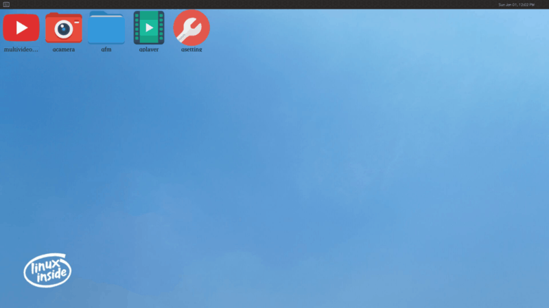</left>

这些 Qt 应用提供了一些基础功能，如，摄像头预览，文件管理器，多媒体播放器，WiFi 连接等。

##### 多路视频应用

</left>

多路视频播放器用于测试设备的多路视频播放能力、显示能力以及硬解码能力，点击启动应用后会自动循环播放 9 路视频 demo。

双击画面可以全屏播放。

##### 文件浏览应用

qfm 是一个文件浏览应用。

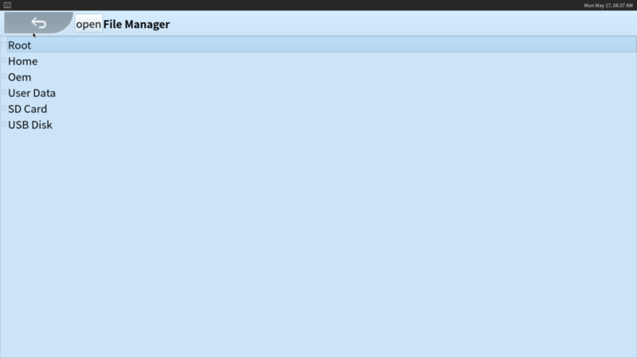</left>

通过 qfm 可以浏览设备文件，点击目录名进入下一级目录，点击左上角返回上一级。

点击文件可以调用系统对应的默认应用打开文件，如点击 mp4 文件将调用 qplayer 应用打开视频。

##### 多功能播放器应用

qplayer 是一个多功能播放器，可以播放视频、音频和浏览图片。点击启动后将自动播放视频 demo。

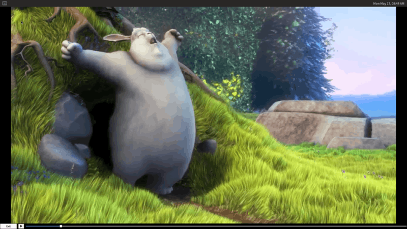</left>

也可以通过在 qfm 中点击指定文件来使用 qplyer 打开。

双击画面可以全屏播放。

##### 摄像头应用

qcamera 是一款相机应用，可以进行拍摄和录像。

</left>

设备连接摄像头的情况下启动 qcamera 将自动显示摄像头画面，右侧按钮：

Image Mode: 照相模式，点击可切换为 Video Mode 视频录制模式。
Capture: 捕捉图像，在 Video Mode 下会变为 Record 录制按钮。
Exit: 退出。

##### 设置应用

qsetting 是系统设置工具，其中可以设置 WiFi 连接，蓝牙连接，实现恢复出厂设置以及固件升级。

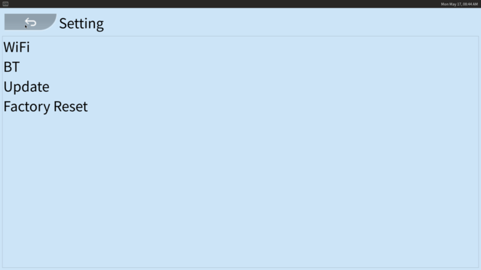</left>

#### 用户和密码

用户：root
密码：rockchip

#### Weston 配置

我们可以通过配置 Weston 对显示进行一些自定义设置，下文对部分设置进行说明。

##### 状态栏设置

Weston 支持在 weston.ini 配置文件的 shell 段设置状态栏的背景色、位置，以及在 launcher 段设置快捷启动程序，如：

```ini
# /etc/xdg/weston/weston.ini

[shell]
# 颜色格式为 ARGB8888
panel-color=0xff002244
# top|bottom|left|right|none
panel-position=bottom

[launcher]
icon=/usr/share/weston/terminal.png
path=/usr/bin/weston-terminal

[launcher]
# 图标路径
icon=/usr/share/weston/icon_flower.png
# 快捷启动命令
path=/usr/bin/qsetting
```

#####背景设置

Weston 支持在 weston.ini 配置文件的 shell 段设置背景图案、颜色，如：

```ini
# /etc/xdg/weston/weston.ini

[shell]
# 背景图案(壁纸)绝对路径
background-image=/usr/share/weston/background.png
# scale|scale-crop|tile
background-type=scale
# 颜色格式为 ARGB8888，未设置背景图案时生效
background-color=0xff002244
```

##### 待机及锁屏配置

Weston 的超时待机时长可以在启动参数中配置，也可以在 weston.ini 的 core 段配置，如：

```shell
# /etc/init.d/S50launcher
    start)
        ...
        # 0 为禁止待机，单位为秒
        weston --tty=2 -B=drm-backend.so --idle-time=0&
```

或

```ini
# /etc/xdg/weston/weston.ini

[core]
# 设置 5 秒未操作后进入待机状态
idle-time=5
```

##### 显示颜色格式配置

Buildroot SDK 内 Weston 目前默认显示格式为 ARGB8888，对于某些低性能平台，可以在 weston.ini 的 core 段配置为 RGB565，如：

```ini
# /etc/xdg/weston/weston.ini

[core]
# xrgb8888|rgb565|xrgb2101010
gbm-format=rgb565
```

也可以在 weston.ini 的 output 段单独配置每个屏幕的显示格式，如：

```ini
# /etc/xdg/weston/weston.ini

[output]
# output 的 name 可以查看 /sys/class/drm/card0-name
name=LVDS-1
# xrgb8888|rgb565|xrgb2101010
gbm-format=rgb565
```

##### 屏幕方向设置

Weston 的屏幕显示方向可以在 weston.ini 的 output 段配置，如：

```ini
# /etc/xdg/weston/weston.ini

[output]
name=LVDS-1
# normal|90|180|270|flipped|flipped-90|flipped-180|flipped-270
transform=180
```

如果需要动态配置屏幕方向，可以通过动态配置文件，如：

```shell
echo "output:all:rotate90" > /tmp/.weston_drm.conf # 所有屏幕旋转 90 度
echo "output:eDP-1:rotate180" > /tmp/.weston_drm.conf # eDP-1 旋转 180 度
```

##### 分辨率及缩放配置

Weston 的屏幕分辨率及缩放可以在 weston.ini 的 output 段配置，如：

```ini
# /etc/xdg/weston/weston.ini

[output]
name=HDMI-A-1
# 需为屏幕支持的有效分辨率
mode=1920x1080
# 需为整数倍数
scale=2
```

如果需要动态配置分辨率及缩放，可以通过动态配置文件，如：

```shell
echo "output:HDMI-A-1:mode=800x600" > /tmp/.weston_drm.conf # 修改 HDMI-A-1 分辨率为800x600
```

这种方式缩放时需要依赖 RGA 加速。

##### 冻结屏幕

在启动 Weston 时，开机 logo 到 UI 显示之间存在短暂切换黑屏。如需要防止黑屏，可以通过以下种动态配置文件方式短暂冻结 Weston 屏幕内容：

```shell
# /etc/init.d/S50launcher
    start)
        ...
        export WESTON_FREEZE_DISPLAY=/tmp/.weston_freeze # 设置特殊配置文件路径
        touch /tmp/.weston_freeze # 冻结显示
        weston --tty=2 -B=drm-backend.so --idle-time=0&
        ...
        sleep 1 && rm /tmp/.weston_freeze& # 1 秒后解冻
```

##### 多屏配置

Buildroot SDK 的 Weston 支持多屏同异显及热拔插等功能，不同显示器屏幕的区分根据 drm 的 name (通过 /sys/class/drm/card0-name 获取)，相关配置通过环境变量设置，如：

```shell
# /etc/init.d/S50launcher

    start)
        ...
        export WESTON_DRM_PRIMARY=HDMI-A-1 # 指定主显为 HDMI-A-1
        export WESTON_DRM_MIRROR=1 # 使用镜像模式(多屏同显)，不设置此环境变量即为异显
        export WESTON_DRM_KEEP_RATIO=1 # 镜像模式下缩放保持纵横比，不设置此变量即为强制全屏
        export WESTON_DRM_PREFER_EXTERNAL=1 # 外置显示器连接时自动关闭内置显示器
        export WESTON_DRM_PREFER_EXTERNAL_DUAL=1 # 外置显示器连接时默认以第一个外显为主显
        weston --tty=2 -B=drm-backend.so --idle-time=0&
```

镜像模式缩放显示内容时需要依赖 RGA 加速。

同时也支持在 weston.ini 的 output 段单独禁用指定屏幕：

```ini
# /etc/xdg/weston/weston.ini

[output]
name=LVDS-1
mode=off
# off|current|preferred|<WIDTHxHEIGHT@RATE>
```

##### 输入设备相关配置

Weston 服务默认需要至少一个输入设备，如无输入设备，则需要在 weston.ini 中的 core 段特殊设置：

```ini
# /etc/xdg/weston/weston.ini

[core]
require-input=false
```

### Debian 10开发

Rockchip提供了对Debian 10的支持，基于X11的显示架构。系统基于Linaro版本。添加一些图形和视频加速的支持。它包括libmali、xserver、gstreamer rockchip等package，这些packages通过docker搭建编译相关deb包，存放在<SDK>/debian/packages/*。

docker搭建编译deb package参考文档<SDK>/docs/Linux/ApplicationNote/Rockchip_Developer_Guide_Debian_Docker_EN.pdf

### Yocto 开发

更多资料参考：http://opensource.rock-chips.com/wiki_Yocto

### 多媒体开发

通过gstreamer/rockit来在rockchip平台上做multimedia的开发

```
vpu_service  -->  mpp --> gstreamer/ffmpeg --> app

vpu_service: 驱动
mpp: rockchip平台的视频编解码中间件,相关说明参考mpp文档
gstreamer: 对接app的组件
```

目前rockchip提供的完整solution是基于gstreamer的，使用gstreamer的好处就是可以比较方便的基于pipeline的方式完整播放器， 编码器这些应用。

具体资料参考：
<SDK>/docs/Linux/Multimedia
├── Rockchip_Developer_Guide_Linux_DLNA_CN.pdf
├── Rockchip_Developer_Guide_Linux_RGA_CN.pdf
├── Rockchip_Developer_Guide_MPP_CN.pdf
└── Rockchip_Developer_Guide_MPP_EN.pdf

### Grahpics 开发

Rockchip Linux平台的Graphics,是应用DRM和DMA-BUF的ARM Linux平台。优势是，通用的架构，在基于此架构进行客制化开发较容易，可以利用很多现有组件，现有很多基础开源项目的开发，都开始基于Rockchip平
台来作为ARM端的适配平台。但缺点是，很多人不是很理解这些内容,实际应用起来需要一个学习过
程。更多资料可以参考[Rockchip wiki](http://opensource.rock-chips.com/wiki_Graphics)和下面文档。

```
<SDK>/docs/Linux/Graphics/
├── Rockchip_Developer_Guide_Linux_Graphics_CN.pdf
└── Rockchip_Developer_Guide_Linux_Graphics_EN.pdf
```

### 应用开发

SDK常用应用有Weston、QT、ROS等应用开发，参考<SDK>/docs/Linux/Graphics/ApplicationNote目录下文档

### 安全机制开发

参考<SDK>/docs/Linux/Security目录下文档

### WIFI/BT开发

参考<SDK>/docs/Linux/Wifibt目录下文档

## SDK 测试

### Benchmark 测试

一些常用基准测试的参考数据，该测试文档位于：

```
<SDK>/docs/Linux/Profile/Rockchip_Introduction_Linux_Benchmark_KPI_EN.pdf
```

### Rockchip 模块和压力测试

提供一些常用模块功能和压力测试的方法，该文档位于：

```
<SDK>/docs/Linux/Profile/Rockchip_User_Guide_Linux_Software_Test_CN.pdf
```

## SDK 调试

### 版权检测工具

#### Buildroot

```shell
make legal-info
```

#### Debian

检测可参考[官方工具]( https://wiki.debian.org/CopyrightReviewTools)

```shell
licensecheck --check '.*' --recursive --copyright --deb-fmt \
        --lines 0 * | /usr/lib/cdbs/licensecheck2dep5
```

各源码包相关版权说明位于 `/usr/share/doc/*/copyright`

#### Yocto

各源码包相关版权说明位于 `build/tmp/deploy/licenses/*/recipeinfo`

## 开源

### github

Rockchip代码仓库开源[rockchip-github](https://github.com/rockchip-linux)。

### wiki

Rockchip资料开源[rockchip-wiki](http://opensource.rock-chips.com/wiki_Main_Page)

### upstream

- Rockchip upstream uboot:

git clone https://gitlab.denx.de/u-boot/custodians/u-boot-rockchip.git

Upstream U-Boot support Rockchip SoCs:

RK3036, RK3188, RK3288, RK3328, RK3399

- Rockchip upstream kernel

git clone git://git.kernel.org/pub/scm/linux/kernel/git/mmind/linux-rockchip.git

Mainline kernel supports:

RV1108, RK3036, RK3066, RK3188, RK3228, RK3288, RK3368, RK3399

## 常见问题 （FAQ）

- 如何确认当前kernel和u-boot版本？

Linux 4.19对应的kernel版本为:develop-4.19,u-boot的分支为next-dev分支

## SSH 公钥操作说明

请根据<SDK>/docs/Others/Rockchip_User_Guide_SDK_Application_And_Synchronization_CN.pdf文档说明操作，生成 SSH 公钥，发邮件至fae@rock-chips.com，申请开通 SDK 代码。
该文档会在申请开通权限流程中，释放给客户使用。

### 多台机器使用相同 SSH 公钥

在不同机器使用，可以将你的 SSH 私钥文件 id_rsa 拷贝到要使用的机器的 “~/.ssh/id_rsa” 即
可。
在使用错误的私钥会出现如下提示，请注意替换成正确的私钥

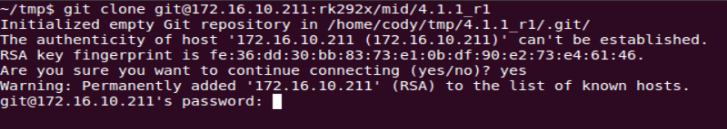</left>

添加正确的私钥后，就可以使用 git 克隆代码，如下图。

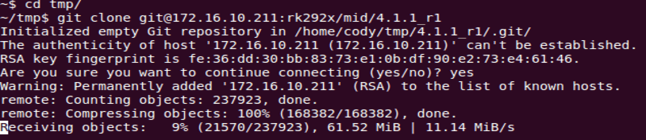</left>

添加 SSH 私钥可能出现如下提示错误。

```
Agent admitted failture to sign using the key
```

在 console 输入如下命令即可解决。

```shell
ssh-add ~/.ssh/id_rsa
```

### 一台机器切换不同 SSH 公钥

可以参考 ssh_config 文档配置 SSH。

```shell
~$ man ssh_config
```

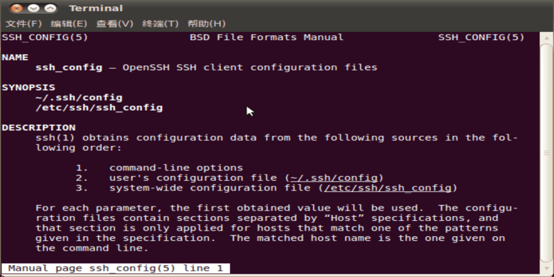</left>

通过如下命令，配置当前用户的 SSH 配置。

```shell
~$ cp /etc/ssh/ssh_config ~/.ssh/config
~$ vi .ssh/config
```

如图，将 SSH 使用另一个目录的文件 “~/.ssh1/id_rsa” 作为认证私钥。通过这种方法，可以切换
不同的的密钥。

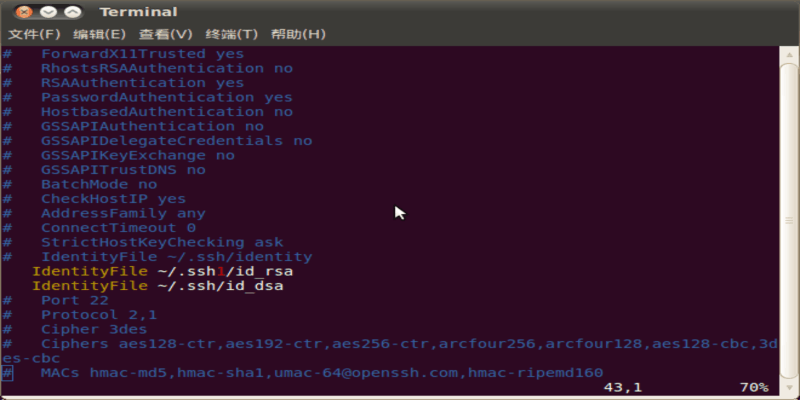</left>

### 密钥权限管理

服务器可以实时监控某个 key 的下载次数、IP  等信息，如果发现异常将禁用相应的 key 的下
载权限。
请妥善保管私钥文件。并不要二次授权与第三方使用。

### 参考文档

更多详细说明，可参考文档<SDK>/docs/Others/Rockchip_User_Guide_SDK_Application_And_Synchronization_CN.pdf。

