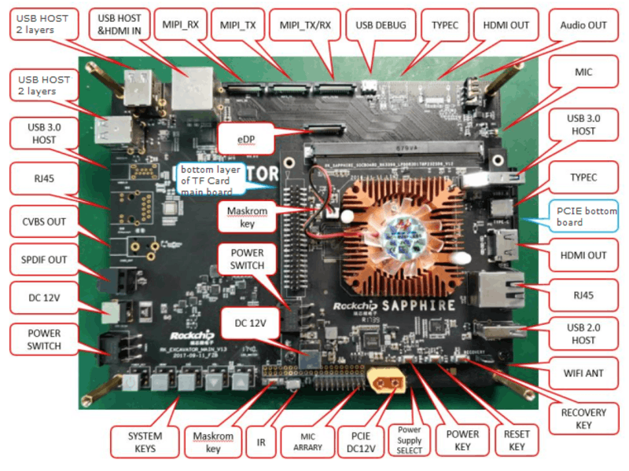

# Rockchip RK3399 Linux SDK Release Note

ID: RK-FB-CS-002

Release Version: V2.4.0

Release Date: 2020-04-30

Security Level: □Top-Secret   □Secret   □Internal   ■Public

---

**DISCLAIMER**

THIS DOCUMENT IS PROVIDED “AS IS”. FUZHOU ROCKCHIP ELECTRONICS CO., LTD.(“ROCKCHIP”)DOES NOT PROVIDE ANY WARRANTY OF ANY KIND, EXPRESSED, IMPLIED OR OTHERWISE, WITH RESPECT TO THE ACCURACY, RELIABILITY, COMPLETENESS,MERCHANTABILITY, FITNESS FOR ANY PARTICULAR PURPOSE OR NON-INFRINGEMENT OF ANY REPRESENTATION, INFORMATION AND CONTENT IN THIS DOCUMENT. THIS DOCUMENT IS FOR REFERENCE ONLY. THIS DOCUMENT MAY BE UPDATED OR CHANGED WITHOUT ANY NOTICE AT ANY TIME DUE TO THE UPGRADES OF THE PRODUCT OR ANY OTHER REASONS.

**Trademark Statement**

"Rockchip", "瑞芯微", "瑞芯" shall be Rockchip’s registered trademarks and owned by Rockchip. All the other trademarks or registered trademarks mentioned in this document shall be owned by their respective owners.

**All rights reserved. ©2020. Fuzhou Rockchip Electronics Co., Ltd.**

Beyond the scope of fair use, neither any entity nor individual shall extract, copy, or distribute this document in any form in whole or in part without the written approval of Rockchip.

Fuzhou Rockchip Electronics Co., Ltd.

No.18 Building, A District, No.89, software Boulevard Fuzhou, Fujian,PRC

Website:     [www.rock-chips.com](http://www.rock-chips.com)

Customer service Tel:  +86-4007-700-590

Customer service Fax:  +86-591-83951833

Customer service e-Mail:  [fae@rock-chips.com](mailto:fae@rock-chips.com)

---

## Preface

**Overview**

The document presents Rockchip RK3399 Linux SDK release notes, aiming to help engineers get started with  RK3399 Linux SDK development and debugging faster.

**Intended Audience**

This document (this guide) is mainly intended for:

Technical support engineers
Software development engineers

**Chipset and System Support**

| **Chipset** | **Buildroot** | **Debian 9** | **Debian 10** | **Yocto** |
| ----------- | :-------------- | :------------- | :---------- | :---------- |
| RK3399      | Y               | Y              | Y           | Y           |

**Revision History**

| **Date** | **Version** | **Author** | **Revision History** |
| -----------| :-------------- | :------------- | :---------- |
| 2017-01-16 | V1.0.0 | Guochun Huang | Initial version |
| 2017-02-27 | V1.1.0 | Guochun Huang | Add Linux PC download tools |
| 2017-06-08 | V1.2.0 | Caesar Wang | An official release version, <br/>adds NPU related instructions. <br/> Add Yocto building and <br/>github download instructions. |
| 2018-04-08 | V1.3.0 | Caesar Wang | Update the name of software develop guide |
| 2018-04-11 | V1.4.0 | Caesar Wang | Update Debian building instructions. |
| 2018-04-18 | V1.5.0 | Caesar Wang | Fix some mistaken words and repository address |
| 2018-05-17 | V2.0.0 | Caesar Wang | Integrate Buildroot and Debian documents <br/>Add SSH public key operation introduction |
| 2019-01-24 | V2.1.0 | Caesar Wang | Rename project rootfs chapter to Debian <br/>update U-boot config |
| 2019-06-28 | V2.2.0 | Caesar Wang | Add Yocto introduction <br/>EVB renamed to excavator |
| 2019-12-03 | V2.3.0 | Caesar Wang | Update Debian 64 bit building<br/>Updated chapters 1, 2, 3 and 9.6 <br/>Updated Chapter 5 SDK Directory Introduction<br/>Update Chapter 6 Debian10 Building。 |
| 2020-04-30 | V2.4.0 | Caesar Wang | Rewrite the document with Markdown <br/>Add and use RK3399 EVB IND by default。 |

## Contents

---
[TOC]
---

## 1  Overview

This SDK is based on Buildroot 2018.02-rc3, Yocto Thud 2.6, Debian 9 and Debian 10 or later version with kernel 4.4 and U-boot v2017.09. It is suitable for RK3399 EVB development boards and all other Linux products developed based on it. This SDK supports VPU hardware decoding, GPU 3D, Wayland/X11 display, Qt and other function. For detailed functions debugging and interface introductions, please refer to the documents under the project's docs/ directory.

## 2 Main Functions

| **Functions** | **Module Name** |
| ----------- | :-------------- |
| Data Communication | Wi-Fi, Ethernet Card, USB, SDCARD, PCI-e |
| Applications | Multimedia playback, settings, browser, file management |

## 3 How to Get the SDK

SDK is released by Rockchip server or got from [Github](https://github.com/rockchip-linux)  open source website. Please refer to Chapter 7 [SDK Building Introduciton](## 7 SDK Building Introduction) to build a development environment.

**First way to get the SDK: get source code from Rockchip code server**

To get RK3399 Linux software package, customers need an account to access the source code repository provided by Rockchip. In order to be able to obtain code synchronization, please provide SSH public key for server authentication and authorization when apply for SDK from Rockchip technical window. About Rockchip server SSH public key authorization, please refer to Chapter 10  [SSH  Public Key Operation Introduction](## 10 Public Key Operation Introduction).

The command for downloading RK3399_Linux_SDK is as follows:

```
repo init --repo-url ssh://git@www.rockchip.com.cn/repo/rk/tools/repo -u ssh://git@www.rockchip.com.cn/linux/rk/platform/manifests -b linux -m rk3399_linux_release.xml
```

Repo, a tool built on Python script by Google to help manage git repositories, is mainly used to download and manage software repository of projects. The download address is as follows:

```
git clone ssh://git@www.rockchip.com.cn/repo/rk/tools/repo
```

For quick access to SDK source code, Rockchip Technical Window usually provides corresponding version of SDK initial compression package. In this way, developers can get SDK source code through decompressing the initial compression package, which is the same as the one downloaded by repo.
Take  rk3399_linux_sdk_release_v2.4.0_20200430.tgz as an example. After getting an initialization package, you can get the source code by running the following command:

```shell
mkdir rk3399
tar xvf rk3399_linux_sdk_release_v2.4.0_20200430.tgz -C rk3399
cd rk3399
.repo/repo/repo sync -l
.repo/repo/repo sync
```

Developers can update via `.repo/repo/repo sync` command according to update instructions that are regularly released by FAE window.

**Second way to get the SDK: get source code from Github open source website:**

Download repo tools:

```
git clone https://github.com/rockchip-linux/repo.git
```

Make an  rk3399 linux work directory:

```
mkdir rk3399_linux
```

Enter the rk3399 linux  work directory:

```
cd rk3399_linux/
```

Initialize the repo repository:

```
../repo/repo init --repo-url=https://github.com/rockchip-linux/repo -u https://github.com/rockchip-linux/manifests -b master -m rk3399_linux_release.xml
```

Synchronize the whole project:

```
../repo/repo sync
```

Note: If your project has already started, please choose the first method to get the code first. Unlike Github, it has passed by internal stress testing and version control. The second method is more suitable for enthusiasts and project evaluation.

## 4 Software Development Guide

### 4.1 Development Guide

The Kernel version of RK3399 Linux SDK Kernel is Linux4.4, Rootfs is  Buidlroot(2018.02-rc3), Yocto(Thud 2.6) or Debian9/10 respectively. To help engineers quick start of SDK development and debugging, “Rockchip_Developer_Guide_Linux_Software_EN” is released with the SDK. It can be obtained in the docs/ directory and will be continuously updated.

### 4.2 Software Update History

Software release version upgrade can be checked through project xml file by the following command:

```
.repo/manifests$ ls -l -h rk3399_linux_release.xml
```

Software release version updated information can be found through the project text file by the following command:

```
.repo/manifests$ cat rk3399_linux_v2.00/RK3399_Release_Note.txt
```

Or refer to the project directory:

```
<SDK>/docs/SoC_public/RK3399/RK3399_Linux_SDK_Release_Note.txt
```

## 5 Hardware Development Guide

Please refer to user guides in the project directory for hardware development:

RK3399 excavator hardware development guide:

```
<SDK>/docs/Soc_public/RK3399/Rockchip_RK3399_User_Manual_IND_EVB_V1.0_CN.pdf
```

RK3399 IND industry board hardware development guide:

```
<SDK>/docs/Soc_public/RK3399/Rockchip_RK3399_User_Manual_Sapphire_EVB_V3.0_CN.pdf
```

## 6 SDK Project Directory Introduction

There are buildroot, debian, recovery, app, kernel, u-boot, device, docs, external and other directories in the project directory. Each directory or its sub-directories will correspond to a git project, and the commit should be done in the respective directory.

- app: store application apps like qcamera/qfm/qplayer/qseting and other applications.
- buildroot: root file system based on Buildroot (2018.02-rc3).
- debian: root file system based on Debian 9.
- device/rockchip: store board-level configuration for each chip and some scripts and prepared files for building and packaging firmware.
- docs: stores development guides, platform support lists, tool usage, Linux development guides, and so on.
- distro: a root file system based on Debian 10.
- IMAGE: stores building time, XML, patch and firmware directory for each building.
- external: stores some third-party libraries, including audio, video, network, recovery and so on.
- kernel: stores kernel4.4 development code.
- npu: store NPU development code.
- prebuilts: stores cross-compilation toolchain.
- rkbin: stores Rockchip Binary and tools.
- rockdev: stores building output firmware.
- tools: stores some commonly used tools under Linux and Windows system.
- u-boot: store U-Boot code developed based on v2017.09 version.
- yocto: stores the root file system developed based on YoctoThud 2.6.

## 7 SDK Building Introduction

**Ubuntu 16.04 system:**
Please install software packages with below commands to setup Buildroot building environment:

```
sudo apt-get install repo git-core gitk git-gui gcc-arm-linux-gnueabihf u-boot-tools device-tree-compiler gcc-aarch64-linux-gnu mtools parted libudev-dev libusb-1.0-0-dev python-linaro-image-tools linaro-image-tools autoconf autotools-dev libsigsegv2 m4 intltool libdrm-dev curl sed make binutils build-essential gcc g++ bash patch gzip bzip2 perl tar cpio python unzip rsync file bc wget libncurses5 libqt4-dev libglib2.0-dev libgtk2.0-dev libglade2-dev cvs git mercurial rsync openssh-client subversion asciidoc w3m dblatex graphviz python-matplotlib libc6:i386 libssl-dev texinfo liblz4-tool genext2fs expect patchelf xutils-dev
```

Please install software packages with below commands to setup Debian building environment:

```
sudo apt-get install repo git-core gitk git-gui gcc-arm-linux-gnueabihf u-boot-tools device-tree-compiler gcc-aarch64-linux-gnu mtools parted libudev-dev libusb-1.0-0-dev python-linaro-image-tools linaro-image-tools gcc-arm-linux-gnueabihf libssl-dev gcc-aarch64-linux-gnu g+conf autotools-dev libsigsegv2 m4 intltool libdrm-dev curl sed make binutils build-essential gcc g++ bash patch gzip bzip2 perl tar cpio python unzip rsync file bc wget libncurses5 libqt4-dev libglib2.0-dev libgtk2.0-dev libglade2-dev cvs git mercurial rsync openssh-client subversion asciidoc w3m dblatex graphviz python-matplotlib libc6:i386 libssl-dev texinfo liblz4-tool genext2fs xutils-dev
```

**Ubuntu 17.04 or later version system:** in addition to the above, the following dependencies is needed:

```
sudo apt-get install lib32gcc-7-dev g++-7 libstdc++-7-dev
```

It is recommended to use Ubuntu 18.04 system or higher version for development. If you encounter an error during building, you can install the corresponding software packages according to the error message.

### 7.1 U-boot Building

Enter project u-boot directory and run `make.sh` to get rk3399_loader_v1.24.224.bin trust.img and
uboot.img.

RK3399 excavator or industry development boards:

```shell
./make.sh rk3399
```

RK3399 Firefly development boards:

```shell
./make.sh firefly-rk3399
```

The built files are in u-boot directory:

```
u-boot/
├── rk3399_loader_v1.24.124.bin
├── trust.img
└── uboot.img
```

### 7.2 Kernel Building Steps

Enter project root directory and run the following command to automatically build and package kernel:

RK3399 IND development boards:

```
cd kernel
make ARCH=arm64 rockchip_linux_defconfig
make ARCH=arm64 rk3399-evb-ind-lpddr4-linux.img -j12
```

RK3399 excavator V11/V12 development boards:

```
cd kernel
make ARCH=arm64 rockchip_linux_defconfig
make ARCH=arm64 rk3399-sapphire-excavator-linux.img -j12
```

RK3399 excavator V10 development boards:

```
cd kernel
make ARCH=arm64 rockchip_linux_defconfig
make ARCH=arm64 rk3399-sapphire-excavator-v10-linux.img -j12
```

RK3399 Firefly development boards:

```
cd kernel
make ARCH=arm64 rockchip_linux_defconfig
make ARCH=arm64 rk3399-firefly-linux.img -j12
```

The boot.img includes image and DTB of kernel will be generated after building in the kernel directory.

### 7.3 Recovery Building Steps

Enter project root directory and execute the following command to automatically complete building and packaging of Recovery

```shell
./build.sh recovery
```

The recovery.img will be generated in Buildroot directory “output/rockchip_rk3399_recovery/images” after building.

Please pay attention to that recovery.img contains kernel.img, so every time the kernel changes, recovery needs to be repackaged and generated. For example

```
SDK$source envsetup.sh rockchip_rk3399
SDK$make recovery-rebuild
SDK$./build.sh recovery
```

### 7.4 Buildroot Building

#### 7.4.1 Buildroot Rootfs Building

Enter project root directory and execute the following commands to automatically complete building and packaging of Rootfs.

```shell
 ./build.sh rootfs
```

**Note:**

If you need to build a single module or a third-party application, you need to configure the cross-compilation environment. Cross-compilation tool is located in “buildroot/output/rockchip_rk3399/host/usr” directory. You need to set the “bin/” directory of tools and “aarch64-buildroot-linux-gnu/bin/” directory to environment variables, and execute auto-configuration environment variable script in the top-level directory (only valid for current console):

```shell
source envsetup.sh rockchip_rk3399
```

输入命令查看：Enter the command to view:

```shell
aarch64-linux-gcc --version
```

When the following log is printed, configuration is successful:

```
aarch64-linux-gcc.br_real (Buildroot 2018.02-rc3-01797-gcd6c508) 6.5.0
```

#### 7.4.2 Build Modules in Buildroot

Take the frequently used building commands for qplayer module for example:

- Set the environment

```
SDK$source envsetup.sh rockchip_rk3399
```

- Build qplayer

```
SDK$make qplayer
```

- Rebuild qplayer

```
SDK$make qplayer-rebuild
```

- Delete qplayer

```
SDK$make qplayer-dirclean
or
SDK$rm -rf /buildroot/output/rockchip_rk3399/build/qlayer-1.0
```

### 7.5 Debian 9 Building

```
 ./build.sh debian
```

Or enter debian/ directory:

```
cd debian/
```

Please refer to the readme.md in the directory for later building and Debian firmware generation.

**(1) Building base Debian system**

```
sudo apt-get install binfmt-support qemu-user-static live-build
sudo dpkg -i ubuntu-build-service/packages/*
sudo apt-get install -f
```

Build 64 bit Debian:

```shell
RELEASE=stretch TARGET=desktop ARCH=arm64 ./mk-base-debian.sh
```

After building, linaro-stretch-alip-xxxxx-1.tar.gz (xxxxx is timestamp generated) will be generated in “debian/”:

FAQ:

- If you encounter the following problem during above building:

```
noexec or nodev issue /usr/share/debootstrap/functions: line 1450:
..../rootfs/ubuntu-build-service/stretch-desktop-armhf/chroot/test-dev-null: Permission denied E: Cannot install into target '/home/foxluo/work3/rockchip/rk_linux/rk3399_linux/rootfs/ubuntu-build-service/stretch-desktop-armhf/chroot' mounted with noexec or nodev
```

Solution：

```
mount -o remount,exec,dev xxx (xxx is the project directory), and then rebuild
```

In addition, if there are other building issues, please check firstly that the building system is not ext2/ext4.

- Because building Base Debian requires to access to foreign websites, and when domestic networks access foreign websites, download failures often occur:

The live build is used in Debian9, you can configure like below to change the image source to domestic:

```diff
+++ b/ubuntu-build-service/stretch-desktop-arm64/configure
@@ -11,6 +11,11 @@ set -e
 echo "I: create configuration"
 export LB_BOOTSTRAP_INCLUDE="apt-transport-https gnupg"
 lb config \
+ --mirror-bootstrap "http://mirrors.163.com/debian" \
+ --mirror-chroot "http://mirrors.163.com/debian" \
+ --mirror-chroot-security "http://mirrors.163.com/debian-security" \
+ --mirror-binary "http://mirrors.163.com/debian" \
+ --mirror-binary-security "http://mirrors.163.com/debian-security" \
  --apt-indices false \
  --apt-recommends false \
  --apt-secure false \
```

If the package cannot be downloaded for other network reasons, there are pre-build packages shared on [Baidu Cloud Disk](https://eyun.baidu.com/s/3nxdWke1), put it in the current directory, and do the next step.

**(2) Building rk-debian rootfs**

Build 64 bit Debian：

```shell
VERSION=debug ARCH=arm64 ./mk-rootfs-stretch.sh
```

**(3) Creating the ext4 image(linaro-rootfs.img)**

```shell
./mk-image.sh
```

The linaro-rootfs.img will be generated.

### 7.6 Debian 10 Building

```
./build.sh distro
```

Or enter distro/directory:

```
cd distro/ && make ARCH=arm64 rk3399_defconfig && ./make.sh
```

After building, the rootfs.ext4 will be generated in the distro directory “distro/output/images/”.

**Note**: The current building of Debian10 Qt also depends on the building of Buildroot qmake, so please build Buildroot before building Debian10.

Please refer to the following document for more introductions about Debian10.

```
<SDK>/docs/Linux/ApplicationNote/Rockchip_Debian10_Developer_Guide_CN.pdf
```

### 7.7 Yocto  Building

Enter project root directory and execute the following commands to automatically complete building and packaging Rootfs.

```shell
./build.sh yocto
```

After building, the rootfs.img will be generated in yocto directory “yocto/ build/lastest”.

FAQ：
If you encounter the following problem during the above  building:

```
Please use a locale setting which supports UTF-8 (such as LANG=en_US.UTF-8).
Python can't change the filesystem locale after loading so we need a UTF-8
when Python starts or things won't work.
```

Solution:

```shell
locale-gen en_US.UTF-8
export LANG=en_US.UTF-8 LANGUAGE=en_US.en LC_ALL=en_US.UTF-8
```

Or refer to [setup-locale-python3]( https://webkul.com/blog/setup-locale-python3).The image generated after building is located in “yocto/build/lastest/rootfs.img”.The default login user name is root, please refer to [Rockchip Wiki](http://opensource.rock-chips.com/wiki_Yocto) for more detailed information of Yocto.

### 7.8 Full Automatic Building

After building various parts of Kernel/U-Boot/Rootfs above, enter root directory of project directory and execute the following commands to automatically complete all building:

```shell
$./build.sh all
```

It is buildroot by default, you can specify rootfs by setting the environment variable RK_ROOTFS_SYSTEM. For example, if you need Yocto which will be generated by the following commands:

```shell
$export RK_ROOTFS_SYSTEM=yocto
$./build.sh all
```

Detailed parameters usage, you can use help to search, for example:

```shell
rk3399$ ./build.sh --help
Usage: build.sh [OPTIONS]
Available options:
BoardConfig*.mk    -switch to specified board config
uboot              -build uboot
spl                -build spl
kernel             -build kernel
modules            -build kernel modules
toolchain          -build toolchain
rootfs             -build default rootfs, currently build buildroot as default
buildroot          -build buildroot rootfs
ramboot            -build ramboot image
multi-npu_boot     -build boot image for multi-npu board
yocto              -build yocto rootfs
debian             -build debian9 stretch rootfs
distro             -build debian10 buster rootfs
pcba               -build pcba
recovery           -build recovery
all                -build uboot, kernel, rootfs, recovery image
cleanall           -clean uboot, kernel, rootfs, recovery
firmware           -pack all the image we need to boot up system
updateimg          -pack update image
otapackage         -pack ab update otapackage image
save               -save images, patches, commands used to debug
allsave            -build all & firmware & updateimg & save

Default option is 'allsave'.
```

Board level configurations of each board need to be configured in /device/rockchip/rk3399/Boardconfig.mk.

Main configurations of RK3399 IND industry board are as follows:

```shell
# Target arch
export RK_ARCH=arm64
# Uboot defconfig
export RK_UBOOT_DEFCONFIG=rk3399
# Kernel defconfig
export RK_KERNEL_DEFCONFIG=rockchip_linux_defconfig
# Kernel dts
export RK_KERNEL_DTS=rk3399-evb-ind-lpddr4-linux
# boot image type
export RK_BOOT_IMG=boot.img
# kernel image path
export RK_KERNEL_IMG=kernel/arch/arm64/boot/Image
# parameter for GPT table
export RK_PARAMETER=parameter.txt
# Buildroot config
export RK_CFG_BUILDROOT=rockchip_rk3399
# Recovery config
export RK_CFG_RECOVERY=rockchip_rk3399_recovery
```

### 7.9  Firmware Package

After building various parts of Kernel/Uboot/Recovery/Rootfs above, enter root directory of project directory and execute the following command to automatically complete all firmware packaged into rockdev directory:

Firmware Generation:

```shell
./mkfirmware.sh
```

## 8 Upgrade Introduciton

 Interfaces layout of RK3399 excavator are showed as follows:



Interfaces layout of RK3399 IND industry board are showed as follows:


### 8.1 Windows Upgrade Introduction

SDK provides windows upgrade tool (this tool should be V2.55 or later version) which is located in project root directory:

```shell
tools/
├── windows/AndroidTool
```

As shown below, after building and generating the corresponding firmware, device needs to enter MASKROM  mode for upgrade. After connecting USB cable, long press the button “MASKROM” and press reset button “RST” at the same time and then release, device will enter MASKROM mode. Then you should load the paths of the corresponding images and click “Run” to start update. You can also press the “recovery” button and press reset button "RST" then release to enter loader mode to update. Partition offset and update files of MASKROM Mode are shown as follows (Note: you have to run the tool as an administrator in Windows PC):

</left>

Note: before upgrade, please install the latest USB driver, which is in the below directory:

```shell
<SDK>/tools/windows/DriverAssitant_v4.8.zip
```

### 8.2 Linux Upgrade Introduction

The Linux upgrade tool (Linux_Upgrade_Tool should be v1.33 or later versions) is located in “tools/linux” directory. Please make sure your board is connected to MASKROM/loader rockusb, if the generated firmware is in rockdev directory, upgrade commands are as below:

```shell
sudo ./upgrade_tool ul rockdev/MiniLoaderAll.bin
sudo ./upgrade_tool di -p rockdev/parameter.txt
sudo ./upgrade_tool di -u rockdev/uboot.img
sudo ./upgrade_tool di -t rockdev/trust.img
sudo ./upgrade_tool di -misc rockdev/misc.img
sudo ./upgrade_tool di -b rockdev/boot.img
sudo ./upgrade_tool di -recovery rockdev/recovery.img
sudo ./upgrade_tool di -oem rockdev/oem.img
sudo ./upgrade_tool di -rootfs rocdev/rootfs.img
sudo ./upgrade_tool di -userdata rockdev/userdata.img
sudo ./upgrade_tool rd
```

Or upgrade the whole firmware after packaging:

```shell
sudo ./upgrade_tool uf rockdev/update.img
```

Or in root directory, run the following command on your device to upgrade in MASKROM  state

```shell
./rkflash.sh
```

### 8.3 System Partition Introduction

Default partition introduction (below is RK3399 IND reference partition):

| **Number** | **Start (sector)** | **End (sector)** | **Size** | **Name** |
| ---------- | ------------------ | --------------- | --------- | --------- |
| 1      | 16384  | 24575     |  4096K     |uboot     |
| 2      | 24576  | 32767     |  4096K     |trust     |
| 3      | 32768  | 40959     |  4096K     |misc     |
| 4      | 40960  | 106495     |  32M     |boot     |
| 5      | 106496  | 303104     |  32M     |recovery     |
| 6      | 172032  | 237567     |  32M     |bakcup     |
| 7      | 237568  | 368639     |  64M     |oem     |
| 8      | 368640  | 12951551     |  6144M     |rootfs     |
| 9      | 12951552  | 30535646     |  8585M     |userdata     |

- uboot partition: for uboot.img built from uboot．
- trust partition: for trust.img built from uboot．
- misc partition: for misc.img built from recovery．
- boot partition: for boot.img built from kernel．
- recovery partition: for recovery.img built from recovery．
- backup partition: reserved, temporarily useless. Will be used for backup of recovery as in Android in future.
- oem partition: used by manufactor to store their APP or data, mounted in /oem directory
- rootfs partition: store rootfs.img built from buildroot or debian.
- userdata partition: store files temporarily generated by APP or for users, mounted in /userdata directory

## 9 RK3399 SDK Firmware

RK3399_LINUX_SDK_V2.4.0_20200430 firmware download address is as follows (including  Buildroot/Debian 9/Debian 10/Yocto firmwares):

- RK3399 IND industry development boards:

[Buildroot](https://eyun.baidu.com/s/3c3V1eLi)
[Yocto](https://eyun.baidu.com/s/3i6O5qGd)
[Debian9](https://eyun.baidu.com/s/3mj2K14G)
[Debian10](https://eyun.baidu.com/s/3gfW0JhL)

- RK3399 excavator development boards:

[Buildroot](https://eyun.baidu.com/s/3i6lVGvb)
[Yocto](https://eyun.baidu.com/s/3c36y74W)
[Debian9](https://eyun.baidu.com/s/3i6udoET)
[Debian10](https://eyun.baidu.com/s/3eTDMjqq)

- RK3399 Firefly development boards:

[Buildroot](https://eyun.baidu.com/s/3dqTCi6)
[Yocto](https://eyun.baidu.com/s/3kWtth1H)
[Debian9](https://eyun.baidu.com/s/3jKkicsu)
[Debian10](https://eyun.baidu.com/s/3kWCpXB5)

## 10 SSH Public Key Operation Introduction

Please follow the introduction in the “Rockchip SDK Application and Synchronization Guide” to generate an SSH public key and send the email to fae@rock-chips.com, applying for permission to download SDK code.
This document will be released to customers during the process of applying for permission.

### 10.1 Multi-device Use the Same SSH Public Key

If the same SSH public key should be used in different devices, you can copy the SSH private key file id_rsa to “~/.ssh/id_rsa” of the device you want to use.

If the following prompt appears when using a wrong private key, please be careful to replace it with the correct private key.

</left>

After adding the correct private key, you can use git to clone code, as shown below.

</left>

Adding SSH private key may result in the following error.

```
Agent admitted failture to sign using the key
```

Enter the following command in console to solve:

```shell
ssh-add ~/.ssh/id_rsa
```

### 10.2 Switch Different SSH Public Keys on the Same Device

You can configure SSH according to the ssh_config documentation.

```shell
~$ man ssh_config
```

</left>

Run the following command to configure SSH configuration of current user.

```shell
~$ cp /etc/ssh/ssh_config ~/.ssh/config
~$ vi .ssh/config
```

As shown in the figure, SSH uses the file “~/.ssh1/id_rsa” of another directory as an authentication private key. In this way, different keys can be switched.

</left>

### 10.3 Key Authority Management

Server can monitor download times and IP information of a key in real time. If an abnormality is found, download permission of the corresponding key will be disabled.

Keep the private key file properly. Do not grant second authorization to third parties.

### 10.4 Reference Documents

For more details, please refer to document “sdk/docs/RKTools manuals/Rockchip SDK Kit Application GuideV1.6-201905.pdf”.

