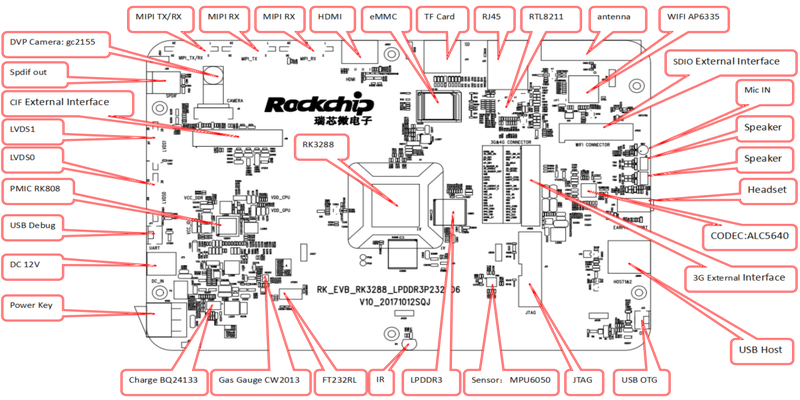
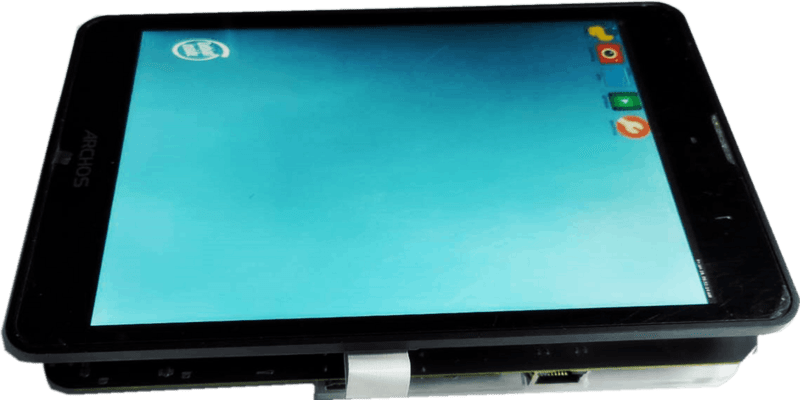

# Rockchip RK3288 Linux SDK Release Note

ID: RK-FB-CS-006

Release Version: V2.3.0

Release Date: 2020-12-03

Security Level: □Top-Secret   □Secret   □Internal   ■Public

**DISCLAIMER**

THIS DOCUMENT IS PROVIDED “AS IS”. ROCKCHIP ELECTRONICS CO., LTD.(“ROCKCHIP”)DOES NOT PROVIDE ANY WARRANTY OF ANY KIND, EXPRESSED, IMPLIED OR OTHERWISE, WITH RESPECT TO THE ACCURACY, RELIABILITY, COMPLETENESS,MERCHANTABILITY, FITNESS FOR ANY PARTICULAR PURPOSE OR NON-INFRINGEMENT OF ANY REPRESENTATION, INFORMATION AND CONTENT IN THIS DOCUMENT. THIS DOCUMENT IS FOR REFERENCE ONLY. THIS DOCUMENT MAY BE UPDATED OR CHANGED WITHOUT ANY NOTICE AT ANY TIME DUE TO THE UPGRADES OF THE PRODUCT OR ANY OTHER REASONS.

**Trademark Statement**

"Rockchip", "瑞芯微", "瑞芯" shall be Rockchip’s registered trademarks and owned by Rockchip. All the other trademarks or registered trademarks mentioned in this document shall be owned by their respective owners.

**All rights reserved. ©2020. Rockchip Electronics Co., Ltd.**

Beyond the scope of fair use, neither any entity nor individual shall extract, copy, or distribute this document in any form in whole or in part without the written approval of Rockchip.

Rockchip Electronics Co., Ltd.

No.18 Building, A District, No.89, software Boulevard Fuzhou, Fujian,PRC

Website:     [www.rock-chips.com](http://www.rock-chips.com)

Customer service Tel:  +86-4007-700-590

Customer service Fax:  +86-591-83951833

Customer service e-Mail:  [fae@rock-chips.com](mailto:fae@rock-chips.com)

---

**Preface**

**Overview**

The document presents Rockchip RK3288 Linux SDK release notes, aiming to help engineers get started with  RK3288 Linux SDK development and debugging faster.

**Intended Audience**

This document (this guide) is mainly intended for:

Technical support engineers

Software development engineers

**Chipset and System Support**

| **Chipset** | **Buildroot** | **Debian** | **Yocto** |
| ----------- | :-------------- | :------------- | :---------- |
| RK3288      | Y               | Y              | Y          |

**Revision History**

| **Date** | **Version** | **Author** | **Revision History** |
| -----------| :-------------- | :------------- | :---------- |
| 2018-04-16 | V1.0.0 | Nickey Yang | Initial version. |
| 2018-04-23 | V1.1.0      | Nickey Yang | Rename and update the document format                        |
| 2018-04-26 | V1.3.0      | Nickey Yang | Add the Buildroot building introduction                     |
| 2018-06-20 | V2.0.0      | Nickey Yang | Update SDK buildroot to 2018.02 version.                     |
| 2019-09-16 | V2.1.0 | Nickey Yang | Update the SDK building and flashing method |
| 2020-07-08 | V2.2.0 | Caesar Wang | Add Debian10 support; <br/>Rewrite the release document in Markdown format |
| 2020-12-13 | V2.3.0 | Caesar Wang | SDK update |

---

**Contents**

[TOC]

---

## Overview

This SDK is based on Buildroot 2018.02-rc3, Yocto Thud 3.0, Debian 10 with kernel 4.4 and U-boot v2017.09. It is suitable for RK3288 EVB development boards and all other Linux products developed based on it.

This SDK supports VPU hardware decoding, GPU 3D, Wayland/X11 display, Qt and other functions. For detailed functions debugging and interface introductions, please refer to the documents under the project's docs/ directory.

## Main Functions

| **Functions**      | **Module Name**                                         |
| ------------------ | :------------------------------------------------------ |
| Data Communication | Wi-Fi, Ethernet Card, USB, SD Card                      |
| Applications       | Multimedia playback, settings, browser, file management |

## How to Get the SDK

The SDK is released by Rockchip server. Please refer to Chapter 7 [SDK Building Introduction](# SDK Building Introduction) to set up a development environment.

### General RK3288 Linux SDK Obtain

#### Get Source Code from Rockchip Code Server

To get RK3288 Linux software package, customers need an account to access the source code repository provided by Rockchip. In order to be able to obtain code synchronization, please provide SSH public key for server authentication and authorization when apply for SDK from Rockchip technical window. About Rockchip server SSH public key authorization, please refer to Chapter 10  [SSH  Public Key Operation Introduction](# Public Key Operation Introduction).

The command for downloading RK3288_Linux_SDK is as follows:

```
repo init --repo-url ssh://git@www.rockchip.com.cn/repo/rk/tools/repo -u \
ssh://git@www.rockchip.com.cn/linux/rk/platform/manifests -b linux -m \
rk3288_linux_release.xml
```

Repo, a tool built on Python script by Google to help manage git repositories, is mainly used to download and manage software repository of projects. The download address is as follows:

```
git clone ssh://git@www.rockchip.com.cn/repo/rk/tools/repo
```

#### Get Source Code from Local Compression Package

For quick access to SDK source code, Rockchip Technical Window usually provides corresponding version of SDK initial compression package. In this way, developers can get SDK source code through decompressing the initial compression package, which is the same as the one downloaded by repo.
Take RK3288_LINUX_SDK_V2.3_20201203.tgz as an example. After getting an initialization package, you can get the source code by the following command:

```shell
mkdir rk3288
tar xvf RK3288_LINUX_SDK_V2.3_20201203.tgz -C rk3288
cd rk3288
.repo/repo/repo sync -l
.repo/repo/repo sync -c --no-tags
```

Developers can update via `.repo/repo/repo sync -c --no-tags` command according to update instructions that are regularly released by FAE window.

## Software Development Guide

### Software Update History

Software release version upgrade can be checked through project xml file by the following command:

```
.repo/manifests$ ls -l -h rk3288_linux_release.xml
```

Software release version updated information can be found through the project text file by the following command:

```
.repo/manifests$ cat rk3288_linux/RK3288_Linux_SDK_Release_Note.md
```

Or refer to the project directory:

```
<SDK>/docs/RK3288/RK3288_Linux_SDK_Release_Note.md
```

## Hardware Development Guide

Please refer to user guides in the project directory for hardware development:

RK3288 EVB hardware development guide:

```
<SDK>/docs/RK3288/Rockchip_RK3288_User_Manual_EVB_V1.0_CN.pdf
```

## SDK Project Directory Introduction

There are buildroot, debian, recovery, app, kernel, u-boot, device, docs, external and other directories in the project directory. Each directory or its sub-directories will correspond to a git project, and the commit should be done in the respective directory.

- app: store application APPs like qcamera/qfm/qplayer/qseting and other applications.
- buildroot: root file system based on Buildroot (2018.02-rc3).
- debian: root file system based on Debian 10.
- device/rockchip: store board-level configuration for each chip and some scripts and prepared files for building and packaging firmware.
- docs: stores development guides, platform support lists, tool usage, Linux development guides, and so on.
- IMAGE: stores building time, XML, patch and firmware directory for each building.
- external: stores some third-party libraries, including audio, video, network, recovery and so on.
- kernel: stores kernel4.4 development code.
- prebuilts: stores cross-building toolchain.
- rkbin: stores Rockchip Binary and tools.
- rockdev: stores building output firmware.
- tools: stores some commonly used tools under Linux and Windows system.
- u-boot: store U-Boot code developed based on v2017.09 version.
- yocto: stores the root file system developed based on Yocto Thud 3.0.

## SDK Building Introduction

### SDK Dependency Packages Installation

This SDK development environment is developed and tested on Ubuntu system. We recommend using Ubuntu 18.04 system to build. Other Linux versions may need to modify the software package accordingly. In addition to system requirements, there are other hardware and software requirements.
Hardware requirements: 64-bit system, hard drive space should be greater than 40G. If you do more builds, you will need more hard drive space.
Software requirements: Ubuntu 18.04 system:

Please install software packages with below commands to setup SDK building environment:

```
sudo apt-get install repo git ssh make gcc libssl-dev liblz4-tool \
expect g++ patchelf chrpath gawk texinfo chrpath diffstat binfmt-support \
qemu-user-static live-build bison flex fakeroot cmake gcc-multilib g++-multilib unzip \
device-tree-compiler python-pip ncurses-dev pyelftools \
```

It is recommended to use Ubuntu 18.04 system or higher version for development. If you encounter an error during building, you can install the corresponding software packages according to the error message.

### SDK Board Level Configuration

Enter the project SDK/device/rockchip/rk3288 directory:

| Board level configuration | Note                                            |
| ----------------------------- | --------------------------------------------------- |
|  BoardConfig-rk3288-evb-rk808.mk | Suitable for RK3288 EVB with RK808 development board |
| BoardConfig-rk3288-firefly.mk     | Suitable forRK3288 Firefly development boards |
| BoardConfig_rk3288-evb-act8846.mk | Suitable for RK3288 EVB with ACT8846 development board |

The first way:

Add board configuration file behind `/build.sh` , for example:

Select the board configuration of  **RK3288 EVB with RK808 development board**:

```shell
 ./build.sh device/rockchip/rk3288/BoardConfig-rk3288-evb-rk808.mk
```

Select the board configuration of the **RK3288 firefly development board**:

```shell
 ./build.sh device/rockchip/rk3288/BoardConfig-rk3288-firefly.mk
```

Select the board-level configuration of the **RK3288 EVB with ACT8846 development board**:

```shell
./build.sh device/rockchip/rk3288/BoardConfig_rk3288-evb-act8846.mk
```

The second way:

```shell
rk3288$ ./build.sh lunch
processing option: lunch

You're building on Linux
Lunch menu...pick a combo:

0. default BoardConfig.mk
1. BoardConfig-rk3288-evb-rk808.mk
2. BoardConfig-rk3288-firefly.mk
3. BoardConfig.mk
4. BoardConfig_rk3288-evb-act8846.mk
Which would you like? [0]:
...
```

### Compilation Commands

Execute the command in the root directory: `./build.sh -h|help`

```shell
Usage: build.sh [OPTIONS]
Available options:
BoardConfig*.mk    -switch to specified board config
lunch              -list current SDK boards and switch to specified board config
uboot              -build uboot
spl                -build spl
loader             -build loader
kernel             -build kernel
modules            -build kernel modules
toolchain          -build toolchain
rootfs             -build default rootfs, currently build buildroot as default
buildroot          -build buildroot rootfs
ramboot            -build ramboot image
multi-npu_boot     -build boot image for multi-npu board
yocto              -build yocto rootfs
debian             -build debian rootfs
pcba               -build pcba
recovery           -build recovery
all                -build uboot, kernel, rootfs, recovery image
cleanall           -clean uboot, kernel, rootfs, recovery
firmware           -pack all the image we need to boot up system
updateimg          -pack update image
otapackage         -pack ab update otapackage image
save               -save images, patches, commands used to debug
allsave            -build all & firmware & updateimg & save
check              -check the environment of building

Default option is 'allsave'
```

View detailed build commands for some modules, for example: `./build.sh -h kernel`

```shell
rk3288$ ./build.sh -h kernel
###Current SDK Default [ kernel ] Build Command###
cd kernel
make ARCH=arm rockchip_linux_defconfig
make ARCH=arm rk3288-evb-rk808-linux.img -j12
```

[^note]: The detailed compilation commands should depending on corresponding SDK version, and there may be some differences between configurations. But the build.sh build command is fixed.

### Automatic Build

Enter root directory of project directory and execute the following commands to automatically complete all build:

```shell
./build.sh all # Only build module code(u-Boot，kernel，Rootfs，Recovery)
               # Need to execute ./mkfirmware.sh again for firmware package

./build.sh     # Base on ./build.sh all
               # 1. Add firmware package ./mkfirmware.sh
               # 2. update.img package
               # 3. Copy the firmware in the rockdev directory to the IMAGE/***_RELEASE_TEST/IMAGES directory
               # 4. Save the patches of each module to the IMAGE/***_RELEASE_TEST/PATCHES directory
               # Note：./build.sh  and  ./build.sh allsave command are the same
```

It is Buildroot by default, you can specify rootfs by setting the environment variable RK_ROOTFS_SYSTEM. There are three types of system for RK_ROOTFS_SYSTEM: buildroot, Debian, and yocto.
For example, if you need debain, you can generate it with the following command:

```shell
$export RK_ROOTFS_SYSTEM=debian
$./build.sh
```

### Build and Package Each  Module

#### U-boot  Build

```shell
### U-Boot build command
./build.sh uboot

### To view the detailed U-Boot build command
./build.sh -h uboot
```

#### Kernel Build

```shell
### Kernel build command
./build.sh kernel

### To view the detailed Kernel build command
./build.sh -h kernel
```

#### Recovery Build

```shell
### Recovery build command
./build.sh recovery

### To view the detailed Recovery build command
./build.sh -h recovery
```

Note: Recovery is a unnecessary function, some board configuration will not be set

#### Buildroot Build

Enter project root directory and execute the following commands to automatically complete building and packaging of Rootfs.

```shell
 ./build.sh rootfs
```

After building, rootfs.ext4 will be generated in the Buildroot directory output/rockchip_chipset/images.

##### Buildroot Cross Compilation

If you need to build a single module or a third-party application, you need to configure the cross-building environment. Cross-building tool is located in “buildroot/output/rockchip_rk3288/host/usr ” directory. You need to set the “bin/” directory of tools and “arm-buildroot-linux-gnu/bin/ ” directory to environment variables, and execute auto-configuration environment variable script in the top-level directory (only valid for current console):

```shell
source envsetup.sh
```

Enter the command to view:

```shell
cd buildroot/output/rockchip_rk3288/host/usr/bin
./arm-linux-gcc --version
```

When the following log is printed, means configuration is successful:

```
gcc version 9.3.0 (Buildroot 2018.02-rc3-02723-gd3fbc6ae13)
```

##### Build Modules in Buildroot

For example, the qplayer module, the commonly used building commands are as follows:

- Build qplayer

```
SDK$make qplayer
```

- Rebuild qplayer

```
SDK$make qplayer-rebuild
```

- Delete qplayer

```
SDK$make qplayer-dirclean
or
SDK$rm -rf /buildroot/output/rockchip_rk3288/build/qlayer-1.0
```

#### Debian Building

```
 ./build.sh debian
```

Or enter debian/ directory:

```
cd debian/
```

Please refer to the readme.md in the directory for further building and Debian firmware generation.

**(1) Building base Debian system**

```
sudo apt-get install binfmt-support qemu-user-static live-build
sudo dpkg -i ubuntu-build-service/packages/*
sudo apt-get install -f
```

Build 32 bit Debian:

```shell
RELEASE=buster TARGET=desktop ARCH=armhf ./mk-base-debian.sh
```

After building, linaro-buster-alip-xxxxx-1.tar.gz (xxxxx is timestamp generated) will be generated in “debian/”:

FAQ:

- If you encounter the following problem during above building:

```
noexec or nodev issue /usr/share/debootstrap/functions: line 1450:
..../rootfs/ubuntu-build-service/buster-desktop-armhf/chroot/test-dev-null: Permission denied E: Cannot install into target '/rootfs/ubuntu-build-service/buster-desktop-armhf/chroot' mounted with noexec or nodev
```

Solution：

```
mount -o remount,exec,dev xxx (xxx is the project directory), and then rebuild
```

In addition, if there are other building issues, please check firstly that the building system is not ext2/ext4.

- Because building Base Debian requires to access to foreign websites, and when domestic networks access foreign websites, download failures often occur:

The live build is used in Debian10, you can configure like below to change the image source to domestic:

```diff
+++ b/ubuntu-build-service/buster-desktop-armhf/configure
@@ -11,6 +11,11 @@ set -e
 echo "I: create configuration"
 export LB_BOOTSTRAP_INCLUDE="apt-transport-https gnupg"
 lb config \
+ --mirror-bootstrap "https://mirrors.tuna.tsinghua.edu.cn/debian" \
+ --mirror-chroot "https://mirrors.tuna.tsinghua.edu.cn/debian" \
+ --mirror-chroot-security "https://mirrors.tuna.tsinghua.edu.cn/debian-security" \
+ --mirror-binary "https://mirrors.tuna.tsinghua.edu.cn/debian" \
+ --mirror-binary-security "https://mirrors.tuna.tsinghua.edu.cn/debian-security"
  --apt-indices false \
  --apt-recommends false \
  --apt-secure false \
```

If the package cannot be downloaded for other network reasons, there are pre-build packages shared on [Baidu Cloud Disk](https://eyun.baidu.com/s/3mjGXBHA), put it in the current directory, and then do the next step directly.

**(2) Building rk-debian rootfs**

Build 32 bit Debian：

```shell
VERSION=debug ARCH=armhf ./mk-rootfs-buster.sh
```

**(3) Creating the ext4 image(linaro-rootfs.img)**

```shell
./mk-image.sh
```

The linaro-rootfs.img will be generated.

#### Yocto Building

Enter project root directory and execute the following commands to automatically complete compiling and packaging Rootfs.

RK3288 EVB boards：

```shell
./build.sh yocto
```

After compiling, rootfs.img is generated in yocto directory “/build/lastest”.

FAQ：

If you encounter the following problem during above compiling:

```c
Please use a locale setting which supports UTF-8 (such as LANG=en_US.UTF-8).
Python can't change the filesystem locale after loading so we need a UTF-8
when Python starts or things won't work.
```

Solution:

```shell
locale-gen en_US.UTF-8
export LANG=en_US.UTF-8 LANGUAGE=en_US.en LC_ALL=en_US.UTF-8
```

Or refer to[setup-locale-python3]( https://webkul.com/blog/setup-locale-python3).The image generated after compiling is in “yocto/build/lastest/rootfs.img”. The default login username is root.

Please refer to  [Rockchip Wiki](http://opensource.rock-chips.com/wiki_Yocto) for more detailed information of Yocto.

#### Firmware Package

After building various parts of Kernel/Uboot/Recovery/Rootfs above, enter root directory of project directory and execute the following command to automatically complete all firmware packaged into rockdev directory:

Firmware Generation:

```shell
./mkfirmware.sh
```

## Upgrade Introduction

- Interfaces layout of RK3288 EVB PCB are showed as follows:



- Front view of RK3288 EVB ：



- Bottom view of RK3288 EVB :


### Windows Upgrade Introduction

SDK provides windows upgrade tool (this tool should be V2.55 or later version) which is located in project root directory:

```shell
tools/
├── windows/RKDevTool
```

As shown below, after building and generating the corresponding firmware, device needs to enter MASKROM or  BootROM modes for upgrade. After connecting USB cable, long press the button “MASKROM” and press reset button “RST” at the same time and then release, device will enter MASKROM mode. Then you should load the paths of the corresponding images and click “Run” to start downloading. You can also press the “recovery” button and press reset button "RST" then release to enter loader mode to download. Partition offset and download files of MASKROM Mode are shown as follows (Note: you have to run the tool as an administrator in Windows PC):

</left>

Note: before upgrade, please install the latest USB driver, which is in the below directory:

```shell
<SDK>/tools/windows/DriverAssitant_v5.0.zip
```

### Linux Upgrade Introduction

The Linux upgrade tool (Linux_Upgrade_Tool should be v1.33 or later versions) is located in “tools/linux” directory. Please make sure your board is connected to MASKROM/loader rockusb, if the generated firmware is in rockdev directory, upgrade commands are as below:

```shell
sudo ./upgrade_tool ul rockdev/MiniLoaderAll.bin
sudo ./upgrade_tool di -p rockdev/parameter.txt
sudo ./upgrade_tool di -u rockdev/uboot.img
sudo ./upgrade_tool di -t rockdev/trust.img
sudo ./upgrade_tool di -misc rockdev/misc.img
sudo ./upgrade_tool di -b rockdev/boot.img
sudo ./upgrade_tool di -recovery rockdev/recovery.img
sudo ./upgrade_tool di -oem rockdev/oem.img
sudo ./upgrade_tool di -rootfs rocdev/rootfs.img
sudo ./upgrade_tool di -userdata rockdev/userdata.img
sudo ./upgrade_tool rd
```

Or upgrade the whole firmware after packaging:

```shell
sudo ./upgrade_tool uf rockdev/update.img
```

Or in root directory, run the following command on your device to upgrade in MASKROM  state:

```shell
./rkflash.sh
```

### System Partition Introduction

Default partition introduction (below is RK3288 EVB reference partition):

| **Number** | **Start (sector)** | **End (sector)** | **Size** | **Name** |
| ---------- | ------------------ | ---------------- | -------- | -------- |
| 1          | 16384              | 24575            | 4096K    | uboot    |
| 2          | 24576              | 32767            | 4096K    | trust    |
| 3          | 32768              | 40959            | 4096K    | misc     |
| 4          | 40960              | 106495           | 32M      | boot     |
| 5          | 106496             | 303104           | 32M      | recovery |
| 6          | 172032             | 237567           | 32M      | bakcup   |
| 7          | 237568             | 368639           | 64M      | oem      |
| 8          | 368640             | 12951551         | 6G       | rootfs   |
| 9          | 12951552           | 15269854         | 1.1G     | userdata |

- uboot partition: flashing uboot.img built from uboot．
- trust partition: flashing trust.img built from uboot．
- misc partition: flashing misc.img, for  recovery．
- boot partition: flashing boot.img built from kernel．
- recovery partition: flashing recovery.img．
- backup partition: reserved, temporarily useless. Will be used for backup of recovery as in Android in future.
- oem partition: used by manufacturer to store their APP or data, mounted in /oem directory
- rootfs partition: store rootfs.img built from buildroot or debian.
- userdata partition: store files temporarily generated by APP or for users, mounted in /userdata directory

## RK3288 SDK Firmware

- Baidu Cloud Disk

[Buildroot](https://eyun.baidu.com/s/3cXqTDs)

[Debian rootfs](https://eyun.baidu.com/s/3smu2OH3)

[Yocto rootfs](https://eyun.baidu.com/s/3dPzAwA)

- Microsoft OneDriver

[Buildroot](https://rockchips-my.sharepoint.com/:f:/g/personal/lin_huang_rockchips_onmicrosoft_com/EmhOOhNkIeNOpDXUs7VDOVUBz48yh4rOWu-QzvLyfz6tZQ?e=D0Pmi8)

[Debian rootfs](https://rockchips-my.sharepoint.com/:f:/g/personal/lin_huang_rockchips_onmicrosoft_com/EgPPa1EfzepNoK_t6fIuSQgBZKoezSjV_N4_HQ2h0g0JNg?e=ITLyGT)

[Yocto rootfs](https://rockchips-my.sharepoint.com/:f:/g/personal/lin_huang_rockchips_onmicrosoft_com/Epq-ccBCajpGmxdZJJRkxYYBYRVbG9WflU_6AupdqZyQtQ?e=k19l9i)

## SSH Public Key Operation Introduction

Please follow the introduction in the “Rockchip SDK Application and Synchronization Guide” to generate an SSH public key and send the email to fae@rock-chips.com, applying for permission to download SDK code.
This document will be released to customers during the process of applying for permission.

### Multi-device Use the Same SSH Public Key

If the same SSH public key should be used in different devices, you can copy the SSH private key file id_rsa to “~/.ssh/id_rsa” of the device you want to use.

If the following prompt appears when using a wrong private key, please be careful to replace it with the correct private key.

</left>

After adding the correct private key, you can use git to clone code, as shown below.

</left>

Adding SSH private key may result in the following error.

```
Agent admitted failture to sign using the key
```

Enter the following command in console to solve:

```shell
ssh-add ~/.ssh/id_rsa
```

### Switch Different SSH Public Keys on the Same Device

You can configure SSH according to the ssh_config documentation.

```shell
~$ man ssh_config
```

</left>

Run the following command to configure SSH configuration of current user.

```shell
~$ cp /etc/ssh/ssh_config ~/.ssh/config
~$ vi .ssh/config
```

As shown in the figure, SSH uses the file “~/.ssh1/id_rsa” of another directory as an authentication private key. In this way, different keys can be switched.

</left>

### Key Authority Management

Server can monitor download times and IP information of a key in real time. If an abnormality is found, download permission of the corresponding key will be disabled.

Keep the private key file properly. Do not grant second authorization to third parties.

### Reference Documents

For more details, please refer to document “<SDK>/docs/Others/Rockchip_User_Guide_SDK_Application_And_Synchronization_CN.pdf”.
