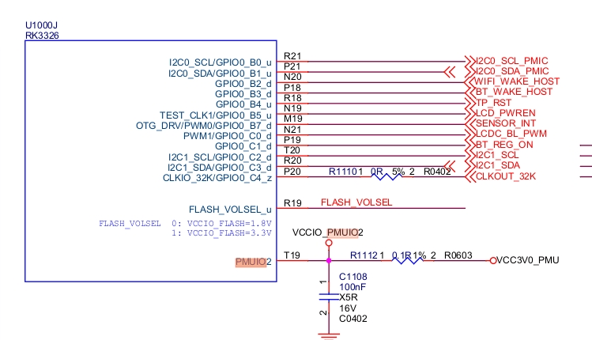
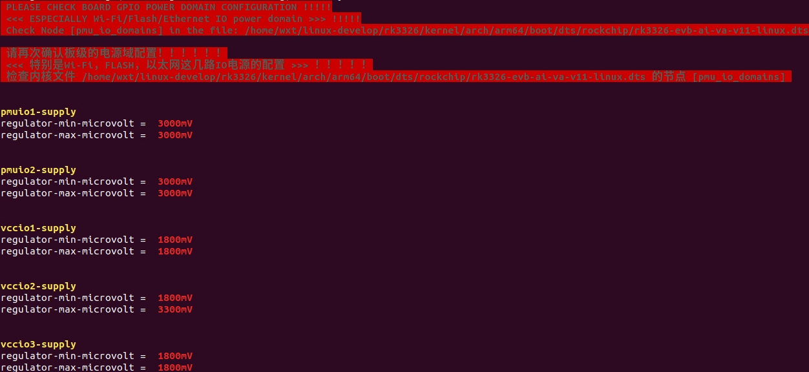
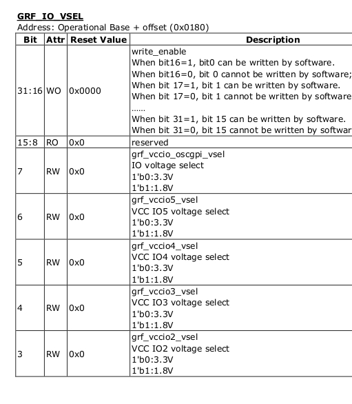

# RK3326 IO 电源域配置说明

文档标识：RK-SM-YF-908

发布版本：V1.0.0

日期：2021-05-15

文件密级：□绝密   □秘密   □内部资料   ■公开

**免责声明**

本文档按“现状”提供，瑞芯微电子股份有限公司（“本公司”，下同）不对本文档的任何陈述、信息和内容的准确性、可靠性、完整性、适销性、特定目的性和非侵权性提供任何明示或暗示的声明或保证。本文档仅作为使用指导的参考。

由于产品版本升级或其他原因，本文档将可能在未经任何通知的情况下，不定期进行更新或修改。

**商标声明**

“Rockchip”、“瑞芯微”、“瑞芯”均为本公司的注册商标，归本公司所有。

本文档可能提及的其他所有注册商标或商标，由其各自拥有者所有。

**版权所有 © 2021 瑞芯微电子股份有限公司**

超越合理使用范畴，非经本公司书面许可，任何单位和个人不得擅自摘抄、复制本文档内容的部分或全部，并不得以任何形式传播。

瑞芯微电子股份有限公司

Rockchip Electronics Co., Ltd.

地址：     福建省福州市铜盘路软件园A区18号

网址：     [www.rock-chips.com](http://www.rock-chips.com)

客户服务电话： +86-4007-700-590

客户服务传真： +86-591-83951833

客户服务邮箱： [fae@rock-chips.com](mailto:fae@rock-chips.com)

---

**前言**

**概述**

主控电源域的IO电平要与对接外设芯片的IO电平保持一致,还要注意软件的电压配置要跟硬件的电压一致，否则，最坏的情况可能会导致IO的损坏。

本文主要描述了RK3326平台Linux SDK配置IO电源域的方法，旨在帮助开发者正确配置IO的电源域。

**产品版本**

| **芯片名称** | **内核版本** |
| ------------ | ------------ |
| RK3326 | Linux 4.4 |

**读者对象**

本文档（本指南）主要适用于以下工程师：

- 技术支持工程师

- 软件开发工程师

**修订记录**

| **版本号** | **作者** | **修改日期** | **修改说明** |
| ---------- | --------| :--------- | ------------ |
| V1.0.0 | Caesar Wang | 2021-05-15 | 初始版本     |

---

**目录**

[TOC]

---

## 第一步：获取硬件原理图并确认硬件电源的设计方案

本文以RK_EVB_RK3326_LP3S178P132SD4_V12_201801024 EVB板为例进行介绍。

硬件原理图：RK_EVB_RK3326_LP3S178P132SD4_V12_201801024.pdf

电源方案：从硬件原理图分析，**EVB板RK_EVB_RK3326_LP3S178P132SD4_V12_2018010245**是带PMU（RK817-1）方案。

## 第二步：查找对应的内核dts配置文件

由第一步可知，该EVB板的硬件电源设计是带PMU方案的，对应的内核dts配置文件位于：arch/arm64/boot/dts/rockchip/rk3326-evb-lp3-v10-linux.dts（本文讨论的方案）

## 第三步：修改内核dts的电源域配置节点pmu_io_domains

```c
&io_domains {
        status = "okay";

        vccio1-supply = <&vcc1v8_soc>;
        vccio2-supply = <&vccio_sd>;
        vccio3-supply = <&vcc1v8_dvp>;
        vccio4-supply = <&vcc_3v0>;
        vccio5-supply = <&vcc_3v0>;
};

&pmu_io_domains {
        status = "okay";

        pmuio1-supply = <&vcc3v0_pmu>;
        pmuio2-supply = <&vcc3v0_pmu>;
};
```

以**pmuio2-supply**为例，首先查看硬件原理图确认pmuio2电源域（PMUIO2）的配置如图所示。

**PMUIO2**配置的电源域为VCC3V0_PMU（即3.0v）。



## 第四步：SDK查看当前固件电源域配置

命令：`./build.sh info`



## 第五步：烧录固件后确认寄存器值是否正确

以**RK3326**芯片为例，根据手册获取PMU_SOC_CON0寄存器（0xFF010100）和 GRF_IO_VSEL寄存器（0xFF140180） 说明如下：




```shell
# io -r -4 0xFF010100
ff010100:  00002380

# io -r -4 0xFF140180
ff140180:  00000017
```
