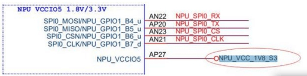
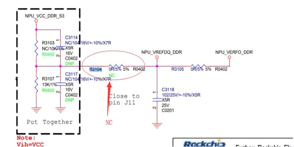

# Rockchip RK3399Pro Linux NPU 开发指南

文档标识：RK-SM-YF-301

发布版本：V1.1.0

日期：2020-03-31

文件密级：□绝密   □秘密   □内部资料   ■公开

---

**免责声明**

本文档按“现状”提供，福州瑞芯微电子股份有限公司（“本公司”，下同）不对本文档的任何陈述、信息和内容的准确性、可靠性、完整性、适销性、特定目的性和非侵权性提供任何明示或暗示的声明或保证。本文档仅作为使用指导的参考。

由于产品版本升级或其他原因，本文档将可能在未经任何通知的情况下，不定期进行更新或修改。

**商标声明**

“Rockchip”、“瑞芯微”、“瑞芯”均为本公司的注册商标，归本公司所有。

本文档可能提及的其他所有注册商标或商标，由其各自拥有者所有。

**版权所有** **© 2020** **福州瑞芯微电子股份有限公司**

超越合理使用范畴，非经本公司书面许可，任何单位和个人不得擅自摘抄、复制本文档内容的部分或全部，并不得以任何形式传播。

福州瑞芯微电子股份有限公司

Fuzhou Rockchip Electronics Co., Ltd.

地址：     福建省福州市铜盘路软件园A区18号

网址：     www.rock-chips.com

客户服务电话： +86-4007-700-590

客户服务传真： +86-591-83951833

客户服务邮箱： fae@rock-chips.com

---

**前言**

**概述**

文档主要介绍 Rockchip RK3399Pro NPU 开发指南，旨在帮助工程师更快上手NPU开发及相关调试方法。

**读者对象**

本文档（本指南）主要适用于以下工程师：

技术支持工程师

软件开发工程师

**各芯片系统支持状态**

| **芯片名称**    | **Buildroot** | **Debian** | **Yocto** |
| ----------- | :-------------- | :------------- | :---------- |
| RK3399Pro      | Y               | Y              | Y          |

## **修订记录**

| **日期**   | **版本** | **作者** | **修改说明** |
| ---------- | -------- | -------- | ------------ |
| 2018-12-08 | V1.0.0   | Caesar Wang   | 初始版本     |
| 2019-05-28 | V1.0.1   | Caesar Wang   | 增加 Debian 和 Buildroot 中 NPU 启动说明     |
| 2019-06-06 | V1.0.2   | Caesar Wang   | 修改 Buildroot 的说明     |
| 2020-03-31 | V1.1.0   | Caesar Wang   | 重写更改为 NPU 开发指南    |

## **目录**

---
[TOC]
---

## 1 Rockchip RK3399Pro NPU 介绍

### 1.1 概述

采用高性能AI处理芯片RK3399Pro，集成神经网络处理器NPU，算力高达3.0Tops，兼容多种AI框架，灵活应用于各种智能产品。

### 1.2 NPU (Neural Process Unit) 介绍

NPU是专门研究神经网络的过程单元。它的设计目的是加速机器视觉等人工智能领域的神经网络算法以及自然语言处理。人工智能的应用越来越广泛目前提供了多种功能，包括面部跟踪以及手势和身体跟踪、图像分类、视频监控、自动语音识别（ASR）和高级驾驶员辅助系统（ADAS）等。

NPU有如下特性：

- 支持 8bit/16bit 运算，运算性能高达 3.0TOPS。
- NPU功耗小于1.5W，相较于 GPU 作为 AI 运算单元的大型芯片方案，功耗不到 GPU 所需要的 1%。
- 模型兼容性强，可支持多类框架支持主流层类型，易于添加自定义层，支持INT16/FP16。
- 可直接加载 Caffe / Mxnet / TensorFlow 模型。
- 提供 AI 开发工具：支持模型快速转换、支持开发板端侧转换 API、支持 TensorFlow / TF Lite / Caffe / ONNX / Darknet 等模型。
- 提供 AI 应用开发接口：提供 RKNN 跨平台 API、Linux 支持 TensorFlow 开发。

### 1.3 NPU 开发工具

RK3399Pro NPU 开发工具如下：

**RKNN_DEMO (MobileNet SSD)** ：
RKNN 的 Demo 请参考目录 external/rknn_demo/，相关操作说明详见工程目录
docs/Soc_public/RK3399PRO/ Rockchip_Developer_Guide_Linux_RKNN_DEMO_CN.pdf。

**RKNN-TOOLKIT** ：
开发工具在 external/rknn-toolkit 目录下，主要用来实现模型转换，模型推理，模型性能评估功能等，具体使用说明请参考当前 doc/ 的目录文档：

```
├── Rockchip_Developer_Guide_RKNN_Toolkit_Custom_OP_CN.pdf
├── Rockchip_Developer_Guide_RKNN_Toolkit_Custom_OP_EN.pdf
├── Rockchip_Quick_Start_RKNN_Toolkit_V1.3.0_CN.pdf
├── Rockchip_Quick_Start_RKNN_Toolkit_V1.3.0_EN.pdf
├── Rockchip_Trouble_Shooting_RKNN_Toolkit_V1.3_CN.pdf
├── Rockchip_Trouble_Shooting_RKNN_Toolkit_V1.3_EN.pdf
├── Rockchip_User_Guide_RKNN_Toolkit_V1.3.0_CN.pdf
├── Rockchip_User_Guide_RKNN_Toolkit_V1.3.0_EN.pdf
├── Rockchip_User_Guide_RKNN_Toolkit_Visualization_CN.pdf
├── Rockchip_User_Guide_RKNN_Toolkit_Visualization_EN.pdf
```

**RKNN-DRIVER**：
RKNN DRIVER 开发内容在工程目录 external/rknpu 下。

**RKNPUTools**：
RKNN API的开发使用在工程目录 external/RKNPUTools 下。

### 1.4 NPU 上电启动流程介绍

#### 1.4.1 NPU 和 CPU 硬件框架


图中 host 为系统端 CPU（Android/Linux OS），device 为 NPU 端 (Linux OS)，host 控制 NPU 的上电
及固件升级，通过 USB2.0 升级固件(升级固件到 DDR，所以每次开机都要重新升级)，通过 USB3.0/PCIE传输模型数据。

#### 1.4.2 Debian 中 NPU 上电启动流程

Debian 的 NPU 启动流程主要如下：

```shell
root@linaro-alip:~# cat /etc/init.d/rockchip.sh
function update_npu_fw() {
/usr/bin/npu-image.sh
sleep 1
/usr/bin/npu_transfer_proxy&
}
```

通过开启 rockchip.sh 服务后执行 NPU 的升级，其中 npu_transfer_proxy 是 CPU 和 NPU 之间传输服务进程,每次运行都需要在后台开启。

由于 RK3399Pro 有不同版本的 EVB 版本, EVB V10-V12 板子是通过 USB3.0 来传输模型的，V13是通过 PCIE 方式传输模型数据，V14支持 USB3.0 和 PCIE 两种方式传输。 NPU 升级流程具体如下：.

```shell
root@linaro-alip:/# cat /usr/bin/npu-image.sh
...
COMPATIBLE=$(cat /proc/device-tree/compatible)

if [ -e "/sys/devices/platform/f8000000.pcie/pcie_reset_ep" ] ;
then
    echo "upgrading npu with pcie image......\n"

    if [[ $COMPATIBLE =~ "rk3399pro-evb-v14-linux" ]];
    then
        cd /usr/share/npu_fw_pcie/
        npu_upgrade_pcie_combine MiniLoaderAll.bin uboot.img trust.img boot.img
        cd /usr/bin/
        mv npu_powerctrl_combine npu_powerctrl
    else
        cd /usr/share/npu_fw_pcie/
        npu_upgrade_pcie MiniLoaderAll.bin uboot.img trust.img boot.img
    fi
else
    echo "upgrading npu with usb image......\n"
    cd /usr/share/npu_fw/
    npu_upgrade MiniLoaderAll.bin uboot.img trust.img boot.img
fi
```

如果NPU固件升级成功， NPU 端会有 Log 输出，或在CPU通过Log来判断也可以。

```shell
root@linaro-alip:/# cat /var/log/syslog |grep npu
....
linaro-alip rockchip.sh[718]: upgrading npu with pcie image......\n
linaro-alip rockchip.sh[718]: update npu image ok\n
..
```

其中 npu_upgrade 是 USB3.0方式的 NPU 固件升级批处理可执行文件，npu_upgrade_pcie和npu_upgrade_pcie_combine 是 PCIE 方式的 NPU 固件升级可执行文件。

#### 1.4.2 Buildroot 中 NPU 上电启动流程

Buildroot 的 NPU 启动流程主要如下：

```shell
[root@rk3399pro:/]# cat /etc/init.d/S11_npu_init
case "$1" in
start)
        ./usr/bin/npu-image.sh
        sleep 1
        ./usr/bin/npu_transfer_proxy&
}
```

系统启动会运行 S11_npu_init start 执行 NPU 的升级，其中 npu_transfer_proxy 是 CPU 和 NPU 之间传输服务进程, 每次运行都需要在后台开启。

由于 RK3399Pro 有不同版本的 EVB 版本, EVB V10-V12 板子是通过 USB3.0来传输模型的，V13是通过 PCIE 方式传输模型数据，V14支持 USB3.0和 PCIE 两种方式传输。 Buildroot 中 NPU 升级流程具体如下：.

```
rk3399pro$ cat buildroot/package/rockchip/rknpu-fw/rknpu-fw.mk
################################################################################
#
# rknpu firmware
#
################################################################################
RKNPU_FW_VERSION = 1.0.0
RKNPU_FW_SITE_METHOD = local
RKNPU_FW_SITE = $(TOPDIR)/../external/rknpu-fw

RKNPU_FW_PCIE_TYPE = npu_fw_pcie/*
RKNPU_FW_USB_TYPE = npu_fw/*

ifeq ($(BR2_PACKAGE_RKNPU_PCIE),y)
define RKNPU_FW_INSTALL_TARGET_CMDS
    mkdir -p $(TARGET_DIR)/usr/share/npu_fw
    $(INSTALL) -m 0755 -D $(@D)/$(RKNPU_FW_PCIE_TYPE) $(TARGET_DIR)/usr/share/npu_fw/
    $(INSTALL) -m 0755 -D $(@D)/bin/npu-image.sh $(TARGET_DIR)/usr/bin/
    $(INSTALL) -m 0755 -D $(@D)/bin/npu_transfer_proxy $(TARGET_DIR)/usr/bin/
    $(INSTALL) -m 0755 -D $(@D)/bin/npu_upgrade_pcie $(TARGET_DIR)/usr/bin/npu_upgrade
    $(INSTALL) -m 0755 -D $(@D)/bin/upgrade_tool $(TARGET_DIR)/usr/bin/
    $(INSTALL) -m 0755 -D $(@D)/S11_npu_init $(TARGET_DIR)/etc/init.d/
endef
else
define RKNPU_FW_INSTALL_TARGET_CMDS
    mkdir -p $(TARGET_DIR)/usr/share/npu_fw
    $(INSTALL) -m 0755 -D $(@D)/$(RKNPU_FW_USB_TYPE) $(TARGET_DIR)/usr/share/npu_fw/
    $(INSTALL) -m 0755 -D $(@D)/bin/npu-image.sh $(TARGET_DIR)/usr/bin/
    $(INSTALL) -m 0755 -D $(@D)/bin/npu_transfer_proxy $(TARGET_DIR)/usr/bin/
    $(INSTALL) -m 0755 -D $(@D)/bin/npu_upgrade $(TARGET_DIR)/usr/bin/
    $(INSTALL) -m 0755 -D $(@D)/bin/upgrade_tool $(TARGET_DIR)/usr/bin/
    $(INSTALL) -m 0755 -D $(@D)/S11_npu_init $(TARGET_DIR)/etc/init.d/
endef
endif
```

一些可执行文件或者固件会从 external/rknpu-fw 仓库中获取， 最后在系统中的可执行如下：

```shell
[root@rk3399pro:/]# cat /usr/bin/npu-image.sh
cd /usr/share/npu_fw/
npu_upgrade MiniLoaderAll.bin uboot.img trust.img boot.img
```

如果NPU固件升级成功， NPU 端会有 Log 输出，或在CPU通过Log来判断也可以。

```shell
[root@rk3399pro:/]# cat /var/log/npu.log
start to wait device...
device is ready
start to download loader...
download loader ok
start to wait loader...
loader is ready
start to write uboot...
write uboot ok
write trust ok
start to write boot...
write boot ok
...
```

#### 1.4.3 NPU 上电部分 npu_powerctrl 的介绍

```
/usr/bin/npu_powerctrl -i
/usr/bin/npu_powerctrl -o
```

这部分控制 NPU 上电，如果上电正常，USB 会枚举到 180a 设备，NPU 进入烧写模式

```
[ 4.437235] usb 3-1: New USB device found, idVendor=2207, idProduct=180a
```

npu_powerctrl 的使用说明如下，具体源码可在工程 <SDK>/buildroot/package/rockchip/npu_powerctrl*

```
root@linaro-alip:/#npu_powerctrl
Usage:npu_powerctrl [-s] [-r] [-o] [-i] [-d]
-s      npu enter sleep
-r      wakup npu
-o      power up or reset npu
-i      gpio init
-d      power down
```

#### 1.4.4 NPU 启动正常判断

如果是NPU和CPU之间是 USB 3.0 传输模型数据，启动如下 Log 可判断：

```
[ 14.265132] usb 4-1: New USB device found, idVendor=2207, idProduct=1808
or
[ 14.246378] usb 4-1: New USB device found, idVendor=2207, idProduct=0019
```

如果是NPU和CPU之间是 PCIE 传输模型数据，启动如下 Log 可判断：

```
[ 14.024987] usb 1-1: New USB device found, idVendor=2207, idProduct=1005
```

#### 1.4.5 NPU 休眠唤醒

**NPU 休眠**

CPU 通过命令让 NPU 进入待机模式:

```shell
[root@rk3399pro:/]# npu_powerctrl -s
[ 1489.345702] rockchip-pcie f8000000.pcie: loop_cout = 0
ACM idProduct: 1005
usb remove patch is /sys/bus/platform/devices/fe380000.usb/usb1/1-1/remove
[ 1489.401483] usb 1-1: USB disconnect, device number 4
set clk_en  1 to 0
suspend 0
```

实际 Buildroot/Debian 都是通过系统 pm-suspend 来实现待机唤醒，
可以 check 下 01npu 的配置情况即可。

```
[root@rk3399pro:/]# find ./ -name *01npu*
./usr/lib/pm-utils/sleep.d/01npu

[root@rk3399pro:/]# cat ./usr/lib/pm-utils/sleep.d/01npu
...
case "$1" in
       hibernate|suspend)
               npu_powerctrl -s
               ...
```

pm-suspend 的待机如下所示：

```shell
[root@rk3399pro:/]# pm-suspend
[ 1731.434381] PM: suspend entry 2017-08-05 09:46:51.760367325 UTC
[ 1731.435020] PM: Syncing filesystems ... done.
[ 1731.470854] Freezing user space processes ... (elapsed 0.002 seconds) done.
[ 1731.473889] Freezing remaining freezable tasks ... (elapsed 0.001 seconds) done.
[ 1731.476189] Suspending console(s) (use no_console_suspend to debug)
INFO:    sleep mode config[0xfe]:
INFO:           AP_PWROFF
INFO:           SLP_ARMPD
INFO:           SLP_PLLPD
INFO:           DDR_RET
INFO:           SLP_CENTER_PD
INFO:           OSC_DIS
INFO:    wakeup source config[0x4]:
INFO:           GPIO interrupt can wakeup system
INFO:    PWM CONFIG[0x4]:
INFO:           PWM: PWM2D_REGULATOR_EN
INFO:    APIOS info[0x0]:
INFO:           not config
INFO:    GPIO POWER INFO:
INFO:           GPIO1_C1
INFO:           GPIO1_B6
INFO:    PMU_MODE_CONG: 0x1477bf79
```

**NPU 唤醒**

CPU 通过命令让 NPU 唤醒：

```shell
[root@rk3399pro:/]# npu_powerctrl -r
set clk_en  0 to 1
[ 1944.664140] rockchip-pcie f8000000.pcie: loop_cout = 0
resume 0
[root@rk3399pro:/]# [ 1945.980698] usb 1-1: new high-speed USB device number 6 using ehci-platform
[ 1946.097637] usb 1-1: New USB device found, idVendor=2207, idProduct=1005
[ 1946.098304] usb 1-1: New USB device strings: Mfr=1, Product=2, SerialNumber=3
[ 1946.099062] usb 1-1: Product: rk3xxx
[ 1946.099429] usb 1-1: Manufacturer: rockchip
[ 1946.099853] usb 1-1: SerialNumber: 437fd2c675feb0e7
[ 1946.105037] npu_acm 1-1:1.0: npu_ACM: USB ACM device
```

实际 Buildroot/Debian可通过 Power 按键来实现待机唤醒：

```
[root@rk3399pro:/]# cat /etc/power-key.sh
#!/bin/sh

if type pm-suspend &>/dev/null; then
        LOCK=/var/run/pm-utils/locks/pm-suspend.lock
        SUSPEND_CMD="pm-suspend"
else
        LOCK=/tmp/.power_key
        PRE_SUSPEND="touch $LOCK"
        SUSPEND_CMD="echo -n mem > /sys/power/state"
        POST_SUSPEND="{ sleep 2 && rm $LOCK; }&"
fi

logger "Received power key..."

if [ ! -f $LOCK ]; then
        logger "Prepare to suspend by power key..."
        su root -c "$PRE_SUSPEND"
        su root -c "$SUSPEND_CMD"
        su root -c "$POST_SUSPEND"
fi

```

#### 1.4.6 NPU 和 CPU 之间的数据传输

目前可以通过两种方式 ADB 和 TTY。

- ADB 访问 NPU，目前只支持 NPU USB 3.0 的版本。
- TTY 访问 NPU，用串口的 rz、sz 进行数据的拷贝。

### 1.5 NPU 启动失败的分析

#### 1.5.1 确认 NPU 是否正常进入烧写模式

- 以下电源没有供会导致无法识别 180a



- 确认上电控制是否正常
  比如相关的 GPIO 是否有 request 错误，状态是否正常

```
root@linaro-alip:~# cat /sys/kernel/debug/gpio
GPIOs 0-31, platform/pinctrl, gpio0:
 gpio-1   (                    |vbus-5v             ) out hi
 gpio-4   (                    |sysfs               ) out hi
 gpio-5   (                    |bt_default_wake_host) in  lo
 gpio-13  (                    |headset_gpio        ) in  lo
...
```

查看相关的电源 GPIO 是否正确，是否有被复用的

```
#define NPU_VDD_0V8_GPIO "4" //GPIO0_PA4
#define NPU_VDD_LOG_GPIO "10" //GPIO0_PB2
#define NPU_VCC_1V8_GPIO "11" //GPIO0_PB3
#define NPU_VDD_CPU_GPIO "54" //GPIO1_PC6
#define NPU_VCCIO_3V3_GPIO "55" //GPIO1_PC7
#define NPU_VDD_GPIO "56" //GPIO1_PD0
#define CPU_RESET_NPU_GPIO "32" //GPIO1_PA0
#define NPU_PMU_SLEEP_GPIO "35" //GPIO1_A3
#define CPU_INT_NPU_GPIO "36" //GPIO1_A4
```

- 正常 MASKROM 状态 IO

```
root@linaro-alip:~# cat /sys/kernel/debug/gpio
gpio-4 ( |sysfs ) out hi
gpio-10 ( |sysfs ) out hi
gpio-11 ( |sysfs ) out hi
gpio-32 ( |sysfs ) out hi
gpio-35 ( |sysfs ) in hi
gpio-36 ( |sysfs ) out lo
gpio-54 ( |sysfs ) out hi
gpio-55 ( |sysfs ) out hi
gpio-56 ( |sysfs ) out hi

root@linaro-alip:~# cat /sys/kernel/debug/clk/clk_wifi_pmu/clk_rate
24000000
root@linaro-alip:~# cat /sys/kernel/debug/clk/clk_wifi_pmu/clk_enable_count
1
```

#### 1.5.2 待机唤醒死机问题

休眠错误 log: 没有正常唤醒导致上层无法访问 USB 设备节点

```
npu resume timeout in one second
resume -1
 usb read failed: ret = -4: LIBUSB_ERROR_NO_DEVICE
It is sleeping state, nothing to do!
```

手动休眠唤醒：

休眠(sleep)：root@linaro-alip:~#  npu_powerctrl -s
唤醒(wakeup)： root@linaro-alip:~#  npu_powerctrl -r

- 休眠需要外部的 32k 时钟，确认电阻有贴，确认 clk 有打开


cat d/clk/rk808-clkout2/clk_enable_count
echo r 0xf2 > sys/rk8xx/rk8xx_dbg bit8 enable:1

RK3399Pro EVB V14 不需要连接外部 32k 时钟。

- 是否使用了 cif camera, isp0_flash 与 cpu_int_npu 复用，会导致 io 异常无法唤醒。


- vdd_npu 电源控制是连接到 NPU 端控制的，默认使用的是 tcs452x，不支持修改该电源初始化错误会导致休眠死机。

#### 1.5.3 DDR 初始化失败

```
DDR Version V1.02 20190404_no_atag_soc_info_dbg
col error
Returning to boot ROM...
```

 R3104 应该 NC

 

### 1.6 相关调试命令

 **手动更新 NPU 固件**：

 ```
 npu_upgrade MiniLoaderAll.bin uboot.img trust.img boot.img
 ```

 **上电进入烧录模式**：

 ```
 root@linaro-alip:/# npu_powerctrl -o
set clk_en  1 to 0
[ 2031.640852] usb 3-1: USB disconnect, device number 4
set clk_en  0 to 1
powerup
root@linaro-alip:/# [ 2031.913651] usb 3-1: new high-speed USB device number 5 using ehci-platform
[ 2032.031832] usb 3-1: New USB device found, idVendor=2207, idProduct=180a
[ 2032.032506] usb 3-1: New USB device strings: Mfr=0, Product=0, SerialNumber=0
 ```
