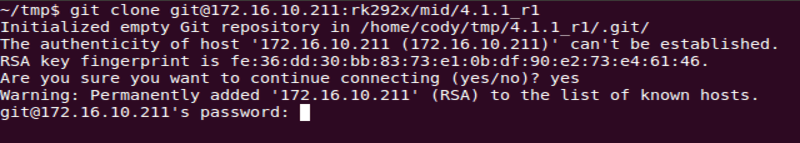

# Rockchip RK356X Linux SDK 发布说明

文档标识：RK-FB-YF-392

发布版本：V0.0.1

日期：2020-12-11

文件密级：□绝密   □秘密   □内部资料   ■公开

**免责声明**

本文档按“现状”提供，瑞芯微电子股份有限公司（“本公司”，下同）不对本文档的任何陈述、信息和内容的准确性、可靠性、完整性、适销性、特定目的性和非侵权性提供任何明示或暗示的声明或保证。本文档仅作为使用指导的参考。

由于产品版本升级或其他原因，本文档将可能在未经任何通知的情况下，不定期进行更新或修改。

**商标声明**

“Rockchip”、“瑞芯微”、“瑞芯”均为本公司的注册商标，归本公司所有。

本文档可能提及的其他所有注册商标或商标，由其各自拥有者所有。

**版权所有© 2020 瑞芯微电子股份有限公司**

超越合理使用范畴，非经本公司书面许可，任何单位和个人不得擅自摘抄、复制本文档内容的部分或全部，并不得以任何形式传播。

瑞芯微电子股份有限公司

Rockchip Electronics Co., Ltd.

地址：     福建省福州市铜盘路软件园A区18号

网址：     www.rock-chips.com

客户服务电话： +86-4007-700-590

客户服务传真： +86-591-83951833

客户服务邮箱： fae@rock-chips.com

---

**前言**

**概述**

文档主要介绍 Rockchip RK3566/RK3568 Linux SDK发布说明，旨在帮助工程师更快上手RK3566/RK3568 Linux SDK开发及相关调试方法。

**读者对象**

本文档（本指南）主要适用于以下工程师：

技术支持工程师

软件开发工程师

**各芯片系统支持状态**

| **芯片名称**    | **Buildroot** | **Debian** | **Yocto** |
| ----------- | :-------------- | :------------- | :---------- |
| RK3566   | Y               | Y           | Y           |
| RK3568   | Y               | Y           | Y           |

 **修订记录**

| **日期**   | **版本** | **作者** | **修改说明** |
| -----------| :-------------- | :------------- | :---------- |
| 2020-12-11 | V0.0.1 | Caesar Wang | 初始版本。 |

---

**目录**

[TOC]

---

## 概述

本 SDK 支持三个系统分别基于 Buildroot 2018.02-rc3，Yocto Thud 3.0 和 Debian 10 上开发，内核基于 Kernel 4.19，引导基于 U-boot v2017.09，适用于 RK3566/RK3568 EVB 开发板及基于此开发板进行二次开发的所有 Linux 产品。
本 SDK 支持  VPU 硬解码、GPU 3D、Wayland/X11 显示、NPU、QT 等功能。具体功能调试和接口说明，请阅读工程目录 docs/ 下文档。

## 主要支持功能

| **功能**    | **模块名** |
| ----------- | :-------------- |
| 数据通信      | Wi-Fi、以太网卡、USB、SD 卡、SATA 、PCI-e 接口 |
| 应用程序      | 多媒体播放、设置、浏览器、文件管理       |

## SDK 获取说明

SDK 通过瑞芯微代码服务器对外发布获取。其编译开发环境，参考第 7 节 [SDK编译说明](# SDK 编译说明)。

### RK356X Linux 通用软件包获取方法

#### 通过代码服务器下载

获取 RK356X Linux 软件包，需要有一个帐户访问 Rockchip 提供的源代码仓库。客户向瑞芯微技术窗口申请 SDK，同步提供 SSH公钥进行服务器认证授权，获得授权后即可同步代码。关于瑞芯微代码服务器 SSH公钥授权，请参考第 10 节  [SSH 公钥操作说明](# SSH 公钥操作说明)。

RK356X_Linux_SDK 下载命令如下：

```
repo init --repo-url ssh://git@www.rockchip.com.cn/repo/rk/tools/repo -u \
ssh://git@www.rockchip.com.cn/linux/rockchip/platform/manifests -b rk356x -m \
rk356x_linux_release.xml
```

repo 是 google 用 Python 脚本写的调用 git 的一个脚本，主要是用来下载、管理项目的软件仓库，其下载地址如下：

```
git clone ssh://git@www.rockchip.com.cn/repo/rk/tools/repo
```

#### 通过本地压缩包解压获取

为方便客户快速获取 SDK 源码，瑞芯微技术窗口通常会提供对应版本的 SDK 初始压缩包，开发者可以通过这种方式，获得 SDK 代码的初始压缩包，该压缩包解压得到的源码，进行同步后与通过 repo 下载的源码是一致的。
以 RK356X_LINUX_SDK_V0.0.1_20201211.tgz 为例，拷贝到该初始化包后，通过如下命令可检出源码：

```shell
mkdir rk356x
tar xvf RK356X_LINUX_SDK_V0.0.1_20201211.tgz -C rk356x
cd rk356x
.repo/repo/repo sync -l
.repo/repo/repo sync -c --no-tags
```

后续开发者可根据 FAE 窗口定期发布的更新说明，通过 `.repo/repo/repo sync -c --no-tags` 命令同步更新。

## 软件开发指南

### 软件更新记录

软件发布版本升级通过工程 xml 进行查看，具体方法如下：

```
.repo/manifests$ ls -l -h rk356x_linux_release.xml
```

软件发布版本升级更新内容通过工程文本可以查看，具体方法如下：

```
.repo/manifests$ cat RK356X_Linux_SDK_Note.md
```

或者参考工程目录：

```
<SDK>/docs/RK356X/RK356X_Linux_SDK_Note.md
```

## 硬件开发指南

硬件相关开发可以参考用户使用指南，在工程目录：

RK3566 EVB 硬件开发指南：

```
<SDK>/docs/RK356X/Rockchip_RK3566_EVB_User_Guide_V1.0_CN.pdf
```

RK3568 EVB硬件开发指南：

```
<SDK>/docs/RK356X/Rockchip_RK3568_EVB_User_Guide_V1.0_CN.pdf
```

RK3568 NVR硬件开发指南：

```
<SDK>/docs/RK356X/Rockchip_RK3568_NVR_User_Guide_V1.0_CN.pdf
```

## SDK 工程目录介绍

SDK目录包含有 buildroot、debian、recovery、app、kernel、u-boot、device、docs、external 等目录。每个目录或其子目录会对应一个 git 工程，提交需要在各自的目录下进行。

- app：存放上层应用 APP，主要是 qcamera/qfm/qplayer/qseting 等一些应用程序。
- buildroot：基于 Buildroot（2018.02-rc3）开发的根文件系统。
- debian：基于 Debian 10 开发的根文件系统。
- device/rockchip：存放各芯片板级配置以及一些编译和打包固件的脚本和预备文件。
- docs：存放开发指导文件、平台支持列表、工具使用文档、Linux 开发指南等。
- IMAGE：存放每次生成编译时间、XML、补丁和固件目录。
- external：存放第三方相关仓库，包括音频、视频、网络、recovery 等。
- kernel：存放 Kernel 4.19 开发的代码。
- prebuilts：存放交叉编译工具链。
- rkbin：存放 Rockchip 相关 Binary 和工具。
- rockdev：存放编译输出固件。
- tools：存放 Linux 和 Window 操作系统下常用工具。
- u-boot：存放基于 v2017.09 版本进行开发的 U-Boot 代码。
- yocto：存放基于 Yocto Thud 3.0 开发的根文件系统。

## SDK 编译说明

### SDK依赖包安装

本 SDK 开发环境是在 Ubuntu 系统上开发测试。我们推荐使用 Ubuntu 18.04 的系统进行编译。其他的 Linux 版本可能需要对软件包做相应调整。除了系统要求外，还有其他软硬件方面的要求。
硬件要求：64 位系统，硬盘空间大于 40G。如果您进行多个构建，将需要更大的硬盘空间。
软件要求：Ubuntu 18.04 系统：
编译 SDK 环境搭建所依赖的软件包安装命令如下：

```
sudo apt-get install repo git ssh make gcc libssl-dev liblz4-tool \
expect g++ patchelf chrpath gawk texinfo chrpath diffstat binfmt-support \
qemu-user-static live-build bison flex fakeroot cmake gcc-multilib g++-multilib unzip \
device-tree-compiler python-pip ncurses-dev pyelftools \
```

建议使用 Ubuntu18.04 系统或更高版本开发，若编译遇到报错，可以视报错信息，安装对应的软件包。

### SDK板级配置

进入工程<SDK>/device/rockchip/rk356x 目录：

| 板级配置                       | 说明                                               |
| ----------------------------- | --------------------------------------------------- |
| BoardConfig-rk3566-evb2-lp4x-v10.mk  |   适用于 RK3566 EVB 搭配 LPDDR4 开发板  |
| BoardConfig-rk3568-evb1-ddr4-v10.mk  |  适用于 RK3568 EVB 搭配 DDR4 开发板  |
| BoardConfig-rk3568-nvr.mk  |  适用于 RK3568 NVR 开发板 |
| BoardConfig.mk  |  默认配置 |

方法1
`./build.sh` 后面加上板级配置文件, 例如：

选择**RK3566 EVB 搭配 LPDDR4 开发板**的板级配置：

```shell
./build.sh device/rockchip/rk356x/BoardConfig-rk3566-evb2-lp4x-v10.mk
```

选择**RK3568 EVB 搭配 DDR4 开发板**的板级配置：

```shell
./build.sh device/rockchip/rk356x/BoardConfig-rk3568-evb1-ddr4-v10.mk
```

选择**RK3568 NVR 开发板**的板级配置：

```shell
./build.sh device/rockchip/rk356x/BoardConfig-rk3568-nvr.mk
```

方法2

```shell
rk356x$ ./build.sh lunch
processing option: lunch

You're building on Linux
Lunch menu...pick a combo:

0. default BoardConfig.mk
1. BoardConfig-rk3566-evb2-lp4x-v10.mk
2. BoardConfig-rk3568-evb1-ddr4-v10.mk
3. BoardConfig-rk3568-nvr.mk
4. BoardConfig.mk
Which would you like? [0]:
```

### 查看编译命令

在根目录执行命令：./build.sh -h|help

```shell
rk356x$ ./build.sh -h
Usage: build.sh [OPTIONS]
Available options:
BoardConfig*.mk    -switch to specified board config
lunch              -list current SDK boards and switch to specified board config
uboot              -build uboot
spl                -build spl
loader             -build loader
kernel             -build kernel
modules            -build kernel modules
toolchain          -build toolchain
rootfs             -build default rootfs, currently build buildroot as default
buildroot          -build buildroot rootfs
ramboot            -build ramboot image
multi-npu_boot     -build boot image for multi-npu board
yocto              -build yocto rootfs
debian             -build debian10 buster/x11 rootfs
distro             -build debian10 buster/wayland rootfs
pcba               -build pcba
recovery           -build recovery
all                -build uboot, kernel, rootfs, recovery image
cleanall           -clean uboot, kernel, rootfs, recovery
firmware           -pack all the image we need to boot up system
updateimg          -pack update image
otapackage         -pack ab update otapackage image
save               -save images, patches, commands used to debug
allsave            -build all & firmware & updateimg & save
check              -check the environment of building

Default option is 'allsave'.
```

查看部分模块详细编译命令，例如：./build.sh -h kernel

```shell
rk356x$ ./build.sh -h kernel
###Current SDK Default [ kernel ] Build Command###
cd kernel
make ARCH=arm64 rockchip_linux_defconfig rockchip_linux_bifrost.config
make ARCH=arm64 rk3568-evb1-ddr4-v10-linux.img -j12
```

[^注]: 详细的编译命令以实际对应的SDK版本为准，主要是配置可能会有差异。build.sh编译命令是固定的。

### 自动编译

进入工程根目录执行以下命令自动完成所有的编译：

```shell
./build.sh all # 只编译模块代码（u-Boot，kernel，Rootfs，Recovery）
               # 需要再执行./mkfirmware.sh 进行固件打包

./build.sh     # 在./build.sh all基础上
               # 1. 增加固件打包 ./mkfirmware.sh
               # 2. update.img打包
               # 3. 复制rockdev目录下的固件到IMAGE/***_RELEASE_TEST/IMAGES目录
               # 4. 保存各个模块的补丁到IMAGE/***_RELEASE_TEST/PATCHES目录
               # 注：./build.sh 和 ./build.sh allsave 命令一样
```

默认是 Buildroot，可以通过设置坏境变量 RK_ROOTFS_SYSTEM 指定 rootfs。RK_ROOTFS_SYSTEM目前可设定三个类型：buildroot、debian、 yocto 。

如需要 debain 可以通过以下命令进行生成：

```shell
$export RK_ROOTFS_SYSTEM=debian
$./build.sh
```

### 各模块编译及打包

#### U-Boot编译

```shell
### U-Boot编译命令
./build.sh uboot

### 查看U-Boot详细编译命令
./build.sh -h uboot
```

#### Kernel编译

```shell
### Kernel编译命令
./build.sh kernel

### 查看Kernel详细编译命令
./build.sh -h kernel
```

#### Recovery编译

```shell
### Recovery编译命令
./build.sh recovery

### 查看Recovery详细编译命令
./build.sh -h recovery
```

注：Recovery是非必需的功能，有些板级配置不会设置

#### Buildroot  编译

进入工程目录根目录执行以下命令自动完成 Rootfs 的编译及打包：

```shell
./build.sh rootfs
```

编译后在 Buildroot 目录 output/rockchip_芯片命名/images下生成 rootfs.ext4。

#### Buildroot 的交叉编译

若需要编译单个模块或者第三方应用，需对交叉编译环境进行配置。比如RK3568,其交叉编译工具位于 buildroot/output/rockchip_rk3368/host/usr 目录下，需要将工具的bin/目录和 aarch64-buildroot-linux-gnu/bin/ 目录设为环境变量，在顶层目录执行自动配置环境变量的脚本（只对当前控制台有效）：

```shell
source envsetup.sh
```

输入命令查看：

```shell
cd buildroot/output/rockchip_rk3568/host/usr/bin
./aarch64-linux-gcc --version
```

此时会打印如下信息：

```
gcc version 9.3.0 (Buildroot 2018.02-rc3-02723-gd3fbc6ae13)
```

##### Buildroot 中模块编译

比如 qplayer 模块，常用相关编译命令如下：

- 编译 qplayer

```
SDK$make qplayer
```

- 重编 qplayer

```
SDK$make qplayer-rebuild
```

- 删除 qplayer

```
SDK$make qplayer-dirclean
或者
SDK$rm -rf /buildroot/output/rockchip_rk3568/build/qlayer-1.0
```

#### Debian 编译

```
./build.sh debian
```

或进入 debian/ 目录：

```
cd debian/
```

后续的编译和 Debian 固件生成请参考当前目录 readme.md。

**(1) Building base Debian system**

```
sudo apt-get install binfmt-support qemu-user-static live-build
sudo dpkg -i ubuntu-build-service/packages/*
sudo apt-get install -f
```

编译 64 位的 Debian:

```shell
RELEASE=buster TARGET=desktop ARCH=arm64 ./mk-base-debian.sh
```

编译完成会在  debian/ 目录下生成：linaro-buster-alip-xxxxx-1.tar.gz（xxxxx 表示生成时间戳)。

FAQ:

- 上述编译如果遇到如下问题情况：

```
noexec or nodev issue /usr/share/debootstrap/functions: line 1450:
..../rootfs/ubuntu-build-service/buster-desktop-arm64/chroot/test-dev-null: Permission denied E: Cannot install into target '/rootfs/ubuntu-build-service/buster-desktop-arm64/chroot' mounted with noexec or nodev
```

解决方法：

```
mount -o remount,exec,dev xxx (xxx 是工程目录), 然后重新编译
```

另外如果还有遇到其他编译异常，先排除使用的编译系统是 ext2/ext4 的系统类型。

- 由于编译 Base Debian 需要访问国外网站，而国内网络访问国外网站时，经常出现下载失败的情况:

Debian 使用 live build,镜像源改为国内可以这样配置:

```diff
+++ b/ubuntu-build-service/buster-desktop-arm64/configure
@@ -11,6 +11,11 @@ set -e
 echo "I: create configuration"
 export LB_BOOTSTRAP_INCLUDE="apt-transport-https gnupg"
 lb config \
+ --mirror-bootstrap "https://mirrors.tuna.tsinghua.edu.cn/debian" \
+ --mirror-chroot "https://mirrors.tuna.tsinghua.edu.cn/debian" \
+ --mirror-chroot-security "https://mirrors.tuna.tsinghua.edu.cn/debian-security" \
+ --mirror-binary "https://mirrors.tuna.tsinghua.edu.cn/debian" \
+ --mirror-binary-security "https://mirrors.tuna.tsinghua.edu.cn/debian-security"
  --apt-indices false \
  --apt-recommends false \
  --apt-secure false \
```

如果其他网络原因不能下载包，有预编生成的包分享在[百度云网盘](https://eyun.baidu.com/s/3mjGXBHA)，放在当前目录直接执行下一步操作。

**(2) Building rk-debian rootfs**

编译 64位的 Debian：

```shell
VERSION=debug ARCH=arm64 ./mk-rootfs-buster.sh
```

**(3) Creating the ext4 image(linaro-rootfs.img)**

```shell
./mk-image.sh
```

此时会生成 linaro-rootfs.img。

#### Yocto 编译

进入工程目录根目录执行以下命令自动完成 Rootfs 的编译及打包：
RK3566/RK3568 EVB 开发板：

```shell
./build.sh yocto
```

编译后在 yocto 目录 build/lastest 下生成 rootfs.img。

FAQ：
上面编译如果遇到如下问题情况：

```
Please use a locale setting which supports UTF-8 (such as LANG=en_US.UTF-8).
Python can't change the filesystem locale after loading so we need a UTF-8
when Python starts or things won't work.
```

解决方法:

```shell
locale-gen en_US.UTF-8
export LANG=en_US.UTF-8 LANGUAGE=en_US.en LC_ALL=en_US.UTF-8
```

或者参考 [setup-locale-python3]( https://webkul.com/blog/setup-locale-python3) 编译后生成的 image 在 yocto/build/lastest/rootfs.img， 默认用户名登录是 root。
Yocto 更多信息请参考 [Rockchip Wiki](http://opensource.rock-chips.com/wiki_Yocto)。

#### 固件的打包

上面 Kernel/U-Boot/Recovery/Rootfs 各个部分的编译后，进入工程目录根目录执行以下命令自
动完成所有固件打包到 rockdev 目录下：

固件生成:

```shell
./mkfirmware.sh
```

## 刷机说明

RK3566 EVB2 接口分布图如下：


RK3568 EVB1 开发板接口分布图如下：


RK3568 NVR 开发板接口分布图如下：


### Windows 刷机说明

SDK 提供 Windows 烧写工具(工具版本需要 V2.79 或以上)，工具位于工程根目录：

```shell
tools/
├── windows/RKDevTool
```

如下图，编译生成相应的固件后，设备烧写需要进入 MASKROM 或 BootROM 烧写模式，
连接好 USB 下载线后，按住按键“MASKROM”不放并按下复位键“RST”后松手，就能进入
MASKROM 模式，加载编译生成固件的相应路径后，点击“执行”进行烧写，也可以按 “recovery" 按键不放并按下复位键 “RST” 后松手进入 loader 模式进行烧写，下面是 MASKROM 模式的分区偏移及烧写文件。(注意： Windows PC 需要在管理员权限运行工具才可执行)

</left>

注：烧写前，需安装最新 USB 驱动，驱动详见：

```shell
<SDK>/tools/windows/DriverAssitant_v5.0.zip
```

### Linux 刷机说明

Linux 下的烧写工具位于 tools/linux 目录下(Linux_Upgrade_Tool 工具版本需要 V1.57 或以上)，请确认你的板子连接到 MASKROM/loader rockusb。比如编译生成的固件在 rockdev 目录下，升级命令如下：

```shell
sudo ./upgrade_tool ul rockdev/MiniLoaderAll.bin
sudo ./upgrade_tool di -p rockdev/parameter.txt
sudo ./upgrade_tool di -u rockdev/uboot.img
sudo ./upgrade_tool di -misc rockdev/misc.img
sudo ./upgrade_tool di -b rockdev/boot.img
sudo ./upgrade_tool di -recovery rockdev/recovery.img
sudo ./upgrade_tool di -oem rockdev/oem.img
sudo ./upgrade_tool di -rootfs rocdev/rootfs.img
sudo ./upgrade_tool di -userdata rockdev/userdata.img
sudo ./upgrade_tool rd
```

或升级打包后的完整固件：

```shell
sudo ./upgrade_tool uf rockdev/update.img
```

或在根目录，机器在 MASKROM 状态运行如下升级：

```shell
./rkflash.sh
```

### 系统分区说明

默认分区说明 ( 下面是 RK3568 EVB 分区参考）

| **Number** | **Start (sector)** | **End (sector)** | **Size** | **Name** |
| ---------- | ------------------ | --------------- | --------- | --------- |
| 1      | 16384  | 24575     |  4096K     |uboot     |
| 2      | 24576  | 32767     |  4096K     |misc     |
| 3      | 32768  | 98303     |  32M    |boot     |
| 4      | 98304  | 163839     |  32M     |recovery     |
| 5      | 163840  | 229375     |  32M     |bakcup     |
| 6      | 229376  | 12812287     |  6144M     |rootfs     |
| 7      | 12812288  | 13074431     |  128M     |oem     |
| 8      | 13074432  | 61071326     |  22.8G     |userdata     |

- uboot 分区：供 uboot 编译出来的 uboot.img。
- misc 分区：供 misc.img，给 recovery 使用。
- boot 分区：供 kernel 编译出来的 boot.img。
- recovery 分区：供 recovery 编译出的 recovery.img。
- backup 分区：预留，暂时没有用，后续跟 Android 一样作为 recovery 的 backup 使用。
- rootfs 分区：供 buildroot、debian 或 yocto 编出来的 rootfs.img。
- oem 分区：给厂家使用，存放厂家的 APP 或数据。挂载在 /oem 目录。
- userdata 分区：供 APP 临时生成文件或给最终用户使用，挂载在 /userdata 目录下。

## RK356X SDK 固件

- 百度云网盘

[Buildroot](https://eyun.baidu.com/s/3cXqTDs)

[Debian rootfs](https://eyun.baidu.com/s/3smu2OH3)

[Yocto rootfs](https://eyun.baidu.com/s/3dPzAwA)

- 微软 OneDriver

[Buildroot](https://rockchips-my.sharepoint.com/:f:/g/personal/lin_huang_rockchips_onmicrosoft_com/EmhOOhNkIeNOpDXUs7VDOVUBz48yh4rOWu-QzvLyfz6tZQ?e=D0Pmi8)

[Debian rootfs](https://rockchips-my.sharepoint.com/:f:/g/personal/lin_huang_rockchips_onmicrosoft_com/EgPPa1EfzepNoK_t6fIuSQgBZKoezSjV_N4_HQ2h0g0JNg?e=ITLyGT)

[Yocto rootfs](https://rockchips-my.sharepoint.com/:f:/g/personal/lin_huang_rockchips_onmicrosoft_com/Epq-ccBCajpGmxdZJJRkxYYBYRVbG9WflU_6AupdqZyQtQ?e=k19l9i)

## SSH 公钥操作说明

请根据《Rockchip_User_Guide_SDK_Application_And_Synchronization_CN》文档说明操作，生成 SSH 公钥，发邮件至fae@rock-chips.com，申请开通 SDK 代码。
该文档会在申请开通权限流程中，释放给客户使用。

### 多台机器使用相同 SSH 公钥

在不同机器使用，可以将你的 SSH 私钥文件 id_rsa 拷贝到要使用的机器的 “~/.ssh/id_rsa” 即
可。
在使用错误的私钥会出现如下提示，请注意替换成正确的私钥

</left>

添加正确的私钥后，就可以使用 git 克隆代码，如下图。

</left>

添加 ssh 私钥可能出现如下提示错误。

```
Agent admitted failture to sign using the key
```

在 console 输入如下命令即可解决。

```shell
ssh-add ~/.ssh/id_rsa
```

### 一台机器切换不同 SSH 公钥

可以参考 ssh_config 文档配置 SSH。

```shell
~$ man ssh_config
```

</left>

通过如下命令，配置当前用户的 SSH 配置。

```shell
~$ cp /etc/ssh/ssh_config ~/.ssh/config
~$ vi .ssh/config
```

如图，将 SSH 使用另一个目录的文件 “~/.ssh1/id_rsa” 作为认证私钥。通过这种方法，可以切换
不同的的密钥。

</left>

### 密钥权限管理

服务器可以实时监控某个 key 的下载次数、IP  等信息，如果发现异常将禁用相应的 key 的下
载权限。
请妥善保管私钥文件。并不要二次授权与第三方使用。

### 参考文档

更多详细说明，可参考文档<SDK>/docs/Others/Rockchip_User_Guide_SDK_Application_And_Synchronization_CN.pdf。
