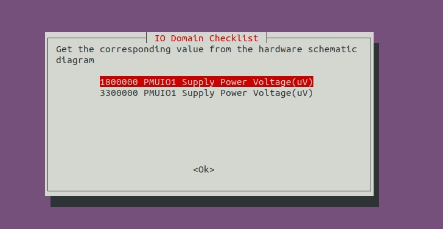
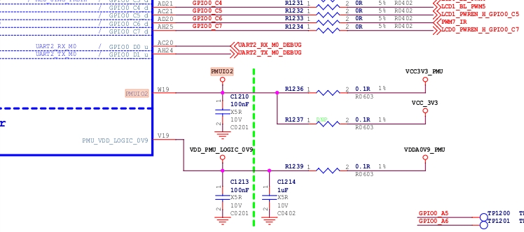
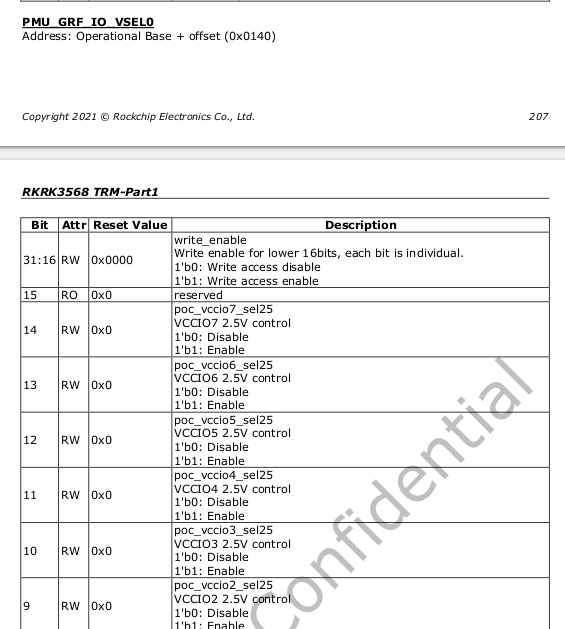
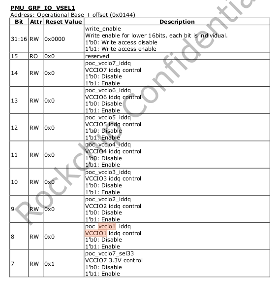

# RK356X IO 电源域配置说明

文档标识：RK-SM-YF-905

发布版本：V1.0.1

日期：2021-05-27

文件密级：□绝密   □秘密   □内部资料   ■公开

**免责声明**

本文档按“现状”提供，瑞芯微电子股份有限公司（“本公司”，下同）不对本文档的任何陈述、信息和内容的准确性、可靠性、完整性、适销性、特定目的性和非侵权性提供任何明示或暗示的声明或保证。本文档仅作为使用指导的参考。

由于产品版本升级或其他原因，本文档将可能在未经任何通知的情况下，不定期进行更新或修改。

**商标声明**

“Rockchip”、“瑞芯微”、“瑞芯”均为本公司的注册商标，归本公司所有。

本文档可能提及的其他所有注册商标或商标，由其各自拥有者所有。

**版权所有 © 2021 瑞芯微电子股份有限公司**

超越合理使用范畴，非经本公司书面许可，任何单位和个人不得擅自摘抄、复制本文档内容的部分或全部，并不得以任何形式传播。

瑞芯微电子股份有限公司

Rockchip Electronics Co., Ltd.

地址：     福建省福州市铜盘路软件园A区18号

网址：     [www.rock-chips.com](http://www.rock-chips.com)

客户服务电话： +86-4007-700-590

客户服务传真： +86-591-83951833

客户服务邮箱： [fae@rock-chips.com](mailto:fae@rock-chips.com)

---

**前言**

**概述**

主控电源域的IO电平要与对接外设芯片的IO电平保持一致,还要注意软件的电压配置要跟硬件的电压一致，否则，最坏的情况可能会导致IO的损坏。

RK3566/RK3568共有10个独立的IO电源域，分别为PMUIO[0:2]和VCCIO[1:7]。其中:

- PMUIO0、 PMUIO1为固定电平电源域，不可配置，其余IO domain均可进行配置；

- PMUIO2和VCCIO1,VCCIO[3:7]电源域均要求硬件供电电压与软件的配置相匹配:

  1) 当硬件IO电平接1.8V，软件电压配置也要相应配成1.8V;
  2) 当硬件IO电平接3.3V，软件电压配置也要相应配成3.3V

- VCCIO2电源域的供电与FLASH_VOL_SEL状态关系必须保持一致:

  1) 当VCCIO2供电是1.8V，则FLASH_VOL_SEL管脚必须保持为高电平；
  2) 当VCCIO2供电是3.3V，则FLASH_VOL_SEL管脚必须保持为低电平;

[^注]: 否则：

- 软件配置为1.8V，硬件供电3.3V，会使得IO处于过压状态，长期工作IO会损坏；

- 软件配置为3.3V，硬件供电1.8V，IO功能会异常；

本文主要描述了RK3566、RK3568平台Linux SDK配置IO电源域的方法，旨在帮助开发者正确配置IO的电源域。

**产品版本**

| **芯片名称** | **内核版本** |
| ------------ | ------------ |
| RK3566、RK3568 | Linux 4.19 |

**读者对象**

本文档（本指南）主要适用于以下工程师：

- 技术支持工程师

- 软件开发工程师

- 硬件开发工程师

**修订记录**

| **版本号** | **作者** | **修改日期** | **修改说明** |
| ---------- | --------| :--------- | ------------ |
| V1.0.0 | Caesar Wang | 2021-05-15 | 初始版本     |
| V1.0.1 | Caesar Wang | 2021-05-27 | 更新IO电源域相关说明     |

---

**目录**

[TOC]

---

## 第一步：获取硬件原理图并确认硬件电源的设计方案

本文以RK_EVB1_RK3568_DDR4P216SD6_V10_20200911 EVB板为例进行介绍。

硬件原理图：RK_EVB1_RK3568_DDR4P216SD6_V10_20200911.pdf

电源方案：从硬件原理图分析，**EVB板RK_EVB1_RK3568_DDR4P216SD6_V10_20200911**是带PMU（RK809-5）方案。

## 第二步：查找对应的内核dts配置文件

由第一步可知，该EVB板的硬件电源设计是带PMU方案的，对应的内核dts配置文件位于：

`<SDK>/kernel/arch/arm64/boot/dts/rockchip/rk3568-evb.dtsi` （本文讨论的方案）

## 第三步：修改内核dts的电源域配置节点pmu_io_domains

Kernel 第一次编译会强制去检查IO电源域的配置，代码实现在 `<SDK>/kernel/scripts/io-domain.sh`。检查项如下图



默认SDK对IO电源域配置是3.3V，正确检查步骤：

```
查看硬件实际链接 -> 配置DTS -> 选择DTS对应的电源域电压
```

默认SDK选3.3V才可以编译通过。SDK对应内核dts的电源域配置如下：

```c
<SDK>/kernel/arch/arm64/boot/dts/rockchip/rk3568-evb.dtsi

&pmu_io_domains {
    status = "okay";
    pmuio2-supply = <&vcc_3v3>;
    vccio1-supply = <&vcc_3v3>;
    vccio3-supply = <&vcc_3v3>;
    vccio4-supply = <&vcc_3v3>;
    vccio5-supply = <&vcc_3v3>;
    vccio6-supply = <&vcc_3v3>;
    vccio7-supply = <&vcc_3v3>;
};
```

以**pmuio2-supply**为例，首先查看硬件原理图确认pmuio2电源域（PMUIO2）的配置如图所示。

**PMUIO2** 配置的电源域为VCC3V3_PMU（即3.3v）。



[注] 软件不配置pmuio0,pmuio1和vccio2，硬件根据实际存储接口IO电源域电平配置。

## 第四步：SDK查看当前固件电源域配置

命令：`./build.sh info`


## 第五步：烧录固件后确认寄存器值是否正确

以**RK356X**芯片为例，根据手册获取PMU_GRF_IO_VSEL0~PMU_GRF_IO_VSEL2寄存器（基地址：0xFDC20140~0xFDC20148）说明如下：






```shell
# io -4 -r 0xFDC20140
fdc20140:  00000000

#  io -4 -r 0xFDC20144
fdc20144:  000000ff

# io -4 -r 0xFDC20148
fdc20148:  00000030
```
