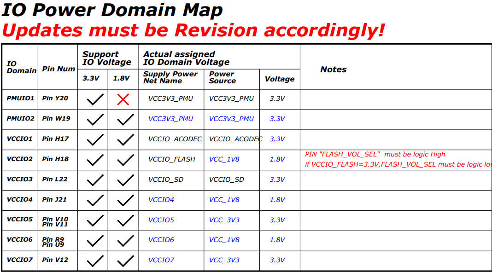
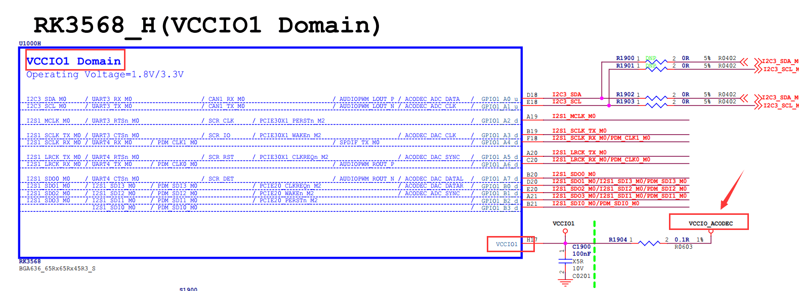
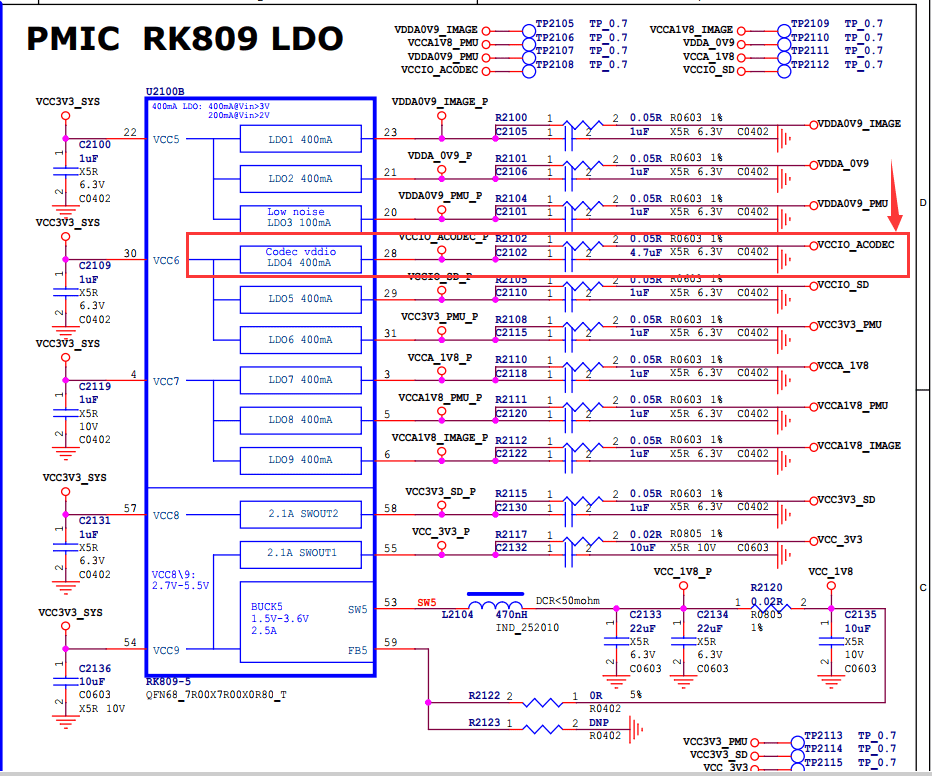
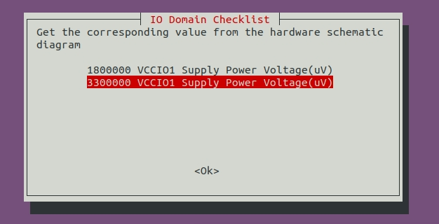
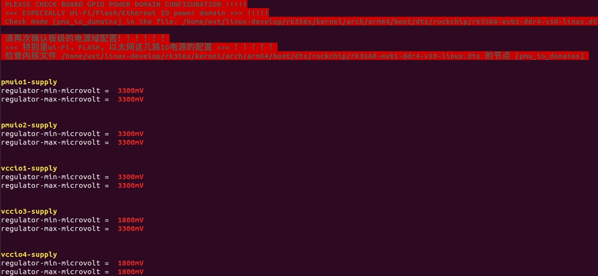
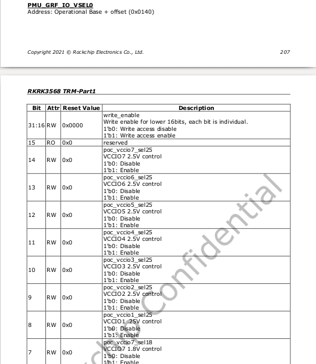
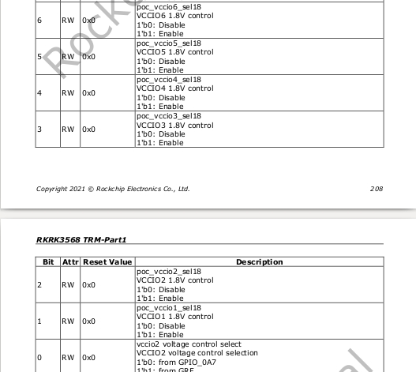
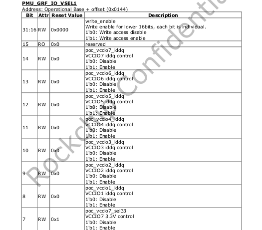
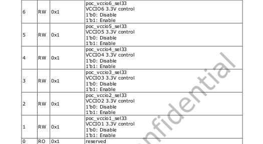

# RK3566 RK3568 IO 电源域配置指南

文档标识：RK-SM-YF-905

发布版本：V1.0.2

日期：2021-06-02

文件密级：□绝密   □秘密   □内部资料   ■公开

**免责声明**

本文档按“现状”提供，瑞芯微电子股份有限公司（“本公司”，下同）不对本文档的任何陈述、信息和内容的准确性、可靠性、完整性、适销性、特定目的性和非侵权性提供任何明示或暗示的声明或保证。本文档仅作为使用指导的参考。

由于产品版本升级或其他原因，本文档将可能在未经任何通知的情况下，不定期进行更新或修改。

**商标声明**

“Rockchip”、“瑞芯微”、“瑞芯”均为本公司的注册商标，归本公司所有。

本文档可能提及的其他所有注册商标或商标，由其各自拥有者所有。

**版权所有 © 2021 瑞芯微电子股份有限公司**

超越合理使用范畴，非经本公司书面许可，任何单位和个人不得擅自摘抄、复制本文档内容的部分或全部，并不得以任何形式传播。

瑞芯微电子股份有限公司

Rockchip Electronics Co., Ltd.

地址：     福建省福州市铜盘路软件园A区18号

网址：     [www.rock-chips.com](http://www.rock-chips.com)

客户服务电话： +86-4007-700-590

客户服务传真： +86-591-83951833

客户服务邮箱： [fae@rock-chips.com](mailto:fae@rock-chips.com)

---

**前言**

**概述**

主控电源域的IO电平要与对接外设芯片的IO电平匹配，还要注意软件的电压配置要跟硬件的电压一致，否则，最坏的情况可能会导致IO的损坏。

RK3566/RK3568共有10个独立的IO电源域，分别为PMUIO[0:2]和VCCIO[1:7]。其中：

- PMUIO0、 PMUIO1为固定电平电源域，不可配置；

- PMUIO2和VCCIO1，VCCIO[3:7]电源域均要求硬件供电电压与软件的配置相匹配:

  1) 当硬件IO电平接1.8V，软件电压配置也要相应配成1.8V；
  2) 当硬件IO电平接3.3V，软件电压配置也要相应配成3.3V；

- VCCIO2电源域软件不需要配置，但是其硬件供电电压与FLASH_VOL_SEL状态需保持一致:

  1) 当VCCIO2供电是1.8V，则FLASH_VOL_SEL管脚必须保持为高电平；
  2) 当VCCIO2供电是3.3V，则FLASH_VOL_SEL管脚必须保持为低电平；

否则：

- 当软件配置为1.8V，硬件供电3.3V，会使得IO处于过压状态，长期工作IO会损坏；

- 当软件配置为3.3V，硬件供电1.8V，IO功能会异常；

本文主要描述了RK3566、RK3568平台SDK配置IO电源域的方法，旨在帮助开发者正确配置IO的电源域。

**产品版本**

| **芯片名称** | **系统版本** | **内核版本** |
| ------------ | ------------ | ------------ |
| RK3566、RK3568 | Linux 4.19 | Kernel 4.19 |
| RK3566、RK3568 | Android 11.0 | Kernel 4.19 |

**读者对象**

本文档（本指南）主要适用于以下工程师：

- 技术支持工程师

- 软件开发工程师

- 硬件开发工程师

**修订记录**

| **版本号** | **作者** | **修改日期** | **修改说明** |
| ---------- | --------| :--------- | ------------ |
| V1.0.0 | Caesar Wang | 2021-05-15 | 初始版本     |
| V1.0.1 | Caesar Wang | 2021-05-27 | 更新IO电源域相关说明     |
| V1.0.2 | Caesar Wang | 2021-06-02 | 增加Android和更详细的寄存器介绍    |

---

**目录**

[TOC]

---

## 第一步：获取硬件原理图并确认硬件电源的设计方案

本文以RK_EVB1_RK3568_DDR4P216SD6_V10_20200911 EVB板为例进行介绍。

硬件原理图：RK_EVB1_RK3568_DDR4P216SD6_V10_20200911.pdf

电源方案：从硬件原理图分析，**EVB板RK_EVB1_RK3568_DDR4P216SD6_V10_20200911**是带PMU（RK809-5）方案。

## 第二步：查找对应的内核dts配置文件

由第一步可知，该EVB板的硬件电源设计是带PMU方案的，对应的内核dts配置文件位于：

`<SDK>/kernel/arch/arm64/boot/dts/rockchip/rk3568-evb.dtsi` （本文讨论的方案）

## 第三步：修改内核dts的电源域配置节点pmu_io_domains

SDK默认的内核dts的电源域配置如下：

```c
<SDK>/kernel/arch/arm64/boot/dts/rockchip/rk3568-evb.dtsi

&pmu_io_domains {
    status = "okay";
    pmuio2-supply = <&vcc_3v3>;
    vccio1-supply = <&vcc_3v3>;
    vccio3-supply = <&vcc_3v3>;
    vccio4-supply = <&vcc_3v3>;
    vccio5-supply = <&vcc_3v3>;
    vccio6-supply = <&vcc_3v3>;
    vccio7-supply = <&vcc_3v3>;
};
```

本文以vccio1-supply为例进行介绍。首先查看硬件原理图确认vccio1电源域（VCCIO1）的配置如图所示。



在硬件原理图上面搜索`VCCIO1`，如下：



从上图找到`VCCIO1`的电源是`vccio_acodec`。
在原理图上搜索`vccio_acodec`，可以找到如下图。



从上图找到`vccio_acodec`是由RK809的LDO4供电。
从软件的dts里面找到LDO_REG4（LDO4）的配置信息，如下：

```c
vccio_acodec: LDO_REG4 {
        regulator-always-on;
        regulator-boot-on;
        regulator-min-microvolt = <3300000>;
        regulator-max-microvolt = <3300000>;
        regulator-name = "vccio_acodec";
        regulator-state-mem {
                regulator-off-in-suspend;
        };
};
```

将上面的vccio_acodec配置到pmu_io_domains节点中的vccio1-supply = <&vcc_3v3>;；即可完成vccio1的电压配置:

```c
&pmu_io_domains {
        status = "okay";
        pmuio2-supply = <&vcc_3v3>;
        vccio1-supply = <&vccio_acodec>;
        vccio3-supply = <&vcc_3v3>;
        vccio4-supply = <&vcc_3v3>;
        vccio5-supply = <&vcc_3v3>;
        vccio6-supply = <&vcc_3v3>;
        vccio7-supply = <&vcc_3v3>;
};
```

**注意：**

- pmuio0、pmuio1为固定电平电源域，软件不可配置；
- vccio2软件不需要配置，但是其硬件供电电压与FLASH_VOL_SEL状态需保持一致：当VCCIO2供电是1.8V，则FLASH_VOL_SEL管脚必须保持为高电平；当VCCIO2供电是3.3V，则FLASH_VOL_SEL管脚必须保持为低电平；
- 其他几路电源域（pmuio2和VCCIO[3:7]），参考上述VCCIO1的方式配置即可；

**RK356X kernel编译弹出IO-Domain确认对话框:**



弹出这个对话框目的是检查实际硬件原理图和软件dts的IO电压是否匹配，客户需要根据各自项目的硬件原理图的实际设计电压来选择（对话框中选择的值不会保存到dts中，dts需要手动去修改），如果您是软件工程师请与贵司的硬件工程师一起核对确认，**这个很重要，请务必确认！**如果IO电压配置不正确，将会导致芯片IO烧坏。
当你确认IO电压后这个对话框就不会再弹出（输入值和dts配置的值相同），如果dts名字或者dts里面的io-domian发生变化，则会继续弹出重新进行确认。

## 第四步：SDK查看当前固件电源域配置

编译Kernel后, Linux SDK 查看当前电源域配置方法如下：

`./build.sh info`



Android 11.0 SDK 查看的方法如下（此方法也适用于Linux SDK)：

```
cat <SDK>/kernel/arch/arm64/boot/dts/rockchip/.rk3568-evb1-ddr4-v10-linux.dtb.dts.tmp.domain

PMUIO2 Supply Power Voltage1:3300000
VCCIO1 Supply Power Voltage1:3300000
VCCIO3 Supply Power Voltage1:3300000
VCCIO4 Supply Power Voltage1:3300000
VCCIO5 Supply Power Voltage1:3300000
VCCIO6 Supply Power Voltage1:3300000
VCCIO7 Supply Power Voltage1:3300000
```

## 第五步：烧录固件后确认寄存器值是否正确

以**RK356X**芯片为例，根据手册获取PMU_GRF_IO_VSEL0~PMU_GRF_IO_VSEL2寄存器（基地址：0xFDC20140~0xFDC20148）说明如下：










为了保证对外客户使用的安全性，目前SDK对外配置都是3.3V, 寄存器的值如下表所示，但会存在部分功能缺失的情况。

| **寄存器** | **地址** | **读取命令** | **值** |
| ---------- | --------| :--------- | :--------- |
| PMU_GRF_IO_VSEL0 | 0xFDC20140 | io -4 -r 0xFDC20140 | 0x00000000|
| PMU_GRF_IO_VSEL1 | 0xFDC20144 | io -4 -r 0xFDC20144 | 0x000000ff |
| PMU_GRF_IO_VSEL2 | 0xFDC20148 | io -4 -r 0xFDC20148 | 0x00000030 |

若需要恢复SDK EVB功能配置，需要revert Kernel这个提交 (git revert e18c51f465dd0dd0185f5 )。但是请注意，此EVB的dts配置仅仅只适用于我们的EVB，不能随意用于客户的项目，客户需要根据各自项目的实际硬件供电电压来修改对应的dts配置。

```
commit e18c51f465dd0dd0185f5f80a72699fca0a68adc
Author: Wu Liangqing <wlq@rock-chips.com>
Date:   Mon May 24 09:31:10 2021 +0800
```
