# Rockchip Battery IPC使用说明

文件标识：RK-FB-YF-390

发布版本：V0.0.2

日期：2020-11-12

文件密级：□绝密   □秘密   □内部资料   ■公开

**免责声明**

本文档按“现状”提供，瑞芯微电子股份有限公司（“本公司”，下同）不对本文档的任何陈述、信息和内容的准确性、可靠性、完整性、适销性、特定目的性和非侵权性提供任何明示或暗示的声明或保证。本文档仅作为使用指导的参考。

由于产品版本升级或其他原因，本文档将可能在未经任何通知的情况下，不定期进行更新或修改。

**商标声明**

“Rockchip”、“瑞芯微”、“瑞芯”均为本公司的注册商标，归本公司所有。

本文档可能提及的其他所有注册商标或商标，由其各自拥有者所有。

**版权所有 © 2020瑞芯微电子股份有限公司**

超越合理使用范畴，非经本公司书面许可，任何单位和个人不得擅自摘抄、复制本文档内容的部分或全部，并不得以任何形式传播。

瑞芯微电子股份有限公司

Rockchip Electronics Co., Ltd.

地址：     福建省福州市铜盘路软件园A区18号

网址：     [www.rock-chips.com](http://www.rock-chips.com)

客户服务电话： +86-4007-700-590

客户服务传真： +86-591-83951833

客户服务邮箱： [fae@rock-chips.com](mailto:fae@rock-chips.com)

---

**前言**

**概述**

本文档提供电池类IPC使用说明。

**产品版本**

| **芯片名称** | **内核版本** |
| ------------ | ------------ |
| RV1109       | Linux 4.19   |

**读者对象**

本文档（本指南）主要适用于以下工程师：

技术支持工程师

软件开发工程师

**修订记录**

| **版本号** | **作者**         | **修改日期** | **修改说明**     |
| ---------- | ---------------- | :----------- | ---------------- |
| V0.0.1     | 林刘迪铭、黄子晗 | 2020-10-20   | 初始版本         |
| V0.0.2     | 陈天凤           | 2020-11-12   | 添加录像推送说明 |

---

**目录**

[TOC]

---

## 硬件说明

### 上电说明

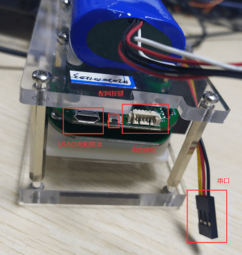

可通过USB供电或电池上电。 **但单独USB供电不稳定，可能会出现重启现象，且USB供电时无法进入休眠。**

### 烧录说明

需要接入串口和USB，串口波特率1500000，输入reboot loader命令，（或者按住配网按键，再按RESET按键）进入烧入模式，使用RKDevTool进行烧录。

具体RKDevTool的使用方法详情请见SDK\tools\windows\RKDevTool\RKDevTool_Release\《RKDevTool_manual_v1.2_cn》

### 按键说明

配网按键，用于进入[配网流程](#配网流程)。

KEY WAKE按键（在摄像头mipi排线旁），用于手动进行唤醒。

RESET按键（SD卡槽旁），用于重启。

### PIR说明

PIR在一定范围内有人经过，就会触发PIR,如果设备处在休眠状态中，设备就会被唤醒。目前可以用命令行输入以下命令控制灵敏度：

`echo xxx > /proc/pir/sensibility`

### 状态灯说明

红灯，常亮表示设备正常运行，闪烁代表正在进入休眠。

蓝灯，常亮表示设备已经联网，闪烁代表进入配网模式。

| 指示灯 | 设备运行（未配网） | 设备进入休眠 | 设备休眠 | 设备运行（已配网） | 设备配网中 |
| ------ | ------------------ | ------------ | -------- | ------------------ | ---------- |
| 红灯   | 常亮               | 闪烁         | 不亮     | 常亮               | 常亮       |
| 蓝灯   | 不亮               | 亮           | 不亮     | 常亮               | 闪烁       |

注意：Demo目前没做网络断开检测，所以有时网络小概率断开蓝灯可能还是亮的；

## 配网流程

APP: DemoApp_debug_1.0.5.apk

APP版本为1.0.5

### 二维码配网

进入APP时，需要注册一个阿里云物联网账号。详情请看app登录界面。

1. APP进入主界面，点击右上角加号-添加设备。

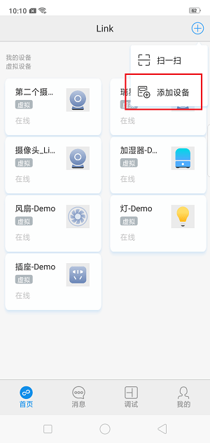

2. 再点击右上角添加方式-二维码添加。

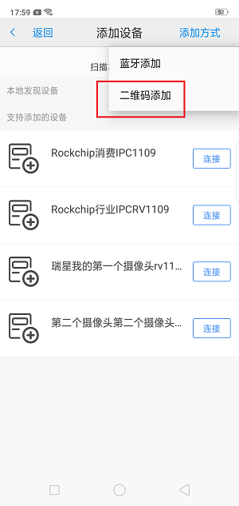

3. 输入wifi名称和密码，点击确定，生成二维码。


4. 短按板子USB接口旁的配网按键，会进入5秒的配网流程。**注意：需要确保设备红灯常亮，未进入关机。**详见[关机流程](#关机流程)。

5. 将二维码正对摄像头，距离20~30厘米。

6. **若识别到二维码，则蓝灯会开始闪烁**，表示正在连接wifi。

7. **若配网成功，则蓝灯常亮。**

**注意事项**

若蓝灯一直未亮，表示设备未联网，请确保红灯常亮，板子未进入关机状态，然后重试步骤4~7。

**更换网络**

基本步骤与[配网流程](#配网流程)相同，需要注意的是，在更换网络成功后，[配网脚本](#配网脚本)会重启mediaserver，重新连接阿里云。

### 命令行配网

串口输入以下命令

```shell
killall tb_start_wifi.sh # 先停止之前的配网脚本
tb_start_wifi.sh ssid passwd true # ssid和passwd为wifi名称和密码
```

## 绑定流程

**绑定需要设备已经联网**。

### 扫描本地设备

需要手机和设备连接相同wifi，点击右上角添加设备，然后本地发现设备即可。


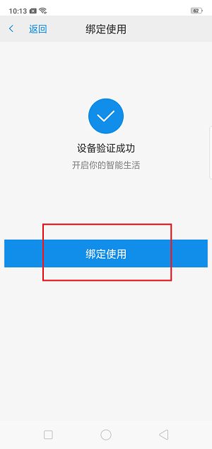

### 扫描二维码绑定

若设备上贴有二维码，则APP主界面点击右上角加号-扫一扫，扫描二维码即可绑定。

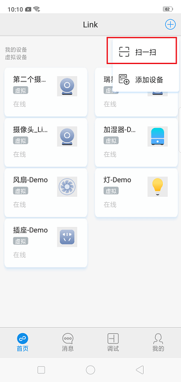

## 关机流程

目前触发关机条件有两种：

1. 开机90秒内无人预览。

2. 预览退出5秒后。

**若红灯闪烁，代表正在关机中，此时请勿操作APP，否则可能状态出错。**

**若红灯灭，代表已进入关机状态。**

关机时间可以通过[关机脚本](#关机脚本)来修改。

**注意事项：**

**USB供电情况下无法进入休眠**

## 唤醒流程

### APP唤醒

1. APP点击设备进入预览界面。

2. APP提示设备已休眠，是否唤醒。点击确定即可。


**注意事项：**由于网络问题，唤醒之后APP可能无法及时获取到媒体流，需要回到主界面后，重新点击设备进入。

如果一直无弹窗，则是向云端获取状态卡顿，请检查网络或重启板子。

### 按键唤醒

请参考[硬件说明](#硬件说明)

## 双向对讲

APP进入预览界面，点击对讲标志，即可进行双向对讲。

请确保设备的麦克风和扬声器正常

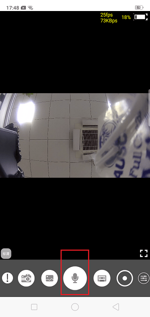

## 录像推送

1. APP进入预览界面，点击底部最右侧设置按钮，进入设置界面

2. 领取免费云存储

   阿里生活物联网平台提供一定量的免费云存储，每个设备只能领用一次 ，默认可以免费领取3个月的7天循环事件云存储月套餐。

   点击领取云存储套餐，领取成功后会弹窗提示套餐详情，可以查看套餐到期时间，领取后也可通过查询云存储详情查看。

   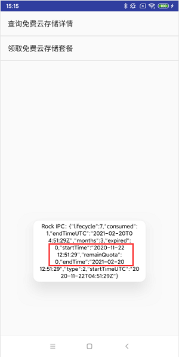

3. 查询用户和设备的关系

   只有Owner才有权限设置报警录像计划。目前分享方式为共享式，第一个连接设备的用户为Owner，后续连接的用户为Sharer。

   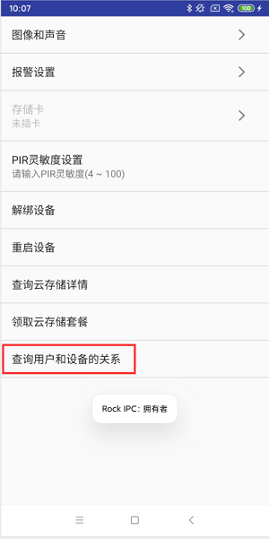

4. 设置报警录像计划

   点击 报警设置 -> 报警录像计划 进入设置界面，可以配置录像时长（10s、20s、30s），全天录像或者分时段录像；配置后更新计划即可生效。设置录像计划后，当设备上报的事件落在计划范围内，则会通知设备推流并转存为云存录像。

   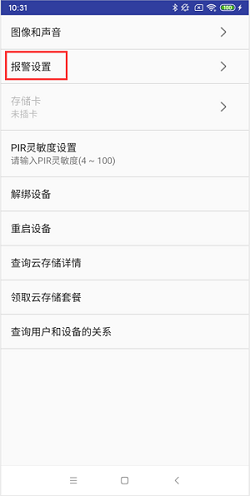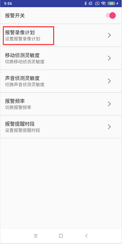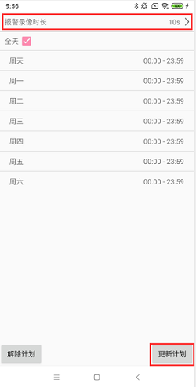

5. 设备端报警

   目前设备端应用启动后，会主动上报一次报警事件，从而触发录像。

6. 查看报警录像

   短按预览界面底部最左侧感叹号图标，查看云端录像时间戳，长按可查看云端录像列表。

## 局域网预览（RTSP）

设备支持在同一个局域网中预览，在设备联网后，使用PC的RTSP软件打开网络串流，输入

```
rtsp://（你的设备的IP地址）/live/video0
```

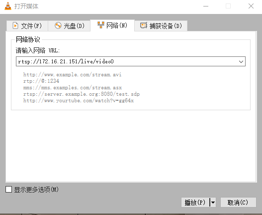

可以预览摄像头的画面：

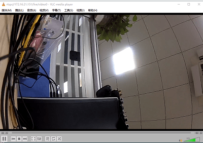

## 主要脚本

### 配网脚本

配网脚本位于/usr/bin/tb_start_wifi.sh

### 关机脚本

关机脚本位于/usr/bin/auto_poweroff.sh

## 注意事项

**1. 请确保网络与阿里云服务器之间连接正常，有些网络可能限制了淘宝等阿里系网站的访问，会导致APP操作流程出错。**

**2. 如果设备不使用的话， 请拔掉电池。 防止由于PIR频繁唤醒引起电池过放。**

**3. 设备关机后，app唤醒设备后视频流等待时间比较长，这是阿里云程序连云较慢造成的，等后续更新。**

**4. APP在预览未超过10s退出预览，进入休眠比较慢，这导致app下次唤醒会较长时间。这也是由于阿里云程序的问题，待后续更新。**

**5. 由于路由器种类太多，可能会存在未知兼容性问题，建议使用个人路由器进行测试。**

## Debug

为了节省功耗及减少开机时间，打印log默认关闭。如果遇到未知问题，可以接上串口 (波特率1500000) 输入以下命令：

`echo "7 4 1 7" > /proc/sys/kernel/printk`

来复现问题并保存log，提交瑞芯微的redmine系统，FAE会指派相应工程师跟进。
