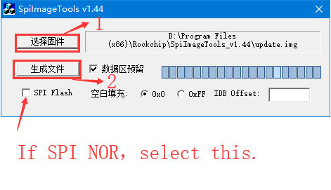

# Instructions to Build System Images Separately

ID: RK-SM-YF-386

Release Version: V1.6.3

Release Date: 2021-03-17

Security Level: □Top-Secret   □Secret   □Internal   ■Public

**DISCLAIMER**

THIS DOCUMENT IS PROVIDED “AS IS”. ROCKCHIP ELECTRONICS CO., LTD.(“ROCKCHIP”)DOES NOT PROVIDE ANY WARRANTY OF ANY KIND, EXPRESSED, IMPLIED OR OTHERWISE, WITH RESPECT TO THE ACCURACY, RELIABILITY, COMPLETENESS,MERCHANTABILITY, FITNESS FOR ANY PARTICULAR PURPOSE OR NON-INFRINGEMENT OF ANY REPRESENTATION, INFORMATION AND CONTENT IN THIS DOCUMENT. THIS DOCUMENT IS FOR REFERENCE ONLY. THIS DOCUMENT MAY BE UPDATED OR CHANGED WITHOUT ANY NOTICE AT ANY TIME DUE TO THE UPGRADES OF THE PRODUCT OR ANY OTHER REASONS.

**Trademark Statement**

"Rockchip", "瑞芯微", "瑞芯" shall be Rockchip’s registered trademarks and owned by Rockchip. All the other trademarks or registered trademarks mentioned in this document shall be owned by their respective owners.

**All rights reserved. ©2021. Rockchip Electronics Co., Ltd.**

Beyond the scope of fair use, neither any entity nor individual shall extract, copy, or distribute this document in any form in whole or in part without the written approval of Rockchip.

Rockchip Electronics Co., Ltd.

No.18 Building, A District, No.89, software Boulevard Fuzhou, Fujian,PRC

Website:     [www.rock-chips.com](http://www.rock-chips.com)

Customer service Tel:  +86-4007-700-590

Customer service Fax:  +86-591-83951833

Customer service e-Mail:  [fae@rock-chips.com](mailto:fae@rock-chips.com)

---

**Preface**

**Overview**

The document presents how to build kernel, U-Boot or Rootfs of Rockchip RV1126/RV1109 Linux SDK separately, aiming to help engineers get started with RV1126/RV1109 Linux SDK faster.

**[NOTICE]: Please update SDK version to V1.3.0 or the latest version**

Get the version of SDK: `realpath .repo/manifests/rv1126_rv1109_linux_release.xml`

**Product Version**

| **Chipset**   | **Kernel Version** |
| ------------  | ------------       |
| RV1126/RV1109 | Linux 4.19         |

**Intended Audience**

This document (this guide) is mainly intended for:

- Technical support engineers

- Software development engineers

**Revision History**

| **Version** | **Author** | **Date** | **Revision History** |
| ---------- | --------| :--------- | ------------ |
| 2020-08-10 | V1.0.0 | CWW  |   alpha                                                      |
| 2020-08-12 | V1.1.0 | CWW  | 1. Add idblock.bin compile instructions<br>2. Add drivers insmod|
| 2020-09-01 | V1.2.0 | CWW  | 1. Support eMMC compile instructions                           |
| 2020-09-10 | V1.3.0 | CWW  | 1. Add Debug info chapter                           |
| 2020-09-15 | V1.4.0 | CWW  | 1. Support AB system compilation                           |
| 2020-09-27 | V1.5.0 | CWW  | 1. Fix BSP library build<br>2. Add print cif info |
| 2020-12-08 | V1.5.1 | CWW  | 1. Fix insmod driver module |
| 2021-01-14 | V1.6.0 | CWW  | 1. Update manufacture programmer firmware image |
| 2021-02-18 | V1.6.1 | CWW  | 1. Update BSP library |
| 2021-03-01 | V1.6.2 | CWW  | 1. Update CIF driver module to clear unready dev |
| 2021-03-17 | V1.6.3 | CWW  | 1. Add the chapter of instructions to camera-related drivers insmod |

---

[TOC]

---

## U-Boot Compilation

### Get U-Boot Code from SDK

Get thses directories from root directory of SDK:

| Directory or File | Description                      |
| ----------------- | --------------------------------- |
| rkbin             | about DDR and prebuilt loader bin |
| u-boot            | U-Boot code                       |
| prebuilts         | cross-compile tool                |

### For SPI NOR U-Boot Compilation

``` shell
cd u-boot
./make.sh rv1126-spi-nor-tiny
./make.sh spl-s # or ./make.sh --spl
./make.sh --idblock --spl
```

### For eMMC U-Boot Compilation

#### AB System Is Not Supported

``` shell
cd u-boot
./make.sh rv1126
./make.sh spl-s  # or ./make.sh --spl
# parameter e.g.
# mtdparts=rk29xxnand:0x00002000@0x00004000(uboot),0x00010000@0x00006000(boot),0x00010000@0x00016000(rootfs),-@0x00026000(data:grow)
```

#### AB System Is Supported

``` shell
cd u-boot
./make.sh rv1126-ab
./make.sh spl-s  # or ./make.sh --spl
# parameter e.g.
# mtdparts=rk29xxnand:0x00002000@0x00004000(uboot_a),0x00002000@0x00006000(uboot_b),0x00001000@0x00008000(misc),0x00010000@0x00009000(boot_a),0x00010000@0x00019000(boot_b),0x00020000@0x00029000(system_a),0x00020000@0x00049000(system_b),-@0x00069000(data:grow)
```

### Instructions to U-Boot Images

| The name of image         | Description                                             |
| ------------------------- | --------------------------------------------        |
| rv1126_spl_loader_***.bin | loader file                                         |
| uboot.img                 | U-Boot image                                        |
| idblock.bin               | the IDBlock partition file for firmware_merger tool |

## Linux Kernel Compilation

### Get Linux Kernel Code from SDK

Get thses directories from root directory of SDK:

| Directory or File | Description       |
| ----------------- | ------------------ |
| kernel            | linux kernel code  |
| prebuilts         | cross-compile tool |

### Build Command Introduction

Build command format:

```shell
# configure linux kernel
# args1: chip architecture (e.g. arm)
# args2: linux kernel defconfig filename (e.g. xxx_defconfig)
# args3: linux kernel defconfig fragment filename (option)
make ARCH=args1 args2 args3
make menuconfig # this step is optinal

# make kernel image
# args1: chip architecture (e.g. arm)
# args2: linux kernel dts's filename (e.g. arch/arm/boot/dts/rv1126-38x38-v10-emmc.dts)
# -j12: allow 12 jobs compilation at once
make ARCH=args1 args2.img -j12
```

### For SPI NOR Linux Kernel Compilation

``` shell
make ARCH=arm rv1126_defconfig rv1126-spi-nor.config
make ARCH=arm rv1126-38x38-v10-spi-nor.img -j12
```

### For eMMC Linux Kernel Compilation

#### Build eMMC Kernel Without Peripheral Drivers

``` shell
make ARCH=arm rv1126_defconfig rv1126-emmc-drivers-modules.config
make ARCH=arm rv1126-38x38-v10-emmc.img -j12
```

#### Build eMMC Kernel with Peripheral Drivers

``` shell
make ARCH=arm rv1126_defconfig rv1126-emmc-drivers-builtin.config
make ARCH=arm rv1126-38x38-v10-emmc.img -j12
```

### Package Drivers (only for building without peripheral drivers into kernel)

```shell
make modules_install ARCH=arm INSTALL_MOD_STRIP=1 INSTALL_MOD_PATH=./drivers-ko
# remove unused soft link
rm -f drivers-ko/lib/modules/4.19.111/build drivers-ko/lib/modules/4.19.111/source
```

### Instructions to Linux Kernel Image

| The name of image | Description                               |
| ---------         | ---------------------                 |
| zboot.img         | linux kernel image                    |
| drivers-ko        | the directory of linux kernel drivers |

### Instructions to Drivers insmod (only for building without peripheral drivers into kernel)

``` shell
# stop udevd before insmod driver modules
udevadm control --stop-exec-queue

# insmod videobuf2
insmod kernel/drivers/media/common/videobuf2/videobuf2-memops.ko
insmod kernel/drivers/media/common/videobuf2/videobuf2-dma-contig.ko
insmod kernel/drivers/media/common/videobuf2/videobuf2-common.ko
insmod kernel/drivers/media/common/videobuf2/videobuf2-v4l2.ko
insmod kernel/drivers/media/common/videobuf2/videobuf2-dma-sg.ko
insmod kernel/drivers/media/common/videobuf2/videobuf2-vmalloc.ko

# insmod drm
insmod kernel/drivers/gpu/drm/drm_kms_helper.ko
insmod kernel/drivers/gpu/drm/rockchip/rockchipdrm.ko

# insmod audio
insmod kernel/sound/soundcore.ko
insmod kernel/sound/core/snd.ko
insmod kernel/sound/core/snd-timer.ko
insmod kernel/sound/core/snd-pcm.ko
insmod kernel/sound/core/snd-pcm-dmaengine.ko
insmod kernel/sound/soc/snd-soc-core.ko
insmod kernel/sound/soc/codecs/snd-soc-dummy-codec.ko
insmod kernel/sound/soc/codecs/snd-soc-rk817.ko
insmod kernel/sound/soc/rockchip/snd-soc-rockchip-i2s-tdm.ko
insmod kernel/sound/soc/generic/snd-soc-simple-card-utils.ko
insmod kernel/sound/soc/generic/snd-soc-simple-card.ko

# insmod isp ispp cif rk_ircut and sensor
insmod kernel/drivers/media/v4l2-core/v4l2-fwnode.ko
insmod kernel/drivers/media/i2c/os04a10.ko
insmod kernel/drivers/media/i2c/imx415.ko
insmod kernel/drivers/media/i2c/rk_ircut.ko
insmod kernel/drivers/phy/rockchip/phy-rockchip-mipi-rx.ko
insmod kernel/drivers/media/platform/rockchip/cif/video_rkcif.ko
insmod kernel/drivers/media/platform/rockchip/isp/video_rkisp.ko
insmod kernel/drivers/media/platform/rockchip/ispp/video_rkispp.ko
echo 1 > /sys/module/video_rkisp/parameters/clr_unready_dev
echo 1 > /sys/module/video_rkcif/parameters/clr_unready_dev

# insmod vcodec
insmod kernel/drivers/video/rockchip/mpp/rk_vcodec.ko

# insmod usb for adb
insmod kernel/drivers/phy/rockchip/phy-rockchip-naneng-usb2.ko
insmod kernel/drivers/usb/dwc3/dwc3-of-simple.ko
insmod kernel/drivers/usb/dwc3/dwc3.ko

# insmod for adc key
insmod kernel/drivers/input/keyboard/adc-keys.ko

# insmod for led flash
insmod kernel/drivers/leds/led-class-flash.ko
insmod kernel/drivers/leds/leds-rgb13h.ko

# insmod sdcard ko
insmod kernel/drivers/mmc/host/dw_mmc.ko
insmod kernel/drivers/mmc/host/dw_mmc-pltfm.ko
insmod kernel/drivers/mmc/host/dw_mmc-rockchip.ko
insmod kernel/drivers/mmc/host/rk_sdmmc_ops.ko

# audio codec
insmod kernel/sound/soc/codecs/snd-soc-es8311.ko

# rtc
insmod kernel/drivers/rtc/rtc-pcf8563.ko

# pwm fill light
insmod kernel/drivers/leds/leds-pwm.ko

# restart udevd after insmod driver modules
udevadm control --start-exec-queue
```

#### Instructions to Camera-related Drivers insmod

Modify `rv1126-emmc-drivers-modules.config` as follows:

```ini
CONFIG_PHY_ROCKCHIP_MIPI_RX=m
# CONFIG_USB_CONFIGFS_F_UAC1 is not set
# CONFIG_USB_CONFIGFS_F_UAC2 is not set
# CONFIG_USB_CONFIGFS_F_UVC is not set
# CONFIG_USB_CONFIGFS_RNDIS is not set
CONFIG_V4L2_FWNODE=m
CONFIG_VIDEOBUF2_CORE=m
CONFIG_VIDEOBUF2_DMA_CONTIG=m
CONFIG_VIDEOBUF2_MEMOPS=m
CONFIG_VIDEOBUF2_V4L2=m
CONFIG_VIDEOBUF2_VMALLOC=m
### disable others sensor to be built-in kernel
# CONFIG_VIDEO_GC2053 is not set
# CONFIG_VIDEO_OV2718 is not set
# CONFIG_VIDEO_SC2232 is not set
# CONFIG_VIDEO_SC2310 is not set
# CONFIG_VIDEO_GC4C33 is not set
# CONFIG_VIDEO_IMX347 is not set
# CONFIG_VIDEO_IMX378 is not set
# CONFIG_VIDEO_OS04A10 is not set
# CONFIG_VIDEO_OV4689 is not set
CONFIG_VIDEO_SC200AI=m
CONFIG_VIDEO_ROCKCHIP_CIF=m
CONFIG_VIDEO_ROCKCHIP_ISP=m
CONFIG_VIDEO_ROCKCHIP_ISPP=m
```

Build kernel (`rv1126-38x38-v10-emmc` is the basename of dts) and install to the dir of drivers-ko.

``` shell
make ARCH=arm rv1126_defconfig rv1126-emmc-drivers-modules.config
make ARCH=arm rv1126-38x38-v10-emmc.img -j12
make modules_install ARCH=arm INSTALL_MOD_STRIP=1 INSTALL_MOD_PATH=./drivers-ko
```

The script of insmod camera-related drivers:

```shell
#!/bin/sh

udevadm control --stop-exec-queue

insmod kernel/drivers/media/common/videobuf2/videobuf2-common.ko
insmod kernel/drivers/media/common/videobuf2/videobuf2-v4l2.ko
insmod kernel/drivers/media/common/videobuf2/videobuf2-memops.ko
insmod kernel/drivers/media/common/videobuf2/videobuf2-dma-contig.ko
insmod kernel/drivers/media/common/videobuf2/videobuf2-dma-sg.ko
insmod kernel/drivers/media/common/videobuf2/videobuf2-vmalloc.ko
insmod kernel/drivers/media/v4l2-core/v4l2-fwnode.ko
insmod kernel/drivers/media/i2c/sc200ai.ko
insmod kernel/drivers/phy/rockchip/phy-rockchip-mipi-rx.ko
insmod kernel/drivers/media/platform/rockchip/cif/video_rkcif.ko
insmod kernel/drivers/media/platform/rockchip/isp/video_rkisp.ko
insmod kernel/drivers/media/platform/rockchip/ispp/video_rkispp.ko

echo 1 > /sys/module/video_rkisp/parameters/clr_unready_dev
echo 1 > /sys/module/video_rkcif/parameters/clr_unready_dev

udevadm control --start-exec-queue
```

## Root Filesystem Compilation

### Get tarball of build-busybox and Compile

Get busybox tarball from path: `device/rockchip/rv1126_rv1109/prebuilt-packages/build-busybox`

``` shell
# unpackage busybox tarball
tar xjf busybox-1.27.2-patch-reboot-arg.tar.bz2

# copy rockchip's busybox defconfig
# busybox_spi_nor_defconfig used for spi nor
# busybox_emmc_defconfig used for eMMC (default)
cp busybox-1.27.2-patch/configs/busybox_defconfig busybox-1.27.2/configs/busybox_defconfig

# change directory to busybox
cd busybox-1.27.2

# config defconfig
make busybox_defconfig

# compile, Notice: the cross compile tool is in the prebuilts directory of SDK
make ARCH=arm install CROSS_COMPILE=~/RV1109-SDK/prebuilts/gcc/linux-x86/arm/gcc-arm-8.3-2019.03-x86_64-arm-linux-gnueabihf/bin/arm-linux-gnueabihf- -j32

# unpackage base root filesystem which is prebuilt bin, e.g. target-emmc-v1.0.0.tar.bz2
tar xjf target-emmc-v1.0.0.tar.bz2

# copy busybox target bin and libs to target directory (option)
cp busybox-1.27.2/_install/* target/ -rfa

# package root filesystem with squashfs
mksquashfs target rootfs.squashfs -noappend -comp xz

# package root filesystem with ext4, e.g.
tar xjf tools.tar.bz2
./tools/mkfs-ext4/do-mkfs.ext4.sh target rootfs.ext4 64M

# the command of unpackage squashfs filesystem : unsquashfs ./rootfs.squashfs
```

**NOTICE: The library named /usr/lib/libv4l/plugins/libv4l-mplane.so MUST be placed in the rootfs.**

### Instructions to Auto Mount Partition

target-emmc-v1.0.0.tar.bz2 support auto mount the partitions which config in the file of /etc/fstab.
Auto mount script: target/etc/init.d/S21mountall.sh

Refer to the partition of userdata

```shell
cat target/etc/fstab
# <file system> <mount pt>      <type>  <options>       <dump>  <pass>
/dev/root       /               ext2    rw,noauto       0       1
proc            /proc           proc    defaults        0       0
devpts          /dev/pts        devpts  defaults,gid=5,mode=620 0    0
tmpfs           /dev/shm        tmpfs   mode=0777       0       0
tmpfs           /tmp            tmpfs   mode=1777       0       0
tmpfs           /run            tmpfs   mode=0755,nosuid,nodev  0   0
sysfs           /sys            sysfs   defaults        0       0
debug           /sys/kernel/debug  debugfs  defaults   0       0
/dev/block/by-name/userdata     /userdata  ext2  defaults   0       2
```

## Manufacture Programmer Firmware Image

### Building for SPI NOR and eMMC

- Build udpate.img

```shell
# e.g. select eMMC reference BoardConfig for building eMMC update.img
./build.sh device/rockchip/rv1126_rv1109/BoardConfig.mk
# or select SPI NOR reference BoardConfig for building SPI NOR update.img
# ./build.sh device/rockchip/rv1126_rv1109/BoardConfig-spi-nor-v12.mk
./build.sh all
./mkfirmware.sh
./build.sh updateimg
ls rockdev/update.img
```

- Convert update.img to Manufacture programmer firmware (date.bin)

Get tool from `<SDK>/tools/windows/SpiImageTools_***.zip`.



### Building for SPI NAND and SLC NAND

See the document: `<SDK>/docs/Linux/ApplicationNote/Rockchip_Developer_Guide_Linux_Nand_Flash_Open_Source_Solution_CN.pdf`.

## Instructions to Build BSP Libraries

Get thses directories from root directory of SDK:

| Directory or File | Description                       |
| ----------------- | ----------------------------------- |
| buildroot         | buildroot's source                  |
| external          | rockchip BSP codes                  |
| prebuilts         | cross-compile tool                  |
| envsetup.sh       | link to buildroot/build/envsetup.sh |
| Makefile          | link to buildroot/build/Makefile    |

### Command to Build BSP Libraries

The SDK BSP package only contains audio and video codec libraries, NPU libraries, and header files.
Note: BSP package does not include file system.

```shell
source envsetup.sh rockchip_rv1126_rv1109_libs

make -j12
```

### BSP Files

```shell
tree buildroot/output/rockchip_rv1126_rv1109_libs/BSP/
buildroot/output/rockchip_rv1126_rv1109_libs/BSP/
├── example
│   ├── common
│   ├── iqfiles
│   ├── librtsp
│   ├── multi_audio_test
│   ├── rknn_model
│   ├── stressTest
│   └── vqefiles
├── include
│   ├── rga
│   ├── rkaiq
│   └── rkmedia
├── lib
└── npu
    ├── include
    ├── ko
    └── lib
```

## Debug Info

### CPU Debug Info

#### CPU Frequency Debug

##### Print CPU Frequency

```shell
# print current cpu frequency
cat /sys/devices/system/cpu/cpu0/cpufreq/scaling_cur_freq
1008000

# print cpu available frequencies
cat /sys/devices/system/cpu/cpu0/cpufreq/scaling_available_frequencies
408000 600000 816000 1008000 1200000 1296000
```

##### Fix the Frequency of CPU

```shell
# set CPU 600MHz fixed frequency
echo userspace > /sys/devices/system/cpu/cpu0/cpufreq/scaling_governor
echo 600000 > /sys/devices/system/cpu/cpu0/cpufreq/scaling_setspeed
```

#### Print CPU Thermal

`cat /sys/class/thermal/thermal_zone0/temp`

#### Disable CPU Thermal Control

```shell
# diable thermal control
echo user_space > /sys/class/thermal/thermal_zone0/policy
# disable frequency limit
echo 0 > /sys/class/thermal/thermal_zone0/cdev0/cur_state
echo 0 > /sys/class/thermal/thermal_zone0/cdev1/cur_state
```

### Encode Debug Info

#### Print Encode Frame Rate

```shell
# enable print fps log
echo 0x100 > /sys/module/rk_vcodec/parameters/mpp_dev_debug

# disable print fps log
echo 0 > /sys/module/rk_vcodec/parameters/mpp_dev_debug
```

### Print CIF Info

`cat /proc/rkcif_mipi_lvds`

```shell
Driver Version:v00.01.08
Work Mode:ping pong
aclk_cif:500000000
hclk_cif:250000000
dclk_cif:297000000
Input Info:
        src subdev:m01_f_os04a10 1-0036-1
        interface:mipi csi2
        lanes:4
        vc channel: 0 1
        hdr mode: hdr_x2
        format:SBGGR10_1X10/2688x1520@30
        crop.bounds:(0, 0)/2688x1520
Output Info:
        format:BG10/2688x1520(0,0)
        compact:enable
        frame amount:79
        fps:30
        irq statistics:
                        total:158
                        csi over flow:0
                        csi bandwidth lack:0
                        all err count:0
                        frame dma end:158
```

### Print ISPP Info

`cat /proc/rkispp0`

```shell
cat /proc/rkispp0
rkispp0    Version:v00.01.05
Input      rkisp0 Format:FBC420 Size:3840x2160 (frame:15441 rate:41ms delay:20ms)
Output     rkispp_m_bypass Format:FBC0 Size:3840x2160 (frame:15440 rate:41ms delay:45ms)
Output     rkispp_scale0 Format:NV12 Size:1280x720 (frame:15440 rate:41ms delay:45ms)
Output     rkispp_scale1 Format:NV12 Size:720x480 (frame:15440 rate:41ms delay:45ms)
Output     rkispp_scale2 Format:NV12 Size:1280x720 (frame:15440 rate:41ms delay:45ms)
TNR        ON(0xd00000d) (mode: 2to1) (global gain: disable) (frame:15441 time:12ms) CNT:0x0 STATE:0x1e000000
NR         ON(0x47) (external gain: enable) (frame:15441 time:12ms) 0x5f0:0x0 0x5f4:0x0
SHARP      ON(0x1b) (YNR input filter: ON) (local ratio: ON) 0x630:0x0
FEC        OFF(0x2) (frame:0 time:0ms) 0xc90:0x0
ORB        OFF(0x0)
Interrupt  Cnt:46278 ErrCnt:0
clk_ispp   500000000
aclk_ispp  500000000
hclk_ispp  250000000
```

### Print ISP Info

`cat /proc/rkisp0`

```shell
cat /proc/rkisp0
rkisp0     Version:v00.01.05
Input      rkcif_mipi_lvds Format:SGBRG10_1X10 Size:3840x2160@30fps Offset(0,0) | RDBK_X1(frame:15584 rate:40ms)
Output     rkispp0 Format:FBC420 Size:3840x2160 (frame:15583 rate:39ms)
Interrupt  Cnt:62011 ErrCnt:0
clk_isp    594000000
aclk_isp   500000000
hclk_isp   250000000
DPCC0      ON(0x40000005)
DPCC1      ON(0x40000005)
DPCC2      ON(0x40000005)
BLS        ON(0x40000001)
SDG        OFF(0x80446197)
LSC        ON(0x1)
AWBGAIN    ON(0x80446197) (gain: 0x010d010d, 0x02260227)
DEBAYER    ON(0xf000111)
CCM        ON(0xc0000001)
GAMMA_OUT  ON(0xc0000001)
CPROC      ON(0xf)
IE         OFF(0x0) (effect: BLACKWHITE)
WDR        OFF(0x30cf0)
HDRTMO     ON(0xc8505a25)
HDRMGE     OFF(0x0)
RAWNR      ON(0xc0100001)
GIC        OFF(0x0)
DHAZ       ON(0xc0001009)
3DLUT      OFF(0x2)
GAIN       ON(0xc0010010)
LDCH       OFF(0x0)
CSM        FULL(0x80446197)
SIAF       OFF(0x0)
SIAWB      OFF(0x0)
YUVAE      ON(0x400100f3)
SIHST      ON(0x38000107)
RAWAF      ON(0x7)
RAWAWB     ON(0x4037e887)
RAWAE0     ON(0x40000003)
RAWAE1     ON(0x400000f5)
RAWAE2     ON(0x400000f5)
RAWAE3     ON(0x400000f5)
RAWHIST0   ON(0x40000501)
RAWHIST1   ON(0x60000501)
RAWHIST2   ON(0x60000501)
RAWHIST3   ON(0x60000501)
```
