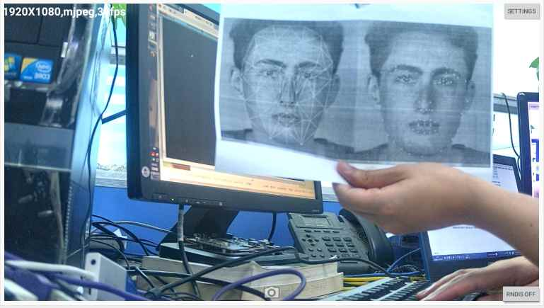

# RV1126/RV1109 Linux SDK 快速入门

文档标识：RK-JC-YF-360

发布版本：V1.9.6

日期：2020-12-31

文件密级：□绝密   □秘密   □内部资料   ■公开

**免责声明**

本文档按“现状”提供，瑞芯微电子股份有限公司（“本公司”，下同）不对本文档的任何陈述、信息和内容的准确性、可靠性、完整性、适销性、特定目的性和非侵权性提供任何明示或暗示的声明或保证。本文档仅作为使用指导的参考。

由于产品版本升级或其他原因，本文档将可能在未经任何通知的情况下，不定期进行更新或修改。

**商标声明**

“Rockchip”、“瑞芯微”、“瑞芯”均为本公司的注册商标，归本公司所有。

本文档可能提及的其他所有注册商标或商标，由其各自拥有者所有。

**版权所有 © 2020 瑞芯微电子股份有限公司**

超越合理使用范畴，非经本公司书面许可，任何单位和个人不得擅自摘抄、复制本文档内容的部分或全部，并不得以任何形式传播。

瑞芯微电子股份有限公司

Rockchip Electronics Co., Ltd.

地址：     福建省福州市铜盘路软件园A区18号

网址：     [www.rock-chips.com](http://www.rock-chips.com)

客户服务电话： +86-4007-700-590

客户服务传真： +86-591-83951833

客户服务邮箱： [fae@rock-chips.com](mailto:fae@rock-chips.com)

---

**前言**

**概述**

本文主要描述了RV1126/RV1109 Linux SDK的基本使用方法，旨在帮助开发者快速了解并使用RV1126/RV1109 SDK开发包。

**产品版本**

| **芯片名称** | **内核版本** |
| ------------ | ------------ |
| RV1126/RV1109   | Linux 4.19 |

**读者对象**

本文档（本指南）主要适用于以下工程师：

- 技术支持工程师
- 软件开发工程师

**修订记录**

| **版本号** | **作者** | **修改日期** | **修改说明** |
| ---------- | --------| :--------- | ------------ |
| V0.0.1 | CWW | 2020-04-28 | 初始版本     |
| V0.0.2 | CWW | 2020-05-09 | 更新5.1.2节RK IPCamera Tool界面 |
| V0.0.3 | CWW | 2020-05-20 | 编译环境添加libssl-dev和expect |
| V1.0.0 | CWW | 2020-05-25 | 1. 更新第3节以及第4.4和4.5节<br>2. 增加快速开机版本编译<br>3. 增加5.4节 |
| V1.1.0 | CWW | 2020-06-08 | 1. 更新公司名称<br>2. 更新文档排版<br>3. 更新第2节|
| V1.2.0 | HJC | 2020-06-22 | 增加智能USB Camera产品章节 |
| V1.2.1 | CWW | 2020-06-29 | 1. 更新4.4章节<br>2. 增加编译环境安装fakeroot工具 |
| V1.3.0 | CWW | 2020-07-09 | 1. 增加模块目录以及文档说明<br>2. 增加编译不同板级配置 |
| V1.3.1 | CWW | 2020-07-15 | 1. 修正eMMC拼写 |
| V1.4.0 | CWW | 2020-07-16 | 1. 增加ISP工具RKISP2.x_Tuner说明<br>2. 增加开发工具说明<br>3. 增加板级配置选择说明 |
| V1.4.1 | CWW | 2020-07-17 | 1. 更新SDK编译说明章节 |
| V1.5.0 | CWW | 2020-08-07 | 1. 更新SDK板级配置和编译说明章节<br>2. 开发环境增加安装cmake |
| V1.6.0 | LJH | 2020-08-22 | 1. 增加闸机和门禁类产品章节<br>2. 更新SDK编译说明 |
| V1.6.1 | CWW | 2020-09-07 | 1. 增加新开发板RV1126_RV1109_IPC38_DEMO_V1.11_2020724LX |
| V1.7.0 | CWW | 2020-09-16 | 1. 增加WiFi和升级相关文档说明<br>2. 增加编译配置说明<br>3. 更新开发环境软件依赖flex和bison<br>4. 增加获取SDK版本号<br>5. “SDK编译说明”章节增加介绍两种编译SDK的方法 |
| V1.8.0 | CWW | 2020-09-25 | 1. 编译环境添加liblz4-tool，libtool和keychain<br>2. 更新文档<br>3. 添加网络ADB调试方法 |
| V1.8.1 | CWW | 2020-10-29 | 更新视频培训地址|
| V1.8.2 | LJH | 2020-11-02 | 更新闸机和门禁类产品章节 |
| V1.9.0 | CWW | 2020-11-14 | 1. 更新spi nand/slc nand 板级配置和文档<br>2. 更新windows和Linux烧录工具版本要求 |
| V1.9.1 | CWW | 2020-11-22 | 增加spi nor板级配置 |
| V1.9.2 | CWW | 2020-12-02 | 1. 增加AB系统板级配置参考<br>2. 增加U-Boot使用tftp使用说明 |
| V1.9.3 | CWW | 2020-12-04 | 1. 增加GPIO使用注意事项<br>2. 增加开启人脸识别功能说明 |
| V1.9.4 | CWW | 2020-12-17 | 1. 增加38板SPI NAND AB系统板级参考<br>2. 增加SPI NOR烧录Firmware.img说明 |
| V1.9.5 | CWW | 2020-12-29 | 1. 优化排版<br>2. 删除一些不用的工程 |
| V1.9.6 | CWW | 2020-12-31 | 1. 增加uboot使用tftp更新loader分区 |

---

**目录**

[TOC]

---

## 开发环境搭建

Ubuntu 16.04系统：
编译环境搭建所依赖的软件包以及安装命令如下：

```shell
sudo apt-get install repo device-tree-compiler git-core u-boot-tools mtools \
parted libudev-dev libusb-1.0-0-dev python-linaro-image-tools linaro-image-tools \
autoconf autotools-dev libsigsegv2 m4 intltool libdrm-dev curl sed make binutils \
build-essential gcc g++ bash patch gzip gawk bzip2 perl tar cpio python unzip rsync \
file bc wget libncurses5 libqt4-dev libglib2.0-dev libgtk2.0-dev libglade2-dev cvs git \
mercurial openssh-client subversion asciidoc w3m dblatex graphviz python-matplotlib \
libc6:i386 libssl-dev expect fakeroot cmake flex bison liblz4-tool libtool keychain
```

Ubuntu 17.04系统：
除了上述软件包外还需如下依赖包：

```shell
sudo apt-get install lib32gcc-7-dev  g++-7  libstdc++-7-dev
```

## SDK 配置框架说明

### SDK 目录说明

进入工程目录下有buildroot、app、kernel、u-boot、device、docs、external等目录。每个目录或其子目录会对应一个git工程，提交需要在各自的目录下进行。

- buildroot：定制根文件系统。
- app：存放上层应用程序。
- external：相关库，包括音频、视频等。
- kernel：kernel代码。
- device/rockchip：存放每个平台的一些编译和打包固件的脚本和预备文件。
- docs：存放开发指导文件、平台支持列表、工具使用文档、Linux 开发指南等。
- prebuilts：存放交叉编译工具链。
- rkbin：存放固件和工具。
- rockdev：存放编译输出固件。
- tools：存放一些常用工具。
- u-boot：U-Boot代码。

### RV1109/RV1126 模块代码目录说明

| 部分模块代码目录路径         | 模块功能描述                       |
| ---------------------------- | ---------------------------------- |
| external/recovery            | recovery                           |
| external/rkwifibt            | Wi-Fi和BT                          |
| external/rk_pcba_test        | PCBA测试代码                       |
| external/isp2-ipc            | 图像信号处理服务端                 |
| external/mpp                 | 编解码代码                         |
| external/rkmedia             | Rockchip 多媒体封装接口            |
| external/rkupdate            | Rockchip升级代码                   |
| external/camera_engine_rkaiq | 图像处理算法模块                   |
| external/rknpu               | NPU驱动                            |
| external/rockface            | 人脸识别代码                       |
| external/CallFunIpc          | 应用进程间通信代码                 |
| external/common_algorithm    | 音视频通用算法库                   |
| external/rknn-toolkit        | 模型转换、推理和性能评估的开发套件 |
| app/libIPCProtocol           | 基于dbus，提供进程间通信的函数接口 |
| app/mediaserver              | 提供多媒体服务的主应用             |
| app/ipc-daemon               | 系统守护服务                       |
| app/dbserver                 | 数据库服务                         |
| app/netserver                | 网络服务                           |
| app/storage_manager          | 存储管理服务                       |
| app/ipcweb-backend           | web后端                            |
| app/librkdb                  | 数据库接口                         |
| app/ipcweb-ng                | web前端，采用Angular 8框架         |

### RV1109/RV1126 开发相关文档

#### 目录docs和external的文档索引

```shell
├── docs
│   │
│   ├── Kernel (内核驱动相关文档，RV1126/RV1109平台可以参考)
│   │
│   ├── Linux (Rockchip Linux系统通用文档，RV1126/RV1109平台可以参考)
│   │   │
│   │   ├── Multimedia
│   │   │   ├── camera (camera相关文档，RV1126/RV1109平台可以参考)
│   │   │   ├── Rockchip_Developer_Guide_MPP_CN.pdf (编解码接口开发指南, 适用于RV1126/RV1109平台)
│   │   │   └── Rockchip_Developer_Guide_MPP_EN.pdf
│   │   │
│   │   ├── Recovery (升级相关文档, 适用于RV1126/RV1109平台)
│   │   │   ├── Rockchip_Developer_Guide_Linux_Recovery_CN.pdf
│   │   │   ├── Rockchip_Developer_Guide_Linux_Recovery_EN.pdf
│   │   │   ├── Rockchip_Developer_Guide_Linux_Upgrade_CN.pdf
│   │   │   └── Rockchip_Developer_Guide_Linux_Upgrade_EN.pdf
│   │   │
│   │   ├── Security (加密相关文档, 适用于RV1126/RV1109平台)
│   │   │   └── Rockchip_Developer_Guide_TEE_Secure_SDK_CN.pdf
│   │   │
│   │   └── Wifibt (WiFi和蓝牙相关文档, 适用于RV1126/RV1109平台)
│   │       ├── AP模组RF测试文档
│   │       │   ├── BT RF Test Commands for Linux-v05.pdf
│   │       │   └── Wi-Fi RF Test Commands for Linux-v03.pdf
│   │       ├── REALTEK模组RF测试文档
│   │       │   ├── 00014010-WS-170731-RTL8723D_COB_MP_FLOW_R04.pdf
│   │       │   ├── MP tool user guide for linux20180319.pdf
│   │       │   └── Quick_Start_Guide_V6.txt
│   │       ├── RK平台_RTL8723DS_AIRKISS配网说明.pdf
│   │       ├── Rockchip_Developer_Guide_DeviceIo_Bluetooth_CN.pdf
│   │       ├── Rockchip_Developer_Guide_Linux_WIFI_BT_CN.pdf
│   │       ├── Rockchip_Developer_Guide_Linux_WIFI_BT_EN.pdf
│   │       ├── Rockchip_Developer_Guide_Network_Config_CN.pdf
│   │       └── WIFI性能测试PC工具
│   │           └── iperf-2.0.5-2-win32.zip
│   │
│   └── RV1126_RV1109
│       ├── ApplicationNote (Rockchip应用开发框架介绍、网页端开发指南)
│       │   ├── Rockchip_Developer_Guide_Linux_Application_Framework_CN.pdf
│       │   ├── Rockchip_Developer_Guide_Linux_Application_Framework_EN.pdf
│       │   ├── Rockchip_Instructions_Linux_CGI_API_CN.pdf
│       │   ├── Rockchip_Instructions_Linux_MediaServer_CN.pdf
│       │   ├── Rockchip_Instructions_Linux_MediaServer_EN.pdf
│       │   ├── Rockchip_Instructions_Linux_Web_Configuration_CN.pdf
│       │   └── Rockchip_Instructions_Linux_Web_Configuration_EN.pdf
│       │
│       ├── Camera (ISP开发指南)
│       │   ├── Camera_External_FAQ_v1.0.pdf
│       │   ├── Rockchip_Color_Optimization_Guide_ISP2x_V1.1.0.pdf
│       │   ├── Rockchip_Development_Guide_ISP2x_CN_v1.2.0.pdf
│       │   ├── Rockchip_Driver_Guide_ISP2x_CN_v0.1.0.pdf
│       │   ├── Rockchip_Instruction_Linux_Appliction_ISP20_CN.pdf
│       │   ├── Rockchip_IQ_Tools_Guide_ISP2x_CN_v1.0.0.pdf
│       │   ├── Rockchip_RV1109_RV1126_Developer_Guide_Linux_Ispserver_CN.pdf
│       │   └── Rockchip_Tuning_Guide_ISP2x_CN_v1.0.0.pdf
│       │
│       ├── Multimedia
│       │   ├── Rockchip_Developer_Guide_Linux_RKMedia_CN.pdf
│       │   └── Rockchip_Instructions_Linux_Rkmedia_CN.pdf (多媒体接口开发指南)
│       │
│       ├── Rockchip_RV1126_RV1109_EVB_User_Guide_V1.0_CN.pdf (硬件开发指南)
│       ├── Rockchip_RV1126_RV1109_EVB_User_Guide_V1.0_EN.pdf
│       ├── Rockchip_RV1126_RV1109_Instruction_Linux_Separate_Building_EN.pdf (独立编译U-Boot/Kernel/Rootfs说明文档)
│       ├── Rockchip_RV1126_RV1109_Linux_SDK_V1.1.1_20200711_CN.pdf (SDK发布说明)
│       ├── Rockchip_RV1126_RV1109_Linux_SDK_V1.1.1_20200711_EN.pdf
│       ├── Rockchip_RV1126_RV1109_Quick_Start_Linux_CN.pdf (快速开发指南)
│       ├── Rockchip_RV1126_RV1109_Quick_Start_Linux_EN.pdf
│       ├── RV1109 Multimedia Codec Benchmark v1.2.pdf
│       ├── RV1126 Multimedia Codec Benchmark v1.1.pdf
│       └── RV1126_RV1109_Release_Note.txt
│
└── external
    ├── rknn-toolkit (模型转换、推理和性能评估的开发套件文档)
    │   └── doc
    │       ├── Rockchip_Developer_Guide_RKNN_Toolkit_Custom_OP_V1.3.2_CN.pdf
    │       ├── Rockchip_Developer_Guide_RKNN_Toolkit_Custom_OP_V1.3.2_EN.pdf
    │       ├── Rockchip_Quick_Start_RKNN_Toolkit_V1.3.2_CN.pdf
    │       ├── Rockchip_Quick_Start_RKNN_Toolkit_V1.3.2_EN.pdf
    │       ├── Rockchip_Trouble_Shooting_RKNN_Toolkit_V1.3.2_CN.pdf
    │       ├── Rockchip_Trouble_Shooting_RKNN_Toolkit_V1.3.2_EN.pdf
    │       ├── Rockchip_User_Guide_RKNN_Toolkit_V1.3.2_CN.pdf
    │       ├── Rockchip_User_Guide_RKNN_Toolkit_V1.3.2_EN.pdf
    │       ├── Rockchip_User_Guide_RKNN_Toolkit_Visualization_V1.3.2_CN.pdf
    │       └── Rockchip_User_Guide_RKNN_Toolkit_Visualization_V1.3.2_EN.pdf
    └── rknpu
        └── rknn (Rockchip NPU 开发文档)
            └── doc
                ├── Rockchip_User_Guide_RKNN_API_V1.3.3_CN.pdf
                └── Rockchip_User_Guide_RKNN_API_V1.3.3_EN.pdf
```

#### ISP Tuner工具以及文档路径

文档路径： `external/camera_engine_rkaiq/rkisp2x_tuner/doc/Rockchip_IQ_Tools_Guide_ISP2x_v1.3.pdf`
工具路径： `external/camera_engine_rkaiq/rkisp2x_tuner/RKISP2.x_Tuner_v0.2.1_AIQ1.2.1.exe`

ISP相关文档以及支持的sensor列表也可以在Redmine上获取`https://redmine.rock-chips.com/documents/53`

#### SPI NAND/SLC NAND文档路径

文档路径： `docs/Linux/ApplicationNote/Rockchip_Developer_Guide_Linux_Nand_Flash_Open_Source_Solution_CN.pdf`

#### 部分模块的培训视频地址

- 多媒体RKMedia介绍

```
链接：https://pan.baidu.com/s/1Z4o2v2KL6eCKXgI2fMEcSA
提取码：vhk2
```

- RK NPU开发套件介绍及Q&A

```
链接：https://pan.baidu.com/s/10w7R_q857uVEXq-88Pu-1g
提取码：c66l
```

- RV1126&RV1109摄像头驱动调试介绍

```
链接：https://pan.baidu.com/s/1rva6ZDj1x-T1rNcxV354KA
提取码：z4uh
```

- RV1126&RV1109 Linux SDK 快速开发指南

```
链接：https://pan.baidu.com/s/1iXwOdXH0jIR3iGQc0gluow
提取码：t9o0
```

- RK ISP2 标定流程介绍

```
链接：https://pan.baidu.com/s/1tZloen4B4jIIl2w1R2hWfg
提取码：nrp3
```

- RK ISP2 基础模块的标定方法及工具使用

```
链接：https://pan.baidu.com/s/1L0zSxInjqTyqDBesg4RL1w
提取码：8yc6
```

### RV1109/RV1126 开发相关工具

#### Windows工具

工具说明文档：tools/windows/ToolsRelease.txt

工具名称              | 工具用途
----------------------|-------------------------------------------
RKDevTool             | 分立升级固件及整个update升级固件工具
FactoryTool           | 量产升级工具
SecureBootTool        | 固件签名工具
efuseTool             | efuse烧写工具
RKDevInfoWriteTool    | 写号工具
SDDiskTool            | SD卡镜像制作
SpiImageTools         | eMMC烧录器固件制作工具（文档在FactoryTool工具里）
DriverAssitant        | 驱动安装工具
RKImageMaker          | 打包工具(打包成updata.img)
SpeakerPCBATool       | 音箱PCBA测试工具
RKDevTool_Release     | 固件烧录工具
ParameterTool         | 分区表修改工具
RK_IPCamera_Tool      | IPC设备搜索工具

#### Linux工具

工具说明文档：tools/linux/ToolsRelease.txt

工具名称               | 工具用途
---------------------- | -------------------------------------------
Linux_Pack_Firmware    | 固件打包工具(打包成updata.img)
Linux_Upgrade_Tool     | 烧录固件工具
Linux_SecureBoot       | 固件签名工具
Firmware_Merger        | SPI NOR固件打包工具(生成的固件可以用于烧录器)

### SDK 配置框架图


## SDK编译说明

SDK的编译有2种方法：

- 一种是依赖整个SDK环境编译（本章节介绍的方法）
- 另一种是把U-Boot、Linux Kernel、Rootfs以及应用库独立出SDK来编译（具体方法参考文档：**docs/RV1126_RV1109/Rockchip_RV1126_RV1109_Instruction_Linux_Separate_Building_EN.pdf**）

### 选择不同板级配置

#### SDK下载地址

```shell
repo init --repo-url ssh://git@www.rockchip.com.cn/repo/rk/tools/repo \
    -u ssh://git@www.rockchip.com.cn/linux/rk/platform/manifests \
    -b linux -m rv1126_rv1109_linux_release.xml

.repo/repo/repo sync -c -j4
```

#### SDK软件同步命令以及log

##### SDK软件同步

```shell
.repo/repo/repo sync -c -j4
repo: warning: Python 2 is no longer supported; Please upgrade to Python 3.6+.
repo: warning: Python 2 is no longer supported; Please upgrade to Python 3.6+.
Fetching projects: 100% (71/71), done.
info: A new version of repo is available

warning: project 'repo' branch 'stable' is not signed
warning: Skipped upgrade to unverified version
Checking out projects: 100% (71/71), done.
repo sync has finished successfully.
```

##### 查看SDK版本

在SDK根目录执行命令：

```shell
realpath .repo/manifests/rv1126_rv1109_linux_release.xml

# 例如：打印的版本号为v1.3.1
#       更新时间为2020-09-21
# /home/rv1109-SDK/.repo/manifests/rv1126_rv1109_linux/rv1126_rv1109_linux_v1.3.1_20200921.xml
```

##### 为每个工程创建default分支

```shell
.repo/repo/repo start default --all
repo: warning: Python 2 is no longer supported; Please upgrade to Python 3.6+.
repo: warning: Python 2 is no longer supported; Please upgrade to Python 3.6+.
Starting default: 100% (71/71), done.
```

#### SDK板级配置目录device/rockchip/rv1126_rv1109

| 板级配置                      | 适用产品说明                 | 存储介质 | EVB板                                               |
| ----------------------------- | --------------------------   | -------- | --------------------------------------------------- |
| BoardConfig-38x38-spi-nand.mk | 通用IPC（产品是分立电源方案）| SPI NAND | RV1126_RV1109_38X38_SPI_DDR3P216DD6_V10_20200511LXF |
| BoardConfig-38x38-spi-nand.mk | 通用IPC（产品是分立电源方案）| SPI NAND | RV1126_RV1109_IPC38_DEMO_V1.11_2020724LX            |
| BoardConfig-38x38-spi-nand-ab.mk | 通用IPC（产品是分立电源方案），启动方式是AB系统| SPI NAND | RV1126_RV1109_IPC38_DEMO_V1.11_2020724LX |
| BoardConfig-robot.mk          | 扫地机类IPC                  | eMMC     | RV1126_RV1109_EVB_DDR3P216SD6_V13_20200630LXF       |
| BoardConfig-tb-v12.mk         | 门锁、门铃、猫眼等带电池产品 | eMMC     | RV1126_RV1109_EVB_DDR3P216SD6_V12_20200515KYY       |
| BoardConfig-tb-v13.mk         | 门锁、门铃、猫眼等带电池产品 | eMMC     | RV1126_RV1109_EVB_DDR3P216SD6_V13_20200630LXF       |
| BoardConfig-spi-nand.mk       | 通用IPC                      | SPI NAND | RV1126_RV1109_EVB_DDR3P216SD6_V12_20200515KYY       |
| BoardConfig.mk                | 通用IPC                      | eMMC     | RV1126_RV1109_EVB_DDR3P216SD6_V13_20200630LXF       |
| BoardConfig-ab-v13.mk         | 通用IPC，启动方式是AB系统    | eMMC     | RV1126_RV1109_EVB_DDR3P216SD6_V13_20200630LXF       |
| BoardConfig-v12.mk            | 通用IPC                      | eMMC     | RV1126_RV1109_EVB_DDR3P216SD6_V12_20200515KYY       |
| BoardConfig-slc-nand-v12.mk   | 通用IPC                      | SLC NAND | RV1126_RV1109_EVB_DDR3P216SD6_V12_20200515KYY       |
| BoardConfig-v10-v11.mk        | 通用IPC                      | eMMC     | RV1126_RV1109_EVB_DDR3P216SD6_V11_20200312LXF       |
| BoardConfig-spi-nor-v12.mk    | 精简系统，只有基本码流预览   | SPI NOR  | RV1126_RV1109_EVB_DDR3P216SD6_V12_20200515KYY       |
| BoardConfig-facial_gate.mk    | 门禁和闸机类产品             | eMMC     | RV1126_RV1109_EVB_DDR3P216SD6_V13_20200630LXF       |
| ++++++++++++++++++++++++++    | ++++++++++++++++++++++++++++ | +++++    | ++++++++++++++++++++++++++++++++++++++++++++        |

#### 切换板级配置命令

方法1
`./build.sh` 后面加上板级配置文件, 例如：

选择**通用IPC类产品**的板级配置

```shell
./build.sh device/rockchip/rv1126_rv1109/BoardConfig.mk
```

选择**门锁、门铃、猫眼等带电池产品**的板级配置, 对应EVB板RV1126_RV1109_EVB_DDR3P216SD6_V13_20200630LXF

```shell
./build.sh device/rockchip/rv1126_rv1109/BoardConfig-tb-v13.mk
```

选择**门禁和闸机类产品**, 对应EVB板RV1126_RV1109_EVB_DDR3P216SD6_V13_20200630LXF

```shell
./build.sh device/rockchip/rv1126_rv1109/BoardConfig-facial_gate.mk
```

方法2

```shell
./build.sh lunch
processing board option: lunch
processing option: lunch

You're building on Linux
Lunch menu...pick a combo:

0. default BoardConfig.mk
1. BoardConfig-38x38-spi-nand.mk
2. BoardConfig-ab-v13.mk
3. BoardConfig-battery-ipc.mk
4. BoardConfig-facial_gate.mk
5. BoardConfig-robot.mk
6. BoardConfig-sl.mk
7. BoardConfig-slc-nand-v12.mk
8. BoardConfig-spi-nand.mk
9. BoardConfig-spi-nor-tb-v13.mk
10. BoardConfig-spi-nor-v12.mk
11. BoardConfig-tb-v12.mk
12. BoardConfig-tb-v13.mk
13. BoardConfig-v10-v11.mk
14. BoardConfig-v12.mk
15. BoardConfig.mk
Which would you like? [0]:
switching to board: /home/rv1109/device/rockchip/rv1126_rv1109/BoardConfig.mk
```

### 查看编译命令

在根目录执行命令：./build.sh -h|help

```shell
./build.sh help
Usage: build.sh [OPTIONS]
Available options:
BoardConfig*.mk    -switch to specified board config
lunch              -list current SDK boards and switch to specified board config
uboot              -build uboot
spl                -build spl
loader             -build loader
kernel             -build kernel
modules            -build kernel modules
toolchain          -build toolchain
rootfs             -build default rootfs, currently build buildroot as default
buildroot          -build buildroot rootfs
ramboot            -build ramboot image
multi-npu_boot     -build boot image for multi-npu board
yocto              -build yocto rootfs
debian             -build debian9 stretch rootfs
distro             -build debian10 buster rootfs
pcba               -build pcba
recovery           -build recovery
all                -build uboot, kernel, rootfs, recovery image
cleanall           -clean uboot, kernel, rootfs, recovery
firmware           -pack all the image we need to boot up system
updateimg          -pack update image
otapackage         -pack ab update otapackage image
save               -save images, patches, commands used to debug
allsave            -build all & firmware & updateimg & save

Default option is 'allsave'.
```

查看部分模块详细编译命令，例如：./build.sh -h kernel

```shell
./build.sh -h kernel
###Current SDK Default [ kernel ] Build Command###
cd kernel
make ARCH=arm rv1126_defconfig
make ARCH=arm rv1126-evb-ddr3-v10.img -j12
```

[^注]: 详细的编译命令以实际对应的SDK版本为准，主要是配置可能会有差异。build.sh编译命令是固定的。

### U-Boot编译

```shell
### 查看U-Boot详细编译命令
./build.sh -h uboot

### U-Boot编译命令
./build.sh uboot
```

#### U-Boot配置说明

```shell
### 使用menuconfig配置U-Boot，选择需要的模块，最后保存退出。
### rv1126_defconfig 文件在目录 u-boot/configs
### 命令格式：make "RK_UBOOT_DEFCONFIG"_defconfig
### RK_UBOOT_DEFCONFIG 定义在./build.sh选择的BoardConfig*.mk
cd u-boot
make rv1126_defconfig
make menuconfig

### 保存配置到对应的文件rv1126_defconfig
make savedefconfig
cp defconfig configs/rv1126_defconfig
```

### Kernel编译

```shell
### 查看Kernel详细编译命令
./build.sh -h kernel

### Kernel编译命令
./build.sh kernel
```

#### Kernel配置说明

```shell
### 例如 device/rockchip/rv1126_rv1109/BoardConfig.mk
./build.sh device/rockchip/rv1126_rv1109/BoardConfig.mk
cd kernel

### 命令格式：make ARCH=arm "RK_KERNEL_DEFCONFIG" "RK_KERNEL_DEFCONFIG_FRAGMENT"
### RK_KERNEL_DEFCONFIG 和RK_KERNEL_DEFCONFIG_FRAGMENT 都定义在./build.sh选择的BoardConfig*.mk
### RK_KERNEL_DEFCONFIG_FRAGMENT 是可选项，具体看BoardConfig*.mk配置。
make ARCH=arm rv1126_defconfig
make ARCH=arm menuconfig

make ARCH=arm savedefconfig
cp defconfig arch/arm/configs/rv1126_defconfig
```

### Recovery编译

```shell
### 查看Recovery详细编译命令
./build.sh -h recovery

### Recovery编译命令
./build.sh recovery
```

#### Recovery配置说明

```shell
### 1. 获取对应板级文件的recovery配置
./build.sh -h recovery
#   ###Current SDK Default [ recovery ] Build Command###
#   source envsetup.sh rockchip_rv1126_rv1109_recovery
#   device/rockchip/common/mk-ramdisk.sh recovery.img rockchip_rv1126_rv1109_recovery

### 2. source 对应的recovery配置
source envsetup.sh rockchip_rv1126_rv1109_recovery

### 3. 使用menuconfig配置recovery，选择需要的模块，最后保存退出。
### 比如：去掉recovery的UI显示 BR2_PACKAGE_RECOVERY_NO_UI (查看 buildroot/package/rockchip/recovery/Config.in)
make menuconfig  # 进入menuconfig后，按“/"进入查找模式，输入BR2_PACKAGE_RECOVERY_NO_UI

### 4. 保存到选择的recovery配置文件
###    ./buildroot/configs/rockchip_rv1126_rv1109_recovery_defconfig
make savedefconfig
```

注：Recovery是非必需的功能，有些板级配置不会设置

### Rootfs编译

```shell
### 查看Rootfs详细编译命令
./build.sh -h rootfs

### Rootfs编译命令
./build.sh rootfs
```

#### 目录app和external里的工程编译方法以及Rootfs配置说明

```shell
### 1. 先SDK根目录查看Board Config对应的rootfs是哪个配置
./build.sh -h rootfs
#   ###Current SDK Default [ rootfs ] Build Command###
#   source envsetup.sh rockchip_rv1126_rv1109
#   make

### 2. source buildroot对应的defconfig
source envsetup.sh rockchip_rv1126_rv1109

### 3. 使用menuconfig配置文件系统，选择需要的模块，最后保存退出。
### 例如：ipc-daemon的配置是BR2_PACKAGE_IPC_DAEMON (查看buildroot/package/rockchip/ipc-daemon/Config.in)
make menuconfig  # 进入menuconfig后，按“/"进入查找模式，输入BR2_PACKAGE_IPC_DAEMON

### 4. 保存到rootfs配置文件
###    ./buildroot/configs/rockchip_rv1126_rv1109_defconfig
make savedefconfig

### 5. 查看对应模块的makefile文件名
### 例如：buildroot/package/rockchip/ipc-daemon/ipc-daemon.mk
make ipc-daemon-dirclean
make ipc-daemon-rebuild
```

注：SDK根目录app和external下的工程都是buildroot的package包，编译方法相同。

### 固件打包

固件打包命令：`./mkfirmware.sh`

固件目录：rockdev

### 全自动编译

进入工程根目录执行以下命令自动完成所有的编译：

```shell
./build.sh all # 只编译模块代码（u-Boot，kernel，Rootfs，Recovery）
               # 需要再执行./mkfirmware.sh 进行固件打包

./build.sh     # 在./build.sh all基础上
               # 1. 增加固件打包 ./mkfirmware.sh
               # 2. update.img打包
               # 3. 复制rockdev目录下的固件到IMAGE/***_RELEASE_TEST/IMAGES目录
               # 4. 保存各个模块的补丁到IMAGE/***_RELEASE_TEST/PATCHES目录
               # 注：./build.sh 和 ./build.sh allsave 命令一样
```

## 刷机说明

### EVB板正面示意图


### EVB板背面示意图


### EVB Sensor板背面示意图


**扫描Sensor板背面的二维码，可以获取到EVB板编译好的固件。**


### 硬件接口功能表


### Windows 刷机说明

SDK 提供 Windows 烧写工具(工具版本需要 V2.78 或以上)，工具位于工程根目录：

```shell
tools/
├── windows/RKDevTool
```

如下图，编译生成相应的固件后，设备烧写需要进入 MASKROM 或 BootROM 烧写模式，
连接好 USB 下载线后，按住按键“Update”不放并按下复位键“RESET”后松手，就能进入
MASKROM 模式，加载编译生成固件的相应路径后，点击“执行”进行烧写，也可以按 “recovery" 按键不放并按下复位键 “RESET” 后松手进入 loader 模式进行烧写，下面是 MASKROM 模式的分区偏移及烧写文件。(注意： Windows PC 需要在管理员权限运行工具才可执行)


烧录update.img方法：


SPI NOR的Firmware.img烧录方法：


注：

1. 除了MiniLoaderAll.bin和parameter.txt，实际需要烧录的分区根据rockdev/parameter.txt配置为准。

2. 烧写前，需安装最新 USB 驱动，驱动详见：

```shell
<SDK>/tools/windows/DriverAssitant_v4.91.zip
```

### Linux 刷机说明

Linux 下的烧写工具位于 tools/linux 目录下(Linux_Upgrade_Tool 工具版本需要 V1.57 或以上)，请确认你的板子连接到 MASKROM/loader rockusb。比如编译生成的固件在 rockdev 目录下，升级命令如下：

```shell
### 除了MiniLoaderAll.bin和parameter.txt，实际需要烧录的分区根据rockdev/parameter.txt配置为准。
sudo ./upgrade_tool ul rockdev/MiniLoaderAll.bin
sudo ./upgrade_tool di -p rockdev/parameter.txt
sudo ./upgrade_tool di -u rockdev/uboot.img
sudo ./upgrade_tool di -misc rockdev/misc.img
sudo ./upgrade_tool di -b rockdev/boot.img
sudo ./upgrade_tool di -recovery rockdev/recovery.img
sudo ./upgrade_tool di -oem rockdev/oem.img
sudo ./upgrade_tool di -rootfs rocdev/rootfs.img
sudo ./upgrade_tool di -userdata rockdev/userdata.img
sudo ./upgrade_tool rd
```

或升级整个 firmware 的 update.img 固件：

```shell
sudo ./upgrade_tool uf rockdev/update.img
```

SPI NOR升级整个 firmware 的 Firmware.img 固件：

```shell
sudo ./upgrade_tool db rockdev/MiniLoaderAll.bin
sudo ./upgrade_tool wl 0x0 rockdev/Firmware.img
sudo ./upgrade_tool rd
```

或在根目录，机器在 MASKROM 状态运行如下升级：

```shell
./rkflash.sh
```

## EVB板功能说明以及注意事项

### GPIO电源设计注意事项


### 如何访问3路RTSP和1路RTMP网络码流

EVB板支持如下功能：

- 支持3路RTSP和1路RTMP网络码流
- 支持本地屏幕1280x720显示
- 支持保存主码流到设备
- 支持网页端访问设备
- 支持人脸识别

使用网线接到EVB板的网口，上电开机。默认会自动获取IP地址。

#### 使用串口或ADB连上EVB板子获取设备IP地址

```shell
ifconfig eth0
eth0      Link encap:Ethernet  HWaddr 02:E0:F9:16:7E:E9
          inet addr:172.16.21.218  Bcast:172.16.21.255  Mask:255.255.255.0
          UP BROADCAST RUNNING MULTICAST  MTU:1500  Metric:1
          RX packets:199225 errors:0 dropped:2231 overruns:0 frame:0
          TX packets:372371 errors:0 dropped:0 overruns:0 carrier:0
          collisions:0 txqueuelen:1000
          RX bytes:20874811 (19.9 MiB)  TX bytes:522220899 (498.0 MiB)
          Interrupt:56
```

使用串口连接EVB板子的PC端配置如下：

```shell
波特率：1500000
数据位：8
停止位：1
奇偶校验：none
流控：none
```

#### 使用RK IPCamera Tool获取设备IP地址

安装SDK目录tools/windows/RK_IPCamera_Tool-V1.1.zip工具。打开工具，通过EVB板网口连接到电脑所在局域网，查看RK IPCamera Tool工具设备总数列表获取设备IP地址。


**说明：**

1. 点击“开启搜索”，进行设备搜索
2. 选择一个设备
3. 取消自动获取IP，改为静态IP
4. 设置静态IP
5. 设置IP
6. 打开预览

#### 访问网络码流

使用支持RTSP或RTMP的播放器访问，例如（VLC播放器）。

RTSP访问地址：

- rtsp://**设备IP地址**/live/mainstream

- rtsp://**设备IP地址**/live/substream

- rtsp://**设备IP地址**/live/thirdstream

RTMP访问地址：

- rtmp://**设备IP地址**:1935/live/substream

### 如何通过网页访问设备信息

打开Web浏览器（推荐Chrome浏览器）访问地址：

```shell
http://设备IP地址
```

网页端详细的操作说明请参考SDK目录docs下的文档Rockchip_Instructions_Linux_Web_Configuration_CN.pdf。

### 如何测试人脸识别功能

使用播放器访问RTSP主码流：rtsp://**设备IP地址**/live/mainstream

SDK的人脸识别功能默认没打开，需要通过网页“配置” --> “智能分析” 打开，授权的测试时间是30~60分钟，授权失效后主码流预览会有“人脸算法软件未授权”提示，需要重启才能再测试。

### 如何通过网络调试EVB板

#### 通过SSH登陆EVB板调试

接上以太网，通过第5.1.2节 [使用RK IPCamera Tool获取设备IP地址](#### 5.1.2 使用RK IPCamera Tool获取设备IP地址)获取EVB板IP地址。保证PC电脑可以ping通EVB板。

```shell
### 清除上次登陆信息（EVB板的IP地址192.168.1.159）
ssh-keygen -f "$HOME/.ssh/known_hosts" -R 192.168.1.159
### 使用SSH命令登陆
ssh root@192.168.1.159
### 输入默认密码：rockchip
```

#### 通过SCP调试

```shell
### 从PC端上传文件test-file到EVB板的目录/userdata
scp test-file root@192.168.1.159:/userdata/
root@192.168.1.159's password:
### 输入默认密码：rockchip

### 下载EVB板上的文件/userdata/test-file下载到PC端
scp root@192.168.1.159:/userdata/test-file test-file
root@192.168.1.159's password:
### 输入默认密码：rockchip
```

#### 通过网络ADB调试

```shell
### 获取EVB板的IP地址192.168.1.159
adb connect 192.168.1.159

adb devices
List of devices attached
192.168.1.159:5555      device

### adb登陆EVB板子调试
adb -s 192.168.1.159:5555 shell

### 从PC端上传文件test-file到EVB板的目录/userdata
adb -s 192.168.1.159:5555 push test-file /userdata/

### 下载EVB板上的文件/userdata/test-file下载到PC端
adb -s 192.168.1.159:5555 pull /userdata/test-file test-file
```

### SPI NAND/SLC NAND ubi文件系统镜像打包说明

#### 根文件系统打包说明

Nand Flash的文件系统使用的是ubifs，SDK默认的配置是Page Size 2KB，Block Size 128KB的Nand Flash。
通过修改buildroot对应的defconfig配置buildroot/configs/rockchip_rv1126_rv1109_spi_nand_defconfig
步骤如下：

```shell
source envsetup.sh rockchip_rv1126_rv1109_spi_nand
make menuconfig
# 然后配置BR2_TARGET_ROOTFS_UBI_PEBSIZE/BR2_TARGET_ROOTFS_UBI_SUBSIZE/BR2_TARGET_ROOTFS_UBIFS_LEBSIZE/BR2_TARGET_ROOTFS_UBIFS_MINIOSIZE/BR2_TARGET_ROOTFS_UBIFS_MAXLEBCNT
# 详细的配置说明可以参考SPI NAND/SLC NAND文档
make savedefconfig
```

默认文件系统是用ubifs，如果要改成squashfs，那在buildroot对buildroot/configs/rockchip_rv1126_rv1109_spi_nand_defconfig打上如下补丁

```diff
diff --git a/configs/rockchip_rv1126_rv1109_spi_nand_defconfig b/configs/rockchip_rv1126_rv1109_spi_nand_defconfig
index 5da9b25935..8af9226920 100644
--- a/configs/rockchip_rv1126_rv1109_spi_nand_defconfig
+++ b/configs/rockchip_rv1126_rv1109_spi_nand_defconfig
@@ -41,6 +41,8 @@ BR2_PACKAGE_RK_OEM=y
 BR2_PACKAGE_RK_OEM_RESOURCE_DIR="$(TOPDIR)/../device/rockchip/oem/oem_ipc"
 BR2_PACKAGE_RK_OEM_IMAGE_FILESYSTEM_TYPE="ubi"
 BR2_PACKAGE_RK_OEM_IMAGE_PARTITION_SIZE=0x6400000
+BR2_PACKAGE_ROOTFS_UBI_USE_CUSTOM_FILESYSTEM=y
+BR2_PACKAGE_ROOTFS_UBI_CUSTOM_FILESYSTEM="squashfs"
 BR2_PACKAGE_CAMERA_ENGINE_RKAIQ=y
 BR2_PACKAGE_CAMERA_ENGINE_RKAIQ_IQFILE="os04a10_CMK-OT1607-FV1_M12-40IRC-4MP-F16.xml"
 BR2_PACKAGE_IPC_DAEMON=y
@@ -79,4 +81,5 @@ BR2_PACKAGE_NGINX=y
 BR2_PACKAGE_NGINX_HTTP_SSL_MODULE=y
 BR2_PACKAGE_NGINX_DEBUG=y
 BR2_PACKAGE_NGINX_RTMP=y
+BR2_TARGET_ROOTFS_SQUASHFS4_XZ=y
 BR2_TARGET_ROOTFS_UBIFS_MAXLEBCNT=4096
```

#### oem和userdata分区的ubifs打包说明

SDK默认oem是在buildroot里打包成ubi镜像。
userdata分区默认不打包成镜像，系统启动后会自动格式化成ubifs。

如果在对应的BoardConfig.mk里配置RK_OEM_DIR（RK_OEM_BUILDIN_BUILDROOT不配置）或RK_USERDATA_DIR，那可以使用SDK根目录下`./mkfirmware.sh`进行打包。
RK_OEM_DIR是对应device/rockchip/oem/目录下自定义的目录。
RK_USERDATA_DIR则是对应device/rockchip/userdata/目录下自定义的目录。

### U-Boot终端下tftp使用说明

#### U-Boot配置以太网

默认U-Boot代码支持的以太网phy是EVB板RTL8211F。U-Boot初始化以太网时，会先读取内核dtb的gmac节点，如果没有获取到内核dtb，会使用U-Boot下的dtb初始化以太网phy。
所以如果板子上的phy不是RTL8211F，则需要同步修改U-Boot的dtb的gmac节点。

以下是参考例子：
注：U-Boot的dts节点里有引用的其它节点（如：gpio2/rmiim1_pins/gmac_clk_m1_pins）都需要接上"u-boot,dm-pre-reloc;"

```diff
diff --git a/arch/arm/dts/rv1126-pinctrl.dtsi b/arch/arm/dts/rv1126-pinctrl.dtsi
index 67f7c742b8..967598b4fb 100644
--- a/arch/arm/dts/rv1126-pinctrl.dtsi
+++ b/arch/arm/dts/rv1126-pinctrl.dtsi
@@ -1122,6 +1122,11 @@
                                /* clk_out_ethernet_m1 */
                                <2 RK_PC5 2 &pcfg_pull_none>;
                };
+               gmac_clk_m1_pins: gmac-clk-m1-pins {
+                       rockchip,pins =
+                               /* rgmii_clk_m1 */
+                               <2 RK_PB7 2 &pcfg_pull_none>;
+               };
        };
        sdmmc0 {
                sdmmc0_bus4: sdmmc0-bus4 {
diff --git a/arch/arm/dts/rv1126-u-boot.dtsi b/arch/arm/dts/rv1126-u-boot.dtsi
index 01547feff6..baf8509946 100644
--- a/arch/arm/dts/rv1126-u-boot.dtsi
+++ b/arch/arm/dts/rv1126-u-boot.dtsi
@@ -166,26 +166,37 @@
        status = "okay";
 };

+&gpio2 {
+       u-boot,dm-pre-reloc;
+       status = "okay";
+};
+
+&rmiim1_pins {
+       u-boot,dm-pre-reloc;
+       status = "okay";
+};
+
+&gmac_clk_m1_pins{
+       u-boot,dm-pre-reloc;
+       status = "okay";
+};
+
 &gmac {
        u-boot,dm-pre-reloc;

-       phy-mode = "rgmii";
-       clock_in_out = "input";
+       phy-mode = "rmii";
+       clock_in_out = "output";

-       snps,reset-gpio = <&gpio3 RK_PA0 GPIO_ACTIVE_LOW>;
+       snps,reset-gpio = <&gpio2 RK_PA5 GPIO_ACTIVE_LOW>;
        snps,reset-active-low;
-       /* Reset time is 20ms, 100ms for rtl8211f */
-       snps,reset-delays-us = <0 20000 100000>;
+       snps,reset-delays-us = <0 50000 50000>;

-       assigned-clocks = <&cru CLK_GMAC_SRC>, <&cru CLK_GMAC_TX_RX>, <&cru CLK_GMAC_ETHERNET_OUT>;
-       assigned-clock-parents = <&cru CLK_GMAC_SRC_M1>, <&cru RGMII_MODE_CLK>;
-       assigned-clock-rates = <125000000>, <0>, <25000000>;
+       assigned-clocks = <&cru CLK_GMAC_SRC>, <&cru CLK_GMAC_TX_RX>;
+       assigned-clock-rates = <50000000>;
+       assigned-clock-parents = <&cru CLK_GMAC_SRC_M1>, <&cru RMII_MODE_CLK>;

        pinctrl-names = "default";
-       pinctrl-0 = <&rgmiim1_pins &clk_out_ethernetm1_pins>;
-
-       tx_delay = <0x2a>;
-       rx_delay = <0x1a>;
+       pinctrl-0 = <&rmiim1_pins &gmac_clk_m1_pins>;

        phy-handle = <&phy>;
        status = "okay";
```

#### U-Boot的tftp下载说明

使用`sysmem_search`获取一块指定大小的内存地址，然后设置IP地址，最用使用tftp命令下载文件。

```shell
Hit key to stop autoboot('CTRL+C'):  0
=> <INTERRUPT>
=> <INTERRUPT>
=>
=> sysmem_search
sysmem_search - Search a available sysmem region

Usage:
sysmem_search <size in hex>
=> sysmem_search 0x6400000
Sysmem: Available region at address: 0x356f6cc0
=> setenv ipaddr 172.16.21.47
=> setenv serverip 172.16.21.199
=> tftp 0x356f6cc0 uboot.img
ethernet@ffc40000 Waiting for PHY auto negotiation to complete. done
Using ethernet@ffc40000 device
TFTP from server 172.16.21.199; our IP address is 172.16.21.47
Filename 'uboot.img'.
Load address: 0x356f6cc0
Loading: #################################################################
         #################################################################
         ######################
         139.6 KiB/s
done
Bytes transferred = 2228224 (220000 hex)
=>
```

##### eMMC通过tftp烧录loader的方法


##### SPI NAND通过tftp烧录loader的方法


注：SLC NAND暂时不支持使用tftp下载idblock.bin的方式升级。

## 智能USB Camera产品配置

智能USB Camera产品支持如下功能：

- 支持标准UVC Camera功能，最高支持4k预览（RV1126）
- 支持多种NN算法，包括人脸检测，人体姿态或骨骼检测，人脸关键点检测跟踪等，支持第三方算法扩展
- 支持USB复合设备稳定传输（RNDIS/UAC/ADB等）
- 支持NN前处理和数据后处理通路
- 支持智能电视或PC等多种终端设备预览
- 支持EPTZ功能

### 产品编译说明

智能USB Camera产品编译配置基于公版SDK，采用单独的rv1126_rv1109_linux_ai_camera_release.xml代码清单管理更新。

#### 选择对应板级配置

SDK下载地址：

```shell
repo init --repo-url ssh://git@www.rockchip.com.cn/repo/rk/tools/repo \
    -u ssh://git@www.rockchip.com.cn/linux/rk/platform/manifests \
    -b linux -m rv1126_rv1109_linux_ai_camera_release.xml
```

| 芯片   | 板级配置 (目录device/rockchip/rv1126_rv1109) | 存储介质 | EVB板                                                |
| ------ | -------------------------------------------- | -------- | --------------------------------------------------- |
| RV1126/RV1109 | BoardConfig-uvcc.mk                   | eMMC     | RV1126_RV1109_EVB_DDR3P216SD6_V13_20200630LXF       |

切换板级配置命令：

```shell
### 选择智能USB Camera版本的板级配置
./build.sh device/rockchip/rv1126_rv1109/BoardConfig-uvcc.mk
```

#### 编译命令

智能USB Camera产品的编译命令同SDK，参考**第三节SDK编译说明**即可。

### 产品软件框架

总体结构如下：


其中,RV1109/RV1126端应用与源码程序对应关系如下：

> **1.main app 对应<SDK>/app/smart_display_service：负责RNDIS 服务端功能实现，命令处理，NN数据转发等操作；**
>
> **2.AI app 对应<SDK>/app/mediaserver：负责将一路camera数据送到NPU做对应NN算法处理，通过共享内存机制传递给main app；**
>
> **3.uvc app 对应<SDK>/external/uvc_app:：负责UVC camera完整功能的实现和控制。**

#### uvc_app

请参考：

```shell
<SDK>/external/uvc_app/doc/zh-cn/uvc_app.md
```

#### mediaserver

请参考：

```shell
<SDK>/docs/RV1126_RV1109/AppcationNote/Rockchip_Instructions_Linux_MediaServer_CN.pdf
```

#### 其它

其它linux应用框架或模块资料，请参考下列目录对应文档：

```shell
<SDK>/docs/RV1126_RV1109/  # 针对RV1126/RV1109平台
<SDK>/docs/Linux/          # 针对Rockchip Linux通用平台，仅供RV1126/RV1109参考
```

### 功能说明

#### 如何显示USB Camera预览

使用USB线连接EVB的USB OTG口与上位机，如TV端或PC端USB host 口，上电开机。默认会自动启动UVC camera应用及RNDIS服务。使用串口连上EVB板子运行ifconfig usb0可获取预配置的RNDIS 虚拟网口IP地址。

```shell
RK $ ifconfig usb0
usb0      Link encap:Ethernet  HWaddr 8E:F3:7D:36:13:34
          inet addr:172.16.110.6  Bcast:172.16.255.255  Mask:255.255.0.0
          UP BROADCAST RUNNING MULTICAST  MTU:1500  Metric:1
          RX packets:4884 errors:0 dropped:16 overruns:0 frame:0
          TX packets:4843 errors:0 dropped:0 overruns:0 carrier:0
          collisions:0 txqueuelen:1000
          RX bytes:257305 (251.2 KiB)  TX bytes:787936 (769.4 KiB)
```

使用串口连接EVB板子的PC端配置如下：

```shell
波特率：1500000
数据位：8
停止位：1
奇偶校验：none
流控：none
```

Android智能电视使用RKAICameraTest应用或其他标准camera应用，PC端推荐使用如Amcap或Potplayer等第三方UVC camera应用，打开即可看到预览，切换格式或分辨率参考上位机上camera应用的设置菜单中功能切换即可。



#### 如何测试AI模型后处理

在电视端打开RKAICameraTest应用，看到预览后点击RNDIS按钮连接RNDIS，成功后点击SETTINGS按钮选择“模型算法切换”选项，选择要使用的模型算法，默认为人脸检测算法，然后点击“AI后处理开关”，当人脸在镜头前出现即可看到AI处理效果：


#### 如何测试EPTZ功能

在电视端打开RKAICameraTest应用，看到预览后点击RNDIS按钮连接RNDIS，成功后点击SETTINGS按钮选择“EPTZ模式切换”选项，在倒计时完成后，再打开应用即可，此时在界面左上角会显示是EPTZ模型还是普通智能预览模式：


## 闸机和门禁类产品配置

闸机和门禁类产品支持如下功能：

- 支持人脸检测，人脸特征点提取，人脸识别和活体检测
- 支持本地屏幕1280x720显示
- 支持网页端访问设备

### 产品编译说明

闸机和门禁类产品编译配置基于公版SDK，代码下载和开发环境配置请参考SDK。

#### 选择对应板级配置

| 支持的板级配置                                           | 备注                       |
| -------------------------------------------------------- | -------------------------- |
| device/rockchip/rv1126_rv1109/BoardConfig-facial_gate.mk | 闸机和门禁类产品的板级配置 |

说明：默认支持V13的EVB板，板上丝印是RV1126_RV1109_EVB_DDR3P216SD6_V13_20200630LXF，如果客户的板子上丝印是RV1126_RV1109_EVB_DDR3P216SD6_V12_20200515KYY，请按如下修改device/rockchip/rv1126_rv1109/BoardConfig-facial_gate.mk

```diff
--- a/rv1126_rv1109/BoardConfig-facial_gate.mk
+++ b/rv1126_rv1109/BoardConfig-facial_gate.mk
@@ -11,7 +11,7 @@ export RK_KERNEL_DEFCONFIG=rv1126_defconfig
 # Kernel defconfig fragment
 export RK_KERNEL_DEFCONFIG_FRAGMENT=rv1126-facial-gate.config
 # Kernel dts
-export RK_KERNEL_DTS=rv1109-evb-ddr3-v13-facial-gate
+export RK_KERNEL_DTS=rv1109-evb-ddr3-v12-facial-gate
 # boot image type
 export RK_BOOT_IMG=zboot.img
 # kernel image path
```

切换板级配置命令：

```shell
### 选择闸机和门禁类产品的板级配置
./build.sh device/rockchip/rv1126_rv1109/BoardConfig-facial_gate.mk
```

#### 编译命令

闸机和门禁类产品的编译命令，请参考[第三章 SDK编译说明](# SDK编译说明)。

### QFacialGate应用

QFacialGate 是闸机和门禁类产品主应用，默认开机自动运行，该应用选用QT做UI，通过Rkfacial库调用RK自有算法rockface，实现人脸检测，人脸特征点提取，人脸识别，活体检测。

具体包含以下功能：

- 获取RGB摄像头图像数据做人脸识别，获取IR摄像头图像数据做活体检测。

- 使用SQLITE3作为数据库来存储人脸特征值和用户名。

- 实现用户注册，删除注册数据，人脸框跟踪及用户名显示等操作。

- 利用ALSA接口实现各流程语音播报功能。

### 其它说明

- SDK中包含了RK自研算法rockface，但需要获取授权使用，如何获取授权请联系业务并参考sdk/external/rockface/auth/README.md文档。SDK自带一个小时的测试模式，测试时间到后可以断电重启，重复测试。
- 闸机公版上使用RGB摄像头型号ov2718, IR摄像头型号gc2053
- 红外补光灯视角要达到90度，电流要达到120ma

- 相关文档

  QFacialGate介绍：app\QFacialGate\doc\Rockchip_Instruction_Linux_QFacialGate_CN.pdf

  Rkfacial库介绍：external\rkfacial\doc\Rockchip_Instruction_Rkfacial_CN.pdf

  Web后端开发框架：docs\RV1126_RV1109\ApplicationNote\Rockchip_Developer_Guide_Linux_Application_Framework_CN.pdf

  Web网页端介绍：docs\RV1126_RV1109\ApplicationNote\Rockchip_Instructions_Linux_Web_Configuration_CN.pdf
