# RV1126/RV1109 Linux SDK Quick Start

ID: RK-JC-YF-360

Release Version: V1.9.8

Release Date: 2021-02-03

Security Level: □Top-Secret   □Secret   □Internal   ■Public

**DISCLAIMER**

THIS DOCUMENT IS PROVIDED “AS IS”. ROCKCHIP ELECTRONICS CO., LTD.(“ROCKCHIP”)DOES NOT PROVIDE ANY WARRANTY OF ANY KIND, EXPRESSED, IMPLIED OR OTHERWISE, WITH RESPECT TO THE ACCURACY, RELIABILITY, COMPLETENESS,MERCHANTABILITY, FITNESS FOR ANY PARTICULAR PURPOSE OR NON-INFRINGEMENT OF ANY REPRESENTATION, INFORMATION AND CONTENT IN THIS DOCUMENT. THIS DOCUMENT IS FOR REFERENCE ONLY. THIS DOCUMENT MAY BE UPDATED OR CHANGED WITHOUT ANY NOTICE AT ANY TIME DUE TO THE UPGRADES OF THE PRODUCT OR ANY OTHER REASONS.

**Trademark Statement**

"Rockchip", "瑞芯微", "瑞芯" shall be Rockchip’s registered trademarks and owned by Rockchip. All the other trademarks or registered trademarks mentioned in this document shall be owned by their respective owners.

**All rights reserved. ©2021. Rockchip Electronics Co., Ltd.**

Beyond the scope of fair use, neither any entity nor individual shall extract, copy, or distribute this document in any form in whole or in part without the written approval of Rockchip.

Rockchip Electronics Co., Ltd.

No.18 Building, A District, No.89, software Boulevard Fuzhou, Fujian,PRC

Website:     [www.rock-chips.com](http://www.rock-chips.com)

Customer service Tel:  +86-4007-700-590

Customer service Fax:  +86-591-83951833

Customer service e-Mail:  [fae@rock-chips.com](mailto:fae@rock-chips.com)

---

**Preface**

**Overview**

The document presents the basic usage of  Rockchip RV1126/RV1109 Linux SDK, aiming to help engineers get started with RV1126/RV1109 Linux SDK faster.

**Product Version**

| **Chipset** | **Kernel Version** |
| ------------ | ------------ |
| RV1126/RV1109   | Linux 4.19 |

**Intended Audience**

This document (this guide) is mainly intended for:

- Technical support engineers

- Software development engineers

**Revision History**

| **Version** | **Author** | **Date** | Revision History |
| ---------- | --------| :--------- | ------------ |
| V0.0.1 | CWW | 2020-04-28 | Initial version  |
| V0.0.2 | CWW | 2020-05-09 | Update the interface of RK IPCamera Tool |
| V0.0.3 | CWW | 2020-05-20 | Add libssl-dev and expect for building environment |
| V1.0.0 | CWW | 2020-05-25 | 1. update chapter 3 & 4.4 & 4.5<br>2. add fast boot compile guide<br>3. add chapter 5.4 |
| V1.1.0 | CWW | 2020-06-08 | 1. update company name<br>2. update document style<br>3. update chapter 2|
| V1.1.1 | CWW | 2020-06-16 | fix company name |
| V1.2.0 | HJC | 2020-06-22 | Add smart usb camera product section |
| V1.2.1 | CWW | 2020-06-29 | 1. update chapter 4.4<br>2. Add install fakeroot for building environment |
| V1.3.0 | CWW | 2020-07-09 | 1. Add module path and document introduction<br>2. Add Build different Boards |
| V1.3.1 | CWW | 2020-07-15 | 1. Remove unused board config introduction<br>2. fix same content<bt>3. fix eMMC typo |
| V1.4.0 | CWW | 2020-07-16 | 1. Add ISP Tool RKISP2.x_Tuner introduction<br>2. Add Develop Tool introduction<br>3. Add board config introduction |
| V1.4.1 | CWW | 2020-07-17 | 1. Update chapter of SDK Building Introduction<br>2. Update Tool's Description |
| V1.5.0 | CWW | 2020-08-07 | 1. Update SDK board configure and compile instruction<br>2. Add install cmake for development environment |
| V1.6.0 | LJH | 2020-08-22 | 1. Add facial gate product section<br>2. Update SDK compile instruction |
| V1.6.1 | CWW | 2020-09-07 | 1. Add new board RV1126_RV1109_IPC38_DEMO_V1.11_2020724LX |
| V1.7.0 | CWW | 2020-09-16 | 1. Add WiFi and Upgrade documents<br>2. Update compilation<br>3. update install bison and flex<br>4. Add print SDK version<br>5. Add two methods of compiling SDK in the chapter of "SDK Building Introduction"  |
| V1.8.0 | CWW | 2020-09-25 | 1. Add install liblz4-tool, keychain and libtool for development environment<br>2. Update documents<br>3. Add ADB debug via network |
| V1.8.1 | CWW | 2020-10-29 | update training video link |
| V1.8.2 | LJH | 2020-11-02 | update facial gate product section |
| V1.9.0 | CWW | 2020-11-14 | 1. Update spi nand/slc nand BoardConfig and Document<br>2. Update requirement version for windows and Linux tool |
| V1.9.1 | CWW | 2020-11-22 | Add spi nor BoardConfig |
| V1.9.2 | CWW | 2020-12-02 | 1. Add AB system boot-up board config reference <br>2. introduced to U-Boot's tftp |
| V1.9.3 | CWW | 2020-12-04 | 1. Add GPIO Precaution<br>2. Add introduction to starting face recognition function |
| V1.9.4 | CWW | 2020-12-17 | 1. Add AB system for SPI NAND with 38 board config<br>2. Add introduction to flash SPI NOR Firmware.img |
| V1.9.5 | CWW | 2020-12-29 | 1. Optimize typo<br>2. Remove some unused project |
| V1.9.6 | CWW | 2020-12-31 | 1. Add uboot use tftp to upgrage loader partition |
| V1.9.7 | CWW | 2021-01-08 | 1. Update the way to build UBI filesystem image |
| V1.9.8 | XZY | 2021-02-03 | Add minigui_demo instruction |

---

**Contents**

[TOC]

---

## Set up an Development Environment

**Ubuntu 16.04 system:**
Please install software packages with below commands to set up a building environment:

```shell
sudo apt-get install repo device-tree-compiler git-core u-boot-tools mtools \
parted libudev-dev libusb-1.0-0-dev python-linaro-image-tools linaro-image-tools \
autoconf autotools-dev libsigsegv2 m4 intltool libdrm-dev curl sed make binutils \
build-essential gcc g++ bash patch gzip gawk bzip2 perl tar cpio python unzip rsync \
file bc wget libncurses5 libqt4-dev libglib2.0-dev libgtk2.0-dev libglade2-dev cvs git \
mercurial openssh-client subversion asciidoc w3m dblatex graphviz python-matplotlib \
libc6:i386 libssl-dev expect fakeroot cmake flex bison liblz4-tool libtool keychain
```

**Ubuntu 17.04 or later version system:**

In addition to the above software packages, the following dependencies is needed:

```shell
sudo apt-get install lib32gcc-7-dev  g++-7  libstdc++-7-dev
```

## SDK Configuration Framework Introduction

### SDK Project Directory Introduction

There are buildroot, app, kernel, u-boot, device, docs, external and other directories in the project directory. Each directory or its sub-directories will correspond to a git project, and the commit should be done in the respective directory.

- buildroot: customized root file system.
- app: store applications.
- external: related libraries, including audio and video.
- kernel: kernel code.
- device/rockchip: stores some scripts and prepared files for building and packaging firmware of each chip.
- docs: stores development guides, platform support lists, tool usage, Linux development guides, and so on.
- prebuilts: stores cross-compilation toolchain.
- rkbin: stores firmware and tools.
- rockdev: stores building output firmware.
- tools: stores some commonly used tools.
- u-boot: U-Boot code.

### RV1109/RV1126 Modules Dirctory Introduction

| some of modules directory path | modules introduction                                         |
| ------------------------------ | ------------------------------------------------------------ |
| external/recovery              | recovery                                                     |
| external/rkwifibt              | Wi-Fi and BT                                                 |
| external/rk_pcba_test          | PCBA test code                                               |
| external/isp2-ipc              | Image signal processing server                               |
| external/mpp                   | encoding and decoding                                        |
| external/rkmedia               | Rockchip Multimedia interface                                |
| external/rkupdate              | Rockchip upgrade code                                        |
| external/camera_engine_rkaiq   | Image processing algorithm module                            |
| external/rknpu                 | NPU driver                                                   |
| external/rockface              | Face recognition code                                        |
| external/CallFunIpc            | Application interprocess communication code                  |
| external/common_algorithm      | Audio and video general algorithm library                    |
| external/rknn-toolkit          | Development kit for model transformation, reasoning and performance evaluation |
| app/libIPCProtocol             | Based on dbus, provides a functional interface for inter-process communication |
| app/mediaserver                | Main application providing multimedia services               |
| app/ipc-daemon                 | System guard service                                         |
| app/dbserver                   | Database service                                             |
| app/netserver                  | Network services                                             |
| app/storage_manager            | Storage management service                                   |
| app/ipcweb-backend             | web backend                                                  |
| app/librkdb                    | Database interface                                           |
| app/ipcweb-ng                  | Web front end, using Angular 8 framework                     |
| app/minigui_demo               | A simple GUI demo that is implemented on MiniGUI             |

### RV1109/RV1126 Develop Document

#### Directory of docs index

```shell
├── docs
│   │
│   ├── Kernel (drivers documents for Linux kernel, for RV1126/RV1109 reference only)
│   │
│   ├── Linux (Rockchip Linux general documents, for RV1126/RV1109 reference only)
│   │   │
│   │   ├── Multimedia
│   │   │   ├── camera (ISP Develop Guide, for RV1126/RV1109 reference only)
│   │   │   ├── Rockchip_Developer_Guide_MPP_CN.pdf (multimedia encoding and decoding interface develop guide)
│   │   │   └── Rockchip_Developer_Guide_MPP_EN.pdf
│   │   │
│   │   ├── Recovery (upgrade document, apply to RV1126/RV1109)
│   │   │   ├── Rockchip_Developer_Guide_Linux_Recovery_CN.pdf
│   │   │   ├── Rockchip_Developer_Guide_Linux_Recovery_EN.pdf
│   │   │   ├── Rockchip_Developer_Guide_Linux_Upgrade_CN.pdf
│   │   │   └── Rockchip_Developer_Guide_Linux_Upgrade_EN.pdf
│   │   │
│   │   ├── Security (security document, apply to RV1126/RV1109)
│   │   │   └── Rockchip_Developer_Guide_TEE_Secure_SDK_CN.pdf
│   │   │
│   │   └── Wifibt (WiFi and Bluetooth, apply to RV1126/RV1109)
│   │       ├── AP模组RF测试文档
│   │       │   ├── BT RF Test Commands for Linux-v05.pdf
│   │       │   └── Wi-Fi RF Test Commands for Linux-v03.pdf
│   │       ├── REALTEK模组RF测试文档
│   │       │   ├── 00014010-WS-170731-RTL8723D_COB_MP_FLOW_R04.pdf
│   │       │   ├── MP tool user guide for linux20180319.pdf
│   │       │   └── Quick_Start_Guide_V6.txt
│   │       ├── RK平台_RTL8723DS_AIRKISS配网说明.pdf
│   │       ├── Rockchip_Developer_Guide_DeviceIo_Bluetooth_CN.pdf
│   │       ├── Rockchip_Developer_Guide_Linux_WIFI_BT_CN.pdf
│   │       ├── Rockchip_Developer_Guide_Linux_WIFI_BT_EN.pdf
│   │       ├── Rockchip_Developer_Guide_Network_Config_CN.pdf
│   │       └── WIFI性能测试PC工具
│   │           └── iperf-2.0.5-2-win32.zip
│   │
│   └── RV1126_RV1109
│       ├── ApplicationNote (Rockchip Application Framework Develop Introduction and Web Develop Guide)
│       │   ├── Rockchip_Developer_Guide_Linux_Application_Framework_CN.pdf
│       │   ├── Rockchip_Developer_Guide_Linux_Application_Framework_EN.pdf
│       │   ├── Rockchip_Instructions_Linux_CGI_API_CN.pdf
│       │   ├── Rockchip_Instructions_Linux_MediaServer_CN.pdf
│       │   ├── Rockchip_Instructions_Linux_MediaServer_EN.pdf
│       │   ├── Rockchip_Instructions_Linux_Web_Configuration_CN.pdf
│       │   └── Rockchip_Instructions_Linux_Web_Configuration_EN.pdf
│       │
│       ├── Camera (ISP develop guide)
│       │   ├── Camera_External_FAQ_v1.0.pdf
│       │   ├── Rockchip_Color_Optimization_Guide_ISP2x_V1.1.0.pdf
│       │   ├── Rockchip_Development_Guide_ISP2x_CN_v1.2.0.pdf
│       │   ├── Rockchip_Driver_Guide_ISP2x_CN_v0.1.0.pdf
│       │   ├── Rockchip_Instruction_Linux_Appliction_ISP20_CN.pdf
│       │   ├── Rockchip_IQ_Tools_Guide_ISP2x_CN_v1.0.0.pdf
│       │   ├── Rockchip_RV1109_RV1126_Developer_Guide_Linux_Ispserver_CN.pdf
│       │   └── Rockchip_Tuning_Guide_ISP2x_CN_v1.0.0.pdf
│       │
│       ├── Multimedia
│       │   ├── Rockchip_Developer_Guide_Linux_RKMedia_CN.pdf
│       │   └── Rockchip_Instructions_Linux_Rkmedia_CN.pdf (multimedia interface develop guide)
│       │
│       ├── Rockchip_RV1126_RV1109_EVB_User_Guide_V1.0_CN.pdf (Hardware Develop Guide)
│       ├── Rockchip_RV1126_RV1109_EVB_User_Guide_V1.0_EN.pdf
│       ├── Rockchip_RV1126_RV1109_Instruction_Linux_Separate_Building_EN.pdf (Separate U-Boot/Kernel/Rootfs building from SDK)
│       ├── Rockchip_RV1126_RV1109_Linux_SDK_V1.1.1_20200711_CN.pdf (SDK Release Note)
│       ├── Rockchip_RV1126_RV1109_Linux_SDK_V1.1.1_20200711_EN.pdf
│       ├── Rockchip_RV1126_RV1109_Quick_Start_Linux_CN.pdf  (Quick Start Guide)
│       ├── Rockchip_RV1126_RV1109_Quick_Start_Linux_EN.pdf
│       ├── RV1109 Multimedia Codec Benchmark v1.2.pdf (Encoding&Decoding Introduction)
│       ├── RV1126 Multimedia Codec Benchmark v1.1.pdf
│       └── RV1126_RV1109_Release_Note.txt
│
└── external
    ├── rknn-toolkit (Development kit for model transformation,
    │   │                  reasoning and performance evaluation)
    │   └── doc
    │       ├── Rockchip_Developer_Guide_RKNN_Toolkit_Custom_OP_V1.3.2_CN.pdf
    │       ├── Rockchip_Developer_Guide_RKNN_Toolkit_Custom_OP_V1.3.2_EN.pdf
    │       ├── Rockchip_Quick_Start_RKNN_Toolkit_V1.3.2_CN.pdf
    │       ├── Rockchip_Quick_Start_RKNN_Toolkit_V1.3.2_EN.pdf
    │       ├── Rockchip_Trouble_Shooting_RKNN_Toolkit_V1.3.2_CN.pdf
    │       ├── Rockchip_Trouble_Shooting_RKNN_Toolkit_V1.3.2_EN.pdf
    │       ├── Rockchip_User_Guide_RKNN_Toolkit_V1.3.2_CN.pdf
    │       ├── Rockchip_User_Guide_RKNN_Toolkit_V1.3.2_EN.pdf
    │       ├── Rockchip_User_Guide_RKNN_Toolkit_Visualization_V1.3.2_CN.pdf
    │       └── Rockchip_User_Guide_RKNN_Toolkit_Visualization_V1.3.2_EN.pdf
    └── rknpu
        └── rknn (Rockchip NPU Develop Guide)
            └── doc
                ├── Rockchip_User_Guide_RKNN_API_V1.3.3_CN.pdf
                └── Rockchip_User_Guide_RKNN_API_V1.3.3_EN.pdf
```

#### ISP Tuner tool and document

Path of document: `external/camera_engine_rkaiq/rkisp2x_tuner/doc/Rockchip_IQ_Tools_Guide_ISP2x_v1.3.pdf`
Path of Tool: `external/camera_engine_rkaiq/rkisp2x_tuner/RKISP2.x_Tuner_v0.2.1_AIQ1.2.1.exe`

ISP develop guide documents and the support list of camera sensor can be got from the Redmine `https://redmine.rock-chips.com/documents/53`

#### SPI NAND/SLC NAND document

Path of document: `docs/Linux/ApplicationNote/Rockchip_Developer_Guide_Linux_Nand_Flash_Open_Source_Solution_EN.pdf`

#### Some of modules video training

- Instructions to RKMedia of RV1109 & RV1126

```
link: https://pan.baidu.com/s/1Z4o2v2KL6eCKXgI2fMEcSA
fetch code: vhk2
```

- Instructions to development kit of RK NPU and Q&A

```
link: https://pan.baidu.com/s/10w7R_q857uVEXq-88Pu-1g
fetch code: c66l
```

- Instructions to debug camera's sensor driver

```
link: https://pan.baidu.com/s/1rva6ZDj1x-T1rNcxV354KA
fetch code: z4uh
```

- RV1126&RV1109 Linux SDK Quick Start develop guide

```
link: https://pan.baidu.com/s/1iXwOdXH0jIR3iGQc0gluow
fetch code: t9o0
```

- Instructions to calibration process of RK ISP2

```
link: https://pan.baidu.com/s/1tZloen4B4jIIl2w1R2hWfg
fetch code: nrp3
```

- Instructions to calibration method of RK ISP2 base modules and tool usage

```
link: https://pan.baidu.com/s/1L0zSxInjqTyqDBesg4RL1w
fetch code: 8yc6
```

### RV1109/RV1126 Develop Tools

#### Windows Tools

Release Note: tools/windows/ToolsRelease.txt

Tool's Name           | Tool's Description
----------------------|-------------------------------------------
RKDevTool             | discrete firmware upgrade and the entire update.img firmware upgrade tool
FactoryTool           | factory production upgrade tool
SecureBootTool        | firmware signing tool
efuseTool             | efuse flash tool
RKDevInfoWriteTool    | serial number burning tool
SDDiskTool            | sd card firmware create tool
SpiImageTools         | burner upgrade tool for eMMC (The document is in the package of FactoryTool)
DriverAssitant        | rockchip pc driver for upgrade tool
RKImageMaker          | firmware package tool (generate update.img)
SpeakerPCBATool       | soundbox PCBA test tool
RKDevTool_Release     | rockchip firmware flash tool
ParameterTool         | rockchip partition modify tool
RK_IPCamera_Tool      | rockchip ipc camera search tool

#### Linux Tools

Release Note: tools/linux/ToolsRelease.txt

Tool's Name            | Tool's Description
---------------------- | -------------------------------------------
Linux_Pack_Firmware    | firmware package tool (generate update.img)
Linux_Upgrade_Tool     | rockchip firmware flash tool
Linux_SecureBoot       | firmware signing tool
Firmware_Merger        | SPI NOR firmware package tool (generate firmware.img for burner)

### SDK Configuration Framework

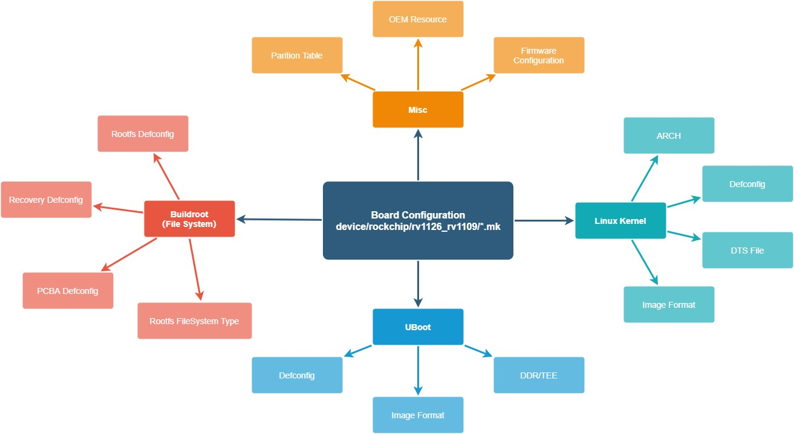

## SDK Building Introduction

Description of two methods of compiling SDK:

- One is to rely on the entire SDK environment to compile (the method introduced in this chapter)
- The other is to compile U-Boot, Linux Kernel, Rootfs and application libraries independently from the SDK (refer to the document for specific methods: **docs/RV1126_RV1109/Rockchip_RV1126_RV1109_Instruction_Linux_Separate_Building_EN.pdf**）

### To Select Board Configure

#### SDK Download Address

```shell
repo init --repo-url ssh://git@www.rockchip.com.cn/repo/rk/tools/repo -u ssh://git@www.rockchip.com.cn/linux/rk/platform/manifests -b linux -m rv1126_rv1109_linux_release.xml
```

#### SDK Sync and log

##### SDK Sync

```shell
.repo/repo/repo sync -c -j4
repo: warning: Python 2 is no longer supported; Please upgrade to Python 3.6+.
repo: warning: Python 2 is no longer supported; Please upgrade to Python 3.6+.
Fetching projects: 100% (71/71), done.
info: A new version of repo is available

warning: project 'repo' branch 'stable' is not signed
warning: Skipped upgrade to unverified version
Checking out projects: 100% (71/71), done.
repo sync has finished successfully.
```

##### Get the version of SDK

Run this command in the root directory of SDK:

```shell
realpath .repo/manifests/rv1126_rv1109_linux_release.xml

# e.g.  SDK version is v1.3.1
#       update time is 2020-09-21
# /home/rv1109-SDK/.repo/manifests/rv1126_rv1109_linux/rv1126_rv1109_linux_v1.3.1_20200921.xml
```

##### Create the branch name default for every project

```shell
.repo/repo/repo start default --all
repo: warning: Python 2 is no longer supported; Please upgrade to Python 3.6+.
repo: warning: Python 2 is no longer supported; Please upgrade to Python 3.6+.
Starting default: 100% (71/71), done.
```

#### The directory of SDK board config (device/rockchip/rv1126_rv1109)

| Board Configuration           | Product Use                                 | Storage Medium | EVB Board name                                      |
| ----------------------------- | ------------------------------------------- | -------------- | --------------------------------------------------- |
| BoardConfig-38x38-spi-nand.mk | General IPC (Discrete power supply)         | SPI NAND       | RV1126_RV1109_38X38_SPI_DDR3P216DD6_V10_20200511LXF |
| BoardConfig-38x38-spi-nand.mk | General IPC (Discrete power supply)         | SPI NAND       | RV1126_RV1109_IPC38_DEMO_V1.11_2020724LX            |
| BoardConfig-38x38-spi-nand-ab.mk | General IPC (Discrete power supply), Boot-up with AB system | SPI NAND       | RV1126_RV1109_IPC38_DEMO_V1.11_2020724LX            |
| BoardConfig-robot.mk          | Robot Sweeper IPC                           | eMMC           | RV1126_RV1109_EVB_DDR3P216SD6_V13_20200630LXF       |
| BoardConfig-tb-v12.mk         | Door lock or doorbell products with battery | eMMC           | RV1126_RV1109_EVB_DDR3P216SD6_V12_20200515KYY       |
| BoardConfig-tb-v13.mk         | Door lock or doorbell products with battery | eMMC           | RV1126_RV1109_EVB_DDR3P216SD6_V13_20200630LXF       |
| BoardConfig-spi-nand.mk       | General IPC                                 | SPI NAND       | RV1126_RV1109_EVB_DDR3P216SD6_V12_20200515KYY       |
| BoardConfig.mk                | General IPC                                 | eMMC           | RV1126_RV1109_EVB_DDR3P216SD6_V13_20200630LXF       |
| BoardConfig-ab-v13.mk         | General IPC, Boot-up with AB system         | eMMC           | RV1126_RV1109_EVB_DDR3P216SD6_V13_20200630LXF       |
| BoardConfig-v12.mk            | General IPC                                 | eMMC           | RV1126_RV1109_EVB_DDR3P216SD6_V12_20200515KYY       |
| BoardConfig-slc-nand-v12.mk   | General IPC                                 | SLC NAND       | RV1126_RV1109_EVB_DDR3P216SD6_V12_20200515KYY       |
| BoardConfig-v10-v11.mk        | General IPC                                 | eMMC           | RV1126_RV1109_EVB_DDR3P216SD6_V11_20200312LXF       |
| BoardConfig-spi-nor-v12.mk    | Base system and only RTSP stream to preview | SPI NOR        | RV1126_RV1109_EVB_DDR3P216SD6_V12_20200515KYY       |
| BoardConfig-facial_gate.mk    | Door Control or Turnstile                   | eMMC           | RV1126_RV1109_EVB_DDR3P216SD6_V13_20200630LXF       |
| ++++++++++++++++++++++++++    | +++++++++++++++++++++++++++++++++           | +++++++++++++  | ++++++++++++++++++++++++++++++++++++++++++++        |

Command of select board configure:

Method 1
`./build.sh` "path to board config file", for example:

select **General IPC** board configuration

```shell
./build.sh device/rockchip/rv1126_rv1109/BoardConfig.mk
```

select **Door lock or doorbell products with battery** board configuration, apply to EVB Board RV1126_RV1109_EVB_DDR3P216SD6_V13_20200630LXF

```shell
./build.sh device/rockchip/rv1126_rv1109/BoardConfig-tb-v13.mk
```

select **Door Control or Turnstile**, apply to EVB Board RV1126_RV1109_EVB_DDR3P216SD6_V13_20200630LXF

```shell
./build.sh device/rockchip/rv1126_rv1109/BoardConfig-facial_gate.mk
```

Method 2

```shell
./build.sh lunch
processing board option: lunch
processing option: lunch

You're building on Linux
Lunch menu...pick a combo:

0. default BoardConfig.mk
1. BoardConfig-38x38-spi-nand.mk
2. BoardConfig-ab-v13.mk
3. BoardConfig-battery-ipc.mk
4. BoardConfig-facial_gate.mk
5. BoardConfig-robot.mk
6. BoardConfig-sl.mk
7. BoardConfig-slc-nand-v12.mk
8. BoardConfig-spi-nand.mk
9. BoardConfig-spi-nor-tb-v13.mk
10. BoardConfig-spi-nor-v12.mk
11. BoardConfig-tb-v12.mk
12. BoardConfig-tb-v13.mk
13. BoardConfig-v10-v11.mk
14. BoardConfig-v12.mk
15. BoardConfig.mk
Which would you like? [0]:
switching to board: /home/rv1109/device/rockchip/rv1126_rv1109/BoardConfig.mk
```

### To View Building Commands

Execute the following command in the root directory: `./build.sh -h|help`

```shell
./build.sh help
Usage: build.sh [OPTIONS]
Available options:
BoardConfig*.mk    -switch to specified board config
lunch              -list current SDK boards and switch to specified board config
uboot              -build uboot
spl                -build spl
loader             -build loader
kernel             -build kernel
modules            -build kernel modules
toolchain          -build toolchain
rootfs             -build default rootfs, currently build buildroot as default
buildroot          -build buildroot rootfs
ramboot            -build ramboot image
multi-npu_boot     -build boot image for multi-npu board
yocto              -build yocto rootfs
debian             -build debian9 stretch rootfs
distro             -build debian10 buster rootfs
pcba               -build pcba
recovery           -build recovery
all                -build uboot, kernel, rootfs, recovery image
cleanall           -clean uboot, kernel, rootfs, recovery
firmware           -pack all the image we need to boot up system
updateimg          -pack update image
otapackage         -pack ab update otapackage image
save               -save images, patches, commands used to debug
allsave            -build all & firmware & updateimg & save

Default option is 'allsave'.
```

To view detailed building commands for some modules, for example: `./build.sh -h kernel`

```shell
./build.sh -h kernel
###Current SDK Default [ kernel ] Build Command###
cd kernel
make ARCH=arm rv1126_defconfig
make ARCH=arm rv1126-evb-ddr3-v10.img -j12
```

[^Note]: The detailed compilation commands are based on the actual SDK version, mainly because the configuration may be different. build.sh compilation command is fixed.

### U-Boot Building

```shell
### to view detailed U-Boot build command
./build.sh -h uboot

### U-Boot building command
./build.sh uboot
```

#### Instructions to U-Boot config

```shell
### use menuconfig to configure U-Boot, select config, save and exit.
### rv1126_defconfig can be found in the directory of u-boot/configs
### command format: make "RK_UBOOT_DEFCONFIG"_defconfig
### RK_UBOOT_DEFCONFIG define in the BoardConfig*.mk file which ./build.sh select
cd u-boot
make rv1126_defconfig
make menuconfig

### save config to rv1126_defconfig
make savedefconfig
cp defconfig configs/rv1126_defconfig
```

### Kernel Building

```shell
### to view detailed Kernel build command
./build.sh -h kernel

### use menuconfig to configure Kernel, select config, save and exit.
### e.g. EVB Board
cd kernel
make ARCH=arm rv1126_defconfig
make ARCH=arm menuconfig

### Kernel building command
./build.sh kernel
```

#### Instructions to kernel config

```shell
### e.g. device/rockchip/rv1126_rv1109/BoardConfig.mk
./build.sh device/rockchip/rv1126_rv1109/BoardConfig.mk
cd kernel

### command format: make ARCH=arm "RK_KERNEL_DEFCONFIG" "RK_KERNEL_DEFCONFIG_FRAGMENT"
### RK_KERNEL_DEFCONFIG and RK_KERNEL_DEFCONFIG_FRAGMENT is define in the BoardConfig*.mk file which ./build.sh select
### RK_KERNEL_DEFCONFIG_FRAGMENT is optional, refer to BoardConfig*.mk
make ARCH=arm rv1126_defconfig
make ARCH=arm menuconfig

make ARCH=arm savedefconfig
cp defconfig arch/arm/configs/rv1126_defconfig
```

### Recovery Building

```shell
### to view detailed Recovery build command
./build.sh -h recovery

### Recovery building command
./build.sh recovery
```

#### Instructions to Recovery config

```shell
### 1. Get the recovery configure of the board config.
./build.sh -h recovery
#   ###Current SDK Default [ recovery ] Build Command###
#   source envsetup.sh rockchip_rv1126_rv1109_recovery
#   device/rockchip/common/mk-ramdisk.sh recovery.img rockchip_rv1126_rv1109_recovery

### 2. source the defconfig of buildroot
source envsetup.sh rockchip_rv1126_rv1109_recovery

### 3. use menuconfig to configure Recovery, select config, save and exit.
### e.g. disable recovery ui config is BR2_PACKAGE_RECOVERY_NO_UI (see buildroot/package/rockchip/recovery/Config.in)
make menuconfig  # enter menuconfig, input “/" and goto search mode, input BR2_PACKAGE_RECOVERY_NO_UI

### 4. save to recovery config file
###    ./buildroot/configs/rockchip_rv1126_rv1109_recovery_defconfig
make savedefconfig
```

NOTE: Recovery is a non-essential function, some board configuration will not be set.

### Rootfs Building

```shell
### to view detailed Rootfs build command
./build.sh -h rootfs

### Rootfs building command
./build.sh rootfs
```

#### Instructions to Rootfs config and the compilation of projects which under the directory of app and external

```shell
### 1. In the root directory SDK, get the rootfs configure of the board config.
./build.sh -h rootfs
#   ### Current SDK Default [ rootfs ] Build Command###
#   source envsetup.sh rockchip_rv1126_rv1109
#   make

### 2. source the defconfig of buildroot
source envsetup.sh rockchip_rv1126_rv1109

### 3. use menuconfig to configure Rootfs, select config, save and exit.
### e.g. ipc-daemon's config is BR2_PACKAGE_IPC_DAEMON (see buildroot/package/rockchip/ipc-daemon/Config.in)
make menuconfig  # enter menuconfig, input “/" and goto search mode, input BR2_PACKAGE_IPC_DAEMON

### 4. save to rootfs config file
###    ./buildroot/configs/rockchip_rv1126_rv1109_defconfig
make savedefconfig

### 5. Get the name of the package makefile
### eg: buildroot/package/rockchip/ipc-daemon/ipc-daemon.mk
make ipc-daemon-dirclean
make ipc-daemon-rebuild
```

[NOTE]: <SDK>/app and <SDK>/external are also the package of Buildroot.

### Firmware Package

Firmware packaging command: `./mkfirmware.sh`

Firmware directory: rockdev

### Full Automatic Building

Enter the project root directory and execute the following command to automatically complete all buildings:

```shell
./build.sh all # Only build with u-Boot, kernel, Rootfs and Recovery
               # then use ./mkfirmware.sh to package firmware.

./build.sh     # build with ./build.sh all, and then do these as follow:
               # 1. package firmware to directory "rockdev"
               # 2. package update.img
               # 3. copy rockdev directory to IMAGE/***_RELEASE_TEST/IMAGES
               # 4. copy the patches of modules to IMAGE/***_RELEASE_TEST/PATCHES
               # NOTE: ./build.sh allsave is the same as ./build.sh
```

## Upgrade Introduction

### TOP Surface of the EVB


### Bottom Surface of the EVB

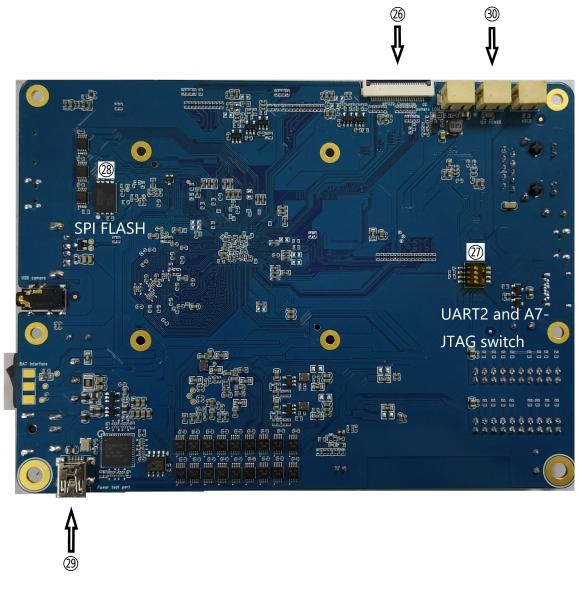

### EVB Function Table


### Bottom Surface of EVB Sensor board


**Scan the QR code which on sensor board and get the prebuilt firmware image of EVB.**

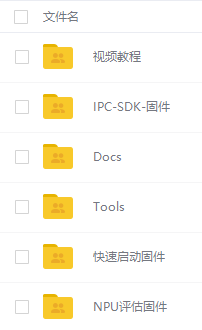

### Windows Upgrade Introduction

The SDK provides a windows flash tool (this tool should be V2.78 or later version) which is located in project root directory:

```shell
tools/
├── windows/RKDevTool
```

As shown below, after building and generating the firmware, device needs to enter MASKROM or BootROM  mode for flashing. After connecting USB cable, long press the "Update" button and press "RESET" button at the same time and then release, device will enter MASKROM mode. Then you should load the paths of the corresponding images and click "Run" to start update. You can also press the "recovery" button and press “RESET" button "RESET" then release to enter loader mode to update. Partition offset and update files of MASKROM Mode are shown as follows (Note: you have to run the tool as an administrator in Windows PC):

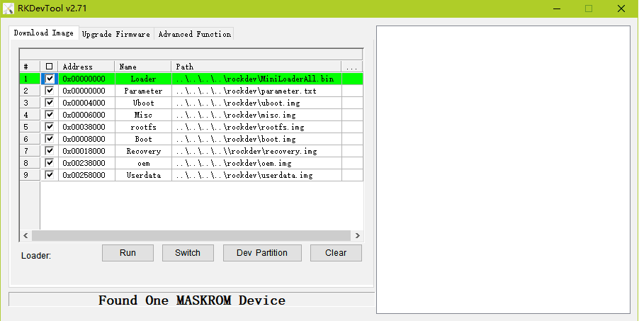

The method to flash update.img:

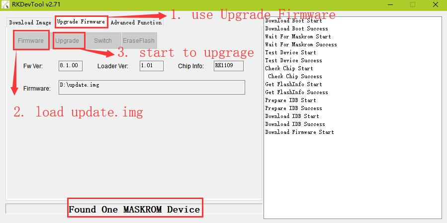

The method to flash SPI NOR Firmware.img:

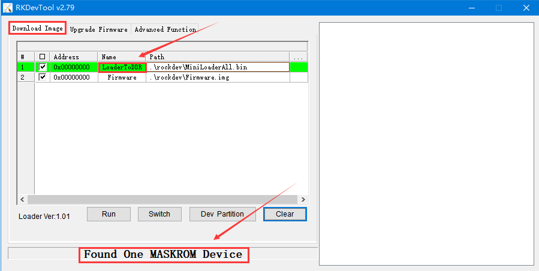

Note:

1. In addition to MiniLoader All.bin and parameter.txt, the actual partition to be burned is based on rockdev / parameter.txt configuration.

2. before upgrade, please install the latest USB driver, which is in the below directory:

```shell
<SDK>/tools/windows/DriverAssitant_v4.91.zip
```

### Linux Upgrade Introduction

The Linux upgrade tool (Linux_Upgrade_Tool should be v1.57 or later versions) is located in "tools/linux" directory. Please make sure your board is connected to MASKROM/loader rockusb, if the generated firmware is in rockdev directory, upgrade commands are as below:

```shell
### In addition to MiniLoader All.bin and parameter.txt, the actual partition to be burned is based on rockdev / parameter.txt configuration.
sudo ./upgrade_tool ul rockdev/MiniLoaderAll.bin
sudo ./upgrade_tool di -p rockdev/parameter.txt
sudo ./upgrade_tool di -u rockdev/uboot.img
sudo ./upgrade_tool di -misc rockdev/misc.img
sudo ./upgrade_tool di -b rockdev/boot.img
sudo ./upgrade_tool di -recovery rockdev/recovery.img
sudo ./upgrade_tool di -oem rockdev/oem.img
sudo ./upgrade_tool di -rootfs rocdev/rootfs.img
sudo ./upgrade_tool di -userdata rockdev/userdata.img
sudo ./upgrade_tool rd
```

Or upgrade the whole update.img firmware after packaging:

```shell
sudo ./upgrade_tool uf rockdev/update.img
```

Upgrade the whole Firmware.img for SPI NOR:

```shell
sudo ./upgrade_tool db rockdev/MiniLoaderAll.bin
sudo ./upgrade_tool wl 0x0 rockdev/Firmware.img
sudo ./upgrade_tool rd
```

Or in root directory, run the following command on your device to upgrade in MASKROM state:

```shell
./rkflash.sh
```

## EVB Function Introduction and Precaution

### The precaution of GPIO power design


### How to Access 3 RTSP and 1 RTMP Network Stream

The EVB supports the following functions:

- Support 3 RTSP and 1 RTMP network stream
- Support 1280x720 local screen display
- Support to save the main stream to the device
- Support access device from web
- Support face recognition

Connect a network cable to the network port of the EVB, power on and start. It will obtain the IP address automatically by default.

#### Get Device IP Address by Serial Port or ADB of the EVB

```shell
ifconfig eth0
eth0      Link encap:Ethernet  HWaddr 02:E0:F9:16:7E:E9
          inet addr:172.16.21.218  Bcast:172.16.21.255  Mask:255.255.255.0
          UP BROADCAST RUNNING MULTICAST  MTU:1500  Metric:1
          RX packets:199225 errors:0 dropped:2231 overruns:0 frame:0
          TX packets:372371 errors:0 dropped:0 overruns:0 carrier:0
          collisions:0 txqueuelen:1000
          RX bytes:20874811 (19.9 MiB)  TX bytes:522220899 (498.0 MiB)
          Interrupt:56
```

Connect to the EVB through the serial port, you have to configure as follows:

```shell
Baud rate: 1500000
Data bits: 8
Stop bit: 1
Parity: none
Flow control: none
```

#### Get Device IP Address by RK IPCamera Tool

Install the tool in the SDK directory `tools/windows/RK_IPCamera_Tool-V1.1.zip`. Open the tool and connect the EVB board to the computer through the network port. In the local area network, check the RK IPCamera Tool device list to obtain the device IP address.


**Note:**

- Step 1: click "开启搜索" to search devices
- Step 2: select a device
- Step 3: cancel "自动获取" and change to static IP
- Step 4: set a static IP
- Step 5: set the IP to device
- Step 6: open to preview

#### Access Network Stream

Use a player that supports RTSP or RTMP to access, for example (VLC player).

RTSP access address:

- rtsp://**IP address of the device**/live/mainstream

- rtsp://**IP address of the device**/live/substream

- rtsp://**IP address of the device**/live/thirdstream

RTMP access address:

- rtmp://**IP address of the device**:1935/live/substream

### How to Access Device Information via Web

Open a web browser (Chrome browser is recommended ) to access the address:

```shell
http://IP address of the device
```

For detailed operation instructions on the web, please refer to the documents under the SDK docs directory which named Rockchip_Instructions_Linux_Web_Configuration_CN.pdf.

### How to Test Face Recognition Function

Use a player to access RTSP main stream: rtsp://**IP address of the device**/live/mainstream.

Face Recognition is closed by default. We can visit on `http://IP address of the device` and "Config" --> "INTELLIGENCE ANALYSIS" to enable face recognition.
The default authorization test time of the SDK's face recognition function is 30 ~ 60 minutes. When the authorization is invalid, the main stream preview will prompt "gace algorithm software is not authorized", and you have to restart to test again.

### How to Debug With EVB via Network

#### Debug With SSH

Connect EVB with network, get EVB board's IP address with the Chapter 5.1.2 [Get Device IP Address by RK IPCamera Tool](#### 5.1.2 Get Device IP Address by RK IPCamera Tool). Ensure that the PC can ping the EVB board.

```shell
### Clean last login message (EVB IP address: 192.168.1.159)
ssh-keygen -f "$HOME/.ssh/known_hosts" -R 192.168.1.159
### Command of SSH
ssh root@192.168.1.159
### input the default passwd：rockchip
```

#### Debug With SCP

```shell
### Upload the test-file from PC to EVB board dirctory /userdata
scp test-file root@192.168.1.159:/userdata/
root@192.168.1.159's password:
### input the default passwd：rockchip

### Download the EVB file (/userdata/test-file) to PC
scp root@192.168.1.159:/userdata/test-file test-file
root@192.168.1.159's password:
### input the default passwd：rockchip
```

#### Debug with ADB via TCP/IP

```shell
### e.g. EVB IP address: 192.168.1.159
adb connect 192.168.1.159

adb devices
List of devices attached
192.168.1.159:5555      device

### login on EVB via ADB
adb -s 192.168.1.159:5555 shell

### Upload the test-file from PC to EVB board dirctory /userdata
adb -s 192.168.1.159:5555 push test-file /userdata/

### Download the EVB file (/userdata/test-file) to PC
adb -s 192.168.1.159:5555 pull /userdata/test-file test-file
```

### SPI NAND/SLC NAND ubi filesystem introduction

#### Introduction to ubi filesystem of rootfs

The rootfs of Nand Flash is ubifs, SDK default configure Nand Flash information is Page Size 2KB and Block Size 128KB.
To modify board config: `device/rockchip/rv1126_rv1109/BoardConfig***.mk`.

```shell
# Set ubifs page size, 2048(2KB) or 4096(4KB)
# Option.
export RK_UBI_PAGE_SIZE=2048

# Set ubifs block size, 0x20000(128KB) or 0x40000(256KB)
# Option.
export RK_UBI_BLOCK_SIZE=0x20000

# Set userdata partition size (byte) if define RK_USERDATA_DIR
# MUST, if userdata partition is grow partition.
export RK_USERDATA_PARTITION_SIZE=0x02760000

# Set oem partition size (byte)
# Option. if not set, it will get from parameter auto.
export RK_OEM_PARTITION_SIZE=0x6400000
```

The rootfs is ubifs default, if want to use squashfs, steps are as follows:

- Configure buildroot/configs/rockchip_rv1126_rv1109_spi_nand_defconfig

```diff
diff --git a/configs/rockchip_rv1126_rv1109_spi_nand_defconfig b/configs/rockchip_rv1126_rv1109_spi_nand_defconfig
index 5da9b25935..8af9226920 100644
--- a/configs/rockchip_rv1126_rv1109_spi_nand_defconfig
+++ b/configs/rockchip_rv1126_rv1109_spi_nand_defconfig
@@ -41,6 +41,8 @@ BR2_PACKAGE_RK_OEM=y
 BR2_PACKAGE_RK_OEM_RESOURCE_DIR="$(TOPDIR)/../device/rockchip/oem/oem_ipc"
 BR2_PACKAGE_RK_OEM_IMAGE_FILESYSTEM_TYPE="ubi"
 BR2_PACKAGE_RK_OEM_IMAGE_PARTITION_SIZE=0x6400000
+BR2_PACKAGE_ROOTFS_UBI_USE_CUSTOM_FILESYSTEM=y
+BR2_PACKAGE_ROOTFS_UBI_CUSTOM_FILESYSTEM="squashfs"
 BR2_PACKAGE_CAMERA_ENGINE_RKAIQ=y
 BR2_PACKAGE_CAMERA_ENGINE_RKAIQ_IQFILE="os04a10_CMK-OT1607-FV1_M12-40IRC-4MP-F16.xml"
 BR2_PACKAGE_IPC_DAEMON=y
@@ -79,4 +81,5 @@ BR2_PACKAGE_NGINX=y
 BR2_PACKAGE_NGINX_HTTP_SSL_MODULE=y
 BR2_PACKAGE_NGINX_DEBUG=y
 BR2_PACKAGE_NGINX_RTMP=y
+BR2_TARGET_ROOTFS_SQUASHFS4_XZ=y
 BR2_TARGET_ROOTFS_UBIFS_MAXLEBCNT=4096
```

- Config the bootargs paramerter in kernel dts as follows:

`ubi.mtd=3 ubi.block=0,rootfs root=/dev/ubiblock0_0 rootfstype=squashfs    /* mount SquashFS on UBI block */`

NOTICE: ubi.mtd=3 (3 is the number of rootfs in the partition and the first partition number is 0)

#### Introduction to oem and userdata partition used in ubifs

The SDK default OEM is packaged in Buildroot as a UBI image.
The userdata partition default is not packaged, when system boot up userdata will fotmat to ubifs auto.

If configure RK_OEM_DIR (RK_OEM_BUILDIN_BUILDROOT is not defined) or RK_USERDATA_DIRi in the BoardConfig.mk, then use `./mkfirmware.sh` which in the root directory of SDK.
RK_OEM_DIR define as the directory which in the device/rockchip/oem/.
RK_USERDATA_DIR define as the directory which in the device/rockchip/userdata/.

The detailed UBI filesystem image document: <SDK>/docs/Linux/ApplicationNote/Rockchip_Developer_Guide_Linux_Nand_Flash_Open_Source_Solution_EN.pdf

### Introduced to the usage of U-Boot's tftp

#### Configure U-Boot's ethernet phy

The ethernet phy which U-Boot support is RTL8211F, default. The initialization of U-Boot's ethernet will read dtb from kernel, if fail to read, U-Boot will read from U-Boot's dtb. So we will configure the node gmac of U-Boot's dtb if the phy is not RTL8211F.

The follow is the reference:
Note: the quote node in the U-Boot's dts (e.g. gpio2/rmiim1_pins/gmac_clk_m1_pins) MUST add "u-boot,dm-pre-reloc;"

```diff
diff --git a/arch/arm/dts/rv1126-pinctrl.dtsi b/arch/arm/dts/rv1126-pinctrl.dtsi
index 67f7c742b8..967598b4fb 100644
--- a/arch/arm/dts/rv1126-pinctrl.dtsi
+++ b/arch/arm/dts/rv1126-pinctrl.dtsi
@@ -1122,6 +1122,11 @@
                                /* clk_out_ethernet_m1 */
                                <2 RK_PC5 2 &pcfg_pull_none>;
                };
+               gmac_clk_m1_pins: gmac-clk-m1-pins {
+                       rockchip,pins =
+                               /* rgmii_clk_m1 */
+                               <2 RK_PB7 2 &pcfg_pull_none>;
+               };
        };
        sdmmc0 {
                sdmmc0_bus4: sdmmc0-bus4 {
diff --git a/arch/arm/dts/rv1126-u-boot.dtsi b/arch/arm/dts/rv1126-u-boot.dtsi
index 01547feff6..baf8509946 100644
--- a/arch/arm/dts/rv1126-u-boot.dtsi
+++ b/arch/arm/dts/rv1126-u-boot.dtsi
@@ -166,26 +166,37 @@
        status = "okay";
 };

+&gpio2 {
+       u-boot,dm-pre-reloc;
+       status = "okay";
+};
+
+&rmiim1_pins {
+       u-boot,dm-pre-reloc;
+       status = "okay";
+};
+
+&gmac_clk_m1_pins{
+       u-boot,dm-pre-reloc;
+       status = "okay";
+};
+
 &gmac {
        u-boot,dm-pre-reloc;

-       phy-mode = "rgmii";
-       clock_in_out = "input";
+       phy-mode = "rmii";
+       clock_in_out = "output";

-       snps,reset-gpio = <&gpio3 RK_PA0 GPIO_ACTIVE_LOW>;
+       snps,reset-gpio = <&gpio2 RK_PA5 GPIO_ACTIVE_LOW>;
        snps,reset-active-low;
-       /* Reset time is 20ms, 100ms for rtl8211f */
-       snps,reset-delays-us = <0 20000 100000>;
+       snps,reset-delays-us = <0 50000 50000>;

-       assigned-clocks = <&cru CLK_GMAC_SRC>, <&cru CLK_GMAC_TX_RX>, <&cru CLK_GMAC_ETHERNET_OUT>;
-       assigned-clock-parents = <&cru CLK_GMAC_SRC_M1>, <&cru RGMII_MODE_CLK>;
-       assigned-clock-rates = <125000000>, <0>, <25000000>;
+       assigned-clocks = <&cru CLK_GMAC_SRC>, <&cru CLK_GMAC_TX_RX>;
+       assigned-clock-rates = <50000000>;
+       assigned-clock-parents = <&cru CLK_GMAC_SRC_M1>, <&cru RMII_MODE_CLK>;

        pinctrl-names = "default";
-       pinctrl-0 = <&rgmiim1_pins &clk_out_ethernetm1_pins>;
-
-       tx_delay = <0x2a>;
-       rx_delay = <0x1a>;
+       pinctrl-0 = <&rmiim1_pins &gmac_clk_m1_pins>;

        phy-handle = <&phy>;
        status = "okay";
```

#### The usage of U-Boot's tftp download

Use the command `sysmem_search` to get a free memory address and then set IP address, finally use tftp download file.

```shell
Hit key to stop autoboot('CTRL+C'):  0
=> <INTERRUPT>
=> <INTERRUPT>
=>
=> sysmem_search
sysmem_search - Search a available sysmem region

Usage:
sysmem_search <size in hex>
=> sysmem_search 0x6400000
Sysmem: Available region at address: 0x356f6cc0
=> setenv ipaddr 172.16.21.47
=> setenv serverip 172.16.21.199
=> tftp 0x356f6cc0 uboot.img
ethernet@ffc40000 Waiting for PHY auto negotiation to complete. done
Using ethernet@ffc40000 device
TFTP from server 172.16.21.199; our IP address is 172.16.21.47
Filename 'uboot.img'.
Load address: 0x356f6cc0
Loading: #################################################################
         #################################################################
         ######################
         139.6 KiB/s
done
Bytes transferred = 2228224 (220000 hex)
=>
```

##### Upgrede loader with tftp for eMMC storage

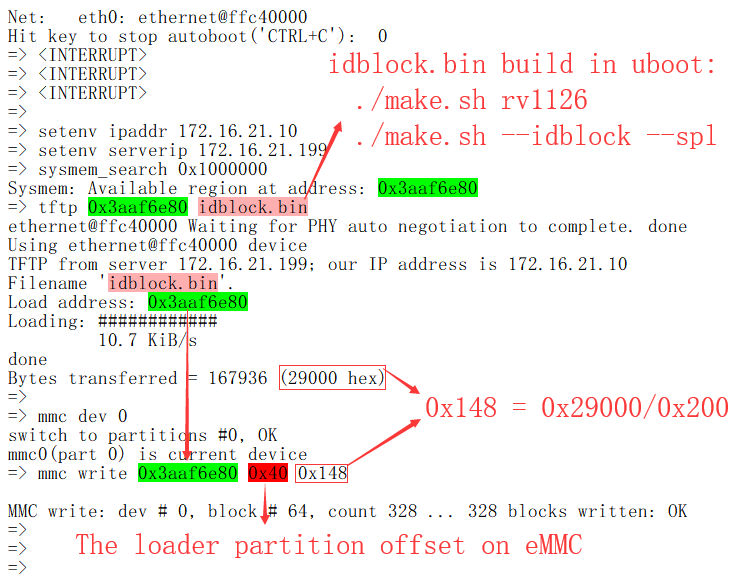

##### Upgrede loader with tftp for SPI NAND storage

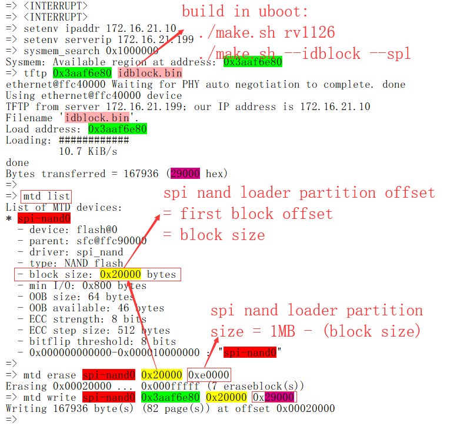

NOTICE: SLC NAND is not support tftp download idblock.bin to upgrade loader temporarily.

## Smart USB Camera Product

The smart USB camera product supports the following functions:

- Support standard UVC camera function, up to 4K preview (RV1126)
- Support a variety of NN algorithms, including face detection, human posture or bone detection, face key point detection and tracking, and support third-party algorithm expansion
- Support USB composite device stable transmission (RNDIS/ UAC / ADB, etc.)
- Support NN preprocessing and data post-processing path
- Support preview of multiple terminal devices such as smart TV or PC
- Support for eptz function

### Product Building Introduction

The compilation and configuration of the smart USB camera product is based on the public SDK and adopts the separate rv1126_rv1109_linux_Ai_camera_release.xml Code list management update.

#### Select Board Configuration for USB Camera Product

SDK download address ：

```shell
repo init --repo-url ssh://git@www.rockchip.com.cn/repo/rk/tools/repo -u ssh://git@www.rockchip.com.cn/linux/rk/platform/manifests -b linux -m rv1126_rv1109_linux_ai_camera_release.xml
```

| Board Configuration                               | Comment                       |
| ------------------------------------------------- | ----------------------------- |
| device/rockchip/rv1126_rv1109/BoardConfig-uvcc.mk | Smart USB Camera board config |
|                                                   |                               |

| Chip Name | Board Configuration (path: device/rockchip/rv1126_rv1109) | Storage Medium | EVB Board name                                      |
| ------    | --------------------------------------------------------- | -------------- | --------------------------------------------------- |
| RV1126/RV1109 | BoardConfig-uvcc.mk                                   | eMMC     | RV1126_RV1109_EVB_DDR3P216SD6_V13_20200630LXF       |

Command of selecting board configure :

```shell
### To select Smart USB Camera board config
./build.sh device/rockchip/rv1126_rv1109/BoardConfig-uvcc.mk
```

#### Building

The building command of the intelligent USB camera product is the same as that of the SDK. Please refer to the SDK Building Introduction in Section 3.

### Product Software Framework

The overall structure is as follows：

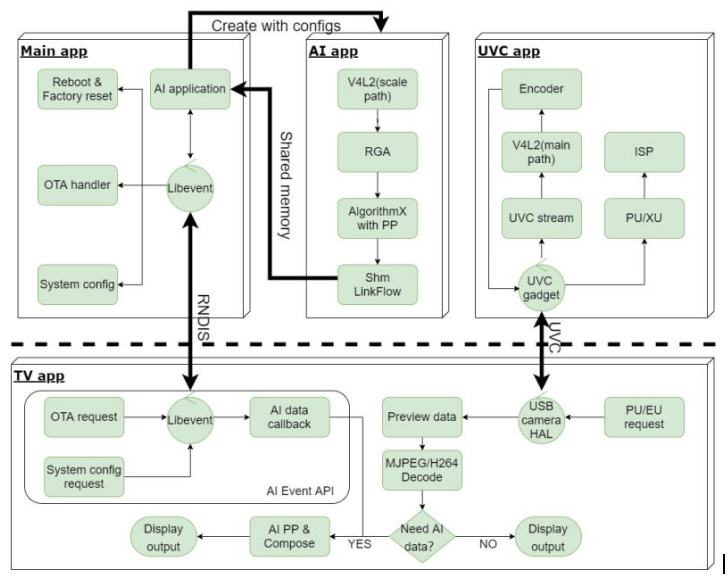

The corresponding relationship between rv1109 / rv1126 end application and source code program is as follows:

> **1.main app : source code patch:<SDK>/app/smart_display_service：Responsible for RNDIS server function implementation, command processing, NN data forwarding and other operations；**
>
> **2.AI app : source code patch: <SDK>/app/mediaserver： Responsible for sending all camera data to NPU for corresponding NN algorithm processing, and passing it to main app through shared memory mechanism ;**
>
> **3.uvc app:source code patch:  <SDK>/external/uvc_app: Responsible for the implementation and control of the complete functions of UVC camera.**

#### uvc_app

Please refer to：

```shell
<SDK>/external/uvc_app/doc/zh-cn/uvc_app.md
```

#### mediaserver

Please refer to：

```shell
<SDK>/docs/RV1126_RV1109/AppcationNote/Rockchip_Instructions_Linux_MediaServer_CN.pdf
```

#### Other

For other Linux application framework or module materials, please refer to the corresponding documents in the following directory：

```shell
<SDK>/docs/RV1126_RV1109/  # Use for RV1126/RV1109 platform
<SDK>/docs/Linux/          # Use for Rockchip Linux general platform, for RV1126/RV1109 reference only
```

### Function Introduction

#### How To Preview For USB Camera

Use USB cable to connect the USB OTG port of EVB with the host computer, such as the USB host port of TV or PC, and power on. By default, the UVC camera application and rndis service will be started automatically. Use serial port to connect EVB board and run ifconfig usb0 to obtain the pre configured IP address of rndis virtual network port.

```shell
RK $ ifconfig usb0
usb0      Link encap:Ethernet  HWaddr 8E:F3:7D:36:13:34
          inet addr:172.16.110.6  Bcast:172.16.255.255  Mask:255.255.0.0
          UP BROADCAST RUNNING MULTICAST  MTU:1500  Metric:1
          RX packets:4884 errors:0 dropped:16 overruns:0 frame:0
          TX packets:4843 errors:0 dropped:0 overruns:0 carrier:0
          collisions:0 txqueuelen:1000
          RX bytes:257305 (251.2 KiB)  TX bytes:787936 (769.4 KiB)
```

Use serial port to connect the PC end of EVB board as follows：

```shell
Baud rate：1500000
Data bits：8
Stop bit：1
Parity：none
Flow control：none
```

Android smart TV uses RKAICameraTest application or other standard camera applications. PC side recommends the use of a third-party UVC camera application such as Amcap or Potplayer. When it is opened, you can see the preview, and the switching format or resolution can refer to the application switching of upper computer.


#### How To Test AI Model Post-processing

Open the RKAICameraTest application on the TV terminal, click the rndis button to connect with rndis after seeing the preview, click the settings button to select the "model algorithm switching" option after success, select the model algorithm to be used, which is the face detection algorithm by default, and then click the "Ai post-processing switch", when the face appears in front of the camera, you can see the AI processing effect:

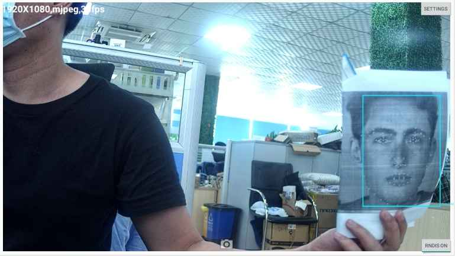

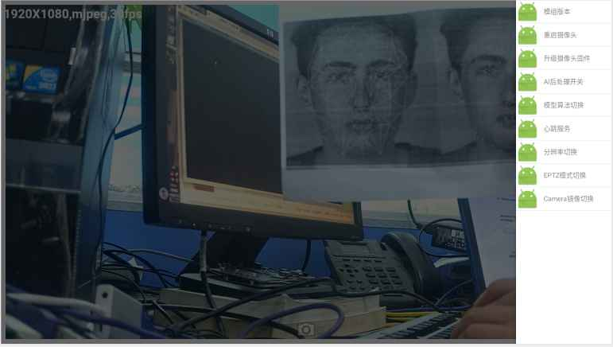

#### How To Test EPTZ

Open the RKAICameraTest application at the TV end, click the rndis button to connect to rndis after seeing the preview, click the settings button to select the "eptz mode switch" option after the countdown is completed, and then open the application, at this time, the top left corner of the interface will display whether it is the eptz model or the general intelligent preview mode:

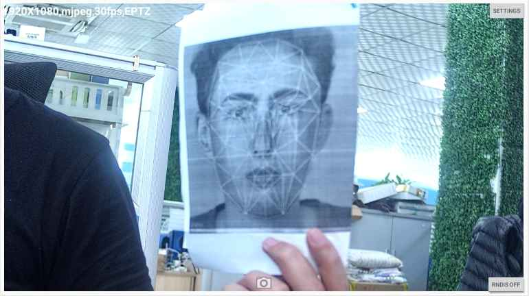

## Facial Gate Product

The facial gate product supports the following functions:

- Support face feature extraction,face detection and recognition, liveness detection
- Support 1280x720 local screen display
- Support access device from web

### Product Building Introduction

The compilation and configuration of the facial gate product is based on the public SDK, so SDK download and Environment set up please refer to the SDK.

#### Select Board Configuration for Facial Gate Product

| Board Configuration                                      | Comment                  |
| -------------------------------------------------------- | ------------------------ |
| device/rockchip/rv1126_rv1109/BoardConfig-facial_gate.mk | Facial Gate board config |

**Note**: The SDK supports the EVB with the mark of RV1126_RV1109_EVB_DDR3P216SD6_V13_20200630LXF  by default,so if you get the EVB with the mark of RV1126_RV1109_EVB_DDR3P216SD6_V12_20200515KYY, please modify device/rockchip/rv1126_rv1109/BoardConfig-facial_gate.mk

```diff
--- a/rv1126_rv1109/BoardConfig-facial_gate.mk
+++ b/rv1126_rv1109/BoardConfig-facial_gate.mk
@@ -11,7 +11,7 @@ export RK_KERNEL_DEFCONFIG=rv1126_defconfig
 # Kernel defconfig fragment
 export RK_KERNEL_DEFCONFIG_FRAGMENT=rv1126-facial-gate.config
 # Kernel dts
-export RK_KERNEL_DTS=rv1109-evb-ddr3-v13-facial-gate
+export RK_KERNEL_DTS=rv1109-evb-ddr3-v12-facial-gate
 # boot image type
 export RK_BOOT_IMG=zboot.img
 # kernel image path

```

Command of selecting board configuration:

```shell
### To select Facial Gate board config
./build.sh device/rockchip/rv1126_rv1109/BoardConfig-facial_gate.mk
```

#### Building

The building command of the intelligent Facial Gate product is the same as that of the SDK. Please refer to the SDK Building Introduction in Section 3.

### **QFacialGate** **Application**

QFacialGate is the main application of facial gate product, Which runs automatically by default when power on. and QT is used for UI.and RK's own algorithm Rockface is called through Rkfacial library to realize face detection, face feature point extraction, face recognition and live detection.

The following functions are included:

- RGB camera image data was obtained for face recognition, and IR camera image data was obtained for live detection
- SQLITE3 is used as a database to store face feature values and user names
- User register and delete, face tracking, user name display and other operations
- ALSA interface is used to realize the voice broadcast function of each process

### **minigui_demo** **Application**

MiniGUI is a mature and proven cross-platform GUI system for embedded and smart IoT devices, and it's fit for small capacity Flash or qucik boot products. The minigui_demo is implemented on MiniGUI, that show how to bring up MiniGUI features.

```
#Enable BR2_PACKAGE_MINIGUI_DEMO option on buildroot, it'll select the dependent libraries automatically.
BR2_PACKAGE_LIBPNG12
BR2_PACKAGE_MINIGUI_ENABLE_RGA
BR2_PACKAGE_MINIGUI_ENABLE_FREETYPE
BR2_PACKAGE_MINIGUI_ENABLE_PNG
After the building, launch the minigui_demo manually.
```

The following functions are included:

- RGB camera image data was obtained for face recognition, and IR camera image data was obtained for live detection
- SQLITE3 is used as a database to store face feature values and user names
- User register and delete, face tracking, user name display and other operations
- ALSA interface is used to realize the voice broadcast function of each process

#### Other

- SDK comes with its own algorithm Rockface, it's need to authorization. How to obtain authorization please contact business and refer to sdk/external/rockface/auth/README.md the SDK has one hour test mode, time out please reboot.

- The SDK use RGB camera OV2718, IR camea gc2053

- IR LED angle of view need 90°, electric current need 120ma

- Related documents

  QFacialGate introduction: app\QFacialGate\doc\Rockchip_Instruction_Linux_QFacialGate_CN.pdf

  The interface of Rkfacial: externa\rkfacial\doc\Rockchip_Instruction_Rkfacial_CN.pdf

  Web back-end framework: docs\RV1126_RV1109\ApplicationNote\Rockchip_Developer_Guide_Linux_Application_Framework_CN.pdf

  Web configuration introduction: docs\RV1126_RV1109\ApplicationNote\Rockchip_Instructions_Linux_Web_Configuration_CN.pdf
