# Rockchip Linux Wi-Fi/BT 开发

文件标识：RK-KF-YF-381

发布版本：V6.0.2

日期：2021-01-15

文件密级：□绝密   □秘密   □内部资料   ■公开

**免责声明**

本文档按“现状”提供，瑞芯微电子股份有限公司（“本公司”，下同）不对本文档的任何陈述、信息和内容的准确性、可靠性、完整性、适销性、特定目的性和非侵权性提供任何明示或暗示的声明或保证。本文档仅作为使用指导的参考。

由于产品版本升级或其他原因，本文档将可能在未经任何通知的情况下，不定期进行更新或修改。

**商标声明**

“Rockchip”、“瑞芯微”、“瑞芯”均为本公司的注册商标，归本公司所有。

本文档可能提及的其他所有注册商标或商标，由其各自拥有者所有。

**版权所有 © 2021 瑞芯微电子股份有限公司**

超越合理使用范畴，非经本公司书面许可，任何单位和个人不得擅自摘抄、复制本文档内容的部分或全部，并不得以任何形式传播。

瑞芯微电子股份有限公司

Rockchip Electronics Co., Ltd.

地址：     福建省福州市铜盘路软件园A区18号

网址：     [www.rock-chips.com](http://www.rock-chips.com)

客户服务电话： +86-4007-700-590

客户服务传真： +86-591-83951833

客户服务邮箱： [fae@rock-chips.com](mailto:fae@rock-chips.com)

---

**前言**

**概述**

Rockchip Linux平台 Wi-Fi/BT 开发移植调试

**产品版本**

| **芯片名称** | **内核版本** |
| ------------ | ------------ |
| RK3399/3326/3288/3308/1109/1126/PX30 | Linux 4.4/4.19 |

**读者对象**

本文档（本指南）主要适用于以下工程师：

技术支持工程师

软件开发工程师

**修订记录**

| **版本号** | **作者** | **修改日期** | **修改说明** |
| ---------- | --------| :--------- | :----------- |
| V6.0.1   | xy | 2020-08-25 | 增加新模组移植说明、编译说明、<br/>RF测试示例、P2P桥接功能、更详细的排查说明等 |
| V6.0.2 | Ruby Zhang | 2021-01-15 | 完善部分语言描述 |

---

**目录**

[TOC]

---

## Wi-Fi/BT 配置

### DTS 配置

#### Wi-Fi配置

**Wi-Fi/BT硬件管脚的配置主要有以下几点：**

切记一定要对照原理图进行配置，且确保使用的dts/dtsi里面包含以下节点！

```c
/* WIFI_REG_ON: Wi-Fi的电源PIN脚 */
sdio_pwrseq: sdio-pwrseq {
    /* 特别注意：下面的clock属性是开启RK8XX PMU的32.768k的，请按照实际使用的型号填写，否在SDIO/Wi-Fi无法使用，最新SDK已经把这个属性移到到wireless-wlan节点下，只要不重复配置即可 */
	//clocks = <&rk809 1>;
	//clock-names = "clk_wifi";
	compatible = "mmc-pwrseq-simple";
	pinctrl-names = "default";
	pinctrl-0 = <&wifi_enable_h>;
	/* 这里的电平状态恰好跟使能状态相反，比如REG_ON高有效，则这里为LOW；如果REG_ON低有效，则填HIGH */
	reset-gpios = <&gpio0 RK_PA2 GPIO_ACTIVE_LOW>;
};
&pinctrl {
	sdio-pwrseq {
		wifi_enable_h: wifi-enable-h {
			rockchip,pins =
				/* 对应上面的WIFI_REG_ON */
				<0 RK_PA2 RK_FUNC_GPIO &pcfg_pull_none>;
		};
	};
};

/* 打开SDIO接口 */
&sdio {
	max-frequency = <150000000>;	/* sdio接口的最大频率,可调整 */
	bus-width = <4>;	/* 4线模式 */
	sd-uhs-sdr104;		/* 支持SDIO3.0 */
	… …
	status = "okay";
};

/* WIFI_WAKE_HOST: Wi-Fi唤醒主控的PIN脚 */
wireless-wlan {
	compatible = "wlan-platdata";
	rockchip,grf = <&grf>;
	/* 注意：下面的clock属性是开启PMU的32.768k的，请按照实际使用的型号填写，否在SDIO/WiFi无法使用 */
	//rockchip,grf = <&grf>;
	//clocks = <&rk809 1>;
	/* 海华/正基模组兼容可以不用修改此名称，realtek需要按实际填写 */
	wifi_chip_type = "ap6255";
	/* WIFI_WAKE_HOST GPIO_ACTIVE_HIGH特别注意：确认下这个wifi pin脚跟主控的连接关系，直连的话就是HIGH, 如果中间加了一个反向管就要改成低电平LOW触发 */
	WIFI,host_wake_irq = <&gpio0 RK_PA0 GPIO_ACTIVE_HIGH>;
	/* 注意USB接口的Wi-Fi需要添加此配置，对应WIFI_REG_ON PIN, 且无需sdio_pwrseq/sdio等节点 */
	//WIFI,poweren_gpio = <&gpio0 RK_PA2 GPIO_ACTIVE_HIGH>;
	status = "okay";
};

/* pinctrl的配置 */
wireless-wlan {
	/omit-if-no-ref/
	wifi_wake_host: wifi-wake-host {
		/* 注意一般Wi-Fi的wake up pin都是高电平触发，所以默认这里要配置为下拉，如果客户的是硬件设计是反向的则要改为上拉，总之要初始化为与触发电平相反的状态*/
		rockchip,pins = <0 RK_PA0 0 &pcfg_pull_down>;
	};
};
```

#### 蓝牙配置

以下UART相关的都要配置为实际使用的UART口的所对应PIN，注意RTS/CTS PIN一定要按照SDK设计接，很多客户反馈的异常都是因为这两个PIN脚没有接导致初始化异常：

```c
wireless-bluetooth {
	compatible = "bluetooth-platdata";
	/* 这里要配置为蓝牙所使用uart的rts脚 */
	uart_rts_gpios = <&gpio4 RK_PA7 GPIO_ACTIVE_LOW>;
	pinctrl-names = "default", "rts_gpio";
	pinctrl-0 = <&uart4_rts>;
	pinctrl-1 = <&uart4_rts_gpio>;
	/* BT_REG_ON 蓝牙电源的开关 */
	BT,power_gpio    = <&gpio4 RK_PB3 GPIO_ACTIVE_HIGH>;
	/* BT_WAKE_HOST */
	BT,wake_host_irq = <&gpio4 RK_PB4 GPIO_ACTIVE_HIGH>;
	status = "okay";
};
/* 打开对应的UART配置，注意uart4_xfer/uart4_ctsn每个平台的名字可能不一样，要在对应芯片的dts里面查找对应的写法 */
&uart4 {
	pinctrl-names = "default";
	/* 比如uart4_ctsn有些平台的名字为uart4_cts */
	pinctrl-0 = <&uart4_xfer &uart4_ctsn>;
	status = "okay";
};
```

#### IO电源域的配置

**说明：外部电源比如VCCIO_SDIO（3.3/1.8v）会同时给芯片的IO和Wi-Fi模组的IO供电，以保证它们之间的电压匹配，而主芯片的IO需要设置电源域寄存器以匹配外部的供电电压，所以dts里面需要特定配置告诉驱动支持SDIO3.0的模组IO一定要接1.8v，SDIO2.0 3.3v/1.8v都可以，但切记要匹配，不能出现供电1.8而配置3.3或者反之。**

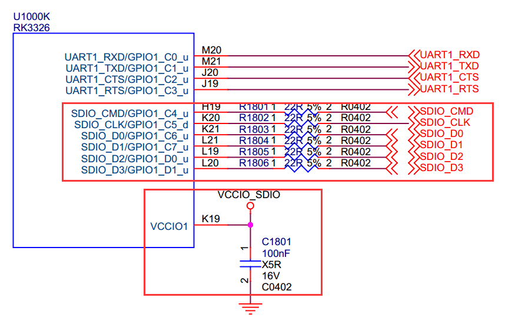

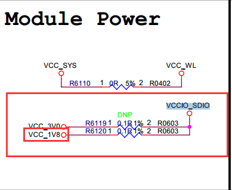

查看上面原理图，找到Wi-Fi对应的sdio接口部分，图中有标注VCCIOX（**有些芯片组名字为：APIOX或者其它**），比如这个是VCCIO1，则给VCCIO1供电的是VCCIO_SDIO，查找VCCIO_SDIO连接的网络是**3.3v**还是**1.8v**, 可以看到上图的VCCIO_SDIO是vcc_1v8供电的，则对应dts/dtsi配置如下：

```c
&io_domains {
	/* vccio1引用vccio_sdio的电压 */
	vccio1-supply = <&vccio_sdio>;
};

/* vccio_sdio引用vcc_1v8 */
vccio_sdio: vcc_1v8: vcc-1v8 {
	compatible = "regulator-fixed";
	regulator-name = "vcc_1v8";
	regulator-always-on;
	regulator-boot-on;
	/* vcc_1v8供电1.8v */
	regulator-min-microvolt = <1800000>;
	regulator-max-microvolt = <1800000>;
	vin-supply = <&vcc_io>;
};
```

以上配置要一一对应，如果硬件是3.3v，按照对应关系进行修改，切记不能出现不匹配的问题。

#### 32.768K的配置

**正基/海华的模组都是要外供32.768k，而Realtek的模组都是内部封装好的，只有COB芯片才会外供。**

如果Wi-Fi模组需要外部供这个频率，则有两种情况：

1. 从原理图可以看到RK8XX型号的PMU会给Wi-Fi供32k，一般PMU默认打开32k，如果没有打开则需要添加如下配置：

```c
wireless-wlan {
		compatible = "wlan-platdata";
		rockchip,grf = <&grf>;
		/* rk809务必改为实际使用的型号 */
+       clocks = <&rk809 1>;
+       clock-names = "clk_wifi";
};
```

注意：如果用的不是RK的PMU，则不能这样配置；看下原理图的32k是如何供的，然后根据实际情况打开32k。

2. 如果需要CPU去供32K，则dts需要添加如下配置（不建议使用这种方式）：

```c
+&pinctrl {
+	pinctrl-names = "default";
+	pinctrl-0 = <&rtc_32k>;
+}
```

硬件连接如下图所示：


### SDMMC 接口接Wi-Fi芯片

有时由于特殊要求，需要把Wi-Fi芯片接到SDMMC接口，则配置做如下修改：

```c
//找到如下两个配置，把&sdio改为&sdmmc，并disabled掉没有使用的节点；
&sdmmc {
	bus-width = <4>;
	cap-mmc-highspeed;
	cap-sd-highspeed;
	card-detect-delay = <200>;
	rockchip,default-sample-phase = <90>;
	supports-sd;
	sd-uhs-sdr12;
	sd-uhs-sdr25;
	sd-uhs-sdr104;
	vqmmc-supply = <&vccio_sd>;
-	status = "okay";
+	status = "disabled";
};

+&sdmmc {
-&sdio {
	max-frequency = <200000000>;
	bus-width = <4>;
	cap-sd-highspeed;
	cap-sdio-irq;
	keep-power-in-suspend;
	non-removable;
	rockchip,default-sample-phase = <90>;
	sd-uhs-sdr104;
	supports-sdio;
	mmc-pwrseq = <&sdio_pwrseq>;
	status = "okay";
};
```

### 内核配置

#### Wi-Fi 配置


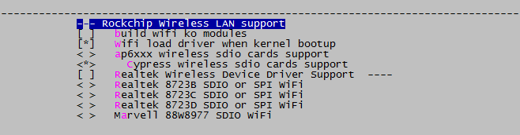

Wi-Fi 驱动可编译到内核或者ko方式：

**切记下面两个配置必须二选一，否则Wi-Fi无法加载！**

```Makefile
# KO 配置如下
[*]   build wifi ko modules
[ ]   Wifi load driver when kernel bootup
# buildin 配置如下
[ ]   build wifi ko modules
[*]   Wifi load driver when kernel bootup
```

- **buildin只能选择一个型号，Realtek模组和ap6xxx模组不能同时选择为y，且Realtek的也只能选择其中一个；**
- ap6xxx 和 cypress 也是互斥的，只能选择一个且如果选择ap6xxx，cypress的配置自动消失，去掉ap配置，cypress自动出现；
- ko方式则可以选择多个Wi-Fi。

#### 蓝牙配置

正基和海华的模块都使用内核的默认**CONFIG_BT_HCIUART** 驱动，而Realtek使用自己的hci uart驱动，源码目录为: `external\rkwifibt\realtek\bluetooth_uart_driver`， 且使用ko方式加载，所以使用Realtek时一定要把内核的**CONFIG_BT_HCIUART**配置去掉！

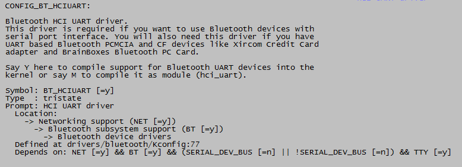

### Buildroot 配置

根据实际Wi-Fi选择对应配置，要跟内核配置一致：

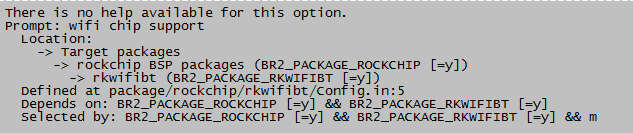


对于有带蓝牙的模组，要配置对应的tty编号，对应硬件的uart口（USB无需此配置）：

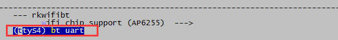

## Wi-Fi/BT 的文件及其编译说明

### 编译涉及的文件

适配Wi-Fi驱动对应的文件目录：

```shell
kernel/drivers/net/wireless/rockchip_wlan/
kernel/drivers/net/wireless/rockchip_wlan/rkwifibt/ #正基模组
kernel/drivers/net/wireless/rockchip_wlan/cywdhd/   #cypress海华模组
kernel/drivers/net/wireless/rockchip_wlan/rtlxxx    #realtek模组
```

适配Wi-Fi的Firmware、Realtek BT 驱动及蓝牙Firmware文件对应的目录为：

`external/rkwifibt/`

AP（CY）Wi-Fi/BTFirmware：

`external/rkwifibt/firmware/broadcom/`

从下图可以看到正基Wi-Fi各个型号所对应的Wi-Fi/BT的firmware的名字：

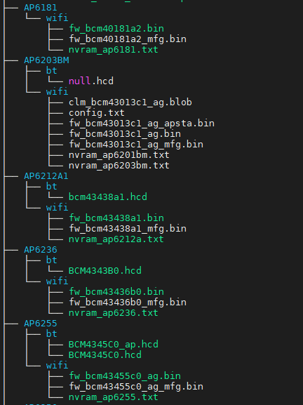

Realtek BT 驱动及Firmware：

```shell
external/rkwifibt/realtek/bluetooth_uart_driver/  #BT驱动
external/rkwifibt/realtek/rtk_hciattach/		  #初始化程序
external/rkwifibt/realtek/RTL8723DS/			  #BT的firmware
```

### 运行时所需的文件及其位置

**当系统启动后，我们有必要了解Wi-Fi蓝牙启动时要用的文件及其文件位置，所以当遇到Wi-Fi/BT启动异常的问题时，首先确认对应Wi-Fi蓝牙的相关文件是否都存在！如果不存在则配置肯定有错误，请仔细检查！**

正基/海华模组，以AP6255为例(具体对应关系参考2.1章节贴图)，Wi-Fi运行所需的文件及存放位置：(kernel4.19内核由system变更为vendor目录)：

```shell
/system/lib/modules/bcmdhd.ko				#驱动ko（如果是ko编译的话）
/system/etc/firmware/fw_bcm43455c0_ag.bin	#驱动firmware文件存放位置
/system/etc/firmware/nvram_ap6255.txt
/system/etc/firmware/BCM4345C0.hcd			#蓝牙firmware文件（如果有蓝牙功能）
```

Realtek模组，以RTL8723DS为例：

```shell
/system/lib/modules/8723ds.ko			#驱动ko（如果是ko编译的话）

# 如果有蓝牙功能的话
/usr/lib/modules/hci_uart.ko 			#蓝牙ko
/lib/firmware/rtlbt/rtl8723d_config		#蓝牙firmware
/lib/firmware/rtlbt/rtl8723d_fw
/lib/firmware/rtlbt/mp_rtl8723d_config	#蓝牙测试firmware
/lib/firmware/rtlbt/mp_rtl8723d_fw
```

下面列出了Realtek部分芯片所对应的文件及所在目录，注意USB接口的比较特殊，firmware文件时放在/lib/firmware/目录：

|   Chip    | I/F for BT driver | FW/Config Path       | FW Filename  | Config Filename  |
| :-------: | :---------------: | -------------------- | ------------ | ---------------- |
| RTL8723DS |       UART        | /lib/firmware/rtlbt/ | rtl8723d_fw  | rtl8723d_config  |
| RTL8821CS |       UART        | /lib/firmware/rtlbt/ | rtl8821c_fw  | rtl8821c_config  |
| RTL8821CU |        USB        | /lib/firmware/       | rtl8821cu_fw | rtl8821cu_config |

### 编译规则

对应的编译规则文件：

```shell
buildroot/package/rockchip/rkwifibt/Config.in   # 跟常规的Kconfig一样的规则
buildroot/package/rockchip/rkwifibt/rkwifibt.mk # 类似Makefile文件
```

请仔细阅读这两个rkwifibt.mk、Config.in文件，这两个文件主的核心工作就是：

- **编译模块蓝牙驱动KO文件，比如 Realtek的uart/usb的蓝牙驱动，以及一些厂家私有可执行二进制比如正基的wl，realtek的rtwpriv 等工具;**
- **根据配置Wi-Fi/BT的型号，把对应的firmware/驱动KO/可执行文件拷贝安装到指定目录，参考2.2章节的位置及对应目录;**

**所以开发人员必须熟悉编译规则，这对于后面的调试非常重要。**

由于各个芯片平台的SDK版本进度及时间不一致，所以客户拿到的in/mk文件的内容可能不同，但总的原则是一致的。

rkwifibt.mk：下面是3个关键规则，所有的改法都是围绕它们进行的：

```makefile
# 指定rkwifibt的源码目录
RKWIFIBT_SITE = $(TOPDIR)/../external/rkwifibt
# 是构建过程函数，给源代码传递编译和链接选项，调用源代码的Makefile执行编译
RKWIFIBT_BUILD_CMDS
# 编译完之后，自动执行安装，让Buildroot把编译出来库和bin文件安装到指定的目录
RKWIFIBT_INSTALL_TARGET_CMDS
```

Config.in：指定对应的Wi-Fi/BT型号传递给mk文件：

`config BR2_PACKAGE_RKWIFIBT_AP6236`

配置编译或更新：

```shell
#工程根目录下：先配置整个工程的board文件，参考对应sdk的文档
make menuconfig
#选择对应的Wi-Fi蓝牙型号
make savedefconfig     #切记要保存对应配置
make rkwifibt-dirclean #清除之前的编译
make rkwifibt-rebuild  #重新编译
```

**注意：要学会看`make rkwifibt-rebuild`编译时打印log的输出，里面包含上面mk文件的编译/拷贝过程，有助于分析解决编译报错/拷贝出错等问题。**

### 更新

1. 对于kernel Wi-Fi 配置的修改，`make menuconfig`选择完成后，一定要保存对应的defconfig文件，比如我使用的是：`kernel/arch/arm/configs/rockchip_xxxx_defconfig`，要把对应的修改更新到这个文件，否则会出现更新不生效的问题。

```makefile
# 内核目录
make menuconfig
# 修改相应的配置
make savedefconfig
cp defconfig arch/arm/configs/rockchip_xxxx_defconfig
```

2. **对于Buildroot配置的修改，`make menuconfig`选择完成后，在根目录执行`make savedeconfig`进行保存。**

```shell
# 顶层目录
source xxxx   			#首先选择对应工程的配置，这部分参考SDK的开发配置文档
make menuconfig
# 选择对应的Wi-Fi型号
make savedeconfig		#保存配置
make rkwifibt-dirclean  #清除掉之前的
make rkwifibt-rebuild   #重新编译
./build.sh              #重新打包生成固件
```

注意：一定要`make savedefconfig`，不然编译时会被原来覆盖掉，导致修改未生效。

## Wi-Fi/BT功能验证

### Wi-Fi STA 测试

#### 打开关闭Wi-Fi

如果没有出现wlan0节点，请先检查dts/驱动配置部分是否配置正确，驱动是否已加载(ko还是buildin)，如果正确则请参考第6章节进行排查。

**打开Wi-Fi**

```powershell
echo 1 > /sys/class/rfkill/rfkill1/state  # 当蓝牙节点没有打开时是rfkill0
ifconfig wlan0 up
wlan0     Link encap:Ethernet  HWaddr F0:85:C1:0F:9C:02
          UP BROADCAST MULTICAST  MTU:1500  Metric:1
          RX packets:0 errors:0 dropped:0 overruns:0 frame:0
          TX packets:0 errors:0 dropped:0 overruns:0 carrier:0
          collisions:0 txqueuelen:1000
          RX bytes:0 (0.0 B)  TX bytes:0 (0.0 B)
```

**然后查看Wi-Fi的服务进程启动：确认是否有 wpa_supplicant进程, 如果没启动可以手动开启**：

`wpa_supplicant -B -i wlan0 -c /data/cfg/wpa_supplicant.conf`

注意：`wpa_supplicant.conf`文件请根据实际平台的存放位置进行修改。

**关闭Wi-Fi**：

`ifconfig wlan0 down`

`killall wpa_supplicant`

#### 扫描周边的AP

`wpa_cli -i wlan0 -p /var/run/wpa_supplicant scan`
`wpa_cli -i wlan0 -p /var/run/wpa_supplicant scan_results`

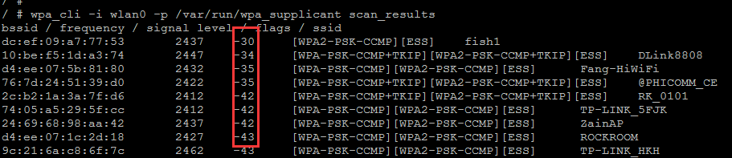

**注意：要确认扫描到的热点的个数是否匹配你周围的路由器大概个数，可以跟你手机扫描的Wi-Fi对比下（如果你的模组不支持5G，只对比2.4G的个数）；还有查看离你最近的路由器的的信号强度，如果路由器离你很近，但信号强度却非常弱（正常情况下：-20到-65；偏弱：-65到-70；差-70到-90），这时就要查下你的Wi-Fi模组是否有接天线，模组的RF指标是否合格等等（参考第5章节Wi-Fi/BT的硬件测试）。**

#### 连接路由器

方法一：

```c
//ctrl_interface接口配置，如果有修改的话对应wpa_cli命令-p参数要相应进行修改，wpa_cli –i wlan0 –p <ctrl_interface> xxx
vi /data/cfg/wpa_supplicant.conf
ctrl_interface=/var/run/wpa_supplicant  //默认不建议修改
ap_scan=1
update_config=1 //这个配置使wpa_cli命令配置的热点保存到conf文件里面（wpa_cli save_config）
//添加如下配置项
network={
        ssid="WiFi-AP"		// Wi-Fi名字
        psk="12345678"		// Wi-Fi密码
        key_mgmt=WPA-PSK	// 加密配置，不加密则改为：key_mgmt=NONE
}
//让wpa_supplicant进程重新读取上述配置，命令如下：
wpa_cli -i wlan0 -p /var/run/wpa_supplicant reconfigure
//发起连接：
wpa_cli -i wlan0 -p /var/run/wpa_supplicant reconnect
```

方法二：

最新sdk集成wifi_start.sh脚本，如果由这个脚本，则可以直接在脚本后面跟 ssid和password：

`wifi_start.sh fanxing 12345678`

方法三：

```powershell
#加密：
wpa_cli -i wlan0 -p /var/run/wpa_supplicant remove_network 0
wpa_cli -i wlan0 -p /var/run/wpa_supplicant ap_scan 1
wpa_cli -i wlan0 -p /var/run/wpa_supplicant add_network
wpa_cli -i wlan0 -p /var/run/wpa_supplicant set_network 0 ssid "dlink"
wpa_cli -i wlan0 -p /var/run/wpa_supplicant set_network 0 key_mgmt WPA-PSK
wpa_cli -i wlan0 -p /var/run/wpa_supplicant set_network 0 psk '"12345678"'
wpa_cli -i wlan0 -p /var/run/wpa_supplicant select_network 0
wpa_cli -i wlan0 -p /var/run/wpa_supplicant save_config # 保存上述配置到conf文件

#不加密:
wpa_cli -i wlan0 -p /var/run/wpa_supplicant remove_network 0
wpa_cli -i wlan0 -p /var/run/wpa_supplicant ap_scan 1
wpa_cli -i wlan0 -p /var/run/wpa_supplicant add_network
wpa_cli -i wlan0 -p /var/run/wpa_supplicant set_network 0 ssid "dlink"
wpa_cli -i wlan0 -p /var/run/wpa_supplicant set_network 0 key_mgmt NONE
wpa_cli -i wlan0 -p /var/run/wpa_supplicant select_network 0
wpa_cli -i wlan0 -p /var/run/wpa_supplicant save_config
```

连接成功：

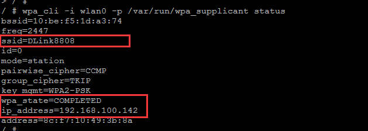

如果出现`wpa_state=COMPLETED`但没有出现有效的ip_address, 则检查下**dhcpcd**获取IP地址的进程是否有启动；如果wpa_state不为COMPLETED，则**先排查2.1.1扫描章节**。

### Wi-Fi AP热点验证

SDK集成了相关程序，执行：softapDemo apName （开启名为apName默认无加密的热点）即可开启热点模式.
代码及编译文件位置：

```shell
/external/softapDemo/src/main.c
buildroot/package/rockchip/softap/Config.in softap.mk
make softap-dirclean
make softap
```

RTL模组： 使用p2p0作为softap功能，通过内核驱动的配置生成p2p0，如果没有p2p0节点请检查这里的配置：

```diff
+++ b/drivers/net/wireless/rockchip_wlan/rtl8xxx/Makefile
@@ -1593,7 +1593,7 @@ endif
ifeq ($(CONFIG_PLATFORM_ARM_RK3188), y)
EXTRA_CFLAGS += -DCONFIG_PLATFORM_ANDROID
+EXTRA_CFLAGS += -DCONFIG_CONCURRENT_MODE
```

AP/海华模组： 使用wlan1作为softap功能，且使用iw命令去生成wlan1节点：

`iw phy0 interface add wlan1 type managed`

**调试及定制化修改：**

```c
//这里可以添加加密、修改IP地址及dns等相关信息，可自行修改
int wlan_accesspoint_start(const char* ssid, const char* password)
{
	//创建热点配置
	create_hostapd_file(ssid, password);
	//softap_name: wlan1/p2p0
	sprintf(cmdline, "ifconfig %s up", softap_name);
	//设置自定义IP地址
	sprintf(cmdline, "ifconfig %s 192.168.88.1 netmask 255.255.255.0", softap_name);
	//创建dns文件
	creat_dnsmasq_file();
}

//创建dns文件，要与你自定义的IP地址一致，否则会出现手机无法获取IP
bool creat_dnsmasq_file()
{
	FILE* fp;
	fp = fopen(DNSMASQ_CONF_DIR, "wt+");
	if (fp != 0) {
		fputs("user=root\n", fp);
		fputs("listen-address=", fp);
		fputs(SOFTAP_INTERFACE_STATIC_IP, fp);
		fputs("\n", fp);
		fputs("dhcp-range=192.168.88.50,192.168.88.150\n", fp);
		fputs("server=/google/8.8.8.8\n", fp);
		fclose(fp);
		return true;
	}
	DEBUG_ERR("---open dnsmasq configuarion file failed!!---");
	return true;
}

//创建AP热点配置文件，具体可咨询Wi-Fi厂家，这里的参数跟芯片规格有很大关系
int create_hostapd_file(const char* name, const char* password)
{
	FILE* fp;
	char cmdline[256] = {0};

	fp = fopen(HOSTAPD_CONF_DIR, "wt+");

	if (fp != 0) {
		sprintf(cmdline, "interface=%s\n", softap_name);
		fputs(cmdline, fp);
		fputs("ctrl_interface=/var/run/hostapd\n", fp);
		fputs("driver=nl80211\n", fp);
		fputs("ssid=", fp);
		fputs(name, fp);
		fputs("\n", fp);
		fputs("channel=6\n", fp);  // 信道设置
		fputs("hw_mode=g\n", fp);
		fputs("ieee80211n=1\n", fp);
		fputs("ignore_broadcast_ssid=0\n", fp);
#if 0  //如果选择加密，则修改这里
		fputs("auth_algs=1\n", fp);
		fputs("wpa=3\n", fp);
		fputs("wpa_passphrase=", fp);
		fputs(password, fp);
		fputs("\n", fp);
		fputs("wpa_key_mgmt=WPA-PSK\n", fp);
		fputs("wpa_pairwise=TKIP\n", fp);
		fputs("rsn_pairwise=CCMP", fp);
#endif
		fclose(fp);
		return 0;
	}
	return -1;
}

int main(int argc, char **argv)
	//根据WiFi型号设置对应的热点接口
	if (!strncmp(wifi_type, "RTL", 3))
		strcpy(softap_name, "p2p0");
	else
		strcpy(softap_name, "wlan1");

	... ...
	if (!strncmp(wifi_type, "RTL", 3)) {
		//Realtek模组打开共存模式后自动生成p2p0节点
		console_run("ifconfig p2p0 down");
		console_run("rm -rf /userdata/bin/p2p0");
		wlan_accesspoint_start(apName, NULL);
	} else {
		console_run("ifconfig wlan1 down");
		console_run("rm -rf /userdata/bin/wlan1");
		console_run("iw dev wlan1 del");
		console_run("ifconfig wlan0 up");
		//AP模组需要iw 命令生成wlan1节点做softap使用
		console_run("iw phy0 interface add wlan1 type managed");
		wlan_accesspoint_start(apName, NULL);
	}
```

**执行完命令后可以在手机的setting Wi-Fi界面下看到对应的AP，如果没有请排查：**

第一：首先确保上面提到的几个配置文件是否有配置正确；
第二：确认ifconfig是否有看到wlan1或p2p0节点；
第三：hostapd/dnsmasq进程是否有启动成功；

### BT 验证测试

首先确保dts要配置正确，以及对应的Buildroot配置是否正确，请参考第1章节，这里对常用的两类BT模组进行说明，在配置正确情况下，系统会生成一个**bt_pcba_test**(或者最新SDK会生成一个**bt_init.sh**)的脚本程序(参考1.4章节的编译配置文件)

**REALTEK模组**：

```powershell
/ # cat usr/bin/bt_pcba_test (bt_init.sh)
#!/bin/sh

killall rtk_hciattach

echo 0 > /sys/class/rfkill/rfkill0/state #下电
sleep 1
echo 1 > /sys/class/rfkill/rfkill0/state #上电
sleep 1
insmod /usr/lib/modules/hci_uart.ko 			# Realtek模组需要加载特定驱动
rtk_hciattach -n -s 115200 /dev/ttyS4 rtk_h5 & 	# 蓝色指的是蓝牙使用哪个uart口

#注意：每次启动测试时要先kill掉rtk_hciattach进程
```

**正基/海华模组**：

```powershell
/ # cat usr/bin/bt_pcba_test (bt_init.sh)
#!/bin/sh

killall brcm_patchram_plus1

echo 0 > /sys/class/rfkill/rfkill0/state  # 下电
sleep 2
echo 1 > /sys/class/rfkill/rfkill0/state  # 上电
sleep 2

brcm_patchram_plus1 --bd_addr_rand --enable_hci --no2bytes --use_baudrate_for_download  --tosleep  200000 --baudrate 1500000 --patchram  /system/etc/firmware/bcm43438a1.hcd /dev/ttyS4 &

#注意：每次启动测试时要先kill掉brcm_patchram_plus1进程
```

**bcm43438a1.hcd表示BT 对应型号Firmware文件，/dev/ttyS4是蓝牙使用哪个UART口。**

注意：`rtk_hciattach 、hci_uart.ko、bcm43438a1.hcd`等文件都是第1章节Buildroot配置选择正确的Wi-Fi/BT模组的前提下才会生成，如果没有这些文件请检查上述配置(参考1.4章节的编译配置文件)。

执行该脚本后，执行: **(注意：如果没有hciconfig命令，请在Buildroot配置选择BR2_PACKAGE_BLUEZ5_UTILS 编译并更新测试)**

`hciconfig hci0 up`
`hciconfig –a`

正常的情况下可以看到：

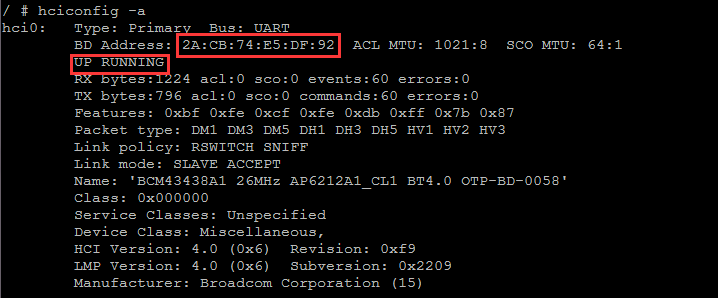

BT扫描：`hcitool scan`

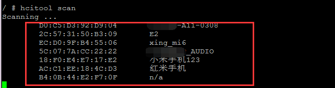

### Wi-Fi 休眠唤醒

目前Wi-Fi支持网络唤醒功能，例如：设备连接AP并获取IP地址，则当设备休眠后我们可以通过无线网络包（ping）唤醒系统，一般规则为：只要是发给本设备网络包都可唤醒系统。

修改wpa_supplicant.conf文件，添加如下配置：

```diff
wpa_supplicant.conf
ctrl_interface=/var/run/wpa_supplicant
update_config=1
ap_scan=1
+wowlan_triggers=any # 添加这个配置
```

Realtek Wi-Fi请检查对应驱动的Makefile里面是否有如下配置：

```diff
kernel/drivers/net/wireless/rockchip_wlan/rtl8xxx/Makefile
+CONFIG_WOWLAN = y
+CONFIG_GPIO_WAKEUP = y
```

DTS 配置：查看原理图确保 WIFI_WAKE_HOST (或 WL_HOST_WAKE ) PIN脚有接到主控，然后检查dts的如下配置是否正确：

```powershell
WIFI,host_wake_irq = <&gpio0 RK_PA0 GPIO_ACTIVE_HIGH>
```

测试系统及Wi-Fi休眠：

```powershell
dhd_priv setsuspendmode 1  # 仅针对正基海华模组，Realtek无需此命令
echo mem > /sys/power/state
```

此时同一局域网内的设备可以ping此设备，正常情况下可以看到系统被唤醒，注意系统唤醒后需要恢复Wi-Fi正常的工作状态：

```powershell
dhd_priv setsuspendmode 0 # 仅针对正基海华模组，Realtek无需此命令
```

排查：如果系统没有预期内唤醒，则请排查wake pin脚是否配置正确及电平状态是否正确，32.768k是否被关掉等等.

### Wi-Fi MONITOR模式

**正基/海华Wi-Fi**:

```powershell
#设置监听信道：
dhd_priv channel 6  //channal numbers

#打开 monitor模式：
dhd_priv monitor 1

#关闭 monitor模式：
dhd_priv monitor 0
```

**Realtek Wi-Fi**:

```powershell
#驱动Makefile需要打开：
+ CONFIG_WIFI_MONITOR = y

#打开wlan0并关闭p2p0
ifconfig wlan0 up
ifconfig p2p0 down

#打开监听模式
iwconfig wlan0 mode monitor
or
iw dev wlan0 set type monitor

#切换信道
echo "<chan> 0 0" > /proc/net/<rtk_module>/wlan0/monitor // <rtk_module> is the realtek wifi module name, such like rtl8812au, rtl8188eu ..etc
```

### Wi-Fi P2P验证

```powershell
#新建配置文件：p2p_supplicant.conf
ctrl_interface=/var/run/wpa_supplicant
update_config=1
device_name=p2p_name
device_type=10-0050F204-5
config_methods=display push_button keypad virtual_push_button physical_display
p2p_add_cli_chan=1
pmf=1

#启动：（先kill掉之前的）
wpa_supplicant -B -i wlan0 -c /tmp/p2p_supplicant.conf
wpa_cli
> p2p_find
>

#此时手机端打开p2p,可以搜索到上面的device_name=p2p_name，点击连接

#此时设备端显示 //下面是我的手机
> <3>P2P-PROV-DISC-PBC-REQ 26:31:54:8e:14:e7 p2p_dev_addr=26:31:54:8e:14:e7 pri_dev_type=10-0050F204-5 name='www' config_methods=0x188 dev_capab=0x25 group_capab=0x0

#设备端响应并下发连接命令，注意MAC地址要跟上面的一致
>p2p_connect 26:31:54:8e:14:e7 pbc go_intent=1

> p2p_connect 26:31:54:8e:14:e7 pbc go_intent=1
OK
<3>P2P-FIND-STOPPED
<3>P2P-GO-NEG-SUCCESS role=client freq=5200 ht40=0 peer_dev=26:31:54:8e:14:e7 peer_iface=26:31:54:8e:94:e7 wps_method=PBC
<3>P2P-GROUP-FORMATION-SUCCESS
<3>P2P-GROUP-STARTED p2p-wlan0-2 client ssid="DIRECT-24-www" freq=5200 psk=3d67671b71f7a171118c1ace34ae5e4bcc8e17394394e258be91f55b7ab63748 go_dev_addr=26:31:54:8e:14:e7 [PERSISTENT]
> #此时连接成功
> quit

ifconfig
p2p-wlan0-2 Link encap:Ethernet  HWaddr 82:C5:F2:2E:7F:89
          inet addr:192.168.49.220  Bcast:192.168.49.255  Mask:255.255.255.0
          UP BROADCAST RUNNING MULTICAST  MTU:1500  Metric:1
          RX packets:470 errors:0 dropped:0 overruns:0 frame:0
          TX packets:344 errors:0 dropped:0 overruns:0 carrier:0
          collisions:0 txqueuelen:1000
          RX bytes:71779 (70.0 KiB)  TX bytes:33829 (33.0 KiB)
#可以看到设备连接到手机，可以互相ping通则表示正常。
```

### 桥接功能

场景：Wi-Fi启动wlan0连接可以上网的AP，且配合3.2章节启动wlan1或p2p0做热点，使手机连接热点上网，配置如下，内核打开如下配置：

```diff
+CONFIG_NETFILTER=y
+CONFIG_NF_CONNTRACK=y
+CONFIG_NF_TABLES=y
+CONFIG_NF_TABLES_INET=y
+CONFIG_NF_CONNTRACK_IPV4=y
+CONFIG_IP_NF_IPTABLES=y
+CONFIG_IP_NF_NAT=y
+CONFIG_IP_NF_TARGET_MASQUERADE=y
+CONFIG_BRIDGE=y
```

执行下面两条命令启动桥接功能，下面IP地址为启动softap时配置的地址:

```shell
iptables -t nat -A POSTROUTING -s 192.168.43.0/24 -o wlan0 -j MASQUERADE
echo "1" > /proc/sys/net/ipv4/ip_forward
```

## Wi-Fi/BT 硬件RF指标

### 测试项目

**Wi-Fi/BT部分**

**比如：发射功率、EVM、晶体频偏、接收灵敏度等（需要专业仪器，可以联系模组厂或原厂协助）；**

示例：(b/g/n/ac)：

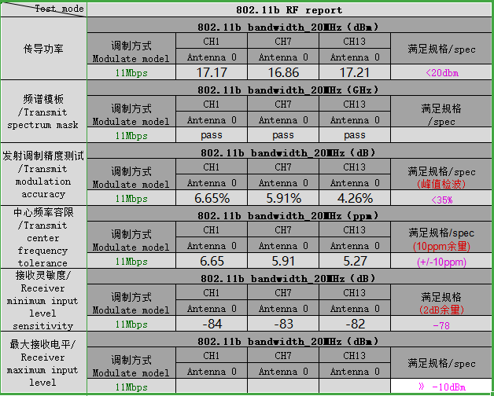

**天线部分**

**无源 S11，有源Wi-Fi天线整机的OTA测试（要去有专业设备的天线厂去测试，可以联系模组厂或原厂协助）；**

示例：

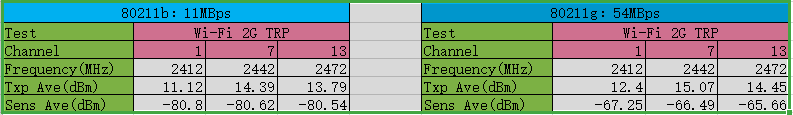

### 测试工具及方法

**下面提到的PDF/TXT文档在docs/linux/wifibt目录下查找，且如果客户没有专业测试仪器或者有测试疑问，请直接找模组厂协助。**

#### Realtek 测试

一般分为两种COB和模组，模组一般都是经过模组厂严格测试并出厂默认烧录校准好的数据到内部efuse，客户只需测试验证指标是否合格；而COB则自行设计Wi-Fi外围电路及添加器件，所以需要跟Realtek合作进行完整的RF校准测试，并集成校准好的数据到芯片的efuse里面或由驱动进行加载，具体请直接咨询模组厂。

**Wi-Fi测试：**

```
参考 Quick_Start_Guide_V6.txt, 特别注意里面的命令iwpriv统一换成rtwpriv。
```

**BT测试：**

 参考 MP tool user guide for linux20180319.pdf（里面的具体测试内容请咨询模组厂或者原厂）。

```powershell
# 注：执行测试前请先打开BT电源
echo 0 > sys/class/rfkill/rfkill0/state
sleep 1
echo 1 > sys/class/rfkill/rfkill0/state

# 特别注意：rtk_hciattach这个进程不能跑，如果有请杀掉killall rtk_hciattach

///////////
/ #
/ # rtlbtmp
:::::::::::::::::::::::::::::::::::::::::::::::::
:::::::: Bluetooth MP Test Tool Starting ::::::::

>
>
>enable uart:/dev/ttyS4   # 注意ttySX 对应实际硬件接的uart口
>
>> > enable[Success:0]
```

**当使用Realtek的COB方案时，如果需要把测试得到的校准数据map文件集成到驱动里面时，方法如下：**

```c
drivers/net/wireless/rockchip_wlan/rtl8xxx/core/efuse/rtw_efuse.c
#ifdef CONFIG_EFUSE_CONFIG_FILE
u32 rtw_read_efuse_from_file(const char *path, u8 *buf, int map_size)
{
	u32 i;
	u8 c;
	u8 temp[3];
	u8 temp_i;
	u8 end = _FALSE;
	u32 ret = _FAIL;

	u8 *file_data = NULL;
	u32 file_size, read_size, pos = 0;
	u8 *map = NULL;

	if (rtw_is_file_readable_with_size(path, &file_size) != _TRUE) {
		RTW_PRINT("%s %s is not readable\n", __func__, path);
		goto exit;
	}

	file_data = rtw_vmalloc(file_size);
	if (!file_data) {
		RTW_ERR("%s rtw_vmalloc(%d) fail\n", __func__, file_size);
		goto exit;
	}

	#if 0  //屏蔽掉这里
	read_size = rtw_retrieve_from_file(path, file_data, file_size);
	if (read_size == 0) {
		RTW_ERR("%s read from %s fail\n", __func__, path);
		goto exit;
	}
	... ...
	RTW_PRINT("efuse file:%s, 0x%03x byte content read\n", path, i);
	#endif

	//把模组厂提供的校准 “map文件” 改成数组形式，赋值给map即可。
	_rtw_memcpy(buf, map, map_size); //这里是map最终赋值给buf操作

	ret = _SUCCESS;

exit:
	if (file_data)
		rtw_vmfree(file_data, file_size);
	if (map)
		rtw_vmfree(map, map_size);

	return ret;
}
```

#### AP/CY测试

**Wi-Fi测试**

首先要更换为测试firmware：每一个AP模组对应的测试firmware都是不一样的，比如：

```
AP6236  -> fw_bcm43436b0_mfg.bin
AP6212A -> fw_bcm43438a1_mfg.bin
```

fw_bcmxxx_mfg.bin 和 APxxxx 要根据你的模组型号进行匹配，否则无法测试！所以先确认是否有对应型号的测试firmware，如果没有找模组厂提供即可。

最新SDK内置了支持型号的测试firmware，所以直接使用内置的测试脚本，使WiFi进入RF测试模式：

```shell
external\rkwifibt\wifi_ap6xxx_rftest.sh
#!/bin/sh
killall ipc-daemon netserver connmand wpa_supplicant
echo "Pull BT_REG_ON to Low"
echo 0 > /sys/class/rfkill/rfkill0/state
echo "Pull WL_REG_ON to Up"
echo 1 > /sys/class/rfkill/rfkill1/state
sleep 1
echo "update wifi test fw"
echo /vendor/etc/firmware/fw_bcmdhd_mfg.bin > /sys/module/bcmdhd/parameters/firmware_path
sleep 1
ifconfig wlan0 down
ifconfig wlan0 up
sleep 1
echo "wl ver"
wl ver
```

旧SDK没有内置测试firmware，下面以AP6236为例说明下：

```shell
# 把fw_bcm43436b0_mfg.bin push到data或其他可写分区，然后执行如下命令：(注意下面的路径)
mount --bind /data/fw_bcm43436b0_mfg.bin /system/etc/firmware/fw_bcm43436b0.bin
ifconfig wlan0 down
ifconfig wlan0 up
wl ver
```

正常的话执行`wl ver`会打印一串字符，里面有WL_TEST字样，表示进入测试模式，具体的测试参考：

```
Wi-Fi RF Test Commands for Linux-v03.pdf
```

**蓝牙测试**

执行bt_init.sh脚本（SDK自带脚本，参考3.3章节）后，执行**(注意：如果没有hciconfig命令，请在Buildroot配置选择BR2_PACKAGE_BLUEZ5_UTILS 编译并更新测试)**：

```powershell
hciconfig hci0 up
hciconfig -a
```

如果有出现hci0节点就表示初始化完成，如果没有出现有两种可能：

1. 蓝牙dts配置异常或硬件异常或者uart口配置错误，导致初始化失败；

2. 蓝牙firmware文件配置错误或者没有该文件；

请参考1/2章节的BT相关的进行排查；

具体测试指令请参考：

```
BT RF Test Commands for Linux-v05.pdf #文档里面测试1/2步都在脚本里面执行过了，无需再执行）
```

### 报告

请硬件确认完以上测试后，请整理一份测试报告出来，在遇到性能或稳定性时问题时需要提供报告给我们。

## Wi-Fi 性能测试

**使用iperf测试性能**

**注意两个影响性能的点：**

- 一定要完成Wi-Fi的RF测试及天线的OTA测试后，确保指标没有问题再测试性能，否在无意义；
- 如果发现数据波动较大，请到空旷或地下室等干扰小的地方确认（最好在屏蔽室测试）；

测试环境：**由于开放环境下干扰因素比较大，建议在屏蔽室环境下测试**，首先确保Wi-Fi可以正常连接到AP并获取到IP地址；
测试点：吞吐率的大小，以及稳定性、是否有上下波动等等；
路由器信道：要选择低、中、高信道分别进行测试， 比如1/6/11信道：

```powershell
# TCP
下行：
	板子端：iperf -s -i 1
	电脑：iperf -c xxxxxxx(板子的IP地址) -i 1 -w 2M -t 120

上行：
	电脑：iperf -s -i 1
	板子端：iperf -c xxxxxxx(电脑的IP地址) -i 1 -w 2M -t 120

# UDP
下行：
	板子端：iperf -s -u -i 1
	电脑：iperf -c xxxxxxx(板子的IP地址) -u -i 1 -b 100M -t 120

上行：
	电脑：iperf -s -u -i 1
	板子端：iperf -c xxxxxxx(电脑的IP地址) -u -i 1 -b 100M -t 120

# 注意：板子的iperf命令要在Buildroot端进行配置：BR2_PACKAGE_IPERF = y
```

## Wi-Fi/BT 问题排查

### Wi-Fi 问题

#### Wi-Fi 初始化失败且没有出现wlan0节点

如下图，按照标号依次测量对应PIN脚的电平状态及clk频率是否正确（**注：SDIO3.0模式必须为1.8V**）：

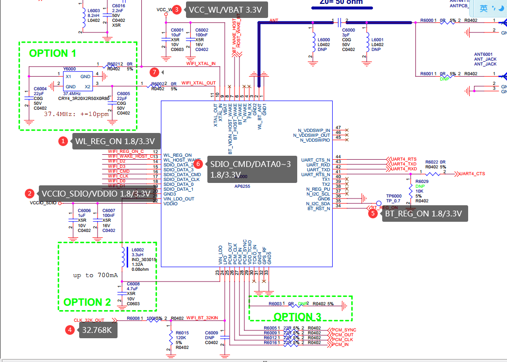

1. WL_REG_ON：DTS配置错误，导致不可控，**可用示波器测试波形，查看是否有被拉低拉高，电压幅值是否符合要求；**

2. WIFI_WAKE_HOST： **PIN脚**配置错误或**电平状态**配置错误；

3. SDIO_CMD/SDIO_DATA0~3：**必须为3.3V或1.8V**；

4. VDDIO_SDIO：**供电电平不对； 或电源域配置不对（参考1.1章节IO电源域配置）**；

5. VCC_WL/VBAT/VDDIO_SDIO**电源不对或纹波太大**：

```
  [ 6.173685] mmc_host mmc0: Bus speed (slot 0) = 50000000Hz (slot req
  50000000Hz, actual 50000000HZ div = 0)
  [ 6.173771] rk_sdmmc: BOOT dw_mci_setup_bus: argue clk_mmc workaround out
  normal clock [mmc0]
  [ 6.175555] rk_sdmmc: BOOT Bus speed=50000000Hz,Bus width=4bits.[mmc0]
  [ 6.177736] mmc0: new high speed SDIO card at address 0001
  [ 6.179469] RTL871X: ### rtw_hal_ops_check - Error : Please hook
  HalFunc.read_chip_version ###
  [ 6.179549] RTL871X: ### rtw_hal_ops_check - Error : Please hook
  HalFunc.init_default_value ###
  [ 6.179593] RTL871X: ### rtw_hal_ops_check - Error : Please hook
  HalFunc.intf_chip_configure ###
  [ 6.179627] RTL871X: ### rtw_hal_ops_check - Error : Please hook
  HalFunc.read_adapter_info ###
  [ 6.179666] RTL871X: ### rtw_hal_ops_check - Error : Please hook
  HalFunc.hal_power_on ###
  [ 6.179702] RTL871X: ### rtw_hal_ops_check - Error : Please hook
  HalFunc.hal_power_off ###
```

6. CLK_32K_OUT：

**32.768K没有波形、或者波形幅度或精度不准 （0.7 * VDDIO ~ VDDIO）**；

```powershell
  #无32k的异常log：
  [   11.068180] dhdsdio_htclk: HT Avail timeout (1000000): clkctl 0x50
  [   11.074372] dhd_bus_init: clock state is wrong. state = 1
  [   12.078468] dhdsdio_htclk: HT Avail timeout (1000000): clkctl 0x50
  [   12.086051] dhd_net_bus_devreset: dhd_bus_devreset: -1
```

7. SDMMC_CLK/CMD/DATAXXX **PCB走线异常或接触不良和焊接不良导致初始化不了或跑着不了高频，可以适当降低频率确认（修改&sdio节点下的max-frequency ）**：

```powershell
  # 异常log1，比如下载firmware失败等类似的数据通信异常的log：
  [  272.947090] sdioh_buffer_tofrom_bus: TX FAILED ede95000,addr=0x08000, pkt_len=1968, ERR=-84
  [  273.504437] _dhdsdio_download_firmware: dongle image file download failed
  [  273.512210] dhd_bus_devreset Failed to download binary to the donglesdio

  # 异常log2
  [    9.007297] dwmmc_rockchip 30120000.rksdmmc: Busy; trying anyway
  [    9.008401] sdioh_buffer_tofrom_bus: RX FAILED c52ce000,addr=0x0f154, pkt_len=3752, ERR=-5
  [    9.008425] dhdsdio_membytes: membytes transfer failed
  [    9.008488] bcmsdh_sdmmc: Failed to Write byte F1:@0x1000a=00, Err: -5
  [    9.009523] bcmsdh_sdmmc: Failed to Write byte F1:@0x1000a=00, Err: -5
  [    9.010564] bcmsdh_sdmmc: Failed to Write byte F1:@0x1000a=00, Err: -5
  [    9.010583] dhdsdio_membytes: FAILED to set window back to 0x18100000

  # 从log中看下sdio目前跑的频率：
  mmc_host mmc1: Bus speed (slot 0) = 148500000Hz (slot req 150000000Hz, actual 148500000HZ div = 0)

  # 修改频率的方法：
  &sdio {
  +	max-frequency = <50000000>;   # 修改这里，限制频率
```

8. log 出现 `sdio host isn't initialization successfully`：

```
  # 两种可能性：
  &sdio 节点未打开
  &sdio_pwrseq 节点里面的clk属性配置错误
  # 以上两种错误会导致sdio初始化异常
```

9. 模组/芯片为不良品导致，可以更换新模组或新板子验证。

10. WAKE UP PIN配置错误或电平状态配置错误：

```
  [   10.432165] dhd_bus_rxctl: resumed on timeout, INT status=0x208000C0
  [   10.433207] dhd_bus_rxctl: rxcnt_timeout=1, rxlen=0
```

11. firmware文件不存在导致异常，请排查配置或编译问题：

```
   [3.514050] [dhd] dhd_conf_set_path_params : Final clm_path=/vendor/etc/firmware/clm_bcm43438a1.blob
   [3.514067] [dhd] dhd_conf_set_path_params : Final conf_path=/vendor/etc/firmware/config.txt
   [3.515918] dhdsdio_download_code_file: Open firmware file failed /vendor/etc/firmware/fw_bcm43438a1.bin
   [3.515954] _dhdsdio_download_firmware: dongle image file download failed
```

12. 如果以上排查不出问题，请在Redmine系统上传：dts/dtsi配置，内核完整log dmesg，pdf原理图等文件，以及下面两种情况的波形图：
    - 开机时WIFI_REG_ON和WIFI_CMD的上电波形；
    - 开机时WIFI_REG_ON和WIFI_CLK的上电波形；
    - 如果3根可以同时抓那最好；

#### Wi-Fi无法连接路由器或断线或连接不稳定

这类问题基本都是WiFi芯片或者模块的RF、天线指标不合格导致的，确认方法如下：

1. 首先找硬件工程师要WiFi RF指标及天线整机OTA测试合格的报告，确保硬件指标正常（**发射功率、EVM、晶体频偏、接收灵敏度**）；

2. 做个基本的扫描对比：测试设备和手机放在距离路由器的同一位置，通过扫描的AP的个数及其信号强度 **跟手机（或相同规格的竞品）做对比** 来初步判定硬件指标是否正常，扫描方法参考2.1.1章，这里说明下如何跟手机做对比（如下图所示），通过对比跟手机扫描的**热点数量及信号强度**来初步判定硬件指标是否合格；

   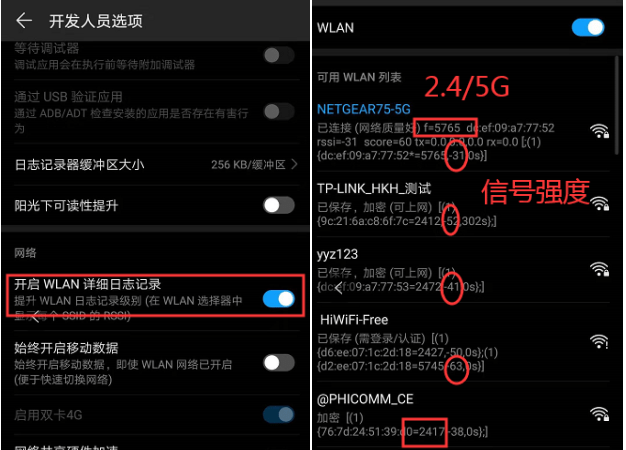

3. 排除干扰因素，比如当前环境下有非常多2.4/5G的无线设备在同时连接，使得当前环境干扰很大时，则可以把测试设备和**对比手机（或相同规格的竞品）**放在同一位置，如果都会出现异常，则可判断为干扰，如果手机正常，则可判定是硬件指标异常；

4. 排除距离因素，距离太远导致信号弱（通过扫描wpa_cli scan/scan_r，连接的AP信号强度为-68~-90之间），进而导致通信失败，可以拉近两者的距离来确认；

5. 排除路由器兼容性问题，可以更换不同厂家型号的路由器确认；

6. 排除单板异常问题，可以拿二到三台机器做对比测试；

7. 如果以上都排查都无法解决问题，请提供详细复现步骤和内核log（参考5.4章节）;

8. 有时配置用户错误的ssid名字错误导致连不上，请检查下wpa_supplicant.conf的配置的ssid是否正确；

9. 如果上述排查都正常：
    - 直接找模组厂或Wi-Fi原厂协助，他们有专业的抓包仪器抓空中包，能快速定位问题；
    - 或寄一台有问题的板子给我们确认；

#### 联网慢或获取IP地址慢

这些一般都是RF指标或者天线指标不达标造成的，先检查第3章节确保指标合格，然后提供完整的内核log(dmesg，根据8.9章节打开驱动debug选项，抓取完整log)并上传至Redmine。

#### 获取不到IP地址或IP地址冲突

请确认dhcpcd或udhcpc进程是否有启用；

dhcpcd：SDK默认使用，随系统启动而启动，它是功能比较完整的dhcp客户端；

udhcpcd：是busybox的精简的dhcp客户端；

**注意：这两个进程一定不要同时启用，只能使用其中一个！**

#### 系统休眠后被Wi-Fi频繁唤醒

排除以下几种情况：

1. 休眠后WiFi模组的32.768k被关闭 （适用32.768k是外面供的情况）；
2. WIFI_WAKE_HOST PIN硬件不稳定/或焊接不稳定，导致电平抖动（正常情况下都是低电平，触发为高电平）；
3. AP/CY模组WiFi休眠前后没有执行如下特定命令来过滤广播或组播包：

```shell
#休眠前执行：
dhd_priv setsuspendmode 1
#唤醒后执行：
dhd_priv setsuspendmode 0
```

#### PING 不通或概率延迟很大

1. 大概率是WiFi在执行扫描操作，导致ping延迟很大；
2. 路由器或者设备禁ping，可以用其他设备做对比实验；

#### 修改Wi-Fi原始驱动配置导致的异常

经常有收到一些奇怪的问题，排查发现客户自己修改了一些Wi-Fi/BT的驱动配置导致异常，所以请先检查自己是否有修改过原始代码，如果有先回退确认，修改的地方及原因可以通过Redmine发给我们确认。

#### Realtek Wi-Fi SDIO 3.0异常

当使用高端的比如：RTL8821CS等支持3.0模块时，概率初始化不过，异常log如下：

```c
Line 969: [    1.916211] mmc_host mmc1: Bus speed (slot 0) = 400000Hz (slot req 400000Hz, actual 400000HZ div = 0)
Line 1239: [    1.949247] mmc_host mmc1: Voltage change didn't complete
Line 1294: [    1.951085] mmc1: error -5 whilst initialising SDIO card
```

请打上以下补丁：

```diff
diff --git a/drivers/mmc/core/sdio.c b/drivers/mmc/core/sdio.c
index 2046eff..6626752 100644
--- a/drivers/mmc/core/sdio.c
+++ b/drivers/mmc/core/sdio.c
@@ -646,7 +646,7 @@ static int mmc_sdio_init_card(struct mmc_host *host, u32 ocr,
* try to init uhs card. sdio_read_cccr will take over this task
* to make sure which speed mode should work.
*/
- if (!powered_resume && (rocr & ocr & R4_18V_PRESENT)) {
+ /*if (!powered_resume && (rocr & ocr & R4_18V_PRESENT)) {
		err = mmc_set_uhs_voltage(host, ocr_card);
		if (err == -EAGAIN) {
			mmc_sdio_resend_if_cond(host, card);
@@ -655,7 +655,10 @@ static int mmc_sdio_init_card(struct mmc_host *host, u32 ocr,
		} else if (err) {
			ocr &= ~R4_18V_PRESENT;
		}
- }
+ }*/
+
+ ocr &= R4_18V_PRESENT;

/*
* For native busses: set card RCA and quit open drain mode

```

#### 扫描不到任何AP

1. 检查模组对应的晶振是否跟芯片的要求的一致，比如WiFi要求24M，但接了一个37M的；
2. 晶振32.768k的精度是否符合要求；

#### 双Wi-Fi_AP+RTL 异常

接两个Wi-Fi，一个是sdio接口的AP6xxx，另一个是USB接口的RTL8xxxu；kernel启动后，两个初始化都正常，当执行RTLxxx模块接口的down操作时，kernel挂掉。

```diff
diff --git a/drivers/net/wireless/rockchip_wlan/rkwifi/bcmdhd/wl_cfg80211.c b/drivers/net/wireless/rockchip_wlan/rkwifi/bcmdhd/wl_cfg80211.c
index f4838a8..ceb2a00 100644
--- a/drivers/net/wireless/rockchip_wlan/rkwifi/bcmdhd/wl_cfg80211.c
+++ b/drivers/net/wireless/rockchip_wlan/rkwifi/bcmdhd/wl_cfg80211.c
@@ -14640,6 +14640,9 @@ wl_cfg80211_netdev_notifier_call(struct notifier_block * nb,
 	if (!wdev || !cfg || dev == bcmcfg_to_prmry_ndev(cfg))
 		return NOTIFY_DONE;

+	if(strncmp(dev->name, "wlan0",strlen("wlan0"))) {
+		return NOTIFY_DONE;
+	}
```

### 蓝牙问题

#### Realtek初始化失败

1. dts配置不对、或hci_uart.ko没有正确编译、firmware没有被正确拷贝，比如RTL8723DS初始化时会用到如下文件，请检查以下文件是否存在：

```powershell
/usr/lib/modules/hci_uart.ko
/lib/firmware/rtlbt/rtl8723d_fw
/lib/firmware/rtlbt/rtl8723d_config
```

2. 很多初始化识别异常是由于硬件接法不正确导致的：

```powershell
#对于直接使用Realtek蓝牙的COB芯片：UART接口的硬件接法如下：
	//Make sure your UART setting is correct.
	host tx  - controller rx
    host rx  - controller tx
    host rts - controller cts
    host cts - ground   #主控cts要接地

	#for RTL8822C 这个模组比较特殊，4线都要跟主控连接
	host tx  - controller rx
    host rx  - controller tx
    host rts - controller cts
 	host cts - controller rts

#对于模组而言，模组厂一般会把controller rts内部接地，所以主控侧就不用接地，直接连接到controller rts即可。注意：realtek有大量的代理商每家模组做的可能都不一样，所以要跟模组厂确认，如果controller rts没有接地，则需要主控接地。
 	host tx  - controller rx
    host rx  - controller tx
    host rts - controller cts
 	host cts - controller rts
```

3. firmware文件不对或根本没有相应文件，跟上面的类似也是编译配置问题导致，下面是一些型号所对应的firmware名称和路径，注意USB即可的蓝牙的firmware路径比较特殊。

|   Chip    | I/F for BT driver | FW/Config Path       | FW Filename  | Config Filename  |
| :-------: | :---------------: | -------------------- | ------------ | ---------------- |
| RTL8723DS |       UART        | /lib/firmware/rtlbt/ | rtl8723d_fw  | rtl8723d_config  |
| RTL8821CS |       UART        | /lib/firmware/rtlbt/ | rtl8821c_fw  | rtl8821c_config  |
| RTL8821CU |        USB        | /lib/firmware/       | rtl8821cu_fw | rtl8821cu_config |

**请仔细参考第1/2章节关于蓝牙和编译更新的描述进行排查！**

#### 使用deviceio开发蓝牙时异常

1. 蓝牙初始化失败一直打印如下log：

```powershell
‘uipc_cl_socket_connect: connect(/data/bsa/config/./bt-daemon-socket) failed(No such file or directory)’
```

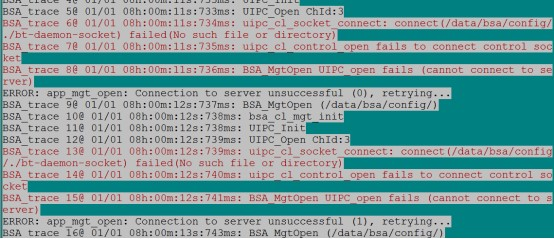

2. 蓝牙不稳定，蓝牙启动成功后，放置一段时间或操作过程中，突然出现如下disconnect form server log：

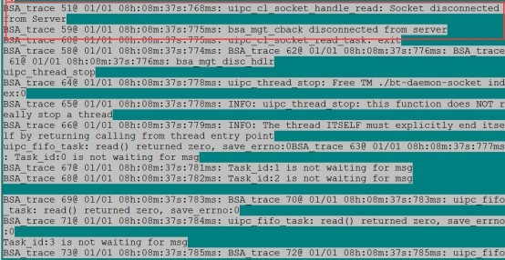

3. Realtek模组蓝牙初始化失败：

```powershell
“Can't open serial port, 2, No such file or directory” log
```

4. 出现如下log：

```powershell
[BT_OPEN]  bt_init.sh not exist !!!
```

**原因只有以下几种可能：**

1. rkwifibt 模组型号或串口配置错误，log初始化时会打印firmware 名字和ttySx，请参考第1/2章节关于蓝牙和编译的描述进行排查；

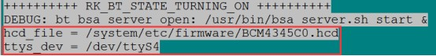

2. 使用deviceio bt init 之前，bt_init.sh脚本启动了brcm_patchram_plus1/rtk_hciattach，先杀掉这些进程再使用Deviceio：`killall brcm_patchram_plus1 killall rtk_hciattach`；

3. bsa配置编译错误：使用的正基的模组，但是编译了cypress_bsa；或者使用海华模组，编译了broadcom_bsa。

## 新模块移植或旧模块驱动更新

**特别注意：**

- **强烈建议阅读及理解1.5章节的文件存放规则及编译规则，这对移植至关重要务必熟悉编译规则；**
- **客户拿到的SDK可能比较旧，所以Config.in和rkwifibt.mk的规则可能有变化但原理都是一样的；**
- **对更新驱动的情况，下面有些步骤可以根据实际情况省略。**

### Realtek模块

#### Wi-Fi 部分

下面以RTL8821CS为例：

首先找模组厂或原厂拿到对应的移植包：

```
20171225_RTL8821CS_WiFi_linux_v5.2.18_25830_BT_ANDROID_UART_COEX_8821CS-B1d1d_COEX20170908-1f1f
```

**Wi-Fi驱动部分**，进到如下目录：

```
WiFi\RTL8821CS_WiFi_linux_v5.2.18_25830_COEX20170908-1f1f.20171225\driver
```

- 修改Makefile

```makefile
#改为RK平台：
CONFIG_PLATFORM_I386_PC = n
CONFIG_PLATFORM_ARM_RK3188 = y

#RK平台需要去掉以下配置：
ifeq ($(CONFIG_PLATFORM_ARM_RK3188), y)
-EXTRA_CFLAGS += -DRTW_SUPPORT_PLATFORM_SHUTDOWN #删掉这个配置
MODULE_NAME := 8821cs  #修改ko的名字

#如果有WiFi休眠保持连接需求，打开如下配置
CONFIG_WOWLAN = y
CONFIG_GPIO_WAKEUP = y
```

- 增加WAKE UP PIN脚配置

```diff
#修改 platform\platform_ops.c
+#include <linux/rfkill-wlan.h>
+extern unsigned int oob_irq;
int platform_wifi_power_on(void)
{
	int ret = 0;

+	oob_irq = rockchip_wifi_get_oob_irq();  //这里对应dts的WIFI_WAKE_HOST PIN脚

	return ret;
}
```

- 自定义MAC地址需求

```diff
# 修改：core\rtw_ieee80211.c
# include <linux/rfkill-wlan.h> //添加头文件
# 找到rtw_macaddr_cfg函数
void rtw_macaddr_cfg(u8 *out, const u8 *hw_mac_addr)
-/* Use the mac address stored in the Efuse */
-if (hw_mac_addr) {
-	rtw_memcpy(mac, hw_mac_addr, ETH_ALEN);
-	goto err_chk;
-}

+ /* Use the mac address stored in the Efuse */
+ if (hw_mac_addr) {
+ 	_rtw_memcpy(mac, hw_mac_addr, ETH_ALEN);
+ }

+ if (!rockchip_wifi_mac_addr(mac)) {
+ 	printk("get mac address from flash=[%02x:%02x:%02x:%02x:%02x:%02x]\n", mac[0], mac[1],
+ 		mac[2], mac[3], mac[4], mac[5]);
+ 	}
+ }
```

- 增加驱动加载入口

```c
//os_dep\linux\sdio_intf.c
//在该文件的最后加上如下代码：
#include "rtw_version.h"
#include <linux/rfkill-wlan.h>
extern int get_wifi_chip_type(void);
extern int rockchip_wifi_power(int on);
extern int rockchip_wifi_set_carddetect(int val);

int rockchip_wifi_init_module_rtkwifi(void)
{
#ifdef CONFIG_WIFI_LOAD_DRIVER_WHEN_KERNEL_BOOTUP
	int type = get_wifi_chip_type();
	if (type < WIFI_AP6XXX_SERIES || type == WIFI_ESP8089) return 0;
#endif
	printk("\n");
	printk("=======================================================\n");
	printk("==== Launching Wi-Fi driver! (Powered by Rockchip) ====\n");
	printk("=======================================================\n");
	printk("Realtek 8XXX SDIO WiFi driver (Powered by Rockchip,Ver %s) init.\n", DRIVERVERSION);

	rockchip_wifi_power(1);
	rockchip_wifi_set_carddetect(1);

	return rtw_drv_entry();
}

void rockchip_wifi_exit_module_rtkwifi(void)
{
#ifdef CONFIG_WIFI_LOAD_DRIVER_WHEN_KERNEL_BOOTUP
	int type = get_wifi_chip_type();
	if (type < WIFI_AP6XXX_SERIES || type == WIFI_ESP8089) return;
#endif
	printk("\n");
	printk("=======================================================\n");
	printk("==== Dislaunching Wi-Fi driver! (Powered by Rockchip) ====\n");
	printk("=======================================================\n");
	printk("Realtek 8XXX SDIO WiFi driver (Powered by Rockchip,Ver %s) init.\n", DRIVERVERSION);

	rtw_drv_halt();

	rockchip_wifi_set_carddetect(0);
	rockchip_wifi_power(0);

}

#ifdef CONFIG_WIFI_BUILD_MODULE
module_init(rockchip_wifi_init_module_rtkwifi);
module_exit(rockchip_wifi_exit_module_rtkwifi);
#else
#ifdef CONFIG_WIFI_LOAD_DRIVER_WHEN_KERNEL_BOOTUP
late_initcall(rockchip_wifi_init_module_rtkwifi);
module_exit(rockchip_wifi_exit_module_rtkwifi);
#else
EXPORT_SYMBOL(rockchip_wifi_init_module_rtkwifi);
EXPORT_SYMBOL(rockchip_wifi_exit_module_rtkwifi);
#endif
#endif

//这里屏蔽掉下面，注意把下面两个函数的入口__init __exit 删掉
//module_init(rtw_drv_entry);
//module_exit(rtw_drv_halt);
```

- 添加对应编译配置（更新驱动的情况无需此操作）

```diff
drivers/net/wireless/rockchip_wlan/Makefile
+ obj-$(CONFIG_RTL8821CS) += rtl8821cs/

drivers/net/wireless/rockchip_wlan/Kconfig
+ source "drivers/net/wireless/rockchip_wlan/rtl8821cs/Kconfig"
```

- 添加型号的识别函数（更新驱动的情况无需此操作）

```diff
diff --git a/drivers/net/wireless/rockchip_wlan/wifi_sys/rkwifi_sys_iface.c b/drivers/net/wireless/rockchip_wlan/wifi_sys/rkwifi_sys_iface.c
index 88db4de..2e3679a 100755
--- a/drivers/net/wireless/rockchip_wlan/wifi_sys/rkwifi_sys_iface.c
+++ b/drivers/net/wireless/rockchip_wlan/wifi_sys/rkwifi_sys_iface.c
@@ -133,6 +133,11 @@ static ssize_t wifi_chip_read(struct class *cls, struct class_attribute *attr, c

+   if (type == WIFI_RTL8821CS) {
+        count = sprintf(_buf, "%s", "RTL8821CS");
+        printk("Current WiFi chip is RTL8821CS.\n");
+   }
+
	if(type == WIFI_ESP8089) {
		count = sprintf(_buf, "%s", "ESP8089");
		printk("Current WiFi chip is ESP8089.\n");
diff --git a/include/linux/rfkill-wlan.h b/include/linux/rfkill-wlan.h
index 4218b84..698b685 100755
--- a/include/linux/rfkill-wlan.h
+++ b/include/linux/rfkill-wlan.h
@@ -73,6 +73,7 @@ enum {
	WIFI_RTL8189ES,
	WIFI_RTL8189FS,
	WIFI_RTL8812AU,
+ 	WIFI_RTL8821CS,
	WIFI_RTL_SERIES,
	WIFI_ESP8089,
	WIFI_MVL88W8977,
diff --git a/net/rfkill/rfkill-wlan.c b/net/rfkill/rfkill-wlan.c
index a17810d..7bbce01 100755
--- a/net/rfkill/rfkill-wlan.c
+++ b/net/rfkill/rfkill-wlan.c
@@ -156,6 +156,8 @@ int get_wifi_chip_type(void)
		type = WIFI_RTL8189FS;
	} else if (strcmp(wifi_chip_type_string, "rtl8812au") == 0) {
		type = WIFI_RTL8812AU;
+   } else if (strcmp(wifi_chip_type_string, "rtl8821cs") == 0) {
+       type = WIFI_RTL8821CS;
	} else if (strcmp(wifi_chip_type_string, "esp8089") == 0) {
		type = WIFI_ESP8089;
	} else if (strcmp(wifi_chip_type_string, "mvl88w8977") == 0) {
```

- 可能的编译报错处理

```diff
rtl8xxx\os_dep\linux\rtw_android.c //屏蔽如下两条语句
#if (LINUX_VERSION_CODE >= KERNEL_VERSION(2, 6, 39)) || defined(COMPAT_KERNEL_RELEASE)
void *wifi_get_country_code(char *ccode)
{
	RTW_INFO("%s\n", __FUNCTION__);
	if (!ccode)
		return NULL;
-	if (wifi_control_data && wifi_control_data->get_country_code)
-		return wifi_control_data->get_country_code(ccode);
	return NULL;
}
#endif /* (LINUX_VERSION_CODE >= KERNEL_VERSION(2, 6, 39)) */
```

**Buildroot部分**（更新驱动的情况无需此操作）

```diff
buildroot\package\rockchip\rkwifibt\Config.in
依次添加如下内容：
+config BR2_PACKAGE_RKWIFIBT_RTL8821CS
+    bool "RTL8821CS"

config BR2_PACKAGE_RKWIFIBT_CHIPNAME
+	default "RTL8821CS" if BR2_PACKAGE_RKWIFIBT_RTL8821CS

config BR2_PACKAGE_RKWIFIBT_VENDOR
+	default "REALTEK" if BR2_PACKAGE_RKWIFIBT_RTL8821CS

config BR2_PACKAGE_RKWIFIBT_WIFI_KO
+	default "8821cs.ko" if BR2_PACKAGE_RKWIFIBT_RTL8821CS #这里的ko名字跟Makefile里面的对应
```

#### BT蓝牙部分

##### UART接口

如果对应的模组支持蓝牙，则需要找原厂提供类似如下软件包：

```
Linux_BT_UART_v3.10_20181226_8723DS_BTCOEX_20181226-slave
```

下面以RTL8723DS为例（更新驱动的情况只需替换对应文件即可）：

```shell
#目录下有个8723D文件夹里面有蓝牙的firmware及配置文件（rtl8723d_config / rtl8723d_fw），放置到如下目录：
ls
external/rkwifibt/realtek/
#结构如下：
external/rkwifibt/realtek/RTL8723DS$ tree
├── mp_rtl8723d_config  #mp开头的文件为蓝牙的RF测试文件，直接找模组厂要，否则无法测试蓝牙的RF指标
├── mp_rtl8723d_fw
├── rtl8723d_config
└── rtl8723d_fw

#注意：重命名RTL8723DS目录的命令规则要跟上面WiFi的Config.in里面的配置一致：BR2_PACKAGE_RKWIFIBT_RTL8723DS
```

Buildroot部分（更新驱动的情况无需此操作）

```diff
config BR2_PACKAGE_RKWIFIBT_BT_EN
+	default "ENABLE" if BR2_PACKAGE_RKWIFIBT_RTL8723DS
```

##### USB接口

如果使用USB接口的蓝牙，则原厂会提供如下类似移植包：

```shell
tree
Linux_BT_USB_v3.10_20190430_8821CU_BTCOEX_20190509-4139
|-8821CU  //firmware文件
|-bluetooth_usb_driver //usb驱动
```

在rkwfiibt.mk里面增加编译ko选项及安装install命令，如下：

```diff
+++ b/package/rockchip/rkwifibt/rkwifibt.mk
@@ -73,6 +73,7 @@ define RKWIFIBT_REALTEK_BT_INSTALL
	$(INSTALL) -D -m 0644 $(@D)/realtek/$(BR2_PACKAGE_RKWIFIBT_CHIPNAME)/mp_* $(TARGET_DIR)/lib/firmware/
	$(INSTALL) -D -m 0755 $(@D)/bt_realtek* $(TARGET_DIR)/usr/bin/
	$(INSTALL) -D -m 0644 $(@D)/realtek/bluetooth_uart_driver/hci_uart.ko $(TARGET_DIR)/usr/lib/modules/hci_uart.ko
+    $(INSTALL) -D -m 0644 $(@D)/realtek/bluetooth_usb_driver/rtk_btusb.ko $(TARGET_DIR)/usr/lib/modules/rtk_btusb.ko
	$(INSTALL) -D -m 0755 $(@D)/bt_load_rtk_firmware $(TARGET_DIR)/usr/bin/
	$(SED) 's/BT_TTY_DEV/\/dev\/$(BT_TTY_DEV)/g' $(TARGET_DIR)/usr/bin/bt_load_rtk_firmware
	$(INSTALL) -D -m 0755 $(TARGET_DIR)/usr/bin/bt_load_rtk_firmware $(TARGET_DIR)/usr/bin/bt_pcba_test
@@ -92,8 +93,10 @@ define RKWIFIBT_BUILD_CMDS
	$(TARGET_CC) -o $(@D)/brcm_tools/brcm_patchram_plus1 $(@D)/brcm_tools/brcm_patchram_plus1.c
	$(TARGET_CC) -o $(@D)/brcm_tools/dhd_priv $(@D)/brcm_tools/dhd_priv.c
	$(TARGET_CC) -o $(@D)/src/rk_wifi_init $(@D)/src/rk_wifi_init.c
	$(MAKE) -C $(@D)/realtek/rtk_hciattach/ CC=$(TARGET_CC)
	$(TARGET_CONFIGURE_OPTS) $(MAKE) -C $(TOPDIR)/../kernel/ M=$(@D)/realtek/bluetooth_uart_driver ARCH=$(RK_ARCH)
+    $(TARGET_CONFIGURE_OPTS) $(MAKE) -C $(TOPDIR)/../kernel/ M=$(@D)/realtek/bluetooth_usb_driver ARCH=$(RK_ARCH)

```

### AP正基模组

下面以AP6256为例，找模组厂要AP6256的Wi-Fi和BT的firmware文件包（更新驱动的情况只需替换对应文件即可）：

```c
external\rkwifibt\firmware\broadcom\
//在该目录下创建名为AP6256的文件夹，并把里面的文件按照如下结构存放
external/rkwifibt/firmware/broadcom/AP6256$ tree
├── bt
│   └── BCM4345C5.hcd
└── wifi
    ├── fw_bcm43456c5_ag.bin
    ├── fw_bcm43456c5_ag_mfg.bin
    └── nvram_ap6256.txt
//注意 AP6256目录名字，要跟下面WiFi的Config.in里面的配置一致：BR2_PACKAGE_RKWIFIBT_AP6256
```

Buildroot配置（更新驱动的情况无需此操作）：

```diff
buildroot\package\rockchip\rkwifibt\Config.in
依次添加如下内容：
+config BR2_PACKAGE_RKWIFIBT_AP6256
+   bool "AP6256"

config BR2_PACKAGE_RKWIFIBT_CHIPNAME
+	default "AP6256" if BR2_PACKAGE_RKWIFIBT_AP6256

config BR2_PACKAGE_RKWIFIBT_VENDOR
+	default "BROADCOM" if BR2_PACKAGE_RKWIFIBT_AP6256

config BR2_PACKAGE_RKWIFIBT_WIFI_KO
+	default "bcmdhd.ko" if BR2_PACKAGE_RKWIFIBT_AP6256

config BR2_PACKAGE_RKWIFIBT_BT_FW
+	default "BCM4345C5.hcd" if BR2_PACKAGE_RKWIFIBT_AP6256 //"BCM4345C5.hcd"注意这个名字，要改成对应型号的

config BR2_PACKAGE_RKWIFIBT_BT_EN
+	default "ENABLE" if BR2_PACKAGE_RKWIFIBT_AP6256
```

**内核驱动部分无需改动，基本兼容所有AP模组，默认都使用CONFIG_AP6XXX的配置即可。**

## 其他功能及配置

### RV1109 / connmand

RV1109/1126平台默认使用connman管理WiFi，而且Wi-Fi的核心进程wpa_supplicant的启动方法由它启动：

```c
# ps
//可以看到下面两个进程
conmand //它使用dbus跟wpa_supplicant进行通信
wpa_supplicant -u //打开支持dbus通信
```

标准使用方法：通过RV1109的web界面进行Wi-Fi操作，参考RV1109/RV1126平台的相关文档；

终端简单测试方法如下：

```powershell
/ # killall ipc-daemon netserver
/ # connmanctl
connmanctl> enable wifi
connmanctl> scan wifi   #可以多次扫描
connmanctl> scan wifi   #可以多次扫描
connmanctl> agent on
connmanctl> services  #列出扫描到的wifi列表
connmanctl>             *AO yyz123               wifi_c0847daf6f42_79797a313233_managed_psk
    NETGEAR75-5G         wifi_c0847daf6f42_4e45544745415237352d3547_managed_psk
    aaabbb               wifi_c0847daf6f42_616161626262_managed_psk
     HiWiFi-Free         wifi_c0847daf6f42_204869576946692d46726565_managed_none
    Fang-HiWiFi          wifi_c0847daf6f42_46616e672d486957694669_managed_psk
	yyz123               wifi_c0847daf6f42_79797a313233_managed_psk

connmanctl> connect wifi_c0847daf6f42_79797a313233_managed_psk    #假如要连接上面yyz123，则connect的参数为后面的wifixxx_psk
connmanctl>             Connected wifi_c0847daf6f42_79797a313233_managed_psk #如果连接成功则会有这个打印
connmanctl> quit #退出连接模式
/ # ifconfig wlan0  #可以看到IP地址
```

如果不想用connman，而使用传统的wpa_supplicant/wpa_cli的方式，则Buildroot去掉connman的配置：

```
BR2_PACKAGE_CONNMAN
```

且删掉之前生成的相关文件：

```
buildroot/output/rockchip_rv1126_rv1109/target/etc/init.d/S45connman
buildroot/output/rockchip_rv1126_rv1109/target/usr/bin/connmanctl
buildroot/output/rockchip_rv1126_rv1109/target/usr/sbin/connmand
```

### 开机自动设置静态IP等参数

```c
//Buildroot系统默认标准的Linux ifupdown命令，对应的启动脚本在如下目录：
Buildroot/package/ifupdown-scripts
> S40network //由/etc/init.d/rcS启动
//而S40network会调用ifup命令去读取默认的配置脚本：/etc/network/interfaces
//所以可以把相关的默认配置写到/etc/network/interfaces文件里面，而修改interfaces文件方法如下：
Buildroot/package/ifupdown-scripts/ifupdown-scripts.mk
define IFUPDOWN_SCRIPTS_LOCALHOST
( \
	echo "# interface file auto-generated by buildroot"; \
	echo ; \
	echo "auto lo"; \
	echo "iface lo inet loopback"; \
	echo "auto wlan0"; \
	echo "iface wlan0 inet static"; \
	echo "address 192.168.1.111"; \
	echo "gateway 192.168.1.1"; \
	echo "netmask 255.255.255.0"; \
	echo "broadcast 192.168.1.0"; \
) > $(TARGET_DIR)/etc/network/interfaces  // 需要添加更多配置，可请自行查询相关资料，都是linux标准的
endef
//编译升级：make ifupdown-scripts-dirclean && make ifupdown-scripts-rebuild

//对于默认dns的修改，Buildroot系统没有预编译配置，在没有运行DHCP进程的情况下，只能手动去添加：
echo 'nameserver 114.114.114.114' >> /etc/resolv.conf // 添加定制的dns配置

//动态设置
//设置IP地址
ifconfig wlan0 xx.xx.xx.xx netmask xx.xx.xx.xx
//设置默认路由
route add default gw xx.xx.xx.xx
//添加dns
echo 'nameserver xx.xx.xx.xx' > /etc/resolv.conf
```

### DHCP客户端

dhcpcd： SDK默认使用，随系统启动而启动，它是功能比较完整的dhcp客户端；

udhcpcd：是busybox的精简的dhcp客户端；

**注意：这两个进程一定不要同时启用，只能使用其中一个！**

使用dhcpcd客户端，如果需要加快获取IP地址的速度，改动如下：

```diff
//修改dhcpcd.conf
buildroot/package/dhcpcd/
--- a/src/dhcpcd.conf
+++ b/src/dhcpcd.conf
@@ -8,12 +8,12 @@
 hostname

 # Use the hardware address of the interface for the Client ID.
-#clientid
+clientid
 # or
 # Use the same DUID + IAID as set in DHCPv6 for DHCPv4 ClientID as per RFC4361.
 # Some non-RFC compliant DHCP servers do not reply with this set.
 # In this case, comment out duid and enable clientid above.
-duid
+# duid

 # Persist interface configuration when dhcpcd exits.
 persistent

//修改S41dhcpcd文件
index a2e87ca054..f8b924ab0f 100755
/buildroot/package/dhcpcd/S41dhcpcd
@@ -13,7 +13,7 @@ PIDFILE=/var/run/dhcpcd.pid
 case "$1" in
   start)
        echo "Starting dhcpcd..."
-       start-stop-daemon -S -x "$DAEMON" -p "$PIDFILE" -- -f "$CONFIG"
+       start-stop-daemon -S -x "$DAEMON" -p "$PIDFILE" -- -AL -f "$CONFIG"
        ;;

//重新打包固件
make dhcpcd-dirclean
make dhcpcd-rebuild
```

### Wi-Fi/BT MAC地址

一般情况下Wi-Fi的MAC地址都是芯片内置的，如果需要自定义MAC地址，需要使用RK专用工具写到Flash自定义的vendor分区(方法请参考vendor storage操作的相关文档，这里不做说明)；

**正基/海华Wi-Fi模组**

修改 Makefile，增加如下配置：

```diff
+	-DGET_CUSTOM_MAC_ENABLE

正基：drivers/net/wireless/rockchip_wlan/rkwifi/bcmdhd/Makefile
海华：drivers/net/wireless/rockchip_wlan/cywdhd/bcmdhd/Makefile
```

**注意**：**正基模组需要额外的修改WiFi才能正常工作，MAC地址的前3个字节表示称为OUI，每一个OUI对应一组macpad，如果要修改OUI则需向正基申请对应的macpad**，然后修改如下：

```c
drivers/net/wireless/rockchip_wlan/rkwifi/bcmdhd/dhd_gpio.c
static int dhd_wlan_get_mac_addr(unsigned char *buf)
{
	int err = 0;
	printf("======== %s ========\n", __FUNCTION__);
#ifdef EXAMPLE_GET_MAC
	/* EXAMPLE code */
	{
	struct ether_addr ea_example = {{0x00, 0x11, 0x22, 0x33, 0x44, 0xFF}};
	bcopy((char *)&ea_example, buf, sizeof(struct ether_addr));
	}
#endif /* EXAMPLE_GET_MAC */

	//方法一：如果使用我们的vendor方案，把自定义的MAC要烧录到vendor分区，下面函数会从vendor分区读取.
	err = rockchip_wifi_mac_addr(buf);
	//这个函数的目的就是把 MAC 地址的填充在 buf 的前 6 个位置, 参考上面 ea_example.

	// 方法二：如果 MAC 地址存放在你们自定义的位置，则需要自行实现读取函数
	// TODO: 把 MAC 地址的填充在 buf 的前 6 个位置, 参考上面 ea_example

	//#ifdef EXAMPLE_GET_MAC_VER2 //定义或屏蔽掉这个宏，使下面代码生效
	/* EXAMPLE code */
	{
		char macpad[56]= { //这里替换成原厂提供的 macpad
				0x43,0xdf,0x6c,0xb3,0x06,0x3e,0x8e,0x94,
				0xc7,0xa9,0xd3,0x41,0xc8,0x6f,0xef,0x67,
				0x05,0x30,0xf1,0xeb,0x4b,0xa9,0x0a,0x05,
				0x41,0x73,0xbc,0x8c,0x30,0xe5,0x74,0xc6,
				0x88,0x36,0xad,0x0c,0x34,0x7d,0x5b,0x60,
				0xe7,0xd7,0x98,0x64,0xd0,0xfa,0xe3,0x83,
				0x76,0x35,0x1a,0xc8,0x2b,0x0b,0x65,0xb1};
		bcopy(macpad, buf+6, sizeof(macpad));
    }
	//#endif /* EXAMPLE_GET_MAC_VER2 */
	return err;
}
```

**Realtek 模组**

Realtek驱动加载时也会从我们的vendor storage分区读取自定义MAC地址，代码可以参考7.1章节的自定义MAC。

### 正基模组兼容版本(Debian/Ubuntu)

SDK提供一个正基常用芯片的兼容配置Buildroot rkwifibt：

```
BR2_PACKAGE_RKWIFIBT_AMPAKALL
```

这个配置可以兼容SDK支持的模组，它开机自动判断Wi-Fi/BT芯片型号并加载对应firmware，源码目录为：

```
external/rkwifibt/src/rk_wifi_init.c
```

注意几点：

- 此配置会拷贝所有正基模组的firmware导致rootfs文件系统变大，需要更大的flash；

- 此配置不支持bsa（正基蓝牙私有协议栈）兼容，导致bsa无法使用；

**所以只建议使用Debian/Ubuntu系统使用此配置，这些开源系统都有自己的蓝牙协议栈，我们只需完成初始化即可（rk_wifi_init）。**

### 修改Realtek Wi-Fi的扫描时间

```c
//realtek wifi scan在每个信道停留时间，修改include/rtw_mlme_ext.h
#define SURVEY_TO                  (100)  //单位是ms, 按需求修改
```

### Realtek 国家码

修改驱动Makefile, 在平台编译项加入：

```diff
+++ b/drivers/net/wireless/rockchip_wlan/rtlxxx/Makefile
@@ -1270,6 +1270,7 @@ EXTRA_CFLAGS += -DCONFIG_LITTLE_ENDIAN -DCONFIG_PLATFORM_ANDROID -DCONFIG_PLATFO
 # default setting for Android 4.1, 4.2, 4.3, 4.4
 EXTRA_CFLAGS += -DCONFIG_IOCTL_CFG80211 -DRTW_USE_CFG80211_STA_EVENT
 EXTRA_CFLAGS += -DCONFIG_CONCURRENT_MODE
+EXTRA_CFLAGS += -DCONFIG_RTW_IOCTL_SET_COUNTRY
 # default setting for Power control
 #EXTRA_CFLAGS += -DRTW_ENABLE_WIFI_CONTROL_FUNC
 #EXTRA_CFLAGS += -DRTW_SUPPORT_PLATFORM_SHUTDOWN
```

这样rtw_set_country_cmd就可以由以下二种ioctl方式实现(只选其一)：

1. 透过proc方式`echo X > /proc/net/rtlxxx/wlan0/country_code`, 如：
   `echo CN > /proc/net/rtlxxx/wlan0/country_code`
2. wpa_supplicant.conf 配置参数country=X ，如果是softap，则hostapd.conf配置参数country_code=X；
   注：如何确认country code X 可通过网址查询，比如<https://countrycode.org/> 看ISO CODES 两位大写字母组合。

### Wi-Fi KO模式

如果在WiFi编译为ko模式下，有多次加载/卸载操作的情况下，需要打上下面的patch：

```diff
--- a/arch/arm64/boot/dts/rockchip/rk3xxx.dts
+++ b/arch/arm64/boot/dts/rockchip/rk3xxx.dts
@@ -112,6 +112,7 @@
	wireless-wlan {
		rockchip,grf = <&grf>;
		wifi_chip_type = "ap6354";
		sdio_vref = <1800>;
+       WIFI,poweren_gpio = <&gpio1 18 GPIO_ACTIVE_HIGH>;  //配置对应WIFI_REG_ON的PIN
		WIFI,host_wake_irq = <&gpio1 19 GPIO_ACTIVE_HIGH>;
		status = "okay";
	};

&sdio { //去掉下面两个配置
	disable-wp;
	keep-power-in-suspend;
	max-frequency = <150000000>;
-   mmc-pwrseq = <&sdio_pwrseq>;
-   non-removable;
	num-slots = <1>;
}

diff --git a/drivers/mmc/host/dw_mmc.c b/drivers/mmc/host/dw_mmc.c
index 8730e2e..04b9cb8 100644
--- a/drivers/mmc/host/dw_mmc.c
+++ b/drivers/mmc/host/dw_mmc.c
@@ -1518,6 +1518,9 @@ static int dw_mci_get_cd(struct mmc_host *mmc)
	struct dw_mci *host = slot->host;
	int gpio_cd = mmc_gpio_get_cd(mmc);
+   if (mmc->restrict_caps & RESTRICT_CARD_TYPE_SDIO)
+       return test_bit(DW_MMC_CARD_PRESENT, &slot->flags);
+
	/* Use platform get_cd function, else try onboard card detect */
	if ((brd->quirks & DW_MCI_QUIRK_BROKEN_CARD_DETECTION) ||
		(mmc->caps & MMC_CAP_NONREMOVABLE))
@@ -2755,6 +2758,9 @@ static int dw_mci_init_slot(struct dw_mci *host, unsigned int id)
	dw_mci_get_cd(mmc);
+   if (mmc->restrict_caps & RESTRICT_CARD_TYPE_SDIO)
+       clear_bit(DW_MMC_CARD_PRESENT, &slot->flags);
+
	ret = mmc_add_host(mmc);
	if (ret)
		goto err_host_allocated;

--- a/drivers/mmc/core/sdio.c
+++ b/drivers/mmc/core/sdio.c
@@ -996,9 +996,7 @@ static int mmc_sdio_resume(struct mmc_host *host)
		}

		/* No need to reinitialize powered-resumed nonremovable cards */
-       if (mmc_card_is_removable(host) || !mmc_card_keep_power(host)) {
-               err = mmc_sdio_reinit_card(host, mmc_card_keep_power(host));
-       } else if (mmc_card_keep_power(host) && mmc_card_wake_sdio_irq(host)) {
+       if (mmc_card_keep_power(host) && mmc_card_wake_sdio_irq(host)) {
				/* We may have switched to 1-bit mode during suspend */
				err = sdio_enable_4bit_bus(host->card);
		}
```

### Debug选项

#### Wi-Fi 驱动Debug

有时需要更加详细的log来debug问题，Realtek芯片请打开如下选项使内核打印更加完整的驱动log：

```diff
#修改目录：kernel/drivers/net/wireless/rockchip_wlan/rtl8xxx
#较新的驱动：
Makefile
+CONFIG_RTW_DEBUG = y
+CONFIG_RTW_LOG_LEVEL = 2 #默认为2，debug时改为4可以打印更完整的log信息

#有些旧的驱动没有这个配置，使能如下配置：
include/autoconf.h
+#define CONFIG_DEBUG /* DBG_871X, etc... */
```

#### TCPDUMP 抓包

有时需要抓包确认问题，打开配置，编译生成tcpdump可执行程序，抓包命令：

```
BR2_PACKAGE_TCPDUMP
tcpdump -h
tcpdump -i wlan0 -w /data/xxxx.pcap
```

#### wpa_supplicant 调试

有时需要wpa_supplicant的log调试问题：

```diff
#Buildroot打开如下配置
#切记make savedefconfig保存起来
+ BR2_PACKAGE_WPA_SUPPLICANT_DEBUG_SYSLOG

#重新编译
make wpa_supplicant-dirclean
make wpa_supplicant-rebuild

#在启动wpa_supplicant时，要加个-s参数，这样log会输出到/var/log/messages文件里面
"  -s = log output to syslog instead of stdout"

#-d 打印更多log
"  -d = increase debugging verbosity (-dd even more)"

#由于wpa的log非常多，而messages文件大小很小，所以可以改下如下配置，增大文件大小
buildroot/package/busybox/S01logging
@@ -3,7 +3,7 @@
# Start logging
#
-SYSLOGD_ARGS=-n
+SYSLOGD_ARGS="-n -s 8192"

#重新编译busybox
make busybox-dirclean
make busybox-rebuild

#最后重新打包
./build.sh

#启动wpa_supplicant，并添加-s -d等debug选项
wpa_supplicant -B -i wlan0 -c /xxx/wpa_supplicant.conf -s -ddd
```

#### mmc sdio驱动debug

```diff
diff --git a/drivers/mmc/host/dw_mmc.c b/drivers/mmc/host/dw_mmc.c
old mode 100644
new mode 100755
index 0ed1854..3019413
--- a/drivers/mmc/host/dw_mmc.c
+++ b/drivers/mmc/host/dw_mmc.c
@@ -410,6 +410,9 @@ static void dw_mci_start_command(struct dw_mci *host,
		"start command: ARGR=0x%08x CMDR=0x%08x\n",
		cmd->arg, cmd_flags);
+   if (host->slot[0]->mmc->restrict_caps & RESTRICT_CARD_TYPE_SDIO)
+   	pr_err("start command: ARGR=0x%08x CMDR=0x%08x\n", cmd->arg, cmd_flags);
+
	mci_writel(host, CMDARG, cmd->arg);
	wmb(); /* drain writebuffer */
	dw_mci_wait_while_busy(host, cmd_flags);
@@ -2529,6 +2532,9 @@ static irqreturn_t dw_mci_interrupt(int irq, void *dev_id)
	pending = mci_readl(host, MINTSTS); /* read-only mask reg */
+   if (host->slot[0]->mmc->restrict_caps & RESTRICT_CARD_TYPE_SDIO)
+   	pr_err("=== dw_mci_interrupt: pending: 0x%x ===\n", pending);
+
	/*
	 * DTO fix - version 2.10a and below, and only if internal DMA
	 * is configured.
@@ -2558,6 +2564,8 @@ static irqreturn_t dw_mci_interrupt(int irq, void *dev_id)
		}
		if (pending & DW_MCI_CMD_ERROR_FLAGS) {
+           if (host->slot[0]->mmc->restrict_caps & RESTRICT_CARD_TYPE_SDIO)
+           	pr_err("=== CMD ERROR: 0x%x ===\n", pending);
			spin_lock_irqsave(&host->irq_lock, irqflags);
			del_timer(&host->cto_timer);
@@ -2573,6 +2581,8 @@ static irqreturn_t dw_mci_interrupt(int irq, void *dev_id)
		}
		if (pending & DW_MCI_DATA_ERROR_FLAGS) {
+           if (host->slot[0]->mmc->restrict_caps & RESTRICT_CARD_TYPE_SDIO)
+           	pr_err("=== DATA ERROR: 0x%x ===\n", pending);
			/* if there is an error report DATA_ERROR */
			mci_writel(host, RINTSTS, DW_MCI_DATA_ERROR_FLAGS);
			host->data_status = pending;
@@ -2582,6 +2592,8 @@ static irqreturn_t dw_mci_interrupt(int irq, void *dev_id)
		}
		if (pending & SDMMC_INT_DATA_OVER) {
+           if (host->slot[0]->mmc->restrict_caps & RESTRICT_CARD_TYPE_SDIO)
+           	pr_err("=== SDMMC_INT_DATA_OVER: 0x%x ===\n", pending);
			spin_lock_irqsave(&host->irq_lock, irqflags);
			if (host->quirks & DW_MCI_QUIRK_BROKEN_DTO)
```

## 应用开发

### Deviceio介绍

Deviceio(external/deviceio_release)是一个应用开发库，它屏蔽了底层复杂的Wi-Fi/BT操作比如wpa_supplicant/bluez/bsa等，向上提供友好的应用开发接口，详细请参考 docs\Linux\Wifibt 目录下的文档：

```
WIFI开发： Rockchip_Developer_Guide_DeviceIo_WIFI_CN.pdf
蓝牙开发： Rockchip_Developer_Guide_DeviceIo_Bluetooth_CN.pdf
配网开发（BLE/SOFTAP)： Rockchip_Developer_Guide_Network_Config_CN.pdf
```

### 配置

Realtek蓝牙使用Linux标准的bluez协议栈： `buildroot/packages/bluez5_utils`

正基和海华使用私有的bsa协议栈：`external/broadcom_bsa 和 external/cypress_bsa`

- 旧SDK版本可能需要手动去配置，切记三者必须选其中一个协议，其它两个要去掉；
- 特别注意：在正基/海华蓝牙RF测试时，会用到bluez的hcitool/hciconfig工具，可以暂时把bluez手动配上去；
- 对外最新release的版本，Buildroot rkwifibt 选择相应的模组型号后，会自动配置对应协议；

1. 选择Realtek模块（例如RTL8723DS）会自动打开bluez5协议栈 和 bluez-alsa(HFP/A2DP音频管理组件)：

   ```diff
   +BR2_PACKAGE_RKWIFIBT_RTL8723DS
   +BR2_PACKAGE_BLUEZ5_UTILS
   +BR2_PACKAGE_BLUEZ_ALSA
   ```

2. 选择正基模组例如AP6255，会自动打开broadcom_bsa协议栈：

   ```diff
   +BR2_PACKAGE_RKWIFIBT_AP6255
   +BR2_PACKAGE_BROADCOM_BSA
   ```

3. 选择海华模组比如AW-CM256，会自动开启cypress_bsa协议栈：

   ```diff
   +BR2_PACKAGE_RKWIFIBT_AWCM256
   +BR2_PACKAGE_CYPRESS_BSA
   ```

4. `make menuconfig` 修改完配置后，需要`make savedefconfig` 保存配置；

5. rkwifibt编译模块及更新方法：

   ```
   make rkwifibt-dirclean && make rkwifibt-rebuild
   ```

6. 协议栈编译更新根据模组型号三选一：

   正基模组：

   ```shell
   make broadcom_bsa-dirclean && make broadcom_bsa-rebuild
   ```

   海华模组：

   ```shell
   make cypress_bsa-dirclean && make cypress_bsa-rebuild
   ```

   Realtek模组：

   ```shell
   make bluez5_utils-dirclean && make bluez5_utils-rebuild
   make bluez-alsa-dirclean && make bluez-alsa-rebuild
   #注：bluez-alsa是配合bluez支持：A2DP和HFP功能
   ```
