# Linux Network Config 介绍

文件标识：RK-KF-YF-378

发布版本：V1.0.1

日期：2020-08-13

文件密级：□绝密   □秘密   □内部资料   ■公开

**免责声明**

本文档按“现状”提供，瑞芯微电子股份有限公司（“本公司”，下同）不对本文档的任何陈述、信息和内容的准确性、可靠性、完整性、适销性、特定目的性和非侵权性提供任何明示或暗示的声明或保证。本文档仅作为使用指导的参考。

由于产品版本升级或其他原因，本文档将可能在未经任何通知的情况下，不定期进行更新或修改。

**商标声明**

“Rockchip”、“瑞芯微”、“瑞芯”均为本公司的注册商标，归本公司所有。

本文档可能提及的其他所有注册商标或商标，由其各自拥有者所有。

**版权所有 © 2020 瑞芯微电子股份有限公司**

超越合理使用范畴，非经本公司书面许可，任何单位和个人不得擅自摘抄、复制本文档内容的部分或全部，并不得以任何形式传播。

瑞芯微电子股份有限公司

Rockchip Electronics Co., Ltd.

地址：     福建省福州市铜盘路软件园A区18号

网址：     [www.rock-chips.com](http://www.rock-chips.com)

客户服务电话： +86-4007-700-590

客户服务传真： +86-591-83951833

客户服务邮箱： [fae@rock-chips.com](mailto:fae@rock-chips.com)

---

**前言**

**概述**

本文档主要介绍基于Rockchip Linux 平台的配网方式。

**产品版本**

| **芯片名称** | **内核版本** |
| ------------ | ------------ |
| RK3308/RK3326/RK3288/RK3399/RK1808/RV1108 | 4.4 |

**读者对象**

本文档（本指南）主要适用于以下工程师：

技术支持工程师

软件开发工程师

**修订记录**

| **版本号** | **作者** | **修改日期** | **修改说明** |
| ---------- | --------| :--------- | ------------ |
| V1.0.0    | CTF/XY | 2019-06-16 | 初始版本     |
| V1.0.1    | Ruby Zhang | 2020-08-13   | 更新公司名称和文档格式 |

---

**目录**

[TOC]

---

## Wi-Fi/BT配置

### kernel配置

请参考 /docs/Linux reference documents 目录下的 Rockchip Linux WIFI BT 开发指南 V6.0.pdf 文档，第一章节'WIFI/BT 配置'。

### Buildroot配置

根目录下执行：`make menuconfig`。

1. Wi-Fi 配置：

rkwifibt配置，根据实际使用Wi-Fi选择对应配置，且必须跟kernel配置一致。

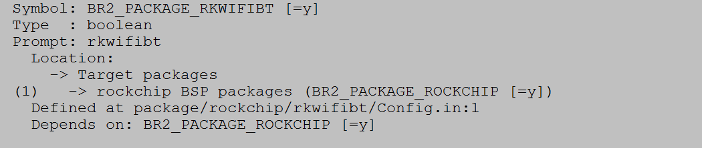</left>

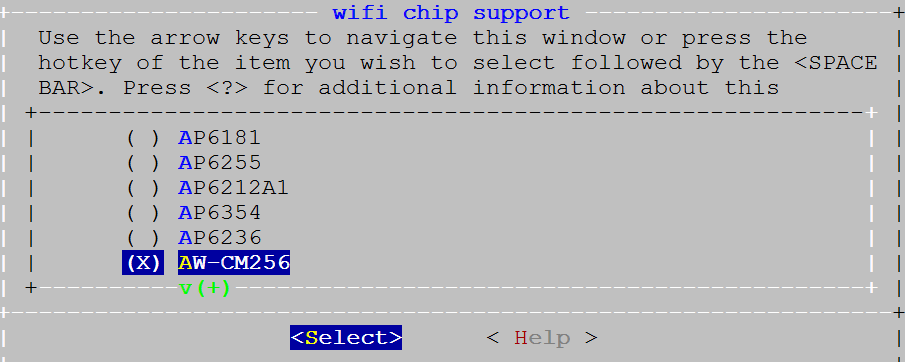</left>

2. 蓝牙配置

realtek模组建议使用BlueZ 协议，正基/海华模组建议使用BSA协议。以下配置，根据模组类型三选一：

- Realtek模组选择：bluez-utils 5.x，使用BlueZ需要同时开启: bluez-alsa，readline

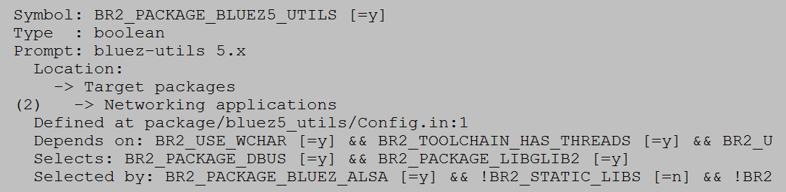</left>

</left>

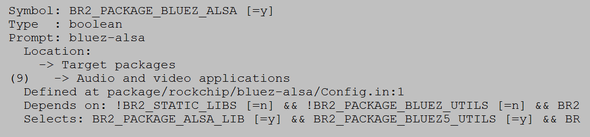</left>

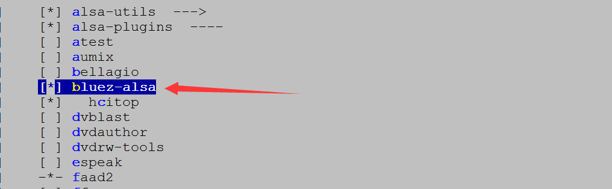</left>

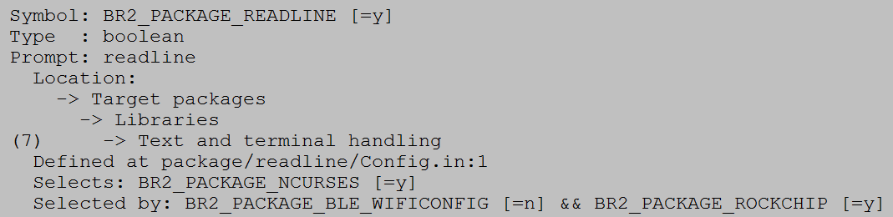</left>

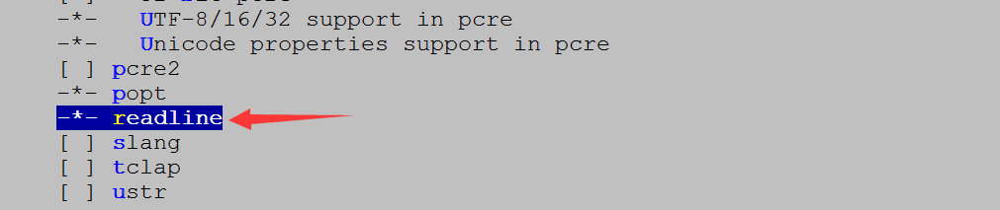</left>

- 正基模组选择：broadcom(ampak) bsa server and app

进入 wifi/bt chip support(XXX)---> 选择实际的芯片型号，必须跟rkwifibt配置一致。

- 海华模组选择：broadcom(cypress) bsa server and app

进入 wifi/bt chip support(XXX)---> 选择实际的芯片型号，必须跟rkwifibt配置一致。

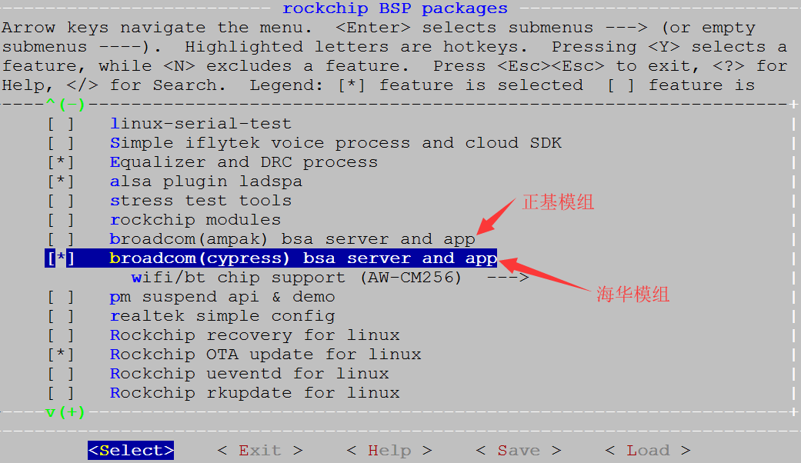</left>

3. 退出配置框，`make savedefconfig`保存配置

### 编译说明

1. 编译rkwifibt，根目录下执行：

```shell
make rkwifibt-dirclean && make rkwifibt-rebuild
```

2. 编译蓝牙模块，以下编译选项，根据模组类型三选一

- realtek模组编译：

```shell
make bluez5_utils-rebuild
make bluez-alsa-rebuild
```

- 正基模组编译：

```shell
make broadcom_bsa-rebuild
```

- 海华模组编译：

```shell
make cypress_bsa-rebuild
```

3. 编译deviceio，根目录下执行：

```shell
make deviceio-dirclean && make deviceio-rebuild
```

4. 打包固件，根目录下执行：

```shell
./mkfirmware.sh  #也可以./build.sh，全局编译，会自动打包固件
```

## 命令行配网

1. 首先确保Wi-Fi的服务进程启动，串口输入：`ps | grep wpa_supplicant`

</left>

2. 如果没启动，请手动启动：

```shell
wpa_supplicant -B -i wlan0 -c /data/cfg/wpa_supplicant.conf &
```

3. 修改 /data/cfg/wpa_supplicant.conf 文件，添加配置项

```C
network={
    ssid="WiFi-AP" 		// Wi-Fi名字
    psk="12345678" 		// Wi-Fi密码
    key_mgmt=WPA-PSK 	// 选填加密方式，不填的话可以自动识别
    #key_mgmt=NONE 		// 不加密
}
```

4. 重新读取上述配置： `wpa_cli reconfigure`

5. 重新连接：`wpa_cli reconnect`

## 手机配网

### BLE 配网

#### 简介

BLE配网同时支持BlueZ BLE配网和BSA BLE配网，配置参照本文档的第一章节‘WIFI/BT 配置’。并且BLE配网已集成到deviceio，接口位于RkBle.h。

#### 接口说明

请参考/docs/Develop reference documents/DeviceIo目录下《Rockchip_Developer_Guide_Rk3308_DeviceIo_Bluetooth_CN.pdf》文档，第二章节‘BLE接口介绍（RkBle.h）’。

#### 示例程序

示例程序的路径为：`external/deviceio/test/rk_ble_app.c`。

#### APP

APP路径：/external/app/RockHome.apk

APP源码路径：/external/app/src/RockHome

该APP仅作为手机端开发Demo，我们适配了Hornor 8，Remi6, 小米6，一加6，OPPO A5型号、iphone6s(plus)、三星S6、VIVO X9等手机。其他型号的手机没有测试，APP兼容性可能存在风险。

#### 配网步骤

该配网步骤以BSA BLE配网为例进行说明，所有板端log均为BSA的配网log。BlueZ操作步骤相同，板端log不同。

1. 确保Wi-Fi的服务进程启动，串口输入： `ps | grep wpa_supplicant`

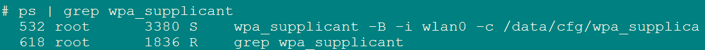</left>

2. 如果没启动，请手动启动：

```shell
wpa_supplicant -B -i wlan0 -c /data/cfg/wpa_supplicant.conf &
```

3. 板端命令行执行：`deviceio_test wificonfig`，输入1回车， 启动BLE 配网

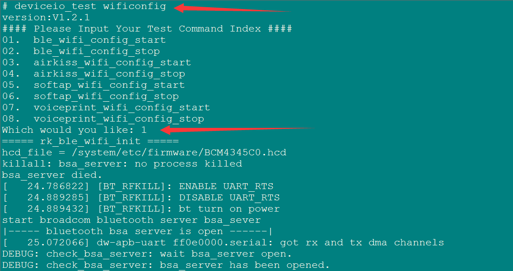</left>

4. 设置的BLE广播设备名必须以**RockChip**为前缀，否则APK无法检索到设备：

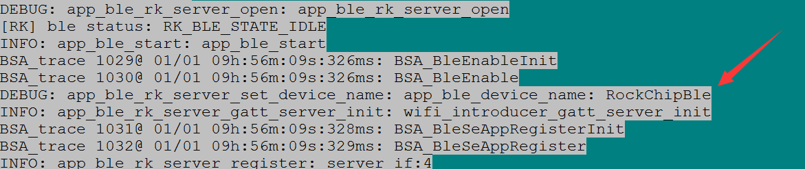</left>

5. 手机端打开APK

点击CONTINUE -> START SCAN，扫描以RockChip为前缀命名的BLE设备：

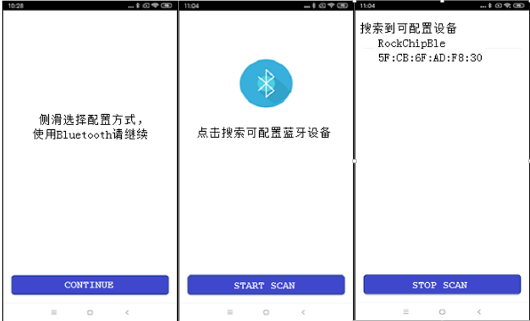</left>

6. 点击想要连接的BLE设备，开始连接设备，设备连接成功，板端log如下

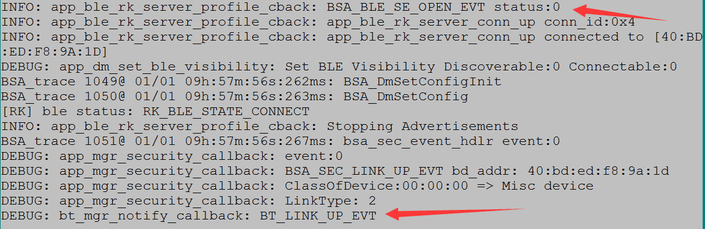</left>

7. 设备连接成功，APK进入配网界面，点击 >> 按钮 获取Wi-Fi 列表，选择想要连接的Wi-Fi ，输入密码，点击Confirm开始配网：

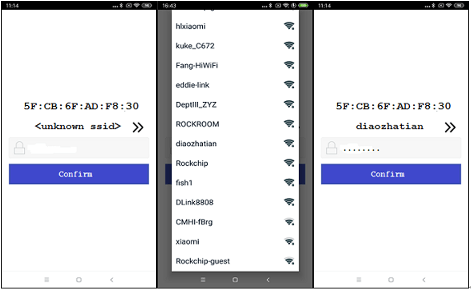</left>

8. 板端接收到ssid和psk后，开始连接网络

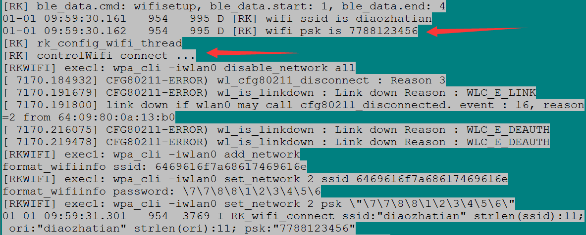</left>

9. 连接成功，板端发送通知给手机APK

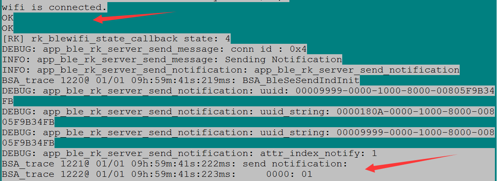</left>

10. APK端收到配网成功的通知后，断开BLE连接，返回设备搜索界面，板端log如下

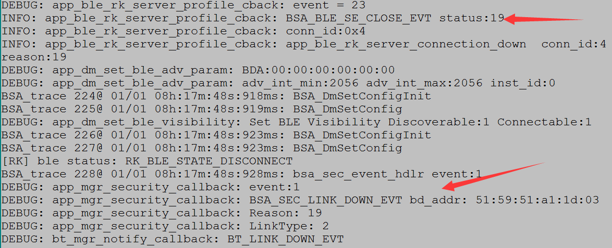</left>

11. 再次启动配网，需要先输入2，关闭BLE配网；再输入1重新启动BLE，重复上述配网流程。

### AirKiss 配网

#### 简介

目前AirKiss配网只支持rtl8723ds，请参照本文档第一章节 ’Wi-Fi/BT 配置‘进行相应配置；ap模组请参考external/wifiAutoSetup目录下的说明。

AirKiss兼容性很差，不建议作为唯一的配网方式使用，需要增加其他的配套配网方案，原因请参考《/docs/Develop reference documents/WIFIBT/RK平台RTL8723DS AIRKISS配网说明.pdf》。

目前AirKiss配网已集成到deviceio中，接口位于Rk_wifi.h。

#### kernel 修改

修改 /drivers/net/wireless/rockchip_wlan/rtl8723ds/Makefile 文件：

```
-CONFIG_WIFI_MONITOR = n
+CONFIG_WIFI_MONITOR = y
```

#### 接口说明

启动AirKiss配网，成功返回0，失败返回-1:

```
int RK_wifi_airkiss_start(char *ssid, char *password)
```

- ssid：手机端发送的Wi-Fi名称

- password：手机端发送的Wi-Fi密码

关闭AirKiss配网

```
void RK_wifi_airkiss_stop()
```

#### 示例程序

示例程序的路径为：external/deviceio/test/rk_wifi_test.c

该测试用例调用RK_wifi_airkiss_start()启动AirKiss，获取ssid和password并启动Wi-Fi配网。主要接口**：**void rk_wifi_airkiss_start(void *data)， DeviceIOTest.cpp中调用。

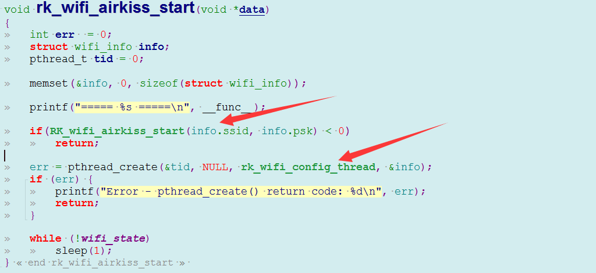</left>

#### 微信配网方式

可以使用手机APP 或者 扫描微信二维码的方式配置网络.

1. 手机APP下载地址：<https://iot.weixin.qq.com/wiki/document-download.html> ，进入下载中心 -> WiFi设备 -> AirKiss 调试工具，下载AirKissDebugger.apk

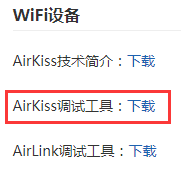</left>

2. 微信扫描如下二维码，二维码配网时，手机必须先连接Wi-Fi ，否则会提示：未能搜索设备，请开启手机Wi-Fi 后重试

</left>

#### 操作示例

1. 手机端操作以APP为例进行说明，打开AirKissDebugger.apk，输入ssid和password，AESKey为空、不输入。点击发送按钮，配网成功会弹窗提示“AirKissDebugger：Bingo”

  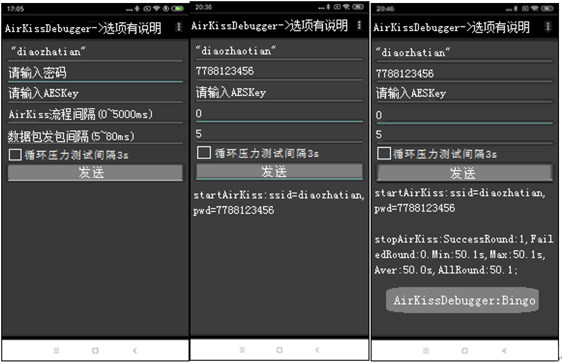</left>

2. 板端命令行执行：`deviceio_test wificonfig`，输入3回车，启动airkiss 配网

   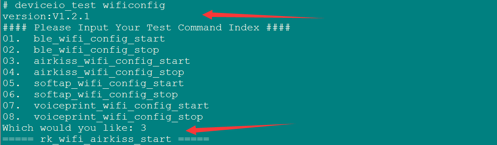</left>

3. AirKiss 启动成功

   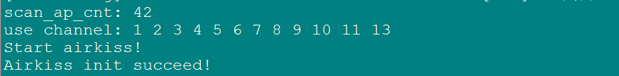</left>

4. 成功接收ssid和password，并开始配网

   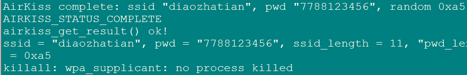</left>

5. 配网成功

   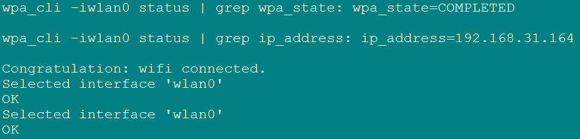</left>

6. 再次启动配网，需要先输入4，关闭AirKiss配网；再输入3重新启动AirKiss，重复上述配网流程

### SoftAP 配网

#### 简介

首先，用SDK板的Wi-Fi创建一个AP热点，在手机端连接该AP热点；其次，通过手机端APK获取SDK板的当前扫描到的热点列表，在手机端填入要连接AP的密码，APK会把AP的ssid和密码发到SDK板端；最后，SDK板端会根据收到的信息连Wi-Fi。

SoftAP配网已集成到deviceio中，接口位于Rk_softap.h。

#### APP

app路径：/external/app/RockHome.apk

app源码路径： /external/app/src/RockHome

#### Buildroot配置

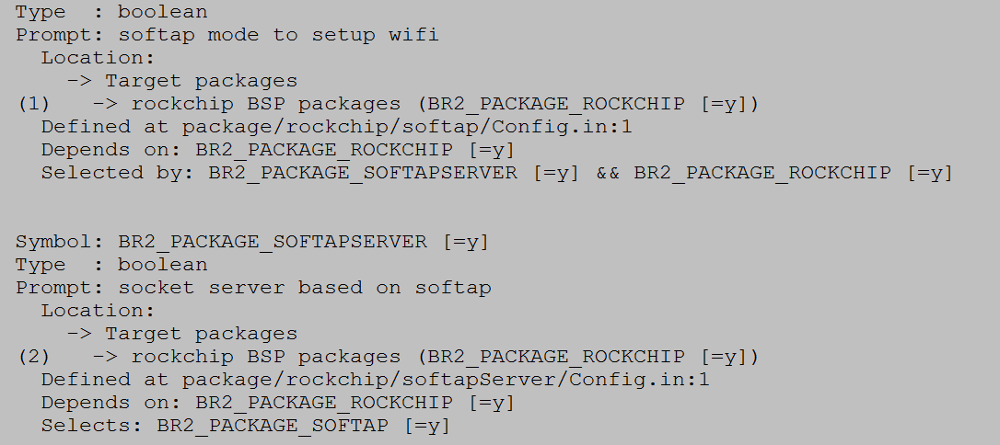</left>

</left>

#### 接口说明

1. 启动softap配网：

```
RK_softap_start(char* name, RK_SOFTAP_SERVER_TYPE server_type)
```

- name：Wi-Fi热点的名字，前缀必须为Rockchip-SoftAp

- server_type：网络协议类型，目前只支持TCP协议

2. 结束softap配网

```
int RK_softap_stop(void)
```

3. 注册状态回调

```
RK_softap_register_callback(RK_SOFTAP_STATE_CALLBACK cb)
```

- 正在连接网络：RK_SOFTAP_STATE_CONNECTTING

- 网络连接成功：RK_SOFTAP_STATE_SUCCESS

- 网络连接失败：RK_SOFTAP_STATE_FAIL

#### 示例程序

示例程序的路径为：external/deviceio/test/rk_wifi_test.c

主要接口：

```
void rk_wifi_softap_start(void *data)
rk_wifi_softap_stop(void *data)
```

  在DeviceIOTest.cpp中调用。

#### 配网步骤

1. 首先确保Wi-Fi的服务进程启动，串口输入： `ps | grep wpa_supplicant`，如果没启动，请手动启动：

```
wpa_supplicant -B -i wlan0 -c /data/cfg/wpa_supplicant.conf &
```

2. 板端命令行执行`deviceio_test wificonfig`，输入5 回车，启动SoftAP配网

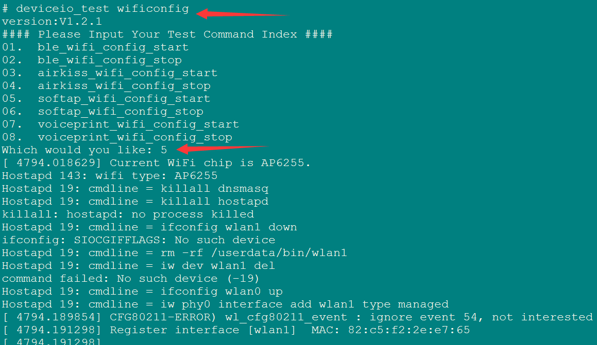</left>

3. 打开RockHome.apk，左侧滑选择第三个选项，进入SoftAP配网方式，点击 SEARCH DEVICES，扫描以Rockchip-SoftAp为前缀命名的SoftAP设备

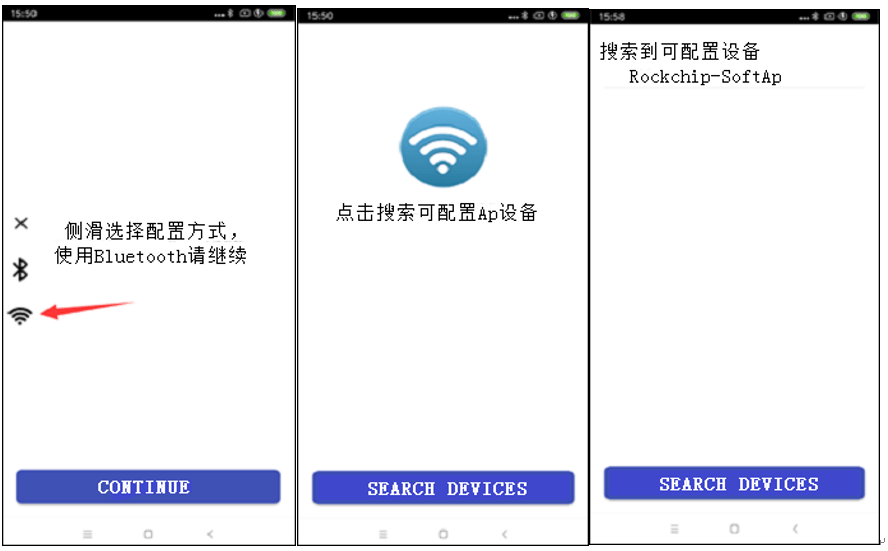</left>

4. 点击想要连接的SoftAP设备，开始连接设备，设备连接成功，板端log如下

</left>

5. 设备连接成功，APK进入配网界面，点击 >> 获取Wi-Fi 列表，选择想要连接的Wi-Fi，输入密码，点击Confirm开始配网

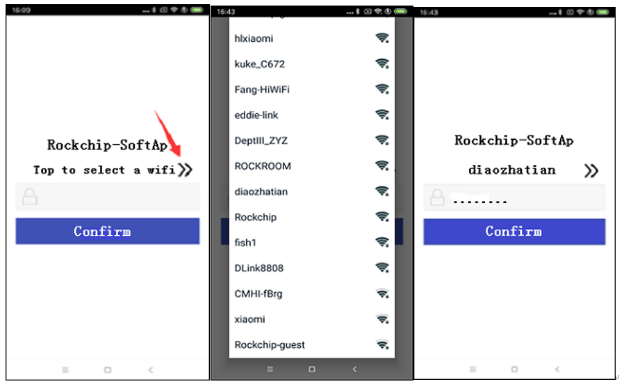</left>

6. 板子收到ssid和psk，开始连接网络

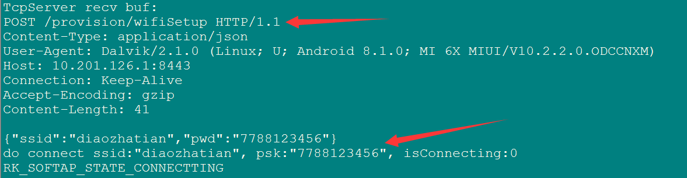</left>

7. 网络连接成功

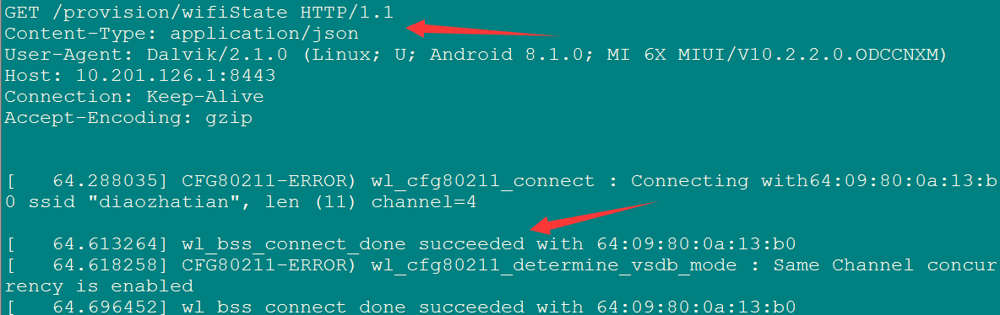</left>

8. 配网成功后，板端disableWifiAp，手机APK返回设备搜索界面，板端log如下

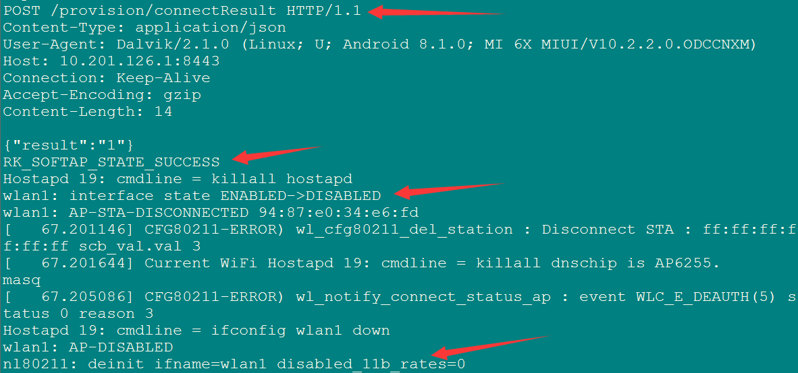</left>

9. 想要再次启动SoftAP配网，需要先输入6，回车反初始化SoftAP，再输入5重新初始化SoftAP，重复上述配网步骤

### Softap Web UI 配网

#### 简介

Softap Web UI配网原理和上面的SoftAP配网一样，只是手机端无需安装任何APK，直接连上热点，然后在浏览器里面进行进行配网。

#### 代码目录

external/rk_webui/ (包含源码、启动脚本)

buildroot/package/boa/

buildroot/package/rockchip/rk_webui/ （包含编译脚本）

#### Buildroot配置

首先Buildroot选择`BR2_PACKAGE_RK_WEBUI = y`，然后保存配置重新编译`make rk_webui`，重新生新固件。

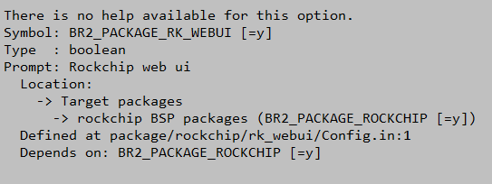</left>

#### 配网

1. 正常启动后执行ps查看，确保有如下4个进程启动：

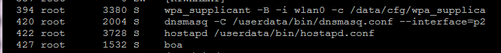</left>

2. 打开手机设置界面搜索Rockchip_WebUI_前缀的AP，比如Rockchip_WebUI_9604(后面的4位数字表示本机Wi-Fi的MAC地址的后4位，方便区分)，点击连接：

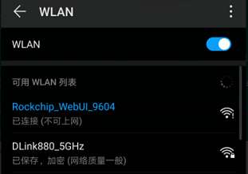</left>

3. 打开手机浏览器，输入：192.168.88.1（浏览器会自动跳转到/cgi-bin/home.c），然后回车出现如下界面：

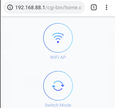</left>

4. 点击WiFi AP：

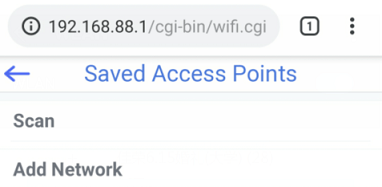</left>

5. 点击Scan扫描：

</left>

6. 点击要连接的Wi-Fi，然后输入密码并点击Connect（注意：由于Wi-Fi芯片的硬件限制：当连接目前Wi-Fi比如TP-LINK_HKH 和 本身热点Rockchip_WebUI_XXXX不在同一个信道，会导致手机和热点断开，请重新连接热点获取配网状态）

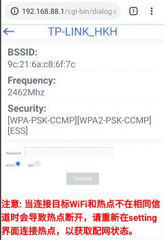</left>

7. 手机重新连接热点，点击刷新，可以看到已经连接Connected（且支持忘记和断开操作）

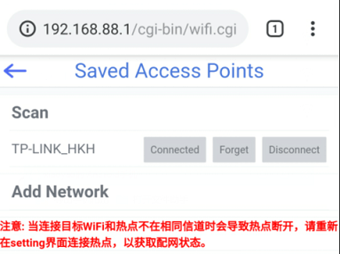</left>