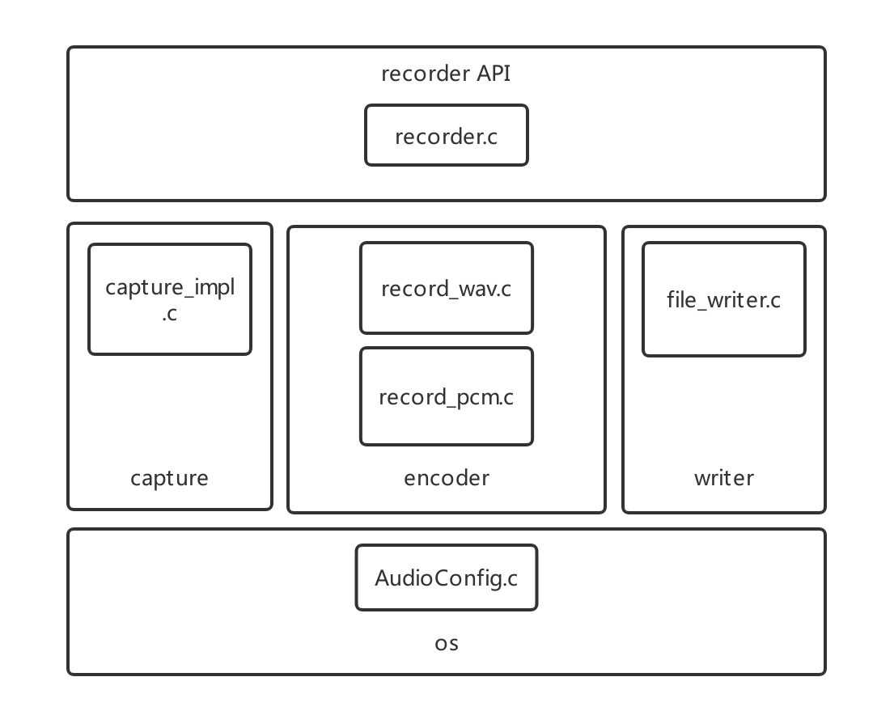
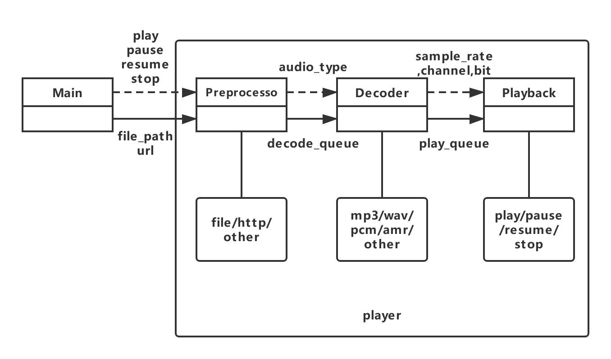
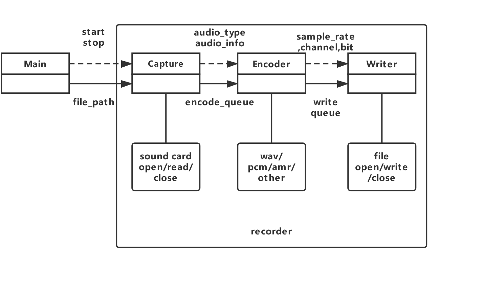

# Rockchip RK2206 Developer Guide Audio Server

文件标识：RK-KF-YF-305

发布版本：V1.0.0

日期：2019-11-29

文件密级：公开资料

---

**免责声明**

本文档按“现状”提供，福州瑞芯微电子股份有限公司（“本公司”，下同）不对本文档的任何陈述、信息和内容的准确性、可靠性、完整性、适销性、特定目的性和非侵权性提供任何明示或暗示的声明或保证。本文档仅作为使用指导的参考。

由于产品版本升级或其他原因，本文档将可能在未经任何通知的情况下，不定期进行更新或修改。

**商标声明**

“Rockchip”、“瑞芯微”、“瑞芯”均为本公司的注册商标，归本公司所有。

本文档可能提及的其他所有注册商标或商标，由其各自拥有者所有。

**版权所有© 2019福州瑞芯微电子股份有限公司**

超越合理使用范畴，非经本公司书面许可，任何单位和个人不得擅自摘抄、复制本文档内容的部分或全部，并不得以任何形式传播。

福州瑞芯微电子股份有限公司

Fuzhou Rockchip Electronics Co., Ltd.

地址：     福建省福州市铜盘路软件园A区18号

网址：     [www.rock-chips.com](http://www.rock-chips.com)

客户服务电话： +86-4007-700-590

客户服务传真： +86-591-83951833

客户服务邮箱： [fae@rock-chips.com](mailto:fae@rock-chips.com)

---

## **前言**

**概述**

本文档主要介绍Rockchip RK2206芯片平台适用的FreeRTOS系统音频播放器/录音器框架及接口说明。

**产品版本**

| **芯片名称** | **内核版本**     |
| ------------ | ---------------- |
| RK2206       | FreeRTOS V10.0.1 |

**读者对象**

本文档（本指南）主要适用于以下工程师：

技术支持工程师
软件开发工程师

---

**修订记录**

| **日期**   | **版本** | **作者**   | **修改说明**     |
| ---------- | -------- | :--------- | ---------------- |
| 2019-11-29 | V1.0.0   | Jair Wu | 初始版本         |

---

## **目录**

[TOC]

---

## **1 基本框架**

### **1.1 Player**


- player：为用户提供播放器相关api，如play，pause，resume以及stop接口。
- preprocessor：负责音频流的预处理，例如网络流下载、本地文件流的打开关闭。
- decoder：负责音频数据的解码。
- playback：负责音频的播放、暂停、恢复、停止。
- os：os层封装了系统相关api，使代码便于移植不同系统上，如Linux/FreeRTOS/RT-Thread。

### **1.2 Recorder**



- recorder：为用户提供录音器相关api，如start、stop接口。
- capture：负责声卡设备的打开和读取。
- encoder：负责音频数据的编码。
- writer：负责编码后数据的文件写入。
- os：os层封装了系统相关api，使代码便于移植不同系统上，如Linux/FreeRTOS/RT-Thread。

## **2 基本流程**

### **2.1 Player**



音乐播放器特点：

- 多线程架构，每个部分具有独立性。

- 物理设备抽象，即具体播放设备可以根据不同系统提供API来填入。

- 预处理过程抽象，即开发者可以自行实现音频预处理。

- 解码过程抽象，即开发者可以添加各类解码器。

- 支持音频流的播放、暂停、恢复、停止功能。

- 默认支持网络流、本地文件流。

- 支持MP3、WAV、PCM。

### **2.2 Recorder**



录音器特点：

- 多线程架构，每个部分具有独立性。

- 物理设备抽象，即具体录音设备可以根据不同系统提供API来填入。

- 编码过程抽象，即开发者可以添加各类编码器。

- 支持WAV、PCM。

## **3 主要功能代码说明**

### **3.1 Player**

#### **3.1.1 Preprocessor**

Preprocessor主要负责原始音频数据的获取，如http流的下载解析/本地文件的读取/内存数据的的读取等。

伪代码逻辑如下所示：

```c
play_preprocessor_cfg_t cfg;
play_preprocessor_t *processor = YOUR_PREPROCESSOR;
int ret = processor->init(processor, &cfg);
if (0 != ret)
{
    //TODO
}

char *read_buf = (char *)malloc(cfg.frame_size);
assert(read_buf != NULL);
int read_bytes;
while (1)
{
    read_bytes = processor->read(processor, read_buf, cfg->frame_size);
    if (read_bytes <= 0)
        break;
    audio_stream_write(player->preprocess_stream, read_buf, read_size);
}
processor->destroy(processor);
```

#### **3.1.2 Decoder**

解码过程主要完成原始音频数据的解码操作，例如WAV／MP3解码，支持自定义的解码。

其内部主要逻辑伪代码如下：

```C
//...
play_decoder_cfg_t cfg;
play_decoder_t *decoder = YOUR_DECODER;
int ret = decoder->init(decoder, &cfg);
if (0 != ret)
{
    //TODO
}
play_decoder_error_t err = decoder->process(decoder);
decoder->destroy(decoder);
```

#### **3.1.3 Playback**

播放主要负责具体物理设备的打开关闭，播放／暂停／停止／恢复等操作。

其伪代码如下：

```C
playback_device_cfg_t device_cfg;
playback_device_t device = player->device;
ret = device.open(&device, &device_cfg);
if (0 != ret)
{
    //TODO
}

char *read_buf = (char *)malloc(device_cfg.frame_size);
while (1)
{
    read_size = audio_stream_read(player->decode_stream, read_buf + oddframe, frame_size);
    if (read_size <= 0)
        break;
    write_size = device.write(&device, read_buf + oddframe, read_size);
    if (write_size <= 0)
        break;
}
device.stop(&device);
device.close(&device);
```

### **3.2 Recorder**

#### **3.2.1 Capture**

Capture主要负责原始录音数据的获取。

伪代码逻辑如下所示：

```c
capture_device_cfg_t device_cfg;
capture_device_t device = recorder->device;
ret = device.open(&device, &device_cfg);
if (0 != ret)
{
    //TODO
}

char *read_buf = (char *)malloc(device_cfg.frame_size);
assert(read_buf != NULL);
int read_bytes;
while (1)
{
    read_size = device.read(&device, read_buf, frame_size);
    if (read_size <= 0)
        break;
    write_size = audio_stream_write(recorder->record_stream, read_buf, read_size);
    if (write_size <= 0)
        break;
}
device.stop(&device);
device.close(&device);
```

#### **3.2.2 Encoder**

编码过程主要完成原始录音数据的编码操作，例如WAV／AMR编码，支持自定义的编码。

其内部主要逻辑伪代码如下：

```C
//...
record_encoder_cfg_t encoder_cfg;
record_encoder_t encoder = YOUR_ENCODER;
int ret = encoder.init(&encoder, encoder_cfg);
if (0 != ret)
{
    //TODO
}
record_encoder_error_t encode_res = encoder.process(&encoder);
encoder.destroy(&encoder);
```

#### **3.2.3 Writer**

Writer主要负责将编码后数据写入文件。

其伪代码如下：

```C
//...
media_sdk_msg_t msg;
record_writer_t writer;
writer = msg.recorder.writer;
writer.init(&writer, &processor_cfg);
while(1)
{
    read_size = audio_stream_read(recorder->encode_stream, read_buf, frame_size);
    if (read_size != frame_size)
        break;
    write_size = writer.write(&writer, read_buf, read_size);
    if (write_size != read_size)
        break;
    //...
}
writer.destroy(&writer);
//...
```

## **4 示例**

### **4.1 Player**

```C
#include <stdio.h>
#include "audio_server.h"

static void player_listen(player_handle_t player, play_info_t info, void *userdata)
{
    /* Do your callback task */
}

COMMON API int os_player_app()
{
    player_init();

    player_cfg_t cfg_one =
    {
        .preprocess_buf_size = 1024 * 5,
        .decode_buf_size = 1024 * 5,
        .tag = "one",
        .name = "default",
        .device = DEFAULT_PLAYBACK_DEVICE,
        .listen = player_listen,
        .resample_rate = 48000
    };

    /* player_create */
    player_handle_t player_one = player_create(&cfg_one);

    play_cfg_t c =
    {
        .target = "1.mp3",
        .need_free = false,
        .preprocessor = DEFAULT_FILE_PREPROCESSOR
        /* 播放网络流则设置如下 */
        //.target = "http://fdfs.xmcdn.com/group25/M09/A4/98/wKgJNlh927TxG-efAAd4SITX7J0271.mp3",
        //.preprocessor = DEFAULT_HTTP_PREPROCESSOR,
    };

    player_play(player_one, &c);
    player_pause(player_one);
    sleep(1000);
    player_resume(player_one);
    player_wait_idle(player_one);
    player_destroy(player_one);
    player_deinit();
    return 0;
}
```

### **4.2 Recorder**

```C
#include <stdio.h>
#include "audio_server.h"

COMMON API int os_recorder_app()
{
    recorder_init();

    recorder_cfg_t cfg_one =
    {
        .record_buf_size = 1024 * 5;
        .encode_buf_size = 1024 * 5;
        .device = (capture_device_t)DEFAULT_CAPTURE_DEVICE;
        .device_name = "default";
        .tag = "one";
    };

    /* recorder_create */
    recorder_handle_t recorder_one = recorder_create(cfg_one);

    record_cfg_t rec_cfg =
    {
        .type = "wav";
        .target = "A:\\test.wav",
        .need_free = false,
        .writer = (record_writer_t)DEFAULT_FILE_WRITER;
        .samplerate = 16000;
        .bits = 16;
        .channels = 2;
    };

    recorder_record(recorder_one, g_rec_cfg);
    sleep(10000);
    recorder_stop(recorder_one);
    recorder_destroy(recorder_one);
    recorder_deinit();
    return 0;
}
```

## **5 测试说明**

详见Rockchip_RK2206_FreeRTOS_Modules_Test_Guide_CN.md。

## **6 IMPL**

impl层用以实现上层和声卡设备的对接，分为playback_impl.c和capture_impl.c。

### **6.1 Playback**

playback impl主要接口如下：

```c
static struct pcm *playback_handle = NULL;
int playback_device_open_impl(struct playback_device *self, playback_device_cfg_t *cfg)
{
    ...
    playback_handle = pcm_open(rkos_audio_get_id(AUDIO_FLAG_WRONLY), AUDIO_FLAG_WRONLY);
    pcm_set_config(playback_handle, *config)
    ...
}

int playback_device_start_impl(struct playback_device *self)
{
    ...
    pcm_prepare(playback_handle);
    pcm_start(playback_handle);
    ...
}

int playback_set_volume(int vol)
{
    return pcm_set_volume(playback_handle, vol, AUDIO_FLAG_WRONLY);
}

int playback_get_volume(void)
{
    return pcm_get_volume(playback_handle, AUDIO_FLAG_WRONLY);
}

int playback_device_write_impl(struct playback_device *self, const char *data, size_t data_len)
{
    int write_size = pcm_write(playback_handle, (void *)data, data_len);
}

int playback_device_stop_impl(struct playback_device *self)
{
    ...
    pcm_stop(playback_handle);
    ...
}

int playback_device_abort_impl(struct playback_device *self)
{
    return RK_AUDIO_SUCCESS;
}

void playback_device_close_impl(struct playback_device *self)
{
    ...
    pcm_close(playback_handle);
    ...
}

```

### **6.2 Capture**

capture impl主要接口如下：

```c
static struct pcm *capture_handle = NULL;
int capture_device_open_impl(struct capture_device *self, capture_device_cfg_t *cfg)
{
    ...
    capture_handle = pcm_open(rkos_audio_get_id(AUDIO_FLAG_RDONLY), AUDIO_FLAG_RDONLY);
    pcm_set_config(capture_handle, *config)
    ...
}

int capture_device_start_impl(struct capture_device *self)
{
    ...
    pcm_prepare(capture_handle);
    pcm_start(capture_handle);
    ...
}

int capture_set_volume(int vol)
{
    return pcm_set_volume(capture_handle, vol, AUDIO_FLAG_RDONLY);
}

int capture_get_volume(void)
{
    return pcm_get_volume(capture_handle, AUDIO_FLAG_RDONLY);
}

int capture_device_read_impl(struct capture_device *self, const char *data, size_t data_len)
{
    int read_size = pcm_read(capture_handle, (void *)data, data_len);
}

int capture_device_stop_impl(struct capture_device *self)
{
    ...
    pcm_stop(capture_handle);
    ...
}

int capture_device_abort_impl(struct capture_device *self)
{
    return RK_AUDIO_SUCCESS;
}

void capture_device_close_impl(struct capture_device *self)
{
    ...
    pcm_close(capture_handle);
    ...
}

```

## **7 IMPL使用示例**

impl层独立于上层应用，因此无编解码需求的情况下可以直接使用impl接口操作声卡设备。

### **7.1 Playback**

```
playback_device_t playback_device = DEFAULT_PLAYBACK_DEVICE;
playback_device_cfg_t playback_device_cfg;
playback_device_cfg.device_name = "default";
playback_device_cfg.samplerate = 48000;
playback_device_cfg.frame_size = 1024 * 4;
playback_device_cfg.channels = 2;
playback_device_cfg.bits = 16;
playback_device.open(&playback_device, &playback_device_cfg);
for (...)
{
    playback_device.write(&playback_device, buffer,playback_device_cfg.frame_size); //此处必须按cfg中设置的frame_size写
}
playback_device.stop(&playback_device);
playback_device.close(&playback_device);
```

### **7.2 Capture**

```
capture_device_t record_device = DEFAULT_CAPTURE_DEVICE;
capture_device_cfg_t record_device_cfg;
record_device_cfg.device_name = "default";
record_device_cfg.samplerate = 16000;
record_device_cfg.frame_size = 4096;
record_device_cfg.channels = 2;
record_device_cfg.bits = 16;
record_device.open(&record_device, &record_device_cfg);
for (...)
{
    record_device.read(&record_device, buffer,record_device_cfg.frame_size); //此处必须按cfg中设置的frame_size写
}
record_device.stop(&record_device);
record_device.close(&record_device);
```

## **8 语音识别ASR**

语音识别，即ASR，分为三个线程，分别是管理线程、录音线程、处理线程。完整代码参见src/components/asr。

### **8.1 ASR管理线程**

ASR模块本身没有这一线程，这一线程由使用者创建，用来启动/重启ASR，包括启动DSP、录音线程、处理线程，另外该线程还负责将录音线程获取的数据传输给处理线程。相应示例可参考src/subsys/shell/shell_asr.c。

```c
void asr_callback(const char *wakeup_string)
{
    //TODO
}

void asr_test(void *args)
{
    asr_init(asr_callback);
    while (1)
    {
        asr_start(); //该函数不会马上返回，返回即代表ASR已退出
        rkos_sleep(1000);
    }
    asr_stop();
    asr_deinit();
    rktm_delete_task(NULL);
}
```

### **8.2 ASR录音线程**

录音线程由asr_start()函数调用asr_rkrecorder_init()创建，该线程主要负责开启/关闭录音设备，读取录音数据。

```c
capture_device_t g_asr_rkrecorder_device = DEFAULT_CAPTURE_DEVICE;
capture_device_cfg_t g_asr_rkrecorder_device_cfg;
static void asr_recorder_run(void *args)
{
    g_asr_rkrecorder_device.open(&g_asr_rkrecorder_device, &g_asr_rkrecorder_device_cfg);
    while (1)
    {
        int read_bytes = g_asr_rkrecorder_device.read(&g_asr_rkrecorder_device, read_buf, ASR_RECORD_BUFFER_SIZE);
        ret = audio_stream_write(asr_wakeup_stream, read_buf, read_bytes);
        if (ret == -1)
            break;
    }
    g_asr_rkrecorder_device.stop(&g_asr_rkrecorder_device);
    g_asr_rkrecorder_device.close(&g_asr_rkrecorder_device);
}
```

### **8.3 ASR处理线程**

处理线程主要负责将录音数据取出有效数据后发送给DSP处理，返回结果判断唤醒后，调用回调函数。

```c
static void asr_run(void *args)
{
    ...
    while(1)
    {
        audio_stream_read(asr_ring_stream, (char *)dsp_in_buf, IOT_ASR_BUF_SIZE * 2);
        for (int i = 0, int j = 0; j < IOT_ASR_BUF_FRAME * 2; j += 2)
        {
            /* 获取数据为4ch，DSP仅需2ch */
            dsp_in_buf[i] = dsp_in_buf[j];
            i++;
        }
        ret = asr_dsp_process(dsp_in_buf, IOT_ASR_BUF_FRAME, 1, &param);
        if (ret == 1)
        {
            printf("wake up %d\n", param);
            wakeup_cb("wake up");
        }
    }
    ...
}
```

## **9 增益调节**

### **9.1 应用Demo增益调节**

menuconfig中搜索如下config：

MAX_VOLUME：设置系统最大播放音量，最大为32，对应0dB。

DEFAULT_MIC_GAIN：设置录音增益档位。

DEFAULT_LOOPBACK_GAIN：设置回采增益档位。

COMPONENTS_USE_PGA_GAIN：设置增益类型为PGA增益或数字增益。

增益类型对应增益范围如下：

| **增益类型** | **增益档位范围** | **增益范围（dB）** | **增益步长** |
| ------------ | ------------ | ------------ | ------------ |
| PGA增益 COMPONENTS_USE_PGA_GAIN = 1 | -3~15    | -9~30 dB |  3/2  |
| 数字增益 COMPONENTS_USE_PGA_GAIN = 0 | -255~255 | -96~96 dB | 0.375 |

### **9.2 增益调节接口及命令**

#### **9.2.1 增益调节接口**

其中句柄dev通过rkdev_open(DEV_CLASS_AUDIO, dev_id, NOT_CARE)获取，ch为声卡通道，通道0为录音左声道，通道1为录音右声道，通道2为回采左声道，3为设置三个声道为同一值，dB为9.1所述档位值，并非直接的dB值。

```c
void SystemSetGain(void *dev, uint8_t ch, int dB);
int SystemGetGain(void *dev, uint8_t ch);
/* 设置/获取数字增益 */

void SystemSetPGAGain(void *dev, uint8_t ch, int dB);
int SystemGetPGAGain(void *dev, uint8_t ch);
/* 设置/获取PGA增益 */
```

#### **9.2.1 增益调节命令**

Codec数字增益：

```
io -4 0x41060324 0x20000000
/* 设置前确保相关clk使能,每次播放或录音结束后会关闭相关clk */

io -4 0x410401B0 0x00
/* ACDCDIG_DACVOGP，播放增益极性，0x00代表负增益，0x01代表正增益 */

io -4 0x41040190 0x30
/* ACDCDIG_DACVOLL0，播放增益，步长0.375，0x30即为48 x 0.375 = 18dB，结合如上ACDCDIG_DACVOGP寄存器的值则代表-18dB */

io -4 0x410400A8 0x03
/* ACDCDIG_ADCVOGP，录音增益极性，bit0为录音左声道，bit1为录音右声道，bit2为回采左声道。对应为置1代表正增益，清0代表负增益。如0x03代表011b，即录音两声道均为正增益，回采为负增益 */

io -4 0x41040088 0x4E
/* ACDCDIG_ADCVOLL0，录音左声道增益，步长0.375，0x4E即为 78 x 0.375 = 29.25dB，结合如上ACDCDIG_ADCVOGP寄存器bit0的值则代表+29.25dB */

io -4 0x4104008C 0x13
/* ACDCDIG_ADCVOLL1，录音右声道增益，步长0.375，0x13即为 19 x 0.375 = 7.125dB，结合如上ACDCDIG_ADCVOGP寄存器bit1的值则代表+7.125dB */

io -4 0x41040098 0x05
/* ACDCDIG_ADCVOLR0 ，回采左声道增益，步长0.375，0x4E即为 5 x 0.375 = 1.875dB，结合如上ACDCDIG_ADCVOGP寄存器bit2的值则代表-1.875dB */
```

PGA增益：

```
io -4 0x41050240 0x10001000
/* 设置由MCU控制I2C2 */

i2c_test write i2c2 0x24 0x24 1 0x00 1 // PGA1 PGA2 0dB, step 3dB
i2c_test write i2c2 0x24 0x24 1 0x0f 1 // PGA1 PGA2 -9dB, step 3dB
/* 该指令为同时设置通道1和2的负增益。0x0f为设置的值,其中bit0和bit1的值为PGA2增益档位，bit2和bit3的值为PGA1增益档位。00：0dB 01:-3dB 10:-6dB 11:-9dB。下同 */

i2c_test write i2c2 0x24 0x25 1 0x00 1 // PGA3 PGA4 0dB, step 3dB
i2c_test write i2c2 0x24 0x25 1 0x0f 1 // PGA3 PGA4 -9dB, step 3dB

i2c_test write i2c2 0x24 0x28 1 0x00 1 // PGA1 PGA2 0dB, step 2dB
i2c_test write i2c2 0x24 0x28 1 0xff 1 // PGA1 PGA2 30dB, step 2dB
/* 该指令为同时设置通道1和2的正增益。0xff为设置的值,其中bit0:bit3的值为PGA2增益档位，bit4:bit7的值为PGA1增益档位。0000:0dB，1111:30dB，2dB/step。下同 */

i2c_test write i2c2 0x24 0x29 1 0x00 1 // PGA3 PGA4 0dB, step 2dB
i2c_test write i2c2 0x24 0x29 1 0xff 1 // PGA3 PGA4 30dB, step 2dB
```
