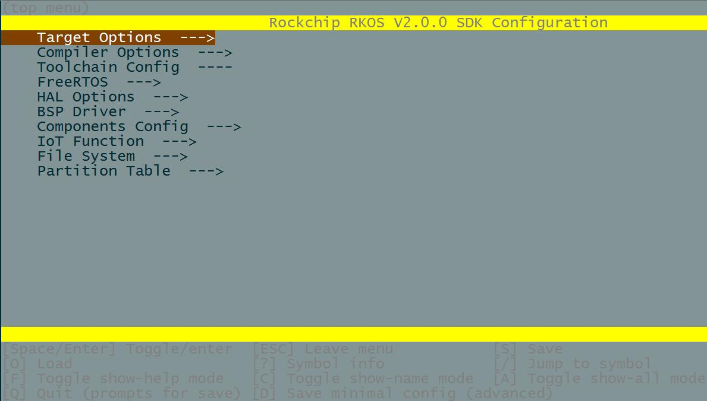

# **Rockchip RK2206 FreeRTOS Developer Guide**

文件标识：RK-KF-CS-007

发布版本：1.0.0

日       期：2019.11

文件密级：公开资料

---

## **免责声明**

本文档按“现状”提供，福州瑞芯微电子股份有限公司（“本公司”，下同）不对本文档的任何陈述、信息和内容的准确性、可靠性、完整性、适销性、特定目的性和非侵权性提供任何明示或暗示的声明或保证。本文档仅作为使用指导的参考。

由于产品版本升级或其他原因，本文档将可能在未经任何通知的情况下，不定期进行更新或修改。

**商标声明**

“Rockchip”、“瑞芯微”、“瑞芯”均为本公司的注册商标，归本公司所有。

本文档可能提及的其他所有注册商标或商标，由其各自拥有者所有。

**版权所有** **© 2019** **福州瑞芯微电子股份有限公司**

超越合理使用范畴，非经本公司书面许可，任何单位和个人不得擅自摘抄、复制本文档内容的部分或全部，并不得以任何形式传播。

福州瑞芯微电子股份有限公司

Fuzhou Rockchip Electronics Co., Ltd.

地址：     福建省福州市铜盘路软件园A区18号

网址：     www.rock-chips.com

客户服务电话： +86-4007-700-590

客户服务传真： +86-591-83951833

客户服务邮箱： fae@rock-chips.com

---

## **前言**

 **概述**

本文主要针对RK2206的基本使用做简单描述，帮助开发工程师快速了解并使用RK2206 SDK开发包。

**产品版本**

| **芯片名称** | **内核版本**     |
| ------------ | ---------------- |
| RK2206       | FreeRTOS V10.0.1 |

**读者对象**

本文档（本指南）主要适用于以下工程师：

​        技术支持工程师

​        软件开发工程师

## **修订记录**

| **日期**   | **版本** | **作者** | **修改说明** |
| ---------- | -------- | -------- | ------------ |
| 2019-06-18 | V0.0.1   | CWW      | 初始版本     |
| 2019-06-21 | V0.0.2   | SCH      |1. 增加编程规范<br>2. 添加shell命令的方法|
| 2019-06-25 | V0.0.3 | YHX |1. 添加Kconfig配置及使用说明<br>2. 添加SDK版本说明|
| 2019-07-24 | V0.0.4   | CWW      | 1. 修改客户服务电话<br>2. 修正函数名描述问题|
| 2019-08-15 | V0.0.5 | CWW | 1. 增加头文件包含规则<br>2. 增加保存Kconfig配置说明 |
| 2019-09-05 | V0.0.6 | 王明成 | 1. 修改平台编程规范为Linux风格<br>2. 修改版权为SPDX-License-Identifier |
| 2019-09-09 | V0.0.7 | CWW | 1. 增加花括号,缩进,源代码编码字符集以及结构体typedef规范<br>2. 更新typedef.h重命名为rkos_typedef.h |
| 2019-10-11 | V0.0.8 | CWW | 增加文件标识 |
| 2019-11-27 | V0.0.9 | CWW | 修改文档排版 |
| 2020-1-10 | V1.0.0 | SCH | 增加打印规范，启动流程，命令集的编写方法|

---

## **目录**

[TOC]

---

## **1 编程规范**

### **1.1 总则**

1、RKOS平台编程采用Linux风格，细则参见[Linux kernel coding style](https://www.kernel.org/doc/html/latest/process/coding-style.html) ；

2、第三方代码内部修改遵循其原有风格，适配层尽量遵循RKOS平台风格；

3、注释采用doxygen语法，供外部调用的接口、枚举，结构体等必须添加注释，以便形成文档；

4、数据结构必须使用平台提供的标准接口；

5、设备驱动只能调用rkos.h里封装的接口，新实现的代码须强类型；

6、License采用SPDX-License-Identifier；

7、花括号单独一行；

8、缩进使用4个空格；

9、结构体禁止使用typedef定义类型；

10、源代码和代码说明的markdown文档字符集使用UTF-8；

### **1.2 版权信息**

```c
/*
 * SPDX-License-Identifier: BSD-3-Clause
 *
 * Copyright (c) 2019 Fuzhou Rockchip Electronics Co., Ltd
 */
```

### **1.3 现有代码符号冲突解决方案**

1、HAL与OS冲突，改OS；

2、HAL/OS与第三方冲突，改HAL或OS；

3、HAL层全局宏定义加上前缀（例如：“RK\_HAL\_”）；

4、模块全局变量定义格式：g+模块名+变量名（例如：g_audio\_playstate）

5、模块之间的全局变量需要封装函数进行访问

### **1.4 审查规则**

对于gerrit上的审查应按照编程规范总则规定进行，对于有歧义的命名，如果本规范没有界定清晰，按照作者的原有的书写方式或者源代码当中已有的命名进行。

### **1.5 变量名**

遵循Linux风格。

### **1.6 函数名**

遵循Linux风格。

### **1.7 文件名**

所有代码文件的文件名全部小写，单词（包括缩写词）之间用“\_”隔开。例如：shell\_io.c

### **1.8 头文件包含规则**

系统和驱动（第三方的代码除外）的供外部引用的头文件都放在SDK根目录的include下。

```c
include/linker
include/shell
include/subsys
include/audio
include/driver
include/sys
include/app
include/kernel
```

编译环境对头文件搜索路径包含到include目录。代码从include下一级路径开始索引。例如：

```c
#include "kernel/RKOS.h"
#include "kernel/device.h"
```

### **1.9 宏名**

所有宏（#define）全部大写，例如：

```c
#define CHECK_HELP_CMD()
```

### **1.10 标签名**

程序中goto标签全部小写，单词（包括缩写词）之间用“\_”隔开。例如：err\_cmd:

### **1.11 数据类型定义**

rkos_typedef.h包含基础数据类型定义和错误码，Linux的错误码需单独包含文件errno.h。

### **1.12 返回值**

RKOS层以及APP层，返回值使用rk_err_t（int）, HTC(void *)，HDC(void *)， 无论哪种返回类型，最终以int类型为位宽，负数为错误识别码，正数为返回值的意义，其他模块到RKOS函数中需要做返回类型转换。

### **1.13 文档**

文档以md格式输出，保存在rkos/Docs目录。

## **2 打印规范**

### **2.1 打印说明**

printf: 重定向到rk_printf, 最大字符不超过512个，字符前加\n, 比如：printf("\n nihao");

rk_printf: 中断中最大支持字符128个，线程中最大支持字符1024个，字符前加\n, 比如：rk_printf("\n nihao")；

rk_puts: 打印字符串，无字符限制，自动换行，比如：rk_puts("nihao"); rk_puts(pstring); 其中pstring 是指向字符串的指针。

DEBUG：重定义到rk_printf, 自动换行，增加了文件名和，行号，使用方法和rk_printf

printf, rk_printf, DEBUG遇到\n会打印时间戳，时间戳的格式如下：

```
线程中打印：
[A.yhk_t][001583.728347]  A--线程中打印; yhk_t--线程名；001583--单位S; 728347--单位US
中断中打印：
[a][001986.168937] a--中断中打印；001986--单位S; 168937--单位US
```

rk_puts 遇到\n会打印时间戳，时间戳的格式如下：

```
[a][001986.168937] a--无意义；001986--单位S; 168937--单位US
```

### **2.1 打印级别**


RKOS打印级别分三级

Debug：所有的打印都可以使用

Beta: 除了DEBUG, 所有的打印都禁止输出

Release: 打印API全部被移除，所有的打印代码都被移除。

## **3 启动流程**

开机-->maskrom->loader-->rkos boot-->hal初始化-->bsp初始化-->driver初始化-->freertos启动-->rktm初始化-->rkdm初始化-->rkpm初始化-->rksm初始化-->设备树创建-->app管理器初始化-->app工作。

maskrom: 固化在SOC中启动代码

loader: 分析加载存储介质中的固件，如果没有则启动usb boot,请求下载固件。

rkos boot: 负责从存储介质搬运代码到相应的内存区域，并跳转到HAL层

hal初始化：soc 硬件抽象层初始化

bsp初始化： PCB板相关初始化

driver初始化：驱动框架初始化

freertos启动：freertos启动，运行第一个线程rktm

rktm初始化： rkos task manager 启动rkos device tree mananger

rkdm初始化：rkos device tree mananger启动rkos power manager, 初始化rkos segment manager

rksm初始化： 初始化固件信息，OTA相关的参数

设备树创建： 创建支持APP运行的设备树和相关组件，比如shell 和 app 管理器

app管理器初始化：初始化相关参数，并根据情况进入工厂测试，充电，故事机三种模式。

app工作：工厂测试模式，充电模式，故事机模式。

## **4 Kconfig配置**

### **4.1 配置**

进入到对应的工程目录，如*test_demo*目录下，并运行工程配置工具*menuconfig*。

```
cd app/test_demo/gcc
make rk2206_defconfig (defconfig位置位于于各project gcc/defconfigs目录）
make menuconfig
```

如果没有问题，则会显示下面的菜单：



*menuconfig* 工具的常见操作如下：

- 上下箭头：移动
- 回车：进入子菜单
- ESC 键：返回上级菜单或退出
- 英文问号：调出帮助菜单（退出帮助菜单，请按回车键）。
- 空格、Y 键``或``N 键：使能/禁用 [*] 配置选项
- 英文问号 ：调出有关高亮选项的帮助菜单
- / 键：寻找配置项目
- S键：保存当前配置

### **4.2 保存配置**

以app/test_demo工程，rk2206_defconfig为默认配置为例：

```
cd app/test_demo/gcc
make rk2206_defconfig
make menuconfig
make savedefconfig # 保存配置到对应的默认配置文件rk2206_defconfig
```

### **4.3 配置项说明**

Kconfig配置主入口为工程根目录下Kconfig文件。

一级菜单配置项说明如下，可根据模块定义检索及添加新模块配置：

| 一级配置项        | 配置定义                                                 |
| ----------------- | -------------------------------------------------------- |
| Target Options    | 定义芯片平台、选用的硬件板型                             |
| Compiler Options  | 定义编译配置项、如log等级、优化等级                      |
| Toolchain Config  | 定义编译工具链配置                                       |
| FreeRTOS          | 定义FreeRTOS系统配置                                     |
| HAL Options       | 定义HAL功能开关及配置                                    |
| BSP Driver        | 定义BSP Driver功能开关及配置                             |
| Components Config | 定义系统组件功能开关及配置，如网络组件、播放器、编解码等 |
| IoT Function      | 定义第三方云平台功能开关及配置                           |
| File System       | 定义文件系统开关及配置                                   |
| Partition Table   | 定义系统使用分区表配置                                   |

### **4.4 Kconfig生成配置**

编译后会生成供代码引用头文件：

```
include/sdkconfig.h
```

生成供Makefile引用的配置文件（存放至对应工程目录下）：

```
app/test_demo/gcc/.config
```

## **5 Shell 命令添加方法**

### **5.1 添加文件**

1 在src/subsys/shell 目录下创建一个shell专用文件 shell_io.c, 该文件只有shell相关的代码，如果要在其他文件夹下实现shell命令，必须保证C文件中有非shell相关的代码，并且被使用。

2 新加的文件需要导入版权信息和必要的头文件,详细参考shell\_io.c

### **5.2 增加一个命令**

1 新增一个命令入口函数 SHELL FUN rk\_err\_t ShellIo(HDC dev, uint8 *pstr)

2 使用REGISTER_SHELL_CMD导出ShellIo，注意导出命令时需要需要对变量进行初始化，具体请参考shell\_io.c

### **5.3 编写命令**

1 函数需要调用宏 CHECK_HELP_CMD(); 框架所需，用来挡住cmd.help命令
2 采用下面的格式来解析参数

```c
while (strCnt = ShellCheckParameter(pstr, &pItem, &pValue))
{
	pstr += strCnt;
}
```

- <1> StrCnt == 0 说明参数分离完成
- <2> pItem 代表 -c -v -l 的开始位置， 不包括 - pItem == NULL 标志找到一个不带属性的值（pValue）, 该值所在的位置决定了其意义
- <3> pValue 代表 pItem 后面跟的值，可以使用SHELL\_GET\_HEX_PARA(val) SHELL\_GET\_DEC_PARA(val) SHELL\_GET\_STRING_PARA(val) 来提取相应的值。如果pItem 没有数值，可以不关心这个值
- <4> shell\_io.c 中io命令注释和实现方案，大家可以参考。

### **5.4 添加Kconfig**

在src/subsys/shell/Kconfig 文件中添加对应配置项

```c
config COMPONENTS_SHELL_IO
	bool "Enable IO shell command"
	default n
	help
	  rockchip io read write command.
```

注意开关宏的命名，格式 COMPONENTS_SHELL_XXX

## **6 Shell 命令集添加方法**

### **6.1 添加文件**

1 在src/subsys/shell 目录下创建一个shell专用文件 shell_benchmark.c, 该文件只有shell相关的代码，如果要在其他文件夹下实现shell命令，必须保证C文件中有非shell相关的代码，并且被使用。

2 新加的文件需要导入版权信息和必要的头文件,详细参考shell_benchmark.c

### **6.2 增加一个命令集和命令**

1 新增一个命令集结构体ShellBenchmarkName

```
SHELL_CMD ShellBenchmarkName[] =
{
    "all",          benchmark_shell,    "<command>    run all test", "benchmark.all",
#ifdef CONFIG_COMPONENTS_TINYMEMBENCH
    "tinymem",      tinymem_shell,      "<command>    run memory test", "benchmark.tinymem",
#endif
#ifdef CONFIG_COMPONENTS_LINPACK
    "linpack",      linpack_shell,      "<command>    Test CPU float computation performance", "benchmark.linpack",
#endif
#ifdef CONFIG_COMPONENTS_DHRYSTONE
    "dhrystone",    dhrystone_shell,    "<command>    Test CPU integer computation performance", "benchmark.dhrystone",
#endif
#ifdef CONFIG_COMPONENTS_FHOURSTONE
    "fhourstones",  fhourstones_shell,  "<command>    CPU test", "benchmark.fhourstones",
#endif
#ifdef CONFIG_COMPONENTS_PI_CSS5
    "pi_css5",      pi_css5_shell,      "<command>    CPU test by calculate PI", "benchmark.pi_css5",
#endif
#ifdef CONFIG_COMPONENTS_WHETSTONE
    "whetstone",    whetstone_shell,    "<command>    Include integer computation,float computation,\narray index, subroutine call,trigonometric function etc.", "benchmark.whetstone",
#endif
#ifdef CONFIG_COMPONENTS_COREMARK
    "coremark",     coremark_shell,     "<command>    List processing, matrix operations, \nstate machines, and CRC calculations", "benchmark.coremark",
#endif
    "\b",           NULL,               "NULL", "NULL",
};
```

2 使用REGISTER_SHELL_CMD_PACKAGE导出ShellBenchmarkName，注意导出命令时需要需要对变量进行初始化，具体请参考shell_benchmark.c

### **6.3 编写命令**

1 函数需要调用宏 CHECK_HELP_CMD(); 框架所需，用来挡住cmd.help命令
2 采用下面的格式来解析参数

```c
while (strCnt = ShellCheckParameter(pstr, &pItem, &pValue))
{
	pstr += strCnt;
}
```

- <1> StrCnt == 0 说明参数分离完成
- <2> pItem 代表 -c -v -l 的开始位置， 不包括 - pItem == NULL 标志找到一个不带属性的值（pValue）, 该值所在的位置决定了其意义
- <3> pValue 代表 pItem 后面跟的值，可以使用SHELL\_GET\_HEX_PARA(val) SHELL\_GET\_DEC_PARA(val) SHELL\_GET\_STRING_PARA(val) 来提取相应的值。如果pItem 没有数值，可以不关心这个值
- <4> shell\_io.c 中io命令注释和实现方案，大家可以参考。

### **6.4 添加Kconfig**

在src\components\benchmark\Kconfig中对应的配置项

```
config COMPONENTS_BENCHMARK
	bool "Enable benchmarks"
	default n
	help
		Select this option to enable banchmarks.

if COMPONENTS_BENCHMARK

	config COMPONENTS_TINYMEMBENCH
		bool "Enable tinymembench"
		default n
		help
			Memory test:Memory access latency test.

	config COMPONENTS_COREMARK
		bool "Enable coremark"
		default n
		help
			CPU test:List processing, matrix operations, state machines,
			and CRC calculations.

	config COMPONENTS_DHRYSTONE
		bool "Enable dhrystone"
		default n
		help
			CPU test:Test CPU integer computation performance.

	config COMPONENTS_FHOURSTONE
		bool "Enable fhourstone"
		default n
		help
			Select this option to enable fhourstone.

	config COMPONENTS_LINPACK
		bool "Enable linpack"
		default n
		help
			CPU test:Test CPU float computation performance.

	config COMPONENTS_PI_CSS5
		bool "Enable pi_css5"
		default n
		help
			CPU test:By calculate PI.

	config COMPONENTS_WHETSTONE
		bool "Enable whetstone"
		default n
		help
			CPU test:Include integer computation,float computation,array index,
			subroutine call,trigonometric function etc.
```

## **7 RKOS 版本简介**

RKOS 的 SDK 仓库时常更新，特别是用于开发新特性的 master 分支。

如有量产需求，请使用最新稳定版本。

### **7.1 当前版本**

RKOS当前版本V2.0.0，支持的芯片平台有RK2206。

### **7.2 版本管理**

RKOS 采用了 语义版本管理方法，即您可以从字面含义理解每个版本的差异。其中

主要版本（例 v2.0.0）代表有重大更新，包括增加新特性、改变现有特性及移除已弃用的特性。

升级至一个新的**主要版本**（例 v1.1.0 升级至 v2.0.0）意味着您可能需要更新您的工程代码，并重新测试您的工程，具体可参考软件版本更新说明部分。
次要版本（例 v1.1.0）代表有新增特性和 bug 修复，但现有特性不受影响，公开 API 的使用也不受影响。

升级至一个新的**次要版本**（例 v1.1.0 升级至 v1.2.0）意味着您可能不需要更新您的工程代码，但需重新测试您的工程，特别是发布说明中专门提到的更新部分。
Bugfix 版本（例 v1.1.1）仅修复 bug，并不增加任何新特性。

升级至一个新的 **Bugfix 版本**（例 v1.1.0 升级至 v1.1.1）意味着您不需要更新您的工程代码，仅需测试与本次发布修复 bug（具体可参考软件版本更新说明部分）直接相关的特性。

## **8 参考文档**

[Linux kernel coding style](https://www.kernel.org/doc/html/latest/process/coding-style.html)
