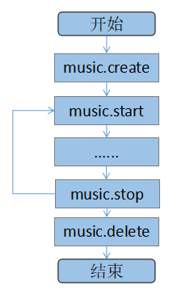

# **Rockchip_RK2206_Developer_Guide_FreeRTOS_Shell_Command_CN**

文件标识：RK-KF-YF-306

发布版本:1.1.0

日期:2019.12

文件密级：公开资料

---

**免责声明**

本文档按“现状”提供，福州瑞芯微电子股份有限公司（“本公司”，下同）不对本文档的任何陈述、信息和内容的准确性、可靠性、完整性、适销性、特定目的性和非侵权性提供任何明示或暗示的声明或保证。本文档仅作为使用指导的参考。

由于产品版本升级或其他原因，本文档将可能在未经任何通知的情况下，不定期进行更新或修改。

**商标声明**

“Rockchip”、“瑞芯微”、“瑞芯”均为本公司的注册商标，归本公司所有。

本文档可能提及的其他所有注册商标或商标，由其各自拥有者所有。

**版权所有© 2019福州瑞芯微电子股份有限公司**

超越合理使用范畴，非经本公司书面许可，任何单位和个人不得擅自摘抄、复制本文档内容的部分或全部，并不得以任何形式传播。

福州瑞芯微电子股份有限公司

Fuzhou Rockchip Electronics Co., Ltd.

地址：     福建省福州市铜盘路软件园A区18号

网址：     [www.rock-chips.com](http://www.rock-chips.com)

客户服务电话： +86-4007-700-590

客户服务传真： +86-591-83951833

客户服务邮箱： [fae@rock-chips.com](mailto:fae@rock-chips.com)

---

## **前言**

**概述**

本文档主要介绍RK2206 SDK的shell命令使用方法和内部工作原理，通过实例介绍shell命令的开发使用过程以及注意事项。

**产品版本**

| **芯片名称** | **内核版本**    |
| ------------ | --------------- |
| RK2206       | FreeRTOS V10.0.1 |

**读者对象**

本文档（本指南）主要适用于以下工程师：

技术支持工程师
软件开发工程师

---

**修订记录**

| **日期**   | **版本** | **作者**   | **修改说明**                       |
| ---------- | -------- | ---------- | ---------------------------------- |
| 2018.12.28 | 0.01     | Tony Zheng | 初始版本                           |
| 2019.6.27  | 1.0.0    | Cww        | 修改文档名以及客户服务邮箱         |
| 2019.7.26  | 1.0.1    | Cww        | 1. 修改客户服务电话<br>2. 修改文档引用 |
| 2019.12.03 | 1.1.0    | Cww        | 针对RK2206进行修改文档 |

---

## **目录**

[TOC]

---

## shell命令简介

### 配置shell

RK2206 SDK支持用户通过shell命令进行操作控制与调试。用户可通过命令make menuconfig进行打开或关闭配置。

```C
Components Config  --->
    Command shell  --->
        [ ] Enable Command shell
```

### 初识shell

如果**CONFIG_COMPONENTS_SHELL**配置打开，系统开机后将会显示如下信息：

```
***************************************************************************
*    Copyright (C) Fuzhou Rockchips Electronics CO.,Ltd                   *
*                                                                         *
*        Welcome to Use RKOS V2.0.0(D):a97c040a, c1ecec8                  *
*        Built : 11:28:07, Nov 30 2019                                    *
***************************************************************************
RK2206>
```

当出现“RK2206>”提示符后，用户可以通过串口输入命令进行调试。通过“help”命令查看当前支持的命令列表，如下：

```
RK2206>help
  rkos shell command format is:
  rkos://cmd[.<sub cmd | sub cmd package>...][ parameter...]

  Parameter  Description
  --------------------------------------------------------------------------
  cmd        Command or command package
  sub cmd    Sub command or sub command package in the command package
  parameter  Command or sub command parameter
  [xxx]      xxx Can be removed
  <xxx>      xxx Can not be removed
  x | y      x or y, only select one
  x & y      x and y, must select two
  x...       Can have a lot of x
  --------------------------------------------------------------------------
  Between two parameters, command with parameter or sub command with parameter use space character.
  Between cmd package with sub cmd package or cmd package with sub cmd use '.' .The whole cmd line is
  the end of enter key.You can input "help" cmd to list all command.The commands which are list in
  the below table can be used in some SDK use rkos.  --------------------------------------------------------------------------
        help            <command>    help cmd
        ip              <package>    ip config cmd package
        dev             <package>    rkos device manager cmd packaage
        task            <package>    rkos thread manager cmd package
        system          <package>    rkos system cmd package
        key             <package>    key device cmd package
        adc             <package>    adc device cmd package
        timer           <package>    timer device cmd package
        fw              <package>    firmeware dirver cmd package
        record          <package>    record severice cmd package
        music           <package>    music severice cmd package
       wifi            <package>    wifi severice cmd package
```

也可以通过每个命令的.help子命令查看该命令的用法，以“music”命令为例，参考如下：

```
RK2206>music.help
  music<.music sub cmd | music sub cmd package[...]> --- music send music cmd to audio controller
   music sub cmd or cmd package as the following:
        play            play song
        stop            stop song
        create          create a music player
        pause           pause song
        delete          delete a player

RK2206>music.play.help
  music.play [filename or url]
```

详细的命令用法，请参考后续章节介绍。

随着软件版本的不断完善与更新，支持的命令也将随之更新。

## shell命令开发

RK2206 SDK支持用户自定义shell命令，可以根据需求打开或者关闭部分shell命令。

### 创建shell命令文件

RK2206 SDK shell命令接口文件存放路径为：./src/subsys/shell/，文件命名规则为shell_xxx.c。用户可将自己的shell命令接口文件存储在该目录下。下面以一个简单的例子shell_music.c来描述shell文件结构，详细内容可参考其他shell命令接口文件：

```C
#include "BspConfig.h"
#ifdef CONFIG_COMPONENTS_SHELL_AUDIO_MUSIC
//......
extern SHELL_CMD ShellMusicName[];
_ATTR_SYS_BSS_ uint8 music_shell_state = 0;
//......
SHELL API rk_err_t music_shell(HDC dev, uint8 * pstr)
{
    //......
}
SHELL COMMON rk_err_t music_shell_create(HDC dev, uint8 * pstr)
{
    if (music_shell_state == 0)
    {
        music_shell_state = 1;
        FW_LoadSegment(SEGMENT_ID_AUDIOCONTROL_TASK, SEGMENT_OVERLAY_ALL);
        //......
    }
    return RK_SUCCESS;
}
SHELL COMMON rk_err_t music_shell_delete(HDC dev, uint8 * pstr)
{
    if (music_shell_state != 0)
    {
        //......
        FW_RemoveSegment(SEGMENT_ID_AUDIOCONTROL_TASK);
    }
    return RK_SUCCESS;
}
SHELL COMMON rk_err_t music_shell_play(HDC dev, uint8 * pstr)
{
    if (music_shell_state != 0)
    {
        //......
    }
    return RK_SUCCESS;
}
SHELL FUN rk_err_t music_shell_pause(HDC dev, uint8 * pstr)
{
    if (music_shell_state != 0)
    {
        //......
    }
    return RK_SUCCESS;
}
HELL COMMON rk_err_t music_shell_stop(HDC dev, uint8 * pstr)
{
    if (music_shell_state != 0)
    {
        //......
    }
    return RK_SUCCESS;
}
```

在以上的示例文件中，shell_music.c文件实现了简单的播放、暂停、停止命令。其中：

CONFIG_COMPONENTS_SHELL_AUDIO_MUSIC：宏控制开关，定义在./src/subsys/shell/Kconfig文件中，用于控制shell_music.c的编译选择。

music_shell_state：状态机控制，目的为了防止没有执行初始化命令时，直接调用其他命令导致系统异常。比如调用的代码段未被加载进来直接使用等。

ShellMusicName[]：music shell 命令接口列表。

music_shell()：该函数为music shell命令的主入口函数；

music_shell_create()：music shell命令的初始化函数；

music_shell_delete()：music shell命令的反初始化函数；

music_shell_play()，music_shell_pause()，music_shell_stop()三个函数music shell命令控制函数，实现了简单的音乐播放控制。

### 增加shell命令宏控制

RK2206 SDK支持2种增加shell命令方式。一种是参考shell_music.c，另一种方式可以参考shell_io.c（推荐参考）。
本文档主要介绍参考shell_music.c方式。
增加shell命令宏控制的目的是为了满足用户可以方便的打开或关闭一个指定的shell命令。shell命令的宏控制定义在Kconfig文件中。以上面的music shell为例，参考如下：

```C
Components Config  --->
    Command shell  --->
        [*] Enable Command shell
        [*]     Enable Audio Music Shell
```

### 增加shell命令

当shell命令文件创建完成后，shell命令接口函数需要在shell命令列表中调用，才能通过串口输入命令执行。shell命令列表文件为./src/subsys/shell/shell_cmddata.c。

首先在ShellRegisterName1[]表格中加入shell主命令，该命令可以在shell根目录下通过“help”命令查看。以music shell为例，如下（详细说明可参考下面注释）：

```C
#ifdef CONFIG_COMPONENTS_SHELL_AUDIO_MUSIC
    "music", SEGMENT_ID_MUSIC_SHELL, ShellMusicName, "<package>    music severice cmd package", "music<.music sub cmd | music sub cmd        package[...]> --- music send music cmd to audio controller\r\n   music sub cmd or cmd package as the following:",
#endif
```

其次，在./src/subsys/shell/shell_cmddata.c 文件中加入music shell 的子命令列表，参考如下

（详细说明可参考下面注释）：

```C
#ifdef CONFIG_COMPONENTS_SHELL_AUDIO_MUSIC

/*
 * Extern for Shell cmd data.
 */
SHELL FUN rk_err_t music_shell_play(HDC dev, uint8 *pstr);
SHELL FUN rk_err_t music_shell_stop(HDC dev, uint8 *pstr);
SHELL FUN rk_err_t music_shell_create(HDC dev, uint8 *pstr);
SHELL FUN rk_err_t music_shell_pause(HDC dev, uint8 *pstr);
SHELL FUN rk_err_t music_shell_delete(HDC dev, uint8 *pstr);

SHELL_CMD ShellMusicName[] =
{
//  子命令名称     接口函数             简要帮助说明     详细帮助说明
    "play",   music_shell_play,         "play song",        "music.play",
    "stop",   music_shell_stop,         "stop song",        "music.stop",
    "create", music_shell_create,       "create a music player", "music.create <dir path>",
    "pause",  music_shell_pause,        "pause song",       "music.pause",
    "delete", music_shell_delete,       "delete a player",  "music.delete",
    "\b",     NULL,                     "NULL",             "NULL",
};
#endif
```

### 注意事项

#### 使用注意事项

为了避免上述问题的发生，用户在使用shell命令时，尽量遵循以下流程，以music shell为例：



## shell命令详解

### shell命令格式说明

```
RK2206>cmd[.<sub cmd | sub cmd package>...][ parameter...]
────   ───   ─────────────────────────       ──────────
       │               │                              ├──  参数选项
       │               │                              └──  可选参数
       │               └────────────────────────────── 子命令选项
       └──────────────────────────────────────────── 主命令
```

说明：

  **<>**：必选子命令或参数
  **[]**：可选子命令或参数
  |：选择项

*命令的具体使用参见后面章节描述*。

### system

系统命令列表可通过system.help查看，如下：

```
RK2206>system.help
  system<.system sub cmd | system sub cmd package[...]>
   system sub cmd or cmd package as the following:
        help            <command>    get help informastion
        memory          <command>    count system heap memory
        settime         set system time
        gettime         get system time
        read            <command>    read memory data
        write           <command>    write memory data
        cpu             <command>    test cpu excute speed
        rkos            <command>    test rkos speed
        poweroff        <command>    system power off
        freq            <command>    display system freque
        config          <command>    display system config information
        reset           <command>    reset system
        fault           <command>    fault system
        idle1           <command>    set system idle1 event time
        q               <command>    exit package
```

随着软件版本的不断完善与更新，支持的命令也将随之更新。

#### 系统复位命令

```
RK2206>system.reset
```

#### idle1

设定系统一级休眠时间：设定时间到后，系统进入一级休眠状态。

```
设定系统一级休眠时间：设定时间到后，系统进入一级休眠状态。
RK2206>system.idle1 <time>
────   ─────  ────    ───
           │      │        ├──  单位：（S）
           │      │        └──  范围：1 ~ 2^32
           │      └────────── 子命令
           └──────────────── 主命令
```

使用样例：

```
RK2206>system.idle1 1000    //设定一级休眠时间为1000秒
```

### 系统命令task

task命令可以通过task.help查看支持的子命令及帮助说明。对于子命令，可以通过task.*subcmd*.help来查看子命令的帮助说明。

```
RK2206>task.help
  task<.task sub cmd | task sub cmd package[...]>
   task sub cmd or cmd package as the following:
        help            <command>    get help informastion
        list            <command>    list current all thread
        lw              <command>    list syste heap user
        stack           <command>    display thread stack info
        q               <command>    exit package
```

随着软件版本的不断完善与更新，支持的命令也将随之更新。

#### 查看当前系统运行的线程状态

```
RK2206>task.list
```

#### 查看当前系统堆使用情况

```
RK2206>task.lw
```

### 查看设备

dev命令可以通过dev.help查看支持的子命令及帮助说明。对于子命令，可以通过dev.*subcmd*.help来查看子命令的帮助说明。

```
RK2206>dev.help
  dev<.dev sub cmd | dev sub cmd package[...]>
   dev sub cmd or cmd package as the following:
        help            <command>    get help informastion
        list            <command>    list all aready create ok device
        q               <command>    exit package
```

随着软件版本的不断完善与更新，支持的命令也将随之更新。

#### 查看当前系统运行的设备状态

```
RK2206>dev.list
```

### 查看系统固件信息命令

fw命令可以通过fw.help查看支持的子命令及帮助说明。对于子命令，可以通过fw.*subcmd*.help来查看子命令的帮助说明。

```
RK2206>fw.help
  fw<.fw sub cmd | fw sub cmd package[...]>
   fw sub cmd or cmd package as the following:
        help            <command>    get help informastion
        inf             get fw inf
        list            get current all segment information
        test            test fw supply api
        read            test fw read
        head            get fw head info according fw seq
        q               <command>    exit package
```

随着软件版本的不断完善与更新，支持的命令也将随之更新。

#### 查看固件的内存使用及分布信息

```
RK2206>fw.inf </m | /s>
────   ── ──   ────────
         │   │        ├───  /m：按地址排序查看内存分布情况
         │   │        └───  /s：按size大小排序查看内存分布情况
         │   └─────────── 子命令
         └──────────────  主命令
```

使用样例：

```
RK2206>fw.inf /m      //按空间地址排序查看内存空间分布情况
```

#### 查看当前加载到内存运行的代码段信息

```
RK2206>fw.list
```
