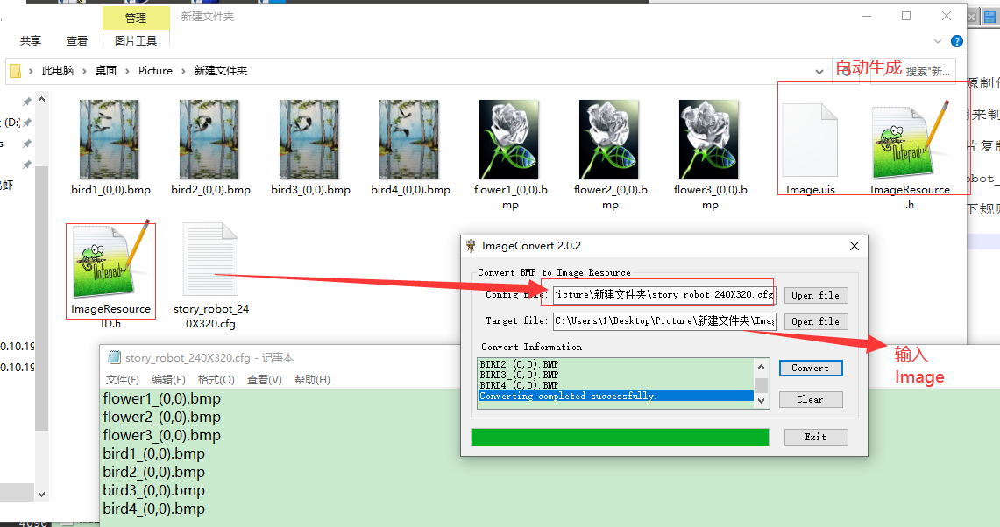
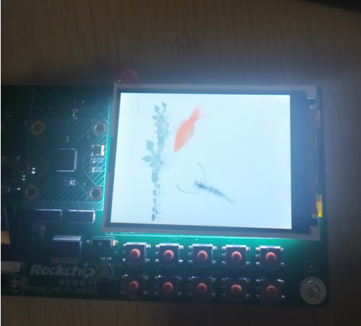

# GUI图片资源制作与使用

文件标识：RK-KF-YF-368

发布版本：V1.0.1

日期：2020-06-19

文件密级：□绝密   □秘密   □内部资料   ■公开

**免责声明**

本文档按“现状”提供，瑞芯微电子股份有限公司（“本公司”，下同）不对本文档的任何陈述、信息和内容的准确性、可靠性、完整性、适销性、特定目的性和非侵权性提供任何明示或暗示的声明或保证。本文档仅作为使用指导的参考。

由于产品版本升级或其他原因，本文档将可能在未经任何通知的情况下，不定期进行更新或修改。

**商标声明**

“Rockchip”、“瑞芯微”、“瑞芯”均为本公司的注册商标，归本公司所有。

本文档可能提及的其他所有注册商标或商标，由其各自拥有者所有。

**版权所有 © 2020 瑞芯微电子股份有限公司**

超越合理使用范畴，非经本公司书面许可，任何单位和个人不得擅自摘抄、复制本文档内容的部分或全部，并不得以任何形式传播。

瑞芯微电子股份有限公司

Rockchip Electronics Co., Ltd.

地址：     福建省福州市铜盘路软件园A区18号

网址：     [www.rock-chips.com](http://www.rock-chips.com)

客户服务电话： +86-4007-700-590

客户服务传真： +86-591-83951833

客户服务邮箱： [fae@rock-chips.com](mailto:fae@rock-chips.com)

---

**前言**

**概述**

本文介绍GUI图片资源的制作与使用，实现开机循环播放图片。

**产品版本**

| **芯片名称** | **内核版本**    |
| ------------ | ---------------- |
| RK2206       | FreeRTOS V10.0.1 |

**读者对象**

本文档（本指南）主要适用于以下工程师：

技术支持工程师

软件开发工程师

**修订记录**

| **日期**   | **版本** | **作者** | **修改说明**           |
| ---------- | -------- | --------  | ---------------------- |
| 2020-06-19 | V1.0.0   | Conway Chen | 初始版本             |
| 2020-06-28 | V1.0.1   | Conway Chen | 格式和说明改进       |

---

**目录**

[TOC]

---

## ImageConvert.exe制作GUI图像资源

SDK支持开机循环播放图片，使用特定GUI图像资源，资源制作工具位于SDK下tools/ImageConvert.exe。

1. 新建文件夹image，将app\wlan_demo\resource\Picture图片复制到image文件夹下（rkos0_(0,0).bmp rkos1_(0,0).bmp rkos2_(0,0).bmp 这三张图片是测试使用的），将你的BMP格式的图片复制到image文件夹。

2. 在image文件夹下新建文件: story_robot_240X320.cfg

文件内容为各个图片命名，以字符串“_(0,0).bmp“结尾，模板如下：

```
rkos0_(0,0).bmp
rkos1_(0,0).bmp
rkos2_(0,0).bmp
flower1_(0,0).bmp
flower2_(0,0).bmp
flower3_(0,0).bmp
bird1_(0,0).bmp
bird2_(0,0).bmp
bird3_(0,0).bmp
bird4_(0,0).bmp
```

从flower1_(0,0).bmp这个文件名以及下面所有文件名，替换为自己的图片文件名。

3. 在Windows系统下，打开ImageConvert.exe，Config file选择image文件夹下的story_robot_240X320.cfg文件，Target file输入Image，将会自动生成三个文件Image.uis、ImageResource.h、ImageResourceID.h。



## GUI图像资源的使用

使用生成的图片资源Image.uis，用于开机自动播放图片。

### 图片资源存储于内部Flash(即A盘)

1. 资源存放

如果使用app下wlan_demo，将Image.uis复制到app\wlan_demo\resource\userdata_gui目录下，ImageResource.h，ImageResourceID.h复制到app\wlan_demo\resource目录下，覆盖文件。

2. 代码修改

app/common/main_sever_base.c

```diff
diff --git a/app/common/main_sever_base.c b/app/common/main_sever_base.c
index d5544ae4..5fe90dfd 100644
--- a/app/common/main_sever_base.c
+++ b/app/common/main_sever_base.c
@@ -146,8 +146,8 @@ __WEAK void MianSever_Start(MAIN_SEVER_DATA_BLOCK *pstMainData)

         pstChainArg.x = 0;
         pstChainArg.y = 0;
-        pstChainArg.resource = IMG_ID_RKOS0;
-        pstChainArg.num = 3;
         pstChainArg.delay = 0;                //延时设置0即可
+        pstChainArg.resource = IMG_ID_BIRD1;  //设置播放第一张图片的ID(ImageResourceID.h的任意一个宏，代表从某张图片开始播放)
+        pstChainArg.num = 40;                 //图片数量，从上述宏从上往下的个数，即图片数量，注意数量不能非法
         pstChainArg.level = 0;
         pstChainArg.display = 1;
         pstChainArg.blurry = 0;
```

3. 编译设置

make menuconfig（输入/搜索）

```
开启 COMPONENTS_GUI
开启 RESOURCE_LOAD_FROM_FS ， 选择LOAD_RESOURCE_FROM_A
开启 COMPONENTS_SHELL_GUI  （这是测试GUI显示帧率，命令 gui.test）
开启 COMPONENTS_SHELL_LCD  （这是测试LCD显示帧率, 命令 lcd.test）
关闭 FRAME_BUFFER
```

### 图片资源存储于TF卡（即C盘）

1. 资源存放

将Image.uis复制到TF卡，（建议TF格式化后使用，并且不要存太多文件），将ImageResource.h，ImageResourceID.h复制到app\wlan_demo\resource目录下，覆盖文件。

2. 代码修改

app/common/main_sever_base.c

```diff
diff --git a/app/common/main_sever_base.c b/app/common/main_sever_base.c
index d5544ae4..5fe90dfd 100644
--- a/app/common/main_sever_base.c
+++ b/app/common/main_sever_base.c
@@ -146,8 +146,8 @@ __WEAK void MianSever_Start(MAIN_SEVER_DATA_BLOCK *pstMainData)

         pstChainArg.x = 0;
         pstChainArg.y = 0;
-        pstChainArg.resource = IMG_ID_RKOS0;
-        pstChainArg.num = 3;
         pstChainArg.delay = 0;                //延时设置0即可。
+        pstChainArg.resource = IMG_ID_BIRD1;  //设置播放第一张图片的ID(ImageResourceID.h的任意一个宏，代表从某张图片开始播放)。
+        pstChainArg.num = 40;                 //设置图片数量，从上述宏从上往下的个数，即图片数量，注意数量不能非法。
         pstChainArg.level = 0;
         pstChainArg.display = 1;
         pstChainArg.blurry = 0;
```

3. 编译设置

make menuconfig配置

```
开启 COMPONENTS_GUI
设置 RESOURCE_LOAD_FROM_FS  选择LOAD_RESOURCE_FROM_C (C:(user disk C))
开启 COMPONENTS_SHELL_GUI  （这是测试GUI显示帧率，命令 gui.test）
开启 COMPONENTS_SHELL_LCD  （这是测试LCD显示帧率, 命令 lcd.test）
关闭 FRAME_BUFFER
```

## 开机效果


