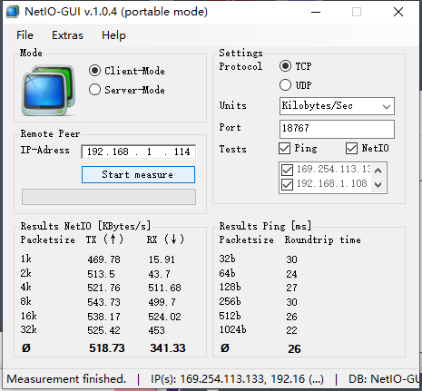

# **RK2206  Net Test Tool Developer Guide**

文件标识： RK-KF-YF-323

发布版本：v1.0.0

日期：2019-02-20

文件密级：公开资料

------

**免责声明**

本文档按“现状”提供，福州瑞芯微电子股份有限公司（“本公司”，下同）不对本文档的任何陈述、信息和内容的准确性、可靠性、完整性、适销性、特定目的性和非侵权性提供任何明示或暗示的声明或保证。本文档仅作为使用指导的参考。

由于产品版本升级或其他原因，本文档将可能在未经任何通知的情况下，不定期进行更新或修改。

商标声明

“Rockchip”、“瑞芯微”、“瑞芯”均为本公司的注册商标，归本公司所有。

本文档可能提及的其他所有注册商标或商标，由其各自拥有者所有。

版权所有 © 2020 福州瑞芯微电子股份有限公司

超越合理使用范畴，非经本公司书面许可，任何单位和个人不得擅自摘抄、复制本文档内容的部分或全部，并不得以任何形式传播。

福州瑞芯微电子股份有限公司

Fuzhou Rockchip Electronics Co., Ltd.

地址：     福建省福州市铜盘路软件园A区18号

网址：     www.rock-chips.com

客户服务电话： +86-4007-700-590

客户服务传真： +86-591-83951833

客户服务邮箱： fae@rock-chips.com

------

## **前言**

**概述**

本文旨在介绍网络测试工具的使用，如PING、NTP、IPERF、NETIO,协助嵌入式网络开发。

**产品版本**

| **芯片名称** | **内核版本**    |
| ------------ | ---------------- |
| RK2206       | FreeRTOS V10.0.1 |

**读者对象**

本文档（本指南）主要适用于以下工程师：

1. 技术支持工程师
2. 软件开发工程师

**修订记录**

| **日期**   | **版本** | **作者** | **修改说明**           |
| ---------- | -------- | --------  | ---------------------- |
| 2020-02-20 | V1.0.0   | Conway Chen | 初始版本               |

## **目录**

[TOC]

## **1 Net Test Tool**

### **1.1 功能介绍**

Net Test Tool功能如下：

| **名称** | **分类** | **描述**                                                     |
| -------- | -------- | ------------------------------------------------------------ |
| Ping     | 调试测试 | 检查网络是否连通，帮助分析网络故障                           |
| NTP      | 时间同步 | 网络时间协议                                                 |
| IPERF    | 性能测试 | 测试最大 TCP 和 UDP 带宽性能，可以报告带宽、延迟抖动和数据包丢失 |
| NetIO    | 性能测试 | 测试网络吞吐量                                               |

### **1.2 源码和编译**

Net Test Tool源码：

```
src/components/net/nettest
```

编译：

Net Test Tool在app的应用wlan_demo下，执行make rk2206_defconfig时默认开启。

```shell
app/wlan_demo/gcc$ make distclean
app/wlan_demo/gcc$ make rk2206_defconfig
app/wlan_demo/gcc$ make menuconfig
路径(top menu) → Components Config → NetWork → 已默认使能NetTest
路径(top menu) → Components Config → Command shell → 已默认使能Enable NETTEST shell cmd

app/wlan_demo/gcc$ make build -j32
```

## **2 Net Test Tool使用介绍**

网络测试工具使用前请打开通信模块，以WIFI为例:

```
启动WIFI
wifi.start sta
连接WIFI
wifi.connect WIFI名称 WIFI密码
查看IP地址
ip.config
```

### **2.1 IPERF相关命令**

```
开发板做服务器：net.iperf -s
开发板做客户端：net.iperf -c 192.168.1.1
停止iperf线程：close iperf: net.iperf -stop
```

电脑端将软件iperf.exe放在任意目录下，命令行进入该目录，命令将在该目录下执行。

[^注]: 电脑端和设备端需要在同一网段，若无法通信，查看开发板是否ping通电脑ip。(ping的命令格式是ip.ping -p 192.168.43.1 -n 10)

#### **2.1.1设备做客户端测试上行吞吐率 **

```
a.电脑端命令：iperf -s
b.设备端命令：net.iperf -c 192.168.1.2
其中：192.168.1.2是电脑IP地址
```

设备端做发送端串口显示测试log：

```
RK2206>0.9590 Mbps!
[A.iperf][000358.729723]1.0680 Mbps!
[A.iperf][000363.734740]1.0390 Mbps!
[A.iperf][000368.751523]1.0280 Mbps!
[A.iperf][000373.753226]1.0180 Mbps!
[A.iperf][000378.781155]1.0240 Mbps!
[A.iperf][000383.805898]1.0740 Mbps!
[A.iperf][000388.813714]1.0390 Mbps!
[A.iperf][000393.825331]1.0530 Mbps!
[A.iperf][000398.839937]1.0610 Mbps!
[A.iperf][000403.841329]1.0810 Mbps!
[A.iperf][000408.843667]1.0610 Mbps!
```

#### **2.1.1 设备做接收端测试下行吞吐率**

```
a.电脑端命令：net.iperf -c 192.168.1.2
其中：192.168.1.2是设备IP地址
b.设备端命令：net.iperf -s
```

电脑端命令行log：

```
[ ID] Interval       Transfer     Bandwidth
[324] 32.0-33.0 sec  24.0 KBytes    197 Kbits/sec
```

### **2.2 NTP相关命令**

```
使用默认NTP服务器：
net.ntp def

使用指定NTP服务器：
net.ntp ntp4.aliyun.com
net.ntp 203.107.6.88
```

NTP log：

```
RK2206>net.ntp def
[A.14.00][000679.230861]create thread classId = -1, objectid = 10, name = ntp_get_time, remain = 5143232
[A.14.00][000679.241438]
RK2206>[ntp] get host(ntp4.aliyun.com)ok
[A.ntp_g][000679.276866][ntp] sent to host_name_buf=ntp4.aliyun.com .OK
[A.ntp_g][000679.290780][ntp] get host(ntp5.aliyun.com)ok
[A.ntp_g][000679.325852][ntp] sent to host_name_buf=ntp5.aliyun.com .OK
[A.ntp_g][000679.339785][ntp] get host(ntp2.aliyun.com)ok
[A.ntp_g][000679.374850][ntp] sent to host_name_buf=ntp2.aliyun.com .OK
[A.ntp_g][000679.388777][ntp] Reading from server 203.107.6.88 ok
[A.ntp_g][000679.396982][ntp] Unix Timestamp:1581321334
[A.ntp_g][000679.409848][ntp] BeiJing time: 2020/02/10-15:55:34
[A.ntp_g][000679.418393]
[A.ntp_g][000679.429914]delete thread classId = -1, objectid = 10, name = ntp_get_time, remain = 5139128.
[A.ntp_g][000679.439733]

RK2206>net.ntp ntp4.aliyun.com
[A.14.00][001200.153111]create thread classId = -1, objectid = 13, name = ntp_get_time, remain = 5143232
[A.14.00][001200.160683][ntp] Create socket=1 .OK
[A.ntp_g][001200.172053]
RK2206>[ntp] get host(ntp4.aliyun.com)ok
[A.ntp_g][001200.318990][ntp] Reading from server 203.107.6.88 ok
[A.ntp_g][001200.388254][ntp] Unix Timestamp:1581321854
[A.ntp_g][001200.391108][ntp] BeiJing time: 2020/02/10-16:04:14
[A.ntp_g][001200.399652]
[A.ntp_g][001200.410154]delete thread classId = -1, objectid = 13, name = ntp_get_time, remain = 5139128.
[A.ntp_g][001200.429991]
```

### **2.3 PING相关命令**

注意本SDK包含两套PING服务，相互独立。

- 命令ip的子命令ip.ping，不支持域名解析
- 网络测试工具命令net的子命令net.ping，支持域名解析

net.ping

```
net.ping www.baidu.com
net.ping 192.168.1.1
```

ip.ping

```
ip.ping -p 192.168.43.1 -n 10
```

net.ping成功日志:

```
RK2206>net.ping www.baidu.com
[A.14.00][000219.488175]create thread classId = -1, objectid = 9, name = ping thread, remain = 5143232
[A.14.00][000219.492582]
RK2206>[ping] 60 bytes from 14.215.177.38 icmp_seq=0 ttl=55 time=20 ms
[A.ping ][000219.527954]
[A.ping ][000219.535047][ping] 60 bytes from 14.215.177.38 icmp_seq=1 ttl=55 time=20 ms
[A.ping ][000219.670913]
[A.ping ][000219.678006][ping] 60 bytes from 14.215.177.38 icmp_seq=2 ttl=55 time=20 ms
[A.ping ][000219.813908]
[A.ping ][000219.821001][ping] 60 bytes from 14.215.177.38 icmp_seq=3 ttl=55 time=20 ms
[A.ping ][000219.956914]
[A.ping ][000219.964007]
[A.ping ][000219.974495]delete thread classId = -1, objectid = 9, name = ping thread, remain = 5139128.
[A.ping ][000219.983176]

RK2206>net.ping 192.168.1.1
[A.14.00][000771.905443]create thread classId = -1, objectid = 12, name = ping thread, remain = 5143232
[A.14.00][000771.917937]
RK2206>[ping] 60 bytes from 192.168.1.1 icmp_seq=0 ttl=64 time=10 ms
[A.ping ][000771.939417]
[A.ping ][000771.943341][ping] 60 bytes from 192.168.1.1 icmp_seq=1 ttl=64 time=10 ms
[A.ping ][000771.060063]
[A.ping ][000771.068988][ping] 60 bytes from 192.168.1.1 icmp_seq=2 ttl=64 time=10 ms
[A.ping ][000771.195051]
[A.ping ][000771.203977][ping] 60 bytes from 192.168.1.1 icmp_seq=3 ttl=64 time=10 ms
[A.ping ][000771.330052]
[A.ping ][000771.338978]
[A.ping ][000771.349474]delete thread classId = -1, objectid = 12, name = ping thread, remain = 5139128.
[A.ping ][000771.359233][    720720 I] [wifi] lpw is r (5 0 6)
```

net.ping失败日志:

```
RK2206>net.ping www.baidu.com
[A.14.00][000010.083819]create thread classId = -1, objectid = 2, name = ping thread, remain = 5166240
[A.14.00][000010.087225]
RK2206>[ping] unknown host www.baidu.com
[A.ping ][000010.107127]
[A.ping ][000010.107173]
[A.ping ][000010.109079]delete thread classId = -1, objectid = 2, name = ping thread, remain = 5162136.
[A.ping ][000010.119877]
```

ip.ping成功日志:

```
RK2206>ip.ping -p 192.168.43.1 -n 10ip_addr:p
ip_addr:192.168.43.1
count:10
create thread classId = -1, objectid = 4, name = ping_test, remain = 6150672
[A.14.00][000172.53]
RK2206>
  ping 192.168.43.1  24(52) bytes of data
  ping_count=10, ping_interval = 5
  32 bytes from 192.168.43.1: TTL=64 time=32 ms
  32 bytes from 192.168.43.1: TTL=64 time=35 ms
  32 bytes from 192.168.43.1: TTL=64 time=25 ms
  32 bytes from 192.168.43.1: TTL=64 time=24 ms
  Request timeout for icmp_seq 5
  32 bytes from 192.168.43.1: TTL=64 time=26 ms
  32 bytes from 192.168.43.1: TTL=64 time=32 ms
  32 bytes from 192.168.43.1: TTL=64 time=36 ms
  32 bytes from 192.168.43.1: TTL=64 time=31 ms
  32 bytes from 192.168.43.1: TTL=64 time=27 ms
  10 packets transmitted, 9 received, 10% packet loss, average 29 msdelete thread classId = -1, objectid = 4, name = ping_test, remain = 6146568
```

### **2.4 NETIO相关命令**

NETIO可以测试测试网络吞吐量。开发板启动NETIO服务后，PC使用netio-gui_v1.0.4_portable.exe测试。

NETIO命令：

```
net.netio
```

NETIO日志：

```
RK2206>net.netio

NetIO server start successfully
```

PC测试软件：



图中IP-Adress是开发板IP地址，请使用ip.config查看。
