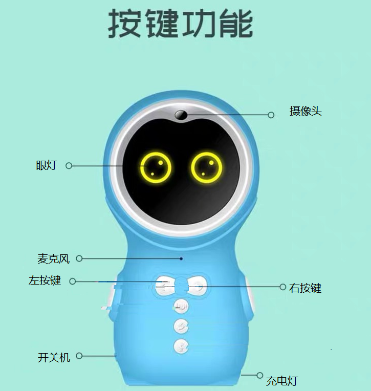

# **RK2206 PCBA Developer Guide**

文件标识：RK-KF-YF-303

发布版本：1.1.0

日期：2020.04

文件密级：内部资料

------

**免责声明**

本文档按“现状”提供，福州瑞芯微电子股份有限公司（“本公司”，下同）不对本文档的任何陈述、信息和内容的准确性、可靠性、完整性、适销性、特定目的性和非侵权性提供任何明示或暗示的声明或保证。本文档仅作为使用指导的参考。

由于产品版本升级或其他原因，本文档将可能在未经任何通知的情况下，不定期进行更新或修改。

商标声明

“Rockchip”、“瑞芯微”、“瑞芯”均为本公司的注册商标，归本公司所有。

本文档可能提及的其他所有注册商标或商标，由其各自拥有者所有。

版权所有 © 2019 福州瑞芯微电子股份有限公司

超越合理使用范畴，非经本公司书面许可，任何单位和个人不得擅自摘抄、复制本文档内容的部分或全部，并不得以任何形式传播。

福州瑞芯微电子股份有限公司

Fuzhou Rockchip Electronics Co., Ltd.

地址：     福建省福州市铜盘路软件园A区18号

网址：     www.rock-chips.com

客户服务电话： +86-4007-700-590

客户服务传真： +86-591-83951833

客户服务邮箱： fae@rock-chips.com

------

## **前言**

**概述**

本文主要针对RK2206 Story Board 的工厂测试说明。

**产品版本**

| **芯片名称** | **内核版本**     |
| ------------ | ---------------- |
| RK2206       | FreeRTOS V10.0.1 |

**读者对象**

本文档（本指南）主要适用于以下工程师：

1. 技术支持工程师
2. 软件开发工程师

**修订记录**

| **日期**   | **版本** | **作者** | **修改说明**           |
| ---------- | -------- | --------  | ---------------------- |
| 2019-11-25 | V1.0.0   | Conway.Chen | 初始版本               |
| 2019-12-28 | V1.0.1 | Conway.Chen | 更新按键功能和代码说明 |
| 2020-04-29 | V1.1.0 | Conway.Chen | 更新板级适配说明，并更新LED部分等 |

## **目录**

[TOC]

## **1 工厂模式说明**

### **1.1 按键功能**

工厂测试模式除开机自动运行的测试程序，其他测试程序需按键触发

[!注]： 不同硬件，按键对应的功能可能不同，工厂测试是根据按键触发的功能来执行的
举例：无论任何按键，只要他触发了软件上的音量加功能，工厂测试下即拍照功能

以下图故事机为例：



| **按键**           | **功能**     | **按键说明**        |
| ----------         |  ----------             |----------           |
| 同时按下左按键和右按键再开机 | 启动工厂测试模式 | 触发配网按键键 |
| 长按左按键         | “滴”一声，开始录音，眼灯闪烁，结束停止闪烁 | 触发上一首歌功能|
| 长按右按键         | “滴”一声，播放录音                         | 触发下一首歌功能|
| 短按右按键         | "滴一声"，拍照后，播放“摄像头测试成功”或”摄像头测试失败“ | 触发音量加功能 |
| 其他功能定义按键   | “滴”一声 | 触发对应的功能 |

### **1.2 进入工厂模式**

同时按下左按键和右按键(此动作为配网功能)，再开机。等待提示音“进入工厂测试模式”

### **1.3 代码和编译说明**

#### **1.3.1 工厂测试代码**

```
src/components/factory_test
```

#### **1.3.2 编译固件**

工厂测试模式需在编译前配置开启，厂测和正常应用是同一固件。烧录固件后，同时按下左右键不动再开机进入工厂测试模式，否则启动正常应用

```bash
cd app/story_robot/gcc/
make distclean
make rk2206_story_defconfig
make menuconfig
#路径：(top menu) → Components Config → Enable FACTORY TEST 选上开启厂测功能
下面是默认配置项，根据需要修改
[*] Enable FACTORY TEST
[*]     Enable debug                                              #debug
[*]     Enable Wi-FI                                              #Wi-FI test module
-*-     Enable TF card                                            #TF card test module
[ ]     Enable LCD                                                #LCD test module
[*]     Enable camera                                             #camera test module
[ ]         camera save multiple photos in TF card                #照片保存模式
[ ]     Enable Battery Check                                      #battery check module
[*]     Enable record                                             #record test module
[ ]         record data save in TF card                           #录音数据是否保存
(4)         record time                                           #录音时间设置
(32)    Set volumn                                                #音量设置
make build -j32                                                   #编译
```

### **1.4 测试原理**

| **测试项**   | **原理** |
| ----------   | -------- |
| TF卡         | 写字符串到TF卡再读出进行比较                           |
| Wi-Fi        | 扫描到Wi-Fi则成功，否则失败                            |
| 按键         | 功能按键是否有功能执行。非功能按键是否有提示音“滴”一声 |
| 眼灯/充电灯  | 是否点亮，或是否随相关应用闪烁                         |
| 录音         | 机身麦克风和话筒两种录音，录音后播放进行人工比较       |
| 摄像头       | 拍照保存在TF卡，电脑查看该文件                         |

### **1.5 测试流程**

以1.1中例图里故事机为例，建议工厂测试按以下流程:

1. 按住左右按键再开机，等待提示音“进入工厂测试模式”
2. 自动测试，播放“TF卡测试成功”，或“TF卡测试失败”
3. 自动测试，播放“Wi-Fi测试成功”，或“Wi-Fi测试失败”
4. 开机眼灯亮，充电灯一直闪烁
5. 三个功能按键按顺序测试：
    - 短按右按键，拍照，“滴”一声，等待拍照完毕，播放“摄像头测试成功”，或“摄像头测试失败”
    - 长按左按键，“滴”一声，检查眼灯是否正常闪烁，表示在录音，录音完毕闪烁停止
    - 长按右按键，“滴”一声，播放刚才的录音
6. 其他按键短按，有提示音“滴”一声表示按键正常

### **1.6 测试时间**

完整工厂测试耗时1分钟左右

| **测试单项**                      | **单项耗时** |
| ----------                        | --------     |
| 开机至进入工厂测试模式            |    7s        |
| TF卡                              |    3s        |
| Wi-Fi                             |    3s        |
| 摄像头                            |    8s        |
| 机身麦克风录音并播放              |    10s       |
| 按键                              |    6s        |
| 眼灯充电灯观察                    |    4s        |

## **2 各个测试模块的相关说明以及配置**

[!注]：相关代码说明请以SDK最新代码为准

### **2.1 工厂测试函数入口和按键定义**

开机启动的函数入口，修改进入工厂测试按键说明

```C
app/story_robot/src/main_sever/MainSever.c
COMMON API void MainTask_Enter(void *pvParameters);    //判断启动工厂测试模式还是正常工作模式
MainTask_StartFactoryTest();                           //工厂测试函数入口
MainTask_StartApp();                                   //正常应用入口
app/story_robot/src/player/play_menu_task.h
#define KEY_FUN_FACTORY_TEST_START    KEY_FUN_AIRKISS
#define KEY_FUN_FACTORY_TEST_ENTER    (KEY_FUN_AIRKISS|KEY_STATUS_PRESS)
进入工厂测试的按键，由这两个宏决定，这里表示按住配网键，再开机
```

播放器按键键值和功能定义：

```
/app/story_robot/src/player/play_menu_task.h
#define KEY_FUN_VOLUME_DOWN     KEY_VAL_FFD_SHORT_UP
#define KEY_FUN_VOLUME_UP       KEY_VAL_UP_SHORT_UP
#define KEY_FUN_PREV_MUSIC      KEY_VAL_ESC_SHORT_UP
#define KEY_FUN_NEXT_MUSIC      KEY_VAL_DOWN_SHORT_UP
#define KEY_FUN_PLAY_PAUSE      KEY_VAL_PLAY_SHORT_UP
#define KEY_FUN_AI_START        KEY_VAL_MENU_SHORT_UP
#define KEY_FUN_PICTURE_BOOK_S  KEY_VAL_VOL_PRESS_START
#define KEY_FUN_CHANGE          KEY_VAL_VOL_SHORT_UP
#define KEY_FUN_AIRKISS         KEY_VAL_FFW_PRESS_START
#define KEY_FUN_FACTORY_TEST_START    KEY_FUN_AIRKISS
#define KEY_FUN_FACTORY_TEST_ENTER    (KEY_FUN_AIRKISS|KEY_STATUS_PRESS)
```

### **2.2 增加厂测按键功能**

相关代码：

```C
src/components/factory_test/factory_test.c
COMMON FUN int FacToryTestTask_KeyEvent(uint32 KeyVal, void *arg); /*函数中switch语句，在此新增按键及其功能*/
```

### **2.3 音量设置**

编译配置:

```
make menuconfig 配置路径：(top menu) → Components Config → Factory Test → Set volumn
```

### **2.4 录音播放**

- 录音：录音时，眼灯闪烁，录音时间可配置n秒，可在n秒内提前播放，会结束录音并播放
- 播放：可多次播放

#### **2.4.1 编译配置**

```
make menuconfig 配置路径：(top menu) → Components Config → Factory Test → Enable record
子菜单 record data save in TF card               #录音保存选项: 录音数据默认不保存，可设置自动保存
子菜单 record time                               #输入时长设置: 录音时长默认4s，可设置
```

#### **2.4.2 相关代码**

```C
src/components/factory_test/factory_test.c
int record_test(void);
void record_play(void);
```

### **2.5 camera测试**

camera测试照片保存在TF卡，格式为jpeg。照片默认只保留最新一张，可设置为保存多张
camera测试成功,提示音“摄像头测试成功”;测试失败，提示音“摄像头测试失败”
导致camera测试失败原因，如SD卡不存在、摄像头读取数据buffer长度异常

#### **2.5.1 编译配置**

```
make menuconfig 配置路径：(top menu) → Components Config → Factory Test → Enable camera
子菜单camera save multiple photos in TF card选上，则照片保留多张
```

#### **2.5.2 相关代码**

```C
src/components/factory_test/factory_test.c
void camera_test();
```

### **2.6 TF卡测试**

开机自动测试。测试成功，提示音“TF卡测试成功”;测试失败,提示音“TF卡测试失败”

#### **2.6.1 编译配置**

```
make menuconfig 配置路径：(top menu) → Components Config → Factory Test → Enable TF card
```

#### **2.6.2 相关代码**

```C
src/components/factory_test/factory_test.c
void sdcard_test(void);
```

### **2.7 Wi-Fi测试**

开机自动测试。测试成功,提示音“Wi-Fi测试成功”;测试失败，提示音“Wi-Fi测试失败”

#### **2.7.1 编译配置**

```
make menuconfig 配置路径：(top menu) → Components Config → Factory Test → Enable Wi-FI
```

#### **2.7.2 相关代码**

```C
src/components/factory_test/factory_test.c
void create_wifi_thread_entry(void);
void wifi_test(void);
```

### **2.8 眼灯和充电灯**

#### **2.8.1 编译配置**

```
make menuconfig 配置路径：(top menu) → Components Config → LED → Enable LED
```

#### **2.8.2 相关代码**

```C
src/components/factory_test/factory_test.c
LedInit();                                  //初始化所有的LED,并且为每个LED创建一个线程，所以不能重复调用。
LedControl(BOARD_LED_STORY_EYE_ID, 1);      //电平控制
LedFlashingOn(BOARD_LED_STORY_CHARGE_ID);   //BOARD_LED_STORY_CHARGE_ID这个灯，启动闪烁

src/bsp/RK2206/board/rk2206_base.c
struct led led_config[] =                   //LED配置数组
{
    {BOARD_LED_STORY_EYE_ID, BOARD_LED_STORY_EYE_PIN, GPIO_LOW, 0},                 //LED_CONTROL
    {BOARD_LED_STORY_CHARGE_ID, BOARD_LED_STORY_CHARGE_PIN, GPIO_HIGH, 0},          //Charge_LED
//数组元素代表了： LED设备id、引脚、指针NULL固定、灯灭的电平、数字0固定
//新增LED控制，在此增加数组元素
};

src/bsp/RK2206/board/rk2206_base.h
#define BOARD_LED_NUM 2                     //LED的板载数量
/*led id*/                                  //定义LED设备id,为0开始顺序整数
#define BOARD_LED_STORY_EYE_ID      0
#define BOARD_LED_STORY_CHARGE_ID   1
/*led pin*/                                 //定义LED相关bank和引脚
#define BOARD_LED_STORY_EYE_GPIO      GPIO0
#define BOARD_LED_STORY_EYE_PIN       GPIO_PIN_C7
#define BOARD_LED_STORY_CHARGE_GPIO   GPIO0
#define BOARD_LED_STORY_CHARGE_PIN    GPIO_PIN_C5
/*level  control*/
#define BOARD_LED_OFF      0
#define BOARD_LED_ON       1

src/bsp/hal/lib/hal/inc/hal_pinctrl.h       //引脚定义
#define GPIO_PIN_C5 (0x00200000U)
#define GPIO_PIN_C7 (0x00800000U)

src/bsp/RK2206/board/rk2206_iomux_base.c    //LED 配置iomux
void iomux_config_led(void)
{
    HAL_PINCTRL_SetIOMUX(GPIO_BANK0,
                         GPIO_PIN_C7 |
                         GPIO_PIN_C5,
                         PIN_CONFIG_MUX_FUNC0);
}
```

### 2.9 LCD测试模块

目前LCD显示模块的工厂测试，请查看文档《Rockchip_RK2206_Introduction_PCBA_EVB_V11_CN.md》。

## 3 工厂测试模式帮助板级适配

### 3.1 编译时如何选择板级配置

RK2206 SDK支持多种板级配置，在make menuconfig选择指定单板即可。

```
(top menu) → Target Options → Board Options → Hardware Board Config
( ) RK2206 FPGA
( ) RK2206 EVB
( ) RK2206 EVB_V11                      #这里指定是单板RK2206 EVB_V11
(X) RK2206 STORY                        #这里指定是单板RK2206 STORY
( ) RK2206 STORY_V11
```

### 3.2 如何新增加一个板级配置

RK2206对不同单板，实际大部分硬件接口相同，差异性是少部分，常见于LED引脚，ADC检测电压通道，LCD背光使能引脚等。

RK2206 SDK定义了一个通用硬件配置模板，这个模板采用了__WEAK语法，所有的单板都会使用这个硬件配置，硬件差异处使用**同名定义**在自己的单板文件定义，差异处会自动覆盖__WEAK定义的同名函数。

- 通用硬件接口

```
src/bsp/RK2206/board/rk2206_base.c
src/bsp/RK2206/board/rk2206_base.h
```

- 差异处用**与通用硬件接口里同名函数**定义在自己的board文件中，注意_WEAK不要一起复制过去。

以单板rk2206_evb_v11为例

```
src/bsp/RK2206/board/rk2206_evb_v11/board.c
src/bsp/RK2206/board/rk2206_evb_v11/board.h
src/bsp/RK2206/board/rk2206_evb_v11/iomux.c
src/bsp/RK2206/board/rk2206_evb_v11/iomux.h
```

- 总结

对于一个新的单板（称为 My_board），先用工厂测试判断各模块功能，测试失败模块，查看模块硬件差异。

比如把src/bsp/RK2206/board目录下，把rk2206_evb_v11复制为rk2206_My_board。删除rk2206_My_board文件里的一些无关内容，加上自己的硬件差异。

