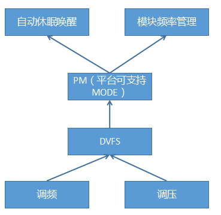
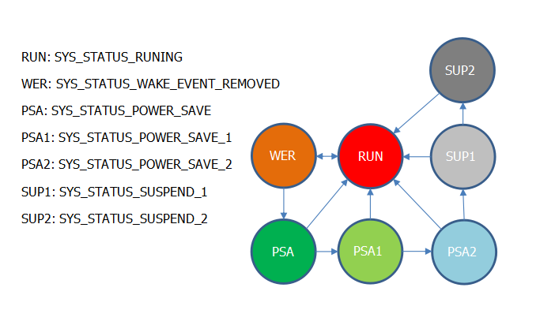

# Rockchip RK2206 Power Management Developer Guide

文件标识：RK-KF-YF-046

发布版本：V1.1.0

日期：2020-06-23

文件密级：□绝密   □秘密   □内部资料   ■公开

**免责声明**

本文档按“现状”提供，瑞芯微电子股份有限公司（“本公司”，下同）不对本文档的任何陈述、信息和内容的准确性、可靠性、完整性、适销性、特定目的性和非侵权性提供任何明示或暗示的声明或保证。本文档仅作为使用指导的参考。

由于产品版本升级或其他原因，本文档将可能在未经任何通知的情况下，不定期进行更新或修改。

**商标声明**

“Rockchip”、“瑞芯微”、“瑞芯”均为本公司的注册商标，归本公司所有。

本文档可能提及的其他所有注册商标或商标，由其各自拥有者所有。

**版权所有© 2020瑞芯微电子股份有限公司**

超越合理使用范畴，非经本公司书面许可，任何单位和个人不得擅自摘抄、复制本文档内容的部分或全部，并不得以任何形式传播。

瑞芯微电子股份有限公司

Rockchip Electronics Co., Ltd.

地址：     福建省福州市铜盘路软件园A区18号

网址：     [www.rock-chips.com](http://www.rock-chips.com)

客户服务电话： +86-4007-700-590

客户服务传真： +86-591-83951833

客户服务邮箱： [fae@rock-chips.com](mailto:fae@rock-chips.com)

---

**前言**

**概述**

 本文主要描述了RK2206 DVFS和PM Mode的原理和使用方法。

**产品版本**

| **芯片名称** | **内核版本** |
| ------------ | ------------ |
| RK2206       | FreeRTOS V10.0.1 |

**读者对象**

本文档（本指南）主要适用于以下工程师：

技术支持工程师
软件开发工程师

**修订记录**

| **版本号** | **作者** | **修改日期** | **修改说明** |
| ---------- | --------| :--------- | ------------ |
| V1.0.0     |   陈亮  | 2019-12-04  | 初始版本     |
| V1.1.0 | Aaron.sun | 2020-06-23 | 增加第一章框架，第四章自动休眠唤醒，更改部分内容使其和代码匹配 |

---

**目录**

[TOC]

---

## 1 框架



DVFS： 根据IC频率树，结合频率电压表，负责调频调压

PM（Power Management）： 提供了平台可支持的所有功耗场景

模块频率管理：根据软件模块频率表，累加系统所需要总频率，查询PM所支持的场景，选择一个最省功耗的场景

自动休眠唤醒： RKOS上的所有线程和设备按照这个休眠框架实现后，可以启动这个自动休眠逻辑，同时不影响APP的功能，自动休眠唤醒逻辑会在不同状态从PM场景中选择一个最省功耗的场景。

## 2 DVFS(Dynamic Voltage and Frequency Scaling)

### 2.1 原理

一般情况下，模块的工作频率越高，功耗也会越大，为了降低功耗，需要在适当的时候降低模块的工作频率。而不同的工作频率下，模块的需求电压也不一样，所以变频时，就需要同时调整电压，这就是动态调频调压技术。

### 2.2 配置

如果一些模块共用一个电源，需要打开DRIVER_REQ_PWR宏，保证调压时，选择所有模块需求的最高电压：

```c
    BSP Driver  --->
        [*] Enable Modules Request a Common Power
```

打开DVFS宏：

```c
    BSP Driver  --->
       [*] Enable DVFS
```

RK2206 MCU和DSP支持DVFS，频率电压表配置如下：
src/bsp/RK2206/board/rk2206_base.c

```c
#ifdef CONFIG_DRIVER_REQ_PWR
//配置regulator PWR_ID_VDD_1V1支持多个模块设置电压，core_pwr_req[2]表示允许两个模块设置电压
static uint32_t core_pwr_req[2];
__WEAK struct req_pwr_desc req_pwr_array[] =
{
    {
        .pwr_id = PWR_ID_VDD_1V1,
        .req_ctrl = {
            .info.ttl_req = HAL_ARRAY_SIZE(core_pwr_req),
            .req_vals = &core_pwr_req[0],
        }
    }
};
#endif

#ifdef CONFIG_DRIVER_DVFS
__WEAK const struct dvfs_table dvfs_mcu_table[] =
{
    {
        .freq = 96000000,  //频率，单位: Hz
        .volt = 1000000,   //电压，单位: uV
    },
    {
        .freq = 192000000,
        .volt = 1000000,
    },
};

__WEAK const struct dvfs_table dvfs_dsp_table[] =
{
    ......
};

__WEAK struct rk_dvfs_desc dvfs_data[] =
{
    {
        .clk_id = HCLK_MCU_BUS,       //指定使用的clk ID
        .pwr_id = PWR_ID_VDD_1V1,     //指定使用的regulator ID
        .tbl_idx = 1,                 //初始化时使用的频率电压表index
        .table = &dvfs_mcu_table[0],  //指定使用的频率电压表
        .tbl_cnt = HAL_ARRAY_SIZE(dvfs_mcu_table),  //频率电压个数
    },
    {
        .clk_id = CLK_HIFI3,
        .pwr_id = PWR_ID_VDD_1V1,
        .tbl_idx = 3,
        .table = &dvfs_dsp_table[0],
        .tbl_cnt = HAL_ARRAY_SIZE(dvfs_dsp_table),
    },
};
#endif

__WEAK void PM_DVFS_Init(void)
{
#ifdef CONFIG_DRIVER_REQ_PWR
    /* 注册多个模块共用一个regulator的数据 */
    regulator_req_desc_init(req_pwr_array, HAL_ARRAY_SIZE(req_pwr_array));
#endif

#ifdef CONFIG_DRIVER_DVFS
    /* 注册dvfs数据 */
    dvfs_desc_init(dvfs_data, HAL_ARRAY_SIZE(dvfs_data));
#endif

    /* dvfs和regulator-req框架初始化 */
    regulator_req_init();
    clk_req_init();
    dvfs_init();

    ...
}
```

### 2.3 代码和API

- src/driver/dvfs/drv_dvfs.c
- include/driver/drv_dvfs.h

```c
/* 通过clk_id获取dvfs描述符，如果只有一个模块设置频率，dvfs_clk_req_id设置为NULL */
struct rk_dvfs_desc *dvfs_get_by_clk(eCLOCK_Name clk_id, uint8_t *dvfs_clk_req_id);
/* 设置频率，rate要在dvfs表格里面，如果只有一个模块设置频率，dvfs_clk_req_id设置为0 */
rk_err_t dvfs_set_rate(struct rk_dvfs_desc *dvfs_desc, uint8_t dvfs_clk_req_id, uint32_t rate);
/* 设置频率，tbl_idx为dvfs表的索引，如果只有一个模块设置频率，dvfs_clk_req_id设置为0 */
rk_err_t dvfs_set_rate_by_idx(struct rk_dvfs_desc *dvfs_desc, uint8_t tbl_idx, uint8_t dvfs_clk_req_id);

```

### 2.4 使用范例

RK2206 DSP通过DVFS设置频率：

```c
#include "driver/drv_dvfs.h"

struct rk_dvfs_desc *desc_dsp；

desc_dsp = dvfs_get_by_clk(CLK_HIFI3, NULL);
dvfs_set_rate(desc_dsp, 0, 192000000); //DSP支持频率：48M/96M/192M/327.68M
```

## 3 Power Management

### 3.1 原理

很多应用对系统性能需求不一样，需要统计不同的应用需求，设置一个合理的系统性能（比如：mcu/mem/bus频率），保证应用能够流畅地运行。PM Mode框架用来汇总应用对系统性能的需求，最终选择一个合理的配置。

### 3.2 配置

打开DRIVE_PM宏：

```c
    BSP Driver  --->
        [*] Enable Power Management
```

RK2206 PM Mode根据系统性能需求，通过DVFS设置MCU的频率，相关配置如下：
src/bsp/RK2206/board/rk2206_evb/board.c

```c
#ifdef CONFIG_DRIVER_PM
/* 每个项分别表示PM Mode状态变化时，需要调整频率的模块 */
static struct pm_mode_dvfs pm_mode_data[] =
{
    {
        .clk_id = HCLK_MCU_BUS,    //RK2206只调整MCU的频率
        .run_tbl_idx = {1, 1, 0},  //RK2206 PM Mode支持三种mode:high\normal\low，run_tbl_idx分别对应这三种模式下MCU DVFS表的index
    },
};
#endif

void PM_DVFS_Init(void)
{
    ...

#ifdef CONFIG_DRIVER_PM
    /* 注册PM Mode需要的数据 */
    rk_pm_register_dvfs_info(pm_mode_data, HAL_ARRAY_SIZE(pm_mode_data), NULL);
#endif
    /* PM Mode框架初始化 */
    rk_pm_init();
}
```

### 3.3 代码和API

- src/driver/pm/drv_pm.c
- src/kernel/pm/pm.c
- include/driver/drv_pm.h
- include/kernel/pm.h

```c
/* 系统支持的mode */
enum
{
    PM_RUN_MODE_HIGH = 0,
    PM_RUN_MODE_NORMAL,
    PM_RUN_MODE_LOW,
};

/* 设置开机时默认的mode，这里设置成1，即NORMAL Mode，RK2206对应DVFS表index=1，频率192MHz */
#ifndef PM_RUN_MODE_DEFAULT
#define PM_RUN_MODE_DEFAULT     1
#endif

/* 请求系统进入需求mode */
void rkos_pm_request(uint8 mode);
/* 释放mode */
void rkos_pm_release(uint8 mode);
```

### 3.4 使用范例

```
#include "kernel/pm.h"

void main(void)
{
    rkos_pm_request(PM_RUN_MODE_HIGH);

    /* do someting */

    rkos_pm_release(PM_RUN_MODE_HIGH);
}
```

### 3.5 shell调试命令

打开COMPONENTS_SHELL_PM_TEST宏：

```c
Components Config  --->
    Command shell  --->
        [*]     Enable PM_TEST Shell
```

命令：

```c
RK2206>pm
Usage:
    pm req <mode>    request power management mode
    pm rel <mode>    release power management mode
    pm dump          dump power management status

RK2206>pm dump
[A.14.00][000042.951412]| Power Management Mode | Counter |
[A.14.00][000042.960532]+-----------------------+---------+
[A.14.00][000042.974676]|     Running High Mode |       0 |
[A.14.00][000042.983884]|   Running Normal Mode |       1 |
[A.14.00][000042.998087]|      Running Low Mode |       0 |
[A.14.00][000042.008300]|            Sleep Mode |       1 |
[A.14.00][000042.013508]|            Timer Mode |       0 |
[A.14.00][000042.023712]|         Shutdown Mode |       1 |
[A.14.00][000042.028918]+-----------------------+---------+-------+
[A.14.00][000042.039804]pm current mode: Running Normal Mode
```

## 4 自动休眠与唤醒

### 4.1 原理

RKOS 电源管理器根据系统运行状态分别向任务管理器和设备管理器发送休眠时钟信号，任务管理器在休眠时钟信号的节拍下事先设定模式逐个休眠线程，每个时钟节拍休眠1个线程，同理设备管理休眠设备。当系统满足一定的条件时，电源管理器调用PM Mode相关接口，对系统的功耗模式进行设定。

### 4.2 KCONFIG

```c
At src/kernel/Kconfig:83
Included via /home/sch/rkos_repo/app/wlan_demo/gcc/../../../Kconfig:135
Menu path: (top menu) -> RKOS

  config SUSPEND_RESUME
        bool
        prompt "enable system suspend resume"
        default "n"
```

### 4.3 状态迁移图

从电源管理的角度对RKOS系统状态划分如下：

```C
typedef enum _SYS_STATUS
{
    /*system runing*/
    SYS_STATUS_RUNING = 0,
    /*the all wake events are removed, the wake events need call rkpm_wake_system*/
    SYS_STATUS_WAKE_EVENT_REMOVED,
    /*power save mode, rkpm will suspend thread and device by set time*/
    SYS_STATUS_POWER_SAVE,
    /*the all threads are suspend except IDLE, Tmr Svc, taskm, dm*/
    SYS_STATUS_POWER_SAVE_1,
    /*the all device are suspend except watchdog uart*/
    SYS_STATUS_POWER_SAVE_2,
    /*the all device are suspend*/
    SYS_STATUS_SUSPEND_1,
    /*the all thread are suspend and cpu power down*/
    SYS_STATUS_SUSPEND_2,
    SYS_STATUS_MAX
} SYS_STATUS;
```

| 状态名             | 进入条件                                                     | 描述                                                         |
| ------------------ | ------------------------------------------------------------ | ------------------------------------------------------------ |
| RUNING             | 开机或者调用rkpm_wake_system                                 | 系统正在运行时PM Mode=Running High Mode                      |
| WAKE_EVENT_REMOVED | 超过预定的时间未调用rkpm_wake_system                         | 该状态被认定所有的前台事件被撤销，系统关闭一些和前台相关设备，例如LCD. PM Mode=Running Normal Mode |
| POWER_SAVE         | WAKE_EVENT_REMOVED状态超过一定时间                           | 电源管理器分别向设备管理器和任务管理器发送休眠时钟 PM Mode=Running Normal Mode |
| POWER_SAVE_1       | 系统中只剩IDLE, Tmr Svc, taskm, dm未休眠                     | 电源管理器对线程的具体要求参考， PM Mode=Running Low Mode    |
| POWER_SAVE_2       | 系统中只剩watchdog uart 2设备未休眠                          | 电源管理器对设备的具体要求参考 PM Mode=Running Low Mode      |
| SUSPEND_1          | 系统所有的设备均有休眠                                       | 系统极低频率在运行处理一些特殊事情，PM Mode=Sleep Mode       |
| SUSPEND_2          | SUSPEND_1超过一定时间，并且所有的线程和设备都在二级休眠状态下 | 线程，设备进入2级休眠，CPU下电，PM mode = Shutdown Mode      |



### 4.4 线程休眠状态

```C
typedef enum _TASK_STATE
{
    TASK_STATE_WORKING,
    TASK_STATE_IDLE1,
    TASK_STATE_IDLE2,
    TASK_STATE_NUM
} TASK_STATE;
```

| 状态名             | 进入条件                                                     | 描述                                                         |
| ------------------ | ------------------------------------------------------------ | ------------------------------------------------------------ |
| TASK_STATE_WORKING | 线程创建                                                     | 线程随时都可能被唤醒                                         |
| TASK_STATE_IDLE1   | 系统在POWER_SAVE,POWER_SAVE_1,POWER_SAVE_2模式下，长时间未清楚休眠计数器 | ENABLE模式：线程会被冻结，FORCE_MODE：线程不被冻结，非冻结的线程随时都可以处于运行态 |
| TASK_STATE_IDLE2   | 设备在 TASK_STATE_IDLE1模式下长时间未被唤醒                  | 线程在掉电内存中的重要数据压缩搬移到非掉电内存               |

### 4.5 线程休眠模式

```c
//suspend mode
/*device: when not used and idle tick > idle1 value enter suspend level1, >idle2 value enter suspend level2*/
/*thread: when idle tick >idle1 value enter suspend level1, >idle2 value enter suspend level2, thread will be freeze*/
#define ENABLE_MODE    0X00
/*thread or device refuse suspend*/
#define DISABLE_MODE     0x01
/*device: when idle tick > idle1 value enter suspend level1, >idle2 value enter suspend level2*/
/*thread: when idle tick > idle1 value enter suspend level1, >idle2 value enter suspend level2, thread can onself resume*/
#define FORCE_MODE      0X02
```

| 模式名       | 说明                                                         |
| ------------ | ------------------------------------------------------------ |
| ENABLE_MODE  | 支持休眠，默认模式，系统在POWER_SAVE,POWER_SAVE_1,POWER_SAVE_2会累加线程休眠COUNTER，累加到设定值时，调用休眠函数后冻结该线程，可以调用rktm_disable_task_suspend  或者 rktm_clear_task_idle_counnter防止线程被冻结。 |
| DISABLE_MODE | 禁止休眠，此模式可以防止设备冻结线程，系统中存在拒绝休眠的线程时，无法进入SUSPEND_1 |
| FORCE_MODE   | 强制休眠，此模式系统在POWER_SAVE,POWER_SAVE_1,POWER_SAVE_2会累加线程休眠COUNTER，累加到设定值时，调用休眠函数但不冻结该线程，需要设计者在线程运行时自行确认线程休眠状态，然后调用唤醒接口进行自唤醒，自唤醒的线程并不影响系统的休眠状态。 |

### 4.6设备休眠状态

```c
typedef enum _DEV_STATE
{
    DEV_STATE_WORKING,
    DEV_STATE_IDLE1,
    DEV_STATE_IDLE2,
    DEV_STATE_MAX,
} DEV_STATE;
```

| 状态名            | 进入条件                                                     | 描述                                                         |
| ----------------- | ------------------------------------------------------------ | ------------------------------------------------------------ |
| DEV_STATE_WORKING | 设备创建                                                     | 设备处于工作状态，API可以随时被调用                          |
| DEV_STATE_IDLE1   | 系统在POWER_SAVE,POWER_SAVE_1,POWER_SAVE_2模式下，长时间未清楚休眠计数器 | ENABLE模式：设备会被休眠，API不能使用，FORCE_MODE：设备被休眠，API可以使用 |
| DEV_STATE_IDLE2   | 设备在 DEV_STATE_IDLE1模式下长时间未被唤醒                   | 线程，设备在掉电内存中的重要数据压缩搬移到非掉电内存         |

### 4.7 设备休眠模式

```c
//suspend mode
/*device: when not used and idle tick > idle1 value enter suspend level1, >idle2 value enter suspend level2*/
/*thread: when idle tick >idle1 value enter suspend level1, >idle2 value enter suspend level2, thread will be freeze*/
#define ENABLE_MODE    0X00
/*thread or device refuse suspend*/
#define DISABLE_MODE     0x01
/*device: when idle tick > idle1 value enter suspend level1, >idle2 value enter suspend level2*/
/*thread: when idle tick > idle1 value enter suspend level1, >idle2 value enter suspend level2, thread can onself resume*/
#define FORCE_MODE      0X02
/*device: when not used and idle tick > idle1 value enter suspend level1, >idle2 value enter suspend level2*/
#define CHECK_MODE    0X03
```

| 模式名       | 说明                                                         |
| ------------ | ------------------------------------------------------------ |
| ENABLE_MODE  | 支持休眠，默认模式，系统在POWER_SAVE_1,POWER_SAVE_2会累加设备休眠COUNTER，累加到设定值时，调用休眠函数，系统唤醒时，同时唤醒该设备 |
| DISABLE_MODE | 禁止休眠，此模式可以禁止系统休眠设备，使其无法进入POWER_SAVE_2 |
| FORCE_MODE   | 强制休眠，此模式系统在POWER_SAVE,POWER_SAVE_1,POWER_SAVE_2会累加线程休眠COUNTER，累加到设定值时，调用休眠函数，需要设计者在API被调用时自行确认设备休眠状态，然后调用唤醒接口进行自唤醒，自唤醒的设备并不影响系统的休眠状态。 |
| CHECK_MODE   | 系统在POWER_SAVE,POWER_SAVE_1,POWER_SAVE_2会累加设备休眠COUNTER，累加到设定值时，且设备没有使用时，调用休眠函数，调用rkdev_open唤醒此设备 |

