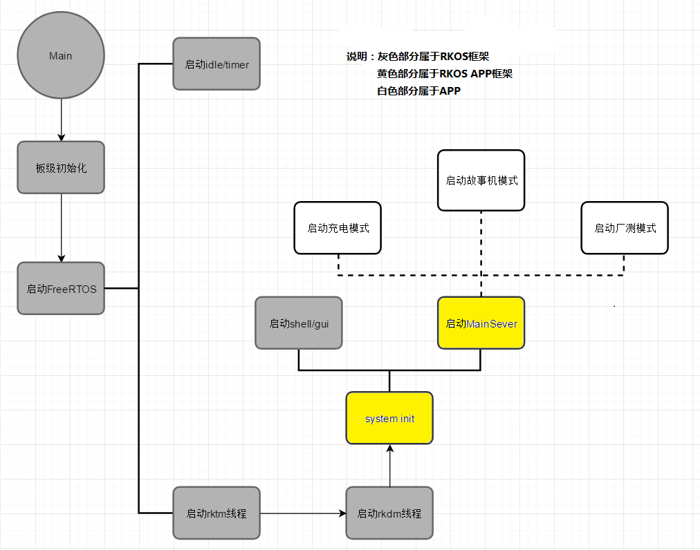

# Rockchip RK2206 RKOS APP 框架指南

文件标识：RK-KF-YF-335

发布版本：V1.0.0

日期：2020-02-15

文件密级：□绝密   □秘密   □内部资料   ■公开

---

**免责声明**

本文档按“现状”提供，福州瑞芯微电子股份有限公司（“本公司”，下同）不对本文档的任何陈述、信息和内容的准确性、可靠性、完整性、适销性、特定目的性和非侵权性提供任何明示或暗示的声明或保证。本文档仅作为使用指导的参考。

由于产品版本升级或其他原因，本文档将可能在未经任何通知的情况下，不定期进行更新或修改。

**商标声明**

“Rockchip”、“瑞芯微”、“瑞芯”均为本公司的注册商标，归本公司所有。

本文档可能提及的其他所有注册商标或商标，由其各自拥有者所有。

**版权所有© 2020福州瑞芯微电子股份有限公司**

超越合理使用范畴，非经本公司书面许可，任何单位和个人不得擅自摘抄、复制本文档内容的部分或全部，并不得以任何形式传播。

福州瑞芯微电子股份有限公司

Fuzhou Rockchip Electronics Co., Ltd.

地址：     福建省福州市铜盘路软件园A区18号

网址：     [www.rock-chips.com](http://www.rock-chips.com)

客户服务电话： +86-4007-700-590

客户服务传真： +86-591-83951833

客户服务邮箱： [fae@rock-chips.com](mailto:fae@rock-chips.com)

---

## **前言**

**概述**

本文档主要介绍RK2206 RKOS 相关开发方法。

**产品版本**

| **芯片名称** | **内核版本**     |
| ------------ | ---------------- |
| RK2206       | FreeRTOS V10.0.1 |

**读者对象**

本文档（本指南）主要适用于以下工程师：

技术支持工程师

软件开发工程师

**修订记录**

| **日期**  | **版本** | **作者**           | **修改说明**               |
| --------- | -------- | ------------------- | -------------------------- |
| 2020-02-15 | V1.0.0  | Aaron. Sun          | 初始版本                   |

---

## **目录**

[TOC]

---

## 1 APP启动流程

下图展示了APP启动顺序，黑色部分和APP无关，黄色部分为APP框架，代码位于app/common目录下，主要是__WEAK修饰的函数，每个APP可以在自己目录中重新定义这些APP，白色部分是具体APP的功能。



### 1.1 system init

在每个APP的src 目录下有个system_init.c文件，里面包含4个重要的函数， RKOS不同于其他系统的一个特点是，驱动，组件的加载是各个APP按需加载, 在app/common 目录下面有个system_init_base.c里面定义4个__WEAK修饰的同名的函数，如果没有新增功能，可以删除system_init.c所有的函数，如：wlan_demo, story_robot

```c
INIT API void LoadSysInformation(void)
{
    /*加载系统保存的一些信息*/
}

COMMON API void PnPSever(void)
{
    /*TF卡， USB,  话筒设备的即插即用*/
}

INIT API void system_init(void)
{
    /*固件分析，备份，修复*/
    /*支持APP的各种设备树创建*/
    /*调用LoadSysInformation， 加载系统信息*/
    /*创建rkpm, shell, gui, mainsever*/
}

INIT API void system_deinit(void)
{
    /*删除rkpm, shell, gui, mainsever*/
    /*保存系统信息*/
    /*删除各种设备树*/
}
```

### 1.2 main sever

main sever相当于RKOS APP管理器， 所有的系统事件都汇聚到这里，比如低电，TF卡插入，拔出， 关机，重启等等。main sever还提供了一个标记设置框架，很好的解决了多线程之间的通信和ICON状态的刷新, 在app/common目录下有个main_sever_base.c, 里面定义了通用函数，使用__WEAK修饰，用户可以在每个APP目录下面的MainSever.c重新定义相应的函数，比如story_robot的MianSever_Start函数。

```c
int32 MainTask_HandleSysEvent(uint32 event)
{
    /*所有系统事件的处理入口*/
}

COMMON API rk_err_t MainTask_SysEventCallBack(uint32 event, void *arg)
{
    /*调用此接口向 mian sever 发送系统事件*/
}

COMMON API uint8 MainTask_GetStatus(uint32 StatusID, uint32 Delay)
{
    /*获取系统上一个标记，获取不到可以挂起，Delay是挂起时间*/
}

COMMON API rk_err_t MainTask_SetStatus(uint32 StatusID, uint8 status)
{
    /*设置一个标记*/
}
```

为了满足main sever的框架，必须实现以下函数，这些函数必须在APP代码中定义，如果没有定义，框架会用一个空的函数替代。

```c
__WEAK void MainTask_StartApp(void) {/*启动app*/}
__WEAK void MainTask_ShutDown(int flag) {/*关机动画*/}
__WEAK void MainTask_DeleteAllApp(uint32 event) {/*删除所有APP相关，包括APP启动组件和设备树*/}
__WEAK void MainTask_Animation(void) {/*开机动画*/}
__WEAK void MainTask_Task_MallocFail(void *hTask) {/*内存申请失败显示*/}
__WEAK void MainTask_Segment_LoadFail(uint32 SegmentID) {/*代码加载失败显示*/}
__WEAK void MainTask_CallOut(void) {/*拨打蓝牙电话显示*/}
__WEAK void MainTask_CallIn(void) {/*蓝牙电话输入显示*/}
__WEAK void MainTask_HandleAudioEvent(uint32 event) {/*播放器状态改变显示*/}
__WEAK void MainTask_SetTopIcon(uint32 StatusID) {/*设置标记状态显示*/}
__WEAK void MainTask_DeleteTopIcon(uint32 StatusID) {/*清除标记时状态显示*/}
__WEAK void MianSever_Start(MAIN_SEVER_DATA_BLOCK *pstMainData) {/*启动 main sever服务*/}
```

### 1.3 scatter loader

scatter loader是RKOS的引导程序，由于每个APP的对内存的需求不同，RKOS上没有动态内存管理，这样不同APP就有不同的内存空间，为了更好的对内存进行管理，RKOS将内存相关的初始化代码抽出，放到APP框架中，这样RKOS内核就不用关心内存问题， app/common目录下的scatter_base.c 和 module_info_base.h定义了内存和固件相关的信息，PowerOn_Reset是RKOS的引导程序入口。

## 2 APP事件流

RKOS APP事件流分2种，一个是有GUI的事件流，另一个是无GUI的事件流，所有的事件单发单接，可以流转，分可丢失事件和不可丢失事件2种。

### 2.1按键事件流

按键事件是一种可丢失（长按松开事件除外），单发单接，可以流转的事件，其流从按键驱动发出，途径MainSever（非GUI，有GUI，按键驱动直接流向GUI模块，GUI模块流向APP）,  最终流转到APP的事件接收队列中，APP调用以下函数注册按键事件接收函数：

```c
COMMON API rk_err_t MainTask_RegisterKey(pKeyFunc func)

COMMON API rk_err_t MainTask_UnRegisterKey(void)

COMMON API rk_err_t GUI_AppReciveMsg(P_APP_RECIVE_MSG pApp)

COMMON API rk_err_t GuiTask_AppUnReciveMsg(P_APP_RECIVE_MSG pApp)
```

关于GUI和main sever中的按键事件结构，请参考其他文档, 在编写按键事件接收函数，注意不要锁死按键驱动，按键驱动由Tmr Svc线程调用，Tmr Svc线程是FreeRTOS的timer线程，意义重大。

### 2.2 系统事件流

系统事件需要发送到main sever中统一处理，比如开关，复位，TF卡插入，USB插入等，这类独立于APP的事件需要调用如下函数发送给MainSever

```c
COMMON API rk_err_t MainTask_SysEventCallBack(uint32 event, void *arg)
```

### 2.3 状态事件流

RKOS的所有状态，包括系统状态，模块状态，APP状态等需要调用Main Sever提供的2个API：

```c
COMMON API rk_err_t MainTask_SetStatus(uint32 StatusID, uint8 status)

COMMON API uint8 MainTask_GetStatus(uint32 StatusID, uint32 Delay)
```

APP需要实现这2个函数的回调函数用来设置APP的显示状态，比如TF卡插入，要闪灯或者在LCD屏幕显示一个图标，就需要在以下函数中实现：

```c
__WEAK void MainTask_SetTopIcon(uint32 StatusID) {/*设置标记状态显示*/}
__WEAK void MainTask_DeleteTopIcon(uint32 StatusID) {/*清除标记时状态显示*/}
```

## 3 APP说明

| APP名称     | 功能                                                         | 位置            | 主要用途                                                     |
| ----------- | ------------------------------------------------------------ | --------------- | ------------------------------------------------------------ |
| test_demo   | shell                                                        | app/test_demo   | test demo APP 是RKOS的最小系统，仅有shell命令，主要用于对RKOS框架比较熟悉之后，针对特殊的应用编出最精简的固件，所以模块都需要自己配置打开，完成设备树初始化的编写等。 |
| wlan_demo   | shell、 mainsever、故事机所需要的组件                        | app/wlan_demo   | wlan demo APP 提供了故事机的所有运行组件和驱动，方便于命令来测试客户的板子，如果用户自己有APP的，可以以WLAN_DEMO为模板，结合APP启动流程和事件流的要求，对接自己的APP. |
| story_robot | shell、mainsever、故事机所需要的组件，故事机，工厂测试、充电模式 | app/story_robot | story_robot APP提供了完整的故事机框架和流程，客户只需要修改一些按键和显示，配置各个OEM的授权，就可以实现自己故事机，如果客户没有APP，可以以story_robot为模板来实现自己的APP. |