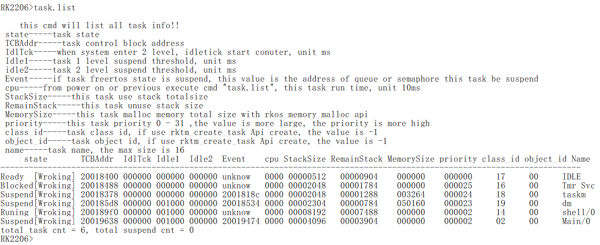
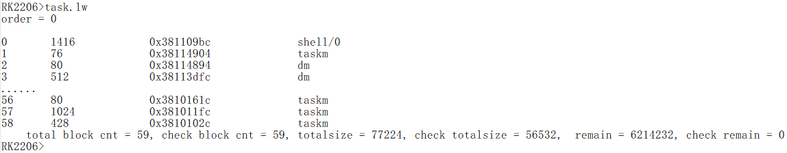

# **Rockchip RK2206 FreeRTOS Modules Introduction**

文件标识：RK-SM-CS-001

发布版本：1.0.2

日       期：2019.11

文件密级：公开资料

---

## **免责声明**

本文档按“现状”提供，福州瑞芯微电子股份有限公司（“本公司”，下同）不对本文档的任何陈述、信息和内容的准确性、可靠性、完整性、适销性、特定目的性和非侵权性提供任何明示或暗示的声明或保证。本文档仅作为使用指导的参考。

由于产品版本升级或其他原因，本文档将可能在未经任何通知的情况下，不定期进行更新或修改。

**商标声明**

“Rockchip”、“瑞芯微”、“瑞芯”均为本公司的注册商标，归本公司所有。

本文档可能提及的其他所有注册商标或商标，由其各自拥有者所有。

**版权所有** **© 2019** **福州瑞芯微电子股份有限公司**

超越合理使用范畴，非经本公司书面许可，任何单位和个人不得擅自摘抄、复制本文档内容的部分或全部，并不得以任何形式传播。

福州瑞芯微电子股份有限公司

Fuzhou Rockchip Electronics Co., Ltd.

地址：     福建省福州市铜盘路软件园A区18号

网址：     www.rock-chips.com

客户服务电话： +86-4007-700-590

客户服务传真： +86-591-83951833

客户服务邮箱： fae@rock-chips.com

---

## **前言**

**概述**

本文主要针对RK2206 FreeRTOS SDK的基本模块测试方法进行说明。

**产品版本**

| **芯片名称** | **内核版本**     |
| ------------ | ---------------- |
| RK2206       | FreeRTOS V10.0.1 |

**读者对象**

本文档（本指南）主要适用于以下工程师：

​        技术支持工程师

​        软件开发工程师

## **修订记录**

| **日期**   | **版本** | **作者** | **修改说明**           |
| ---------- | -------- | -------- | ---------------------- |
| 2019-09-28 | V0.0.1   | CWW      | 初始版本               |
| 2019-10-08 | V0.0.2   | Jair Wu  | 增加录音和回采测试说明 |
| 2019-10-09 | V0.0.3   | CWW      | 修改Wi-Fi测试          |
| 2019-10-10 | V0.0.4   | CWW      | 修改文档格式           |
| 2019-10-10 | V0.0.5   | Jair Wu  | 完善录放音测试命令     |
| 2019-10-10 | V0.0.6   | Jair Wu  | 添加在线播放说明       |
| 2019-10-11 | V0.0.7   | Conway   | 添加iperf、key、Wi-Fi频偏、camera测试 |
| 2019-10-11 | V0.0.8   | Jair Wu  | 添加Shell Audio使用说明|
| 2019-10-11 | V0.0.9   | Jair Wu  | 添加声卡号获取说明     |
| 2019-10-16 | V0.0.10  | Jair Wu  | 添加music/record stop/delete命令 |
| 2019-10-17 | V0.0.11  | Jair Wu  | 添加Xmodem使用说明     |
| 2019-10-26 | V0.0.12  | Conway   | 添加SD卡读写测试说明   |
| 2019-10-26 | V0.0.13  | CWW      | 添加系统命令说明       |
| 2019-11-27 | V1.0.0   | CWW      | 修改文档排版           |
| 2019-12-26 | V1.0.1   | Jair Wu  | 更新播放、录音测试命令 |
| 2019-12-26 | V1.0.2   | Conway   | 更新Wi-Fi频偏测试说明  |

## **目录**

[TOC]

---

## **1 TF卡识别测试**

插入TF卡，开机后待驱动初始化OK，log如下

Volume Size = 15629312, Volume Free Size = 15587952delete thread classId = -1, objectid = 0, name = fat, remain = 6215440

测试命令：

```
file.setpath C:\
file.ls /f
```

测试log：

```
RK2206>file.setpath C:\
  curpath:C:\
RK2206>file.ls /f
  C:\ dir and file as Follow:
2019-09-23 19:42:34 <DIR> SYSTEM~1.
2014-01-01 00:00:00 <DIR> Tale~840.
2014-01-01 00:00:00 <DIR> Song~848.
2014-01-01 00:00:00 <DIR> Engl~856.
```

## **2 播放测试**

当前支持以下三种测试命令，其中audio.tx固定播放正弦信号，tplay支持本地wav文件播放，应用播放器支持本地wav和mp3文件以及在线mp3音频流播放

### **2.1 audio.tx**

测试命令：

~~~
audio.tx -D sound3p -t 10 -f 2
~~~

测试log：

```
RK2206>audio.tx -D sound3p -t 10 -f 2
[A.14.00][001349.124081]audio buffer addr: 0x382323a0
[A.14.00][001349.133805]audio buffer size: 2048 frames, period: 1024 frames
[A.14.00][001349.146320]Playing sample: 2 ch, 16000 hz, 16 bit
[A.14.00][001349.154781]spend 1 ms to write 1024 frames, timeout left 9999 ms
[A.14.00][001349.169511]spend 1 ms to write 2048 frames, timeout left 9998 ms
...
[A.14.00][001359.211798]spend 62 ms to write 166912 frames, timeout left 21 ms
[A.14.00][001359.282763]spend 62 ms to write 167936 frames, timeout left -41 ms
[A.14.00][001360.347818]
```

### **2.2 tplay**

测试命令：

```
file.setpath A:\
tplay A:\music5s.wav -D sound3p -p 2048 -n 4 -t 1000
```

测试log：

```
RK2206>file.setpath A:\
RK2206>tplay A:\music5s.wav -D sound3p -p 2048 -n 4 -t 1000
[A.14.00][000233.91][D]rkos_file_open-484: open file:38205404
[A.14.00][000233.91]audio buffer addr: 0x38222be0
[A.14.00][000233.92]audio buffer size: 8192 frames
[A.14.00][000233.93]Playing sample: 2 ch, 16000 hz, 16 bit
[A.14.00][000233.93]
RK2206>
```

### **2.3 应用播放器**

#### **2.3.1 本地播放**

测试命令：

```
music.create
music.play A:\music5s.wav
music.stop
```

测试log：

```
RK2206>music.create

[A.14.00][000004.634941]create thread classId = -1, objectid = 2, name = preprocess_task, remain = 5124664
[A.14.00][000004.640690]
[A.14.00][000004.649440]create thread classId = -1, objectid = 3, name = decode_task, remain = 5120440
[A.14.00][000004.666770]
[A.14.00][000004.676804]create thread classId = -1, objectid = 4, name = play_task, remain = 5112120
[A.14.00][000004.684695][V]player_create-761: Success
[A.14.00][000004.697398]
RK2206>music.play A:\music5s.wav

[A.14.00][000012.998797]player start...
[A.14.00][000012.999861][V]player_stop-912: stop player,idle state
[A.14.00][000012.004736]
[A.14.00][000012.012004][V]player_play-785: A:\music5s.wav
[A.14.00][000012.025123][D]rkos_file_open-641: open file:382076e0
[A.prepr][000012.033835][V]file_preprocessor_init_impl-35: [two] open native file ok, file: A:\music5s.wav, audio type:wav
[A.prepr][000012.052332][V]play_wav_process_impl-55: wav decoder sample rate: 16000, channels: 2, bits: 16
[A.decod][000012.070492][V]decoder_post-398: 16000 != 48000, need resample
[A.decod][000012.084958][V]playback_run-602: start
[A.play_][000012.094213][V]pcm_open-62: pcm_open:0x382066e8
[A.play_][000012.098608][V]playback_device_open_impl-43: rate:48000 bits:16 ch:2
[A.play_][000012.118031]
RK2206>music.stop
play stop.[V]preprocess_run-254: out
[A.prepr][000014.672964][V]decoder_run-483: decode res 0x2
[A.decod][000014.679376][E]playback_run-661: do not read data=0...
[A.play_][000014.701998][V]playback_run-721: stop
[A.play_][000014.706433][V]player_stop-906: stop player,pause/running state
[A.14.00][000014.717982]
[A.14.00][000014.721250]
```

#### **2.3.2 在线播放**

测试命令：

```
wifi.start sta
wifi.connect Rockchip-2.4G 12344321
music.create
music.play <url>
music.stop
```

测试log（WiFi相关log请看[5. Wi-Fi测试](# 5. Wi-Fi测试)）：

```
RK2206>music.create

[A.14.00][000018.375902]create thread classId = -1, objectid = 4, name = preprocess_task, remain = 5105792
[A.14.00][000019.387642]
[A.14.00][000019.392384]create thread classId = -1, objectid = 5, name = decode_task, remain = 5101568
[A.14.00][000019.405743]
[A.14.00][000019.411695]create thread classId = -1, objectid = 6, name = play_task, remain = 5093248
[A.14.00][000019.425656][V]player_create-761: Success
[A.14.00][000019.434360]
RK2206>music.play http://openaudio-app-50.beva.cn/dq/lpyKDWdpRILOAnswKSsJxQGoyRDn.mp3

[A.14.00][000074.073829]player start...
[A.14.00][000074.080913][V]player_stop-906: stop player,pause/running state
[A.14.00][000074.092524]
[A.14.00][000074.096792][V]player_play-785: http://openaudio-app-50.beva.cn/dq/lpyKDWdpRILOAnswKSsJxQGoyRDn.mp3
[A.14.00][000074.110369][V]http_preprocessor_init_impl-64:      HTTP reponse: 206
[A.prepr][000075.524851][V]http_preprocessor_init_impl-91:      HTTP file length: 5084517 byte
[A.prepr][000075.535654][V]http_preprocessor_init_impl-111: [two] open native http ok, http: http://openaudio-app-50.beva.cn/dq/lpyKDWdpRILOAnswKSsJxQGoyRDn.mp3, audio type:mp3
[A.prepr][000075.551693]mp3 decode open
[a][000075.561291][V]play_mp3_init_impl-58: mp3 init SUCCESS out
[A.decod][000075.566839]
[A.decod][000075.574106][V]play_mp3_process_impl-212: is first frame mp3 samprate = 44100 Channel = 2 bits = 16 outlen = 2304
[A.decod][000075.593214]
[A.decod][000075.604468][V]decoder_post-398: 44100 != 48000, need resample
[A.decod][000075.611935][V]playback_run-602: start
[A.play_][000075.626829][V]pcm_open-62: pcm_open:0x382066e8
[A.play_][000075.633765][V]playback_device_open_impl-43: rate:48000 bits:16 ch:2
[A.play_][000075.647730]
RK2206>music.stop
play stop.[E]play_mp3_process_impl-253: mp3_decode pcm write failed
[A.decod][000082.630919]
[A.decod][000082.640840][V]decoder_run-483: decode res 0
[A.decod][000082.645796]mp3 decode close
[a][[E]playback_run-661: do not read data=0...
[A.play_][000082.667524][V]playback_run-721: stop
[A.play_][000082.674893000082.654491]][V]player_stop-906: stop player,pause/running state
[A.14.00][000082.689622]
[A.14.00][000082.696894]
RK2206>[V]preprocess_run-254: out
```

## **3 录音测试**

当前支持以下三种测试命令，其中audio.rx仅将录音数据保存在内存，可使用JTAG等工具查看，tcapture支持保存为wav文件，应用录音器支持保存为wav和pcm文件

### **3.1 audio.rx**

测试命令：

~~~
audio.rx -D sound3c -r 16000 -c 2 -b 16 -p 1024 -n 2 -t 10 -f 2
~~~

测试log：

~~~
RK2206>audio.rx -D sound3c -r 16000 -c 2 -b 16 -p 1024 -n 2 -t 10 -f 2
[A.14.00][001849.329994]audio buffer addr: 0x382323a0
[A.14.00][001849.336982]audio buffer size: 2048 frames, period: 1024 frames
[A.14.00][001849.347487]Playing sample: 2 ch, 16000 hz, 16 bit
[A.14.00][001849.353947]spend 64 ms to capture 1024 frames, timeout left 9936 ms
[A.14.00][001849.426916]spend 62 ms to capture 2048 frames, timeout left 9874 ms
...
[A.14.00][001859.393885]spend 62 ms to capture 164864 frames, timeout left 16 ms
[A.14.00][001859.466891]spend 62 ms to capture 165888 frames, timeout left -46 ms
[A.14.00][001859.533883]
~~~

### **3.2 tcapture**

 测试命令：

```
file.setpath A:\
file.df r1.wav
file.mf r1.wav
tcapture A:\r1.wav -D sound3c -p 3072 -n 4 -c 2 -b 16 -r 16000 -t 10
```

测试log：

```
RK2206>file.setpath A:\
  curpath:A:\
RK2206>file.df r1.wav
RK2206>file.mf r1.wavclus = 0, i = 5, name = R1      WAV
RK2206>tcapture A:\r1.wav -D sound3c -p 3072 -n 4 -c 2 -b 16 -r 16000 -t 10
[A.14.00][000092.335288]
[A.14.00][000092.344490][D]rkos_file_open-517: open file:382069ec
[A.14.00][000092.355882]audio buffer addr: 0x382c0920
[A.14.00][000092.408866]audio buffer size: 12288 frames
[A.14.00][000092.413715]Capturing sample: 2 ch, 16000 hz, 16 bit
[A.14.00][000092.424347]Captured 159744 frames
[A.14.00][000099.888907]
```

### **3.3 应用录音器**

测试命令：

```
file.setpath C:\
file.df te.wav
file.mf te.wav
record.create
record.start -t 5 -f C:\te.wav
record.stop
```

[^注]: -t为指定录音时长（s），另可使用-r指定采样率，使用-c指定声道数，-f指定保存文件，且-f必须为最后一个参数，目前支持.pcm和.wav后缀

测试log：

```
RK2206>file.setpath C:\

curpath:C:\
RK2206>file.df te.wav

RK2206>file.mf te.wav
clus = 2, i = 14, name = TE      WAV
RK2206>record.create

[A.14.00][000250.162210]record create.
[A.14.00][000205.172072]create thread classId = -1, objectid = 3, name = write_task, remain = 5151080
[A.14.00][000205.178946]
[A.14.00][000205.187630]create thread classId = -1, objectid = 4, name = encode_task, remain = 5146856
[A.14.00][000205.205033]
[A.14.00][000205.215984]create thread classId = -1, objectid = 5, name = record_task, remain = 5138536
[A.14.00][000205.224127]
RK2206>record.start -t 5 -f C:\te.wav

[A.14.00][000206.108533]record start:rate= 16000,ch= 2,target = C:\te.wav,time = 5.
[A.14.00][000206.113353][V]recorder_stop-599: recorder_stop stop recorder,idle state
[A.14.00][000206.125660]
[A.14.00][000206.129928][V]recorder_record-560: msg.type =3820632c, 0,
[A.14.00][000206.140060][V]capture_device_open_impl-56: Open Capture success.
[A.recor][000206.147778]
[A.recor][000206.157218][E]rkos_file_create-449: file create failure[D]rkos_file_open-641: open file:382076e0
[A.write][000206.166457][V]file_writer_init_impl-25: [one]open native file ok, file: C:\te.wav, audio type:wav
[A.write][000206.184943]
[A.write][000206.195220][V]recorder_record-562: audio_queue_send   3820632c, 0,
[A.14.00][000206.217157]
RK2206>record.stop
[E]record_wav_process-60: wav->input failed
[A.encod][000209.206802]
[A.encod][000209.216304][W]encoder_run-337: record_encoder_INPUT_ERROR
[A.encod][000209.222435]
[A.encod][000209.230705][W]capture_run-452: Record stream stopped
[A.recor][000209.244418]
[A.recor][000209.250687][V]recorder_stop-594: recorder_stop stop recorder,pause/running state
[A.14.00][000209.265161]
[A.14.00][000209.272992]
```

## **4 回采测试**

当前支持以下两种测试命令，其中audio.rx2tx将录音数据直接播放出来，应用录音器可将数据保存为wav或pcm文件

### **4.1 audio.rx2tx**

测试命令：

```
audio.rx2tx -P sound3p -C sound3c -p 1024 -n 2 -t 10 -f 2
```

测试log：

~~~
RK2206>audio.rx2tx -P sound3p -C sound3c -p 1024 -n 2 -t 10 -f 2
[A.14.00][002125.196429]audio buffer addr: 0x382323a0 0x38236440
[A.14.00][002125.208905]audio buffer size: 2048 frames, period: 1024 frames
[A.14.00][002125.215356]Loopback: 2 ch, 16000 hz, 16 bit
[A.14.00][002125.227330]buffer addr: 0x3823846c size 4096 Bytes
[A.14.00][002125.234875]spend    64 ms /   64(r) to loopback 1024 frames, timeout left 9936 ms
[A.14.00][002125.309615]spend    61 ms /   61(r) to loopback 2048 frames, timeout left 9875 ms
...
[A.14.00][002135.418646]spend    61 ms /   61(r) to loopback 166912 frames, timeout left 57 ms
[A.14.00][002135.491574]spend    61 ms /   61(r) to loopback 167936 frames, timeout left -4 ms
[A.14.00][002135.558562]
~~~

### **4.2 应用录音器**

测试命令：

```
file.setpath C:\
file.df te.wav
file.mf te.wav
record.create
music.create
music.play A:\music5s.wav
record.start -c 4 -t 5 -f C:\te.wav
music.stop
record.stop
```

[^注]: -c为指定录音声道，此处为4声道，实际上为3声道，回采仅有1声道数据。测试前请确保文件系统内有文件可播放

测试log：

```
RK2206>file.setpath C:\

curpath:C:\
RK2206>file.df te.wav

RK2206>file.mf te.wav
clus = 2, i = 14, name = TE      WAV
RK2206>record.create

[A.14.00][000019.162210]record create.
[A.14.00][000019.172072]create thread classId = -1, objectid = 3, name = write_task, remain = 5151080
[A.14.00][000019.178946]
[A.14.00][000019.187630]create thread classId = -1, objectid = 4, name = encode_task, remain = 5146856
[A.14.00][000019.205033]
[A.14.00][000019.215984]create thread classId = -1, objectid = 5, name = record_task, remain = 5138536
[A.14.00][000019.224127]
RK2206>music.create

[A.14.00][000020.690421]create thread classId = -1, objectid = 6, name = preprocess_task, remain = 5092736
[A.14.00][000020.700156]
[A.14.00][000020.702908]create thread classId = -1, objectid = 7, name = decode_task, remain = 5088512
[A.14.00][000020.713255]
[A.14.00][000020.717224]create thread classId = -1, objectid = 8, name = play_task, remain = 5080192
[A.14.00][000020.729173][V]player_create-761: Success
[A.14.00][000020.735879]
RK2206>music.play A:\music5s.wav

[A.14.00][000023.051370]player start...
[A.14.00][000023.057444][V]player_stop-912: stop player,idle state
[A.14.00][000023.069170]
[A.14.00][000023.073438][V]player_play-785: A:\music5s.wav
[A.14.00][000023.082560][D]rkos_file_open-641: open file:382076e0
[A.prepr][000023.097277][V]file_preprocessor_init_impl-35: [two] open native file ok, file: A:\music5s.wav, audio type:wav
[A.prepr][000023.112773][V]play_wav_process_impl-55: wav decoder sample rate: 16000, channels: 2, bits: 16
[A.decod][000023.126925][V]decoder_post-398: 16000 != 48000, need resample
[A.decod][000023.138451][V]playback_run-602: start
[A.play_][000023.148247][V]pcm_open-62: pcm_open:0x382066e8
[A.play_][000023.150183][V]playback_device_open_impl-43: rate:48000 bits:16 ch:2
[A.play_][000023.159154]
RK2206>record.start -c 4 -t 5 -f C:\te.wav
channels= 4.
[A.14.00][000024.441693]record start:rate= 16000,ch= 4,target = C:\te.wav,time = 5.
[A.14.00][000024.446374][V]recorder_stop-599: recorder_stop stop recorder,idle state
[A.14.00][000024.458685]
[A.14.00][000024.462950][V]recorder_record-560: msg.type =3820632c, 0,
[A.14.00][000024.473088][V]pcm_open-62: pcm_open:0x38206800
[A.recor][000024.479295][E]rkos_file_create-449: file create failure[D]rkos_file_open-641: open file:382076f0
[A.write][000024.494678][V]file_writer_init_impl-25: [one]open native file ok, file: C:\te.wav, audio type:wav
[A.write][000024.509199]
[A.write][000024.516463][V]recorder_record-562: audio_queue_send   3820632c, 0,
[A.14.00][000024.532239]
RK2206>[V]capture_device_open_impl-56: Open Capture success.
[A.recor][000024.544876]
[A.recor][000024.549143]music.stop
play stop.[V]preprocess_run-254: out
[A.prepr][000026.256341][V]decoder_run-483: decode res 0x2
[A.decod][000026.266387][E]playback_run-661: do not read data=0...
[A.play_][000026.279967][V]playback_run-721: stop
[A.play_][000026.285403][V]player_stop-906: stop player,pause/running state
[A.14.00][000026.297957]
[A.14.00][000026.302226]
RK2206>record.stop
[E]record_wav_process-60: wav->input failed
[A.encod][000027.855644]
[A.encod][000027.859149][W]encoder_run-337: record_encoder_INPUT_ERROR
[A.encod][000027.869276]
[A.encod][000027.871543][W]capture_run-452: Record stream stopped
[A.recor][000027.879254]
[A.recor][000027.889533][V]recorder_stop-594: recorder_stop stop recorder,pause/running state
[A.14.00][000027.901901]
[A.14.00][000027.907580]
```

## **5 获取声卡号**

不同版型板载声卡不同，并且录音、播放设备可能对应不同声卡号，可在对应的board.c中查看声卡号

以RK2206_evb为例，查看src/bsp/RK2206/board/rk2206_evb/board.c，找到rk_board_audio_cards[]

```
{
    .name = "sound0",
    .dai = I2STDM0,
    .playback = true,
    .capture = true,
    .mclkfs = 256,
    .trcm_mode = TRCM_TXONLY,
    .format = AUDIO_FMT_I2S,
},
{
    .name = "sound1",
    .dai = AUDIOPWM,
    .codec = NULL,
    .playback = true,
    .mclkfs = 4096,
},
{
    .name = "sound2",
    .dai = PDM0,
    .codec = NULL,
    .capture = true,
    .format = AUDIO_FMT_PDM,
},
{
    .name = "sound3",
    .dai = I2STDM1,
    .codec = ACDCDIG,
    .capture = true,
    .playback = true,
    .trcm_mode = TRCM_NONE,
    .mclkfs = 2048,
    .format = AUDIO_FMT_I2S,
},
```

RK2206_evb中共有4个声卡，通过声卡的dai可知，`sound0`为I2S0设备，`sound1`为AudioPWM设备，`sound2`为PDM设备，`sound3`为I2S1设备
通过声卡的playback和capture可知声卡是播放设备或录音设备，以`sound3`为例，该声卡同时支持播放和录音
使用`dev.list`命令可查看当前挂载的设备，声卡设备如下，声卡上一设备即为对应的dai，后缀`c`代表录音设备，后缀`p`代表播放设备。

```
RK2206>dev.list
...
working    0    DISABLE     0       0       0       0       9       1       i2stdm0
working    0    DISABLE     0       0       0       0       10      0       sound0p
working    0    DISABLE     0       0       0       0       10      1       sound0c
working    0    DISABLE     0       0       0       0       9       0       audiopwm
working    0    DISABLE     0       0       0       0       10      2       sound1p
working    0    DISABLE     0       0       0       0       9       3       pdm
working    0    DISABLE     0       0       0       0       10      5       sound2c
working    0    DISABLE     0       0       0       0       9       2       i2stdm1
working    0    DISABLE     0       0       0       0       10      6       sound3p
working    0    DISABLE     0       0       0       0       10      7       sound3c
```

## **6 Wi-Fi测试**

测试命令：

```
wifi.start sta
wifi.connect Rockchip-2.4G 12344321
ip.ping -p 192.168.43.1 -n 10
```

测试log：

```
RK2206>
RK2206>wifi.start sta
[A.18.00][000092.93] wifi thread createcreate thread classId = 7, objectid = 0, name = wifi/0, remain = 6161392
[A.18.00][000092.94]wifi start ok
[A.14.00][000092.94]
RK2206>wifi_applicationTask_Enter
[A.07.00][000092.94]create thread classId = -1, objectid = 2, name = wificonnect, remain = 6159224
[A.07.00][000092.95]create thread classId = 3, objectid = 0, name = lwip/0, remain = 6157056
[A.18.00][000092.96]create thread classId = -1, objectid = 3, name = rk912_rx_thr, remain = 6154888
[A.07.00][000092.97]MAC address: c2:cd:ef:1:32:55wifi_start_station_internal
[A.07.00][000093.11]
RK2206>
RK2206>
RK2206>
RK2206>wifi.connect Rockchip-2.4G 12344321
RK2206>wifi_relink_smartconfig = 8relink:ssid = Rockchip-2.4G,len = 8, password = 12344321,passlen = 8relink:secruty = 38202bf0 channel = 0
[A.wific][000137.32]wifi connected
[A.wific][000140.94]rkwifi_ip_up
[A.wific][000140.94]Network ready IP: 192.168.43.156
[A.wific][000143.43]
RK2206>
RK2206>
RK2206>ip.ping -p 192.168.43.1 -n 10ip_addr:p
ip_addr:192.168.43.1
count:10
create thread classId = -1, objectid = 4, name = ping_test, remain = 6150672
[A.14.00][000172.53]
RK2206>
  ping 192.168.43.1  24(52) bytes of data
  ping_count=10, ping_interval = 5
  32 bytes from 192.168.43.1: TTL=64 time=32 ms
  32 bytes from 192.168.43.1: TTL=64 time=35 ms
  32 bytes from 192.168.43.1: TTL=64 time=25 ms
  32 bytes from 192.168.43.1: TTL=64 time=24 ms
  Request timeout for icmp_seq 5
  32 bytes from 192.168.43.1: TTL=64 time=26 ms
  32 bytes from 192.168.43.1: TTL=64 time=32 ms
  32 bytes from 192.168.43.1: TTL=64 time=36 ms
  32 bytes from 192.168.43.1: TTL=64 time=31 ms
  32 bytes from 192.168.43.1: TTL=64 time=27 ms
  10 packets transmitted, 9 received, 10% packet loss, average 29 msdelete thread classId = -1, objectid = 4, name = ping_test, remain = 6146568
RK2206>
```

## **7 按键测试**

### **7.1 测试按键**

测试命令：

```
key.test 0
```

测试log：

```
test start until input shell cmd end
!PLAY SHORT UP
!MENU SHORT UP
!UP SHORT UP
!FFD SHORT UP
!FFW SHORT UP
```

### **7.2 测试按键adc值**

测试命令：

```
按住按键输入命令
adc.test 0
```

测试log：

```
 Adc channel 3 read value = 320
```

[^注]: 这里按键，以硬件接的通道是adc3为例，所以查看adc3的键值变化。

## **8 Wi-Fi频偏测试**

启动Wi-Fi测试命令：

```
wifi.start mp
```

测试命令说明

```
启动 WIFI wifi.start sta sta 是 wifi 模式，可用 ap mp 取代
sta --- sta 模式
ap ---- ap 模式
mp ---- 射频信号测试模式
```

测试log：

```
RK2206>wifi.start mp

[A.14.00][000361.897194]mode 3 thresh 0
[A.14.00][000361.906247]
[A.18.00][000361.915748] wifi thread create
[A.18.00][000361.928590]create thread classId = 7, objectid = 0, name = wifi/0, remain = 5161944
[A.18.00][000361.939768]wifi_applicationTask_Enter
[A.07.00][000361.945221]SysSeed = 0
[A.18.00][000361.954655]create thread classId = 11, objectid = 0, name = bcore/0, remain = 5157480
[A.18.00][000361.971894]
[A.07.00][000361.981728]FILE: bcore/BcoreDevice.c, LINE: 414: start bb system...wifi start ok
[A.14.00][000361.989231]
RK2206>[         0 I] [wifi] ==== RK2206 WiFi Starting ====
[         0 I] [wifi] ==== version  svn-288 build time: Dec 20 2019 14:34:24 ====
[         0 I] [wifi] lmac boot successfully!
[         0 I] [wifi] load_rom_patch: rom patch address[18028368] length[4844]
[         0 I] [wifi] waiting for rpu ready...
[         0 I] [wifi] lpw_init SUCCESS...
[         0 I] [wifi] setup tx buffer(26) at 0x20040000
[         0 I] [wifi] setup rx normal buffer(24) at 0x2004ade0
[         0 I] [wifi] setup rx event buffer(24) at 0x20054e60

[A.07.00][000361.087070]FILE: bcore/BcoreDevice.c, LINE: 420: start bb system OK[Vendor ERROR]:No matching item, id=2
[A.07.00][000361.104560]
[A.07.00][000361.113919]FILE: fwmgr/rkpart.c, LINE: 207: vendor_storage_read fail
[A.07.00][000361.129968]
[A.07.00][000361.139355]
[A.07.00][000361.140585]FILE: fwmgr/rkpart.c, LINE: 212: vendor read Type 1 :RK22062019102806
[A.07.00][000361.149639]MAC address from SN
[A.07.00][000361.162515]MAC address: 52:4b:ca:20:55:bf
[A.07.00][000361.170304][         0 I] [wifi] got add address
[        10 I] [wifi] RK912: INFO: rk912_core_init.
[        10 I] [wifi] RK912: INFO: MAC ADDR: 52:4b:ca:20:55:bf
[        20 I] [wifi] WPA: init WPA_SM.
[       120 I] [wifi] M4 cmd: 4

RK2206>[     10010 I] [wifi] lpw is s (0 0 0)
RK2206>[     20020 I] [wifi] lpw is s (0 0 0)
```

启动 RX 射频信号测试命令:

```
重启开发板
wifi.start mp
wifi.mp.rx -c 1
```

启动 RX 射频信号命令说明:

```
wifi.mp.rx -c 1
参数说明：
-c 通道，默认 1
```

测试log：

```
RK2206>
RK2206>wifi.start mp
[A.14.00][000109.886094]mode 3 thresh 0
[A.14.00][000109.893137]
[A.18.00][000109.900620] wifi thread create
[A.18.00][000109.911476]create thread classId = 7, objectid = 0, name = wifi/0, remain = 5161944
[A.18.00][000109.920656]wifi_applicationTask_Enter
[A.07.00][000109.934108]SysSeed = 0
[A.18.00][000109.941540]create thread classId = 11, objectid = 0, name = bcore/0, remain = 5157480
[A.18.00][000109.956781]
[A.07.00][000109.964561]FILE: bcore/BcoreDevice.c, LINE: 414: start bb system...wifi start ok
[A.14.00][000109.980114]
RK2206>[         0 I] [wifi] ==== RK2206 WiFi Starting ====
[         0 I] [wifi] ==== version  svn-288 build time: Dec 20 2019 14:34:24 ====
[         0 I] [wifi] lmac boot successfully!
[         0 I] [wifi] load_rom_patch: rom patch address[18028368] length[4844]
[         0 I] [wifi] waiting for rpu ready...
[         0 I] [wifi] lpw_init SUCCESS...
[         0 I] [wifi] setup tx buffer(26) at 0x20040000
[         0 I] [wifi] setup rx normal buffer(24) at 0x2004ade0
[         0 I] [wifi] setup rx event buffer(24) at 0x20054e60
[A.07.00][000109.075914]FILE: bcore/BcoreDevice.c, LINE: 420: start bb system OK[Vendor ERROR]:No matching item, id=2
[A.07.00][000109.090403]
[A.07.00][000109.097761]FILE: fwmgr/rkpart.c, LINE: 207: vendor_storage_read fail
[A.07.00][000109.111810]
[A.07.00][000109.119085]
[A.07.00][000109.128439]FILE: fwmgr/rkpart.c, LINE: 212: vendor read Type 1 :RK22062019102806
[A.07.00][000109.145492]MAC address from SN
[A.07.00][000109.156361]MAC address: 52:4b:ca:20:55:bf
[A.07.00][000109.162149][         0 I] [wifi] got add address
[        10 I] [wifi] RK912: INFO: rk912_core_init.
[        10 I] [wifi] RK912: INFO: MAC ADDR: 52:4b:ca:20:55:bf
[        20 I] [wifi] WPA: init WPA_SM.
[       120 I] [wifi] M4 cmd: 4
RK2206>wifi.mp.rx -c 1[     10010 I] [wifi] lpw is s (0 0 0)
[     20020 I] [wifi] lpw is s (0 0 0)
[     30030 I] [wifi] lpw is s (0 0 0)
[     34190 I] [wifi] M4 cmd: 26
[     34190 I] [wifi] RK912: INFO: -UMAC: Reset (ENABLE)
[     34190 I] [wifi] RK912: INFO: : reset_type=0x70, rpu_mode=0x0
[     34190 I] [wifi] CMD_RESET (ENABLE) -> lmac
[     34260 I] [wifi] RK912: INFO: Patch: 2_0_6
[     34260 I] [wifi] setup rx small buffer
[     34260 I] [wifi] priv cmd: 6
[     34260 I] [wifi] if 0 ADD
[     34260 I] [wifi] wlan
[     34290 I] [wifi] rx start ok
RK2206>
RK2206>[     40040 I] [wifi] lpw is r (0 0 80)
RK2206>
RK2206>[     50050 I] [wifi] lpw is r (0 0 129)
RK2206>[     60060 I] [wifi] lpw is r (0 0 155)
[     70070 I] [wifi] lpw is r (0 0 112)
```

[^注]: 执行启动 RX 射频信号测试命令(wifi.mp.rx -c 1 )后，可以继续输入执行命令获取 RX 收包信息(wifi.mp.get )。

获取 RX 收包信息测试命令：

```
wifi.mp.get
```

启动 RX 收包信息测试命令说明:

```
需要先启动 wifi.mp.rx
```

测试log：

```
RK2206>wifi.mp.get [23830 I] received M4 command: 34
[23830 I] event_rx_pkt_crc_ok = 4
[23830 I] event_rx_pkt_crc_err = 1
```

启动TX射频信号测试命令：

```
重启开发板
wifi.start mp
wifi.mp.tx -c 1 -r 55 -t n -p 2 -n 100
```

启动 TX 射频信号命令说明:

```
wifi.mp.tx -c 1 -r 55 -t n -p 2 -n 100
参数说明：
-c 通道，默认 1
-r 速率，-t 默认时，默认 54，可指定
1 2 55 11 6 9 12 18 24 36 48 54 -t
为 n 时，需指定 0 -- 7
-t 类型， 默认 bg， 可用指定 n
-p 功率， 可指定 0,1,2...20
-n 发包个数， 默认 -1，一直发包
```

测试log：

```
RK2206>wifi.start mp
[A.14.00][000009.661306]mode 3 thresh 0
[A.14.00][000009.663350]
[A.18.00][000009.666778] wifi thread create
[A.18.00][000009.673633]create thread classId = 7, objectid = 0, name = wifi/0, remain = 5161944
[A.18.00][000009.688812]wifi_applicationTask_Enter
[A.07.00][000009.698264]SysSeed = 0
[A.18.00][000009.701699]create thread classId = 11, objectid = 0, name = bcore/0, remain = 5157480
[A.18.00][000009.712940]
[A.07.00][000009.716721]FILE: bcore/BcoreDevice.c, LINE: 414: start bb system...wifi start ok
[A.14.00][000009.728272]
RK2206>
RK2206>[         0 I] [wifi] ==== RK2206 WiFi Starting ====
[         0 I] [wifi] ==== version  svn-288 build time: Dec 20 2019 14:34:24 ====
[         0 I] [wifi] lmac boot successfully!
[         0 I] [wifi] load_rom_patch: rom patch address[18028368] length[4844]
[         0 I] [wifi] waiting for rpu ready...
[         0 I] [wifi] lpw_init SUCCESS...
[         0 I] [wifi] setup tx buffer(26) at 0x20040000
[         0 I] [wifi] setup rx normal buffer(24) at 0x2004ade0
[         0 I] [wifi] setup rx event buffer(24) at 0x20054e60

[A.07.00][000009.820449]FILE: bcore/BcoreDevice.c, LINE: 420: start bb system OK[Vendor ERROR]:No matching item, id=2
[A.07.00][000009.831923]
[A.07.00][000009.835289]FILE: fwmgr/rkpart.c, LINE: 207: vendor_storage_read fail
[A.07.00][000009.846333]
[A.07.00][000009.850625]
[A.07.00][000009.855961]FILE: fwmgr/rkpart.c, LINE: 212: vendor read Type 1 :RK22062019102806
[A.07.00][000009.869014]MAC address from SN
[A.07.00][000009.876879]MAC address: 52:4b:ca:20:55:bf
[A.07.00][000009.888670][         0 I] [wifi] got add address
[        10 I] [wifi] RK912: INFO: rk912_core_init.
[        10 I] [wifi] RK912: INFO: MAC ADDR: 52:4b:ca:20:55:bf
[        20 I] [wifi] WPA: init WPA_SM.
[       130 I] [wifi] M4 cmd: 4

RK2206>wifi.mp.tx -c 1 -r 55 -t n -p 2 -n 100
[      8680 I] [wifi] M4 cmd: 30
[      8680 I] [wifi] Channel = 1, Rate = MCS55, Type = 11n, Power = 2, Count = 100
[      8680 I] [wifi] RK912: INFO: -UMAC: Reset (ENABLE)
[      8680 I] [wifi] RK912: INFO: : reset_type=0x70, rpu_mode=0x0
[      8690 I] [wifi] CMD_RESET (ENABLE) -> lmac
[      8760 I] [wifi] RK912: INFO: Patch: 2_0_6
[      8760 I] [wifi] setup rx small buffer
[      8760 I] [wifi] priv cmd: 6
[      8760 I] [wifi] if 0 ADD
[      8760 I] [wifi] wlan

RK2206>[     10010 I] [wifi] lpw is r (72 1 16)
RK2206>[     20020 I] [wifi] lpw is r (481 1 130)
RK2206>[     30030 I] [wifi] lpw is r (499 1 141)
[     40040 I] [wifi] lpw is r (484 1 102)
[     50050 I] [wifi] lpw is r (519 1 153)
```

## **9 iperf测试**

电脑端将软件iperf.exe放在任意目录下，命令行进入该目录，命令将在该目录下执行。

[^注]: 电脑端和设备端需要在同一网段，若无法通信，查看开发板是否ping通电脑ip。(ping的命令格式是ip.ping -p 192.168.43.1 -n 10)

### **9.1 设备做发送端**

测试上行吞吐率:

```
a.电脑端命令：iperf -s
b.设备端命令：net.iperf -c 192.168.1.2
其中：192.168.1.2是电脑IP地址
```

设备做发送端串口显示测试log：

```
RK2206>0.9590 Mbps!
[A.iperf][000358.729723]1.0680 Mbps!
[A.iperf][000363.734740]1.0390 Mbps!
[A.iperf][000368.751523]1.0280 Mbps!
[A.iperf][000373.753226]1.0180 Mbps!
[A.iperf][000378.781155]1.0240 Mbps!
[A.iperf][000383.805898]1.0740 Mbps!
[A.iperf][000388.813714]1.0390 Mbps!
[A.iperf][000393.825331]1.0530 Mbps!
[A.iperf][000398.839937]1.0610 Mbps!
[A.iperf][000403.841329]1.0810 Mbps!
[A.iperf][000408.843667]1.0610 Mbps!
```

### **9.2 设备做接收端**

测试下行吞吐率：

```
a.电脑端命令：iperf -c 192.168.1.2
其中：192.168.1.2是设备IP地址
b.设备端命令：net.iperf -s
```

电脑命令行log：

```
[ ID] Interval       Transfer     Bandwidth
[324] 32.0-33.0 sec  24.0 KBytes    197 Kbits/sec
```

## **10 camera测试**

### **10.1 camera测试命令**

如下命令创建文件cif.out,cif.jpeg，并抓图数据保存到cif.out,cif.jpeg。

```
file.setpath A:
file.mf cif.out
file.mf cif.jpeg
vicap_test dev_create
vicap_test dev_set --set-dev=vicap_0 --set-workmode=block --set-blocks=6 --set-format=fourcc=NV12,width=640,height=480 --stream-buf=8 --stream-count=1 --stream-mode=photo --skip-count=20
vicap_test dev_streamon
```

### **10.2 导出抓图数据**

[^注]: 目前导出抓图数据临时采用本节教程，步骤较繁琐，后续开发会有更简便手段。

安装抓图工具Linux_Upgrade_Tool_v1.42

```
Linux_Upgrade_Tool_v1.42工具是导出抓图数据的工具，存放于SDK下的tools目录，只能在linux环境下运行。无须其他驱动，免安装运行。
版本可能有所改变，以最新为准。
```

- 1. 编译软件，将固件烧录到开发板

- 2. 开发板进入MaskROM模式，连接在Linux PC机

- 3. 在Linux PC机上 upgrade_tool目录下执行如下

```
Linux_Upgrade_Tool_v1.42$ sudo ./upgrade_tool
工具启动后，如果没有检测到设备，输入r会检查设备的连接。
检查到设备后再输入q，退出。以此检查设备是否成功与电脑通信。
```

- 4. 查看固件的路径imag下文件，将RKSmartBoot.bin复制到~/目录下

```
app/wlan_demo/image/RK2206$ ls
Firmware.img  $RECYCLE.BIN  RKSmartBoot.bin  update.img
app/wlan_demo/image/RK2206$ cp RKSmartBoot.bin ~/
```

- 5. 初始化设备

```
/Linux_Upgrade_Tool_v1.42$ sudo ./upgrade_tool db ~/RKSmartBoot.bin
Program Data in /media/chenwei/D/Linux_Upgrade_Tool_v1.42
Download boot ok.
```

- 6. 输入以下命令

```
/Linux_Upgrade_Tool_v1.42$ sudo ./upgrade_tool
Program Data in /media/chenwei/D/Linux_Upgrade_Tool_v1.42
List of rockusb connected

输入1
```

- 7. 导出数据分区镜像至电脑

```
Rockusb>rl 0x2200 0x1e00 /tmp/fat.bin
Read LBA from file 100%)
Rockusb>q
```

- 8. 挂载 /tmp/fat.bin到/media/

```
/Linux_Upgrade_Tool_v1.42$ sudo mount /tmp/fat.bin /media/
/Linux_Upgrade_Tool_v1.42$ ls /media/
```

- 9. 输入以下命令显示图片

[^注]: 先安装mplayer软件: sudo apt-get install mplayer

```
W=640; H=480; mplayer /media/cif.out -loop 0 -demuxer rawvideo -fps 30 -rawvideo w=${W}:h=${H}:size=$((${W}*${H}*3/2)):format=nv12
```

## **11 xmodem文件导出测试**

开启配置COMPONENTS_SHELL_XMODEM

测试命令：

```
uart_xmodem w A:\music5s.wav
```

测试步骤：

1. 输入命令准备导出

```
RK2206>uart_xmodem w A:\music5s.wav
 uart_xmodem_shell:write
[D]rkos_file_open-540: open file:382069ec
[A.14.00][000432.309906]
```

2. 打开电脑端串口调试软件的Xmodem接收功能，选择保存目录后开始传输，直至传输完成，可按Ctrl+C 取消传输

```
RK2206>uart_xmodem w A:\music5s.wav
 uart_xmodem_shell:write
[D]rkos_file_open-540: open file:382069ec
[A.14.00][000432.309906]
Starting xmodem transfer.  Press Ctrl+C to cancel.
Transferring C:\Users\wjj\Desktop\m5.wav...
        3 KB        3 KB/sec    00:00:01   0 Errors
```

## **12 SD卡读写测试**

SD卡测试，可能导致SD卡文件系统被破坏,测试前请备份SD卡数据，测试后格式化使用。
SD卡测试命令中，请注意参数是否合法,如SD卡的操作地址。
SD卡的设备号，固定是0。

### **12.1 读写测试命令**

开启配置 COMPONENTS_SHELL_SDIO

```
RK2206>sd.write 0 0x8e9c 4 0x77
0代表设备号，在SD卡的地址0x8e9c(SD卡操作地址可以指定，需要在合法地址内)写入4个block的数据，数据填充为字节0x77（可指定为任意字节数据）。

RK2206>sd.read 0 0x8e9c 4
0代表设备号，在SD卡的地址0x8e9c(和上述写地址一致)，读出4个block的数据。
```

测试log:

```
RK2206>sd.write 0 0x8e9c 4 0x77create thread classId = -1, objectid = 8, name = SdTestTask, remain = 4085528
[A.14.00][001588.482627]
RK2206>DevID = 0, LBA = 36508, blks = 4 value = 0x77
[A.SdTes][001588.489430]
[A.SdTes][001588.503002]  sd Write Data success
[A.SdTes][001588.507076]delete thread classId = -1, objectid = 8, name = SdTestTask, remain = 4069136.
[A.SdTes][001588.519801]

RK2206>sd.read 0 0x8e9c 4create thread classId = -1, objectid = 3, name = SdTestTask, remain = 6211448
[A.14.00][000029.571868]
RK2206>DevID = 0, LBA = 36508, blks = 4
[A.SdTes][000029.581561]
[A.SdTes][000029.587681]  sd Read Data success
[A.SdTes][000029.594030]
[A.SdTes][000029.603383][381109c0]77 77 77 77 77 77 77 77 77 77 77 77 77 77 77 77
[A.SdTes][000029.619609][381109d0]77 77 77 77 77 77 77 77 77 77 77 77 77 77 77 77
[A.SdTes][000029.632840][381109e0]77 77 77 77 77 77 77 77 77 77 77 77 77 77 77 77
[A.SdTes][000029.643058][381109f0]77 77 77 77 77 77 77 77 77 77 77 77 77 77 77 77
[A.SdTes][000029.651280][38110a00]77 77 77 77 77 77 77 77 77 77 77 77 77 77 77 77
[A.SdTes][000029.666512][38110a10]77 77 77 77 77 77 77 77 77 77 77 77 77 77 77 77
[A.SdTes][000029.678728][38110a20]77 77 77 77 77 77 77 77 77 77 77 77 77 77 77 77
[A.SdTes][000029.687951][38110a30]77 77 77 77 77 77 77 77 77 77 77 77 77 77 77 77
[A.SdTes][000029.704184][38110a40]77 77 77 77 77 77 77 77 77 77 77 77 77 77 77 77
```

### **12.2 读写速度测试命令**

开启配置 COMPONENTS_SHELL_SDCARD

测试命令：

```
RK2206>file.setpath C:\

RK2206>file.test 512 512 1
总共测试512个block,每个block大小512字节,每次测试1个block（也可改为每次测试4block）。
```

[^注]: 读写速度测试时，有对读写数据一致性进行比较，若不一致，log将显示文件数据错误。

测试log:

```
[A.14.00][000068.429157]total clk = 3022, 6853, 6853read: LBA = 0x000001fc, Len = 1, readus = 34497
[A.14.00][000068.442706]total clk = 2410, 6854, 6854read: LBA = 0x000001fd, Len = 1, readus = 34557
[A.14.00][000068.454297]total clk = 2790, 6855, 6855read: LBA = 0x000001fe, Len = 1, readus = 34626
[A.14.00][000068.464846]total clk = 2558, 6856, 6856read: LBA = 0x000001ff, Len = 1, readus = 34689
  test end: totalsize = 262144, blocksize = 512, writerate = 30577 byte/s, readrate = 7710117 byte/s
```

### **12.3 读写一致性测试命令**

开启配置 COMPONENTS_SHELL_SDCARD

测试命令：

```
sd.test 0 0x8e9c 4
设备号0,在SD卡的地址0x8e9c(SD卡操作地址可以指定，需要在合法地址内)，对4个block，进行读写一致性测试。
```

测试log:

```
K2206>
RK2206>sd.test 0 0x8e9c 4create thread classId = -1, objectid = 4, name = SdTestTask, remain = 6146584
[A.14.00][005590.823303]
RK2206>DevID = 0, LBA = 36508, blks = 4
[A.SdTes][005590.837009]
[A.SdTes][005590.851304]  Sd write-read-compare Test Successfully 0
[A.SdTes][005590.855812]
[A.SdTes][005590.863215]  Sd write-read-compare Test Successfully 1
[A.SdTes][005590.876049]
[A.SdTes][005590.882452]  Sd write-read-compare Test Successfully 2
[A.SdTes][005590.893286]
[A.SdTes][005590.900238]  Sd write-read-compare Test Successfully 3
[A.SdTes][005590.909515]
[A.SdTes][005590.921914]  Sd write-read-compare Test Successfully 4
```

## **13 系统命令说明**

### **13.1 系统命令system**

### **13.1.1 查看内存使用情况**

命令格式：

```
system.memory
```

测试log：

```
RK2206>system.memory
MemID      Total       Used      Remaining
-----------------------------------------------
0      0x8000      0x1598      0x6a68
1      0x600000      0x12800      0x5ed800
RK2206>
```

### **13.1.2 系统重启**

命令格式：

```
system.reset
```

测试log：

```
RK2206>system.reset
get a reset
[A.02.00][001084.014672]create thread disable
[A.02.00][001084.017800]taskclassID = 17
[A.02.00][001085.017116]taskclassID = 16
[A.02.00][001085.017222]taskclassID = 18
[A.02.00][001085.020480]taskclassID = 19
[A.02.00][001085.027176]taskclassID = 14
[A.02.00][001085.037866]taskclassID = 2
[A.02.00][001085.041477]system_reset!!!
```

### **13.1.3 系统切换到固件烧录模式**

命令格式：

```
system.reset loader
```

测试log：

```
RK2206>system.reset loader
[A.14.00][000095.478892]get a reset
[A.02.00][000095.486690]create thread disable
[A.02.00][000095.498713]taskclassID = 17
[A.02.00][000096.498116]taskclassID = 16
[A.02.00][000096.498222]taskclassID = 18
[A.02.00][000096.501480]taskclassID = 19
[A.02.00][000096.508176]taskclassID = 14
[A.02.00][000096.518866]taskclassID = 2
[A.02.00][000096.522477]system_reset!!!
[A.19.00][000096.530006]####
```

### **13.2 查看线程情况**

命令格式：

```
task.list
task.lw
```

测试log：





